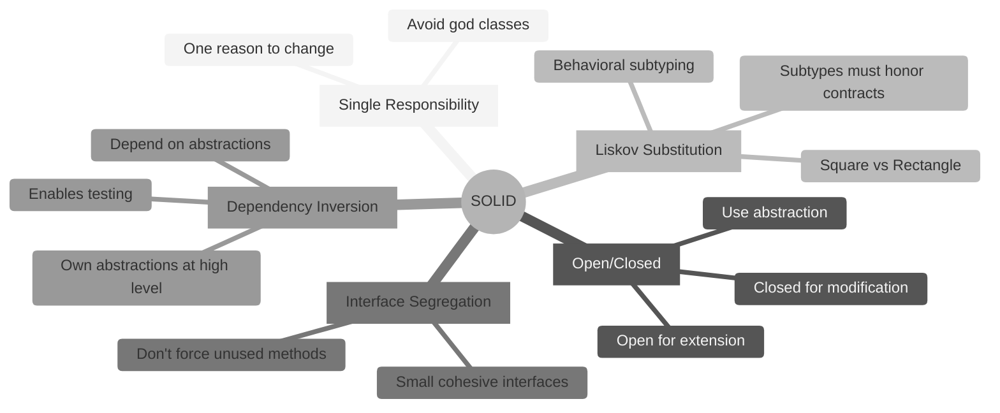
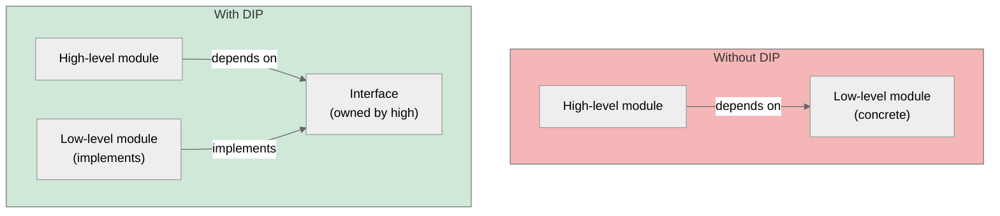
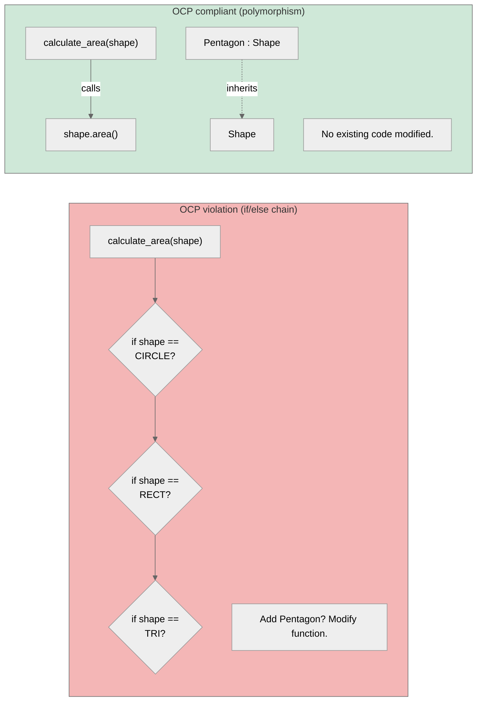
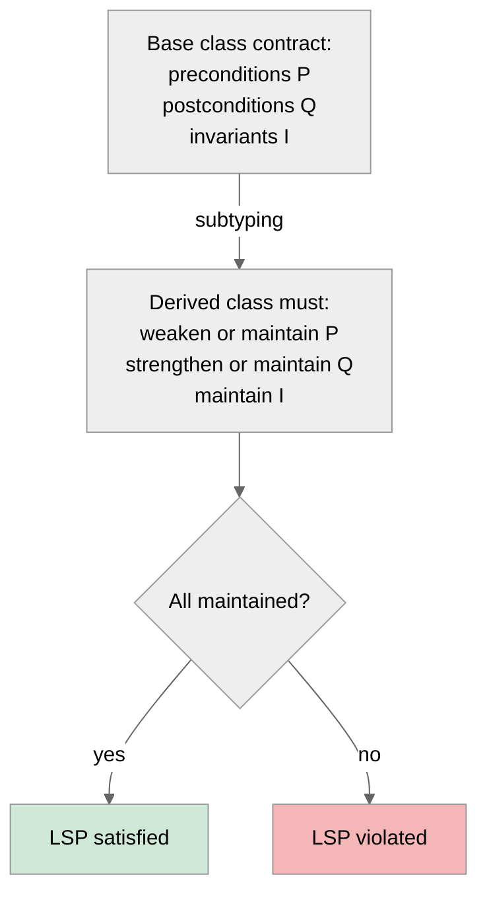

# 5. SOLID Principles

> [!info] Where this fits
> This note connects [[1. Design Patterns Overview]] and the pattern catalogs ([[2. Creational Patterns]], [[3. Structural Patterns]], [[4. Behavioral Patterns]]) to underlying design principles. The next notes cover higher-level concerns: [[6. Software Architecture]] and [[7. Code Quality and Refactoring]].

## Why This Matters

The **SOLID** principles, formulated by Robert C. Martin (Uncle Bob) in the early 2000s and collected in *Agile Software Development, Principles, Patterns, and Practices* (2002), are five design principles intended to make object-oriented designs more maintainable, flexible, and testable. They are not laws — they are heuristics. But the heuristics encode 30+ years of painful experience: codebases that violated them became hard to change; codebases that followed them remained supple.

The five principles:

- **S**ingle Responsibility Principle (SRP)
- **O**pen/Closed Principle (OCP)
- **L**iskov Substitution Principle (LSP)
- **I**nterface Segregation Principle (ISP)
- **D**ependency Inversion Principle (DIP)

Each principle targets a specific failure mode:
- **SRP**: god classes that change for many unrelated reasons.
- **OCP**: changes that ripple through the codebase instead of being localized to new code.
- **LSP**: subclasses that break their base class's contract, producing subtle bugs.
- **ISP**: fat interfaces that force clients to depend on methods they don't use.
- **DIP**: high-level policy coupled to low-level details, making the system hard to test or replace.

SOLID is widely cited, sometimes mocked ("SOLID is just patterns rebranded"), but the underlying observations remain true. Knowing the principles gives you vocabulary for design discussions: "This class violates SRP because it both parses JSON and writes to the database" is more useful than "this class is too big."

## Background

### Where SOLID came from

The five principles were not invented all at once. They emerged from the 1990s OOP community:

- **LSP** (Barbara Liskov, 1987): the oldest, formalized in a keynote at OOPSLA. Liskov's substitution principle is a mathematical statement about subtyping.
- **OCP** (Bertrand Meyer, 1988): introduced in *Object-Oriented Software Construction*. Meyer's "open for extension, closed for modification" is the foundation.
- **SRP, ISP, DIP** (Robert C. Martin, mid-1990s): Martin synthesized these from his consulting experience.

Michael Feathers coined the **SOLID** acronym around 2004 to make the five memorable. The acronym stuck.

### Principles vs patterns vs idioms

- **Principles**: high-level guidance. "Depend on abstractions." Apply everywhere; never fully achieved.
- **Patterns**: mid-level solutions. "Use Factory Method when a class cannot anticipate the class of objects it must create." Apply when the problem fits.
- **Idioms**: low-level, language-specific. "Rule of Five in C++." Apply automatically.

The relationship: principles guide you toward patterns. DIP pushes you toward Dependency Injection, which is implemented via Factory or a DI container. OCP pushes you toward Strategy or Template Method. SRP pushes you toward Facade.

## Main Content

### S — Single Responsibility Principle

> A class should have only one reason to change.

The "reason to change" is a stakeholder or use case. If a class serves multiple actors (the accounting department, the operations team, the user), it has multiple reasons to change, and changes for one actor will affect the others.

#### Bad example

```cpp
class Employee {
public:
    void calculate_pay() { /* accounting logic */ }
    void save_to_database() { /* IT/infrastructure logic */ }
    void generate_report() { /* reporting logic */ }
    std::string format_as_html() { /* UI logic */ }
};
```

This class changes when:
- Accounting rules change.
- The database schema changes.
- Reporting requirements change.
- The UI design changes.

Each change risks breaking the others. The class is a god class.

#### Good example

```cpp
class Employee {  // just data
public:
    std::string name;
    double salary;
    int years_of_service;
};

class PayCalculator {
public:
    double calculate_pay(const Employee&) const;
};

class EmployeeRepository {
public:
    void save(const Employee&);
    std::optional<Employee> find(int id);
};

class EmployeeReporter {
public:
    std::string format_html(const Employee&);
};
```

Now each class has one reason to change. Changes to the database schema do not touch the pay calculator.

#### How to spot SRP violations

- A class with more than 7 public methods (rough heuristic).
- A class whose methods use different subsets of its member variables.
- A class whose file is more than 500 lines (often).
- A class whose name contains "And" or "Manager" or "Helper".

### O — Open/Closed Principle

> Software entities should be open for extension but closed for modification.

You should be able to add new behavior without changing existing code. This is achieved through abstraction: existing code depends on interfaces; new behavior is added by implementing the interface.

#### Bad example

```cpp
double calculate_area(const Shape& s) {
    if (s.type == Shape::CIRCLE) return 3.14159 * s.radius * s.radius;
    if (s.type == Shape::RECTANGLE) return s.width * s.height;
    if (s.type == Shape::TRIANGLE) return 0.5 * s.base * s.height;
    return 0;
}
```

Adding a new shape (e.g., Pentagon) requires modifying this function — violating OCP. Every place that does type-based dispatch must change.

#### Good example

```cpp
class Shape {
public:
    virtual ~Shape() = default;
    virtual double area() const = 0;
};

class Circle : public Shape {
public:
    double area() const override { return 3.14159 * r * r; }
private:
    double r;
};

class Pentagon : public Shape {  // new shape — no existing code modified
public:
    double area() const override { /* ... */ }
};

double calculate_area(const Shape& s) { return s.area(); }
```

Adding `Pentagon` does not modify `calculate_area`. OCP is satisfied.

#### When OCP is over-applied

Forcing every new feature through an interface can produce excessive abstraction. If a feature is added once and never again, a simple `if` is fine. OCP pays off when the axis of change is well-understood (new shapes, new payment methods, new notification channels).

### L — Liskov Substitution Principle

> Subtypes must be substitutable for their base types without altering the correctness of the program.

Barbara Liskov's 1987 formulation: if `S` is a subtype of `T`, then objects of type `T` may be replaced with objects of type `S` without breaking the program.

LSP is about **contracts**. The base class makes promises (preconditions, postconditions, invariants); the derived class must keep them.

#### Classic LSP violation: Square inherits from Rectangle

```cpp
class Rectangle {
public:
    virtual void set_width(int w)  { width_ = w; }
    virtual void set_height(int h) { height_ = h; }
    int width() const { return width_; }
    int height() const { return height_; }
    int area() const { return width_ * height_; }
protected:
    int width_ = 0, height_ = 0;
};

class Square : public Rectangle {
public:
    void set_width(int w) override  { width_ = height_ = w; }
    void set_height(int h) override { width_ = height_ = h; }
};

// Code that works for Rectangle:
void test(Rectangle& r) {
    r.set_width(5);
    r.set_height(4);
    assert(r.area() == 20);  // FAILS for Square: area is 16
}
```

`Square` is mathematically a Rectangle, but `Square` does not satisfy `Rectangle`'s behavioral contract: setting width and height independently. The "is-a" relationship is behavioral, not taxonomic.

#### Other LSP violations

- A derived class throws an exception for a method the base class never throws.
- A derived class accepts a narrower input range than the base (stronger precondition).
- A derived class returns a wider output range than the base (weaker postcondition).
- A derived class has slower performance characteristics that violate implicit contracts (e.g., base class is O(1), derived is O(n)).

#### How to fix

- Don't inherit. Use composition or a different abstraction.
- Make the base class abstract enough that all subtypes can satisfy the contract.
- Use `std::variant` for closed sets of related types.

### I — Interface Segregation Principle

> Clients should not be forced to depend on interfaces they do not use.

Fat interfaces violate ISP. Split them into smaller, cohesive interfaces.

#### Bad example

```cpp
class Machine {
public:
    virtual void print(Document&) = 0;
    virtual void scan(Document&) = 0;
    virtual void fax(Document&) = 0;
};

class SimplePrinter : public Machine {
public:
    void print(Document&) override { /* ... */ }
    void scan(Document&) override { throw std::runtime_error("not supported"); }
    void fax(Document&) override   { throw std::runtime_error("not supported"); }
};
```

`SimplePrinter` is forced to implement `scan` and `fax` even though it cannot do them. Clients of `SimplePrinter` see a fat interface with methods they cannot call.

#### Good example

```cpp
class Printer {
public:
    virtual ~Printer() = default;
    virtual void print(Document&) = 0;
};

class Scanner {
public:
    virtual ~Scanner() = default;
    virtual void scan(Document&) = 0;
};

class Fax {
public:
    virtual ~Fax() = default;
    virtual void fax(Document&) = 0;
};

class SimplePrinter : public Printer {
public:
    void print(Document&) override { /* ... */ }
};

class MultiFunctionMachine : public Printer, public Scanner, public Fax {
    // implements all three
};
```

Now clients depend only on the interface they actually use.

### D — Dependency Inversion Principle

> 1. High-level modules should not depend on low-level modules. Both should depend on abstractions.
> 2. Abstractions should not depend on details. Details should depend on abstractions.

DIP is the foundation of testability. Without it, your code cannot be unit-tested without the real database, the real network, and the real filesystem.

#### Bad example

```cpp
class OrderService {
public:
    void place_order(const Order& o) {
        PostgresDatabase db;          // direct dependency on concrete class
        db.save(o);
        SmtpNotifier notifier;        // direct dependency on concrete class
        notifier.send("order placed");
    }
};
```

`OrderService` depends directly on `PostgresDatabase` and `SmtpNotifier`. To test, you need a real Postgres and a real SMTP server. To switch to MySQL, you must modify `OrderService`.

#### Good example

```cpp
class IDatabase {
public:
    virtual ~IDatabase() = default;
    virtual void save(const Order&) = 0;
};

class INotifier {
public:
    virtual ~INotifier() = default;
    virtual void send(const std::string&) = 0;
};

class OrderService {
public:
    OrderService(IDatabase& db, INotifier& n) : db_(db), notifier_(n) {}
    void place_order(const Order& o) {
        db_.save(o);
        notifier_.send("order placed");
    }
private:
    IDatabase& db_;
    INotifier& notifier_;
};

// Production:
PostgresDatabase db;
SmtpNotifier notifier;
OrderService svc(db, notifier);

// Test:
MockDatabase db;
MockNotifier notifier;
OrderService svc(db, notifier);
```

Now `OrderService` depends on abstractions. Testing is easy. Switching implementations is easy.

#### The two parts of DIP

1. **High-level policy depends on abstractions.** `OrderService` depends on `IDatabase`, not `PostgresDatabase`.
2. **Abstractions are owned by the high-level module.** `IDatabase` is defined in the same module as `OrderService`, not in the database module. The database module implements `IDatabase` — the detail depends on the abstraction.

The second point is subtle and often missed. If `IDatabase` lives in the database module, the high-level module still depends on the database module (for the header). DIP wants ownership inverted: the high-level module owns the interface, the low-level module implements it.

### SOLID in modern C++

Modern C++ idioms implement SOLID principles:

- **`std::function`** implements Strategy (OCP).
- **`std::variant`** + `std::visit` implement closed polymorphism (OCP, ISP).
- **`std::unique_ptr<Interface>`** enables dependency injection (DIP).
- **Concepts (C++20)** express compile-time contracts (LSP for templates).
- **`std::shared_ptr`** and **`std::weak_ptr`** manage shared dependencies safely.

SOLID is not unique to OOP. Functional programming achieves the same goals through different mechanisms (higher-order functions, type classes, immutable data). The principles are universal; the implementations differ.

## Mermaid Diagrams

### SOLID principles overview



### Dependency Inversion flow



### OCP violation vs OCP compliance



### LSP contract preservation



## Code Examples

### SRP: separating concerns

```cpp
// Bad: class does everything
class OrderManager {
public:
    void load_from_db(int id);
    void calculate_total();
    void apply_discount(double pct);
    void save_to_db();
    void send_confirmation_email();
    void print_invoice();
    std::string to_json();
};

// Good: split by responsibility
class Order { /* data */ };
class OrderRepository { /* persistence */ };
class PricingEngine { /* calculation */ };
class EmailService { /* notifications */ };
class InvoicePrinter { /* printing */ };
class OrderSerializer { /* serialization */ };
```

### OCP: Strategy pattern

```cpp
#include <functional>
#include <vector>

class DiscountPolicy {
public:
    virtual ~DiscountPolicy() = default;
    virtual double apply(double total) const = 0;
};

class NoDiscount : public DiscountPolicy {
public:
    double apply(double total) const override { return total; }
};

class PercentageDiscount : public DiscountPolicy {
public:
    explicit PercentageDiscount(double pct) : pct_(pct) {}
    double apply(double total) const override { return total * (1 - pct_); }
private:
    double pct_;
};

class Order {
public:
    void set_discount_policy(std::unique_ptr<DiscountPolicy> p) {
        policy_ = std::move(p);
    }
    double total_after_discount() const {
        return policy_->apply(subtotal_);
    }
private:
    double subtotal_ = 0.0;
    std::unique_ptr<DiscountPolicy> policy_ = std::make_unique<NoDiscount>();
};

// Adding a new discount (e.g., BuyOneGetOne) requires NO changes to Order.
```

### LSP: contract-preserving inheritance

```cpp
// Good: Bird does not include fly() because not all birds fly
class Bird {
public:
    virtual ~Bird() = default;
    virtual double speed() const = 0;  // all birds have a speed
};

class FlyingBird : public Bird {
public:
    virtual double flight_altitude() const = 0;
};

class Sparrow : public FlyingBird {
public:
    double speed() const override { return 40.0; }
    double flight_altitude() const override { return 100.0; }
};

class Penguin : public Bird {  // not a FlyingBird
public:
    double speed() const override { return 10.0; }  // swimming
};
```

Compare to the bad design: `Bird::fly()` virtual, with `Penguin::fly()` throwing. That violates LSP.

### ISP: split interfaces

```cpp
// Bad: fat interface
class Worker {
public:
    virtual void work() = 0;
    virtual void eat() = 0;
    virtual void sleep() = 0;
};

class Robot : public Worker {
public:
    void work() override { /* ... */ }
    void eat() override { throw std::runtime_error("robots don't eat"); }
    void sleep() override { throw std::runtime_error("robots don't sleep"); }
};

// Good: segregated
class Workable { public: virtual ~Workable() = default; virtual void work() = 0; };
class Eatable  { public: virtual ~Eatable() = default;  virtual void eat() = 0; };
class Sleepable{ public: virtual ~Sleepable() = default; virtual void sleep() = 0; };

class Robot : public Workable {
public:
    void work() override { /* ... */ }
};

class Human : public Workable, public Eatable, public Sleepable {
public:
    void work() override { /* ... */ }
    void eat() override { /* ... */ }
    void sleep() override { /* ... */ }
};
```

### DIP: dependency injection

```cpp
// High-level module owns the interface
class IWeatherSource {
public:
    virtual ~IWeatherSource() = default;
    virtual double current_temp() const = 0;
};

class WeatherService {  // high-level
public:
    explicit WeatherService(std::unique_ptr<IWeatherSource> src)
        : source_(std::move(src)) {}
    std::string report() const {
        double t = source_->current_temp();
        return "It's " + std::to_string(t) + " degrees";
    }
private:
    std::unique_ptr<IWeatherSource> source_;
};

// Low-level modules implement the interface (depend on abstraction)
class OpenWeatherSource : public IWeatherSource {
public:
    double current_temp() const override {
        // call api.openweathermap.org
        return 22.0;
    }
};

class MockWeatherSource : public IWeatherSource {
public:
    double current_temp() const override { return 25.0; }
};

// Usage:
WeatherService prod(std::make_unique<OpenWeatherSource>());
WeatherService test(std::make_unique<MockWeatherSource>());
```

## Common Pitfalls

> [!warning] Pitfalls
> - **Dogmatic SOLID application.** Splitting every class into five to satisfy SRP produces fragmentation. Apply SRP when a class actually changes for multiple reasons.
> - **Premature abstraction (OCP).** Adding an interface "in case we might need it" adds complexity without benefit. Apply OCP when a second variant actually emerges.
> - **LSP violations through inheritance.** "A Square is a Rectangle" is the canonical example. Inheritance should model behavioral subtyping, not taxonomic classification.
> - **ISP through over-segregation.** Splitting an interface into ten one-method interfaces makes the system hard to navigate. Cohesion matters; interfaces should be small but coherent.
> - **DIP without ownership inversion.** If your interfaces live in the low-level module, you have not inverted the dependency — you have just renamed it.
> - **SOLID without tests.** SOLID is most valuable when it enables testing. If you apply SOLID but skip tests, you have not realized the benefit.
> - **"SOLID is the goal."** SOLID is a means. The goal is maintainable, flexible, testable code. Apply SOLID where it serves the goal.
> - **Confusing SOLID with patterns.** SOLID is principles; patterns are implementations. They reinforce each other but are not interchangeable.

## Tips and Tricks

> [!tip] Tips
> - When you find yourself adding "and" to a class name (`EmployeeRepositoryAndNotifier`), you have an SRP violation.
> - When you find a switch-on-type chain, consider OCP via Strategy or Visitor.
> - When you find a subclass throwing "not supported," you have an LSP violation.
> - When you find clients depending on methods they don't call, you have an ISP violation.
> - When you find a high-level class instantiating a concrete low-level class (`new ConcreteDatabase()`), you have a DIP violation.
> - Modern C++ reduces the cost of SOLID: `std::function`, `std::variant`, concepts, and smart pointers make abstractions cheap.
> - Use [[16. Testing/4. Mocking with gMock|gMock]] to verify that your DIP abstractions are actually testable. If you cannot mock a dependency, your abstraction is wrong.
> - Read *Clean Architecture* (Robert C. Martin, 2017) for the connection between SOLID and system architecture.
> - Read *C++ Software Design* (Klaus Iglberger, 2022) for modern C++ SOLID applications.
> - Cross-link SOLID to patterns: SRP → Facade; OCP → Strategy/State; LSP → contract design; ISP → interface design; DIP → Factory + DI.

## Active Recall

1. What does each letter in SOLID stand for?
2. Give an example of an SRP violation. How would you fix it?
3. What does "open for extension, closed for modification" mean? Show a code example.
4. Explain the Square/Rectangle LSP violation. Why is "is-a" not enough?
5. Why is `class Robot : public Worker` (where `Worker` has `eat()` and `sleep()`) an ISP violation?
6. Write the two parts of DIP. Why is "own the abstraction at the high level" important?
7. How does `std::function` enable OCP?
8. How does `std::variant` enable OCP for closed sets of types?
9. Why does DIP enable testing?
10. Give an example of dogmatic SOLID application that would harm a codebase.

## Next Steps

- This note completes the SOLID sub-series. Loop back to [[1. Design Patterns Overview]] to see how patterns implement SOLID.
- Continue to [[6. Software Architecture]] for system-level SOLID applications (layered architecture, hexagonal architecture).
- Then [[7. Code Quality and Refactoring]] — SOLID violations are code smells; the path to SOLID is refactoring.
- Cross-link to [[2. Creational Patterns]] — Factory and Abstract Factory implement DIP.
- Cross-link to [[4. Behavioral Patterns]] — Strategy implements OCP; State implements OCP; Template Method implements OCP.
- Cross-link to [[9. Object-Oriented Programming/4. Polymorphism and Virtual Functions]] — polymorphism is the runtime mechanism behind OCP and DIP.
- Cross-link to [[16. Testing/1. Testing Concepts]] — SOLID is what makes unit testing possible.
