# 6. Software Architecture

> [!info] Where this fits
> This note is the system-level view. It builds on the patterns ([[1. Design Patterns Overview]], [[2. Creational Patterns]], [[3. Structural Patterns]], [[4. Behavioral Patterns]]) and principles ([[5. SOLID Principles]]) covered earlier in the chapter. The next and final note is [[7. Code Quality and Refactoring]].

## Why This Matters

If patterns are tactics, architecture is strategy. Architecture decides:
- How many deployable units you have (monolith vs microservices).
- How they communicate (synchronous RPC, async events, shared DB).
- How dependencies flow (layered, hexagonal, ports & adapters).
- How data is partitioned (per-service, shared, event-sourced).
- How the system scales (stateless web tier, sharded DB, CDN).

These decisions are expensive to reverse. Rewriting a monolith into microservices is months of work. Replacing a synchronous RPC architecture with event sourcing is a multi-quarter migration. Picking the wrong architecture for your problem is a multi-year tax on every feature.

This note covers the major architectural patterns in industry use today: layered, MVC/MVP/MVVM, repository, dependency injection, modular monolith, microservices, event-driven, CQRS, event sourcing. It is a survey, not a deep dive — each topic could fill a book. The goal is vocabulary and trade-offs.

## Background

### What is software architecture?

Software architecture is the set of significant design decisions that shape a system, where "significant" means: costly to change. Architecture encompasses:

- **Component decomposition**: what are the major pieces, and what are their boundaries?
- **Interaction mechanisms**: how do the pieces communicate?
- **Data management**: where does state live, and how is it accessed?
- **Cross-cutting concerns**: how are logging, security, observability, configuration handled?
- **Quality attributes**: how do we meet performance, scalability, availability, security requirements?

Architecture is distinguished from design by scope: architecture is the high-level structure; design is the local structure of individual components. The line is fuzzy; both matter.

### The architecture trade-off space

Every architectural decision trades one quality for another:

| Want more...         | Often sacrifice...           |
| -------------------- | ---------------------------- |
| Latency              | Throughput                   |
| Consistency          | Availability (CAP theorem)  |
| Scalability          | Simplicity                   |
| Decoupling           | Performance (extra hops)    |
| Flexibility          | Performance (abstractions)  |
| Auditability         | Latency (logging overhead)  |

There is no free lunch. A good architect makes these trade-offs **explicitly**, with awareness of the costs. A bad architect makes them accidentally, by choosing the fashionable technology of the month.

## Main Content

### Layered architecture

The most common architecture. The system is divided into horizontal layers, each depending only on the layer below:

```
┌─────────────────────────────┐
│   Presentation (UI/API)     │
├─────────────────────────────┤
│   Business logic            │
├─────────────────────────────┤
│   Persistence (data access) │
├─────────────────────────────┤
│   Database                  │
└─────────────────────────────┘
```

A web application typically has:
- **Presentation**: HTTP handlers, controllers, views.
- **Business**: services, domain logic.
- **Persistence**: repositories, ORM mappings.
- **Database**: actual storage.

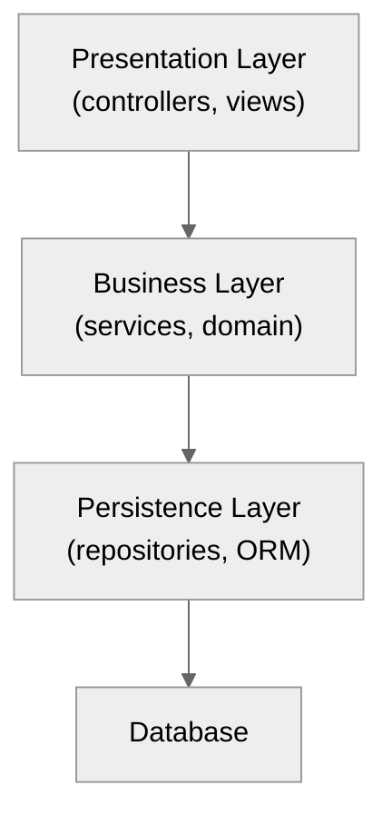

**Pros:** simple, well-understood, easy to organize teams by layer.
**Cons:** layers can become "pass-through" shells; changes ripple through all layers; hard to scale independently.

### MVC, MVP, MVVM

UI-specific architectures for separating presentation from logic.

#### MVC (Model-View-Controller)

The original (Trygve Reenskaug, 1979, Smalltalk). The controller mediates between the model and the view.

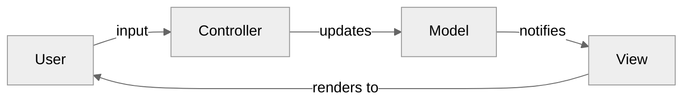

- **Model**: domain data and logic.
- **View**: renders the model to the user.
- **Controller**: handles user input, updates the model.

#### MVP (Model-View-Presenter)

The presenter (not the controller) handles input and updates the view through an interface. The view is passive.

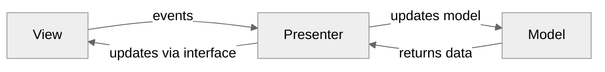

The view is more testable (the presenter talks to an `IView` interface that can be mocked). Used in Android (historically), WinForms.

#### MVVM (Model-View-ViewModel)

The view-model exposes data and commands that the view binds to (via data binding). No direct reference from view to view-model.

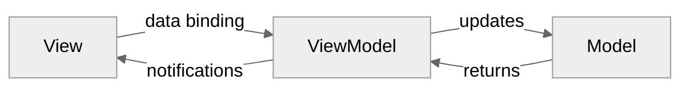

The view-model is fully testable (it has no UI dependencies). Used in WPF, Xamarin, modern Android, iOS Swift UI.

### Repository pattern

Mediates between the domain and data mapping layers using a collection-like interface.

```cpp
template <typename T, typename Id>
class Repository {
public:
    virtual ~Repository() = default;
    virtual std::optional<T> find(Id) = 0;
    virtual std::vector<T> find_all() = 0;
    virtual void save(const T&) = 0;
    virtual void remove(Id) = 0;
};

class SqlOrderRepository : public Repository<Order, int> {
public:
    std::optional<Order> find(int id) override {
        // SELECT * FROM orders WHERE id = ?
    }
    // ...
};
```

**Why:** the domain layer depends on `Repository<Order, int>`, not on SQL. You can swap SQL for in-memory, file-based, or a different DB without touching the domain.

### Service pattern

A service encapsulates a use case that does not belong to a single entity. Order placement, for example, involves the Order, Customer, Inventory, and Payment entities — none of which "owns" the workflow.

```cpp
class OrderService {
public:
    OrderService(OrderRepo&, CustomerRepo&, InventoryRepo&, PaymentGateway&);
    Result<Order> place_order(const PlaceOrderCommand&);
};
```

Services orchestrate multiple repositories and other services. They are the unit of business logic in a layered architecture.

### Dependency injection

Already covered in [[5. SOLID Principles]] (DIP) and [[2. Creational Patterns]]. At the architectural level, DI means: **the composition root** (typically `main`) is the only place that knows about concrete classes. Every other module depends on abstractions.

```cpp
// main.cpp — the composition root
int main() {
    auto config = load_config();
    auto db = std::make_shared<PostgresOrderRepo>(config.db);
    auto gateway = std::make_shared<StripePaymentGateway>(config.stripe);
    auto notifier = std::make_shared<SmtpNotifier>(config.smtp);

    OrderService svc(db, gateway, notifier);
    HttpServer server(svc);
    server.run();
}
```

For large applications, a DI container (e.g., `boost::di`) automates this wiring.

### Modular monolith

A monolith (single deployable unit) that is internally structured as modules with strict boundaries. Each module has its own schema, services, and public interface. Modules communicate via in-process APIs (not direct database access).

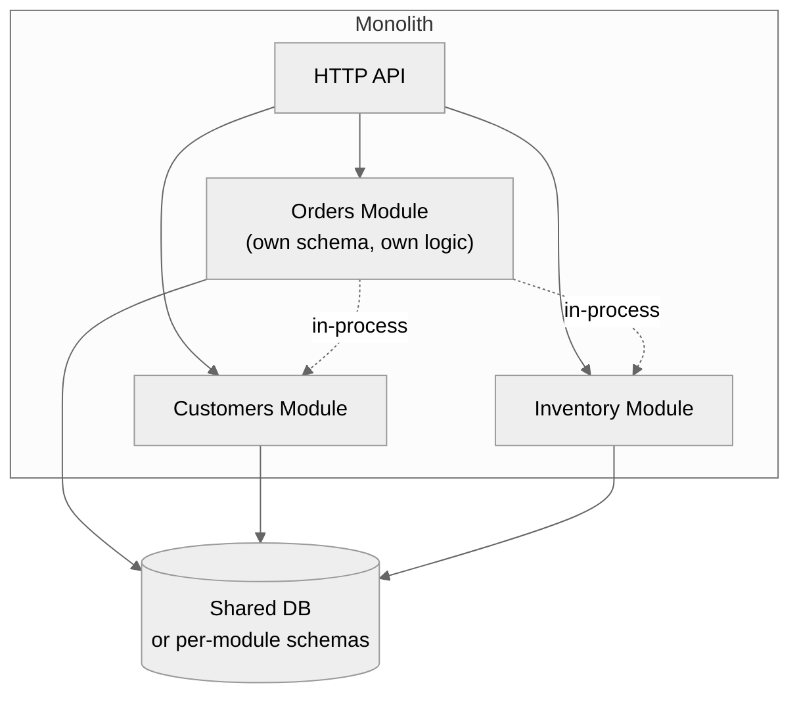

**Why:** the simplicity of a monolith (one deployment, one process, easy debugging) with the maintainability of services (clear module boundaries, team ownership). Used by Shopify, GitHub, Basecamp.

The discipline is critical: modules must not access each other's database tables or private types. Without that, you have a Big Ball of Mud.

### Microservices

The system is decomposed into many small services, each owned by a small team, independently deployable, communicating via network calls (typically HTTP/REST, gRPC, or async events).

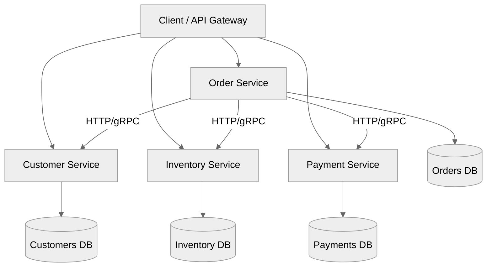

**Pros:**
- Independent deployment and scaling.
- Team autonomy (Conway's law: organizations design systems that mirror their communication structure).
- Technology heterogeneity (each service can use the right tool).
- Fault isolation (one service crashing does not crash others).

**Cons:**
- Distributed system complexity (network failures, partial failures, eventual consistency).
- Operational overhead (CI/CD, observability, service discovery for each service).
- Performance overhead (network hops vs in-process calls).
- Transactional complexity (a single business operation may span services).

**When microservices are wrong:** most of the time. Martin Fowler's "monolith-first" advice: build a monolith first, split into microservices only when you hit scaling or organizational limits. Premature microservices are a disaster.

### Event-driven architecture

Producers emit events; consumers react. Decouples producers from consumers.

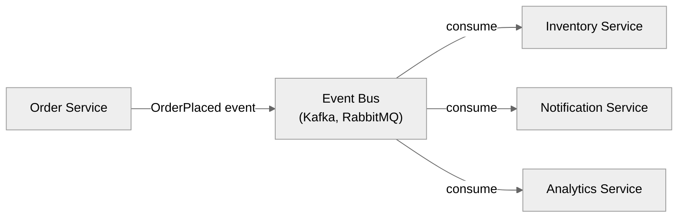

**Pros:**
- Producers and consumers are decoupled. Adding a new consumer requires no change to the producer.
- Natural fan-out: one event triggers N reactions.
- Temporal decoupling: consumer can process asynchronously.

**Cons:**
- Harder to reason about ("what happens when an OrderPlaced event is emitted?").
- Eventual consistency (the inventory may not be updated immediately).
- Retry, idempotency, and ordering become critical.
- Auditing and debugging are harder.

Used in: e-commerce (order events), banking (transaction events), IoT (sensor readings), analytics pipelines.

### CQRS (Command Query Responsibility Segregation)

Separate the **write side** (commands) from the **read side** (queries). Often combined with event sourcing.

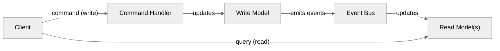

**Why:** reads and writes have different shapes. A write needs strict validation; a read needs fast joins across many tables. Separating them lets you optimize each side.

**When to use:** high read-to-write ratio (e.g., social media feeds, dashboards), complex read models, eventual consistency acceptable.

### Event sourcing

Instead of storing the current state, store the **sequence of events** that produced it. Current state is materialized by replaying events.

```cpp
// Events (immutable, append-only log)
struct AccountOpened { std::string owner; int initial_balance; };
struct AmountDeposited { int amount; };
struct AmountWithdrawn { int amount; };

// State (materialized from events)
struct AccountState {
    std::string owner;
    int balance = 0;
};

AccountState apply(const AccountState& s, const AccountOpened& e) {
    return {e.owner, e.initial_balance};
}
AccountState apply(const AccountState& s, const AmountDeposited& e) {
    AccountState next = s;
    next.balance += e.amount;
    return next;
}
AccountState apply(const AccountState& s, const AmountWithdrawn& e) {
    AccountState next = s;
    next.balance -= e.amount;
    return next;
}
```

**Pros:**
- Complete audit log (every state change is recorded).
- Time travel (reconstruct state at any past point).
- Easy to add new read models (replay events with new logic).
- Natural fit with event-driven architectures.

**Cons:**
- Complexity (event versioning, schema evolution, snapshots).
- Storage (event log grows forever).
- Eventual consistency (read models lag the write model).
- Hard to query the "current state" without materializing it.

Used in: financial systems, betting/gambling, inventory tracking, some CRM systems.

### Hexagonal architecture (Ports and Adapters)

Alistair Cockburn, 2005. The domain is at the center; it defines **ports** (interfaces) for interacting with the outside world. **Adapters** (database, UI, external APIs) plug into the ports. The domain has no knowledge of adapters.

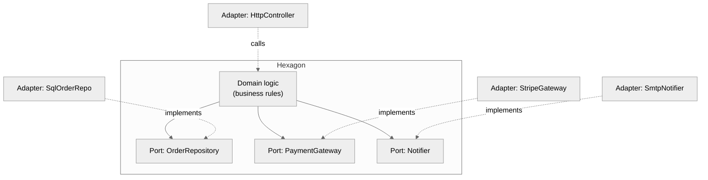

**Why:** the domain is testable in isolation (use mock adapters). The domain is portable across UIs, databases, external services. This is the architectural embodiment of DIP.

### Clean architecture

Robert C. Martin's variant: concentric circles with the domain at the center, dependencies pointing inward.

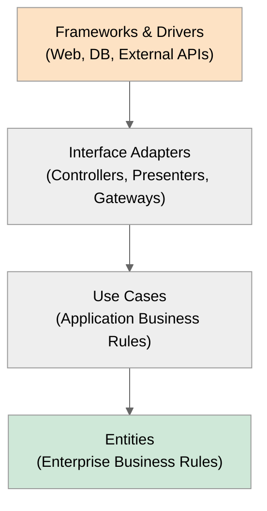

The dependency rule: dependencies point inward only. The core knows nothing about the outer layers.

### Serverless and FaaS

Functions-as-a-Service (AWS Lambda, Google Cloud Functions, Azure Functions) — the cloud provider manages servers; you write stateless functions that respond to events.

**Pros:** no server management, scale to zero, pay-per-use.
**Cons:** cold-start latency, hard to debug, vendor lock-in, state management challenges, hard to test locally.

Often combined with event-driven architecture: S3 upload → Lambda → DynamoDB.

## Mermaid Diagrams

### Layered architecture

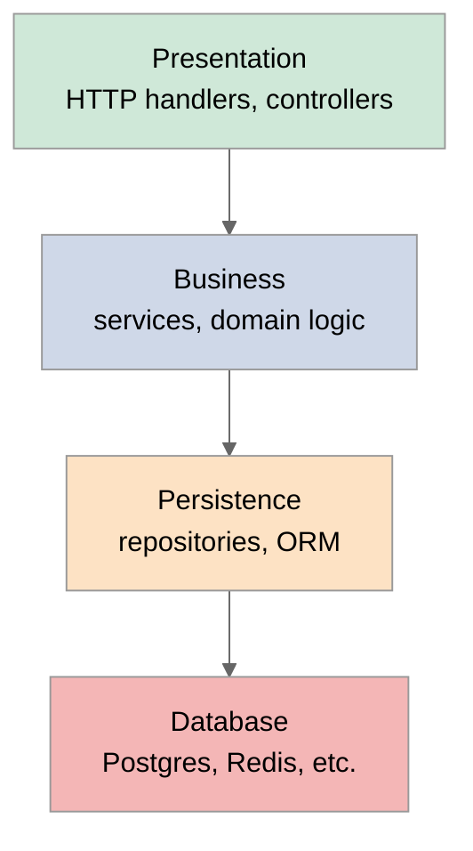

### Monolith vs microservices

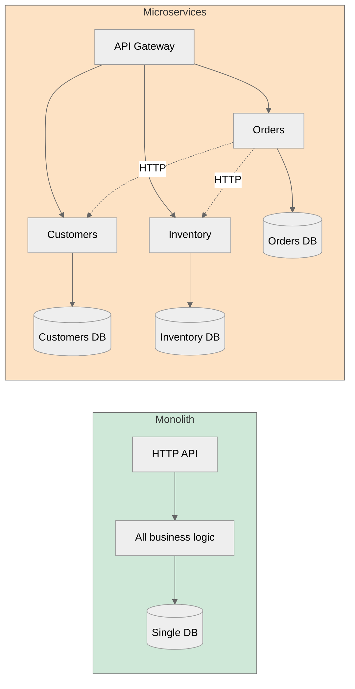

### Event-driven with CQRS

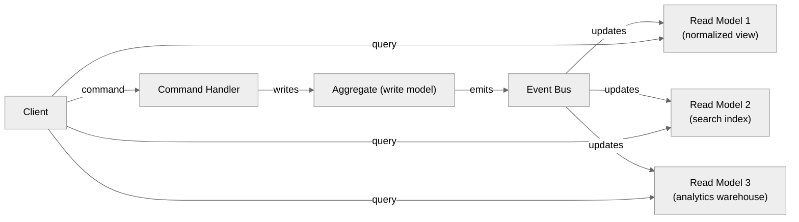

### Clean architecture layers

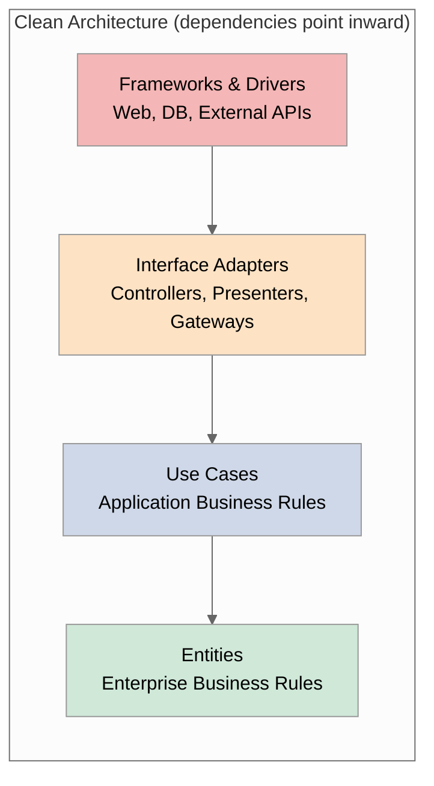

## Code Examples

### Layered architecture skeleton

```cpp
// Domain layer
class Order {
public:
    int id;
    std::vector<OrderLine> lines;
    double total() const;
};

// Persistence layer
class IOrderRepository {
public:
    virtual ~IOrderRepository() = default;
    virtual std::optional<Order> find(int id) = 0;
    virtual void save(const Order&) = 0;
};

class SqlOrderRepository : public IOrderRepository {
public:
    explicit SqlOrderRepository(SqlConnection& c) : conn_(c) {}
    std::optional<Order> find(int id) override { /* SELECT */ }
    void save(const Order&) override { /* INSERT/UPDATE */ }
private:
    SqlConnection& conn_;
};

// Service layer (business logic)
class OrderService {
public:
    OrderService(IOrderRepository& repo, INotifier& n)
        : repo_(repo), notifier_(n) {}
    void place_order(Order& o) {
        if (o.total() <= 0) throw std::invalid_argument("invalid total");
        repo_.save(o);
        notifier_.send("Order " + std::to_string(o.id) + " placed");
    }
private:
    IOrderRepository& repo_;
    INotifier& notifier_;
};

// Presentation layer
class OrderController {
public:
    explicit OrderController(OrderService& svc) : svc_(svc) {}
    HttpResponse handle_post(const HttpRequest& req) {
        Order o = parse_order(req.body());
        svc_.place_order(o);
        return HttpResponse::ok(json(o));
    }
private:
    OrderService& svc_;
};

// Composition root (main)
int main() {
    SqlConnection conn("...");
    SqlOrderRepository repo(conn);
    SmtpNotifier notifier(...);
    OrderService svc(repo, notifier);
    OrderController ctrl(svc);
    HttpServer server(ctrl);
    server.run();
}
```

### Repository pattern with multiple backends

```cpp
template <typename T, typename Id>
class IRepository {
public:
    virtual ~IRepository() = default;
    virtual std::optional<T> find(Id) = 0;
    virtual std::vector<T> find_all() = 0;
    virtual void save(const T&) = 0;
};

template <typename T, typename Id>
class InMemoryRepository : public IRepository<T, Id> {
public:
    std::optional<T> find(Id id) override {
        auto it = data_.find(id);
        return it != data_.end() ? std::optional<T>{it->second} : std::nullopt;
    }
    std::vector<T> find_all() override {
        std::vector<T> v;
        for (const auto& [_, t] : data_) v.push_back(t);
        return v;
    }
    void save(const T& t) override { data_[t.id] = t; }
private:
    std::unordered_map<Id, T> data_;
};
```

The same `IRepository` interface; `InMemoryRepository` for tests, `SqlOrderRepository` for production.

### Event-driven publisher/consumer

```cpp
struct OrderPlaced {
    int order_id;
    std::string customer_id;
    double total;
};

class IEventBus {
public:
    virtual ~IEventBus() = default;
    virtual void publish(const std::string& channel, const std::string& payload) = 0;
    virtual void subscribe(const std::string& channel,
                           std::function<void(const std::string&)> handler) = 0;
};

class OrderService {
public:
    OrderService(IOrderRepository& repo, IEventBus& bus)
        : repo_(repo), bus_(bus) {}

    void place_order(Order& o) {
        repo_.save(o);
        OrderPlaced e{o.id, o.customer_id, o.total()};
        bus_.publish("orders", serialize(e));
    }
private:
    IOrderRepository& repo_;
    IEventBus& bus_;
};

class InventoryProjector {
public:
    explicit InventoryProjector(IEventBus& bus) {
        bus_.subscribe("orders", [this](const std::string& payload) {
            handle_order_placed(deserialize<OrderPlaced>(payload));
        });
    }
private:
    void handle_order_placed(const OrderPlaced& e) {
        // Update inventory projections
    }
    IEventBus& bus_;
};
```

### Event sourcing aggregate

```cpp
class BankAccount {
public:
    std::vector<Event> uncommitted_events;

    static BankAccount from_history(const std::vector<Event>& history) {
        BankAccount a;
        for (const auto& e : history) a.apply(e);
        a.uncommitted_events.clear();
        return a;
    }

    void deposit(int amount) {
        if (amount <= 0) throw std::invalid_argument("positive only");
        AmountDeposited e{amount};
        apply(e);
        uncommitted_events.push_back(e);
    }

    void withdraw(int amount) {
        if (amount <= 0) throw std::invalid_argument("positive only");
        if (balance_ < amount) throw std::runtime_error("insufficient funds");
        AmountWithdrawn e{amount};
        apply(e);
        uncommitted_events.push_back(e);
    }

    int balance() const { return balance_; }

private:
    void apply(const Event& e) {
        std::visit([this](auto&& ev) {
            using T = std::decay_t<decltype(ev)>;
            if constexpr (std::is_same_v<T, AccountOpened>) {
                owner_ = ev.owner;
                balance_ = ev.initial_balance;
            } else if constexpr (std::is_same_v<T, AmountDeposited>) {
                balance_ += ev.amount;
            } else if constexpr (std::is_same_v<T, AmountWithdrawn>) {
                balance_ -= ev.amount;
            }
        }, e);
    }

    std::string owner_;
    int balance_ = 0;
};
```

## Common Pitfalls

> [!warning] Pitfalls
> - **Premature microservices.** Most teams should start with a modular monolith and split only when scaling demands it. Premature microservices multiply operational complexity.
> - **Layer leakage.** When the business layer reaches into the database layer's types, the abstraction is broken. Each layer should expose only its own types.
> - **Anemic domain model.** A "domain" that is just data with no behavior, plus services that operate on it. Move behavior into the entities.
> - **God service.** A service that handles 20 unrelated use cases. Split by responsibility.
> - **Cross-database joins.** In microservices, joining data across services requires either data duplication or API composition. Both are expensive.
> - **Distributed monolith.** Services that must be deployed together, share a database, or call each other synchronously in tight loops. You have the costs of microservices and the constraints of a monolith.
> - **Event-driven without idempotency.** If consumers do not handle duplicate events (which always happen eventually), they corrupt state.
> - **Event sourcing without snapshots.** Replaying 10 million events to compute the current state is slow. Snapshot periodically.
> - **Tight coupling to a cloud provider.** Serverless functions calling provider-specific APIs directly. Wrap them in ports/adapters.
> - **No composition root.** Each module creating its own dependencies means no central place to swap implementations for testing.

## Tips and Tricks

> [!tip] Tips
> - Start with a layered monolith. Add patterns (repository, services) as the code grows. Consider microservices only when scaling demands it.
> - Make modules within a monolith strictly independent: separate schemas, no direct calls between modules, communication via in-process APIs.
> - Define clear interfaces (ports) at module boundaries. Hexagonal / Clean architecture makes this concrete.
> - For event-driven systems, make all consumers idempotent. Events will be redelivered.
> - For CQRS, accept eventual consistency. Read models lag the write model; clients must tolerate it.
> - For event sourcing, version your events. Schema evolution is hard; plan for it from day one.
> - For serverless, factor out provider-specific code into adapters. Keep the core logic portable.
> - Read *Designing Data-Intensive Applications* (Martin Kleppmann, 2017) — the best single book on distributed data architecture.
> - Read *Clean Architecture* (Robert C. Martin, 2017) — the principles applied at system scale.
> - Read *Building Microservices* (Sam Newman, 2nd ed., 2021) — when and how to split.
> - Read *Software Architecture: The Hard Parts* (Ford, Richards, et al., 2021) — trade-offs in distributed systems.
> - The right architecture depends on context: team size, organizational structure, scaling needs, regulatory requirements. There is no universal best.

## Active Recall

1. What is the difference between architecture and design?
2. List the layers of a typical layered architecture.
3. Compare MVC, MVP, and MVVM. When would you use each?
4. Why is the Repository pattern useful? What SOLID principle does it support?
5. What is a "composition root" in dependency injection?
6. What is a modular monolith? How does it differ from a "Big Ball of Mud"?
7. List three pros and three cons of microservices.
8. Why does Martin Fowler recommend "monolith-first"?
9. What is CQRS? When is it appropriate?
10. What is event sourcing? Give an example of an event type.
11. What does "ports and adapters" mean in hexagonal architecture?
12. Why must event consumers be idempotent?
13. What is the CAP theorem? What does it imply for distributed systems?

## Next Steps

- This is the penultimate note in the SWE chapter. The final note is [[7. Code Quality and Refactoring]].
- Loop back to [[5. SOLID Principles]] — SOLID is the foundation; architecture is SOLID applied at scale.
- Cross-link to [[2. Creational Patterns]] — DI and Factory patterns implement the composition root.
- Cross-link to [[3. Structural Patterns]] — Facade is a mini-architecture; Adapter mediates between modules.
- Cross-link to [[4. Behavioral Patterns]] — Observer/Event bus is the foundation of event-driven architecture.
- Cross-link to [[17. Networking/1. Network Fundamentals]] — microservices are networked systems; understanding networking is essential.
- Cross-link to [[14. Concurrency and Multithreading]] — concurrent architectures (thread-per-request, event-loop, actor model) are architectural choices.
- Cross-link to [[12. Build Systems and Project Structure]] — module boundaries in CMake map to architectural boundaries.
