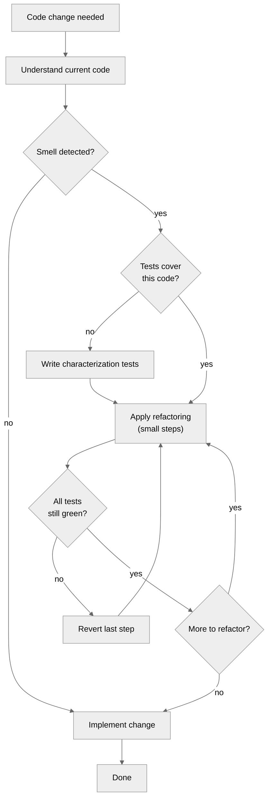
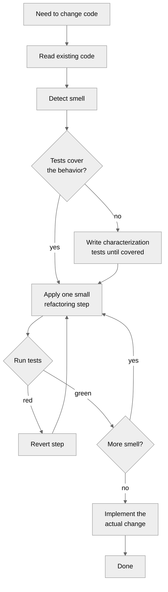
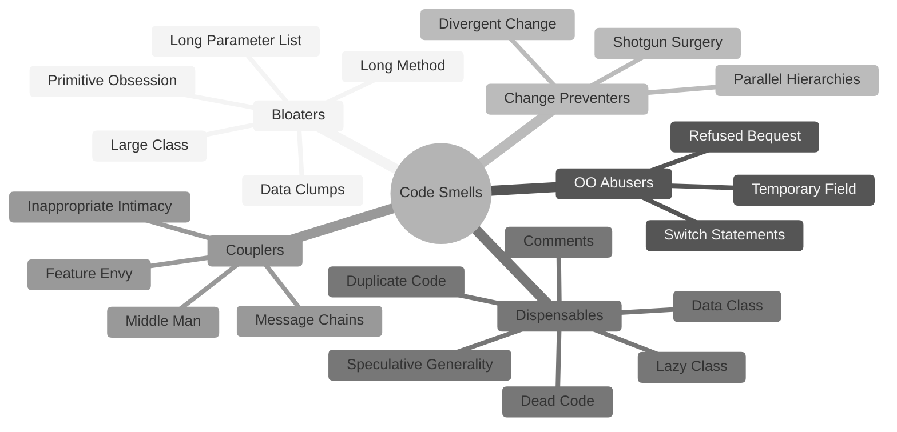
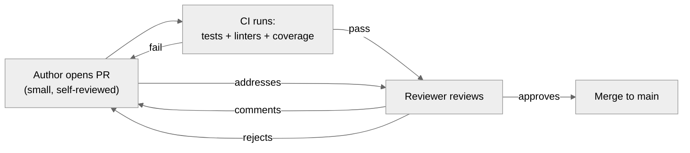
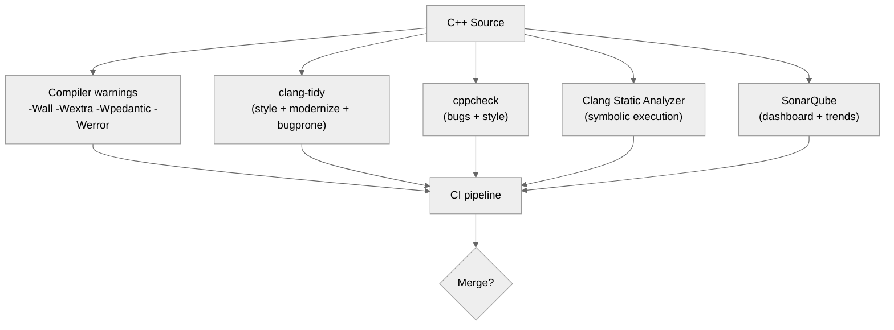

# 7. Code Quality and Refactoring

> [!info] Where this fits
> This is the final note in the SWE chapter. It builds on everything before it — [[1. Design Patterns Overview]], [[2. Creational Patterns]], [[3. Structural Patterns]], [[4. Behavioral Patterns]], [[5. SOLID Principles]], [[6. Software Architecture]] — because refactoring is the practical activity of moving a codebase toward those ideals. Cross-link to [[16. Testing/1. Testing Concepts]] — refactoring without tests is madness.

## Why This Matters

Code rots. Even well-designed code accumulates cruft: features are added under deadline pressure, bugs are fixed hastily, technology drifts. Without active maintenance, the codebase becomes harder to read, harder to test, harder to change. Eventually, the team suggests a rewrite — and rewrites are how projects die.

**Refactoring** (Martin Fowler, *Refactoring: Improving the Design of Existing Code*, 1999; 2nd ed. 2018) is the disciplined alternative: small, behavior-preserving transformations that improve the code's structure without changing its observable behavior. Refactoring is to code what exercise is to the body: not a one-time event but a continuous practice.

This note covers:
- **Code smells**: the symptoms of poor design that invite refactoring.
- **Refactoring catalog**: the named transformations (Extract Method, Move Method, etc.).
- **Naming conventions**: the cheapest quality improvement.
- **Comments**: when they help, when they hurt.
- **Static analysis tools**: clang-tidy, cppcheck, SonarQube.
- **Code review**: how to give and receive feedback.
- **The refactoring workflow**: how to refactor safely with tests.

## Background

### What is refactoring?

Refactoring is **not**:
- Rewriting (replacing a component from scratch).
- Restructuring (changing structure without preserving behavior).
- Optimizing (improving performance, possibly changing structure).

Refactoring **is**:
- A behavior-preserving transformation.
- Small (one step at a time).
- Testable (the test suite must stay green throughout).
- Named (each refactoring has a name, like a design pattern).

The discipline of small steps + tests is what makes refactoring safe. Without tests, "refactoring" is gambling. Without small steps, "refactoring" is rewriting.

### The economics of refactoring

Refactoring is sometimes criticized as "polishing code instead of adding features." This misses the compounding cost of bad code. A codebase where adding a feature takes 2 weeks (because you must first understand the existing mess) costs more than a codebase where adding the same feature takes 3 days (because the design is clean). The 2-week version is a tax on every future feature. The 3-day version frees up the team to ship more, faster.

Ward Cunningham's "technical debt" metaphor: bad code is like financial debt. You borrow time now (by writing quick code); you pay interest later (in slower feature development). Refactoring is paying down principal. The discipline is knowing when to take on debt (a demo, a deadline) and when to pay it down (after the demo, before the next feature).

### The refactoring workflow



The critical loop: **make a small change → run tests → if red, revert → if green, continue**. Each step is reversible. Each step preserves behavior.

## Main Content

### Code smells

A **code smell** is a surface indication of a deeper problem. Smells are not bugs; they are warning signs. Martin Fowler's catalog (from *Refactoring*) groups smells by category.

#### Bloaters

Code that has grown so large it cannot be effectively worked with.

- **Long Method**: a method more than ~10 lines is suspect. Extract sub-methods.
- **Large Class**: a class doing too many things (SRP violation). Split.
- **Primitive Obsession**: using `int` for IDs, `std::string` for phone numbers, `double` for money. Use small classes (`PhoneNumber`, `Money`) with validation.
- **Long Parameter List**: more than 3-4 parameters. Group related parameters into objects ("Parameter Object").
- **Data Clumps**: the same group of parameters (`street, city, zip, country`) appearing in many functions. Extract to an `Address` class.

#### Object-Orientation Abusers

- **Switch Statements**: long `switch` chains or `if/else if` ladders on a type field. Replace with polymorphism (Strategy, State).
- **Temporary Field**: a field that is null most of the time, set only during a specific operation. Extract a smaller class for that operation.
- **Refused Bequest**: a subclass that does not want the parent's behavior. Either remove the inheritance, or use composition instead.
- **Alternative Classes with Different Interfaces**: two classes doing the same thing with different method names. Unify the interface.

#### Change Preventers

- **Divergent Change**: one class changes for many different reasons (SRP violation). Extract class.
- **Shotgun Surgery**: one change requires touching many classes. Move methods/fields to consolidate.
- **Parallel Inheritance Hierarchies**: every time you add a subclass in one hierarchy, you must add one in another. Combine the hierarchies or apply one-to-one mappings.

#### Dispensables

- **Comments**: comments that explain what the code does (instead of why) often mean the code is unclear. Refactor to make the code self-documenting.
- **Duplicate Code**: copy-pasted code. Extract method or extract class.
- **Lazy Class**: a class that does too little to justify its existence. Inline it.
- **Data Class**: a class with only fields and getters/setters, no behavior. Move behavior into it (Information Expert pattern).
- **Dead Code**: variables, parameters, methods, classes that are never used. Delete.
- **Speculative Generality**: abstractions "in case we might need them." Delete until needed (YAGNI).

#### Couplers

- **Feature Envy**: a method that uses another class's data more than its own. Move the method.
- **Inappropriate Intimacy**: two classes that know too much about each other's internals. Hide internals, use cleaner interfaces.
- **Message Chains**: `a.getB().getC().getD().doSomething()` — the client depends on the entire chain. Hide the chain behind a method on `a`.
- **Middle Man**: a class that just delegates to another. Either remove it or give it real responsibility.

### The refactoring catalog

Fowler's catalog contains 60+ named refactorings. The most-used:

#### Extract Method

Turn a fragment of a method into a new method with a descriptive name.

```cpp
// Before
void print_owing() {
    double outstanding = 0;
    std::cout << "*****\n";
    std::cout << "Customer owes\n";
    std::cout << "*****\n";
    for (auto& e : orders_) outstanding += e.amount();
    std::cout << "name: " << name_ << "\n";
    std::cout << "amount: " << outstanding << "\n";
}

// After
void print_owing() {
    print_banner();
    double outstanding = calculate_outstanding();
    print_details(outstanding);
}
void print_banner() {
    std::cout << "*****\nCustomer owes\n*****\n";
}
double calculate_outstanding() {
    double total = 0;
    for (auto& e : orders_) total += e.amount();
    return total;
}
void print_details(double outstanding) {
    std::cout << "name: " << name_ << "\n";
    std::cout << "amount: " << outstanding << "\n";
}
```

Extract Method is the workhorse of refactoring. Most other refactorings end with it.

#### Inline Method

The reverse: a method whose body is clearer than its name. Inline it.

```cpp
// Before
int get_rating() { return more_than_five_late_deliveries() ? 2 : 1; }
bool more_than_five_late_deliveries() { return late_deliveries_ > 5; }

// After
int get_rating() { return late_deliveries_ > 5 ? 2 : 1; }
```

#### Extract Class / Inline Class

Split a class doing too much into two; or merge two tightly-coupled classes into one.

#### Move Method / Move Field

Move a method or field from one class to another where it belongs (often the class it uses most — fixes Feature Envy).

#### Rename Method

Rename for clarity. The cheapest, highest-leverage refactoring.

```cpp
// Before
double calc(double p, double r, int n) { return p * r * n; }

// After
double compute_simple_interest(double principal, double rate, int years) {
    return principal * rate * years;
}
```

#### Replace Conditional with Polymorphism

Turn a switch-on-type into a polymorphic hierarchy.

```cpp
// Before
double calculate_speed() {
    switch (type_) {
        case EUROPEAN: return base_speed();
        case AFRICAN: return base_speed() - load_factor_ * number_of_coconuts_;
        case NORWEGIAN: return is_nailed_ ? 0 : base_speed(voltage_);
    }
}

// After — use Strategy pattern with EuropeanSpeed, AfricanSpeed, NorwegianSpeed
```

#### Replace Method with Method Object

A long method with many local variables is hard to extract. Wrap the method in a class, where the locals become fields, then refactor the class.

#### Introduce Parameter Object

Group parameters that travel together into a struct.

```cpp
// Before
void draw_line(double x1, double y1, double x2, double y2, Color c, double width);
void draw_rect(double x, double y, double w, double h, Color c, double width);

// After
struct Point { double x, y; };
struct Style { Color color; double width; };
void draw_line(Point a, Point b, Style s);
void draw_rect(Point origin, double w, double h, Style s);
```

#### Replace Magic Number with Named Constant

```cpp
// Before
double potential_energy(double mass, double height) {
    return mass * 9.81 * height;
}

// After
constexpr double kGravity = 9.81;  // m/s^2
double potential_energy(double mass, double height) {
    return mass * kGravity * height;
}
```

#### Decompose Conditional

Extract the condition and the branches into named methods.

```cpp
// Before
if (date.before(SUMMER_START) || date.after(SUMMER_END)) {
    charge = quantity * winter_rate + winter_service_charge;
} else {
    charge = quantity * summer_rate;
}

// After
if (not_summer(date)) {
    charge = winter_charge(quantity);
} else {
    charge = summer_charge(quantity);
}
```

### Naming conventions

Good names are the cheapest quality improvement. Code is read 10x more than it is written; names are the primary interface to the reader.

#### Principles

- **Reveal intent.** `days_since_creation` is better than `d`.
- **Avoid disinformation.** `account_list` should be a list, not a tree. If it is a tree, call it `account_tree` or `accounts`.
- **Make meaningful distinctions.** `Product`, `ProductInfo`, `ProductData` are not distinguishable. Pick one.
- **Use pronounceable names.** `gen_stamp` is worse than `generation_timestamp`.
- **Use searchable names.** Single-letter names are hard to search for. Names should be long enough to grep for.
- **Avoid encodings.** `m_count`, `i_index`, `str_name` — Hungarian notation is dead for typed languages.
- **Member prefixes** like `m_` or `_` are debatable. Pick a convention and stick to it; modern style guides (Google C++ Style Guide) prefer `m_` or `_` suffix.

#### Function names

- Functions that return a boolean: `is_*`, `has_*`, `can_*`, `should_*`.
- Functions that mutate: `set_*`, `add_*`, `remove_*`, `update_*`.
- Functions that compute: `compute_*`, `calculate_*`.
- Functions that convert: `to_*`, `from_*`, `as_*`.

#### Class names

- Nouns, not verbs: `Order`, not `OrderProcessing`.
- Specific enough to be unambiguous: `OrderProcessor` is better than `Processor`.

### Comments

Good comments:
- **Why** the code does something (intent).
- **Why** this approach over an alternative (decision rationale).
- **TODOs** with context: `// TODO(alice): refactor when Issue #1234 is resolved`.
- **Warnings** about consequences: `// Do not call from signal handler — allocates memory`.
- **Public API documentation** (Doxygen): contract, parameters, return value, exceptions.

Bad comments:
- **What** the code does (it should be self-evident from the code).
- **Mumbling** (half-formed thoughts left in the code).
- **Obsolete** (referencing code that no longer exists).
- **Redundant** (`// increment i` above `i++;`).
- **Commented-out code** (use version control; delete it).
- **Position markers** (`// ====== Section ======` — usually a sign the file should be split).

> [!quote] Robert C. Martin
> "Comments are always failures. I must confess — I don't like comments. They are apologies. We use them because we cannot figure out how to express ourselves without them."

The goal: write code that needs no comments to be understood. Where a comment is genuinely useful, write it well.

### Static analysis tools

#### clang-tidy

The standard C++ linter. Comes with LLVM. Hundreds of checks organized by category:
- `bugprone-*`: common bugs (use-after-move, narrowing conversions).
- `cppcoreguidelines-*`: the C++ Core Guidelines.
- `modernize-*`: modernize old code (use `nullptr` instead of `NULL`, `auto` where appropriate).
- `performance-*`: performance improvements (avoid copies).
- `readability-*`: naming, magic numbers, function size.
- `cert-*`: CERT secure coding guidelines.
- `hicpp-*`: High Integrity C++.

```bash
clang-tidy -checks='-*,modernize-*,readability-identifier-naming' my_file.cpp -- -std=c++20
```

Configuration via `.clang-tidy` file:

```yaml
Checks: '-*,bugprone-*,cppcoreguidelines-*,modernize-*,performance-*,readability-*,-modernize-use-trailing-return-type'
WarningsAsErrors: ''
HeaderFilterRegex: '.*'
FormatStyle: file
```

#### cppcheck

A static analyzer that finds bugs not caught by the compiler: null pointer dereferences, buffer overruns, memory leaks, division by zero, undefined behavior.

```bash
cppcheck --enable=warning,style,performance --suppress=missingIncludeSystem my_project/
```

#### SonarQube / SonarCloud

Continuous code quality inspection. Tracks:
- Bugs and vulnerabilities.
- Code smells (with technical-debt estimate).
- Code coverage.
- Duplications.

SonarQube integrates with CI; the dashboard shows trends over time.

#### Clang Static Analyzer

A more powerful (and slower) analyzer than clang-tidy. Finds deeper bugs via symbolic execution. Run via `scan-build`:

```bash
scan-build make
```

#### Compiler warnings

The cheapest static analysis. Always compile with `-Wall -Wextra -Wpedantic` (gcc/clang) or `/W4` (MSVC). Consider `-Werror` for new code; treat warnings as errors from day one. Fixing them later is harder.

```bash
g++ -std=c++20 -Wall -Wextra -Wpedantic -Wshadow -Wconversion -Wold-style-cast -Werror my_file.cpp
```

### Code review best practices

Code review is the second-most-effective quality control after writing tests.

#### For authors

- **Self-review first.** Read your diff before requesting review. Catch your own typos.
- **Small pull requests.** 200 lines is reviewable; 2000 lines is rubber-stamped.
- **Provide context.** Link to the issue, the design doc, the failing test you fixed.
- **Explain non-obvious choices.** A one-line comment on the PR: "I considered X but it requires Y" saves the reviewer from asking.
- **Don't take feedback personally.** The reviewer is critiquing the code, not you.

#### For reviewers

- **Be kind.** Critique the code, not the author. "This function might be slow if N is large" rather than "Why did you write this?"
- **Be specific.** "Rename `x` to `user_id`" rather than "bad name".
- **Distinguish must-fix from nit.** "Must fix: race condition" vs "nit: extra space".
- **Approve when good enough.** Perfect is the enemy of done. Approve with comments if the remaining issues are minor.
- **Ask questions.** "Why this approach?" is often more valuable than a directive.
- **Praise good code.** A "nice, this is much cleaner than v1" goes a long way.

#### Review checklist

- Does the code work? Are there tests?
- Is the code readable? Will a new hire understand it in 6 months?
- Does it follow the project's style?
- Does it have tests? Do the tests cover error paths?
- Are there any obvious security issues? (Input validation, SQL injection, etc.)
- Are there any obvious performance issues? (N+1 queries, O(n²) algorithms in hot paths.)
- Does the change introduce technical debt? If so, is there a TODO with an issue?

### Continuous integration

CI runs the test suite, linters, and analyzers on every push. The discipline:

- **Every push triggers CI.** Not just merges to main.
- **CI must be fast.** Under 10 minutes for the test suite; under 30 minutes for the full pipeline.
- **Green is mandatory.** Do not merge red PRs. The team's trust in CI depends on this.
- **Lint in CI.** clang-tidy, cppcheck, formatter checks.
- **Coverage in CI.** Track trend; flag drops.
- **Deploy from CI.** No manual deploys. CI produces the artifact; CI deploys it.

## Mermaid Diagrams

### Refactoring workflow



### Code smell categories



### Code review flow



### Static analysis tool ecosystem



## Code Examples

### Before/after: Long Method

```cpp
// Before — 30 lines, multiple responsibilities
void process_order(Order& order) {
    // Validate
    if (order.lines.empty()) throw std::invalid_argument("empty order");
    if (order.customer_id == 0) throw std::invalid_argument("no customer");
    for (const auto& l : order.lines) {
        if (l.quantity <= 0) throw std::invalid_argument("bad quantity");
        if (l.unit_price < 0) throw std::invalid_argument("bad price");
    }

    // Calculate totals
    double subtotal = 0;
    for (const auto& l : order.lines) subtotal += l.quantity * l.unit_price;
    double discount = subtotal > 1000 ? subtotal * 0.1 : 0;
    double tax = (subtotal - discount) * 0.08;
    order.subtotal = subtotal;
    order.discount = discount;
    order.tax = tax;
    order.total = subtotal - discount + tax;

    // Save
    db_.save(order);
    audit_.log("order " + std::to_string(order.id) + " saved");
    notifier_.send("order placed: " + std::to_string(order.id));
}

// After — extracted methods, each does one thing
void process_order(Order& order) {
    validate(order);
    calculate_totals(order);
    persist(order);
}

void validate(const Order& order) {
    if (order.lines.empty()) throw std::invalid_argument("empty order");
    if (order.customer_id == 0) throw std::invalid_argument("no customer");
    for (const auto& l : order.lines) {
        if (l.quantity <= 0) throw std::invalid_argument("bad quantity");
        if (l.unit_price < 0) throw std::invalid_argument("bad price");
    }
}

void calculate_totals(Order& order) {
    double subtotal = sum_lines(order.lines);
    double discount = subtotal > 1000 ? subtotal * 0.1 : 0;
    double tax = (subtotal - discount) * 0.08;
    order.subtotal = subtotal;
    order.discount = discount;
    order.tax = tax;
    order.total = subtotal - discount + tax;
}

void persist(const Order& order) {
    db_.save(order);
    audit_.log("order " + std::to_string(order.id) + " saved");
    notifier_.send("order placed: " + std::to_string(order.id));
}
```

### Before/after: Replace Conditional with Polymorphism

```cpp
// Before
class Employee {
public:
    enum Type { ENGINEER, SALESMAN, MANAGER };
    Type type;
    double monthly_salary;
    double commission;
    double bonus;
    double pay_amount() {
        switch (type) {
            case ENGINEER: return monthly_salary;
            case SALESMAN: return monthly_salary + commission;
            case MANAGER: return monthly_salary + bonus;
        }
        return 0;
    }
};

// After — Strategy pattern
class PayCalculator {
public:
    virtual ~PayCalculator() = default;
    virtual double calculate(const Employee&) const = 0;
};

class EngineerPay : public PayCalculator {
public:
    double calculate(const Employee& e) const override { return e.monthly_salary; }
};

class SalesmanPay : public PayCalculator {
public:
    double calculate(const Employee& e) const override {
        return e.monthly_salary + e.commission;
    }
};

class ManagerPay : public PayCalculator {
public:
    double calculate(const Employee& e) const override {
        return e.monthly_salary + e.bonus;
    }
};

class Employee {
public:
    std::unique_ptr<PayCalculator> pay_calculator;
    double monthly_salary, commission, bonus;
    double pay_amount() { return pay_calculator->calculate(*this); }
};
```

### `.clang-tidy` configuration

```yaml
Checks: >
  -*,
  bugprone-*,
  cppcoreguidelines-*,
  modernize-*,
  performance-*,
  readability-*,
  -modernize-use-trailing-return-type,
  -cppcoreguidelines-avoid-magic-numbers,
  -readability-magic-numbers,
  -cppcoreguidelines-pro-bounds-array-to-pointer-decay,
  -cppcoreguidelines-pro-bounds-pointer-arithmetic

WarningsAsErrors: ''
HeaderFilterRegex: '.*'
FormatStyle: file

CheckOptions:
  - key:   readability-identifier-naming.ClassCase
    value: CamelCase
  - key:   readability-identifier-naming.FunctionCase
    value: lower_case
  - key:   readability-identifier-naming.VariableCase
    value: lower_case
  - key:   readability-identifier-naming.PrivateMemberSuffix
    value: '_'
  - key:   readability-identifier-naming.ConstantCase
    value: UPPER_CASE
```

### CMake integration for static analysis

```cmake
# Enable clang-tidy
option(ENABLE_CLANG_TIDY "Run clang-tidy during build" OFF)
if(ENABLE_CLANG_TIDY)
    find_program(CLANG_TIDY_EXE NAMES clang-tidy)
    if(CLANG_TIDY_EXE)
        set(CMAKE_CXX_CLANG_TIDY "${CLANG_TIDY_EXE};--config-file=${CMAKE_SOURCE_DIR}/.clang-tidy")
    endif()
endif()

# Enable cppcheck
option(ENABLE_CPPCHECK "Run cppcheck during build" OFF)
if(ENABLE_CPPCHECK)
    find_program(CPPCHECK_EXE NAMES cppcheck)
    if(CPPCHECK_EXE)
        set(CMAKE_CXX_CPPCHECK "${CPPCHECK_EXE};--enable=warning,style;--inline-suppr")
    endif()
endif()

# Treat warnings as errors
add_compile_options(-Wall -Wextra -Wpedantic -Werror)

# Code coverage (gcov)
option(ENABLE_COVERAGE "Enable code coverage" OFF)
if(ENABLE_COVERAGE)
    add_compile_options(--coverage -O0 -g)
    add_link_options(--coverage)
endif()
```

## Common Pitfalls

> [!warning] Pitfalls
> - **Refactoring without tests.** A test suite that covers the behavior is the safety net. Without it, you are guessing.
> - **Big-bang refactoring.** A two-week "refactoring sprint" produces a thousand-line PR nobody can review. Refactor in small steps, in the context of feature work.
> - **Refactoring for its own sake.** Refactor to make the next change easier, not for ideological purity. If the code works and is not changing, leave it.
> - **Not running the linter in CI.** A linter that runs only locally gets ignored. Make it a CI gate.
> - **Lint warnings accumulate.** A codebase with 5000 lint warnings teaches developers to ignore them. Fix existing warnings before adding new rules.
> - **Commented-out code.** "I might need this later." You won't. Version control remembers.
> - **Mumbling comments.** `// TODO: fix this` with no context. Either describe the fix or delete the comment.
> - **Hungarian notation in modern C++.** `i_count`, `str_name` are obsolete. The compiler knows the type.
> - **Trusting the IDE refactor.** IDE rename and extract-method are great, but they do not always handle macros, templates, or ADL. Verify with tests.
> - **Code review as approval rubber-stamp.** If every PR is approved within 5 minutes, no one is reading. Slow down.

## Tips and Tricks

> [!tip] Tips
> - **Read *Refactoring* (Fowler, 2nd ed.) end-to-end.** It is the bible. The 2nd edition uses JavaScript examples but the refactorings are language-agnostic.
> - **Read *Clean Code* (Robert C. Martin).** Controversial in places (functions "should hardly ever be 20 lines long" is too strict), but the naming and structure advice is solid.
> - **Enable compiler warnings early and treat them as errors from day one.** Retrofitting -Werror to an existing codebase is painful.
> - **Adopt clang-tidy incrementally.** Start with `modernize-*` and `bugprone-*`; add `cppcoreguidelines-*` later; tune out checks that don't fit.
> - **Measure coverage and track trends.** A coverage drop in CI is a flag for review.
> - **Use SonarQube's "Quality Gate" as a merge gate.** New code must meet quality standards; old code is grandfathered.
> - **For PRs, prefer many small over one big.** 5 PRs of 100 lines each is better than 1 PR of 500 lines.
> - **Pair-program refactorings.** Two pairs of eyes catch more smells.
> - **Set a "refactoring budget" per sprint.** 10-20% of capacity, spent on the most painful code. Prevents the debt from compounding.
> - **Write self-documenting code first; add comments only where they add value.** Names like `is_subscription_active()` beat `// returns true if subscription is active`.
> - **Use the Boy Scout Rule:** "Leave the code better than you found it." Every PR, fix one small thing in the surrounding code.
> - **For technical debt, use the same issue tracker as features.** Tag issues `tech-debt` and prioritize alongside features. Hidden debt in a spreadsheet is invisible debt.

## Active Recall

1. What is the difference between refactoring and rewriting?
2. Why is refactoring without tests dangerous?
3. List 5 code smells from the "Bloaters" category.
4. What is "Feature Envy"? How do you fix it?
5. Write the Extract Method refactoring for a 15-line function.
6. What is the Boy Scout Rule?
7. Why are commented-out code blocks bad?
8. List 5 useful clang-tidy check categories.
9. What is the difference between `cppcheck` and the Clang Static Analyzer?
10. Name 5 best practices for code reviewers.
11. What is "shotgun surgery"? How do you fix it?
12. Why should `m_count` (Hungarian notation) be avoided in modern C++?
13. What is a "characterization test"? When do you need one?
14. Why is "perfect is the enemy of done" relevant to code review?

## Next Steps

- This is the final note in the SWE chapter. Loop back to [[1. Design Patterns Overview]] to consolidate the patterns that refactoring often moves toward.
- Cross-link to [[5. SOLID Principles]] — most refactorings move code toward SOLID.
- Cross-link to [[6. Software Architecture]] — large-scale refactorings (e.g., extracting a service from a monolith) are architectural.
- Cross-link to [[16. Testing/1. Testing Concepts]] — tests are the safety net for refactoring.
- Cross-link to [[15. Debugging and Profiling]] — debuggers and profilers reveal the smells that hide behind "the code is slow."
- Cross-link to [[12. Build Systems and Project Structure/3. CMake Deep Dive]] — CI integration of linters and analyzers.
- Read *Refactoring* (Fowler, 2nd ed.), *Clean Code* (Martin), *Working Effectively with Legacy Code* (Feathers).
