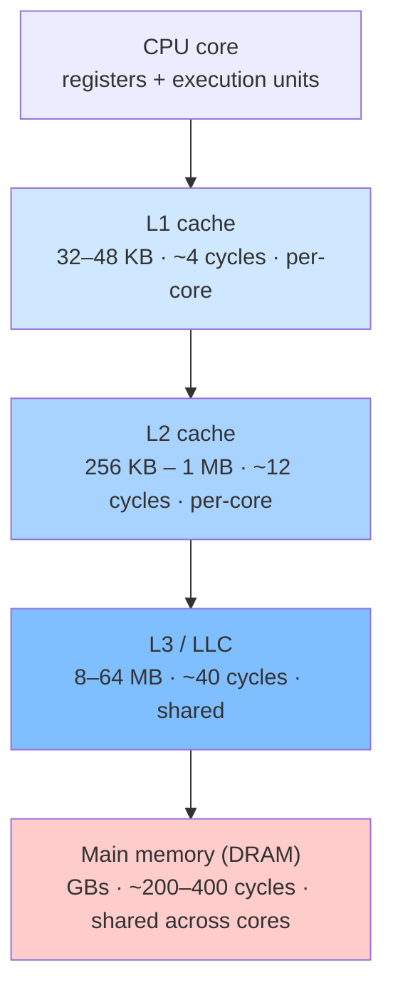
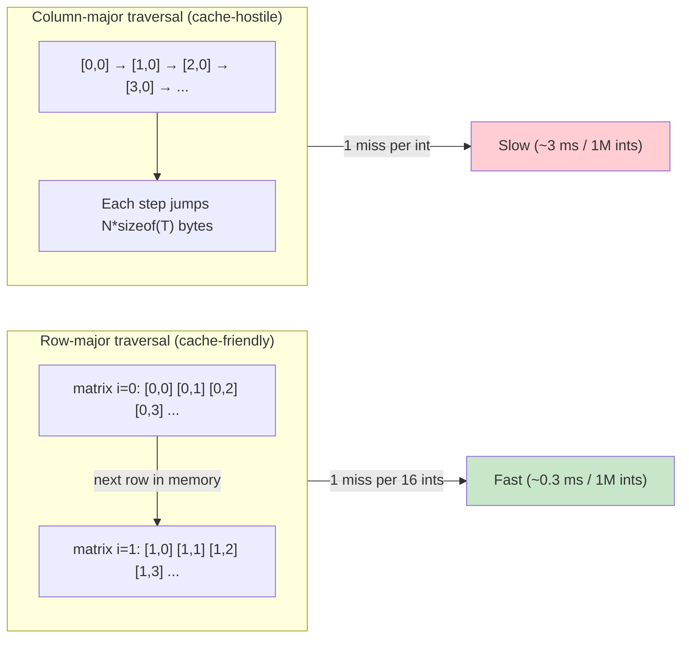

# 1. CPU Cache Locality

> [!note] Why this note exists
> Most C++ performance problems are not algorithmic — they are **memory problems**. A modern CPU can execute dozens of instructions in the time it takes to fetch one cache line from main memory. If your data is laid out so the cache works *with* you, your code runs 5–50× faster than identical-looking code that fights the cache. This note covers the cache hierarchy, the two kinds of locality, row-major vs column-major traversal, false sharing in multithreaded code, and the data-oriented design mindset that ties it all together.

## Why It Matters

Consider two functions that sum a million integers:

```cpp
// Version A — cache-friendly
long sumA(const std::vector<int>& v) {
    long s = 0;
    for (size_t i = 0; i < v.size(); ++i) s += v[i];
    return s;
}

// Version B — cache-hostile (illustrative)
long sumB(const std::vector<int>& v, const std::vector<size_t>& indices) {
    long s = 0;
    for (size_t i : indices) s += v[i];   // random-order access
    return s;
}
```

Both are O(N). Both compile to nearly identical assembly. On a modern desktop CPU, `sumA` finishes in ~0.3 ms; `sumB` (with shuffled indices) takes ~3 ms — a **10× difference** for the same arithmetic work. The reason is the cache: `sumA` touches memory sequentially so each 64-byte cache line feeds 16 iterations; `sumB` jumps around and every iteration pays a cache miss.

If you don't understand caches, you will optimize the wrong thing. You will inline functions, remove virtual calls, hand-tune arithmetic — and miss the 10× win that comes from reordering a loop or splitting a struct.

## Background

### The cache hierarchy

A modern CPU has multiple levels of cache between the execution units and main memory. Each level is larger but slower:

| Level | Typical size | Typical latency (cycles) | Typical latency (ns @ 3 GHz) | Managed by |
|-------|--------------|--------------------------|------------------------------|------------|
| Registers | a few hundred bytes | 0 | 0 | Compiler |
| L1 data cache | 32–48 KB per core | 3–4 | ~1 | Hardware |
| L2 cache | 256 KB – 1 MB per core | 10–14 | ~4 | Hardware |
| L3 cache (LLC) | 8–64 MB shared | 30–70 | ~12–20 | Hardware |
| Main memory (DRAM) | GBs | 200–400 | ~80–150 | OS / MMU |

When the CPU executes `mov eax, [rdi]` it issues a load request. The hardware first checks L1; on a miss it checks L2; on a miss L3; on a miss it goes to DRAM. A hit at L1 returns in 4 cycles. A miss to DRAM returns in 300+ cycles — about **100× slower**. During that wait the core stalls (or, with SMT, runs another hardware thread).

The cache hierarchy exists because of **physics**: bigger memories are slower and cheaper per byte. SRAM (used for L1/L2) is fast but expensive and power-hungry; DRAM is cheap and dense but slow. The hierarchy gives the illusion of a large, fast memory by exploiting the fact that most programs touch a small working set repeatedly.

### Cache lines, not bytes

Caches do not store individual bytes or words. The unit of transfer between cache and memory is a **cache line** (also called a cache block), almost always **64 bytes** on x86, ARM, and POWER. When you read one byte at address `X`, the hardware fetches the entire 64-byte aligned block containing `X` and stores it in L1. The next read at `X+1`, `X+2`, ... `X+63` is free — it is already in L1.

This single fact drives almost every cache-aware optimization:

- **Sequential access is cheap** — you pay one miss per 64 bytes, then 63 hits.
- **Strided access wastes cache** — reading every 128th byte still pays a full miss per access.
- **Random access is catastrophic** — every access is likely a miss.
- **Data layout matters more than algorithmic complexity** for memory-bound loops.

You can inspect the cache line size on Linux:

```bash
getconf LEVEL1_DCACHE_LINESIZE     # typically 64
lscpu | grep cache
```

In C++20 you can also query it portably via `std::hardware_destructive_interference_size` and `std::hardware_constructive_interference_size` (in `<new>`).

### The two kinds of locality

Computer architecture distinguishes two ways a program can be cache-friendly:

1. **Spatial locality** — if you touch address `X` now, you will probably touch `X+1`, `X+2`, ... soon. The cache helps because fetching `X` already pulled those neighbors in. Arrays and `std::vector` are spatial-locality superstars.
2. **Temporal locality** — if you touch address `X` now, you will probably touch `X` again soon, before it gets evicted. The cache helps because `X` is still there. Hot loop variables and small working sets exploit temporal locality.

Good performance code maximizes both. A streaming sum over a `vector` exploits spatial locality. A tight inner loop over a small set of variables exploits temporal locality. A linked list traversal exploits neither — each node points to a different cache line, and you touch each one once.

### Associativity and replacement

Each cache set has a small number of "ways" (e.g., L1 is typically 8-way set associative). A cache line can live in any of the ways for its set. When all ways are full, one is evicted (usually LRU). This matters when your access pattern causes **conflict misses** — two hot addresses that map to the same set thrash each other. Real programs hit this less often than you'd think, but it shows up in blocked matrix loops and hash tables.

## Main Content

### Row-major vs column-major traversal

C and C++ store multidimensional arrays in **row-major** order: `a[i][j]` and `a[i][j+1]` are adjacent in memory. Traversing a 2D matrix in row-major order (inner loop over the second index) is cache-friendly; traversing in column-major order is cache-hostile.

```cpp
constexpr int N = 4096;
int matrix[N][N];

// Row-major: each iteration touches the next element of the row,
// which is already in the cache line.
long sumRowMajor() {
    long s = 0;
    for (int i =  0; i < N; ++i)
        for (int j = 0; j < N; ++j)
            s += matrix[i][j];
    return s;
}

// Column-major: each iteration jumps N*sizeof(int) = 16 KB forward.
// Each access is a cache miss.
long sumColMajor() {
    long s = 0;
    for (int j = 0; j < N; ++j)
        for (int i = 0; i < N; ++i)
            s += matrix[i][j];
    return s;
}
```

On a 4096×4096 `int` matrix (64 MB — bigger than L3), the row-major version runs ~10–20× faster than the column-major version. The arithmetic is identical. The only difference is the order in which bytes are touched.

The same principle applies to anything you iterate over:

```cpp
struct Particle { float x, y, z, vx, vy, vz; };
std::vector<Particle> particles(N);

// AoS (Array of Structs): each particle is 24 bytes; ~2.6 particles per cache line.
// Good if you use all fields per iteration.
for (const auto& p : particles) {
    force += p.vx + p.vy + p.vz;
}

// SoA (Struct of Arrays): each field is a separate contiguous array.
struct ParticleSoA {
    std::vector<float> x, y, z, vx, vy, vz;
};
ParticleSoA ps;
// Streaming just vx now touches 16 floats per cache line — 16× less memory bandwidth.
for (size_t i = 0; i < n; ++i) {
    force += ps.vx[i];
}
```

The choice between AoS and SoA depends on which fields you use together. AoS wins when you use all fields per element; SoA wins when you stream over one field at a time (common in physics simulations, image processing, and machine learning).

### Loop tiling (blocking) for big matrices

When a matrix is bigger than L3, even row-major access suffers because each row is evicted before you finish processing it. The fix is **loop tiling**: process the matrix in small blocks that fit in cache, then move to the next block.

```cpp
constexpr int N = 4096;
constexpr int B = 64;  // block size — tune to L1/L2

void matmulTiled(const double A[N][N], const double B[N][N], double C[N][N]) {
    for (int ii = 0; ii < N; ii += B)
        for (int jj = 0; jj < N; jj += B)
            for (int kk = 0; kk < N; kk += B)
                for (int i = ii; i < ii + B; ++i)
                    for (int j = jj; j < jj + B; ++j) {
                        double acc = C[i][j];
                        for (int k = kk; k < kk + B; ++k)
                            acc += A[i][k] * B[k][j];
                        C[i][j] = acc;
                    }
}
```

Tiled matrix multiply can be 3–5× faster than the naive triple loop on large matrices, with no algorithmic change. The trick is keeping a small `B×B` sub-block of A, B, and C hot in L1/L2.

### False sharing in multithreaded code

When two threads write to different variables that happen to live on the same cache line, the cache coherency protocol invalidates the line on every write — even though no logical data is shared. This is **false sharing**, and it can make multithreaded code slower than single-threaded.

```cpp
struct Counters {
    std::atomic<long> a{0};
    std::atomic<long> b{0};
};  // sizeof == 8 (typically), so a and b share a cache line!

void worker(Counters& c, bool use_a) {
    for (int i = 0; i < 100'000'000; ++i) {
        if (use_a) c.a.fetch_add(1, std::memory_order_relaxed);
        else       c.b.fetch_add(1, std::memory_order_relaxed);
    }
}
// Thread 1: worker(c, true);
// Thread 2: worker(c, false);
// Cache line ping-pongs between cores on every increment — 5–10× slowdown.
```

The fix is to pad each hot variable to a cache line:

```cpp
struct alignas(64) PaddedCounter {
    std::atomic<long> value{0};
    char pad[64 - sizeof(std::atomic<long>)];
};

struct Counters {
    PaddedCounter a;
    PaddedCounter b;
};  // a and b now live on different cache lines.
```

C++17 provides `std::hardware_destructive_interference_size` (typically 64 or 128) for exactly this purpose. C++20 added `[[no_unique_address]]` for the opposite case (packing empty members).

```cpp
struct alignas(std::hardware_destructive_interference_size) Counter {
    std::atomic<long> value{0};
};
```

### Data-oriented design

Data-oriented design (DOD) is the philosophy that drives cache-friendly code. The core idea: **design data layouts for the way the hardware consumes them, not for the way humans conceptualize the problem.**

Object-oriented design tends to produce objects that bundle everything about an entity:

```cpp
class Enemy {
    Vector3 position;
    Vector3 velocity;
    int health;
    int maxHealth;
    int type;
    Texture* texture;
    AnimationState anim;
    SoundHandle currentSound;
    AIState ai;
    // ...
};
std::vector<Enemy> enemies;
```

This is appealing because it models the domain. But the game loop typically does *one* thing per frame for all enemies — update positions, then update AI, then render — and each pass touches only one or two fields per enemy. The rest of the 80-byte struct is dragged through the cache for nothing.

DOD reorganizes the data so each pass is contiguous:

```cpp
struct EnemySystem {
    std::vector<Vector3> positions;
    std::vector<Vector3> velocities;
    std::vector<int> healths;
    std::vector<int> types;
    std::vector<AIState> aiStates;
    // ...
};

void updatePositions(EnemySystem& es, float dt) {
    for (size_t i = 0; i < es.positions.size(); ++i) {
        es.positions[i] += es.velocities[i] * dt;
    }
}
```

The position update now streams two arrays — perfect spatial locality, no wasted bandwidth. The same pattern appears in game engines (Entity-Component-Systems), in database engines (columnar storage), and in deep learning frameworks (batched tensor ops).

### Hot/cold splitting

If a struct has some fields used every iteration and some used rarely, consider splitting it:

```cpp
struct Order {
    // Hot: touched on every quote/cancel path
    uint64_t id;
    double price;
    uint32_t quantity;
    // Cold: touched only on fills / audits
    std::string symbol;
    uint64_t timestamp;
    User* user;
    std::string notes;
};

// Split:
struct HotOrder {
    uint64_t id;
    double price;
    uint32_t quantity;
};
struct ColdOrder {
    uint64_t id;       // foreign key
    std::string symbol;
    uint64_t timestamp;
    User* user;
    std::string notes;
};

std::vector<HotOrder> hotOrders;          // 24 bytes each, dense
std::unordered_map<uint64_t, ColdOrder> coldOrders;  // look up by id
```

Hot data now packs 2.6× per cache line. Cold data is fetched only when needed. This is the standard pattern in high-frequency trading, where the matching engine hot loop runs over 24-byte order structs while trade history lives in a separate log.

### Prefetching

Modern CPUs have hardware prefetchers that detect sequential and strided access patterns and pull cache lines into L1 before you ask. You usually don't need to do anything. But for irregular patterns (linked lists, B-trees), you can hint:

```cpp
#include <xmmintrin.h>

for (Node* n = head; n; n = n->next) {
    _mm_prefetch(reinterpret_cast<const char*>(n->next), _MM_HINT_T0);
    process(n->data);
}
```

Software prefetch is fragile — it hints, not commands — and on modern CPUs it rarely helps and sometimes hurts. Always profile before and after.

### Cache hierarchy diagram



### Row-major vs column-major access pattern



## Code Examples

### Benchmarking row-major vs column-major

```cpp
#include <vector>
#include <chrono>
#include <iostream>

constexpr size_t N = 4096;

int main() {
    std::vector<std::vector<int>> m(N, std::vector<int>(N, 1));

    auto t1 = std::chrono::high_resolution_clock::now();
    long sRow = 0;
    for (size_t i = 0; i < N; ++i)
        for (size_t j = 0; j < N; ++j)
            sRow += m[i][j];
    auto t2 = std::chrono::high_resolution_clock::now();

    long sCol = 0;
    for (size_t j = 0; j < N; ++j)
        for (size_t i = 0; i < N; ++i)
            sCol += m[i][j];
    auto t3 = std::chrono::high_resolution_clock::now();

    auto msRow = std::chrono::duration_cast<std::chrono::milliseconds>(t2 - t1).count();
    auto msCol = std::chrono::duration_cast<std::chrono::milliseconds>(t3 - t2).count();
    std::cout << "row-major: " << msRow << " ms (sum=" << sRow << ")\n"
              << "col-major: " << msCol << " ms (sum=" << sCol << ")\n";
}
```

Typical output on a desktop CPU:

```
row-major: 18 ms (sum=16777216)
col-major: 240 ms (sum=16777216)
```

A 13× speedup from swapping two loops.

### A false-sharing demonstration

```cpp
#include <atomic>
#include <thread>
#include <vector>
#include <chrono>
#include <iostream>
#include <new>

struct BadCounters {
    std::atomic<long> a{0};
    std::atomic<long> b{0};
};

struct alignas(std::hardware_destructive_interference_size) GoodCounter {
    std::atomic<long> value{0};
};
struct GoodCounters {
    GoodCounter a;
    GoodCounter b;
};

template <class C>
void run(C& c) {
    auto work = [](std::atomic<long>& counter) {
        for (long i = 0; i < 100'000'000; ++i)
            counter.fetch_add(1, std::memory_order_relaxed);
    };
    auto t1 = std::chrono::high_resolution_clock::now();
    std::thread t1w(work, std::ref(c.a));
    std::thread t2w(work, std::ref(c.b));
    t1w.join(); t2w.join();
    auto t2 = std::chrono::high_resolution_clock::now();
    std::cout << std::chrono::duration_cast<std::chrono::milliseconds>(t2 - t1).count() << " ms\n";
}

int main() {
    BadCounters bad;
    std::cout << "False sharing: "; run(bad);
    GoodCounters good;
    std::cout << "Padded:        "; run(good);
}
```

Typical output:

```
False sharing: 950 ms
Padded:        180 ms
```

A 5× speedup from one `alignas`.

### Querying cache properties

```cpp
#include <new>
#include <iostream>

int main() {
    std::cout << "destructive interference size (use for padding): "
              << std::hardware_destructive_interference_size << '\n';
    std::cout << "constructive interference size (use for packing hot data): "
              << std::hardware_constructive_interference_size << '\n';
}
```

## Common Pitfalls

> [!danger] Pitfall 1 — Iterating a linked list
> Each node is a separate allocation; traversing a `std::list` causes one cache miss per element. A `std::vector` of the same data is often 10–50× faster to iterate. Use lists only when you need O(1) splice in the middle.

> [!danger] Pitfall 2 — Tree-of-pointers data structures
> `std::map` and `std::unordered_map` chase pointers. For lookup-heavy code with small keys, a sorted `std::vector` plus `std::lower_bound` often beats them — fewer allocations, better cache behavior.

> [!danger] Pitfall 3 — False sharing from "neatly packed" structs
> Two atomics that look unrelated may share a cache line just because the struct is small. Always use `alignas(hardware_destructive_interference_size)` for hot per-thread data.

> [!danger] Pitfall 4 — AoS for narrow loops
> If your hot loop only touches one field of a 64-byte struct, you're wasting 7/8 of your memory bandwidth. Convert to SoA or split hot and cold fields.

> [!danger] Pitfall 5 — Optimizing for the wrong matrix dimension
> A 64×64 matrix fits in L1 and won't show row-major/col-major differences. Always benchmark at the size you actually use. Cache effects show up past ~256 KB.

> [!danger] Pitfall 6 — Trusting `sizeof` instead of cache lines
> `sizeof(T) <= 64` does not mean T fits in one cache line — it depends on alignment and where the allocator placed it. If you need this guarantee, use `alignas(64)`.

> [!danger] Pitfall 7 — Premature tiling
> Tiled matrix multiply is *harder to read* and only faster for big matrices. Don't tile by default — measure first.

> [!danger] Pitfall 8 — Believing software prefetch always helps
> On modern CPUs, hardware prefetchers are usually smarter than you. Software prefetch hints often do nothing, sometimes hurt. Profile both ways.

> [!danger] Pitfall 9 — Allocating per element
> Each `new` returns memory from a different pool region; vectors of pointers (e.g., `std::vector<std::unique_ptr<T>>`) defeat prefetchers. Prefer vectors of values or arenas.

## Tips and Tricks

- **Always measure.** Cache effects are large (10–50×) but only visible on real data sizes. Microbenchmarks at N=1024 will lie to you.
- **Prefer `std::vector` over `std::list` and `std::map`** for any data you iterate over. The cache wins dwarf the algorithmic advantages of node-based structures in real workloads.
- **Use `reserve()` on vectors** to avoid reallocation churn and to keep memory contiguous.
- **Sort your data by access pattern.** If you process orders by symbol, store them sorted by symbol — you'll stream one symbol's orders at a time.
- **Split hot and cold fields.** Anything touched in the inner loop should be packed; anything touched rarely should live elsewhere.
- **Use `alignas(64)` for hot per-thread structures.** The C++17 constant `std::hardware_destructive_interference_size` is the portable form.
- **Consider SoA for batch processing.** Physics simulations, image processing, and ML all benefit. Libraries like EnTT and libsdl2 internals use this pattern.
- **Tune tile sizes to your hardware.** Start at 64 (L1 line count) and increase until you saturate L2. Profile.
- **Avoid `std::deque` for hot loops** — its chunked storage means a pointer chase every K elements. Use `std::vector` with a head index instead.
- **Watch out for `std::function`** — it type-erases, often heap-allocates, and the call is indirect. For hot loops, use lambdas with templates or function pointers.
- **Use `__builtin_prefetch` / `_mm_prefetch` sparingly** — usually the hardware knows better.
- **Profile cache behavior with `perf stat -e cache-misses,cache-references`** and VTune's memory access analysis.

## Active Recall

1. Why does reading one byte at address `X` cause 64 bytes to be loaded into L1?
2. List the typical sizes and latencies of L1, L2, L3, and DRAM.
3. Define spatial locality and temporal locality. Give one example of each.
4. Why is iterating a `std::list` typically 10–50× slower than iterating a `std::vector` of the same data?
5. Write a row-major and a column-major traversal of a 2D matrix. Which is faster in C++, and why?
6. What is false sharing? Show a 5-line code example that suffers from it, and the fix.
7. What is `std::hardware_destructive_interference_size`, and when do you use it?
8. Explain AoS vs SoA. When does each win?
9. What is loop tiling / blocking, and what problem does it solve?
10. Sketch a "hot/cold split" for a struct with 3 hot fields and 5 cold fields.
11. Why does software prefetch rarely help on modern CPUs?
12. Name three things to check on a `perf stat` report when diagnosing a slow loop.

## Next Steps

- Read [[19. Performance Optimization/2. Branch Prediction]] — the next biggest hardware-level win after cache locality.
- Read [[19. Performance Optimization/3. SIMD and Vectorization]] — once data is laid out cache-friendly, SIMD lets you process 4–16 elements per instruction.
- Read [[19. Performance Optimization/4. Memory Pool and Arena Allocators]] — allocator-aware data layout is the natural extension of cache-friendly structures.
- Read [[19. Performance Optimization/5. Profiling Workflow]] — confirms whether your cache optimizations actually helped.
- Read [[7. Memory Management/7. Custom Allocators]] — the underlying allocator matters for cache behavior.
- Read [[14. Concurrency and Multithreading/6. Atomics and Memory Ordering]] — false sharing and cache-line ping-pong are atomic-level concerns.
- Cross-reference [[11. STL Deep Dive/1. Containers Overview]] — cache behavior is a key reason `std::vector` is the default recommendation.
- Read Mike Acton's "Data-Oriented Design" CppCon talk and Chandler Carruth's "Efficiency with Algorithms, Performance with Data Structures" for the canonical deep dives.
