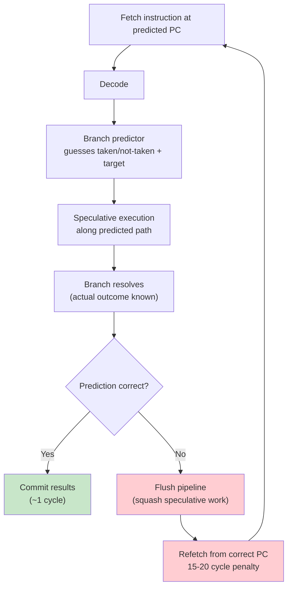
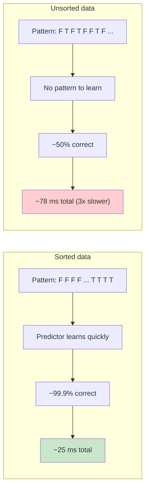

# 2. Branch Prediction

> [!note] Why this note exists
> Modern CPUs are deeply pipelined — they execute many instructions in flight at once, predicting the outcome of branches before they're resolved. A correctly predicted branch costs ~1 cycle. A mispredicted branch costs 15–20 cycles as the pipeline flushes and refills. In branch-heavy inner loops, prediction quality can dominate performance. This note covers why branches are expensive, how the hardware predicts them, the canonical "sorted vs unsorted" benchmark, branchless programming techniques, the C++20 `[[likely]]` / `[[unlikely]]` attributes, and bit-manipulation tricks that remove branches entirely.

## Why It Matters

Here is the most famous benchmark in the branch-prediction literature:

```cpp
#include <algorithm>
#include <vector>
#include <chrono>

long sumIfAbove(std::vector<int>& v, int threshold) {
    long s = 0;
    for (int x : v)
        if (x > threshold) s += x;
    return s;
}

int main() {
    std::vector<int> v(10'000'000);
    // ... fill v with random numbers ...

    // Case 1: unsorted
    auto t1 = std::chrono::high_resolution_clock::now();
    sumIfAbove(v, 128);
    auto t2 = std::chrono::high_resolution_clock::now();

    // Case 2: sorted
    std::sort(v.begin(), v.end());
    auto t3 = std::chrono::high_resolution_clock::now();
    sumIfAbove(v, 128);
    auto t4 = std::chrono::high_resolution_clock::now();

    // unsorted: ~80 ms
    // sorted:   ~25 ms  (3x faster, same work!)
}
```

The arithmetic is identical. The `if` is identical. The only difference is the order in which the data is presented — and that order changes whether the CPU's branch predictor can guess correctly.

The reason: with sorted data, the `if (x > threshold)` is false for the first half and true for the second. The predictor learns the pattern quickly and is right ~99.9% of the time. With random data, the predictor is right ~50% of the time, and every wrong guess costs 15–20 cycles.

This is not a theoretical concern. Branch mispredictions are the dominant cost in many real workloads: hash table lookups, binary searches, parser loops, JSON parsing, decompression, JIT compilers, network packet classification, GPU command dispatch. If you can replace a mispredictable branch with branchless code, you often get a 2–5× speedup for free.

## Background

### The CPU pipeline

Modern CPUs do not execute one instruction at a time. They fetch, decode, dispatch, execute, and retire many instructions in parallel, in a pipeline 14–20 stages deep. The goal is to retire roughly one instruction per cycle (or more, with superscalar issue).

The pipeline works only if it can keep fetching instructions. When the code is straight-line (no branches), the fetch unit simply reads the next address. When the code branches, the fetch unit doesn't know which way to go until the branch is resolved — which may be 10–20 cycles later, because the branch often depends on data that hasn't been computed yet.

If the CPU waited, it would stall for those 10–20 cycles on every branch. Instead, it **predicts** the outcome and speculatively fetches along the predicted path. If the prediction is correct, the work continues seamlessly. If wrong, the pipeline is flushed and re-fetched along the correct path — costing roughly 15–20 cycles of lost work.

### Branch prediction hardware

Modern branch predictors are remarkably sophisticated. They combine several mechanisms:

1. **Local predictor** — a per-branch-history table. Tracks the last few outcomes of each branch (e.g., "this branch has been T-T-N-T-T for the last 5 times") and predicts based on that pattern.
2. **Global predictor** — tracks the outcomes of *all* recent branches globally. Useful when one branch's behavior is correlated with another's.
3. **Return address stack (RAS)** — special predictor for `ret` instructions; predicts the return address pushed by `call`.
4. **Indirect branch predictor** — for indirect calls (`call [rax]`) and switch tables; predicts the target based on history.

A typical predictor achieves >95% accuracy on real code. The hard cases are:

- **Data-dependent branches** like `if (x > threshold)` where `x` is essentially random — no pattern to learn.
- **Cold branches** taken once per thousand iterations — the predictor's table entry may have been evicted.
- **Aliased branches** — two branches that happen to map to the same predictor slot.

### Why misprediction is expensive

When the predictor is wrong:

1. The instructions fetched along the wrong path are squashed.
2. The pipeline refills from the correct address (14–20 cycles).
3. Any memory operations issued speculatively are reverted.
4. The branch itself is finally resolved.

Net cost: roughly 15–20 cycles on a modern x86 core, more if the speculative path loaded cache lines you didn't need (cache pollution).

For a tight loop running billions of iterations, a 50% misprediction rate translates to roughly 7.5–10 ns of wasted time per iteration. At 3 GHz, that's ~25–30 lost cycles per iteration — your 1-cycle loop is suddenly 30-cycle.

### Conditional moves: the hardware's branchless trick

To help with unpredictable branches, x86 (and most modern ISAs) provides a **conditional move** instruction: `cmov`. Instead of branching, it copies one of two values based on a condition flag. There's no jump, so there's no branch to mispredict.

```asm
; branchy version
    cmp  eax, 128
    jle  .skip
    add  rbx, eax
.skip:

; branchless version (compiler may emit this)
    cmp  eax, 128
    cmovg ecx, eax     ; ecx = (eax > 128) ? eax : 0
    add  rbx, ecx
```

The branchless version has constant execution time — it always runs the same instructions, regardless of whether the comparison is true or false. For unpredictable data this is a big win. For predictable data (sorted, or 99% one direction), the branchy version is faster because it skips the `add` entirely.

The compiler chooses between branchy and branchless based on heuristics; you can usually influence it with `[[likely]]` / `[[unlikely]]` or by writing the code in a branchless style.

## Main Content

### The sorted vs unsorted benchmark

Let's reproduce the canonical result and understand it deeply.

```cpp
#include <vector>
#include <algorithm>
#include <chrono>
#include <iostream>
#include <random>

long sumIfAbove(std::vector<int>& v, int threshold) {
    long s = 0;
    for (int x : v)
        if (x > threshold) s += x;
    return s;
}

int main() {
    std::mt19937 rng(42);
    std::uniform_int_distribution<int> dist(0, 255);

    std::vector<int> v(10'000'000);
    for (int& x : v) x = dist(rng);

    int threshold = 128;

    // --- Case 1: unsorted ---
    auto t1 = std::chrono::high_resolution_clock::now();
    volatile long s1 = sumIfAbove(v, threshold);
    auto t2 = std::chrono::high_resolution_clock::now();
    auto ms1 = std::chrono::duration_cast<std::chrono::milliseconds>(t2 - t1).count();

    // --- Case 2: sorted ---
    std::sort(v.begin(), v.end());
    auto t3 = std::chrono::high_resolution_clock::now();
    volatile long s2 = sumIfAbove(v, threshold);
    auto t4 = std::chrono::high_resolution_clock::now();
    auto ms2 = std::chrono::duration_cast<std::chrono::milliseconds>(t4 - t3).count();

    std::cout << "unsorted: " << ms1 << " ms\n"
              << "sorted:   " << ms2 << " ms\n";
}
```

Typical output on a desktop CPU:

```
unsorted: 78 ms
sorted:   23 ms
```

A 3.4× speedup purely from sorting. The arithmetic (10M additions) is identical. The `if` is identical. The difference is entirely in the branch predictor's accuracy.

You can verify the cause with `perf stat`:

```bash
perf stat -e branch-misses,branches ./benchmark
```

For unsorted data, you'll see ~5M branch misses out of ~10M branches (50%). For sorted data, ~1K misses out of ~10M branches (0.01%).

### Branchless programming techniques

The fundamental idea of branchless programming: replace `if (cond) x = a; else x = b;` with arithmetic that computes both `a` and `b` and selects based on `cond` without jumping.

#### Technique 1: conditional move via ternary

The simplest case — write the code as a ternary, and the compiler will often emit a `cmov`:

```cpp
// Branchy (if data is unpredictable, this mispredicts)
if (x > threshold) s += x;

// Branchless ternary (compiler usually emits cmov)
s += (x > threshold) ? x : 0;
```

GCC and Clang will emit a `cmovle` for the ternary form. This is the cleanest way to write branchless code — it's portable, idiomatic, and the optimizer handles the rest.

#### Technique 2: arithmetic masking

For `int` conditions you can use arithmetic to compute the selection:

```cpp
// Branchless: condition is 0 or 1; multiply to select.
s += x * (x > threshold);
// (bool true is 1, false is 0 — multiplication by 0 zeroes it out)
```

This works for integers but not for floats (the multiply would propagate NaN). For floats use `std::copysign` or an explicit ternary.

#### Technique 3: bit-masks

For 64-bit selections, you can build an all-ones / all-zeros mask:

```cpp
// (x > threshold) is 0 or 1; negate to get 0 or -1 (all-ones in two's complement)
long mask = -static_cast<long>(x > threshold);
s += x & mask;
```

This is essentially what the compiler does internally; writing it explicitly rarely beats `cmov`.

#### Technique 4: min/max instead of branches

Many `if` statements can be rewritten as `std::min` / `std::max` / `std::clamp`:

```cpp
// Branchy
if (x > hi) x = hi;
if (x < lo) x = lo;

// Branchless (std::clamp is typically implemented with cmov)
x = std::clamp(x, lo, hi);
```

#### Technique 5: lookup tables for small switch-like logic

A small switch with predictable cases can become a table:

```cpp
// Branchy
int cost(ItemType t) {
    switch (t) {
        case A: return 10;
        case B: return 25;
        case C: return 50;
        default: return 0;
    }
}

// Branchless
int cost(ItemType t) {
    static constexpr int table[] = {10, 25, 50, 0};
    return table[static_cast<int>(t)];
}
```

#### Technique 6: predicated SIMD

SIMD intrinsics are inherently branchless — they use masks instead of branches. See [[19. Performance Optimization/3. SIMD and Vectorization]] for the full treatment.

### When branchless wins and loses

Branchless is not always faster. The tradeoff:

| Situation | Branchy wins | Branchless wins |
|-----------|--------------|-----------------|
| Predictable (>95% one way) |  skips the work |  does the work always |
| Unpredictable (~50%) |  mispredicts |  constant time |
| Very small body (1–2 ops) | toss-up | toss-up |
| Large body (lots of work) |  skip is cheap |  wastes work |
| Side effects in body |  required |  can't safely do both |

For `if (x > threshold) s += x;` the body is tiny (one add), and the condition is unpredictable, so branchless wins. For `if (x > threshold) saveToDatabase(x);` the body is large, so branchy wins even if the prediction is mediocre.

### The C++20 `[[likely]]` and `[[unlikely]]` attributes

When you know a branch is almost always taken (or almost never), you can tell the compiler. C++20 introduced two standard attributes:

```cpp
if (likely_condition) [[likely]] {
    // hot path — usually taken
    process_normal(x);
} else [[unlikely]] {
    // cold path — rare error handling
    handle_error(x);
}
```

These attributes hint to the compiler about branch probability. The compiler uses them to:

1. Lay out the hot path first (better I-cache locality).
2. Choose branchy vs branchless codegen.
3. Bias inlining decisions.

Common use cases:

```cpp
// Error paths
if (!ptr) [[unlikely]] throw std::runtime_error("null");

// Fast paths
if (cache.contains(key)) [[likely]] {
    return cache[key];
}

// Branch hints on switch
switch (status) {
    case OK: [[likely]] handle_ok(); break;
    default: handle_error(); break;
}
```

Note: `[[likely]]` / `[[unlikely]]` apply to **statements**, not conditions. You write `if (cond) [[likely]] { ... }`, not `if ([[likely]] cond)`.

Before C++20, compilers offered proprietary macros: `__builtin_expect` (GCC/Clang) and `__assume` (MSVC). Many codebases wrap them:

```cpp
#if __has_cpp_attribute(likely)
    #define LIKELY [[likely]]
    #define UNLIKELY [[unlikely]]
#else
    #define LIKELY
    #define UNLIKELY
#endif
```

### Bit manipulation tricks to avoid branches

Many small branches can be replaced with bit tricks. The general pattern: convert a comparison into a mask of all-zeros or all-ones, then use bitwise ops to select.

#### Absolute value

```cpp
// Naive branchy
int absBranchy(int x) { return x < 0 ? -x : x; }

// Branchless (the compiler knows this trick)
int absBranchless(int x) {
    int mask = x >> 31;            // 0xFFFFFFFF if negative, 0 otherwise
    return (x ^ mask) - mask;      // flip and add 1 if negative
}
```

#### Sign of an integer

```cpp
// Returns -1, 0, or +1
int sign(int x) {
    return (x > 0) - (x < 0);   // both comparisons are 0 or 1
}
```

#### Minimum of two integers (branchless)

```cpp
int minBranchless(int a, int b) {
    int mask = (a - b) >> 31;     // -1 if a < b, 0 otherwise
    return b + ((a - b) & mask);
}
```

(Caveat: this version overflows if `a - b` overflows. Use `std::min` in real code; it compiles to `cmov` anyway.)

#### Rounding up to a power of 2

```cpp
// Branchless round-up to next power of 2
uint64_t roundUpPow2(uint64_t x) {
    --x;
    x |= x >> 1;  x |= x >> 2;
    x |= x >> 4;  x |= x >> 8;
    x |= x >> 16; x |= x >> 32;
    return x + 1;
}
```

This is a classic — it propagates the highest set bit downward, then adds 1. No branches, constant time.

#### Counting set bits (popcount)

```cpp
#include <bit>
int n = std::popcount(0b10110101u);  // 5
```

`std::popcount` (C++20) compiles to a single `popcnt` instruction on x86. The pre-C++20 manual implementation was a branchless bit-parallel algorithm; modern hardware makes it a single instruction.

#### Conditional increment

```cpp
// Branchy
count += (x > threshold) ? 1 : 0;

// Branchless (using bool arithmetic)
count += (x > threshold);

// Branchless (using mask)
count += ((x - threshold - 1) >> 31) & 1;  // careful with overflow
```

The simplest form — `count += (x > threshold);` — is usually best. The compiler will emit `cmp; seta; addzx` which is branchless and fast.

### Branch prediction pipeline diagram



### Sorted vs unsorted data flow



## Code Examples

### Branchless partition (the std::partition trick)

The classic application: partitioning a vector by a predicate. The branchy version checks each element and appends; the branchless version writes both branches simultaneously.

```cpp
// Branchy version — mispredicts on unpredictable data
template <class Pred>
std::vector<int> partitionBranchy(const std::vector<int>& v, Pred pred) {
    std::vector<int> yes, no;
    for (int x : v) {
        if (pred(x)) yes.push_back(x);
        else         no.push_back(x);
    }
    yes.insert(yes.end(), no.begin(), no.end());
    return yes;
}

// Branchless version — uses indices
template <class Pred>
std::vector<int> partitionBranchless(const std::vector<int>& v, Pred pred) {
    std::vector<int> result(v.size());
    size_t left = 0, right = v.size();
    for (int x : v) {
        if (pred(x)) result[left++]  = x;
        else         result[--right] = x;
    }
    std::reverse(result.begin() + left, result.end());
    return result;
}
```

The branchless version still has a branch on `pred(x)`, but the write location is computed via index arithmetic; with `cmov` the compiler can make it fully branchless.

### Branchless clamp

```cpp
#include <algorithm>

// Idiomatic C++ — std::clamp is typically implemented branchlessly
double safeGain = std::clamp(userInput, 0.0, 1.0);

// Hand-written branchless
double clampBranchless(double x, double lo, double hi) {
    double t = x < lo ? lo : x;
    return t > hi ? hi : t;
}
```

### Using `[[likely]]` / `[[unlikely]]`

```cpp
#include <stdexcept>

double divide(double a, double b) {
    if (b == 0.0) [[unlikely]] {
        throw std::invalid_argument("division by zero");
    }
    return a / b;
}

int lookup(const std::unordered_map<int, int>& table, int key) {
    auto it = table.find(key);
    if (it == table.end()) [[unlikely]] {
        return -1;  // cold path
    }
    return it->second;  // hot path (implicit [[likely]] is fine)
}

// On switch
const char* httpStatus(int code) {
    switch (code) {
        case 200: [[likely]] return "OK";
        case 404: [[likely]] return "Not Found";
        case 500: return "Internal Server Error";
        default:  [[unlikely]] return "Unknown";
    }
}
```

### Measuring branch misses with `perf`

```bash
# Build with debug info
g++ -O2 -g benchmark.cpp -o benchmark

# Count branch-related events
perf stat -e branches,branch-misses ./benchmark

# Typical output for the unsorted case:
#   10,003,421  branches
#    5,012,839  branch-misses     # 50.1% — terrible
#
# For the sorted case:
#   10,003,421  branches
#          847  branch-misses     # 0.008% — excellent
```

## Common Pitfalls

> [!danger] Pitfall 1 — Branchless is always faster
> No. For predictable branches (error checks, hot-path checks), branchy code skips work entirely. Branchless code does the work in both cases. Measure both.

> [!danger] Pitfall 2 — Manually unrolling loops to "help" the predictor
> The compiler and hardware already do this. Manual unrolling usually hurts I-cache and readability without helping prediction.

> [!danger] Pitfall 3 — Trusting `[[likely]]` as a magic bullet
> The attribute is a hint. The compiler's own profile-guided optimization (PGO) data is far more accurate. Use `[[likely]]` for the obvious cases (error paths), use PGO for the subtle ones.

> [!danger] Pitfall 4 — Bit tricks that overflow
> `int mask = (a - b) >> 31;` overflows if `a - b` overflows, giving wrong results. Use `std::min` / `std::max` / `std::clamp` — they compile to `cmov` and handle all cases.

> [!danger] Pitfall 5 — Branchless code with side effects
> You can't branchlessly call a function with side effects — both branches would run. Branchless techniques work only for pure computations.

> [!danger] Pitfall 6 — Forgetting virtual calls are indirect branches
> `virtual` calls are indirect branches — the predictor handles them, but they're harder to predict than direct calls. In hot loops, consider CRTP or function pointers, or hoist the vtable lookup out of the loop.

> [!danger] Pitfall 7 — Assuming the compiler emits `cmov` automatically
> It usually does for ternaries, but sometimes it doesn't — especially for floating-point or when it can't prove both branches are safe. Inspect the assembly with `-S` or [Compiler Explorer](https://godbolt.org/).

> [!danger] Pitfall 8 — Premature branchless optimization
> If the loop body is dominated by memory latency (cache misses), branch mispredictions are noise. Profile first — branch misses only matter when they're the bottleneck.

> [!danger] Pitfall 9 — Using ternary for side effects
> `(cond) ? sideEffectA() : sideEffectB();` looks branchless but the compiler still emits a branch (it has to). Branchless techniques only work for pure expressions.

## Tips and Tricks

- **Identify the unpredictable branches first.** Profile with `perf stat -e branch-misses`. The hottest loops with the most misses are your targets.
- **Sort your data.** If a downstream loop branches on a comparison, pre-sorting the input can give a 3× speedup for free.
- **Use ternaries for small branchless selections.** The compiler usually emits `cmov`.
- **Use `std::min` / `std::max` / `std::clamp`** instead of hand-written `if` — they're branchless on modern compilers.
- **Replace `if` chains with table lookups** for small integer keys.
- **Use `[[likely]]` / `[[unlikely]]`** for obvious hot/cold paths — error handling, fast-path cache hits.
- **Use Profile-Guided Optimization (PGO).** Compile with `-fprofile-generate`, run your representative workload, then recompile with `-fprofile-use`. The compiler will inline and lay out code based on real branch frequencies — typically 5–15% improvements.
- **Avoid `virtual` calls in the inner loop.** They are indirect branches. Hoist them out, use CRTP, or specialize with templates.
- **Replace `bool` chains with arithmetic.** `count += (x > threshold);` is branchless; `if (x > threshold) ++count;` may not be.
- **Inspect the assembly.** [Compiler Explorer](https://godbolt.org/) is your friend. Look for `cmov`, `seta`, `sbb` — those are branchless. `jne`, `je`, `jmp` are branches.
- **Consider `__builtin_expect_with_probability`** (GCC/Clang) for fine-grained hints — `[[likely]]` is binary, this is a percentage.
- **Batch decisions.** Instead of branching per element, branch per batch: compute the boolean for all elements first, then process each branch's elements in a contiguous pass.
- **Use `std::popcount`, `std::countl_zero`, etc. (C++20)** — these compile to single hardware instructions, no branches.
- **Be aware that `std::sort` itself is branchy.** Sometimes radix sort (branchless) beats `std::sort` (branchy) for unpredictable data, despite worse theoretical complexity on uniform data.

## Active Recall

1. Why does a branch misprediction cost ~15–20 cycles?
2. What is the difference between a local and a global branch predictor?
3. Reproduce the sorted-vs-unsorted benchmark from memory. Why is the sorted version 3× faster?
4. Convert `if (x > threshold) s += x;` to a branchless form using a ternary.
5. When does branchy code beat branchless code? Give a concrete example.
6. What do the C++20 `[[likely]]` and `[[unlikely]]` attributes do? Where do they appear syntactically?
7. Write a branchless `abs(int)` using bit manipulation.
8. Why can't you make `if (cond) saveToDatabase(x);` branchless?
9. How would you measure branch mispredictions on Linux?
10. What is Profile-Guided Optimization, and why is it more accurate than `[[likely]]`?
11. Why are virtual calls considered branch-prediction hazards?
12. Name three C++ standard-library functions that compile to branchless code.

## Next Steps

- Read [[19. Performance Optimization/1. CPU Cache Locality]] — branches and cache misses are the two big hardware-level performance factors; you must understand both.
- Read [[19. Performance Optimization/3. SIMD and Vectorization]] — SIMD is inherently branchless; combining branchless + SIMD often yields the best results.
- Read [[19. Performance Optimization/5. Profiling Workflow]] — how to actually measure branch misses and decide whether to optimize them.
- Read [[10. Templates and Metaprogramming/6. CRTP]] — eliminates virtual calls in hot paths.
- Read [[15. Debugging and Profiling/5. perf and Flamegraphs]] — the practical tooling for measuring branch misses.
- Cross-reference Agner Fog's optimization manuals and the classic StackOverflow "why is processing a sorted array faster" answer for the canonical reference.
- Read Chandler Carruth's CppCon talks on performance for deeper insight into compiler codegen for branches.
