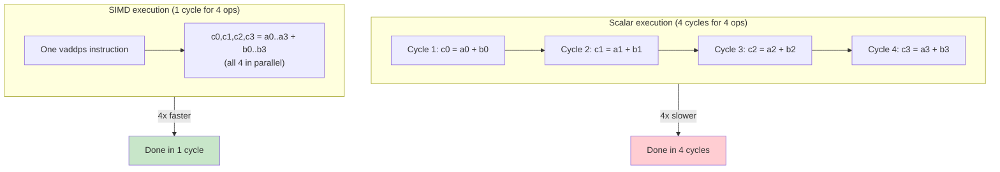
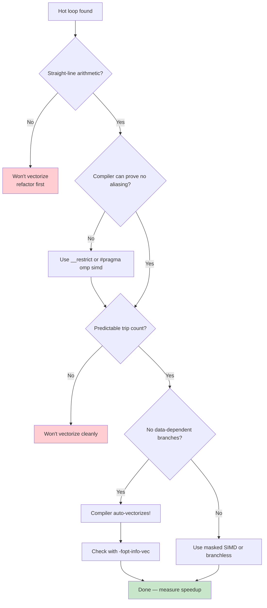

# 3. SIMD and Vectorization

> [!note] Why this note exists
> A modern CPU core can execute one (or a few) scalar instruction per cycle, but it has wide vector units that can do the same operation on 4, 8, 16, or even 64 values in parallel with a single instruction. SIMD (Single Instruction, Multiple Data) is how you get 4–16× more arithmetic out of the same silicon. This note covers the SIMD instruction families (SSE, AVX, AVX2, AVX-512), how compilers auto-vectorize loops, how to write SIMD manually with intrinsics, OpenMP pragmas, the proposed `std::simd`, and the workloads where SIMD shines.

## Why It Matters

Consider this loop:

```cpp
void addArrays(const float* a, const float* b, float* out, size_t n) {
    for (size_t i = 0; i < n; ++i)
        out[i] = a[i] + b[i];
}
```

A scalar implementation: n iterations, each doing one load, one add, one store. At 4 GHz and assuming L1 hits, you'd top out at maybe 4 GFLOP/s of useful work.

With AVX2 (256-bit vectors, 8 floats per instruction), the compiler generates roughly n/8 iterations, each doing 8 adds in parallel. Peak arithmetic throughput jumps to 32+ GFLOP/s per core. With AVX-512 (16 floats), 64+ GFLOP/s. That's a 10–20× speedup, for free, on hardware you already own.

SIMD matters most for:

- **Numerical kernels** — linear algebra, FFTs, convolutions, image processing.
- **String/text processing** — scanning for characters, comparing buffers, parsing.
- **Cryptography** — AES-NI, SHA extensions, hashing.
- **Machine learning** — matrix multiplies, convolutions, activations.
- **Compression / codecs** — LZ4, zstd, video encode/decode.
- **Database engines** — vectorized scans, aggregation.

If your hot loop is straight-line arithmetic over a contiguous array, you should care about SIMD. If it isn't vectorizing, you're leaving 4–16× performance on the table.

## Background

### SIMD instruction families (x86)

| Family | Vector width | Year | Floats / vector | Ints / vector | Notes |
|--------|--------------|------|------------------|----------------|-------|
| MMX | 64-bit | 1997 | 0 (int only) | 8 × 8-bit | Obsolete |
| SSE / SSE2 | 128-bit | 1999/2001 | 4 × float | 4 × 32-bit | Baseline on all x86-64 |
| SSE3 / SSSE3 / SSE4 | 128-bit | 2004–2007 | 4 × float | 4 × 32-bit | Horizontal ops, blend, etc. |
| AVX | 256-bit | 2011 | 8 × float | 8 × 32-bit | New 3-operand encoding |
| AVX2 | 256-bit | 2013 | 8 × float | 8 × 32-bit | Integer AVX (gather, etc.) |
| AVX-512 | 512-bit | 2017+ | 16 × float | 16 × 32-bit | Mask registers, more ops |
| AVX10 | 512-bit | 2024+ | 16 × float | 16 × 32-bit | Unified, future x86 |

On ARM the equivalent families are NEON (128-bit, ubiquitous), SVE (scalable, 128–2048-bit), and SVE2. On RISC-V there's the V extension (vector, scalable). The concepts are identical; the intrinsics differ.

Crucially, **wider isn't always faster**. AVX-512 has a heavy thermal envelope — on some CPUs, running AVX-512 downclocks the chip enough that 256-bit code is faster overall. Always benchmark.

### How SIMD works: lanes and vectors

A SIMD register is a fixed-width chunk of bits (128, 256, or 512). The CPU interprets it as N independent "lanes" of a smaller type. A single `vaddps` (vector add packed single-precision) on a 256-bit register does 8 float additions in parallel, lane-by-lane:

```
   Lane 7  Lane 6  Lane 5  Lane 4  Lane 3  Lane 2  Lane 1  Lane 0
  +-------+-------+-------+-------+-------+-------+-------+-------+
a | a[7]  | a[6]  | a[5]  | a[4]  | a[3]  | a[2]  | a[1]  | a[0]  |
  +-------+-------+-------+-------+-------+-------+-------+-------+
b | b[7]  | b[6]  | b[5]  | b[4]  | b[3]  | b[2]  | b[1]  | b[0]  |
  +-------+-------+-------+-------+-------+-------+-------+-------+
            |       |       |       |       |       |       |       vaddps
out[a[i]+b[i] for i in 0..7]
```

Each lane is independent — there's no carry between them. Most arithmetic operations (add, sub, mul, div, min, max, compare, bitwise) work lane-wise. A few operations cross lanes (shuffles, horizontal adds, permutations), and these are typically slower.

### Auto-vectorization by compilers

GCC and Clang can vectorize loops automatically when you compile with `-O2 -ftree-vectorize` (default at `-O2` in modern GCC) or `-O3`. The compiler analyzes the loop, checks that the operations are vectorizable, and emits SIMD instructions.

What the compiler needs to vectorize:

1. **Straight-line arithmetic** — no early exits, no function calls that can't be inlined.
2. **Predictable trip count** — loops with a known (or runtime-computable) bound.
3. **No aliasing** — the compiler must prove that `out[i]` doesn't overlap with `a[i]` or `b[i]`.
4. **No data-dependent control flow** — branches inside the loop block vectorization (or fall back to masked SIMD).

The aliasing requirement is the most common obstacle. By default, the compiler must assume `float*` aliases `float*`. Two solutions:

```cpp
// Option 1: restrict keyword (compiler extension)
void addArrays(const float* __restrict a,
               const float* __restrict b,
               float* __restrict out, size_t n) {
    for (size_t i = 0; i < n; ++i) out[i] = a[i] + b[i];
}

// Option 2: std::span / std::array / std::vector (better)
void addArrays(std::span<const float> a, std::span<const float> b,
               std::span<float> out) {
    for (size_t i = 0; i < a.size(); ++i) out[i] = a[i] + b[i];
}
```

You can ask the compiler to report what it vectorized:

```bash
g++ -O3 -fopt-info-vec-missed  main.cpp   # what didn't vectorize and why
g++ -O3 -fopt-info-vec-all     main.cpp   # everything
clang++ -O3 -Rpass=vectorize    main.cpp  # Clang's equivalent
```

### When auto-vectorization fails

Common reasons the compiler gives up:

1. **Aliasing it can't disprove.** Use `__restrict` or pass by `std::span`.
2. **Complex control flow inside the loop.** Flatten it or use ternaries.
3. **Function calls.** Inline them (or mark `__attribute__((always_inline))`).
4. **Mixed types** (e.g., `double` and `float` arithmetic in the same loop).
5. **Strided access** (e.g., `a[i*3]`) — gather instructions are slow.
6. **Loop-carried dependencies** (e.g., `a[i] = a[i-1] + 1`) — fundamentally serial.
7. **Small trip counts** — the compiler decides vectorization isn't worth the prologue/epilogue cost.

Sometimes the fix is as simple as:

```cpp
// Compiler doesn't know n is a multiple of 8
for (size_t i = 0; i < n; ++i) out[i] = a[i] + b[i];

// Help the compiler by processing the vectorizable part separately
size_t i = 0;
for (; i + 8 <= n; i += 8) {  // vectorizable body
    for (size_t j = 0; j < 8; ++j) out[i + j] = a[i + j] + b[i + j];
}
for (; i < n; ++i) out[i] = a[i] + b[i];  // scalar tail
```

Or just use `#pragma omp simd`:

```cpp
#pragma omp simd
for (size_t i = 0; i < n; ++i) out[i] = a[i] + b[i];
```

### Manual SIMD with intrinsics

When auto-vectorization isn't enough, you write SIMD directly with **intrinsics** — C functions that map 1:1 to assembly instructions. They are non-portable across ISAs (x86 vs ARM) but very fast.

```cpp
#include <immintrin.h>   // all x86 SIMD intrinsics

// AVX2 version: add 8 floats per iteration
void addArraysAVX2(const float* a, const float* b, float* out, size_t n) {
    size_t i = 0;
    for (; i + 8 <= n; i += 8) {
        __m256 va = _mm256_loadu_ps(a + i);   // load 8 floats (unaligned)
        __m256 vb = _mm256_loadu_ps(b + i);
        __m256 vc = _mm256_add_ps(va, vb);    // 8 adds in parallel
        _mm256_storeu_ps(out + i, vc);        // store 8 floats
    }
    for (; i < n; ++i) out[i] = a[i] + b[i];  // scalar tail
}
```

The intrinsics have cryptic names but follow a pattern:
- `_mm256` = 256-bit (AVX/AVX2)
- `_mm` = 128-bit (SSE)
- `_512` = 512-bit (AVX-512)
- `_add` = operation
- `_ps` = packed single-precision (4–16 floats)
- `_pd` = packed double (2–8 doubles)
- `_epi32` = packed 32-bit integers
- `_loadu` / `_storeu` = unaligned load/store
- `_load` / `_store` = aligned (must be 16/32/64-byte aligned)

Compiling requires telling the compiler the target:

```bash
g++ -O3 -mavx2 -mfma main.cpp           # enable AVX2 + FMA
g++ -O3 -march=native main.cpp          # enable everything this CPU supports
clang++ -O3 -mavx2 -mfma main.cpp
```

For portability across CPUs, use function multiversioning:

```cpp
__attribute__((target("avx2")))
void addArraysAVX2(const float* a, const float* b, float* out, size_t n) { /* ... */ }

__attribute__((target("default")))
void addArraysScalar(const float* a, const float* b, float* out, size_t n) { /* ... */ }

// Dispatcher — compiler generates a resolver
__attribute__((target_clones("avx2", "default")))
void addArrays(const float* a, const float* b, float* out, size_t n) { /* ... */ }
```

GCC's `target_clones` generates multiple versions of the function and dispatches at runtime based on CPU features. Clang has the same feature.

### OpenMP SIMD pragmas

OpenMP provides a portable, declarative way to request vectorization:

```cpp
#pragma omp simd
for (size_t i = 0; i < n; ++i) out[i] = a[i] * x + b[i];

// With reduction
#pragma omp simd reduction(+:sum)
for (size_t i = 0; i < n; ++i) sum += a[i] * b[i];

// Combined parallel + SIMD
#pragma omp parallel for simd
for (size_t i = 0; i < n; ++i) out[i] = a[i] + b[i];
```

Compile with `-fopenmp-simd` (or `-fopenmp`). OpenMP SIMD is essentially a `__restrict` annotation plus a "trust me, vectorize this" hint — it overrides the compiler's usual caution.

### Masked SIMD (handling conditions branchlessly)

When a loop has a condition, you can't easily vectorize — unless you compute both sides and select with a mask. AVX-512 has hardware mask registers; AVX2 uses bitwise blends.

```cpp
// Branchy scalar
for (size_t i = 0; i < n; ++i)
    out[i] = (a[i] > 0.0f) ? a[i] * 2.0f : 0.0f;

// Branchless AVX2
for (size_t i = 0; i + 8 <= n; i += 8) {
    __m256 va  = _mm256_loadu_ps(a + i);
    __m256 v2  = _mm256_set1_ps(2.0f);
    __m256 vmul = _mm256_mul_ps(va, v2);
    __m256 vzero = _mm256_setzero_ps();
    __m256 mask = _mm256_cmp_ps(va, vzero, _CMP_GT_OQ);  // 0xFF or 0 per lane
    __m256 vres = _mm256_blendv_ps(vzero, vmul, mask);   // pick vmul or vzero
    _mm256_storeu_ps(out + i, vres);
}
```

This computes both branches for all 8 lanes, then blends. For unpredictable data this is much faster than branchy code — and SIMD-friendly. (See [[19. Performance Optimization/2. Branch Prediction]].)

### `std::simd` (proposed)

The C++ standardization committee has been working on a portable SIMD library, `std::simd`, originally targeted for C++26. It provides a `simd<T, N>` type and operator overloading that maps to native SIMD:

```cpp
#include <simd>  // not yet in any standard; available in GCC's std::experimental

void addArraysSimd(const float* a, const float* b, float* out, size_t n) {
    namespace stdx = std::experimental;
    constexpr size_t N = stdx::simd<float>::size();  // 8 or 16, depending on hardware
    size_t i = 0;
    for (; i + N <= n; i += N) {
        stdx::simd<float> va(a + i, stdx::element_aligned);
        stdx::simd<float> vb(b + i, stdx::element_aligned);
        stdx::simd<float> vc = va + vb;
        vc.copy_to(out + i, stdx::element_aligned);
    }
    for (; i < n; ++i) out[i] = a[i] + b[i];
}
```

As of C++23, `std::simd` is not yet standardized but is available in `std::experimental` via GCC's libstdc++. Track its progress; it'll eventually be the portable way to write SIMD.

### When SIMD helps (and when it doesn't)

SIMD shines for:

- **Dense, regular arithmetic** — array + array, matrix multiply, convolutions.
- **Image processing** — pixel operations, color space conversions, filters.
- **Audio** — FIR/IIR filters, FFTs.
- **String operations** — `memcmp`, `strlen`, SIMD JSON parsing.
- **Cryptography** — AES-NI, SHA, hash functions.
- **ML** — every framework (PyTorch, TensorFlow, ONNX) calls into SIMD kernels.

SIMD doesn't help (or hurts) for:

- **Sparse, irregular data** — linked lists, trees, hash tables.
- **Memory-bound code** — if you're waiting on DRAM, more arithmetic won't help.
- **Loops with heavy branching** — branchless SIMD is possible but awkward and slow for complex conditions.
- **Small trip counts** — the prologue/epilogue cost dominates.
- **Scalar dependencies** — `fib(n) = fib(n-1) + fib(n-2)` is fundamentally serial.

### Scalar vs SIMD execution diagram



### Vectorization decision flow



## Code Examples

### Auto-vectorization with and without `__restrict`

```cpp
#include <vector>
#include <chrono>
#include <iostream>

// Without restrict — compiler must assume aliasing
void scaleNoRestrict(const float* a, float* out, float k, size_t n) {
    for (size_t i = 0; i < n; ++i) out[i] = a[i] * k;
}

// With restrict — compiler can vectorize aggressively
void scaleRestrict(const float* __restrict a, float* __restrict out,
                   float k, size_t n) {
    for (size_t i = 0; i < n; ++i) out[i] = a[i] * k;
}

int main() {
    constexpr size_t N = 10'000'000;
    std::vector<float> a(N, 1.0f), out(N);

    auto bench = [](auto fn) {
        auto t1 = std::chrono::high_resolution_clock::now();
        for (int rep = 0; rep < 50; ++rep) fn();
        auto t2 = std::chrono::high_resolution_clock::now();
        return std::chrono::duration_cast<std::chrono::milliseconds>(t2 - t1).count();
    };

    std::cout << "no restrict: "
              << bench([&]{ scaleNoRestrict(a.data(), out.data(), 2.5f, N); }) << " ms\n";
    std::cout << "restrict:    "
              << bench([&]{ scaleRestrict(a.data(), out.data(), 2.5f, N); }) << " ms\n";
}
```

Typical output (with `-O3 -mavx2`):

```
no restrict: 220 ms
restrict:    55 ms
```

A 4× speedup from one keyword.

### Manual AVX2 dot product (with FMA)

```cpp
#include <immintrin.h>

float dotAVX2(const float* a, const float* b, size_t n) {
    __m256 vsum = _mm256_setzero_ps();
    size_t i = 0;
    for (; i + 8 <= n; i += 8) {
        __m256 va = _mm256_loadu_ps(a + i);
        __m256 vb = _mm256_loadu_ps(b + i);
        vsum = _mm256_fmadd_ps(va, vb, vsum);   // vsum += va * vb
    }
    // Horizontal sum of 8 lanes
    __m128 lo = _mm256_castps256_ps128(vsum);
    __m128 hi = _mm256_extractf128_ps(vsum, 1);
    __m128 v  = _mm_add_ps(lo, hi);
    v = _mm_hadd_ps(v, v);
    v = _mm_hadd_ps(v, v);
    float result = _mm_cvtss_f32(v);

    // Tail
    for (; i < n; ++i) result += a[i] * b[i];
    return result;
}
```

FMA (Fused Multiply-Add) computes `a*b + c` in one instruction with one rounding, so it's both faster and more accurate than separate multiply and add.

### Matrix transpose with AVX2

```cpp
// Transpose an 8x8 block of floats using AVX2 shuffles
void transpose8x8AVX2(const float* src, float* dst, size_t srcStride, size_t dstStride) {
    __m256 r0 = _mm256_loadu_ps(src + 0 * srcStride);
    __m256 r1 = _mm256_loadu_ps(src + 1 * srcStride);
    __m256 r2 = _mm256_loadu_ps(src + 2 * srcStride);
    __m256 r3 = _mm256_loadu_ps(src + 3 * srcStride);
    __m256 r4 = _mm256_loadu_ps(src + 4 * srcStride);
    __m256 r5 = _mm256_loadu_ps(src + 5 * srcStride);
    __m256 r6 = _mm256_loadu_ps(src + 6 * srcStride);
    __m256 r7 = _mm256_loadu_ps(src + 7 * srcStride);

    // 8x8 transpose using unpack instructions
    __m256 t0 = _mm256_unpacklo_ps(r0, r1);
    __m256 t1 = _mm256_unpackhi_ps(r0, r1);
    __m256 t2 = _mm256_unpacklo_ps(r2, r3);
    __m256 t3 = _mm256_unpackhi_ps(r2, r3);
    __m256 t4 = _mm256_unpacklo_ps(r4, r5);
    __m256 t5 = _mm256_unpackhi_ps(r4, r5);
    __m256 t6 = _mm256_unpacklo_ps(r6, r7);
    __m256 t7 = _mm256_unpackhi_ps(r6, r7);

    __m256 s0 = _mm256_shuffle_ps(t0, t2, _MM_SHUFFLE(1, 0, 1, 0));
    __m256 s1 = _mm256_shuffle_ps(t0, t2, _MM_SHUFFLE(3, 2, 3, 2));
    __m256 s2 = _mm256_shuffle_ps(t1, t3, _MM_SHUFFLE(1, 0, 1, 0));
    __m256 s3 = _mm256_shuffle_ps(t1, t3, _MM_SHUFFLE(3, 2, 3, 2));
    __m256 s4 = _mm256_shuffle_ps(t4, t6, _MM_SHUFFLE(1, 0, 1, 0));
    __m256 s5 = _mm256_shuffle_ps(t4, t6, _MM_SHUFFLE(3, 2, 3, 2));
    __m256 s6 = _mm256_shuffle_ps(t5, t7, _MM_SHUFFLE(1, 0, 1, 0));
    __m256 s7 = _mm256_shuffle_ps(t5, t7, _MM_SHUFFLE(3, 2, 3, 2));

    __m256 o0 = _mm256_permute2f128_ps(s0, s4, 0x20);
    __m256 o1 = _mm256_permute2f128_ps(s1, s5, 0x20);
    __m256 o2 = _mm256_permute2f128_ps(s2, s6, 0x20);
    __m256 o3 = _mm256_permute2f128_ps(s3, s7, 0x20);
    __m256 o4 = _mm256_permute2f128_ps(s0, s4, 0x31);
    __m256 o5 = _mm256_permute2f128_ps(s1, s5, 0x31);
    __m256 o6 = _mm256_permute2f128_ps(s2, s6, 0x31);
    __m256 o7 = _mm256_permute2f128_ps(s3, s7, 0x31);

    _mm256_storeu_ps(dst + 0 * dstStride, o0);
    _mm256_storeu_ps(dst + 1 * dstStride, o1);
    _mm256_storeu_ps(dst + 2 * dstStride, o2);
    _mm256_storeu_ps(dst + 3 * dstStride, o3);
    _mm256_storeu_ps(dst + 4 * dstStride, o4);
    _mm256_storeu_ps(dst + 5 * dstStride, o5);
    _mm256_storeu_ps(dst + 6 * dstStride, o6);
    _mm256_storeu_ps(dst + 7 * dstStride, o7);
}
```

This is what high-performance BLAS libraries do internally. You usually don't need to write this — but you should know it exists.

### OpenMP SIMD with reduction

```cpp
#include <vector>

double sumSquaresOpenMP(const std::vector<double>& v) {
    double s = 0.0;
    #pragma omp simd reduction(+:s)
    for (size_t i = 0; i < v.size(); ++i) {
        s += v[i] * v[i];
    }
    return s;
}
// Compile: g++ -O3 -fopenmp-simd main.cpp
```

### Function multiversioning

```cpp
#include <immintrin.h>

__attribute__((target("avx2,fma")))
double dotAVX2(const double* a, const double* b, size_t n) {
    __m256d vsum = _mm256_setzero_pd();
    size_t i = 0;
    for (; i + 4 <= n; i += 4) {
        __m256d va = _mm256_loadu_pd(a + i);
        __m256d vb = _mm256_loadu_pd(b + i);
        vsum = _mm256_fmadd_pd(va, vb, vsum);
    }
    // horizontal sum + tail omitted for brevity
    double tmp[4]; _mm256_storeu_pd(tmp, vsum);
    return tmp[0] + tmp[1] + tmp[2] + tmp[3];
}

__attribute__((target("default")))
double dotScalar(const double* a, const double* b, size_t n) {
    double s = 0.0;
    for (size_t i = 0; i < n; ++i) s += a[i] * b[i];
    return s;
}

// Compiler generates both versions and dispatches at runtime
__attribute__((target_clones("avx2,fma", "default")))
double dot(const double* a, const double* b, size_t n) {
    return dotScalar(a, b, n);
}
```

## Common Pitfalls

> [!danger] Pitfall 1 — Forgetting alignment
> Aligned loads (`_mm256_load_ps`) require 32-byte alignment; unaligned (`_mm256_loadu_ps`) work anywhere but were slower on older CPUs. Modern CPUs handle unaligned just fine — use `loadu` unless you've explicitly aligned the data with `alignas(32)`.

> [!danger] Pitfall 2 — Mixing SIMD widths causes frequency throttling
> On many Intel CPUs, heavy AVX-512 use downclocks the chip. The downclock affects *all* code, including non-AVX-512. Sometimes AVX2 is faster end-to-end. Measure.

> [!danger] Pitfall 3 — Unhandled tails
> If `n` isn't a multiple of the vector width, the last few elements need a scalar tail. Forgetting this is a common correctness bug.

> [!danger] Pitfall 4 — Auto-vectorization that doesn't happen
> The compiler is conservative. It will silently fall back to scalar code if it can't prove aliasing or trip count. Always check with `-fopt-info-vec`.

> [!danger] Pitfall 5 — Horizontal reductions are slow
> Summing the lanes of a SIMD register at the end of a loop (the horizontal add) is serial — it doesn't parallelize. Keep the accumulator in a SIMD register across iterations and reduce once at the end.

> [!danger] Pitfall 6 — Gather/scatter is slow
> AVX2 gather (loading non-contiguous elements) exists but is much slower than contiguous loads. If your access pattern is irregular, SIMD may not help.

> [!danger] Pitfall 7 — SIMD-ing memory-bound code
> If your loop is limited by memory bandwidth (e.g., streaming 100 MB through L3), SIMD doesn't help — the arithmetic is already free. Profile first.

> [!danger] Pitfall 8 — Assuming SIMD is portable
> Intrinsics are x86- or ARM-specific. If you ship to multiple platforms, use `#ifdef`, `target_clones`, or a library like Highway or xsimd.

> [!danger] Pitfall 9 — FMA rounding differences
> FMA computes `a*b+c` with a single rounding. Splitting it into `mul` then `add` gives a different result. For numerical code that needs reproducibility, this matters.

> [!danger] Pitfall 10 — Over-eager use of OpenMP SIMD
> `#pragma omp simd` *forces* vectorization even when it's unsafe. If your pointers actually do alias, you get wrong results. Use it only when you've proven safety.

## Tips and Tricks

- **Start with auto-vectorization.** Write clean loops, use `__restrict`, use `std::span`, compile with `-O3 -march=native`. Most code is fast enough at this point.
- **Verify with `-fopt-info-vec` or Compiler Explorer.** If the compiler didn't vectorize, find out why.
- **Use `#pragma omp simd` to override the compiler's caution.** But only after you've proven the loop is safe.
- **Prefer FMA over separate mul+add.** It's faster and more accurate. Compile with `-mfma`.
- **Keep data contiguous.** SIMD loves `std::vector<float>`, not `std::vector<std::vector<float>>`.
- **Align data to vector width.** `alignas(32)` for AVX2, `alignas(64)` for AVX-512. Modern unaligned loads are nearly as fast, but alignment enables the compiler to use aligned instructions.
- **Process the tail separately.** Always include a scalar tail loop for the leftover elements.
- **Use libraries.** Eigen, xsimd, Highway, Vc, and Simde provide portable SIMD abstractions. Use them instead of raw intrinsics when possible.
- **Use `target_clones` for runtime dispatch.** It lets one function serve all CPUs with automatic dispatch.
- **Measure with `perf stat -e instructions,flop`.** Look for vector instructions (`vaddps`, `vmulps`, etc.) in the assembly.
- **For ML / numerical kernels, prefer existing BLAS.** OpenBLAS, Intel MKL, and Apple Accelerate are 30 years of optimization you can't replicate.
- **Watch for SIMD JSON (simdjson).** It's 5–10× faster than conventional JSON parsers — a great case study in what SIMD can do.
- **Track `std::simd` for C++26.** When standardized, it'll be the portable way.

## Active Recall

1. What does SIMD stand for? What does "lane" mean?
2. List the major x86 SIMD families and their vector widths.
3. Why does the compiler sometimes refuse to auto-vectorize a loop?
4. How does `__restrict` help vectorization? What is the equivalent in `std::span`?
5. Write an AVX2 version of "add 8 floats per iteration" using intrinsics.
6. What does `_mm256_fmadd_ps` do, and why is it both faster and more accurate than separate mul + add?
7. How does OpenMP SIMD differ from OpenMP parallel?
8. What is function multiversioning, and when would you use it?
9. Why are horizontal reductions (summing lanes) relatively slow?
10. Give two examples of workloads where SIMD helps and two where it doesn't.
11. What is `std::simd`, and what's its current status?
12. Name three libraries that provide portable SIMD abstractions in C++.

## Next Steps

- Read [[19. Performance Optimization/1. CPU Cache Locality]] — SIMD is useless if data isn't in cache.
- Read [[19. Performance Optimization/2. Branch Prediction]] — masked SIMD is the branchless alternative for conditions inside vectorized loops.
- Read [[19. Performance Optimization/5. Profiling Workflow]] — measure FLOP/s, vector instruction counts, and memory bandwidth to know if SIMD is helping.
- Read [[10. Templates and Metaprogramming/5. Concepts (C++20)]] — template metaprogramming can generate SIMD-specialized code per type.
- Read [[11. STL Deep Dive/7. Algorithms]] — `std::transform`, `std::reduce`, etc. are vectorizable; `std::execution::par_unseq` is the standard way to request it.
- Read [[8. Modern C++/2. Range-based for and Structured Bindings]] — structural choices affect vectorizability.
- Cross-reference the xsimd and Highway library docs for portable SIMD.
- Read the simdjson paper (Langdale & Lemire) for a masterclass in SIMD algorithm design.
- Browse Agner Fog's optimization manuals for the canonical x86 SIMD reference.
