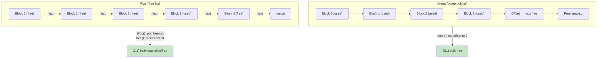
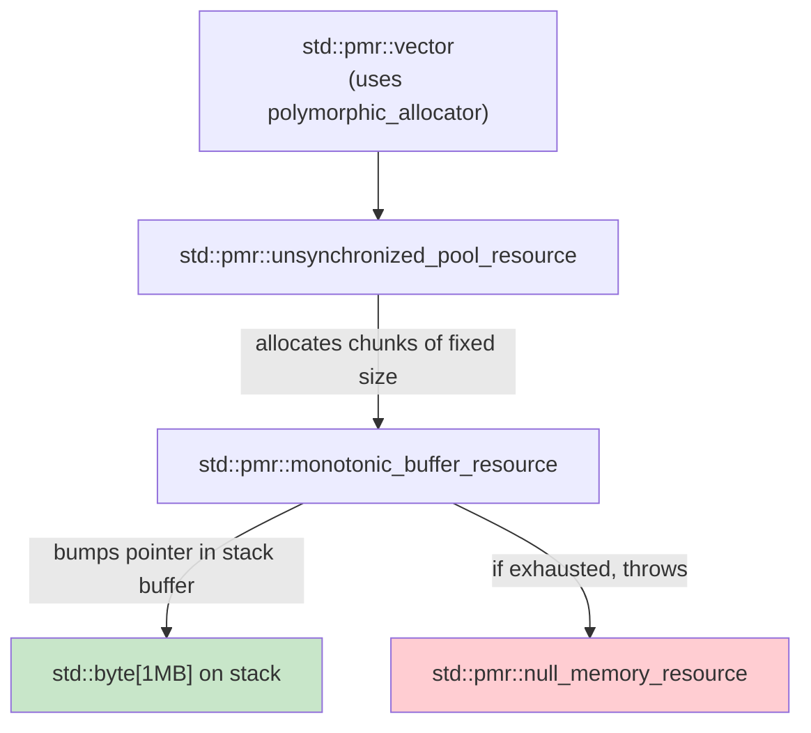

# 4. Memory Pool and Arena Allocators

> [!note] Why this note exists
> `malloc` and `new` are general-purpose. They handle arbitrary sizes, support arbitrary free orders, and re-enter the OS when needed. That generality costs ~50–300 ns per allocation, plus per-block bookkeeping overhead. If your code allocates thousands of small objects per frame (or per request, or per packet), the allocator — not your algorithm — becomes the bottleneck. Custom allocators (arenas, pools, stack allocators) collapse that overhead to a few nanoseconds. This note covers why and how, with the standard library's `std::pmr` (C++17) front and center.

## Why It Matters

Consider this typical game-loop code:

```cpp
void updateScene(Scene& scene) {
    std::vector<std::unique_ptr<Particle>> newParticles;
    for (auto& e : scene.events) {
        for (int i = 0; i < e.count; ++i) {
            newParticles.push_back(std::make_unique<Particle>(e.x, e.y));
        }
    }
    // ... use newParticles ...
}  // all particles freed here
```

A scene with 10,000 events × 10 particles each = 100,000 `make_unique` calls per frame. At 100 ns per allocation + 100 ns per free + 200 ns heap fragmentation bookkeeping, that's ~40 ms per frame — **just on memory management**. The actual physics is a footnote.

Replace the allocator with an arena that bumps a pointer and frees everything at once:

```cpp
void updateScene(Scene& scene) {
    arena_allocator<Particle> arena;
    std::vector<Particle*, arena_allocator<Particle*>> newParticles;
    for (auto& e : scene.events) {
        for (int i = 0; i < e.count; ++i) {
            newParticles.push_back(arena.alloc(e.x, e.y));  // ~3 ns
        }
    }
    // ... use newParticles ...
}  // ~0 ns — arena destructor frees everything in one shot
```

The same 100,000 allocations now cost ~0.3 ms. A **100× speedup** from changing the allocator. The same pattern appears in:

- **Game engines** — particle systems, scene graphs, animation trees.
- **High-frequency trading** — order books, message parsers.
- **Web servers** — per-request JSON trees, routing, template rendering.
- **Compilers** — AST nodes, intermediate representations.
- **Database engines** — per-query plans, intermediate results.
- **Real-time audio** — per-block DSP nodes.

If you allocate and free in bulk, an arena or pool can be the single biggest performance win available — often larger than cache or SIMD optimizations.

## Background

### What `malloc` actually does

When you call `malloc(24)`, the allocator must:

1. **Find a free block** of at least 24 bytes (plus bookkeeping). It searches free lists, bins, or a buddy system.
2. **Split the block** if it's much larger than requested.
3. **Record metadata** (size, free/used, neighbor pointers) in headers before/after the block.
4. **Return an aligned pointer.**

When you call `free`, the allocator must:

1. **Look up metadata** from the pointer.
2. **Mark the block free**.
3. **Coalesce** with neighboring free blocks if possible.
4. **Possibly return memory to the OS** (via `munmap`).

A good allocator (glibc's ptmalloc, jemalloc, tcmalloc, mimalloc) does this in ~50–100 ns on a hot cache. But under load (many threads, many sizes), latency spikes — you can see 1–10 μs allocations, especially when the allocator has to call `mmap`/`brk` for more memory.

The minimum block size is also a tax. Most allocators round up to 16 or 32 bytes and add 8–16 bytes of header. So a 12-byte allocation actually consumes 32 bytes — you pay 2.7× the memory you asked for, with cache lines wasted on headers.

### What custom allocators trade away

General allocators are general because they support:

- **Any size.**
- **Any free order.**
- **Threads.** (Usually with per-thread pools and locks for shared pools.)
- **Long-lived allocations.** (You can `malloc` and `free` hours apart.)

Custom allocators restrict some of these to gain speed:

| Allocator | Sizes | Free order | Threads | Lifetime |
|-----------|-------|------------|---------|----------|
| Arena (bump) | Any | Bulk only | Single (usually) | Bounded |
| Pool | Fixed | Any | Single (usually) | Any |
| Stack | Any (LIFO) | LIFO only | Single | Strict LIFO |
| TLS pool | Fixed | Any | Per-thread | Any |
| Monotonic resource | Any | Never | Single | Bounded |

The narrower the contract, the faster the allocator. An arena that frees everything at once doesn't need a free list at all — it just bumps a pointer.

## Main Content

### Arena allocator (bump pointer)

The simplest fast allocator. Allocate from a large pre-allocated block; each allocation advances a pointer; never free individual allocations; free the whole block at once.

```cpp
class Arena {
    std::vector<std::byte> buffer;
    size_t offset = 0;

public:
    explicit Arena(size_t bytes) : buffer(bytes) {}

    void* alloc(size_t size, size_t align = alignof(std::max_align_t)) {
        size_t aligned = (offset + align - 1) & ~(align - 1);
        if (aligned + size > buffer.size()) throw std::bad_alloc{};
        offset = aligned + size;
        return buffer.data() + aligned;
    }

    void reset() { offset = 0; }  // "free" everything
    size_t used() const { return offset; }
};
```

Allocations are O(1) — a few arithmetic ops and a pointer bump. ~3 ns each. Freeing is O(1) — set `offset = 0`. You trade the ability to free individual allocations for that speed.

Use arenas when:

- You can identify a scope (frame, request, query, transaction) where all allocations die together.
- You don't need stable pointers across the scope boundary.
- Allocations are short-lived and numerous.

Common patterns:

- **Per-frame arena** in a game loop — reset every frame.
- **Per-request arena** in an HTTP server — reset when the response is sent.
- **Per-query arena** in a database — reset when the query finishes.
- **Per-pass arena** in a compiler — reset when the pass finishes.

### Pool allocator (fixed-size blocks)

When you allocate many objects of the same size (e.g., tree nodes, particles, orders), a pool allocator is ideal. It maintains a free list of same-sized blocks; allocation pops a block, free pushes it back.

```cpp
template <class T>
class Pool {
    union Node {
        T value;
        Node* next;
        Node() {}    // union members don't default-construct
        ~Node() {}
    };
    std::vector<Node> storage;
    Node* freeList = nullptr;

public:
    explicit Pool(size_t n) : storage(n) {
        for (auto& node : storage) {
            node.next = freeList;
            freeList = &node;
        }
    }

    template <class... Args>
    T* alloc(Args&&... args) {
        if (!freeList) throw std::bad_alloc{};
        Node* n = freeList;
        freeList = n->next;
        return new (&n->value) T(std::forward<Args>(args)...);  // placement new
    }

    void free(T* p) {
        p->~T();
        Node* n = reinterpret_cast<Node*>(p);
        n->next = freeList;
        freeList = n;
    }
};
```

Allocations are O(1) — pop a pointer from the free list. Frees are O(1) — push back. ~5 ns each. Individual frees are supported, unlike arenas.

Pool allocators are great for:

- Tree nodes (AST, B-tree, red-black tree).
- Linked list nodes.
- Any object pool in a game (particles, bullets, enemies).
- Order objects in HFT.

The cost: only one size per pool. If you need three sizes, you need three pools.

### Stack allocator (LIFO)

A stack allocator is an arena where frees must happen in reverse order of allocation. It's a slight generalization — useful when you have nested scopes.

```cpp
class StackAllocator {
    std::vector<std::byte> buffer;
    size_t offset = 0;
public:
    explicit StackAllocator(size_t bytes) : buffer(bytes) {}

    void* alloc(size_t size, size_t align) {
        size_t aligned = (offset + align - 1) & ~(align - 1);
        if (aligned + size > buffer.size()) throw std::bad_alloc{};
        offset = aligned + size;
        return buffer.data() + aligned;
    }

    // Returns a marker you can roll back to
    size_t checkpoint() const { return offset; }
    void rollback(size_t cp) { offset = cp; }
};

// Usage
StackAllocator alloc(1 << 20);  // 1 MB
size_t cp = alloc.checkpoint();
auto* a = alloc.alloc(64, 8);
auto* b = alloc.alloc(128, 8);
// ... use a and b ...
alloc.rollback(cp);  // free both
```

Stack allocators are common in:

- **Temporary memory** for a function — checkpoint on entry, rollback on exit (RAII wrapper).
- **Per-thread scratch buffers** — checkpoint per task.
- **Compilers** — allocate local AST nodes, rollback on syntax errors.

### `std::pmr` — polymorphic memory resource (C++17)

C++17 standardized a clean allocator framework: `std::pmr::memory_resource` is a polymorphic base class, and `std::pmr::polymorphic_allocator<T>` is the STL-compatible allocator wrapper.

The built-in resources:

- `std::pmr::monotonic_buffer_resource` — arena, never frees individual allocations.
- `std::pmr::synchronized_pool_resource` — thread-safe pool.
- `std::pmr::unsynchronized_pool_resource` — single-thread pool.
- `std::pmr::null_buffer_resource` — always throws (used as upstream "cap").

Resources are composable: you can put a pool on top of a monotonic buffer, so the pool's chunk allocations come from the arena.

```cpp
#include <memory_resource>
#include <vector>
#include <string>

int main() {
    // Backing buffer on the stack
    std::byte stackBuffer[1 << 20];  // 1 MB
    std::pmr::monotonic_buffer_resource arena{
        stackBuffer, sizeof(stackBuffer), std::pmr::null_memory_resource::get()};

    // Pool on top of the arena
    std::pmr::unsynchronized_pool_resource pool{{}, &arena};

    // pmr-aware containers
    std::pmr::vector<std::pmr::string> v{&pool};
    for (int i = 0; i < 100'000; ++i) {
        v.emplace_back("hello");
    }
    // pool and arena cleaned up here
}
```

Key points:

- `std::pmr::vector<T>` is `std::vector<T, std::pmr::polymorphic_allocator<T>>`.
- The allocator propagates through assignment and copy — passing a `pmr::vector` to a function carries the allocator with it.
- The `memory_resource*` is a runtime pointer; containers type-erase it. You can swap resources at runtime without changing container types.
- `monotonic_buffer_resource` throws if it would need to allocate from upstream — set upstream to `null_memory_resource` to enforce "arena only" semantics.

### A real-world pmr pattern: per-request arena

```cpp
#include <memory_resource>
#include <vector>
#include <unordered_map>
#include <string>

struct RequestArena {
    std::byte buffer[64 * 1024];   // 64 KB per request — tune
    std::pmr::monotonic_buffer_resource resource{
        buffer, sizeof(buffer), std::pmr::null_memory_resource::get()};

    std::pmr::polymorphic_allocator<char> alloc() {
        return std::pmr::polymorphic_allocator<char>{&resource};
    }
};

void handleRequest(const std::string& body) {
    RequestArena arena;

    // All these containers share the arena; no global malloc calls.
    std::pmr::string jsonBody{body, arena.alloc()};
    std::pmr::unordered_map<std::pmr::string, std::pmr::string> headers{arena.alloc()};
    std::pmr::vector<std::pmr::string> tokens{arena.alloc()};

    // ... parse jsonBody, fill headers, tokenize ...
    // ... process ...

    // RAII: arena is destroyed here, all memory reclaimed at once.
}
```

Per-request allocations go from ~100 ns each (general malloc) to ~3 ns each (arena). For a request that allocates 1000 small objects, that's 100 μs saved per request — at 100k requests/sec, 10 seconds of CPU time per second of wall time.

### Real-world examples

**Game engines (Unreal, Unity ECS, EnTT):** Per-frame arenas are universal. Frame allocates a fresh arena, all transient allocations go there, arena resets at end of frame. Stable game objects use pools or the general heap.

**High-frequency trading:** Order objects live in a pre-allocated pool. The matching engine hot loop never calls `new` or `delete` — it pops from and pushes to the pool. Latency drops from microseconds to nanoseconds.

**LLVM / GCC compilers:** Each compilation pass has a bump-pointer allocator. AST nodes and intermediate IR objects never get individual `free`s — the entire arena is freed at end of pass.

**Web servers (nginx, Envoy):** Per-request memory pools. nginx's `ngx_palloc_t` is the canonical example — every per-request allocation comes from the request pool, which is freed when the request closes.

**JavaScript runtimes (V8):** Generational garbage collection is essentially two arenas (young and old gen) with bulk collection on the young gen. Most allocations die young — the arena pattern.

### When NOT to use custom allocators

- **Long-lived allocations** — they don't fit the "bounded scope" model.
- **Small numbers of allocations** — overhead of building the arena is more than savings.
- **Cross-thread sharing** — pools need locks or thread-local variants.
- **When you need stable pointers across scope boundaries** — arenas reset, so pointers don't survive.
- **In code that's not the bottleneck** — don't pre-optimize. Profile first.

### Arena vs pool allocator layout



### std::pmr resource composition



## Code Examples

### A simple arena with RAII scope

```cpp
#include <vector>
#include <byte>
#include <new>
#include <stdexcept>

class Arena {
    std::vector<std::byte> buffer_;
    size_t offset_ = 0;
public:
    explicit Arena(size_t bytes) : buffer_(bytes) {}

    void* allocate(size_t bytes, size_t align = alignof(std::max_align_t)) {
        size_t aligned = (offset_ + align - 1) & ~(align - 1);
        if (aligned + bytes > buffer_.size()) throw std::bad_alloc{};
        offset_ = aligned + bytes;
        return &buffer_[aligned];
    }

    void reset() noexcept { offset_ = 0; }
    size_t capacity() const noexcept { return buffer_.size(); }
    size_t used() const noexcept { return offset_; }
};

template <class T>
class ArenaAllocator {
    Arena* arena_;
public:
    using value_type = T;
    explicit ArenaAllocator(Arena* a) noexcept : arena_(a) {}

    T* allocate(size_t n) {
        return static_cast<T*>(arena_->allocate(n * sizeof(T), alignof(T)));
    }
    void deallocate(T*, size_t) noexcept { /* no-op: arena frees in bulk */ }

    template <class U>
    bool operator==(const ArenaAllocator<U>& o) const noexcept {
        return arena_ == o.arena_;
    }
    template <class U>
    bool operator!=(const ArenaAllocator<U>& o) const noexcept {
        return !(*this == o);
    }
};

// RAII scope guard
struct ArenaScope {
    Arena& arena;
    size_t checkpoint;
    explicit ArenaScope(Arena& a) : arena(a), checkpoint(a.used()) {}
    ~ArenaScope() { arena.reset_offset(checkpoint); }  // hypothetical API
};

int main() {
    Arena arena(1 << 20);  // 1 MB
    ArenaAllocator<int> alloc(&arena);
    std::vector<int, ArenaAllocator<int>> v{alloc};
    for (int i = 0; i < 1000; ++i) v.push_back(i);
    // No frees issued — arena destructor reclaims everything.
}
```

### `std::pmr` monotonic buffer

```cpp
#include <memory_resource>
#include <vector>
#include <string>
#include <iostream>

int main() {
    alignas(16) std::byte buffer[64 * 1024];
    std::pmr::monotonic_buffer_resource mbr{
        buffer, sizeof(buffer), std::pmr::null_memory_resource::get()};

    {
        std::pmr::vector<std::pmr::string> v{&mbr};
        for (int i = 0; i < 1000; ++i) {
            v.emplace_back("item " + std::to_string(i));
        }
        std::cout << "Stored " << v.size() << " strings\n";
    }  // ~vector called, but pmr monotonic doesn't free per-allocation

    // To reuse the buffer:
    mbr.release();   // resets the buffer

    // Now we can use it again
    std::pmr::vector<int> w{&mbr};
    for (int i = 0; i < 5000; ++i) w.push_back(i);
}
```

### Pool allocator with `std::pmr`

```cpp
#include <memory_resource>
#include <vector>
#include <string>

int main() {
    std::pmr::unsynchronized_pool_resource pool{
        std::pmr::pool_options{.max_blocks_per_chunk = 1024, .largest_required_pool_block = 64},
        std::pmr::null_memory_resource::get()
    };

    // But the pool needs an upstream to allocate chunks from!
    // Use a monotonic buffer as upstream:
    alignas(16) std::byte buffer[1 << 20];
    std::pmr::monotonic_buffer_resource mbr{buffer, sizeof(buffer)};

    std::pmr::unsynchronized_pool_resource pool2{
        std::pmr::pool_options{.max_blocks_per_chunk = 1024, .largest_required_pool_block = 64},
        &mbr
    };

    std::pmr::vector<std::pmr::string> v{&pool2};
    for (int i = 0; i < 100'000; ++i) {
        v.emplace_back("hello");
    }
}
```

### A custom `memory_resource` for an arena

```cpp
#include <memory_resource>
#include <vector>

class ArenaResource : public std::pmr::memory_resource {
    std::vector<std::byte> buffer_;
    size_t offset_ = 0;
public:
    explicit ArenaResource(size_t bytes) : buffer_(bytes) {}

protected:
    void* do_allocate(size_t bytes, size_t align) override {
        size_t aligned = (offset_ + align - 1) & ~(align - 1);
        if (aligned + bytes > buffer_.size()) throw std::bad_alloc{};
        offset_ = aligned + bytes;
        return &buffer_[aligned];
    }
    void do_deallocate(void*, size_t, size_t) noexcept override {
        // no-op — arena is bulk-freed
    }
    bool do_is_equal(const std::pmr::memory_resource& other) const noexcept override {
        return this == &other;
    }

public:
    void reset() noexcept { offset_ = 0; }
};

// Usage
int main() {
    ArenaResource arena(1 << 20);
    std::pmr::vector<int> v{&arena};
    for (int i = 0; i < 10000; ++i) v.push_back(i);
    arena.reset();  // reclaim all memory
}
```

### Per-frame arena in a game loop

```cpp
class FrameArena {
    std::pmr::monotonic_buffer_resource resource_;
public:
    FrameArena(size_t bytes) : resource_(bytes, std::pmr::null_memory_resource::get()) {}
    std::pmr::memory_resource* resource() { return &resource_; }
};

class Game {
    FrameArena frameArena_{4 << 20};  // 4 MB per frame
public:
    void tick() {
        // Each frame starts with a fresh arena
        std::pmr::polymorphic_allocator<std::byte> alloc{frameArena_.resource()};

        std::pmr::vector<Particle> particles{alloc};
        std::pmr::vector<Light> lights{alloc};
        std::pmr::vector<RenderCommand> cmds{alloc};

        // ... simulate, populate containers ...

        render(cmds);

        // End of frame: release all memory at once
        frameArena_.resource().release();
    }
};
```

## Common Pitfalls

> [!danger] Pitfall 1 — Using arenas for long-lived data
> Arenas free everything at once. If you store a pointer that needs to outlive the arena, you have a dangling pointer. Use the arena only for scope-bounded data.

> [!danger] Pitfall 2 — Mixing allocator-aware and non-allocator-aware containers
> A `std::pmr::vector<std::string>` is a footgun — the inner `std::string` uses the global allocator, not the pmr one. Use `std::pmr::vector<std::pmr::string>` for full propagation.

> [!danger] Pitfall 3 — Forgetting to propagate allocators through copies
> If you copy a `pmr::vector` into a non-pmr `vector`, the new vector uses the default allocator. Match the types or use `.get_allocator()` carefully.

> [!danger] Pitfall 4 — Thread safety assumptions
> `unsynchronized_pool_resource` and `monotonic_buffer_resource` are not thread-safe. If you share them across threads, use `synchronized_pool_resource` or wrap in a mutex.

> [!danger] Pitfall 5 — Alignment bugs in custom allocators
> Always align to at least `alignof(std::max_align_t)` (typically 16) unless you know the type. SIMD types need 32 or 64. Forgetting alignment gives crashes on AVX loads.

> [!danger] Pitfall 6 — Leaking arena memory
> If you create an arena, allocate a lot, and never `release()` or destroy it, the memory is held forever. Use RAII wrappers.

> [!danger] Pitfall 7 — Pool fragmentation
> A pool of fixed-size blocks doesn't fragment, but if you allocate from the *upstream* allocator every time the pool grows, you're back to general heap behavior. Cap the pool's growth with a monotonic upstream.

> [!danger] Pitfall 8 — Premature custom allocator
> If `malloc` isn't your bottleneck (profile!), a custom allocator adds complexity for nothing. Profile first, allocate smart second.

> [!danger] Pitfall 9 — Placement new without destructor calls
> When you `new (arena.alloc(...)) T(...)`, you must call `p->~T()` before the arena reclaims that memory — otherwise resources (file handles, mutexes, inner allocations) leak.

> [!danger] Pitfall 10 — Recursive arena growth
> If your arena grows by `mmap`-ing more memory when full, you've reintroduced the syscall overhead. Pre-allocate a fixed size and throw on overflow.

## Tips and Tricks

- **Profile before customizing.** Use `perf` or callgrind to see how much time is in `malloc`/`free`. If it's <5% of total, don't bother.
- **Use `std::pmr` first.** It's standard, composable, and well-tested. Only write a custom allocator when pmr doesn't fit.
- **Match the allocator to the access pattern.** Bulk allocations → arena. Fixed-size → pool. LIFO → stack. Cross-thread → TLS pools.
- **Use `monotonic_buffer_resource` with a stack buffer for ultra-low-latency allocation.** No heap, no locks, no syscalls.
- **Cap arenas with `null_memory_resource` upstream.** It enforces "fail rather than fall back to malloc" — useful for predictable latency.
- **Propagate allocators through container types.** `std::pmr::vector<std::pmr::string>` not `std::pmr::vector<std::string>`.
- **Pool hot types.** Anything you allocate thousands of per second (particles, orders, AST nodes) deserves a pool.
- **Use RAII for arena scopes.** A `ScopeGuard` that captures the arena checkpoint and restores it on destruction makes temporary allocations safe.
- **Track arena high-water marks.** Log `arena.used()` per frame/request to size the buffer correctly. Too big wastes memory; too small throws.
- **Reuse arenas across requests.** Don't destroy and recreate — `release()` and reuse.
- **Consider `mimalloc` or `jemalloc` as drop-in replacements for `malloc`.** They're 2–3× faster than glibc's default and often remove the need for custom allocators entirely.
- **Don't allocate inside hot loops.** Move allocations outside the loop, or pre-allocate with `reserve()`.
- **For SIMD, use aligned allocators.** `std::pmr` doesn't guarantee alignment; use `alignas(32)` on the buffer or a custom resource.

## Active Recall

1. Why is `malloc` slow? List three operations it performs per call.
2. What does an arena allocator trade away to gain speed?
3. When would you use a pool allocator instead of an arena?
4. Write a minimal arena allocator that supports `allocate(size, align)`.
5. What is `std::pmr::monotonic_buffer_resource`, and when does it free memory?
6. Why is `std::pmr::vector<std::string>` a footgun?
7. How does `std::pmr::unsynchronized_pool_resource` differ from the synchronized version?
8. What is `std::pmr::null_memory_resource` useful for?
9. How does resource composition work in pmr (pool on top of arena)?
10. Give three real-world systems that use per-request or per-frame arenas.
11. What must you call on an arena-allocated object before its memory is reclaimed?
12. Name three things to check before introducing a custom allocator.

## Next Steps

- Read [[7. Memory Management/7. Custom Allocators]] — the underlying concepts, written before `std::pmr` was widely available.
- Read [[7. Memory Management/1. Stack and Heap]] — the foundation on which allocators operate.
- Read [[19. Performance Optimization/1. CPU Cache Locality]] — allocators affect cache behavior; a pool of small blocks may hurt cache locality if blocks are scattered.
- Read [[19. Performance Optimization/5. Profiling Workflow]] — confirm that allocations are actually the bottleneck before optimizing them.
- Read [[14. Concurrency and Multithreading/7. Thread Pools]] — per-thread arena pools are the natural extension.
- Read [[20. Advanced C++ Topics/1. Coroutines Deep Dive]] — coroutine frame allocation often needs a custom allocator for high throughput.
- Cross-reference Andrei Alexandrescu's "Custom Allocators" CppCon talk for the canonical allocator design discussion.
- Read the mimalloc design doc for a modern allocator implementation deep-dive.
