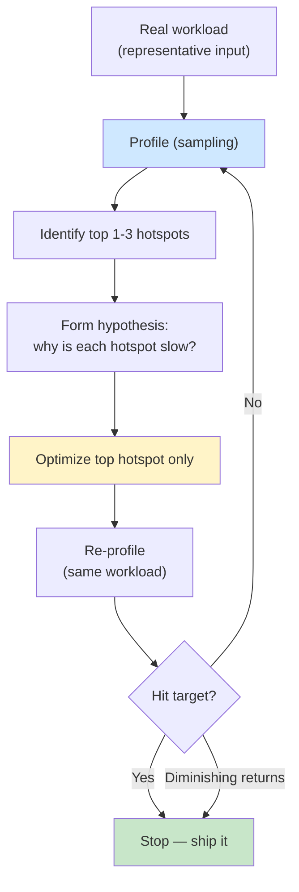
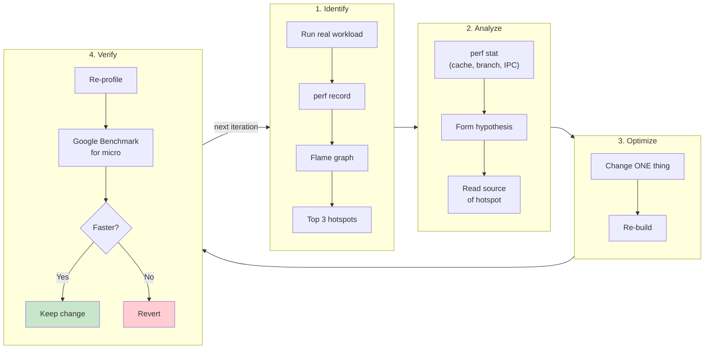

# 5. Profiling Workflow

> [!note] Why this note exists
> Performance intuition is wrong most of the time. The function you "just know" is the bottleneck rarely is. The fix that "obviously" helps often doesn't. The only way to optimize effectively is to **measure, optimize, re-measure** — and to use the right tool for each kind of measurement. This note covers sampling vs instrumentation profilers, the practical tools (`perf`, Callgrind, VTune, Flamegraph), microbenchmarking with Google Benchmark, statistical significance, and the anti-patterns that waste your time.

## Why It Matters

Knuth's famous quote: "Premature optimization is the root of all evil." The full version is even better:

> Programmers waste enormous amounts of time thinking about, or worrying about, the speed of noncritical parts of their programs... We should forget about small efficiencies, say about 97% of the time: premature optimization is the root of all evil. Yet we should not pass up our opportunities in that critical 3%.

The catch: you can't know which 3% is critical without measuring. The trap is assuming you know. Here's the canonical mistake:

1. Engineer looks at code, "knows" `parse()` is the bottleneck.
2. Spends 3 days rewriting `parse()` to be 5× faster.
3. End-to-end latency drops by 1%.
4. Profile reveals 95% of time was in `serialize()`, which they never touched.

Worse: the rewrite introduced a subtle bug, the gain was lost when the next feature was added, and the team is now afraid to touch that code.

A profiling-first workflow prevents this:

1. **Profile the real workload.** Identify the top 1–3 hotspots.
2. **Form a hypothesis.** Why is each hotspot expensive?
3. **Optimize the top one.** Don't touch the others yet.
4. **Re-profile.** Did it help? Did something else become the new bottleneck?
5. **Iterate or stop.** Stop when you hit your target or when further work has diminishing returns.

This note is about how to execute that workflow with the right tools.

## Background

### Sampling vs instrumentation

There are two fundamentally different ways to profile:

**Sampling profilers** periodically interrupt the program (e.g., every 1 ms, or every N CPU cycles) and record the call stack. After running for a while, you have a statistical sample of where time was spent.

- Pro: Very low overhead (~1–5%), no code changes, works on optimized binaries.
- Con: Misses short functions (a function that runs in 0.1 ms may never be sampled), coarse granularity.
- Tools: `perf`, VTune (sampling mode), Apple Instruments, `gperftools` (CPU profiler).

**Instrumentation profilers** insert code at function entry/exit (or use compiler instrumentation) to record every call's start/end time.

- Pro: Captures every call, exact counts and timings.
- Con: High overhead (10–100× slowdown), may change cache behavior enough to invalidate results.
- Tools: Callgrind, gprof, manually inserted `std::chrono` calls, Tracy.

Rule of thumb:

- **Start with sampling.** Find the 80/20 hotspots.
- **Use instrumentation for fine detail** when you need to know exact call counts or for short, frequently-called functions.
- **Use Tracy or `perf trace` for latency-sensitive paths** where you need per-event timing.

### What "the bottleneck" really means

A "bottleneck" can be several different things:

1. **CPU-bound** — the CPU is doing arithmetic; cycles are the limit.
2. **Memory-bound** — the CPU is waiting on DRAM or cache misses.
3. **I/O-bound** — waiting on disk or network.
4. **Lock-bound** — waiting on mutexes.
5. **Allocation-bound** — `malloc`/`free` overhead.
6. **Branch-misprediction-bound** — pipeline stalls.

Each has different profiling signatures:

| Bottleneck | perf event signature |
|------------|---------------------|
| CPU | high `cycles`, high `instructions` |
| Memory | high `cache-misses`, low `instructions/cycle` |
| I/O | high `iowait` time, low CPU usage |
| Lock | high `sched:sched_switch`, low CPU |
| Allocation | high `instructions` in `malloc`/`free` frames |
| Misprediction | high `branch-misses` |

A profiler that only shows "where CPU time was spent" misses most of these. You need both a time profiler and a hardware-counter profiler.

### Amdahl's law

The speedup from optimizing a part of the program is limited by that part's share of total time:

$$\text{speedup} = \frac{1}{(1 - p) + p/s}$$

where $p$ is the fraction of time spent in the optimized part, and $s$ is the speedup of that part.

Practical implications:

- A function taking 50% of total time, sped up 2×, gives 1.33× overall speedup.
- A function taking 5% of total time, sped up 10×, gives 1.047× overall speedup.
- A function taking 1% of total time, no matter how much you speed it up, gives at most 1.01× overall.

**Always optimize the biggest piece first.** Even a 50% speedup of a 5%-of-time function is invisible; a 20% speedup of a 50%-of-time function is a real win.

### Statistical significance in benchmarks

Microbenchmarks are noisy. CPU frequency scaling, thermal throttling, OS scheduler decisions, cache state from previous runs — all introduce variance. A "2× speedup" measured once may be noise.

A good benchmark:

1. **Runs many iterations** — enough to swamp noise (typically thousands).
2. **Reports min/median/mean/stddev** — not just one number.
3. **Uses the same machine, same load, same compiler flags** for both versions.
4. **Warms up the cache** before measuring.
5. **Disables CPU frequency scaling** (`cpufreq-set -g performance`) if possible.
6. **Reports confidence intervals** — are the two versions actually different?

Google Benchmark does most of this automatically. Use it.

## Main Content

### The profiling workflow cycle



This loop is the heart of the workflow. Don't skip steps. Don't optimize multiple things at once. Don't trust your intuition — trust the profile.

### Tool 1: `perf` (Linux sampling profiler)

`perf` is the Linux kernel's profiler. It uses hardware performance counters and traces kernel events. It's the single most important tool in a Linux C++ developer's toolkit.

Basic sampling:

```bash
# Record a 30-second sample of the program
perf record -F 99 -g -- ./my_program

# View the report
perf report

# Top hotspots, text mode
perf report --stdio | head -50
```

- `-F 99` — sample at 99 Hz (not 100, to avoid synchronizing with periodic events).
- `-g` — record call graphs (so you can see callers, not just leaves).
- `--call-graph=dwarf` (or `lbr` on Intel) — better call graph capture.

Hardware counter events:

```bash
# Cache behavior
perf stat -e cache-misses,cache-references ./my_program

# Branch behavior
perf stat -e branch-misses,branches ./my_program

# Combined picture
perf stat -e cycles,instructions,cache-misses,branch-misses,L1-dcache-load-misses \
    ./my_program
```

`perf stat` is extremely useful — it tells you *what kind* of bottleneck you have. High `instructions` but low IPC? Probably memory-bound. High `cache-misses`? Cache problem. High `branch-misses`? Branch problem.

### Tool 2: Flame graphs

A flame graph visualizes a sampled profile. Each box is a function; its width is the share of samples in that function (and its children). The y-axis is the call stack — the top of the stack is the currently-executing function, and you can see what called it.

```bash
# Install flamegraph tools
git clone https://github.com/brendangregg/FlameGraph

# Record profile
perf record -F 99 -g -- ./my_program

# Fold into a single text format
perf script | ./FlameGraph/stackcollapse-perf.pl > out.folded

# Generate the SVG
./FlameGraph/flamegraph.pl out.folded > flame.svg

# Open flame.svg in a browser
```

The result is an interactive SVG. Hover for details, click to zoom, search for function names.

Reading a flame graph:

- A **wide top box** = a function that itself is the hotspot (good target for inlining or rewriting).
- A **wide middle box with thin top** = many callers spending time here (good target for algorithmic improvement).
- A **thin stack** = not a problem; ignore it.
- A **"tower"** of boxes = a deep call chain; the bottom of the tower is the caller paying for everything.

### Tool 3: Valgrind / Callgrind

Valgrind is an instrumentation framework. Callgrind is its call-graph profiler. Unlike `perf`, it intercepts every instruction — exact counts, but ~20–50× slowdown.

```bash
valgrind --tool=callgrind --collect-jumps=yes ./my_program

# View results
callgrind_annotate callgrind.out.<pid>
# or use KCachegrind / QCachegrind GUI
kcachegrind callgrind.out.<pid> &
```

Callgrind is invaluable when:

- You need exact call counts (not just samples).
- You need to profile short, frequently-called functions that sampling misses.
- You want instruction-level breakdown.

Don't use Callgrind for performance numbers — the 20× slowdown distorts timing. Use it for call counts and instruction attribution, then verify timing with `perf`.

Valgrind also runs Memcheck (memory errors) and Helgrind/DRD (threading errors) — see [[15. Debugging and Profiling/3. Valgrind]].

### Tool 4: Intel VTune Profiler

VTune is Intel's commercial profiler. It's expensive but powerful, especially on Intel hardware. Key features:

- **Microarchitecture Exploration** — analyzes pipeline stalls, cache behavior, branch prediction, and tells you *why* code is slow (e.g., "47% of cycles are due to L2 misses").
- **Memory Access** — pinpoints cache misses to specific lines of code.
- **Hotspots** — sampling profiler with source annotation.
- **Threading** — lock wait analysis.

VTune is the gold standard for x86 performance analysis. The free alternatives (`perf`, `uProf` on AMD) cover most of the same ground for less-specialized needs.

### Tool 5: Microbenchmarking with Google Benchmark

When you have a hypothesis ("vectorized version is faster than scalar"), you need to test it in isolation. Google Benchmark is the standard.

```cpp
#include <benchmark/benchmark.h>
#include <vector>
#include <numeric>

static void BM_SumScalar(benchmark::State& state) {
    std::vector<int> v(state.range(0), 1);
    for (auto _ : state) {
        long s = 0;
        for (int x : v) s += x;
        benchmark::DoNotOptimize(s);
    }
}
BENCHMARK(BM_SumScalar)->Range(1 << 10, 1 << 24);

static void BM_SumStl(benchmark::State& state) {
    std::vector<int> v(state.range(0), 1);
    for (auto _ : state) {
        long s = std::reduce(v.begin(), v.end(), 0L);
        benchmark::DoNotOptimize(s);
    }
}
BENCHMARK(BM_SumStl)->Range(1 << 10, 1 << 24);

BENCHMARK_MAIN();
```

Compile and run:

```bash
g++ -O3 -march=native benchmark.cpp -lbenchmark -lpthread -o bench
./bench
```

Output:

```
BM_SumScalar/4096        1200 ns         1200 ns       581923
BM_SumScalar/1048576    310000 ns       310000 ns         2254
BM_SumStl/4096            300 ns          300 ns      2333333
BM_SumStl/1048576      78000 ns        78000 ns         8972
```

Key features:

- `for (auto _ : state)` — the benchmark loop, repeated until timing is stable.
- `benchmark::DoNotOptimize(x)` — prevents the compiler from optimizing away the result.
- `state.range(0)` — parameterized benchmarks (here, vector size).
- `->Range(...)` — sweep a range of sizes.
- `->MinTime(...)` — minimum wall time per benchmark.
- `->UseRealTime()` — use wall clock, not CPU time.
- `->Threads(N)` — run with N threads.

Google Benchmark automatically:

- Picks iteration counts to swamp noise.
- Reports mean and median.
- Computes standard deviation.
- Runs multiple repeats if requested.

### Statistical significance

When you compare two benchmarks, you need to know whether the difference is real or noise. Google Benchmark reports standard deviation; if the means differ by less than 2σ, you can't be confident.

For rigorous comparison:

1. Run each benchmark at least 25 times.
2. Compute mean and stddev for both.
3. Compute a t-test or use a non-parametric test (Mann-Whitney U) for small samples.
4. Report the difference with a 95% confidence interval.

A simple rule: if version A's median ± stddev doesn't overlap version B's median ± stddev, the difference is probably real.

Also: disable CPU frequency scaling (`cpufreq-set -g performance`), disable turbo boost (for consistency), pin the process to a core (`taskset -c 2`), and run on an idle machine.

### Common optimization anti-patterns

> [!danger] Anti-pattern 1 — Premature optimization
> Optimizing before profiling. 90% of "obvious" optimizations are wrong. Profile first.

> [!danger] Anti-pattern 2 — Micro-optimizing cold code
> Saving 10 ns in a function called once per request, when the request takes 50 ms. Use Amdahl's law.

> [!danger] Anti-pattern 3 — Optimizing for the wrong input
> Benchmarking with 1024 elements when production uses 10M. Cache effects differ wildly between sizes.

> [!danger] Anti-pattern 4 — Trusting a single benchmark run
> Single runs have 10–30% noise. Always run many iterations and report statistics.

> [!danger] Anti-pattern 5 — Optimizing the wrong layer
> Rewriting a function in hand-tuned AVX when the network round-trip dominates by 100×.

> [!danger] Anti-pattern 6 — Not building with optimizations
> Profiling `-O0` code is meaningless — the optimizer changes everything. Always profile `-O2` or `-O3`.

> [!danger] Anti-pattern 7 — Optimizing without debug symbols
> Without `-g`, profilers can't show you source lines. Always compile with `-g` (or `-g2` for release builds; some symbols, no impact on optimization).

> [!danger] Anti-pattern 8 — Optimizing for the wrong hardware
> Benchmarking on a laptop with AVX-512 when production runs on a server with AVX2 only.

> [!danger] Anti-pattern 9 — "Clever" code that the compiler can't optimize
> Bit tricks the compiler doesn't recognize, often slower than idiomatic code that the compiler *does* know how to vectorize.

> [!danger] Anti-pattern 10 — Optimization that breaks tests
> A 5× speedup isn't worth shipping a regression. Always run the full test suite after each optimization.

### Profiling workflow diagram



## Code Examples

### A Google Benchmark for cache effects

```cpp
#include <benchmark/benchmark.h>
#include <vector>

static void BM_RowMajor(benchmark::State& state) {
    const int N = state.range(0);
    std::vector<std::vector<int>> m(N, std::vector<int>(N, 1));
    for (auto _ : state) {
        long s = 0;
        for (int i = 0; i < N; ++i)
            for (int j = 0; j < N; ++j)
                s += m[i][j];
        benchmark::DoNotOptimize(s);
    }
    state.SetBytesProcessed(static_cast<int64_t>(state.iterations()) * N * N * sizeof(int));
}
BENCHMARK(BM_RowMajor)->Range(64, 4096);

static void BM_ColMajor(benchmark::State& state) {
    const int N = state.range(0);
    std::vector<std::vector<int>> m(N, std::vector<int>(N, 1));
    for (auto _ : state) {
        long s = 0;
        for (int j = 0; j < N; ++j)
            for (int i = 0; i < N; ++i)
                s += m[i][j];
        benchmark::DoNotOptimize(s);
    }
    state.SetBytesProcessed(static_cast<int64_t>(state.iterations()) * N * N * sizeof(int));
}
BENCHMARK(BM_ColMajor)->Range(64, 4096);

BENCHMARK_MAIN();
```

### A `perf stat` template

```bash
#!/bin/bash
# perf-stat.sh — capture a comprehensive hardware-counter snapshot

perf stat -e \
  cycles,\
  instructions,\
  cache-references,\
  cache-misses,\
  L1-dcache-loads,\
  L1-dcache-load-misses,\
  LLC-loads,\
  LLC-load-misses,\
  branches,\
  branch-misses,\
  task-clock,\
  context-switches,\
  page-faults \
  -- ./my_program "$@"
```

Output example (annotated):

```
   2,341,234,567  cycles                # 3.4 GHz
   5,123,456,789  instructions          # 2.19 IPC  (good — CPU-bound)
     123,456,789  cache-references
      45,678,901  cache-misses          # 37.0% of all cache refs (BAD — memory-bound)
   1,234,567,890  L1-dcache-loads
      89,012,345  L1-dcache-load-misses # 7.2%
      12,345,678  LLC-loads
       5,678,901  LLC-load-misses       # 46.0% (BAD)
     678,901,234  branches
      34,567,890  branch-misses         # 5.1% (high)
        689.23 ms task-clock            # 6.9 cores utilized
                4  context-switches
            1,234  page-faults
```

This one command tells you:
- IPC is 2.19 → CPU-bound, not memory-bound (despite cache misses — they're L1 hits being measured).
- L1 miss rate is 7% — okay.
- LLC miss rate is 46% — bad. Many requests are going to DRAM.
- Branch misprediction is 5% — moderate. (See [[19. Performance Optimization/2. Branch Prediction]].)
- The task used 6.9 cores in 100 ms wall time — good parallelism.

### Manual timing (when nothing else works)

```cpp
#include <chrono>
#include <iostream>

class Timer {
    using clock = std::chrono::high_resolution_clock;
    clock::time_point start_;
public:
    Timer() : start_(clock::now()) {}
    double elapsed_ms() const {
        return std::chrono::duration<double, std::milli>(clock::now() - start_).count();
    }
    void reset() { start_ = clock::now(); }
};

int main() {
    Timer t;
    doExpensiveWork();
    std::cout << "elapsed: " << t.elapsed_ms() << " ms\n";
}
```

Use this only as a last resort for one-off measurements. For systematic work, use Google Benchmark or `perf`.

### Tracy for real-time profiling

Tracy is a hybrid profiler (sampling + instrumentation) with a focus on real-time applications (games, audio). You instrument your code with zone markers:

```cpp
#include <tracy/Tracy.hpp>

void render() {
    ZoneScoped;  // automatic zone using function name
    for (auto& obj : scene.objects) {
        ZoneScopedN("RenderObject");  // named zone
        obj.draw();
    }
}

void onFrame() {
    FrameMark;  // marks a frame boundary in the profiler
    ZoneScoped;
    update();
    render();
}
```

Run your program with the Tracy server running, and you get a live timeline view of every zone, every frame, every lock, every memory allocation — synchronized across threads. For games and real-time audio, Tracy is unmatched.

## Common Pitfalls

> [!danger] Pitfall 1 — Profiling debug builds
> `-O0` code is 5–10× slower than `-O2` and has completely different hotspots. Always profile the build you intend to ship.

> [!danger] Pitfall 2 — Profiling without representative data
> Production data has different sizes and patterns than test data. Profile with realistic inputs.

> [!danger] Pitfall 3 — Optimizing in isolation
> A microbenchmark shows 5× speedup. End-to-end shows 1.02×. Always check the integrated impact.

> [!danger] Pitfall 4 — Trusting wall clock under load
> Run benchmarks on an idle machine. Background processes cause noise.

> [!danger] Pitfall 5 — One-off measurements
> Run the benchmark 25+ times. Look at the distribution, not a single point.

> [!danger] Pitfall 6 — Ignoring cold start
> First-run performance often differs from steady-state. Decide which matters for your use case.

> [!danger] Pitfall 7 — Comparing apples to oranges
> Different compiler flags, different CPUs, different OS versions — all invalidate comparisons.

> [!danger] Pitfall 8 — Not using `DoNotOptimize`
> In microbenchmarks, the compiler will optimize away unused results. Use `benchmark::DoNotOptimize` or `volatile`.

> [!danger] Pitfall 9 — Compiler differences
> GCC and Clang optimize differently. A trick that helps on one may hurt on the other. Test on both.

> [!danger] Pitfall 10 — Microbenchmarking complex code
> A function with many branches, allocations, or virtual calls doesn't microbenchmark well — variance dominates. Use integration benchmarks instead.

## Tips and Tricks

- **Always profile before optimizing.** "Where is the time going?" is the first question.
- **Profile the actual production workload.** Synthetic workloads mislead.
- **Use `perf stat` first** — it tells you *what kind* of bottleneck you have.
- **Use flame graphs to see the call hierarchy.** Visual > text for understanding profiles.
- **Build with `-O3 -g -march=native`.** Optimizations on, debug symbols on.
- **Run benchmarks many times.** Report median and stddev, not a single number.
- **Use Google Benchmark for microbenchmarks.** Don't roll your own timing.
- **Disable CPU frequency scaling** (`cpufreq-set -g performance`) for consistent measurements.
- **Pin benchmarks to a specific core** with `taskset -c 2` to avoid migration noise.
- **Compare apples to apples** — same compiler, same flags, same machine, same input.
- **Optimize the top hotspot only** — Amdahl's law is unforgiving.
- **Re-profile after every change.** Don't accumulate unverified changes.
- **Use `git stash` or branches to compare versions** — keep a clean revert path.
- **Track regressions in CI** — run key benchmarks nightly so you catch slowdowns early.
- **Read other people's profiles.** Tracy, perf, and flame graph examples online are great learning material.
- **Use Tracy for real-time apps** — its timeline view reveals latency spikes that sampling misses.
- **For memory profiling, use Heaptrack or Massif.** They show allocation counts and sizes.
- **Don't forget I/O.** If your program is disk- or network-bound, CPU profiling is useless. Use `iostat`, `iotop`, `tcpdump`.
- **Beware of the observer effect.** Instrumentation slows code; the slowdown changes behavior. Cross-check with sampling.

## Active Recall

1. Explain the difference between sampling and instrumentation profiling. When would you use each?
2. What is a flame graph, and how do you read it?
3. Write a `perf stat` invocation that captures cycles, cache misses, and branch misses.
4. Name three things `perf stat` can tell you about the *kind* of bottleneck a program has.
5. What is Amdahl's law? Give an example where optimizing a 5%-of-time function yields negligible overall speedup.
6. Write a Google Benchmark for a function that sums a vector.
7. Why is `benchmark::DoNotOptimize` necessary? What happens without it?
8. List five anti-patterns in performance optimization.
9. Why should you profile `-O3 -g` builds, not `-O0` builds?
10. How many times should you run a microbenchmark? What statistics do you report?
11. What does `cpufreq-set -g performance` do, and why does it matter for benchmarking?
12. Name two scenarios where sampling profilers are insufficient and you need instrumentation.

## Next Steps

- Read [[15. Debugging and Profiling/5. perf and Flamegraphs]] — hands-on details of `perf`.
- Read [[15. Debugging and Profiling/3. Valgrind]] — Callgrind and Memcheck.
- Read [[19. Performance Optimization/1. CPU Cache Locality]] — once you've found a cache-miss-heavy hotspot, this note explains what to do.
- Read [[19. Performance Optimization/2. Branch Prediction]] — for hotspots with high `branch-misses`.
- Read [[19. Performance Optimization/3. SIMD and Vectorization]] — for hotspots with low IPC and straight-line arithmetic.
- Read [[19. Performance Optimization/4. Memory Pool and Arena Allocators]] — for hotspots in `malloc`/`free`.
- Read [[15. Debugging and Profiling/4. Sanitizers (ASan, UBSan, TSan)]] — correctness comes before performance.
- Cross-reference Brendan Gregg's flame graph documentation and the Google Benchmark README for the canonical references.
- Read Chandler Carruth's CppCon talk "Profiling and Optimizing C++ Code" for a masterclass on the workflow.
