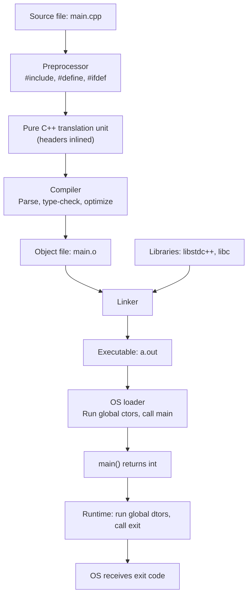

## Why This Matters

Every C++ program — from a one-line toy to a multi-million-line operating system kernel — shares the same skeletal structure. Mastering that skeleton unlocks the rest of the language. The `"Hello, World!"` program is not a trivial warm-up; it is a **microcosm** of every concept you will see for the next thousand pages: preprocessing, translation units, the global namespace, the `main` entry point, I/O streams, the standard library, expression statements, and the operating-system contract that turns source code into a running process. If you understand every token of `"Hello, World!"`, you already understand the shape of all C++ programs.

This note dissects that shape from the inside out. By the end you will know exactly what the preprocessor does, why `main` is special, what `std::cout << x` really means, and why the return value of `main` matters to your shell.

## Background

### A Brief History of C++

C++ was created by **Bjarne Stroustrup** at Bell Labs starting in 1979. Its original name was *"C with Classes"* because Stroustrup wanted to add Simula-style object-oriented facilities to the C language without sacrificing C's raw performance and closeness to the hardware. The name was changed to C++ in 1983 — the `++` being the increment operator, a pun meaning "the successor to C." The first international standard, **C++98**, was ratified in 1998. Subsequent major standards — C++11, C++14, C++17, C++20, C++23 — have added layers of modernity (lambdas, concepts, modules, ranges, coroutines) on top of that original core.

### Compilation Model in One Paragraph

A C++ program is composed of **translation units**. A translation unit is what you get after the preprocessor has run on a single `.cpp` file and recursively inlined every `#include`. The compiler turns each translation unit into an **object file** (`.o`/`.obj`). A **linker** then stitches the object files together (along with libraries) into a final executable. This is fundamentally different from languages like Python or Java, where a single source file is parsed and run as a unit. The compilation model is the reason headers exist, the reason `#ifndef` guards exist, and the reason build times are a perennial complaint in C++ shops.

### The Operating-System Contract

When you double-click an executable (or run it from a shell), the OS loader maps it into memory and transfers control to an entry point. On Linux/ELF this is `_start`, which sets up the C runtime and then calls `main`. On Windows/PE the equivalent is `mainCRTStartup`. The C++ runtime (`crt0`/`crtbegin`) runs global constructors, initializes `std::cout`/`std::cin`, calls `main`, and on `main`'s return calls `exit`, runs global destructors, and returns control to the OS with the exit code you supplied. The exit code is what shells test with `$?` (Bash) or `%ERRORLEVEL%` (cmd).

## Main Content

### The Canonical Program

```cpp
#include <iostream>

int main() {
    std::cout << "Hello, World!" << std::endl;
    return 0;
}
```

Five lines. Let us dissect every token.

### 1. `#include <iostream>` — The Preprocessor Directive

Lines beginning with `#` are **preprocessor directives**. The preprocessor runs *before* the C++ compiler proper sees the file. It is a separate text-substitution phase inherited from C.

- `#include` performs a verbatim textual insertion: the entire contents of the named file are pasted into your translation unit at that point.
- Angle brackets (`<iostream>`) tell the preprocessor to search the **system include paths** (where your compiler installation keeps standard headers). Double quotes (`"my_header.hpp"`) tell it to search the current source directory first, then fall back to system paths.
- `<iostream>` declares the standard stream objects `std::cin`, `std::cout`, `std::cerr`, `std::clog`, plus their wide-character variants. Without this include, the names are not in scope.

> [!info] Header Files Have No Extension
> Standard C++ headers (since C++98 for the standard library, since C++23 for the entire standard library) deliberately have **no `.h` suffix**. The C compatibility headers (`<cstdio>`, `<cstdlib>`, …) keep the C name but prefix `c` and drop `.h`. The legacy `<iostream.h>` headers are pre-standard and should never be used today.

After preprocessing, your translation unit contains tens of thousands of lines from the standard library plus your five. The compiler then parses this giant blob.

### 2. `int main()` — The Entry Point

`main` is the only function in C++ that is **required** by the language to exist exactly once in a hosted environment. (In a *freestanding* environment — e.g., bare-metal embedded — `main` is not required; the entry point is implementation-defined.)

There are exactly **two** standard signatures for `main`:

```cpp
int main();                          // (1) No command-line arguments
int main(int argc, char* argv[]);    // (2) With command-line arguments
```

Some compilers also accept a third, non-portable form on Windows:

```cpp
int main(int argc, char* argv[], char* envp[]);  // POSIX-ish, also MSVC
```

Anything else — `void main()`, `int main(void)`, returning `auto` — is non-standard and may be rejected.

> [!warning] `void main()` Is Wrong
> Despite appearing in old textbooks, `void main()` is **not legal C++** in a hosted environment. The C++ standard ([basic.start.main]) explicitly requires `main` to return `int`. The only reason some compilers accept it is historical leniency. Always write `int main()`.

#### The `argc` / `argv` Mechanism

When you invoke `./program foo bar 42`, the OS passes the shell's argument vector to the runtime, which forwards it to `main`:

- `argc` (argument count) is at least 1 (the program name itself).
- `argv` (argument vector) is an array of C-style strings. `argv[0]` is the program name; `argv[argc]` is guaranteed to be `nullptr`.

```cpp
#include <iostream>

int main(int argc, char* argv[]) {
    std::cout << "Program name: " << argv[0] << '\n';
    for (int i = 1; i < argc; ++i) {
        std::cout << "Arg " << i << ": " << argv[i] << '\n';
    }
    return 0;
}
```

### 3. The Braces `{ }` — Scope

C++ uses braces to delimit a **block scope**. The body of `main` is a block. Variables declared inside it are destroyed when execution leaves the block — this is the foundation of RAII (Resource Acquisition Is Initialization), the C++ idiom that ties resource lifetimes to scope.

There are two prevailing brace-placement styles:

- **K&R / 1TBS** (Stroustrup style): opening brace on the same line as the control keyword.
- **Allman style**: opening brace on its own line.

Both are legal; pick one and be consistent. The standard library uses Allman.

### 4. `std::cout << "Hello, World!" << std::endl;`

This is the line that actually does work. Let us unpack each piece.

#### `std::cout`

`std::cout` is an object of type `std::basic_ostream<char>`, declared in `<iostream>`. It represents the **standard character output stream**, which by default is connected to the terminal (stdout). It is buffered: writes go to an in-memory buffer that is flushed to the OS periodically.

The `std::` prefix is a **fully qualified name**: `std` is the standard namespace, `::` is the scope resolution operator, and `cout` is the name inside that namespace. Without `std::`, the compiler would not know what `cout` is (unless you wrote `using namespace std;`, which we will discuss below).

#### `<<` — The Stream Insertion Operator

`<<` is, in its native form, the **left-shift** bitwise operator. But the standard library **overloads** it for `std::ostream` so that `stream << value` means "insert `value` into `stream`." The expression returns a reference to the same stream, which is why we can chain insertions:

```cpp
std::cout << "Hello" << ", " << "World" << '\n';
// Equivalent to:
((((std::cout << "Hello") << ", ") << "World") << '\n');
```

Each `<<` is a regular function call. Operator overloading is covered in [[9. Object-Oriented Programming]]; for now treat it as syntactic sugar.

#### `"Hello, World!"` — A String Literal

A double-quoted sequence of characters is a **string literal** of type `const char[15]` (14 visible characters plus a null terminator `'\0'`). The stream's `operator<<` overload for `const char*` walks the bytes until it hits the null terminator, sending each to the buffer. See [[3. Strings and Character Data]] for the deep dive.

#### `std::endl` vs `'\n'`

`std::endl` is a **stream manipulator** that does two things:

1. Inserts a newline character (`'\n'`).
2. **Flushes** the output buffer — forces the buffer's contents to be written to the underlying OS stream *immediately*.

`'\n'` (a plain `char` literal) only inserts a newline; it does not flush.

> [!tip] Prefer `'\n'` for Performance
> Flushing is expensive: it typically involves a system call (`write(2)` on POSIX). In a tight loop, `std::endl` can make your program 10×–100× slower than `'\n'`. The buffer will be flushed automatically when the program exits, when `std::cin` is read (tie), or when the buffer fills up. Use `std::endl` only when you genuinely need the output to appear immediately (e.g., critical error messages before a potential crash).

### 5. `return 0;`

`main` is declared to return `int`. The return value becomes the program's **exit status**, communicated to the operating system.

- `0` conventionally means **success**.
- Any non-zero value means **failure**, with the specific meaning varying by convention (1 = generic error; 2 = misuse of command-line; 126 = command not executable; 127 = command not found; 128+N = killed by signal N).

> [!info] `main` Is Special: `return` Is Optional
> In `main` (and *only* in `main`), the `return 0;` is **implicit** if you fall off the end. The C++ standard grants `main` this special privilege because the C standard does. Everywhere else, falling off the end of a non-`void` function is undefined behavior. Even so, explicit `return 0;` is good style.

You can also signal exit codes from anywhere via `std::exit(int)` (in `<cstdlib>`) or `std::quick_exit(int)`, but those bypass automatic destructors of local objects — prefer returning from `main`.

### Namespaces: Why `std::`?

A **namespace** is a named scope that prevents name collisions. The entire standard library lives inside `namespace std`. Without it, every name like `vector`, `sort`, `cout`, `string` would be a global identifier and would clash with user code constantly.

```cpp
namespace mylib {
    int cout = 0;   // perfectly legal — different namespace
}
```

You can dispense with the `std::` prefix in three ways:

```cpp
using std::cout;          // (a) Brings ONLY cout into scope. Recommended.
using namespace std;      // (b) Brings EVERYTHING from std. Discouraged.
std::cout << "hi\n";      // (c) Fully qualified. Maximally safe.
```

> [!danger] Never Put `using namespace std;` in a Header
> This pollutes the global namespace of *every translation unit that includes the header*, leading to silent name collisions and order-dependent build failures. It is acceptable in a `.cpp` file's implementation scope (rarely), but never in a header.

### Structure of a C++ Program — Mermaid Diagram



### The Anatomy at a Glance

A larger, more realistic program shows the typical section ordering:

```cpp
// 1. File comment / copyright / Doxygen @file
// 2. #include directives (system first, then project)
#include <iostream>     // system
#include <vector>       // system
#include "utils.hpp"    // project

// 3. using-declarations (sparingly)
using std::cout;
using std::vector;

// 4. Namespace-level declarations
namespace myproj {

constexpr int kMaxRetries = 5;   // constants

// 5. Function declarations / definitions
int compute(int x) {
    return x * 2;
}

} // namespace myproj

// 6. main — the entry point
int main() {
    cout << myproj::compute(21) << '\n';
    return 0;
}
```

### Putting It Together: A Slightly Bigger Example

```cpp
#include <iostream>
#include <string>

// Greet a user by name; default to "World" if no name is given.
int main(int argc, char* argv[]) {
    std::string name = (argc > 1) ? argv[1] : "World";
    std::cout << "Hello, " << name << "!\n";

    if (argc > 1) {
        std::cout << "(You supplied " << (argc - 1) << " argument"
                  << (argc == 2 ? "" : "s") << ".)\n";
    }
    return 0;
}
```

Run as `./greet Alice`:

```
Hello, Alice!
(You supplied 1 argument.)
```

Run as `./greet`:

```
Hello, World!
```

Notice the use of the ternary operator (see [[4. Operators]]) to pick the name, and again to pluralize "argument(s)".

## Common Pitfalls

1. **Forgetting `#include <iostream>`** — the compiler error mentions `cout` not declared. Read the error top-to-bottom; the missing include is almost always the cause.
2. **`void main()`** — non-standard; rejected by strict compilers (`-pedantic-errors`).
3. **Missing semicolons** — every *statement* in C++ ends with `;`. Declarations do too. The `int main() { ... }` block itself does not, but the `return 0` inside it does.
4. **Confusing `<<` with `>>`** — `<<` is for *output* streams (`cout`), `>>` is for *input* streams (`cin`). Mnemonic: data flows in the direction the arrows point.
5. **`using namespace std;` in a header** — global pollution, silent breakage. Just don't.
6. **Writing `"Hello\n"` when you mean `"Hello"`** — escape sequences in string literals are real newlines, not literal backslash-n.
7. **Using `std::endl` in a hot loop** — performance cliff due to excessive flushing.
8. **Returning non-zero "successfully"** — scripts and CI systems rely on exit codes; treat `return 0` as a contract.
9. **Forgetting that `argv[0]` is the program name** — common off-by-one in argument parsing. Use a library like `argh`, `CLI11`, or `cxxopts for serious work.
10. **Assuming `main` can be overloaded or templated** — it cannot. There is exactly one `main` per program.

## Tips and Tricks

- **Compile and run in one command**: `g++ hello.cpp -o hello && ./hello`. The `&&` ensures `./hello` only runs if compilation succeeds.
- **Enable warnings**: `g++ -Wall -Wextra -Wpedantic -std=c++20 hello.cpp -o hello`. Warnings catch 80% of bugs at compile time.
- **Debug build**: add `-g -O0 -fsanitize=address,undefined` to get a debugger-friendly binary with runtime sanitizer checks. Indispensable.
- **Avoid `using namespace std;` even in `.cpp` files** — `using std::cout;` is just as convenient and far safer.
- **Prefer `'\n'` over `std::endl`** for routine output. Reserve `std::endl` (or `std::flush`) for moments when you truly need immediate flushing (interactive prompts, pre-crash diagnostics).
- **Use `std::cerr` for errors** — it is unbuffered by default and goes to stderr, so error messages survive a crash and do not interleave with stdout the wrong way under redirection.
- **Read the C++ standard** — draft copies of the standard are free ([eel.is/c++draft](https://eel.is/c++draft/)). The canonical answer to "what does the language say about X?" lives there.
- **Tools**: `clang-format` (auto-formatting), `clang-tidy` (linting), `cppcheck` (static analysis). Wire them into your editor; they make C++ feel almost as ergonomic as Go.

## Active Recall

1. What are the two standard signatures of `main`? What does each parameter mean?
2. Why is `void main()` not legal in standard C++?
3. What does the preprocessor do with `#include <iostream>`? What is the difference between `<iostream>` and `"myheader.h"`?
4. Explain why `std::cout << "a" << "b"` works. What mechanism allows chaining?
5. What is the difference between `std::endl` and `'\n'`? When would you choose each?
6. What is the contract between the return value of `main` and the operating system? Which exit code means "success"?
7. Why is `using namespace std;` in a header file considered harmful?
8. What is a *translation unit*? How does it differ from a source file?
9. Name three things the C++ runtime does *before* calling `main` and three it does *after* `main` returns.
10. If a program is invoked as `./prog foo bar`, what are `argc` and `argv[0]` through `argv[argc]`?

## Appendix: Compile and Run on Each Major Platform

### Linux / macOS (GCC or Clang)

```bash
g++ -std=c++20 -Wall -Wextra -Wpedantic -O2 hello.cpp -o hello
./hello
```

Replace `g++` with `clang++` for the LLVM toolchain. The `-std=c++20` flag selects the language standard; `-Wall -Wextra -Wpedantic` enables most useful warnings; `-O2` enables moderate optimization.

### Windows (MSVC from Developer Command Prompt)

```bat
cl /std:c++20 /EHsc /W4 /O2 hello.cpp
hello.exe
```

`/EHsc` enables C++ exception handling (needed for the standard library). `/W4` is the highest practical warning level.

### Windows (MinGW-w64 or MSYS2)

Same as the Linux command — MinGW provides a Windows port of GCC.

### Cross-Platform Build Systems

For anything beyond a single file, use **CMake** (de facto standard) or **Meson** (modern alternative). A minimal CMakeLists.txt for our hello world:

```cmake
cmake_minimum_required(VERSION 3.20)
project(hello CXX)
set(CMAKE_CXX_STANDARD 20)
set(CMAKE_CXX_STANDARD_REQUIRED ON)
set(CMAKE_CXX_EXTENSIONS OFF)

add_executable(hello hello.cpp)
target_compile_options(hello PRIVATE -Wall -Wextra -Wpedantic)
```

Build with:

```bash
cmake -S . -B build
cmake --build build
./build/hello
```

See [[12. Build Systems and Project Structure]] for the full CMake deep dive.

## Appendix: The Stream Family

`<iostream>` actually provides a family of related streams:

| Object | Type | Direction | Buffered? | Default destination |
| --- | --- | --- | --- | --- |
| `std::cin` | `istream` | input | yes | stdin |
| `std::cout` | `ostream` | output | yes | stdout |
| `std::cerr` | `ostream` | output | **no** | stderr |
| `std::clog` | `ostream` | output | yes | stderr |
| `std::wcin`, `std::wcout`, `std::wcerr`, `std::wclog` | wide versions | — | — | — |

- **`std::cerr`** is unbuffered by default — each `<<` flushes immediately. This is what you want for diagnostics that must survive a crash.
- **`std::clog`** is the buffered version of `cerr` — use it for high-volume logging where throughput matters more than immediate visibility.
- The wide-character streams (`wcin`, `wcout`, …) work with `wchar_t` and are useful for internationalized applications, though they are notoriously finicky to set up correctly.

> [!tip] Sync with stdio
> By default, C++ streams are *synchronized* with C stdio (`printf`, `scanf`) so that interleaving them produces sensible output. This synchronization costs performance. If you only use C++ streams in your program, call `std::ios::sync_with_stdio(false);` at the start of `main` for a noticeable speedup (sometimes 5×–10× on heavy I/O workloads).

## Next Steps

- Continue to [[2. Comments and Coding Style]] to learn how to keep your code readable and self-documenting.
- Then [[3. Variables and Fundamental Types]] for the type system that everything else builds on.
- Cross-reference [[1. Compiler and Toolchain]] for the g++/clang++ command-line details and the full build pipeline.
- See [[8. Modern C++]] for the C++20 **modules** feature, which will eventually replace `#include` and solve many of the header-model problems hinted at here.
