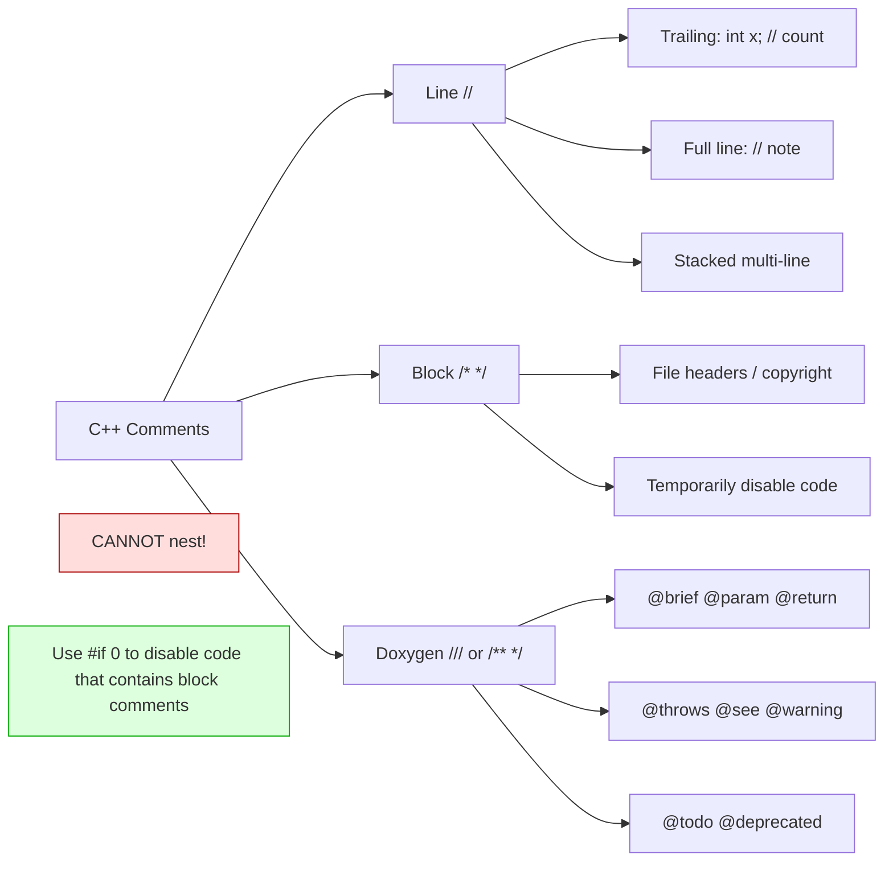

## Why This Matters

Code is read far more often than it is written. The ratio in industry is roughly **10:1 read-to-write** — sometimes 100:1 in mature codebases. Comments and coding style are the *ergonomics* of source code: they are what make the difference between a codebase that welcomes new contributors and one that terrifies them. A perfectly correct program that nobody can understand is a liability, not an asset. This note covers the mechanics of commenting in C++, the philosophy of *when* to comment (and when not to), and the major stylistic conventions — naming, braces, indentation, header layout — that professional C++ projects adopt. Adopting a consistent style early will save you countless hours of review feedback and subtle bugs.

## Background

### Comments in the C++ (and C) Tradition

C++ inherits C's two comment forms:

- **Block comments** `/* ... */`, which may span multiple lines and may appear mid-expression.
- **Line comments** `// ...`, which run to the end of the line. (C++ inherited these from BCPL; C adopted them in C99.)

Line comments are overwhelmingly preferred in modern C++ because they cannot accidentally swallow code the way block comments can. Block comments survive mainly for two purposes: file/copyright headers, and **temporarily disabling** large spans of code during debugging.

### What a Comment *Is*

A comment is a piece of source text that the compiler completely ignores. Comments do not change the program's behavior, do not consume memory at runtime, and do not slow down execution. They exist solely for human readers — including *you*, six months from now, who will not remember why you wrote that particular branch.

> [!info] Comments Are Stripped by the Preprocessor
> Technically, the preprocessor replaces each comment with a single whitespace character before the compiler's tokenizer sees the file. This is why `int/* */x;` is valid C++ — the comment is just whitespace between `int` and `x`.

## Main Content

### 1. Line Comments: `//`

Line comments begin with `//` and continue until the end of the line. They are the workhorse of daily C++.

```cpp
int total = 0;  // Running sum of all shipments.

// Validate the input before doing anything else.
if (qty < 0) {
    return error("negative quantity");
}

// TODO(alice): Replace this O(n²) sort with std::sort once we
// upgrade to C++20 and can use ranges.
for (size_t i = 0; i < n; ++i) {
    for (size_t j = i + 1; j < n; ++j) {
        if (a[j] < a[i]) std::swap(a[i], a[j]);
    }
}
```

Line comments can be **stacked** to write multi-paragraph commentary without using `/* */`:

```cpp
// Phase 1: read the input file.
// We do this in two passes so we can pre-allocate the buffer.
// Phase 2 (below) then streams the data to the consumer.
```

### 2. Block Comments: `/* */`

Block comments are useful for file headers, copyright notices, and large spans of disabled code:

```cpp
/*
 * SPDX-License-Identifier: MIT
 * Copyright (c) 2024 Acme Corp.
 *
 * This module implements the low-level packet ring buffer used
 * by the network driver. It is NOT thread-safe; callers must
 * hold `ring_mutex` while invoking any function below.
 */
```

> [!danger] Block Comments Do Not Nest
> The first `*/` ends the entire block. The following produces a hard compile error:
>
> ```cpp
> /*
>     outer comment
>     /* inner comment */
>     this line is NOT inside a comment — compiler sees it as code
> */
> ```
>
> If you need to comment out a region that already contains block comments, use `#if 0 / #endif` instead:
>
> ```cpp
> #if 0
> /* this old block comment is safe now */
> void legacy_function() { ... }
> #endif
> ```

### 3. Doxygen-Style Documentation Comments

**Doxygen** is the de facto standard tool for generating HTML/PDF API documentation from annotated C++ source. Doxygen comments start with `///` or `/**` and use `@`-prefixed tags to denote structure:

```cpp
/**
 * @brief Compute the factorial of a non-negative integer.
 *
 * Uses iterative multiplication to avoid stack overflow on large n.
 * The result is undefined for n < 0.
 *
 * @param n The non-negative integer whose factorial is desired.
 * @return n! as a 64-bit unsigned integer.
 * @throws std::invalid_argument if n > 20 (would overflow uint64).
 */
uint64_t factorial(int n);

/// Equivalent to factorial(n) but memoized. @see factorial
uint64_t factorial_memoized(int n);
```

Common Doxygen tags:

| Tag | Meaning |
| --- | --- |
| `@brief` | One-sentence summary. |
| `@param name desc` | Function parameter. |
| `@return desc` | Return value. |
| `@throws Exc desc` | Exception that may be thrown. |
| `@see ref` | Cross-reference. |
| `@note` | A note callout. |
| `@warning` | A warning callout. |
| `@file` | Documents the file itself. |
| `@class Name` | Forces a class entry. |
| `@todo` | A todo item, collected by Doxygen into a todo list. |

> [!tip] Document the Contract, Not the Code
> A good Doxygen comment specifies the *contract* of the function: preconditions, postconditions, error conditions, ownership semantics, thread-safety guarantees. It does **not** restate the implementation. The reader of an API doc doesn't care *how* the factorial is computed; they care *what* inputs are valid and *what* outputs they will get.

### 4. The Philosophy of Commenting

The most-cited maxim in software engineering about comments is:

> *"Good code is its own best documentation."* — Steve McConnell, *Code Complete*

This does **not** mean "don't write comments." It means: write code so clear that *most* of it needs no commentary, and reserve comments for the things code cannot say about itself.

#### Comment the "Why", Not the "What"

```cpp
// BAD: restates the code in English.
i++;  // increment i

// GOOD: explains the *reason* for non-obvious code.
// We skip the first byte because it's a BOM added by some Windows
// editors and breaks UTF-8 decoders downstream.
++i;
```

#### When to Comment

- **Non-obvious algorithms.** If you implemented a Knuth–Morris–Pratt search, name the algorithm so a reader can look it up.
- **Magic numbers.** `if (x == 0x5F3759DF)` deserves a link to the famous Quake III inverse-square-root hack.
- **Workarounds.** "GCC 12 miscompiles this if we use std::vector; using a deque avoids it. See GCC bug #87124."
- **External constraints.** "The server requires this header to be exactly 512 bytes — see RFC 791 §3.1."
- **TODOs and FIXMEs.** Use a consistent prefix (`TODO(owner):` or `FIXME:`) so they can be grepped and assigned.

#### When *Not* to Comment

- **Restating the code.** `int x = 5; // set x to 5` is noise.
- **Outdated comments.** A comment that contradicts the code is *worse than no comment*. If you change code, update or delete its comment.
- **Comments as a substitute for clear names.** If you need a paragraph to explain what `do_it()` does, rename it `synchronize_primary_replica()`.
- **Commented-out code.** Source control remembers old versions. Delete the code; do not leave `// void legacy() { ... }` rotting in the file. If you must keep a snippet for reference, move it to a notes file or a doc comment.

### 5. Coding Style: Naming Conventions

C++ does not impose a single naming convention, but every serious project picks one and enforces it with `clang-format` / `clang-tidy`. Here are the major dialects:

#### Variable and Function Names

| Convention | Example | Used by |
| --- | --- | --- |
| **snake_case** | `int total_count;` | C++ Standard Library, Google Style (variables), Boost |
| **camelCase** | `int totalCount;` | Java-influenced codebases, Qt |
| **PascalCase** | `int TotalCount;` | C#-influenced, Microsoft code (types only) |
| **Hungarian** | `int nTotalCount;` | Legacy Windows/Office; obsolete |

#### Type Names

Most modern style guides use **PascalCase** for types:

```cpp
class TcpConnection { ... };
struct HttpRequest  { ... };
enum class Color    { Red, Green, Blue };
using UserId        = uint64_t;       // alias
```

The standard library uses snake_case for *its* types (`std::vector`, `std::string`) — a historical accident. Do not mimic it for your own types.

#### Constants

```cpp
constexpr int kMaxRetries  = 5;     // Google style: k prefix + PascalCase
constexpr int MAX_RETRIES  = 5;     // C-style: SCREAMING_SNAKE_CASE
constexpr int max_retries  = 5;     // Boost style: snake_case
```

Pick one; enforce it.

#### Member Variables

Many guides add a suffix or prefix to distinguish members from locals — this is one of the few places a "decorated" name is worth it:

```cpp
class Foo {
    int  count_;        // suffix underscore (Boost, Google, Stroustrup)
    int  m_count;       // m_ prefix (older Qt, MFC)
    int  count;         // no decoration (risky: shadowed by params)
};
```

The suffix-underscore style is favored because:
- It does not visually clutter.
- It never collides with constructor parameter names, allowing clean initializer lists: `Foo(int count) : count_(count) {}`.

#### File Names

- `snake_case.hpp` / `snake_case.cpp` — Boost, Google.
- `PascalCase.hpp` / `PascalCase.cpp` — Microsoft, Qt.
- Header extension: `.h`/`.hpp`/`.hh`/`.hxx` — pick one; `.hpp` is increasingly common.

### 6. Indentation, Braces, and Whitespace

#### Brace Placement

```cpp
// K&R / 1TBS / Stroustrup — opening brace on same line.
if (x > 0) {
    do_something();
}

// Allman / BSD — opening brace on its own line.
if (x > 0)
{
    do_something();
}

// GNU — braces indented two spaces.
if (x > 0)
  {
    do_something();
  }
```

The C++ Standard Library uses Allman; Google Style uses K&R. Both are fine; pick one.

#### Indentation Width

- **2 spaces** — Google, WebKit, Chromium.
- **4 spaces** — LLVM, Boost, most IDE defaults.
- **8 spaces** — Linux kernel (C, but its style is widely known).

Never use tabs in mixed teams unless you configure your editor for "tabs as 8" and align with spaces. The safest choice is **spaces-only**, which is `clang-format`'s `UseTab: Never`.

#### The One-True-Brace Rule

Always brace single-statement bodies:

```cpp
// BAD — Apple's "goto fail" bug cost real money because of this pattern.
if (err)
    goto fail;
    goto fail;   // <- always runs; indentation hides it.

// GOOD
if (err) {
    goto fail;
}
```

### 7. Header Layout

A typical header looks like:

```cpp
#pragma once                  // or #ifndef guard

// 1. File-level comment with copyright and purpose.
// 2. #includes this header depends on (sorted: own, then system).
// 3. Forward declarations.
// 4. Namespace open.
// 5. Type/function declarations.
// 6. Namespace close.
// 7. End-of-file newline.
```

### 8. Major Industry Style Guides

#### Google C++ Style Guide

- URL: <https://google.github.io/styleguide/cppguide.html>
- Names: `snake_case` for variables and functions, `PascalCase` for types, `kPascalCase` for constants, `_` suffix for members.
- Indentation: 2 spaces.
- Braces: K&R.
- **Notable quirks**: forbids exceptions, forbids most C++14+ features in legacy code, mandates "header guards" over `#pragma once` (now relaxed).
- Excellent for large teams; tends to be conservative.

#### LLVM Coding Standards

- URL: <https://llvm.org/docs/CodingStandards.html>
- Names: `camelCase` for functions, `PascalCase` for types and methods, `UpperCamelCase` for variables in some sub-projects.
- Indentation: 2 spaces.
- Braces: Allman for declarations, K&R inside bodies — a distinctive hybrid.
- Strongly emphasizes mechanical tooling: `clang-format` is part of the contract.

#### ISO C++ Core Guidelines (Stroustrup & Sutter)

- URL: <https://isocpp.github.io/CppCoreGuidelines/CppCoreGuidelines>
- Not a style guide per se, but a *set of best practices* covering correctness, performance, maintainability.
- Notable rules: "ES.20: Avoid uninitialized variables", "R.11: Avoid calling new/delete explicitly", "F.7: For general use, take T* or T& arguments rather than smart pointers."

#### Other Notable Guides

- **Bloomberg BDE**: highly rigorous, emphasizes physical design (component-level modularity).
- **Mozilla C++ Portability Guide**: focused on cross-platform correctness.
- **ROS / Qt / CAF**: community-specific.

### 9. Tooling

The two tools you should install *today*:

- **`clang-format`** — auto-formats code to a project style. Reads `.clang-format` configuration files. `clang-format -i *.cpp` reformats in place.
- **`clang-tidy`** — static analyzer and linter. Catches bugs (`bugprone-*`), modernization opportunities (`modernize-*`), performance issues (`performance-*`), and style violations (`readability-*`).

Wire them into your editor (VS Code, CLion, Vim/ALE, Emacs/lsp-mode) so they run on every save.

### Comment Types at a Glance — Mermaid Diagram



## Common Pitfalls

1. **Nested `/* */`** — first `*/` closes everything. Use `#if 0`/`#endif` to comment out regions containing block comments.
2. **Stale comments** — code changed, comment didn't. During code review, *always* check that updated code still matches its comment.
3. **Over-commenting** — `int age; // the age` adds noise without value. Trust the reader; trust the names.
4. **Under-commenting magic numbers** — `if (status == 418)` is meaningless without `// 418 = HTTP "I'm a teapot"`.
5. **Mixing naming conventions** — `getUserInfo` next to `get_user_info` in the same file screams "no style guide." Run `clang-format` and `clang-tidy` to enforce one.
6. **Commented-out code in production** — delete it; Git remembers.
7. **TODOs without owners** — `// TODO: fix this` from 2017 is a ghost. Use `// TODO(alice, 2024-Q3): ...` so the TODO has an owner and a deadline.
8. **Tabs vs. spaces** — mixing them produces the "jagged indent" effect in different editors. Pick one (usually spaces) and configure your editor.
9. **One-line `if` without braces** — the source of countless bugs, including Apple's infamous `goto fail`. Always brace.
10. **Doxygen comments that lie** — if `@param n` describes a parameter called `m`, Doxygen will warn but you might miss it. Run Doxygen in CI.

## Tips and Tricks

- **`clang-format` on save** is the single highest-leverage tool for team C++ style. The first week is mildly annoying; thereafter your code reviews become about substance, not whitespace.
- **`// FIXME(owner):`** conventions integrate with issue trackers (GitHub recognizes `// TODO(alice):` and links the user).
- **Comment your intent first, then write code that matches.** This is "comment-driven development"; it forces you to articulate the goal before getting lost in syntax.
- **Use `[[nodiscard]]`, `[[deprecated]]`, `[[maybe_unused]]` attributes** to move some "comments" into the type system where the compiler can enforce them.
- **Group-related `#include`s in blocks** (system, then third-party, then project) and sort alphabetically within each block. Makes merges trivial.
- **`#pragma once` is supported by every major compiler** (GCC, Clang, MSVC, Intel). It is shorter and less error-prone than include guards. The standard library still uses guards for portability to esoteric platforms, but your project almost certainly doesn't need to.
- **Read the LLVM and Google style guides cover-to-cover once** — even if you don't adopt them, you'll learn *why* certain choices exist.
- **Run `clang-tidy` with `--checks='-*,readability-*,modernize-*,bugprone-*'`** on a legacy codebase. The diff is a free education.
- **Don't argue about style in code review**. Argue about correctness, naming, and architecture. Style is what `clang-format` says it is.
- **A single sentence of "why" beats ten sentences of "what."** Resist the urge to narrate the code; explain the *decisions*.

## Active Recall

1. What are the two comment syntaxes in C++? Which is preferred for everyday commentary and why?
2. Why can't C++ block comments be nested, and what is the workaround for commenting out code that already contains block comments?
3. What is Doxygen? Name four common `@`-tags and what they mean.
4. State the "comment the why, not the what" rule. Give an example of a comment that violates it.
5. Name the four major naming conventions used in C++ projects. Which does the C++ Standard Library use for its types, and why is that not a good template for your own types?
6. What is the "one-true-brace rule" and which famous industry bug illustrates why it matters?
7. Compare the Google and LLVM C++ style guides on three dimensions (e.g., brace placement, indentation, naming).
8. What are `clang-format` and `clang-tidy`? At what stage of development should they be introduced?
9. Why is `#pragma once` preferred over traditional include guards in modern projects, and when must you still use guards?
10. List five things a good Doxygen comment should specify for a function, and one thing it should *not* try to specify.

## Appendix: A Worked Example of Style Refactoring

Consider this (deliberately bad) snippet. Let's refactor it twice — first to "decent," then to "professional."

### Original (poor)

```cpp
#include <iostream>
int x;
void f(){int i;for(i=0;i<10;i++){x=x+i;std::cout<<x<<std::endl;}}
int main(){f();return 0;}
```

Problems: no formatting, meaningless names (`x`, `f`, `i`), global mutable state, no comments, `std::endl` in a loop, no `const`, no bounds rationale.

### Refactored (professional)

```cpp
#include <iostream>

// Demonstrates accumulating the first 10 non-negative integers and
// printing the running total. Intended as a style example only.

namespace demo {

constexpr int kIterationCount = 10;

// Returns the sum 0 + 1 + ... + (count - 1) and prints each running total.
int print_running_sum(int count) {
    int total = 0;
    for (int i = 0; i < count; ++i) {
        total += i;
        std::cout << "After adding " << i << ", total = " << total << '\n';
    }
    return total;
}

}  // namespace demo

int main() {
    const int final_total = demo::print_running_sum(demo::kIterationCount);
    std::cout << "Final total: " << final_total << '\n';
    return 0;
}
```

Improvements:

- **Names** are now self-documenting (`print_running_sum`, `kIterationCount`).
- **Global mutable state** eliminated — `total` is local.
- **`constexpr`** for the true compile-time constant.
- **`const`** for the runtime-immutable result.
- **`'\n'`** instead of `std::endl` to avoid flushing on every iteration.
- **Namespace** prevents name collisions in larger projects.
- **Comment** explains the *purpose*, not the *mechanics*.

This is the kind of refactoring a senior engineer does on every PR review — and the kind of code `clang-format` plus `clang-tidy` will help you produce automatically.

## Appendix: A Minimal `.clang-format` File

Drop this file in your project root. `clang-format` will pick it up automatically when you run `clang-format -i *.cpp`.

```yaml
---
BasedOnStyle: Google
Language: Cpp
Standard: c++20
ColumnLimit: 100
IndentWidth: 4
TabWidth: 4
UseTab: Never
BreakBeforeBraces: Attach
AllowShortFunctionsOnASingleLine: Inline
AllowShortIfStatementsOnASingleLine: Never
AllowShortLoopsOnASingleLine: false
PointerAlignment: Left
DerivePointerAlignment: false
NamespaceIndentation: None
SortIncludes: CaseSensitive
IncludeBlocks: Regroup
```

Tweak to taste. The point is: *pick one*, commit it to version control, and never argue about formatting again.

## Next Steps

- Continue to [[3. Variables and Fundamental Types]] — the type system is the next foundation.
- Cross-reference [[1. Compiler and Toolchain]] for integrating `clang-format` and `clang-tidy` into your build.
- See [[8. Modern C++]] for C++11/14/17 attributes like `[[nodiscard]]` and `[[deprecated]]` that move some documentation into the type system.
- See [[22. Projects]] for examples of style files (`.clang-format`, `.clang-tidy`) you can copy into your own repositories.
