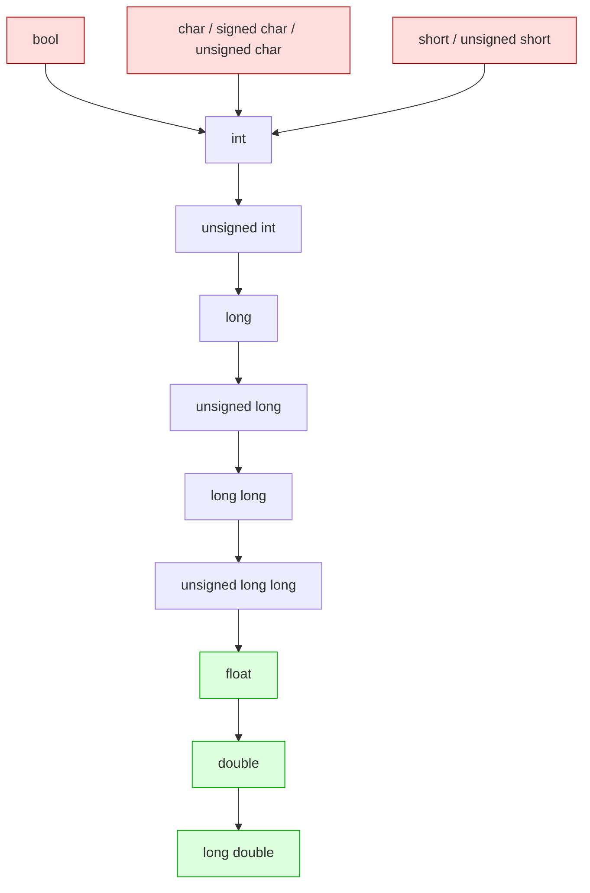

## Why This Matters

Every value your program manipulates — every counter, every pixel, every temperature reading, every bank balance — has a **type**. The type determines three things: how much memory the value occupies, what range of values it can represent, and what operations are legal on it. C++ is a **statically typed** language: the compiler must know the type of every expression at compile time. Static typing is the single biggest reason C++ can produce code that runs as fast as hand-written assembly while still catching huge classes of bugs before the program ever runs.

This note covers the **fundamental types** built into the language (the ones the compiler knows about without any `#include`), how to declare and initialize variables, how to convert between types safely, and the modern C++ tools — `auto`, `constexpr`, fixed-width integers — that have made C++ noticeably more ergonomic since C++11.

## Background

### What "Fundamental" Means

The C++ standard distinguishes **fundamental types** (built into the language) from **compound types** (pointers, references, arrays) and **user-defined types** (classes, enums). The fundamental types are:

- The **void** type (an incomplete type used in function returns and as a base for pointers).
- The **`std::nullptr_t`** type (the type of the `nullptr` literal; technically defined in `<cstddef>`, but conceptually fundamental).
- **Boolean** (`bool`).
- **Character** types (`char`, `signed char`, `unsigned char`, `wchar_t`, `char8_t`, `char16_t`, `char32_t`).
- **Integer** types (`short`, `int`, `long`, `long long`, each signed or unsigned).
- **Floating-point** types (`float`, `double`, `long double`).

Everything else — `std::string`, `std::vector`, your own `class Foo` — is built on top of these.

### Why C++ Has So Many Integer Types

C was designed in the 1970s for machines with wildly different word sizes. Rather than mandate "int is 32 bits," C (and C++) let the compiler pick sizes that are *natural* for the target hardware. The standard only fixes **minimum widths** and **ordering**:

- `short` ≥ 16 bits.
- `int` ≥ `short`, ≥ 16 bits.
- `long` ≥ `int`, ≥ 32 bits.
- `long long` ≥ `long`, ≥ 64 bits (added in C++11).

The exact sizes vary: on a typical LP64 Linux/Mac system, `int` is 32 bits and `long` is 64 bits. On LLP64 Windows, `int` and `long` are both 32 bits and only `long long` is 64 bits. This portability hazard is why **fixed-width integer types** (`int32_t`, `uint64_t`) were introduced.

## Main Content

### 1. Boolean: `bool`

```cpp
bool ready    = true;
bool finished = false;
```

- Size: at least 1 byte (the standard requires `char` to be the smallest addressable unit, and `bool` must be at least as large as `char`).
- Values: `true` or `false` only.
- **Integer conversions**: `bool`  `int`. `true` becomes `1`, `false` becomes `0`. Any non-zero integer converts to `true`; `0` converts to `false`.
- **Never** compare `bool` to `true`/`false` with `==`:

```cpp
if (ready)        { ... }   // GOOD
if (ready == true){ ... }   // BAD — redundant, and breaks for non-bool types
```

### 2. Character Types

| Type | Width | Purpose |
| --- | --- | --- |
| `char` | 1 byte (≥8 bits) | Narrow character storage; **signedness is implementation-defined**. |
| `signed char` | 1 byte | Always signed; range at least −128..127. |
| `unsigned char` | 1 byte | Always unsigned; range 0..255. Often used for raw byte buffers. |
| `wchar_t` | implementation-defined | Wide character (Windows: 2 bytes UTF-16; Linux: 4 bytes UTF-32). |
| `char8_t` | 1 byte (C++20) | UTF-8 character. |
| `char16_t` | 2 bytes (C++11) | UTF-16 character. |
| `char32_t` | 4 bytes (C++11) | UTF-32 character. |

> [!warning] `char`, `signed char`, and `unsigned char` Are Three Distinct Types
> Even though `char` may be signed on your platform, it is **not the same type** as `signed char`. Overload resolution treats them as three separate types. This is a common source of confusion.

### 3. Integer Types

```cpp
short        s = 32000;          // ≥ 16 bits
int          i = 2'000'000'000;  // ≥ 16 bits, typically 32
long         l = 0L;             // ≥ 32 bits
long long    ll = 9'000'000'000LL; // ≥ 64 bits, C++11
```

Each has an `unsigned` variant where the high bit contributes to magnitude instead of sign:

```cpp
unsigned int       ui = 4000000000u;
unsigned long long ull = 18'000'000'000'000'000'000ULL;
```

> [!info] Digit Separators
> The single-quote `'` was added in C++14 as a digit separator. `1'000'000` is identical to `1000000` but much easier to read. It works for any integer or floating-point literal.

#### Fixed-Width Integers (`<cstdint>`)

When you need a *guaranteed* width — for binary file formats, network protocols, hashing — use the fixed-width aliases from `<cstdint>`:

| Type | Width | Range |
| --- | --- | --- |
| `int8_t` | 8 bits signed | −128 .. 127 |
| `uint8_t` | 8 bits unsigned | 0 .. 255 |
| `int16_t` | 16 bits signed | −32 768 .. 32 767 |
| `uint16_t` | 16 bits unsigned | 0 .. 65 535 |
| `int32_t` | 32 bits signed | −2 147 483 648 .. 2 147 483 647 |
| `uint32_t` | 32 bits unsigned | 0 .. 4 294 967 295 |
| `int64_t` | 64 bits signed | −9.2 × 10¹⁸ .. 9.2 × 10¹⁸ |
| `uint64_t` | 64 bits unsigned | 0 .. 1.8 × 10¹⁹ |

There are also **minimum-width** (`int_least32_t`), **fast** (`int_fast32_t`), and **pointer-width** (`intptr_t`, `uintptr_t`) aliases. See [[6. size_t and Integer Types]] for the full taxonomy.

```cpp
#include <cstdint>

uint32_t ipv4_address = 0xC0A80101u;  // 192.168.1.1
int64_t  nanos_since_epoch = 1'700'000'000'000'000'000LL;
```

### 4. Floating-Point Types

| Type | Typical Width | Approx Range | Approx Precision |
| --- | --- | --- | --- |
| `float` | 32 bits (IEEE 754 single) | ±3.4 × 10³⁸ | ~7 decimal digits |
| `double` | 64 bits (IEEE 754 double) | ±1.7 × 10³⁰⁸ | ~15 decimal digits |
| `long double` | 80 or 128 bits (platform-dependent) | platform-dependent | ~18–34 decimal digits |

```cpp
float       pi_f  = 3.14159265f;   // 'f' suffix forces float
double      pi_d  = 3.141592653589793;
long double pi_ld = 3.141592653589793238462643L;  // 'L' suffix
```

> [!warning] Floating-Point Is Not Real Math
> Floating-point arithmetic is **not** associative or distributive. `(a + b) + c` may differ from `a + (b + c)` because of rounding. Never compare floats with `==`; use an epsilon: `if (std::abs(a - b) < 1e-9)`. See [[19. Performance Optimization]] and any reference on IEEE 754 for the full horror story.

### 5. `void`

`void` is the "absence of type." It is an **incomplete type** — you cannot create a `void` object. Its uses:

- Function return type: `void do_something();` — function returns nothing.
- Pointer base: `void*` — a generic pointer to anything, discarding type information. Strongly discouraged in modern C++; use `std::any`, `std::variant`, or templates instead.

### 6. Declaration vs Definition vs Initialization

These terms are often confused:

- **Declaration**: introduces a name and its type into the program.
- **Definition**: actually creates the entity (allocates storage for a variable, emits the body for a function).
- **Initialization**: gives the variable its first value at the point of definition.

```cpp
extern int x;            // declaration only (defined elsewhere)
int x;                   // definition (default-initialized: 0 if at namespace scope, INDETERMINATE if local!)
int x = 42;              // definition + initialization
int x{42};               // definition + list-initialization (C++11)
```

> [!danger] Uninitialized Local Variables Are Undefined Behavior
> A local `int x;` does **not** default to zero. Its value is whatever garbage was on the stack at that address. Reading it is undefined behavior — the compiler is allowed to produce literally any result. Always initialize: `int x = 0;` or `int x{};` (value-initialization to zero).

### 7. Initialization Syntaxes

C++ has, historically, had too many ways to initialize a variable. As of C++11 the recommendation is to use **brace initialization** (a.k.a. uniform initialization) consistently:

```cpp
int a = 5;        // copy-initialization (from C)
int b(5);         // direct-initialization (constructor-style)
int c{5};         // list/direct-list-initialization (C++11) — PREFERRED
int d = {5};      // copy-list-initialization

// Brace init shines for containers:
std::vector<int> v{1, 2, 3, 4, 5};
std::map<std::string, int> m{{"alice", 1}, {"bob", 2}};

// And prevents narrowing:
int x = 3.14;     // silently truncates to 3 — BAD
int y = {3.14};   // COMPILE ERROR — narrowing conversion — GOOD
```

> [!tip] Why Prefer `T x{...}`?
> Brace initialization:
> 1. **Prevents narrowing conversions** — `int x{3.14}` is a compile error, not a silent truncation.
> 2. **Works in every context** — variables, member initializer lists, function arguments, return values.
> 3. **Disambiguates from function declarations** — `Widget w();` is a function declaration (the "most vexing parse"), but `Widget w{};` is unambiguously a default-constructed object.
>
> The main caveat: brace initialization with `auto` deduces `std::initializer_list`, not the apparent type. `auto x{5};` was an `initializer_list<int>` in C++11/14 (a bug); since C++17 it deduces `int`. Prefer `auto x = 5;` for scalars to avoid the trap.

### 8. `const` and `constexpr`

```cpp
const int max_users = 100;          // runtime constant; cannot be modified
constexpr int buffer_size = 4096;   // compile-time constant; can be used in array sizes, templates
```

- `const` means "I promise not to modify this after initialization." The value itself may be computed at runtime.
- `constexpr` means "this can be evaluated at compile time." Implies `const` for variables. Functions declared `constexpr` may be evaluated at compile time *if* their arguments are compile-time constants.

> [!info] `consteval` (C++20) and `constinit` (C++20)
> - `consteval` — *must* be evaluated at compile time (immediate function).
> - `constinit` — must be initialized at compile time but may be mutated at runtime (avoids the "static initialization order fiasco" for globals).
>
> See [[5. Literals and Constants]] for the full comparison.

### 9. `auto` — Type Deduction

`auto` lets the compiler deduce the type from the initializer:

```cpp
auto i = 42;              // int
auto d = 3.14;            // double
auto s = std::string("hi");  // std::string
auto v = std::vector<int>{1, 2, 3};

// With references and cv-qualifiers:
const auto& cr = some_map.at("key");   // const reference — no copy
auto&& rr = some_temporary;            // forwarding reference
```

Rules to remember:

- `auto` strips top-level `const` and `&`. Use `const auto&` when you want a const reference.
- `auto x{5};` is `int` since C++17 (was `initializer_list<int>` before).
- `auto` on a function return type lets the compiler deduce (C++14): `auto f() { return 42; }`.
- For *trailing return types* (C++11): `auto f(int x) -> int { return x; }`.

> [!tip] Use `auto` Liberally, But Not Religiously
> `auto` reduces noise and prevents accidental copies. But explicit types communicate intent: `std::size_t i = vec.size();` reads "this is an index." `auto i = vec.size();` reads "this is some unsigned integral thing." Use `auto` when the type is obvious (`auto p = std::make_unique<Widget>();`) or verbose (`auto it = map.find(key);`); use explicit types when the type carries meaning.

See [[8. Modern C++]] for the deep dive on `auto`, `decltype`, and `decltype(auto)`.

### 10. Type Conversions

#### Implicit Conversions

The compiler silently converts between fundamental types in many contexts. This is convenient but dangerous:

```cpp
int    i = 3;
double d = i;          // int -> double: safe, no data loss
int    j = 3.99;       // double -> int: NARROWING, j == 3, fractional part lost
bool   b = 5;          // int -> bool: b == true (any nonzero converts to true)
```

The standard ranks types in a hierarchy (see Mermaid below). Conversions *up* the hierarchy (toward `long double`) are safe; *down* (toward `bool`) lose information.

#### The "Usual Arithmetic Conversions"

When two operands of a binary operator have different types, the compiler promotes the "lower" one to match the "higher" one:

```cpp
int    i = 3;
double d = 2.5;
auto r = i + d;        // i is promoted to double; r is double (5.5)
```

#### Integer Promotion

Small integer types (`bool`, `char`, `short`) are *promoted* to `int` (or `unsigned int`) before any arithmetic operation. This is why `sizeof(c + c)` is `sizeof(int)` for `char c;`, not `sizeof(char)`.

#### Explicit Conversions: `static_cast`

C++ inherits C's `(type)expr` cast but discourages it. The C++-style casts are explicit about intent:

```cpp
double d = 3.99;

int i1 = (int)d;                        // C-style — avoid
int i2 = int(d);                        // function-style — also avoid
int i3 = static_cast<int>(d);           // C++ style — PREFERRED
```

The four C++ casts:

| Cast | Purpose |
| --- | --- |
| `static_cast<T>(e)` | Well-defined, compile-time conversions (intdouble, void*T*, upcast in a class hierarchy). |
| `dynamic_cast<T>(e)` | Safe downcast in polymorphic hierarchies (requires virtual functions); returns `nullptr`/throws on failure. |
| `const_cast<T>(e)` | Adds or removes `const`/`volatile`. Use sparingly. |
| `reinterpret_cast<T>(e)` | Bit-pattern reinterpretation (e.g., `int*` → `uint32_t*`). Almost always UB-prone. |

See [[4. Operators]] for the full cast reference and [[6. Pointers and References]] for `dynamic_cast` patterns.

### Type Hierarchy and Conversion Rules — Mermaid



Arrows point in the direction of *implicit promotion* (safe). The reverse direction requires an explicit cast (or triggers narrowing).

### Annotated Example

```cpp
#include <iostream>
#include <cstdint>
#include <vector>

int main() {
    // 1. Use fixed-width types for portability.
    std::uint32_t crc = 0xFFFFFFFFu;

    // 2. Brace-init prevents narrowing.
    int count{0};                    // zero-initialized
    // int bad{3.14};                // would not compile — narrowing

    // 3. constexpr for true compile-time constants.
    constexpr std::size_t buffer_size = 4096;
    std::vector<char> buf(buffer_size);

    // 4. const for runtime-immutable values.
    const std::string hostname = "example.com";

    // 5. auto where the type is obvious or verbose.
    auto checksum = static_cast<std::uint64_t>(crc) * 31;

    // 6. Floating point with explicit precision.
    double ratio = static_cast<double>(count) / buffer_size;

    std::cout << "crc=" << crc
              << " checksum=" << checksum
              << " ratio=" << ratio << '\n';
    return 0;
}
```

## Common Pitfalls

1. **Uninitialized locals are UB** — `int x;` at function scope has indeterminate value. Always write `int x{};` or `int x = 0;`.
2. **Narrowing conversions** — `int i = 3.14;` silently truncates. Brace init (`int i{3.14};`) catches this at compile time.
3. **Signed/unsigned comparison** — `for (int i = 0; i < vec.size(); ++i)` warns; `vec.size()` is `size_t` (unsigned). Use `size_t i` instead. See [[6. size_t and Integer Types]].
4. **Signed overflow is UB, unsigned overflow wraps** — `INT_MAX + 1` is undefined behavior; the compiler may assume it never happens and optimize accordingly. `UINT_MAX + 1` is well-defined to be 0.
5. **Assuming `char` is signed or unsigned** — implementation-defined. Use `signed char` or `unsigned char` explicitly when signedness matters.
6. **`sizeof(char) == 1` is defined; `sizeof(bool)` is not** — `bool` is at least 1 byte but may be more on some platforms.
7. **Treating `long` as 64-bit** — On LLP64 Windows, `long` is 32 bits. Use `int64_t` when you need 64 bits.
8. **Floating-point equality** — `if (x == 0.1 + 0.2)` is almost never true; use an epsilon.
9. **Mixing `auto` and `initializer_list`** — `auto x{1, 2, 3};` deduces `std::initializer_list<int>`; `auto x = {1, 2, 3};` also deduces `initializer_list`. Use explicit type for containers: `std::vector<int> v{1, 2, 3};`.
10. **Forgetting `const` on getter methods** — `int value() const;` promises the method does not modify the object. Forgetting `const` breaks `const Foo&` references.

## Tips and Tricks

- **Default to brace initialization** (`T x{...};`) for new code; it is the safest, most uniform syntax.
- **Use `constexpr` aggressively** — push computation to compile time. A `constexpr` function that compiles is also usually more easily testable.
- **Use `auto` for iterators and complex template types**; use explicit types for indices, sizes, and protocol fields where the type carries meaning.
- **Always initialize** — `int x{};` is one keystroke more than `int x;` and prevents whole categories of bugs.
- **Prefer `int32_t`/`uint64_t` over `int`/`long`** in any code that interacts with the outside world (files, network, hardware).
- **Use `static_cast`, not C-style casts** — they're greppable, self-documenting, and reject unsafe conversions.
- **Enable `-Wconversion`** — catches implicit narrowing conversions that the standard allows but you almost never want.
- **Use `enum class`** for typed constants instead of `const int` or `#define` — they cannot implicitly convert to `int`, preventing a whole class of bugs.
- **`std::numeric_limits<T>` (in `<limits>`)** gives you `min()`, `max()`, `lowest()`, `epsilon()`, etc. — far more reliable than `INT_MAX` macros.
- **`sizeof` is your friend**: `static_assert(sizeof(int) >= 4, "int must be at least 32 bits");` lets you catch platform assumptions at compile time.

## Active Recall

1. List the seven categories of fundamental types in C++.
2. What are the *minimum* guaranteed widths of `short`, `int`, `long`, and `long long`? Why are they minimums rather than exact?
3. Why does C++ treat `char`, `signed char`, and `unsigned char` as three distinct types?
4. What is the difference between `const` and `constexpr`? Give an example where each is appropriate.
5. Demonstrate the difference between `int x = 5;`, `int x(5);`, and `int x{5};`. Which is preferred and why?
6. What is "narrowing conversion," and how does brace initialization protect against it?
7. List the four C++ named cast operators and one use case for each.
8. What are the "usual arithmetic conversions"? What happens when you add an `int` to a `double`?
9. What does `auto x{5};` deduce to in C++17? What did it deduce to in C++11? Why was it changed?
10. Name three reasons to prefer fixed-width integer types (`int32_t`, `uint64_t`) over `int` and `long` in cross-platform code.

## Next Steps

- [[4. Operators]] — how values of these types are combined into expressions.
- [[5. Literals and Constants]] — how to write specific values of each type.
- [[6. size_t and Integer Types]] — the deep dive on `size_t`, overflow, and `std::numeric_limits`.
- [[8. Modern C++]] — `auto`, `decltype`, structured bindings, and the rest of the modern type-deduction toolkit.
- [[19. Performance Optimization]] — for floating-point precision pitfalls and SIMD considerations.
