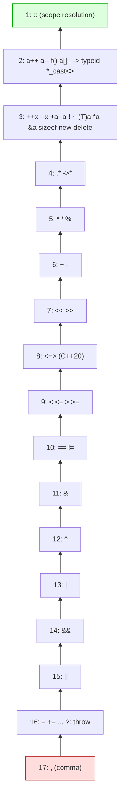

## Why This Matters

Almost every line of C++ you will ever write contains at least one operator. Arithmetic, comparison, assignment, function call, member access, casting — all are operators with rules about precedence, associativity, and evaluation order. Misunderstanding those rules is the source of some of C++'s most infamous bugs: the `i = i++` puzzle, the dereference-before-null-check that the compiler reorders, the bit-shift that becomes a stream insertion. Mastering operators is mastering the *grammar* of expression.

This note is a thorough reference: every operator category, the precedence table, the difference between prefix and postfix `++`, short-circuit evaluation, the comma operator, the ternary operator, `sizeof` and `typeid`, and a long list of pitfalls drawn from real code reviews.

## Background

### What an Operator *Is*

An **operator** is a token (or sequence of tokens) that denotes an operation on one or more operands. The compiler treats operators as function calls: `a + b` is essentially `operator+(a, b)`. For built-in types the compiler emits a machine instruction; for user-defined types it calls an overloaded operator function (see [[9. Object-Oriented Programming]]).

### Arity, Precedence, Associativity

Three properties govern how operators combine into expressions:

- **Arity**: number of operands. `+` is binary, `-` (negation) is unary, `?:` is the only ternary.
- **Precedence**: which operator binds tighter. `*` binds tighter than `+`, so `2 + 3 * 4` is `2 + (3 * 4) = 14`.
- **Associativity**: when two operators have the same precedence, left-to-right or right-to-left. `a - b - c` is `(a - b) - c` (left-assoc); `a = b = c` is `a = (b = c)` (right-assoc).

### Evaluation Order — The Big Surprise

**Precedence and associativity determine grouping, not the order in which operands are evaluated.** Until C++17, the order of evaluation of operands was almost entirely unspecified — which is why `std::cout << f() << g()` was once a footgun (does `f()` run before `g()`?). C++17 added *some* ordering guarantees (see below), but most operators still evaluate their operands in unspecified order.

> [!danger] The Classic Footgun
> ```cpp
> int i = 0;
> std::cout << i << " " << i++;     // UB before C++17; still confusing today
> ```
> Without a defined evaluation order, the compiler is free to evaluate `i` and `i++` in either order, or even interleave them. The result is **undefined behavior**. Always split such expressions into separate statements.

## Main Content

### 1. Arithmetic Operators

| Operator | Meaning | Example |
| --- | --- | --- |
| `+` | addition | `5 + 3 == 8` |
| `-` | subtraction | `5 - 3 == 2` |
| `*` | multiplication | `5 * 3 == 15` |
| `/` | division | `5 / 3 == 1` (int), `5.0 / 3.0 == 1.666…` |
| `%` | modulo (remainder) | `5 % 3 == 2` |
| `+x` | unary plus (rarely used) | `+5 == 5` |
| `-x` | unary negation | `-5` |

> [!warning] Integer Division Truncates Toward Zero
> `7 / 2 == 3`, `-7 / 2 == -3` (not −4). `7 % 2 == 1`, `-7 % 2 == -1`. Since C++11 the standard mandates truncation toward zero; before C++11, the behavior for negative operands was implementation-defined.

> [!warning] Division and Modulo by Zero Are UB
> Integer divide-by-zero crashes the program (typically `SIGFPE`). Floating-point divide-by-zero is *not* UB — it returns ±infinity or NaN per IEEE 754.

### 2. Relational Operators

`==`, `!=`, `<`, `<=`, `>`, `>=`. All return `bool`. They do not chain algebraically:

```cpp
if (1 < x < 10) { ... }     // WRONG: parses as (1 < x) < 10
                             // i.e. (true/false) < 10, always true!
if (1 < x && x < 10) { ... } // CORRECT
```

> [!tip] The Three-Way Comparison (`<=>`, C++20)
> C++20 introduced the **spaceship operator** `a <=> b`, which returns one of `std::strong_ordering`, `std::weak_ordering`, or `std::partial_ordering`. It also auto-generates `==, !=, <, <=, >, >=` from a single declaration: `auto operator<=>(const Foo&) const = default;`. See [[8. Modern C++]].

### 3. Logical Operators

| Operator | Meaning | Short-circuits? |
| --- | --- | --- |
| `!x` | logical NOT (unary) | n/a |
| `a && b` | logical AND | Yes — if `a` is false, `b` is not evaluated. |
| `a \|\| b` | logical OR | Yes — if `a` is true, `b` is not evaluated. |

#### Short-Circuit Evaluation in Action

```cpp
// Avoid null-pointer dereference:
if (ptr != nullptr && ptr->value > 0) { ... }

// Avoid division by zero:
if (denominator != 0 && numerator / denominator < threshold) { ... }

// Lazy initialization:
if (cached_value || (cached_value = compute_expensive())) {
    use(cached_value);
}
```

> [!info] Short-Circuit Is Guaranteed
> Unlike operand-evaluation order in general, short-circuit behavior of `&&` and `||` is **guaranteed** by the standard. You can rely on it for safety checks like the null-pointer guard above.

> [!warning] Overloaded `&&` and `||` Do NOT Short-Circuit
> If you overload `operator&&` or `operator||` for a user-defined type, *both* operands are always evaluated (because operator overloading is function call, and function arguments are fully evaluated before the call). This is one reason overloading these operators is strongly discouraged.

### 4. Bitwise Operators

| Operator | Meaning | Example (8-bit) |
| --- | --- | --- |
| `~x` | bitwise NOT (one's complement) | `~0b00001111 == 0b11110000` |
| `a & b` | bitwise AND | `0b1100 & 0b1010 == 0b1000` |
| `a \| b` | bitwise OR | `0b1100 \| 0b1010 == 0b1110` |
| `a ^ b` | bitwise XOR | `0b1100 ^ 0b1010 == 0b0110` |
| `a << n` | left shift (multiply by 2ⁿ) | `0b0001 << 3 == 0b1000` |
| `a >> n` | right shift (divide by 2ⁿ for unsigned) | `0b1000 >> 3 == 0b0001` |

> [!warning] Right-Shift of Negative Values Is Implementation-Defined
> `>>` on a *signed* negative value may be arithmetic (sign-extending) or logical (zero-filling). Use `unsigned` if you need a defined shift.

> [!warning] Shifting by ≥ Width Is UB
> `1u << 32` on a 32-bit `unsigned int` is undefined behavior. The shift count must be in `[0, width)`.

```cpp
#include <bitset>
#include <iostream>

int main() {
    unsigned a = 0b00001111;
    unsigned b = 0b10110001;
    std::cout << "a      = " << std::bitset<8>(a)      << '\n';
    std::cout << "b      = " << std::bitset<8>(b)      << '\n';
    std::cout << "a & b  = " << std::bitset<8>(a & b)  << '\n';
    std::cout << "a | b  = " << std::bitset<8>(a | b)  << '\n';
    std::cout << "a ^ b  = " << std::bitset<8>(a ^ b)  << '\n';
    std::cout << "~a     = " << std::bitset<8>(~a)     << '\n';
    std::cout << "a << 2 = " << std::bitset<8>(a << 2) << '\n';
    std::cout << "b >> 3 = " << std::bitset<8>(b >> 3) << '\n';
}
```

#### Common Bit-Manipulation Idioms

```cpp
constexpr std::uint32_t mask_bit(unsigned n) { return 1u << n; }

bool is_set(std::uint32_t v, unsigned n) { return (v & mask_bit(n)) != 0; }
std::uint32_t set_bit  (std::uint32_t v, unsigned n) { return v | mask_bit(n); }
std::uint32_t clear_bit(std::uint32_t v, unsigned n) { return v & ~mask_bit(n); }
std::uint32_t toggle_bit(std::uint32_t v, unsigned n){ return v ^ mask_bit(n); }

// Count set bits (popcount): C++20 std::popcount, or:
int popcount_naive(std::uint32_t v) {
    int c = 0;
    while (v) { c += v & 1u; v >>= 1; }
    return c;
}
```

### 5. Assignment Operators

`=` plus the compound forms `+=`, `-=`, `*=`, `/=`, `%=`, `<<=`, `>>=`, `&=`, `|=`, `^=`.

```cpp
int x = 10;
x += 5;    // x == 15
x *= 2;    // x == 30
x &= 0x0F; // x == 14
```

Assignment is **right-associative** and **returns a reference** to the assigned-to object:

```cpp
int a, b, c;
a = b = c = 0;   // assigns 0 to c, then to b, then to a.
```

> [!tip] The `if ((x = foo()))` Trick
> Assignment inside `if` is legal because assignment yields the assigned value:
> ```cpp
> while ((c = getchar()) != EOF) { ... }   // C idiom
> ```
> Modern style frowns on this; some compilers warn (`-Wparentheses`). Prefer to separate the assignment from the test for readability.

### 6. Increment and Decrement: `++`, `--`

Both come in **prefix** and **postfix** forms. They differ in *what the expression evaluates to*:

| Form | Side Effect | Expression Value |
| --- | --- | --- |
| `++x` | x becomes x+1 | The **new** value of x |
| `x++` | x becomes x+1 | The **old** value of x |
| `--x` | x becomes x-1 | The **new** value of x |
| `x--` | x becomes x-1 | The **old** value of x |

```cpp
int a = 5;
std::cout << ++a << '\n';   // prints 6; a is now 6
int b = 5;
std::cout << b++ << '\n';   // prints 5; b is now 6
```

> [!info] Prefer Prefix `++` for Iterators
> For built-in types, `++i` and `i++` produce identical machine code in optimized builds. For **iterators** (and other class types with overloaded `operator++`), `i++` typically creates a temporary copy of the old value, which is wasteful. Make `++i` your default.

> [!danger] Multiple Modifications in One Expression Are UB
> ```cpp
> int i = 0;
> i = i++;          // UB — two modifications of i in one expression
> i = ++i + ++i;    // UB
> std::cout << i++ << " " << i++;   // UB
> ```
> The C++ standard forbids modifying the same scalar twice in one expression (without an intervening *sequenced* point). The compiler is allowed to do anything — including formatting your hard drive, in principle.

### 7. The Comma Operator `,`

The comma operator evaluates its left operand, discards the result, then evaluates the right operand and yields that value.

```cpp
int x = (1, 2, 3);     // x == 3
for (int i = 0, j = 10; i < j; ++i, --j) { ... }
```

> [!warning] Comma Operator vs. Comma Separator
> The comma in `int i = 0, j = 10;` is a *separator*, not the *operator*. The comma operator is the one *inside expressions*: `a = (b, c)` assigns `c` to `a`.
> The comma in `f(a, b)` is a separator. The comma in `(f(a), g(b))` is the operator.

### 8. The Ternary (Conditional) Operator `?:`

The only ternary operator in C++:

```cpp
condition ? expression_if_true : expression_if_false
```

```cpp
int max_val = (a > b) ? a : b;
std::cout << "you have " << n << " item" << (n == 1 ? "" : "s") << '\n';
```

- Both branches must have compatible types (the compiler computes a common type).
- Short-circuits: only the taken branch is evaluated.
- Can appear on the *left* side of an assignment (it is an lvalue if both branches are lvalues of the same type): `(cond ? a : b) = 0;`.

> [!tip] Use Sparingly
> The ternary operator is great for short, simple branches. Nested ternaries are unreadable — use `if`/`else` once you go deeper than one level.

### 9. `sizeof` and `typeid`

#### `sizeof`

`sizeof(x)` yields the size in **bytes** of `x` (or its type) as a `std::size_t`. It is a **compile-time** operator — the operand is not evaluated (with a C++17 exception for `sizeof` on a member access, which still does not evaluate the operand).

```cpp
static_assert(sizeof(int) >= 4, "int must be at least 32 bits");
static_assert(sizeof(char) == 1, "char is always 1 byte");

int arr[10];
std::cout << sizeof(arr) / sizeof(arr[0]);   // prints 10 — see [[8. Arrays and Multidimensional Arrays]]
```

`sizeof` on a **reference** returns the size of the referenced type, not the size of a pointer. `sizeof` on an **expression** (not a type) does not require parentheses: `sizeof x`.

#### `typeid`

`typeid(x)` (from `<typeinfo>`) returns a `const std::type_info&` describing the *runtime* type of `x`. Used for RTTI (Run-Time Type Information):

```cpp
#include <typeinfo>
#include <iostream>

struct Base { virtual ~Base() = default; };
struct Derived : Base {};

int main() {
    Base* p = new Derived;
    std::cout << typeid(*p).name() << '\n';   // prints something like "7Derived"
    delete p;
}
```

> [!info] RTTI Is Optional and Sometimes Disabled
> Many large projects compile with `-fno-rtti` to save binary size. `dynamic_cast` and `typeid` rely on RTTI; both break if it is disabled. Prefer visitor patterns or `std::variant` for new code — see [[8. Modern C++]].

### 10. Other Operators You Should Know

| Operator | Purpose |
| --- | --- |
| `::` | Scope resolution (`std::cout`, `MyClass::method`). |
| `.` `->` | Member access by value / by pointer. |
| `[]` | Subscript (`arr[i]`). |
| `()` | Function call / cast. |
| `&x` | Address-of. |
| `*p` | Dereference. |
| `new` `delete` | Dynamic allocation (avoid in modern code; use smart pointers). |
| `throw x` | Throw an exception. |
| `co_await` `co_yield` `co_return` (C++20) | Coroutines. |
| `.`*`.*`* `->*` | Pointer-to-member access. |

### 11. Operator Precedence Table (Top to Bottom, Highest to Lowest)

Only the most common operators are shown; the full table is in the C++ standard or any reference card.

| Precedence | Operators | Associativity |
| --- | --- | --- |
| 1 | `::` | (none) |
| 2 | `a++` `a--` `f()` `a[]` `.` `->` `typeid` `static_cast<>` `dynamic_cast<>` `const_cast<>` `reinterpret_cast<>` | left-to-right |
| 3 | `++a` `--a` `+a` `-a` `!` `~` `(T)a` `*a` `&a` `sizeof` `co_await` `new` `delete` | right-to-left |
| 4 | `->*` `.*` | left-to-right |
| 5 | `*` `/` `%` | left-to-right |
| 6 | `+` `-` | left-to-right |
| 7 | `<<` `>>` | left-to-right |
| 8 | `<=>` (C++20) | left-to-right |
| 9 | `<` `<=` `>` `>=` | left-to-right |
| 10 | `==` `!=` | left-to-right |
| 11 | `&` (bitwise AND) | left-to-right |
| 12 | `^` | left-to-right |
| 13 | `\|` | left-to-right |
| 14 | `&&` | left-to-right |
| 15 | `\|\|` | left-to-right |
| 16 | `?:` (ternary) `throw` `co_yield` `=` `+=` `-=` `*=` `/=` `%=` `<<=` `>>=` `&=` `^=` `\|=` | right-to-left |
| 17 | `,` (comma) | left-to-right |

> [!tip] When in Doubt, Parenthesize
> No professional C++ programmer has the entire precedence table memorized — nor should they. Use parentheses to make intent explicit. `a + b * c` is fine; `(a & b) + (c << d)` is far clearer without consulting a table.

### Operator Precedence Pyramid — Mermaid



Higher on the chart = lower precedence = binds looser. Bottom of the chart = highest precedence = binds tightest.

## Common Pitfalls

1. **`i = i++`** — UB. Multiple modifications of the same scalar in one expression.
2. **`1 < x < 10`** — parses as `(1 < x) < 10`. Use `1 < x && x < 10`.
3. **`a & b == c`** — `==` binds tighter than `&`! Means `a & (b == c)`. Always parenthesize bitwise expressions.
4. **Division by zero** — integer version is UB (typically SIGFPE).
5. **Integer overflow in `a * b`** — even when assigning to a wider type: `long x = 100000 * 100000;` overflows `int` first. Cast first: `long x = 100000L * 100000L;`.
6. **Postfix `++` on iterators** — creates an unnecessary copy. Use `++it`.
7. **Right-shift on negative signed values** — implementation-defined. Use unsigned.
8. **Shift count ≥ width** — UB. `1u << 32` on a 32-bit type is UB.
9. **Mixing `&&`/`||` with overloaded versions** — short-circuit disappears.
10. **Trusting operand evaluation order** — only `&&`, `||`, `?:`, `,` (the operator), and a few C++17 additions have guaranteed ordering. For everything else, sequence your operations in separate statements.
11. **Forgetting that `sizeof` returns bytes, not bits** — `sizeof(int) * CHAR_BIT` gives the bit width.
12. **Treating `typeid(*ptr)` as safe on null pointers** — dereferencing a null pointer in `typeid` is UB.

## Tips and Tricks

- **Parenthesize for clarity**, not for the compiler. The compiler doesn't care; your reviewers do.
- **Use `static_cast` instead of C-style casts** — greppable and intent-revealing.
- **Prefer `++i` over `i++`** as a habit, even for built-in types; consistency pays off when you write templates.
- **`-Wall -Wextra -Wparentheses -Wshift-count-overflow`** catches most operator pitfalls at compile time.
- **Use `std::popcount`, `std::countl_zero`, `std::rotl`, `std::rotr`** (from `<bit>`, C++20) instead of hand-rolled bit tricks. They map to single CPU instructions on modern hardware.
- **The ternary operator is great for one-liners** but never nest them; the ternary is *right-associative*, so `a ? b : c ? d : e` parses as `a ? b : (c ? d : e)`. If you need this, write `if/else`.
- **`a = b = c = 0;`** chains nicely because `=` is right-associative.
- **For safe integer arithmetic**, consider `__builtin_add_overflow` (GCC/Clang) or library types like `boost::safe_numerics` when overflow is a security concern.
- **`noexcept` operators**: a few operators (`noexcept(expr)`, `alignof`, `sizeof`) are pure compile-time queries that do not evaluate their operand. Useful in SFINAE/constraints.
- **Read the standard's [expr] section** when in doubt. The standard is the ground truth; tutorials summarize it; only the standard settles arguments.

## Active Recall

1. What is the difference between precedence and associativity? Give an example where each matters.
2. Why is `i = i++` undefined behavior? What rule does it violate?
3. Explain short-circuit evaluation. Give two safety-oriented use cases that depend on it.
4. What does `1 < x < 10` actually do in C++? What is the correct way to write that intent?
5. Why does `a & b == c` produce surprising results? What is the correct grouping?
6. Differentiate prefix and postfix `++`. Why is prefix preferred for iterators?
7. What is the comma operator? How does it differ from the comma separator in a function call?
8. List the four C++ named cast operators and one use case for each.
9. What does `sizeof` return? Does it evaluate its operand?
10. According to the precedence table, which binds tighter: `<<` or `+`? `&&` or `||`? `?:` or `=`?

## Next Steps

- [[5. Literals and Constants]] — the values you feed into these operators.
- [[3. Variables and Fundamental Types]] — what the operators operate on.
- [[7. Control Flow]] — `if`, `switch`, and loops build on operators to make decisions.
- [[9. Object-Oriented Programming]] — operator overloading for user-defined types.
- [[19. Performance Optimization]] — bitwise tricks and branch-free idioms.
