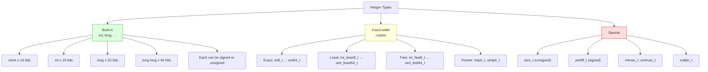

## Why This Matters

Every array index, every container size, every byte count, every memory offset — these are the numbers that describe *how big things are* in your program. Get them wrong and you get buffer overflows, signed/unsigned comparison bugs, undefined behavior from signed overflow, and silent truncation on 32-bit-vs-64-bit porting. Get them right and your code is portable, warning-free, and ready for systems with billions of elements in a single container.

This note is the deep dive on `size_t` — what it is, why the standard library uses it everywhere, and how to use it without surprises. It also covers the broader integer type taxonomy (fixed-width, least, fast, pointer-width), the rules of signed vs. unsigned overflow, and the modern facilities (`std::numeric_limits`, `std::ssize`, overflow-checking intrinsics) that make integer code safe.

## Background

### The Portability Problem

C and C++ were designed for machines with very different word sizes. Rather than mandate "an `int` is 32 bits," the standards leave the widths up to the implementation, requiring only minimum widths and a *ranking* (`short` ≤ `int` ≤ `long` ≤ `long long`). The result is the LP64/LLP64/ILP32 mess:

| Data model | `int` | `long` | pointer | Used by |
| --- | --- | --- | --- | --- |
| ILP32 | 32 | 32 | 32 | 32-bit Linux, Windows |
| LLP64 | 32 | 32 | 64 | 64-bit Windows |
| LP64 | 32 | 64 | 64 | 64-bit Linux, macOS, BSD |

If you write `long x = vec.size();` and assume 64 bits, your code breaks on 64-bit Windows where `long` is 32 bits. If you write `int i = vec.size();` for a vector with more than `INT_MAX` elements, you silently truncate. The solution: use the type the standard library designed for this — `size_t`.

### What `size_t` Actually Is

`size_t` is an **unsigned integer type** defined in `<cstddef>` (and several other headers). The standard says:

> `size_t` is an unsigned integer type with the property that any object that can be allocated is representable in `size_t`.

In other words, `size_t` is *big enough to hold the size of any object the implementation allows*. On a 32-bit system, it's typically 32 bits; on a 64-bit system, it's typically 64 bits. It is the type of:

- The result of `sizeof` and `alignof`.
- The return type of `std::vector::size()`, `std::string::size()`, `std::array::size()`, and every other container's `size()`.
- The type used for container indices in `operator[]` and `at()`.
- The type of `std::strlen`, `std::malloc`'s argument, `std::memcpy`'s count parameter, and essentially every C-library size-related function.

## Main Content

### 1. Why `size_t` Exists

#### Portability

If you write `for (int i = 0; i < vec.size(); ++i)` and your vector has more than `INT_MAX` (≈ 2.1 billion) elements, `i` overflows and your loop never terminates correctly. On a 64-bit system with sufficient RAM, vectors of more than 2 GB are common (think bioinformatics, video processing, large in-memory databases). Using `size_t` instead of `int` lets the loop variable be the correct width on every platform without source changes.

#### Signed/Unsigned Comparison Safety

```cpp
std::vector<int> v = {1, 2, 3};
for (int i = 0; i < v.size(); ++i) { ... }   // WARNING: signed/unsigned mismatch
for (size_t i = 0; i < v.size(); ++i) { ... } // No warning
```

The comparison `int < size_t` triggers a *usual arithmetic conversion* that promotes the `int` to `size_t` (unsigned). If `i` is negative — say, the loop body decremented it — the converted value becomes a huge positive number, and the comparison behaves unexpectedly. Using `size_t` from the start avoids the warning and the trap.

#### Documentation of Intent

When a reader sees `size_t`, they immediately know: "this is a count, an index, or a size in bytes — never negative." That single piece of information is worth a comment.

### 2. `size_t` vs `std::size_t`

Both names refer to the same type. `size_t` is placed in the global namespace by `<cstddef>`, `<cstdio>`, `<cstring>`, etc.; `std::size_t` is the same type placed in `namespace std` by the same headers. Modern style prefers `std::size_t`, but bare `size_t` is widely accepted. They are interchangeable in any well-formed program.

```cpp
#include <cstddef>

std::size_t a = 0;   // C++ style, fully qualified
size_t    b = 0;   // C-style, also fine
static_assert(std::is_same_v<size_t, std::size_t>);  // true
```

### 3. When to Use `size_t`

| Use `size_t` for | Use a signed type for |
| --- | --- |
| Container sizes (`vec.size()`) | Differences of positions (`end - begin` may be negative) |
| Container indices (`vec[i]`) | Offsets from a base where negative is meaningful |
| Byte counts (`sizeof`, `memcpy` sizes) | Mathematical results that can be negative |
| Loop counters over containers | Loop counters that may go below zero |
| Anything compared to a `size_t` | Bit-fields, signed arithmetic, error codes |

> [!warning] The "Negative Loop" Trap
> ```cpp
> for (size_t i = n - 1; i >= 0; --i) { ... }   // INFINITE LOOP
> ```
> `size_t` is unsigned, so `i >= 0` is always true. The loop runs forever (or until you wrap around past `UINT64_MAX`). Use one of:
> ```cpp
> for (size_t i = n; i-- > 0; ) { ... }   // "goes-to-zero" idiom
> for (size_t i = n; i != 0; ) { --i; ... }
> // Or, if you really need signed semantics:
> for (ptrdiff_t i = n - 1; i >= 0; --i) { ... }
> ```

### 4. The Full Integer Type Taxonomy

The `<cstdint>` header provides:

#### Fixed-Width Integers (Exact Width)

These are *optional* — the standard says the implementation provides them only if it has a type of exactly that width. Every modern platform provides all of them.

| Type | Width | Notes |
| --- | --- | --- |
| `int8_t`, `uint8_t` | 8 bits | `uint8_t` is the same size as `unsigned char` but is *not* the same type. |
| `int16_t`, `uint16_t` | 16 bits |  |
| `int32_t`, `uint32_t` | 32 bits |  |
| `int64_t`, `uint64_t` | 64 bits |  |

#### Minimum-Width Integers (At Least N Bits)

Guaranteed to exist for every width 8, 16, 32, 64. The actual width may be larger if the platform has no exact-width type.

| Type | At least |
| --- | --- |
| `int_least8_t`, `uint_least8_t` | 8 bits |
| `int_least16_t`, `uint_least16_t` | 16 bits |
| `int_least32_t`, `uint_least32_t` | 32 bits |
| `int_least64_t`, `uint_least64_t` | 64 bits |

#### Fast Integers (Fastest At Least N Bits)

The implementation picks the *fastest* type that is at least N bits. On x86-64, `int_fast16_t` is often 64 bits because 64-bit operations are as fast as 32-bit ones and avoid partial-register stalls.

| Type | At least |
| --- | --- |
| `int_fast8_t`, `uint_fast8_t` | 8 bits |
| `int_fast16_t`, `uint_fast16_t` | 16 bits |
| `int_fast32_t`, `uint_fast32_t` | 32 bits |
| `int_fast64_t`, `uint_fast64_t` | 64 bits |

#### Pointer-Width Integers

| Type | Notes |
| --- | --- |
| `intptr_t`, `uintptr_t` | Optional. Wide enough to hold a pointer-to-void and round-trip it back. Use for casting pointers to integers (rarely needed in modern C++). |

#### Special-Purpose Standard Types

| Type | Purpose |
| --- | --- |
| `size_t` | Sizes and indices (unsigned, ≥ 16 bits). |
| `ptrdiff_t` | Result of pointer subtraction (signed, ≥ 17 bits). The natural signed counterpart to `size_t`. |
| `max_align_t` | Type with alignment as strict as any other type. |
| `nullptr_t` | Type of the `nullptr` literal. |

### 5. Signed vs. Unsigned Overflow

| Type | Overflow behavior | Examples |
| --- | --- | --- |
| Signed (`int`, `int64_t`, …) | **Undefined behavior** | `INT_MAX + 1` is UB. The compiler may assume it never happens. |
| Unsigned (`unsigned`, `uint64_t`, `size_t`, …) | **Modular arithmetic** (wraps around mod 2^N) | `UINT_MAX + 1 == 0`. Well-defined. |

> [!danger] Signed Overflow Is UB — and Compilers *Exploit* It
> Many programmers assume signed overflow "wraps to negative." It does on most hardware, but the standard says the behavior is **undefined**. Modern optimizers exploit this: they reason "this loop increments `i` by 1 each iteration; if `i + 1` overflowed, that would be UB; the program has no UB; therefore `i + 1` cannot overflow; therefore this loop runs at most INT_MAX iterations." This has caused real security bugs (e.g., Linux kernel CVEs) where the compiler deleted overflow checks.
>
> If you need wrapping signed arithmetic, use `unsigned` (and cast as needed) or compiler intrinsics like `__builtin_add_overflow`.

```cpp
#include <iostream>
#include <limits>

int main() {
    unsigned u = 0;
    std::cout << (u - 1) << '\n';   // prints 18446744073709551615 on 64-bit (wraps)
    int i = std::numeric_limits<int>::max();
    std::cout << (i + 1) << '\n';   // UB — could print anything, or crash, or be optimized out
}
```

### 6. `std::numeric_limits<T>`

The modern, type-safe replacement for `<climits>` macros like `INT_MAX`. Defined in `<limits>`.

```cpp
#include <limits>
#include <iostream>

template <typename T>
void describe() {
    std::cout << "min="     << std::numeric_limits<T>::min()
              << " max="    << std::numeric_limits<T>::max()
              << " lowest=" << std::numeric_limits<T>::lowest()
              << " bits="   << std::numeric_limits<T>::digits
              << "\n";
}

describe<int>();          // min=-2147483648 max=2147483647 ...
describe<unsigned>();     // min=0 max=4294967295 ...
describe<double>();       // min=2.22507e-308 max=1.79769e+308 lowest=-1.79769e+308
describe<size_t>();       // min=0 max=18446744073709551615
```

Key members:

| Member | Meaning |
| --- | --- |
| `min()` | Smallest finite positive value for floats; smallest representable value for ints. |
| `max()` | Largest finite representable value. |
| `lowest()` | Most negative finite value (for floats, differs from `min()`). |
| `digits` | Number of bits in the value (excluding sign and implicit leading bit for floats). |
| `digits10` | Number of decimal digits that can be represented without loss. |
| `is_signed` | `true` if the type is signed. |
| `is_integer` | `true` if the type is integral. |
| `epsilon()` | Smallest `eps` such that `1.0 + eps != 1.0` (floats only). |
| `infinity()` | Positive infinity (floats only). |
| `quiet_NaN()` | A NaN that does not signal (floats only). |

### 7. `std::ssize` (C++20) — A Signed Size

The natural question: "if `size()` returns unsigned `size_t`, how do I iterate backwards safely?" C++20 answers with `std::ssize()`, which returns a *signed* `ptrdiff_t`-like type:

```cpp
#include <vector>
#include <utility>   // for std::ssize

std::vector<int> v = {1, 2, 3};
for (auto i = std::ssize(v) - 1; i >= 0; --i) {
    std::cout << v[i] << ' ';
}   // prints 3 2 1
```

Without `std::ssize`, the unsigned backwards loop is the "goes-to-zero" idiom shown earlier.

### 8. Integer Type Sizes — Mermaid



### 9. Practical Patterns

#### Indexing Loops

```cpp
// Forward — preferred for any container:
for (size_t i = 0; i < vec.size(); ++i) { use(vec[i]); }

// Or, even better, the range-based for:
for (const auto& e : vec) { use(e); }

// Backward (C++20):
for (auto i = std::ssize(vec) - 1; i >= 0; --i) { use(vec[i]); }
```

#### Sizes That Can Be Negative (Sentinel −1)

Sometimes you want a variable that is "either a valid index or −1 to indicate none." Use `ptrdiff_t` or a `std::optional<size_t>`:

```cpp
std::optional<size_t> find_index(const std::vector<int>& v, int target) {
    for (size_t i = 0; i < v.size(); ++i) {
        if (v[i] == target) return i;
    }
    return std::nullopt;
}
```

#### Mixing Signed and Unsigned

When you must compare, convert explicitly and check bounds:

```cpp
bool in_range(int offset, size_t length) {
    return offset >= 0 && static_cast<size_t>(offset) < length;
}
```

#### Safe Arithmetic

Use compiler intrinsics or library functions when overflow matters:

```cpp
#include <cstdint>

bool safe_add(std::uint64_t a, std::uint64_t b, std::uint64_t& result) {
#if defined(__GNUC__) || defined(__clang__)
    return !__builtin_add_overflow(a, b, &result);
#else
    if (a > UINT64_MAX - b) return false;
    result = a + b;
    return true;
#endif
}
```

## Common Pitfalls

1. **`for (size_t i = n - 1; i >= 0; --i)` infinite loop** — unsigned cannot go below zero. Use the goes-to-zero idiom or `std::ssize`.
2. **`int i = vec.size()`** — truncates if `size_t` is 64-bit and `int` is 32-bit and the vector is large.
3. **Signed/unsigned comparison warnings** — promoted signed-to-unsigned conversion silently makes negative values huge. Use `-Werror=sign-compare`.
4. **Assuming `long` is 64-bit** — true on LP64 Linux/macOS, false on LLP64 Windows. Use `int64_t`.
5. **Subtracting `size_t` values** — `a - b` where `a < b` wraps to a huge number. Use `ptrdiff_t` for differences.
6. **`vec.size() - 1` when `vec` is empty** — wraps to `SIZE_MAX`. Always check `!vec.empty()` first.
7. **Signed overflow is UB** — the compiler can delete your overflow checks. Use `unsigned` or `__builtin_*_overflow`.
8. **`int8_t` is `char` on most platforms** — std::iostream treats it as a character, not an integer. `std::cout << int8_t(65)` prints `'A'`, not `65`. Cast to `int` for printing.
9. **Trusting `sizeof(size_t) == sizeof(void*)`** — true in practice on all reasonable platforms, but not strictly guaranteed by the standard.
10. **Forgetting `std::numeric_limits<T>::min()` for floats** — returns the smallest *positive* value, not the most negative. Use `lowest()` for that.
11. **Mixing `size_t` and `int` in arithmetic** — `size_t + int` promotes the `int` to unsigned; if the `int` is negative, you get a huge result.
12. **Using `std::size_t` without including a header** — `<cstddef>` is the canonical source; `<vector>`, `<string>`, `<iterator>` all pull it in transitively, but rely on that at your peril.

## Tips and Tricks

- **Default to `size_t` for indices and sizes**; switch to a signed type only when you need negative sentinel values.
- **`std::ssize` (C++20) is the modern answer for backward iteration.** Use it.
- **`std::numeric_limits<T>` is the type-safe replacement for `INT_MAX` macros**. Use it.
- **`ptrdiff_t` is the signed counterpart of `size_t`** — use it for pointer differences and signed offsets.
- **Enable `-Wconversion -Wsign-compare -Wsign-conversion`** in your build. The warnings are noisy at first but expose real bugs.
- **Use `int32_t`/`uint64_t` instead of `int`/`long`** in any code that interacts with files, network, or hardware. Document the wire format with fixed-width types.
- **Avoid `unsigned` for general arithmetic** — the C++ Core Guidelines (ES.106) recommend signed types for arithmetic and `size_t` only for sizes/indices. The reasoning: signed arithmetic is more intuitive (no wrap-on-subtraction surprises) and signed overflow being UB lets compilers optimize.
- **For checked arithmetic, use `__builtin_add_overflow`/`__builtin_sub_overflow`/`__builtin_mul_overflow`** (GCC/Clang) or libraries like Boost.SafeNumerics.
- **`std::bit_ceil(n)` and `std::bit_floor(n)` (C++20)** compute the next/previous power of two — common in size calculations.
- **`static_assert(sizeof(size_t) >= 4)`** documents your assumption that the platform supports at least 4 GB objects.
- **In templates, prefer `std::make_unsigned_t<T>` and `std::make_signed_t<T>`** (from `<type_traits>`) over hand-rolled signedness swaps.
- **For "this index is invalid" sentinels, prefer `std::optional<size_t>`** over a magic `static_cast<size_t>(-1)` — explicit and type-safe.

## Active Recall

1. What is `size_t`? In which header is it defined, and what guarantees does the standard provide about it?
2. Why does `for (size_t i = n - 1; i >= 0; --i)` produce an infinite loop? Show two ways to fix it.
3. Differentiate `size_t` and `std::size_t`. Are they the same type?
4. List the four categories of fixed-width integer types provided by `<cstdint>` and give an example of each.
5. What is the difference between `int_least32_t`, `int_fast32_t`, and `int32_t`? When would you choose each?
6. What is signed integer overflow in C++? What is unsigned integer overflow? Why is the distinction important to compiler optimizers?
7. Why does the C++ Core Guidelines (ES.106) recommend *signed* types for arithmetic and `size_t` only for sizes/indices?
8. What does `std::numeric_limits<double>::min()` return? What does `lowest()` return? Why are they different?
9. What is `std::ssize` (C++20) and what problem does it solve?
10. Name two compiler intrinsics or library functions for safe checked integer arithmetic.

## Appendix: Integer Type Reference Card

A condensed reference for the integer types you are most likely to encounter.

### Standard Aliases (`<cstdint>`)

| Category | Signed | Unsigned | Notes |
| --- | --- | --- | --- |
| Exact-width (8) | `int8_t` | `uint8_t` | Use for binary protocols. |
| Exact-width (16) | `int16_t` | `uint16_t` |  |
| Exact-width (32) | `int32_t` | `uint32_t` |  |
| Exact-width (64) | `int64_t` | `uint64_t` |  |
| Least-width (8–64) | `int_leastN_t` | `uint_leastN_t` | At least N bits; may be wider. |
| Fast (8–64) | `int_fastN_t` | `uint_fastN_t` | Fastest type ≥ N bits. |
| Pointer-width | `intptr_t` | `uintptr_t` | Holds a pointer (optional). |
| Max-width | `intmax_t` | `uintmax_t` | Widest available. |

### Special Standard Types

| Type | Header | Purpose |
| --- | --- | --- |
| `size_t` | `<cstddef>` | Unsigned; sizes and indices. |
| `ptrdiff_t` | `<cstddef>` | Signed; pointer differences. |
| `nullptr_t` | `<cstddef>` | Type of `nullptr`. |
| `max_align_t` | `<cstddef>` | Strictest-alignment type. |
| `byte` | `<cstddef>` (C++17) | `std::byte` — type-safe raw byte. |

### Macros vs. Templates

Prefer `std::numeric_limits<T>` over the C-style macros:

| Old (`<climits>`) | New (`<limits>`) |
| --- | --- |
| `INT_MAX` | `std::numeric_limits<int>::max()` |
| `INT_MIN` | `std::numeric_limits<int>::min()` |
| `UINT_MAX` | `std::numeric_limits<unsigned>::max()` |
| `LLONG_MAX` | `std::numeric_limits<long long>::max()` |
| `DBL_EPSILON` | `std::numeric_limits<double>::epsilon()` |
| `CHAR_BIT` | `std::numeric_limits<char>::digits` (with care) |

The template form works in generic code: `template <typename T> void f() { auto max = std::numeric_limits<T>::max(); }`.

## Appendix: A Cheat Sheet for the Practitioner

- **Index a container?** → `size_t`.
- **Iterate backward?** → `std::ssize(v)` (C++20) or `ptrdiff_t`.
- **Difference of two indices?** → `ptrdiff_t`.
- **Byte count or `sizeof`?** → `size_t`.
- **File/network format?** → Fixed-width (`uint32_t`, `int64_t`).
- **General arithmetic with possible negatives?** → `int`, `int64_t` (signed!).
- **Mask or bitfield?** → `uint32_t`, `uint64_t` (unsigned; shifts are well-defined).
- **Sentinel "no value"?** → `std::optional<size_t>` or `std::optional<int>`.
- **Need to know if `a + b` overflows?** → `__builtin_add_overflow` (GCC/Clang).
- **Need to know the max of a type?** → `std::numeric_limits<T>::max()`.

## Next Steps

- [[8. Arrays and Multidimensional Arrays]] — where `size_t` shines as the canonical index type.
- [[3. Variables and Fundamental Types]] — the broader type system.
- [[8. Modern C++]] — `std::ssize`, `std::bit_*`, and the rest of the C++20 numeric toolkit.
- [[19. Performance Optimization]] — overflow, branch-free idioms, and signed-vs-unsigned performance considerations.
- [[6. Pointers and References]] — `ptrdiff_t` as the result of pointer subtraction.
