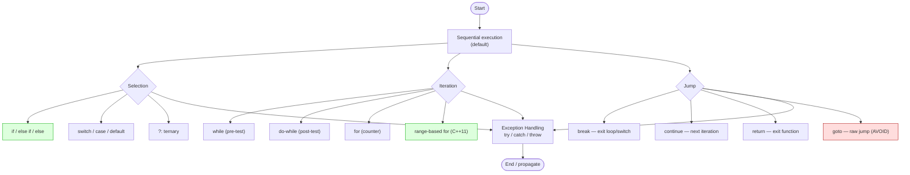

## Why This Matters

A program without control flow is just a list of statements that runs top to bottom and exits. Real programs decide, branch, repeat, skip, abort, retry. Every non-trivial algorithm — binary search, BFS, hash-table lookup, parser state machines — is built from a small set of control-flow primitives: `if`/`else`, `switch`, loops (`for`, `while`, `do`), jumps (`break`, `continue`, `return`, the dreaded `goto`), and exception handling (`try`/`catch`/`throw`).

Choosing the right primitive makes code clear and correct; choosing the wrong one makes it a maze of nested branches that no reviewer can fully follow. This note covers every C++ control-flow construct, the modern style recommendations around them (init-statements in `if`/`switch`, range-based `for`, structured bindings), and the pitfalls (fall-through in `switch`, the dangling-else problem, off-by-one in `for`).

## Background

### What "Control Flow" Means

**Control flow** is the order in which individual statements, instructions, or function calls of a program are executed or evaluated. C++ provides:

- **Sequential execution** (the default).
- **Selection statements**: `if`, `else`, `switch`.
- **Iteration statements**: `while`, `do-while`, `for`, range-based `for`.
- **Jump statements**: `break`, `continue`, `return`, `goto`.
- **Exception handling**: `try`, `catch`, `throw` (covered more fully in [[13. Error Handling and Exceptions]]).

### Structured Programming

In the 1960s, Edsger Dijkstra famously wrote *"Go To Statement Considered Harmful."* The structured programming revolution that followed argued that programs should be built from sequence, selection, and iteration — *not* arbitrary jumps. C++ provides `goto` for backward compatibility with C and for a few narrow use cases (escaping deeply nested loops), but every modern style guide restricts or forbids it. The constructs in this note are the structured-programming toolkit.

### Statement Scope

Many control-flow constructs introduce a **block scope** — variables declared inside `if (init; cond) { ... }` are destroyed at the end of the `if` statement, not at the end of the enclosing function. This scoping is the foundation of RAII (see [[7. Memory Management]]).

## Main Content

### 1. `if` / `else if` / `else`

The most basic selection statement:

```cpp
if (score >= 90) {
    grade = 'A';
} else if (score >= 80) {
    grade = 'B';
} else if (score >= 70) {
    grade = 'C';
} else {
    grade = 'F';
}
```

#### The C++17 `if` Init-Statement

```cpp
if (auto it = map.find(key); it != map.end()) {
    use(it->second);
}   // `it` is destroyed here — does not leak into surrounding scope
```

This is one of the most useful additions of C++17. It restricts the lifetime of a temporary to the `if` statement, preventing the classic "use after `if`" bug:

```cpp
// BAD (pre-C++17 pattern):
auto it = map.find(key);
if (it != map.end()) {
    use(it->second);
}
// `it` is still in scope here — someone might accidentally use it.

// GOOD (C++17):
if (auto it = map.find(key); it != map.end()) {
    use(it->second);
}
// `it` is gone here — no chance of misuse.
```

#### `if constexpr` (C++17)

Inside templates, `if constexpr (condition)` evaluates the condition at *compile time* and discards the false branch without instantiating it. This eliminates huge swaths of SFINAE:

```cpp
template <typename T>
void process(T x) {
    if constexpr (std::is_integral_v<T>) {
        std::cout << "integer: " << x << '\n';
    } else if constexpr (std::is_floating_point_v<T>) {
        std::cout << "float: " << x << '\n';
    } else {
        std::cout << "other\n";
    }
}
```

#### The Dangling-Else

```cpp
if (a)
    if (b) do_b();
else        // Ambiguous to humans; clear to the compiler.
    do_else();
```

The compiler binds `else` to the *nearest unmatched* `if` — the inner one. Always brace to make intent explicit. Enabling `-Wdangling-else` catches this.

#### Implicit Conversion to `bool`

The condition of an `if` is converted to `bool`. For pointers, `if (ptr)` is true for non-null. For integers, any nonzero is true. For user types, you can provide `operator bool()` (preferably `explicit`).

> [!tip] Prefer `if (ptr)` Over `if (ptr != nullptr)`
> The shorter form is idiomatic C++ and reads naturally once you are used to it. The `!= nullptr` form is more verbose without adding clarity.

### 2. `switch`

`switch` is a multi-way branch on an integral or enumeration value:

```cpp
switch (http_status) {
    case 200: std::cout << "OK\n";            break;
    case 301: std::cout << "Moved\n";         break;
    case 404: std::cout << "Not Found\n";     break;
    case 500: std::cout << "Server Error\n";  break;
    default:  std::cout << "Unknown\n";       break;
}
```

#### Fall-Through

Without `break`, execution *falls through* to the next `case`. Sometimes this is intentional:

```cpp
switch (ch) {
    case ' ':
    case '\t':
    case '\n':
        ++whitespace_count;   // all three cases share this body
        break;
    default:
        ++other_count;
        break;
}
```

> [!warning] Unintentional Fall-Through Is a Common Bug
> Forgetting `break` is one of the most common (and dangerous) `switch` bugs. C++17 introduced `[[fallthrough]]` to document intentional fall-through; with `-Wimplicit-fallthrough`, the compiler warns on fall-through that lacks this attribute:
>
> ```cpp
> switch (x) {
>     case 1:
>         prepare();
>         [[fallthrough]];   // intentional — don't warn
>     case 2:
>         execute();
>         break;
> }
> ```

#### `default`

Always provide a `default`, even if it just `assert`s. Unhandled cases silently fall through, which is rarely what you want. With `enum class`, GCC/Clang can even warn about missing cases (`-Wswitch`).

#### The C++17 `switch` Init-Statement

```cpp
switch (auto status = compute(); status) {
    case OK:    handle_ok();    break;
    case ERROR: handle_error(); break;
}
```

#### `case` Labels Must Be Constant Expressions

You cannot `switch` on a runtime string, an `std::string`, or a floating-point value. For string dispatch, use `std::unordered_map<std::string, std::function<void()>>` or `if`/`else if` chains.

#### Scoping Inside `switch`

```cpp
switch (x) {
    case 1:
        int y = compute();   // DANGER — see below
        use(y);
        break;
    case 2:
        use(y);              // Compiles! But `y` was never initialized for this path.
        break;
}
```

Variables declared inside a `switch` are in scope for *all* cases. The compiler may or may not warn (`-Wdeclaration-after-statement`). To avoid the trap, brace each case:

```cpp
switch (x) {
    case 1: {
        int y = compute();
        use(y);
        break;
    }
    case 2: {
        // `y` not visible here — safe.
        break;
    }
}
```

### 3. The Ternary Operator `?:`

Covered in [[4. Operators]] — included here for completeness:

```cpp
int max_val = (a > b) ? a : b;
std::cout << "item" << (n == 1 ? "" : "s") << '\n';
```

Use for short, single-expression choices. Use `if`/`else` for anything with side effects or nested conditions.

### 4. The `while` Loop

```cpp
while (condition) {
    body;
}
```

The condition is tested *before* each iteration. If it is false initially, the body never executes.

```cpp
while (!queue.empty()) {
    process(queue.front());
    queue.pop();
}
```

### 5. The `do-while` Loop

```cpp
do {
    body;
} while (condition);
```

The body executes *at least once*, then the condition is tested. Rarely needed but occasionally the right tool — e.g., prompting for input until valid:

```cpp
int value;
do {
    std::cout << "Enter a positive number: ";
    std::cin >> value;
} while (value <= 0);
```

> [!info] `do-while` Is the Only Post-Test Loop in C++
> Use it when the loop body must run at least once before the condition can be meaningfully tested.

### 6. The `for` Loop

```cpp
for (init; condition; increment) {
    body;
}
```

Equivalent to:

```cpp
{
    init;
    while (condition) {
        body;
        increment;
    }
}
```

Examples:

```cpp
// Count to 10:
for (int i = 0; i < 10; ++i) { std::cout << i << ' '; }

// Iterate a container:
for (size_t i = 0; i < vec.size(); ++i) { use(vec[i]); }

// Multiple counters (comma operator):
for (size_t i = 0, j = n - 1; i < j; ++i, --j) {
    std::swap(vec[i], vec[j]);
}

// Infinite loop (use break inside):
for (;;) { if (should_stop()) break; }
```

### 7. Range-Based `for` (C++11)

The modern, idiomatic way to iterate any container:

```cpp
std::vector<int> v = {1, 2, 3, 4, 5};

// Read-only:
for (int x : v) { std::cout << x << ' '; }

// Modify in place:
for (int& x : v) { x *= 2; }

// Avoid copies of expensive types:
for (const std::string& s : strings) { use(s); }

// With structured bindings (C++17):
std::map<std::string, int> m = {{"a", 1}, {"b", 2}};
for (const auto& [key, value] : m) {
    std::cout << key << " = " << value << '\n';
}
```

Under the hood, range-based `for` is:

```cpp
for (auto&& __range : container) {
    for (auto __it = std::begin(__range); __it != std::end(__range); ++__it) {
        auto x = *__it;
        body;
    }
}
```

Any type with `begin()` and `end()` (returning iterators) supports range-based `for`. This includes arrays, all standard containers, `std::string`, `std::string_view`, `std::initializer_list`, and any user type that implements the interface.

> [!tip] Default to `const auto&` in Range-Based `for`
> Unless you need to modify the elements, use `for (const auto& x : container)`. This avoids copying each element while preventing accidental modification. For cheap-to-copy types (`int`, `double`), `for (auto x : container)` is fine.

### 8. `break` and `continue`

- **`break`** exits the immediately enclosing loop or `switch`.
- **`continue`** skips the rest of the current iteration and proceeds to the next.

```cpp
for (int i = 0; i < 100; ++i) {
    if (i % 2 == 0) continue;   // skip even numbers
    if (i == 13) break;         // stop entirely
    std::cout << i << ' ';
}
```

`break` and `continue` only affect the *innermost* loop. To break out of nested loops, use a flag, a function with `return`, or (rarely) `goto`.

### 9. `return`

Exits the current function, optionally yielding a value. C++ does *not* have multi-value return, but you can return `std::tuple`, `std::pair`, `struct`, or use **structured bindings** (C++17) to unpack:

```cpp
std::pair<bool, int> find(int target) {
    for (size_t i = 0; i < vec.size(); ++i) {
        if (vec[i] == target) return {true, i};
    }
    return {false, -1};
}

auto [found, idx] = find(42);
```

In `main` (and only `main`), falling off the end is equivalent to `return 0;`.

### 10. `goto` — and Why to Avoid It

```cpp
goto label;
// ...
label:
    statement;
```

`goto` is a raw unconditional jump. Its legitimate uses are extremely narrow:

- Escaping deeply nested loops (where `break` only escapes one level).
- Implementing state machines or coroutines in low-level code.
- Cleanup patterns in C-style code (avoid in C++; use RAII).

```cpp
// The "labeled break" idiom for nested loops:
for (int i = 0; i < N; ++i) {
    for (int j = 0; j < M; ++j) {
        if (found(i, j)) goto done;
    }
}
done:
    std::cout << "Found it.\n";
```

Even here, refactoring the inner loop into a function with `return` is usually cleaner. The C++ Core Guidelines (ES.10) says: *"Avoid `goto`."*

> [!danger] `goto` Cannot Jump Over Variable Initializations
> ```cpp
> goto skip;
> int x = 5;   // this initialization would be skipped
> skip:
> use(x);      // UB — x is in scope but uninitialized
> ```
> The compiler rejects this. `goto` may only jump *forward* past declarations that have initializers if those declarations are inside a block that the `goto` does not enter.

### 11. Exception Handling (Introduction)

C++ exceptions decouple error detection from error handling:

```cpp
double divide(double a, double b) {
    if (b == 0.0) throw std::invalid_argument("division by zero");
    return a / b;
}

try {
    double r = divide(1.0, 0.0);
} catch (const std::invalid_argument& e) {
    std::cerr << "Error: " << e.what() << '\n';
}
```

Exception handling is its own large topic; see [[13. Error Handling and Exceptions]]. For now, the key things to know:

- **`throw`** raises an exception of any type (prefer types derived from `std::exception`).
- **`try`** introduces a block that may throw.
- **`catch`** catches exceptions of a specific (or any) type.
- Exceptions propagate up the call stack, unwinding stack frames and destroying locals (RAII), until a matching `catch` is found. If none is found, `std::terminate` is called.
- **Performance**: zero cost if not thrown, but throwing is expensive. Use for *exceptional* errors, not for normal control flow.

> [!info] `noexcept`
> A function marked `noexcept` promises not to throw. If it does, `std::terminate` is called. `noexcept` enables optimizations and is required by many standard-library operations (e.g., `std::vector` move-only operations during reallocation).

### Control Flow Diagram — Mermaid



### Annotated Example: A Realistic Loop

```cpp
#include <iostream>
#include <vector>
#include <string>
#include <map>

int main() {
    std::vector<std::string> words = {"apple", "banana", "cherry", "date", "elderberry"};

    // C++17 init-statement in if: limit `it` to this if-statement.
    std::map<std::string, int> counts;
    if (auto [it, inserted] = counts.emplace("apple", 1); inserted) {
        std::cout << "First 'apple'\n";
    }

    // Range-based for with structured bindings.
    for (const auto& [word, count] : counts) {
        std::cout << word << ": " << count << '\n';
    }

    // Classic for with break/continue.
    int total = 0;
    for (size_t i = 0; i < words.size(); ++i) {
        if (words[i].empty()) continue;
        if (words[i][0] == 'd') break;
        total += static_cast<int>(words[i].size());
    }
    std::cout << "Total length (words starting before 'd'): " << total << '\n';

    // switch with [[fallthrough]] and default.
    char grade = 'B';
    switch (grade) {
        case 'A':
            std::cout << "Excellent\n";
            break;
        case 'B':
            std::cout << "Good\n";
            [[fallthrough]];   // intentional: also print the next line
        case 'C':
            std::cout << "Passing\n";
            break;
        default:
            std::cout << "Unknown grade\n";
            break;
    }

    return 0;
}
```

## Common Pitfalls

1. **Forgetting `break` in `switch`** — silent fall-through changes behavior. Use `[[fallthrough]]` for intentional cases and `-Wimplicit-fallthrough`.
2. **Off-by-one in `for` loops** — `for (int i = 0; i <= n; ++i)` runs `n+1` times; `for (int i = 0; i < n; ++i)` runs `n` times. Pick the right form for your intent.
3. **Unsigned backwards loop** — `for (size_t i = n - 1; i >= 0; --i)` is infinite. See [[6. size_t and Integer Types]].
4. **Modifying a container while iterating** — `for (auto& x : vec) vec.push_back(x);` is UB. Use index-based loops or invalidate iterators carefully.
5. **Dangling iterators from `find`** — using an iterator after the container is modified is UB.
6. **`else` binding to the wrong `if`** — the dangling-else ambiguity. Brace your conditions.
7. **`switch` on a non-constant** — `case` labels must be compile-time constants.
8. **Variables declared in `switch` cases** — in scope for all cases; initialization may be skipped. Brace each case.
9. **`goto` jumping over initialization** — compile error, but a sign of bad design.
10. **Using exceptions for normal control flow** — exceptions are for *exceptional* errors. A missing cache entry is not an exception; it is a normal return.
11. **Catching by value** — `catch (std::exception e)` slices the exception. Catch by reference: `catch (const std::exception& e)`.
12. **Forgetting `default` in `switch`** — silent miss of unhandled cases. Always provide one, even if it just `assert(false)`.

## Tips and Tricks

- **Prefer `if` init-statements (C++17)** to limit the scope of temporaries.
- **Prefer range-based `for`** over index-based loops unless you need the index.
- **Use `const auto&`** as the default in range-based `for`; switch to `auto&` only when modifying.
- **`switch` over `if`/`else if` chains** when comparing one integral value against many constants — clearer and the compiler can emit a jump table.
- **Always provide `default` in `switch`**; with `enum class`, enable `-Wswitch` to catch missing cases.
- **`[[fallthrough]]`** (C++17) documents intentional fall-through and silences warnings.
- **`if constexpr` (C++17)** is the modern replacement for tag dispatch and many SFINAE patterns.
- **Refactor nested loops into helper functions** so you can use `return` instead of flags or `goto`.
- **`break` and `continue` early** — the "guard clause" pattern (early return/continue) reduces nesting.
- **For state machines, prefer `std::variant` + `std::visit`** over `switch` on enum + raw state data — type-safe and exhaustive.
- **`noexcept`** on functions that cannot throw enables moves instead of copies in `std::vector` reallocation.
- **Read the C++ Core Guidelines** on control flow (ES.70–ES.76): they are concise, practical, and well-reasoned.

## Active Recall

1. List the five categories of control-flow constructs in C++.
2. What is the C++17 `if` init-statement? Give an example where it prevents a bug.
3. Explain the "dangling-else" problem. How do you avoid it?
4. What is `[[fallthrough]]`? When and why do you use it?
5. Show the "goes-to-zero" idiom for iterating a container backward with an unsigned index.
6. What is the difference between `while` and `do-while`? Give one scenario where `do-while` is the right choice.
7. What does range-based `for` look like under the hood? What interface must a type support?
8. Why does the C++ Core Guidelines recommend against `goto`? Name one narrow case where it is still sometimes used.
9. What is `if constexpr` (C++17) and how does it differ from a regular `if`?
10. Why must exceptions be caught by reference, not by value?

## Appendix: When to Use Which Construct

A quick decision guide for choosing the right control-flow construct:

| Situation | Prefer |
| --- | --- |
| Branch on a boolean | `if` / `else` |
| Branch on one integral/enum value against many constants | `switch` |
| Branch on a type in a template | `if constexpr` (C++17) |
| Choose between two expressions (no side effects) | Ternary `?:` |
| Loop with a known count | `for` |
| Loop while a condition holds, count unknown | `while` |
| Loop at least once, then test | `do-while` |
| Iterate every element of a container | Range-based `for` |
| Escape a loop early | `break` |
| Skip to next iteration | `continue` |
| Exit a function | `return` |
| Escape a nested loop | Refactor into a function and `return`, or (rarely) `goto` |
| Handle an *exceptional* error | `throw` / `try` / `catch` |
| Handle an *expected* failure | Return code, `std::optional`, `std::expected` |

## Appendix: A Note on Loop Performance

Modern CPUs excel at predicting and pipelining *straight-line* code. Tight, branch-free loops can run dramatically faster than loops with many `if`/`else` branches. Two practical consequences:

1. **Branchless idioms** can be faster than `if`/`else` when the branch is unpredictable. For example, `if (x > max) max = x;` is sometimes slower than `max = std::max(max, x);` because the latter can compile to a conditional-move instruction (`cmov`) that doesn't stall the pipeline on a mispredict. See [[19. Performance Optimization]] for the full treatment.
2. **Loop unrolling** is usually best left to the compiler. Mark hot loops with `[[likely]]` / `[[unlikely]]` (C++20) attributes to give branch prediction hints:

```cpp
for (int i = 0; i < n; ++i) {
    if (data[i] == target) [[unlikely]] {
        return i;   // Tell the compiler this branch is rarely taken.
    }
}
```

3. **Range-based `for`** and **index-based `for`** typically generate identical machine code in optimized builds. Prefer the range-based form for readability unless you need the index.

> [!info] Avoid Premature Micro-Optimization
> Branch prediction, loop unrolling, and instruction-level parallelism are deep topics where intuition often misleads. *Measure first* with a profiler (perf, VTune, Tracy), *then* optimize. A 1% improvement to the wrong loop is wasted effort; a 5× improvement to the right loop is a career-defining commit.

## Next Steps

- [[8. Arrays and Multidimensional Arrays]] — loops in their natural habitat: iterating arrays.
- [[13. Error Handling and Exceptions]] — the deep dive on `try`/`catch`/`throw`, `noexcept`, and exception safety guarantees.
- [[8. Modern C++]] — `if constexpr`, init-statements, structured bindings, range-based `for` with sentinel patterns.
- [[4. Functions and Program Structure]] — how control flow interacts with function calls, recursion, and tail-call optimization.
- [[9. Object-Oriented Programming]] — polymorphism as a form of dynamic control flow.
