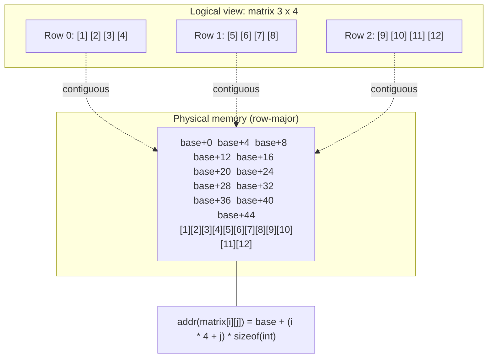

## Why This Matters

Arrays are the *primordial* data structure. Every other container — `std::vector`, `std::string`, `std::map` — is built on top of arrays of bytes allocated somewhere in memory. Understanding arrays at the byte level unlocks everything: cache locality, pointer arithmetic, the C++ memory model, the difference between `int arr[10]` and `int* p = new int[10]`, and the long list of footguns (array decay, off-by-one indexing, the `sizeof(arr)/sizeof(arr[0])` trap, multidimensional-array parameter passing).

This note covers C-style arrays in detail — including the row-major memory layout that underpins cache-friendly iteration — and then introduces the modern C++ alternatives (`std::array`, `std::vector`) that you should almost always prefer. We finish with a thorough look at how to pass multidimensional arrays to functions, including all three parameter-syntax variants and the template trick that captures dimensions automatically.

## Background

### What an Array Is, at the Hardware Level

An array is a **contiguous block of memory** divided into equal-sized slots, each holding one element of the array's element type. The base address of the block plus an index times the element size gives the address of any element:

```
addr(arr[i]) = base + i * sizeof(element_type)
```

This is one of the most important equations in all of computing. It is the reason array indexing is `O(1)`, the reason CPU caches can prefetch sequential accesses, and the reason pointer arithmetic works the way it does.

### C-Style Arrays vs Standard Containers

C++ inherits C-style arrays (`int arr[10]`) unchanged. They are:

- **Fixed size**, known at compile time.
- **Stored on the stack** (or in static storage) when declared as locals/globals.
- **Not objects** in the OOP sense — they have no `.size()`, no `.begin()`, no `.end()`.
- **Decay to a pointer** when passed to a function, losing their size information.

The C++ standard library provides `std::array<T, N>` (C++11) as a thin, safe wrapper around a C-style array, and `std::vector<T>` as a dynamic-size alternative. New code should default to these; C-style arrays are appropriate only when interfacing with C APIs, in embedded systems with no heap, or in template metaprogramming contexts.

## Main Content

### 1. Declaring and Initializing C-Style Arrays

```cpp
int a[10];                            // 10 ints, uninitialized (indeterminate values!)
int b[10] = {};                       // 10 ints, all zero-initialized.
int c[10] = {0};                      // 10 ints, first is 0, rest are value-initialized (zero).
int d[]  = {1, 2, 3, 4, 5};           // Size deduced as 5.
int e[5] = {1, 2};                    // First two are 1, 2; rest are 0.
int f[3][4] = {{1,2,3,4},{5,6,7,8},{9,10,11,12}};  // 2D.

// C++20 designated initializers:
int g[5] = {[2] = 5, [1] = 2, [4] = 9};   // {0, 2, 5, 0, 9}

// C++17 class template argument deduction (CTAD) for std::array:
std::array h = {1, 2, 3, 4, 5};        // std::array<int, 5>
```

> [!warning] Uninitialized Local Arrays Have Indeterminate Contents
> A local `int a[10];` does *not* default to zero. The contents are whatever was on the stack — reading them is UB. Always write `int a[10] = {};` to zero-initialize, or use `std::array` which value-initializes by default with brace-init.

### 2. Accessing Elements

```cpp
int x = d[0];     // first element (zero-based indexing)
d[4] = 100;       // assign to the 5th element
```

The subscript operator `[]` does **no bounds checking**. `d[10]` (or `d[-1]`) compiles cleanly and is **undefined behavior** at runtime — usually a memory-corruption bug, possibly exploitable. Use `std::array::at(i)` or `std::vector::at(i)` for bounds-checked access (throws `std::out_of_range`).

### 3. Array Length: `sizeof(arr) / sizeof(arr[0])`

For a C-style array declared in scope, you can compute the element count at compile time:

```cpp
int arr[] = {1, 2, 3, 4, 5};
constexpr size_t n = sizeof(arr) / sizeof(arr[0]);   // n == 5
// Or, C++17:
constexpr size_t n2 = std::size(arr);                // n2 == 5
```

C++17 also added `std::ssize(arr)` which returns a *signed* count. Both work on C-style arrays *and* standard containers.

> [!danger] Array Decay — the `sizeof` Trick Fails Inside Functions
> When you pass a C-style array to a function, it **decays to a pointer** to its first element. The function parameter `int arr[]` is literally the same as `int* arr`. `sizeof(arr)` inside the function returns the size of a *pointer* (typically 8 bytes on 64-bit), not the size of the array. This is the most common C/C++ bug of all time:
>
> ```cpp
> void bad(int arr[]) {
>     size_t n = sizeof(arr) / sizeof(arr[0]);   // WRONG — sizeof(arr) is sizeof(int*)
>     std::cout << n;   // prints 2 on a 64-bit system with 4-byte ints — completely wrong
> }
>
> int main() {
>     int data[100];
>     bad(data);   // thinks n == 2 instead of 100
> }
> ```
>
> **Solution**: pass the size explicitly, use `std::array`/`std::vector`, or use a template that captures the array by reference (shown below).

### 4. Array Decay to Pointer

In almost every expression context, an array name is implicitly converted to a pointer to its first element:

```cpp
int arr[5] = {1, 2, 3, 4, 5};
int* p = arr;        // p points to arr[0]
int* q = arr + 2;    // q points to arr[2]
*p = 10;             // arr[0] is now 10
std::cout << *(arr + 2);   // prints 3 (or 10 if you ran the previous line)
```

The exceptions where decay does *not* happen:

- `sizeof(arr)` — gives the array's size in bytes.
- `&arr` — gives a pointer to the whole array (type `int (*)[5]`).
- `decltype(arr)` — yields the array type, not a pointer.
- String literal initialization of `char[]`.
- Reference binding: `int (&r)[5] = arr;`.

### 5. Multidimensional Arrays

A 2D array is an "array of arrays":

```cpp
int matrix[3][4] = {
    {1, 2, 3, 4},
    {5, 6, 7, 8},
    {9, 10, 11, 12}
};

// Access:
int x = matrix[1][2];   // row 1, col 2 → 7
matrix[2][3] = 99;      // last element
```

`matrix` has type `int[3][4]` — an array of 3 elements, each of which is an array of 4 `int`s. `matrix[i]` is an `int[4]` (which decays to `int*`); `matrix[i][j]` is an `int`.

You can extend to higher dimensions: `int cube[3][4][5];` — an array of 3 arrays of 4 arrays of 5 ints.

### 6. Row-Major Order — The Memory Layout

C and C++ store 2D arrays in **row-major order**: the elements of row 0 come first, then row 1, then row 2, etc. For `int matrix[3][4]`:

```
Address:  base  +4  +8  +12  +16  +20  +24  +28  +32  +36  +40  +44
Element:  [0,0] [0,1] [0,2] [0,3] [1,0] [1,1] [1,2] [1,3] [2,0] [2,1] [2,2] [2,3]
```

The address of `matrix[i][j]` is:

```
addr(matrix[i][j]) = base + (i * NUM_COLS + j) * sizeof(int)
```

This is the equation that makes everything work — pointer arithmetic, indexing, and cache-friendly iteration.

#### Why Row-Major Matters for Performance

CPUs load memory in **cache lines** (typically 64 bytes). When you access `matrix[i][j]`, the cache prefetcher pulls the surrounding bytes — typically the rest of row `i` — into L1 cache. Accessing `matrix[i][j+1]`, `matrix[i][j+2]`, … is then a cache *hit* (essentially free). Accessing `matrix[i+1][j]` may be a cache *miss* (hundreds of cycles wasted).

```cpp
// FAST — row-major iteration (cache-friendly):
for (int i = 0; i < ROWS; ++i) {
    for (int j = 0; j < COLS; ++j) {
        matrix[i][j] *= 2;
    }
}

// SLOW — column-major iteration (cache-unfriendly):
for (int j = 0; j < COLS; ++j) {
    for (int i = 0; i < ROWS; ++i) {
        matrix[i][j] *= 2;
    }
}
```

> [!tip] Always Iterate in Row-Major Order in C++
> For a 1000×1000 `int` matrix, column-major iteration can be **10×–50× slower** than row-major on modern hardware, because every access misses the L1 cache. The cache miss is the bottleneck, not the multiplication. (Note: Fortran, MATLAB, and BLAS use column-major by default, so when interop is involved, mind the convention.)

### Row-Major Memory Layout — Mermaid



### 7. Passing Multidimensional Arrays to Functions

This is one of the trickier corners of C++. The compiler must know the size of every dimension *except the first* in order to compute the address `base + (i * COLS + j) * sizeof(int)`.

#### Variant 1: Specify All Dimensions Except the First

```cpp
void print_matrix(int matrix[][4], int rows) {
    for (int i = 0; i < rows; ++i) {
        for (int j = 0; j < 4; ++j) {
            std::cout << matrix[i][j] << ' ';
        }
        std::cout << '\n';
    }
}

int main() {
    int m[3][4] = {{1,2,3,4},{5,6,7,8},{9,10,11,12}};
    print_matrix(m, 3);
}
```

The parameter `int matrix[][4]` is read as: "matrix is a pointer (`*`) to an array of 4 ints." Equivalent declarations are:

```cpp
void print_matrix(int matrix[][4], int rows);
void print_matrix(int (*matrix)[4], int rows);   // identical
void print_matrix(int matrix[3][4], int rows);   // also identical — the 3 is IGNORED
```

All three are the *same* function signature; the compiler ignores the first dimension's size.

#### Variant 2: Fully Specified First Dimension (rarely useful)

```cpp
void print_matrix(int matrix[3][4]);   // first dim ignored; same as above
```

The `3` here is documentation only — the compiler does not enforce it. Do not rely on it.

#### Variant 3: Template Trick to Capture Both Dimensions

```cpp
template <size_t ROWS, size_t COLS>
void print_matrix(const int (&matrix)[ROWS][COLS]) {
    for (size_t i = 0; i < ROWS; ++i) {
        for (size_t j = 0; j < COLS; ++j) {
            std::cout << matrix[i][j] << ' ';
        }
        std::cout << '\n';
    }
}

int main() {
    int m[3][4] = {{1,2,3,4},{5,6,7,8},{9,10,11,12}};
    print_matrix(m);   // ROWS=3, COLS=4 deduced automatically
}
```

The parameter `const int (&matrix)[ROWS][COLS]` is a *reference* to a 2D array; no decay happens. This is the cleanest way to accept a C-style 2D array of any size. The downside: each combination of ROWS × COLS instantiates a new function, so binary size grows.

#### Variant 4: Pointer to the First Element + Manual Index Calculation

If you want a function that works with *any* column count, accept a flat pointer and compute indices yourself:

```cpp
void print_matrix(const int* data, size_t rows, size_t cols) {
    for (size_t i = 0; i < rows; ++i) {
        for (size_t j = 0; j < cols; ++j) {
            std::cout << data[i * cols + j] << ' ';
        }
        std::cout << '\n';
    }
}

int main() {
    int m[3][4] = {{1,2,3,4},{5,6,7,8},{9,10,11,12}};
    print_matrix(&m[0][0], 3, 4);
    // or: print_matrix(reinterpret_cast<int*>(m), 3, 4);
}
```

This is essentially what `std::vector<int>` with a flattened layout does — the *recommended* modern approach.

#### Variant 5: Modern C++ — Use `std::array` or `std::vector`

```cpp
#include <array>
#include <vector>

// Fixed 2D with std::array:
void print(const std::array<std::array<int, 4>, 3>& m) {
    for (const auto& row : m) {
        for (int x : row) std::cout << x << ' ';
        std::cout << '\n';
    }
}

// Dynamic 2D with std::vector:
void print(const std::vector<std::vector<int>>& m) {
    for (const auto& row : m) {
        for (int x : row) std::cout << x << ' ';
        std::cout << '\n';
    }
}
```

Cleaner, safer, self-documenting. The downside of nested `std::vector`: rows are *not* contiguous in memory (each row is a separate heap allocation), which hurts cache performance for large matrices.

### 8. The Modern C++ Approach: `std::array` and `std::vector`

#### `std::array<T, N>` — Fixed-Size, Stack-Allocated

A thin wrapper around a C-style array. Knows its own size. Works with range-based `for`, STL algorithms, and structured bindings.

```cpp
#include <array>

std::array<int, 5> a = {1, 2, 3, 4, 5};   // CTAD: std::array a = {1,2,3,4,5};
std::cout << a.size() << '\n';             // 5
for (int x : a) std::cout << x << ' ';     // 1 2 3 4 5
a.at(10);                                  // throws std::out_of_range
std::sort(a.begin(), a.end());
```

#### `std::vector<T>` — Dynamic-Size, Heap-Allocated

The default container for sequences. Manages its own memory. Resizable.

```cpp
#include <vector>

std::vector<int> v = {1, 2, 3};
v.push_back(4);
v.push_back(5);
std::cout << v.size() << '\n';             // 5
for (int x : v) std::cout << x << ' ';     // 1 2 3 4 5
v.at(10);                                  // throws std::out_of_range
std::sort(v.begin(), v.end());
```

#### High-Performance 2D: Flattened `std::vector<T>`

For best cache performance, simulate a 2D array with a single flat `std::vector` and manual index arithmetic:

```cpp
class Matrix {
    std::vector<int> data_;
    size_t rows_, cols_;
public:
    Matrix(size_t rows, size_t cols)
        : data_(rows * cols), rows_(rows), cols_(cols) {}

    int& operator()(size_t i, size_t j)       { return data_[i * cols_ + j]; }
    int  operator()(size_t i, size_t j) const { return data_[i * cols_ + j]; }

    size_t rows() const { return rows_; }
    size_t cols() const { return cols_; }
};

int main() {
    Matrix m(3, 4);
    for (size_t i = 0; i < m.rows(); ++i)
        for (size_t j = 0; j < m.cols(); ++j)
            m(i, j) = i * 10 + j;
    std::cout << m(1, 2) << '\n';   // 12
}
```

This gives you contiguous memory (cache-friendly), automatic memory management, dynamic resizing, and clean `m(i, j)` syntax. **This is the recommended approach for new code.**

#### Comparison Table

| Feature | C-style `int[][]` | `std::array<std::array>` | `std::vector<std::vector>` | Flattened `std::vector` |
| --- | --- | --- | --- | --- |
| Size | Fixed, compile-time | Fixed, compile-time | Dynamic | Dynamic |
| Memory | Single contiguous block | Single contiguous block | Many separate allocations | Single contiguous block |
| Cache-friendly | Yes | Yes | **No** | Yes |
| Size discovery | Lost on decay | `.size()` | `.size()` | `.size()` (rows × cols) |
| Bounds checking | No | `.at()` | `.at()` | Custom |
| STL algorithm support | Limited | Full | Full | Full |
| Recommended for new code | No (legacy/C interop) | Yes (fixed size) | Casual use | Performance-critical 2D |

### Annotated Example: Putting It All Together

```cpp
#include <iostream>
#include <array>
#include <vector>

// 1. C-style 2D — legacy but still common in textbooks.
void legacy_print(const int m[][4], size_t rows) {
    for (size_t i = 0; i < rows; ++i) {
        for (size_t j = 0; j < 4; ++j) std::cout << m[i][j] << ' ';
        std::cout << '\n';
    }
}

// 2. Template-passing — captures dimensions, no decay.
template <size_t R, size_t C>
void template_print(const int (&m)[R][C]) {
    for (size_t i = 0; i < R; ++i) {
        for (size_t j = 0; j < C; ++j) std::cout << m[i][j] << ' ';
        std::cout << '\n';
    }
}

// 3. Modern: flattened std::vector with operator().
class Matrix {
    std::vector<int> data_;
    size_t rows_, cols_;
public:
    Matrix(size_t r, size_t c, int init = 0)
        : data_(r * c, init), rows_(r), cols_(c) {}
    int& operator()(size_t i, size_t j)       { return data_[i * cols_ + j]; }
    int  operator()(size_t i, size_t j) const { return data_[i * cols_ + j]; }
    size_t rows() const { return rows_; }
    size_t cols() const { return cols_; }
};

int main() {
    int c_style[3][4] = {{1,2,3,4},{5,6,7,8},{9,10,11,12}};
    legacy_print(c_style, 3);
    template_print(c_style);

    std::array<std::array<int, 4>, 3> modern_fixed = {{
        {1,2,3,4}, {5,6,7,8}, {9,10,11,12}
    }};
    for (const auto& row : modern_fixed) {
        for (int x : row) std::cout << x << ' ';
        std::cout << '\n';
    }

    Matrix m(3, 4);
    for (size_t i = 0; i < m.rows(); ++i)
        for (size_t j = 0; j < m.cols(); ++j)
            m(i, j) = static_cast<int>(i * 10 + j);
    std::cout << "m(1, 2) = " << m(1, 2) << '\n';   // 12
}
```

## Common Pitfalls

1. **Uninitialized local arrays** — contents are garbage. Always `= {}` or use `std::array`.
2. **`sizeof(arr)/sizeof(arr[0])` inside a function** — array has decayed; you get `sizeof(int*)/sizeof(int)` = 2 on 64-bit. Use templates or pass the size.
3. **Out-of-bounds access** — `arr[n]` is UB; no bounds check. Use `.at()` for safety, or run with `-fsanitize=address`.
4. **Off-by-one indexing** — `for (int i = 0; i <= n; ++i) arr[i]` reads/writes one past the end. Use `< n`.
5. **Column-major iteration in C++** — destroys cache performance. Always iterate row-major.
6. **Returning a pointer to a stack-allocated array** — dangling pointer; UB. Return `std::array` or `std::vector` by value (move semantics make this cheap).
7. **Confusing `int* arr[5]` with `int (*arr)[5]`** — the first is an array of 5 pointers; the second is a pointer to an array of 5 ints. Use the clockwise-spiral rule to parse C declarations.
8. **Forgetting that 2D array parameters require the column count** — `void f(int m[][])` is a *compile error*. You must specify `int m[][4]`.
9. **VLA (variable-length arrays)** — `int arr[n];` where `n` is runtime is *not standard C++* (it's a GCC extension). Use `std::vector`.
10. **Modifying a `std::vector` while iterating** — invalidates iterators. Reserve capacity, then mutate by index, or use the proper erase-remove idiom.
11. **`std::vector<std::vector<int>>` for performance-critical 2D** — non-contiguous rows. Use a flattened 1D `std::vector` instead.
12. **Comparing pointers from different arrays** — `&a[0] < &b[0]` is UB if `a` and `b` are different arrays. Only compare pointers within the same array (or one-past-the-end).

## Tips and Tricks

- **Default to `std::vector`** for sequences of unknown size and **`std::array`** for fixed sizes. Use C-style arrays only for C interop or template metaprogramming.
- **`std::size(arr)` and `std::ssize(arr)` (C++17)** work uniformly on C-style arrays and standard containers — prefer them over `sizeof` tricks.
- **For 2D performance-critical code, use a flattened 1D `std::vector`** with `operator()(i, j)` that computes `i * cols + j`. Cache-friendly and idiomatic.
- **Range-based `for`** works on C-style arrays *in scope* (not decayed): `for (int x : my_array) ...`.
- **`-fsanitize=address,undefined`** catches out-of-bounds array accesses at runtime — invaluable during testing.
- **`std::span<T>` (C++20)** is the modern way to pass a "pointer + length" pair to a function. Replaces C-style `int* ptr, size_t n` parameters.
- **`std::to_array` (C++20)** converts a C-style array to `std::array` without copying the type information manually.
- **For matrices, consider `Eigen`, `Armadillo`, or `xtensor`** — these libraries use expression templates to fuse operations and avoid temporaries, achieving Fortran-level performance in pure C++.
- **Cache-friendly data layout** often matters more than algorithmic complexity for moderate N. Profile before optimizing.
- **`[[maybe_unused]] int arr[N]`** silences warnings about unused arrays in tests.
- **Read the C++ Core Guidelines (ES.85–ES.107)** on arrays, indexing, and loop bounds.

## Active Recall

1. What is array decay, and why does it make the `sizeof(arr)/sizeof(arr[0])` trick fail inside a function?
2. How do you safely compute the length of a C-style array in C++17? What is the difference between `std::size` and `std::ssize`?
3. Write the address formula for `matrix[i][j]` in a row-major 2D array of `int` with `COLS` columns.
4. Why is row-major iteration typically 10×–50× faster than column-major iteration in C++? What hardware feature is responsible?
5. Show three syntactically distinct but equivalent declarations for a function parameter accepting a 2D `int` array with 4 columns.
6. Write a template function that accepts any-size 2D C-style array by reference and prints its elements.
7. List four advantages of `std::array` over C-style arrays.
8. When is `std::vector<std::vector<int>>` a poor choice for 2D storage? What is the alternative?
9. Why is `int arr[n];` (with runtime `n`) not standard C++? What is the modern alternative?
10. Explain the difference between `int* arr[5]` and `int (*arr)[5]`.

## Next Steps

- [[6. size_t and Integer Types]] — why `size_t` is the correct type for array indices.
- [[7. Control Flow]] — `for`, `while`, and range-based `for` for iterating arrays.
- [[6. Pointers and References]] — the deep mechanics behind array decay.
- [[7. Memory Management]] — stack vs heap allocation, and why C-style arrays behave the way they do.
- [[11. STL Deep Dive]] — `std::vector`, `std::array`, `std::span`, and the rest of the standard containers.
- [[19. Performance Optimization]] — cache-friendly data layout and the math of cache misses.
