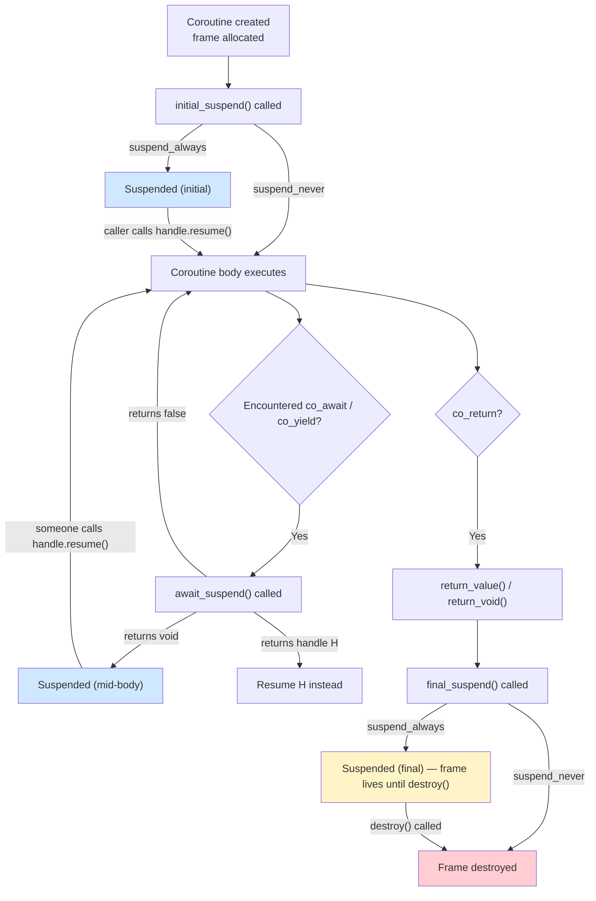
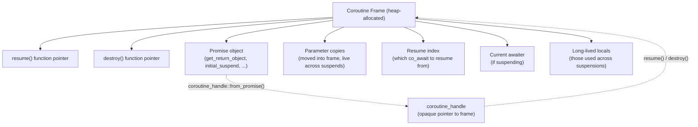

# 1. Coroutines Deep Dive

> [!note] Why this note exists
> C++20 added coroutines to the language, but the standard library shipped almost nothing you can use directly. To actually *use* coroutines you must understand the **promise type**, the **coroutine frame**, the **awaitable** protocol, and the **suspend/resume mechanics** that tie them together. This note is the deep-dive companion to [[14. Concurrency and Multithreading/9. Coroutines (C++20)]] — instead of "how do I use these," it answers "how do these actually work, and how do I build my own task and generator types from scratch?"

## Why It Matters

Three reasons you should care about coroutines at the implementation level:

1. **The standard library is intentionally bare.** C++20 gave us the language keywords (`co_await`, `co_yield`, `co_return`) and the `<coroutine>` header with `coroutine_handle` and `suspend_always` / `suspend_never`. That's it. There is no `std::task<T>`, no `std::async_awaitable`, no `std::generator` (until C++23, see [[20. Advanced C++ Topics/5. C++23 and Beyond]]). To use coroutines in production today, you either pull in a third-party library (`cppcoro`, `coro`, Boost.Asio, Folly) or **write the types yourself**. Writing them yourself requires understanding the machinery.

2. **Subtle bugs await the uninitiated.** Use-after-free of coroutine frames, dangling references to parameters, lifetime issues across suspension points, hangs from suspended-but-never-resumed coroutines — these are the everyday footguns. They come from not understanding how the frame captures state. Once you understand the frame, the bugs become predictable.

3. **Performance is in the customization points.** The default coroutine frame is heap-allocated. The default `await_suspend` returns `void`. The default `initial_suspend` is `suspend_always`. Each of these can be overridden. Knowing where to override is what separates "I wrote a coroutine" from "I wrote a coroutine that survives 1M concurrent operations per second on a trading system."

This note covers: the stackless model, the coroutine frame, the promise type contract, the awaitable protocol, a from-scratch generator, a from-scratch task type, async I/O integration, comparison with stackful coroutines, and the performance levers.

## Background

### What a coroutine actually is

A coroutine is a function that can **suspend** execution and **resume** later, preserving its local state (variables, parameters, the point where it suspended) across the suspension.

A normal function's lifetime is bracketed by call and return: stack frame pushed, body executed, frame popped. A coroutine's lifetime is bracketed by call, suspend/resume cycles, and final destruction: a **coroutine frame** is allocated on the heap (usually), the body executes until suspension, the frame persists, the body resumes later, eventually the frame is destroyed.

The compiler transforms a coroutine body into a **state machine**:

1. Each suspension point (`co_await`, `co_yield`) becomes a state in the machine.
2. Local variables that are live across suspension points become fields of the frame.
3. The frame stores the current state, the promise object, and the saved locals.
4. Resuming = jumping to the saved state.

### Stackful vs stackless (revisited)

| Property | Stackful (Boost.Coroutine, fibers) | Stackless (C++20) |
|----------|------------------------------------|-------------------|
| Each coroutine has its own stack | Yes, typically 64 KB–1 MB | No — only a small frame |
| Can suspend from any function in the call chain | Yes | No — only from the coroutine body |
| Allocation cost | One stack per coroutine | One frame per coroutine (often elided) |
| Suspend cost | Context switch (~µs) | Save pointer + registers (~ns) |
| Memory per coroutine | Tens of KB minimum | Tens of bytes typical |

C++20 chose stackless for two reasons:

1. **Zero-overhead principle.** A suspended coroutine should be as cheap as a small struct on the heap.
2. **Composability with existing code.** Stackless coroutines don't need stack switching, so they integrate cleanly with existing thread pools and I/O reactors.

The cost: you cannot suspend a coroutine from inside a regular function it calls. If `myCoro()` calls `regularFunc()` and `regularFunc()` wants to suspend, it can't — only `myCoro()` can suspend, and only at its own `co_await` points.

### The coroutine frame

When the compiler sees a function containing any of `co_await`, `co_yield`, or `co_return`, it synthesizes a **coroutine frame** containing:

1. **The promise object.** An instance of the promise type (see below). The compiler calls its member functions at well-defined points.
2. **The parameters.** Copies of the coroutine's parameters, moved into the frame so they live across suspensions.
3. **The local variables** that are live across suspension points (others may be optimized away).
4. **The resume index.** An integer indicating which suspension point to resume from.
5. **The "awaiter"** — the currently awaited object, if suspending.
6. **Vtable pointers** for `resume` and `destroy` — these are how `coroutine_handle` invokes the right state machine entry points.

The frame is allocated on the heap by default via `operator new` (sized by the compiler). The compiler may elide this allocation if it can prove the coroutine's lifetime is bounded by the caller's frame. **Halting elision** is the term for this — it's the single biggest performance lever in coroutines.

### The promise type contract

The promise type is determined by the return type of the coroutine: `std::coroutine_traits<R, Args...>::promise_type`. For most cases, `R::promise_type` (a nested typedef) is used.

The promise type must provide:

| Method | Called by the compiler to... |
|--------|------------------------------|
| `get_return_object()` | Construct the value returned to the caller (the future / generator / task). |
| `initial_suspend()` | Decide whether to suspend at start. Returns an awaitable. |
| `final_suspend() noexcept` | Decide whether to suspend at end (needed before destruction). |
| `return_value(v)` / `return_void()` | Handle `co_return v;` or `co_return;`. |
| `yield_value(v)` | Handle `co_yield v;`. Returns an awaitable. |
| `unhandled_exception()` | Handle an exception escaping the coroutine body. |
| `operator new(size_t)` / `operator delete(void*)` (optional) | Customize frame allocation. |

The compiler essentially transforms:

```cpp
task<int> foo() {
    co_return 42;
}
```

into something like:

```cpp
task<int> foo() {
    void* frame = operator new(sizeof(Frame));
    Frame* f = new (frame) Frame{ /* params, promise, resume=0 */ };
    auto promise = &f->promise;
    auto returnObject = promise->get_return_object();
    promise->initial_suspend().await_suspend(coroutine_handle::from_promise(*promise));
    // ... coroutine body, jumping to/from resume points ...
    // On co_return v:  promise->return_value(v);  promise->final_suspend()...
    // On exception:     promise->unhandled_exception();  promise->final_suspend()...
    return returnObject;
}
```

(Details vary; this is the gist.)

### The awaitable protocol

An **awaitable** is anything you can `co_await`. It can be a type with the three await methods, or an object whose `operator co_await` returns such a type.

The three methods:

| Method | Returns | Called to... |
|--------|---------|--------------|
| `await_ready()` | `bool` | `true` = don't suspend, just call `await_resume`. |
| `await_suspend(handle)` | `void` / `bool` / `coroutine_handle` | Perform the suspension. See below. |
| `await_resume()` | `T` | Produce the value the `co_await` expression yields. |

`await_suspend`'s return type controls what happens:

- `void` — suspend the current coroutine; control returns to the caller/resumer.
- `bool` — `true` suspends; `false` resumes immediately (without yielding to caller).
- `coroutine_handle` — suspend and transfer control to that coroutine (asymmetric coroutine handoff).

Example: `std::suspend_always` is the simplest awaitable.

```cpp
struct suspend_always {
    bool await_ready() const noexcept { return false; }
    void await_suspend(coroutine_handle<>) const noexcept {}
    void await_resume() const noexcept {}
};
```

`std::suspend_never` is the same but `await_ready` returns `true` (don't actually suspend).

### The three keywords, revisited

| Keyword | Compiler action |
|---------|----------------|
| `co_await expr` | Obtain an awaitable from `expr`, call `await_ready`. If `false`, call `await_suspend` with the current handle; suspend; on resume, call `await_resume` and use its return as the value of the expression. |
| `co_yield expr` | Shorthand for `co_await promise.yield_value(expr)`. |
| `co_return [expr]` | Calls `promise.return_value(expr)` or `promise.return_void()`, then runs `co_await promise.final_suspend()`. |

## Main Content

### Implementing a generator

The simplest useful coroutine: a function that produces a stream of values. Here's a minimal but real generator.

```cpp
#include <coroutine>
#include <utility>
#include <exception>
#include <iterator>

template <class T>
class Generator {
public:
    struct promise_type {
        T current_value;

        Generator get_return_object() {
            return Generator{coroutine_handle::from_promise(*this)};
        }
        std::suspend_always initial_suspend() noexcept { return {}; }
        std::suspend_always final_suspend() noexcept { return {}; }
        std::suspend_always yield_value(T value) {
            current_value = std::move(value);
            return {};
        }
        void return_void() {}
        void unhandled_exception() { std::terminate(); }
    };

    using coroutine_handle = std::coroutine_handle<promise_type>;

    Generator(coroutine_handle h) : handle_(h) {}
    Generator(Generator&& other) noexcept : handle_(std::exchange(other.handle_, {})) {}
    Generator& operator=(Generator&& other) noexcept {
        if (this != &other) {
            if (handle_) handle_.destroy();
            handle_ = std::exchange(other.handle_, {});
        }
        return *this;
    }
    ~Generator() { if (handle_) handle_.destroy(); }
    Generator(const Generator&) = delete;
    Generator& operator=(const Generator&) = delete;

    // Iterator interface for range-for
    struct iterator {
        coroutine_handle handle;
        using value_type = T;
        using reference = T&;
        using pointer = T*;
        using difference_type = std::ptrdiff_t;
        using iterator_category = std::input_iterator_tag;

        iterator& operator++() {
            handle.resume();
            if (handle.done()) handle = nullptr;
            return *this;
        }
        void operator++(int) { ++(*this); }
        reference operator*() const { return handle.promise().current_value; }
        pointer operator->() const { return &handle.promise().current_value; }
        bool operator==(std::default_sentinel_t) const { return !handle || handle.done(); }
        bool operator==(const iterator& other) const { return handle == other.handle; }
    };

    iterator begin() {
        if (handle_) {
            handle_.resume();
            if (handle_.done()) return iterator{nullptr};
        }
        return iterator{handle_};
    }
    std::default_sentinel_t end() { return {}; }

private:
    coroutine_handle handle_;
};

// --- Usage ---
Generator<int> counter(int start, int end) {
    for (int i = start; i < end; ++i) {
        co_yield i;
    }
}

int main() {
    for (int x : counter(0, 5)) {
        // x = 0, 1, 2, 3, 4
    }
}
```

Key points:

- `initial_suspend` returns `suspend_always` so the coroutine doesn't run until `begin()` resumes it.
- `yield_value` stores the value and suspends.
- `final_suspend` returns `suspend_always` so the frame is not destroyed automatically — the `Generator` destructor does it via `handle_.destroy()`.
- `get_return_object` constructs the `Generator` from the handle. The handle is the caller's only way to interact with the frame.
- The move constructor/assignment transfer ownership of the handle; the destructor destroys the frame.

This `Generator<T>` is essentially what C++23's `std::generator` provides.

### Implementing a task type

A `task<T>` is a coroutine that does some work (possibly awaiting other tasks) and produces a final value. Unlike a generator, it produces one value via `co_return`, not a stream via `co_yield`.

```cpp
#include <coroutine>
#include <utility>
#include <exception>
#include <variant>
#include <stdexcept>

template <class T>
class Task {
public:
    struct promise_type {
        std::variant<std::monostate, T, std::exception_ptr> result;

        Task get_return_object() {
            return Task{coroutine_handle::from_promise(*this)};
        }
        std::suspend_always initial_suspend() noexcept { return {}; }
        std::suspend_always final_suspend() noexcept { return {}; }

        void return_value(T v) { result.template emplace<1>(std::move(v)); }
        void unhandled_exception() { result.template emplace<2>(std::current_exception()); }

        // Make Task<T> awaitable: co_await anotherTask
        // (the awaitable protocol below in Task's await_transform or operator co_await)
    };

    using coroutine_handle = std::coroutine_handle<promise_type>;

    Task(coroutine_handle h) : handle_(h) {}
    Task(Task&& other) noexcept : handle_(std::exchange(other.handle_, {})) {}
    Task& operator=(Task&& other) noexcept {
        if (this != &other) {
            if (handle_) handle_.destroy();
            handle_ = std::exchange(other.handle_, {});
        }
        return *this;
    }
    ~Task() { if (handle_) handle_.destroy(); }
    Task(const Task&) = delete;
    Task& operator=(const Task&) = delete;

    // Make Task<T> awaitable
    bool await_ready() const noexcept { return false; }
    void await_suspend(coroutine_handle<> caller) noexcept {
        // Caller is the coroutine that's awaiting us. We need to resume
        // the caller when we're done. Store caller, then resume ourselves.
        caller_ = caller;
        handle_.resume();
    }
    T await_resume() {
        if (result().index() == 2) {
            std::rethrow_exception(std::get<2>(result()));
        }
        return std::move(std::get<1>(result()));
    }

    void resume() { handle_.resume(); }
    bool done() const { return handle_.done(); }

    // Run to completion (synchronous, top-level entry)
    T sync_wait() {
        handle_.resume();
        if (result().index() == 2) {
            std::rethrow_exception(std::get<2>(result()));
        }
        return std::move(std::get<1>(result()));
    }

private:
    auto& result() { return handle_.promise().result; }
    coroutine_handle handle_;
    coroutine_handle<> caller_ = nullptr;
    // Note: real implementation propagates caller through final_suspend
};

// --- Usage ---
Task<int> compute() {
    co_return 42;
}

Task<int> chained() {
    int a = co_await compute();   // await another task
    co_return a + 1;
}

int main() {
    int result = chained().sync_wait();   // 43
}
```

This is a simplified version. A production task type needs to handle the "caller resume" through `final_suspend` — when a task finishes, it must resume whoever was awaiting it. The cleanest way is to store the caller in the promise and have `final_suspend`'s awaitable call `caller.resume()`.

### Coroutine state machine diagram



### Coroutine frame layout



### Asynchronous I/O with coroutines

The killer app for coroutines: making async I/O look sequential. A typical pattern:

```cpp
// A "socket" type whose async_read is a Task
Task<Bytes> async_read(Socket& s, size_t n);

Task<void> handle_connection(Socket s) {
    while (true) {
        Bytes data = co_await s.async_read(1024);
        if (data.empty()) break;
        co_await s.async_write(process(data));
    }
}
```

The compiler transforms this into a state machine that suspends on each `co_await`, freeing the thread to serve other connections. When the I/O completes (via epoll/io_uring), the reactor resumes the coroutine.

The key ingredients:

1. **A reactor** (epoll on Linux, kqueue on BSD, IOCP on Windows, io_uring on modern Linux) — registers I/O operations and notifies when they complete.
2. **A thread pool** — worker threads that pick up completed I/O events and resume the corresponding coroutine.
3. **Awaitables for I/O** — types wrapping a socket + buffer that, when `co_await`ed, register with the reactor and suspend.

Libraries that provide this:

- **Boost.Asio** — the most mature. `co_spawn(io_context, myCoro(), detached)` runs a coroutine on Asio's reactor.
- **cppcoro** — clean, modern, but maintenance is slow.
- **coro** (jbaldwin/libcoro) — modern, actively maintained.
- **folly::coro** — Facebook's production-quality coroutines.

The standard library does not provide this yet. The C++26 `std::execution` proposal (P2300) may.

### Comparison with stackful coroutines

Stackful coroutines (Boost.Coroutine, Boost.Fiber, POSIX `ucontext`, Windows fibers) have their own stack and can suspend from anywhere:

```cpp
// Stackful: a deeply-nested function can suspend
void deep(StackfulCoro& c) {
    c.suspend();   // OK — the entire chain suspends
}
void middle(StackfulCoro& c) { deep(c); }
void top(StackfulCoro& c) { middle(c); }
```

C++20 stackless coroutines cannot:

```cpp
// Stackless: only the coroutine body itself can suspend
Task<void> top() {
    middle();   // if middle() calls co_await, that's a coroutine; OK
                // but if middle() is a regular function that wants to suspend, it can't
}
```

Trade-offs:

| Property | Stackful | Stackless (C++20) |
|----------|----------|-------------------|
| Memory per coroutine | 64 KB – 1 MB | 50–200 bytes |
| Suspend cost | Context switch (~µs) | Save pointer + registers (~ns) |
| Can suspend from anywhere | Yes | No |
| Integration with existing code | Easier (looks like a thread) | Harder (requires awaitable-aware libraries) |
| Maximum concurrent coroutines | Thousands | Millions |

For most modern async I/O workloads (web servers, proxies, gateways), stackless wins on memory and throughput. For legacy code that needs to "suspend from inside this function," stackful may be necessary.

### Performance considerations

1. **Heap allocation elision (HALO).** The compiler may elide the heap allocation if it can prove the coroutine's lifetime is bounded. To help:
   - Make the coroutine's lifetime obviously nested in the caller's.
   - Avoid storing the `coroutine_handle` somewhere the compiler can't trace.
   - Don't pass the handle to functions the compiler can't inline.
2. **Custom `operator new`.** For high-throughput code, override the promise's `operator new` to allocate from an arena (see [[19. Performance Optimization/4. Memory Pool and Arena Allocators]]). This can eliminate the heap allocation entirely.
3. **Avoiding `std::function` and `shared_ptr` in awaitables.** Every indirection is a cache miss in the hot path.
4. **`initial_suspend` choice.** `suspend_always` is the default for lazy evaluation. `suspend_never` makes the coroutine start immediately (rare).
5. **`final_suspend` must `suspend_always`.** Otherwise the frame is destroyed before the caller can read the result via the promise. The pattern: `final_suspend` returns an awaitable whose `await_suspend` resumes the *caller* and then suspends *this* coroutine (so the caller can destroy it).
6. **Symmetric transfer.** When one coroutine resumes another and itself ends, use `co_await` with a `coroutine_handle` return type to transfer control directly (no stack growth, no return-to-caller). This avoids stack overflow in deeply-nested coroutines.
7. **Watch for `co_await` in loops.** Each `co_await` may suspend; if your loop body has 10 `co_await`s and runs 1000 iterations, that's 10,000 potential suspensions. Sometimes batching is better.

### Common mistakes at the implementation level

- **Storing references to parameters.** Parameters are copied into the frame; if you take a reference, you get a reference to a copy. Use by-value or by-const-reference (and don't let it dangle).
- **Forgetting `final_suspend` must `suspend_always`.** The frame must survive until the caller reads the result.
- **Not handling `unhandled_exception`.** Default behavior is `std::terminate`. Always store `std::current_exception()` and rethrow in `await_resume`.
- **Leaking frames.** A suspended coroutine whose handle is never destroyed or resumed leaks. RAII handle wrappers fix this.
- **Using `co_await` on a non-awaitable.** The compiler error is famously cryptic. Wrap your type with `operator co_await` or implement the three await methods.
- **Calling `resume()` on a finished coroutine.** Undefined behavior. Always check `done()` first.
- **Destroying a not-yet-suspended coroutine.** Also UB. The frame must be in a suspended state.

## Code Examples

### A simple timer awaitable

```cpp
#include <coroutine>
#include <chrono>

struct TimerAwaitable {
    std::chrono::milliseconds duration;

    bool await_ready() const noexcept { return duration.count() <= 0; }

    void await_suspend(std::coroutine_handle<> h) const {
        // In real code: register with a timer wheel / event loop
        // Here: just demonstrate the shape
        std::thread([h, d = duration]() {
            std::this_thread::sleep_for(d);
            h.resume();   // resume the awaiting coroutine on this thread
        }).detach();
    }

    void await_resume() const noexcept {}
};

TimerAwaitable sleep_for(std::chrono::milliseconds d) {
    return TimerAwaitable{d};
}

Task<int> delayed_value() {
    co_await sleep_for(std::chrono::milliseconds(100));
    co_return 42;
}
```

### A from-scratch task with proper caller resumption

```cpp
template <class T>
class ProperTask {
public:
    struct promise_type {
        T value{};
        std::exception_ptr exception{};
        std::coroutine_handle<> caller{};

        ProperTask get_return_object() {
            return ProperTask{coroutine_handle::from_promise(*this)};
        }
        std::suspend_always initial_suspend() noexcept { return {}; }

        // final_suspend: resume the caller, then keep this suspended
        // (so the frame lives until the caller destroys it).
        struct final_awaiter {
            bool await_ready() noexcept { return false; }
            std::coroutine_handle<> await_suspend(coroutine_handle<promise_type> h) noexcept {
                auto caller = h.promise().caller;
                if (caller) return caller;   // symmetric transfer to caller
                return std::noop_coroutine(); // no caller — yield to the resumer
            }
            void await_resume() noexcept {}
        };
        final_awaiter final_suspend() noexcept { return {}; }

        void return_value(T v) { value = std::move(v); }
        void unhandled_exception() { exception = std::current_exception(); }
    };

    using coroutine_handle = std::coroutine_handle<promise_type>;

    ProperTask(coroutine_handle h) : handle_(h) {}
    ProperTask(ProperTask&& o) noexcept : handle_(std::exchange(o.handle_, {})) {}
    ProperTask& operator=(ProperTask&&) = delete;
    ProperTask(const ProperTask&) = delete;
    ProperTask& operator=(const ProperTask&) = delete;
    ~ProperTask() { if (handle_) handle_.destroy(); }

    bool await_ready() const noexcept { return false; }
    std::coroutine_handle<> await_suspend(coroutine_handle<> caller) noexcept {
        handle_.promise().caller = caller;
        return handle_;   // symmetric transfer to this task
    }
    T await_resume() {
        if (handle_.promise().exception) {
            std::rethrow_exception(handle_.promise().exception);
        }
        return std::move(handle_.promise().value);
    }

    T sync_wait() {
        while (!handle_.done()) handle_.resume();
        if (handle_.promise().exception) {
            std::rethrow_exception(handle_.promise().exception);
        }
        return std::move(handle_.promise().value);
    }

private:
    coroutine_handle handle_;
};
```

The symmetric-transfer pattern (`return handle_;` in `await_suspend`) avoids growing the call stack as you chain `co_await`s — each transfer is a tail call, not a nested call.

### Customizing `operator new` for the promise

```cpp
struct PoolPromise {
    static thread_local std::pmr::unsynchronized_pool_resource pool;

    void* operator new(std::size_t size) {
        return pool.allocate(size, alignof(std::max_align_t));
    }
    void operator delete(void* p, std::size_t size) {
        pool.deallocate(p, size, alignof(std::max_align_t));
    }

    // ... rest of promise_type interface ...
};
```

This routes coroutine frame allocation through a pool, eliminating heap contention under high concurrency.

## Common Pitfalls

> [!danger] Pitfall 1 — References to parameters after suspension
> A coroutine parameter is copied into the frame. If you take `const std::string&` and the caller passes a temporary, the temporary is destroyed after the call — but the coroutine's reference is to the *copy in the frame*, which is fine. The bug is when you store a pointer/reference to something outside the frame (e.g., the caller's locals) and suspend.

> [!danger] Pitfall 2 — `final_suspend` returns `suspend_never`
> The frame is destroyed before the caller can read the promise. Always return `suspend_always` (or an awaitable that suspends) from `final_suspend`.

> [!danger] Pitfall 3 — Forgetting symmetric transfer
> Naive `co_await` chains can grow the call stack linearly. Use `return coroutine_handle` from `await_suspend` to transfer instead of resume.

> [!danger] Pitfall 4 — Calling `resume()` on a finished coroutine
> UB. Always check `done()` first, or use a wrapper that tracks state.

> [!danger] Pitfall 5 — Heap allocation in hot paths
> The default `operator new` may dominate the cost of a coroutine. Override it for performance-critical code.

> [!danger] Pitfall 6 — Treating coroutines as threads
> Coroutines don't run on their own thread — they run on whatever thread calls `resume()`. If you `co_await` something that never calls `resume()`, you hang forever.

> [!danger] Pitfall 7 — Lifetime of the `coroutine_handle`
> A `coroutine_handle` is a non-owning pointer. If the `Task`/`Generator` is destroyed, the handle dangles. Use RAII wrappers consistently.

> [!danger] Pitfall 8 — Exceptions thrown across threads
> If `await_resume` rethrows an exception captured by `unhandled_exception`, it throws on whatever thread called `resume()`, not the original. Plan for this in error handling.

> [!danger] Pitfall 9 — `co_await` in destructors
> Destructors can't be coroutines. If your cleanup needs to suspend, you have to design around it (e.g., a separate `close()` method that's a coroutine).

> [!danger] Pitfall 10 — Mixing coroutines with `std::async` / `std::future`
> `std::future` has its own threading model. Mixing the two without care leads to deadlocks. C++23 integrated `std::future` with coroutines; before that, use library-specific awaitables.

## Tips and Tricks

- **Start with a library** (`coro`, `cppcoro`, Boost.Asio). Don't write your own `task` type until you understand them by reading.
- **Use symmetric transfer** (`return coroutine_handle` from `await_suspend`) to avoid stack growth in deep `co_await` chains.
- **Override `operator new` in the promise** for hot-path coroutines. Arena allocation can be 100× faster than the heap.
- **Always `suspend_always` in `final_suspend`.** It's a correctness requirement, not an optimization.
- **Store `std::exception_ptr` in the promise** and rethrow in `await_resume`. Never `std::terminate` from `unhandled_exception` in library code.
- **Prefer `co_yield` over manual `co_await` for generators.** The compiler translates it correctly.
- **Wrap `coroutine_handle` in RAII** always. `unique_handle` calling `destroy()` in its destructor prevents leaks.
- **Use `noop_coroutine()`** when you want to return a coroutine_handle that does nothing (e.g., from `final_suspend` when there's no caller).
- **Profile coroutine overhead.** `perf` will show `operator new` and `coroutine_handle::resume` as hotspots if you're creating millions of short-lived coroutines.
- **C++23 `std::generator`** is ready to use — prefer it over a hand-rolled generator. See [[20. Advanced C++ Topics/5. C++23 and Beyond]].
- **Watch for the C++26 `std::execution`** proposal. It may become the recommended way to express structured concurrency, replacing much of what coroutines are used for today.
- **Use Asio's `awaitable` type** for production async I/O. It's battle-tested and integrates with `co_spawn`.
- **Keep coroutines small and composable.** A 1000-line coroutine is harder to debug than 10 small ones composed with `co_await`.
- **Beware `co_await` in `for` loops** with millions of iterations — each one may suspend and resume, adding overhead.

## Active Recall

1. What is the difference between a stackful and a stackless coroutine? Which one does C++20 provide?
2. What is a "coroutine frame"? What does it contain?
3. List the seven methods a promise type typically provides.
4. Explain the three methods of the awaitable protocol. What does each do?
5. What are the three possible return types of `await_suspend`, and what does each mean?
6. Why must `final_suspend()` return `suspend_always` (or equivalent)?
7. What is "symmetric transfer," and why is it important?
8. What is HALO (Heap Allocation eLision Optimization), and how do you help the compiler do it?
9. Implement a minimal `Generator<int>` that yields the integers 0..N.
10. Implement a minimal `Task<int>` with proper caller resumption via `final_suspend`.
11. How would you customize coroutine frame allocation?
12. Why can't a coroutine be a destructor? How do you handle async cleanup?
13. List three libraries that provide ready-to-use task types for async I/O.
14. What is `std::noop_coroutine()` and when do you use it?

## Next Steps

- Read [[14. Concurrency and Multithreading/9. Coroutines (C++20)]] — the user-level companion to this note.
- Read [[14. Concurrency and Multithreading/5. Futures, Promises, Async]] — futures integrate with coroutines in C++23.
- Read [[14. Concurrency and Multithreading/7. Thread Pools]] — coroutines run on pool worker threads; understanding pools is essential.
- Read [[17. Networking/5. Non-blocking I-O and epoll]] — coroutines need a reactor; epoll is the Linux standard.
- Read [[17. Networking/6. Boost.Asio Overview]] — Asio's `awaitable` is the production-ready way to use coroutines for I/O.
- Read [[19. Performance Optimization/4. Memory Pool and Arena Allocators]] — for customizing coroutine frame allocation.
- Read [[20. Advanced C++ Topics/5. C++23 and Beyond]] — `std::generator` is now standard; `std::execution` is coming.
- Read Lewis Baker's blog series on C++ coroutines for the canonical reference. (He wrote cppcoro and is the de facto authority.)
- Read the P2300 (std::execution) proposal for where structured concurrency is heading.
- Read the Boost.Asio C++20 coroutine tutorial for production patterns.
