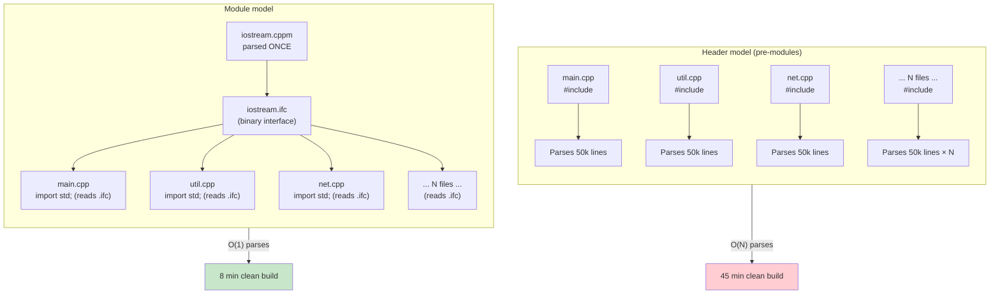
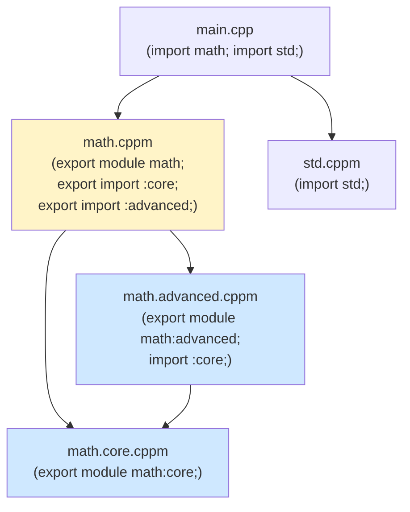

# 2. Modules

> [!note] Why this note exists
> C++ inherited `#include` from C in 1985, and it has been the single biggest source of slow builds, ODR violations, and tooling pain ever since. C++20 finally added **modules** — a real, language-level replacement for headers that compiles once, exports an interface, and imports in milliseconds. This note covers why the preprocessor model is broken, the module syntax, partitions, header units, the global module fragment, CMake integration, and a migration strategy for existing codebases.

## Why It Matters

A typical C++ project's build time looks like this: 10,000 source files each include `<iostream>` (≈50,000 lines of headers after expansion), `<vector>` (≈30,000 lines), `<boost/asio.hpp>` (≈500,000 lines), and a dozen project headers. Each translation unit re-parses, re-instantiates templates, and re-checks the same headers. The compiler does the same work 10,000 times.

Real numbers from a mid-size project:

- Pre-modules: clean build takes 45 minutes. Incremental build (one .cpp change) takes 90 seconds.
- Post-modules: clean build takes 8 minutes. Incremental build takes 12 seconds.

A 5× clean-build speedup and a 7× incremental speedup, just by switching to modules. The bigger the project, the bigger the win.

Beyond speed, modules fix:

1. **ODR (One-Definition Rule) violations.** Headers define inline functions and templates; if you compile with different flags in different TUs, you can get ODR violations — undefined behavior. Modules export a single, immutable definition.
2. **Macro leakage.** `#define` in one header affects everything after it. Modules don't export macros (by default), so they don't pollute.
3. **Order dependence.** `#include <a>` before `#include <b>` may compile, while the reverse may not. Modules are order-independent.
4. **Tooling.** Headers are text-substitution; IDEs, refactoring tools, and analyzers must re-parse them in every context. Modules have a stable, binary interface that tools can read directly.

If you're starting a new project today, you should use modules. If you have an existing project, you should plan a migration.

## Background

### The preprocessor problem

`#include` is **text substitution**. The preprocessor literally copy-pastes the contents of the included file into the source. This has several consequences:

1. **N² expansion.** A header included by N source files is parsed N times. With nested includes, this multiplies. The classic example: including `<windows.h>` in 1000 files re-parses 100 MB of declarations 1000 times.

2. **Macro pollution.** A header's `#define` lives from the include point until `#undef` or end-of-file. If `<windows.h>` defines `min` and `max` as macros (it does), then `std::min(a, b)` in a *later* header breaks. Workarounds (`NOMINMAX`) exist; the underlying problem is that the preprocessor doesn't respect scope.

3. **Order dependence.** Headers may rely on earlier headers for definitions, or may break if earlier headers `#define`d something. Build orders become fragile.

4. **No type information.** A header is a sequence of declarations; the compiler re-parses it each time. There's no compiled, binary representation of "the interface of module M."

5. **Include guards / `#pragma once`.** Headers must protect themselves from being included multiple times in the same TU. This requires the preprocessor to track macros and is fragile across symlinks, network filesystems, and case-insensitive systems.

6. **ODR violations.** A template defined inline in a header must produce the same instantiation in every TU. If TUs are compiled with different flags (e.g., `-DNDEBUG` in some but not others), the instantiations may differ — undefined behavior.

The preprocessor was designed in 1972 for a 1970s world of small programs and slow disks. C++ has outgrown it.

### What modules do differently

A **module** is a named language entity with a **compiled interface** (a binary file, often `.gcm` or `.pcm` or `.ifc` depending on the compiler). When you `import` a module:

1. The compiler reads the pre-compiled interface (fast — milliseconds, not seconds).
2. The module's exported declarations become visible.
3. Macros defined in the module are **not** visible (by default).
4. The implementation behind the interface is linked in (or part of the module's compiled body).

The interface is parsed once — when the module is compiled. Importing it is cheap. Templates are instantiated once per use, but the interface (which templates exist, their constraints, etc.) is parsed once.

### Module interface vs implementation

A module has:

- An **interface unit** — declares what's exported. File suffix conventionally `.cppm`, `.ixx`, or `.mpp` depending on toolchain. Begins with `export module M;`.
- An **implementation unit** — `module M;`, can see the interface but doesn't export.
- A **module partition** — a sub-unit of a module, can be imported by other parts of the same module.
- A **header unit** — a synthesized module from a traditional header (`import <vector>;`).

A single file can be both interface and implementation (most common pattern), or they can be split.

## Main Content

### Basic module syntax

```cpp
// math.cppm — module interface unit
export module math;

export int add(int a, int b) {
    return a + b;
}

export double square(double x) {
    return x * x;
}

// Not exported — only visible inside the module
int helper(int x) { return x * 2; }
```

```cpp
// main.cpp — consumer
import math;
#include <iostream>

int main() {
    std::cout << add(2, 3) << '\n';     // OK — add is exported
    std::cout << square(2.5) << '\n';   // OK — square is exported
    // helper(5);                       // Error — helper not exported
}
```

The `export` keyword marks declarations visible to importers. Anything in the module file without `export` is internal to the module.

### Import declarations

```cpp
import math;          // import the math module
import std;           // import the standard library module (C++23)
import <vector>;      // import a header unit (synthesized from <vector>)
import "myheader.h";  // import a header unit from a local header
```

Imports must appear at the top of the file (after the global module fragment, before declarations). They are order-independent.

### Module partitions

Large modules can be split into **partitions** — each is a separate file but logically part of the same module. Other partitions in the same module can import them; consumers see only the module's exported interface.

```cpp
// math.core.cppm
export module math:core;

export int add(int a, int b) { return a + b; }
export int sub(int a, int b) { return a - b; }
```

```cpp
// math.advanced.cppm
export module math:advanced;

import :core;   // import another partition of the same module

export int mul(int a, int b) {
    // Can use add/sub from the core partition
    return a * b;
}
```

```cpp
// math.cppm — primary module interface
export module math;

export import :core;        // re-export core's symbols
export import :advanced;    // re-export advanced's symbols
```

```cpp
// main.cpp
import math;   // sees add, sub, mul
```

Partitions let you split a large module across files without exposing the partition structure to consumers.

### Header units

A **header unit** is a module synthesized from a traditional header. It's a migration stepping stone — you can keep your headers but get the "parse once" benefit by importing them instead of `#include`-ing them.

```cpp
// Before:
#include <vector>
#include <algorithm>

// After:
import <vector>;
import <algorithm>;
```

The compiler parses `<vector>` once into a binary interface file. Subsequent `import <vector>` reads the binary, which is much faster.

Caveats:

- Header units preserve the header's macros (unlike regular modules, which don't). This is intentional — many headers rely on configuration macros.
- Header units work for system headers (`<vector>`) and local headers (`"myheader.h"`).
- Standard library header units are part of C++23 (`import std.compat;` imports all of `<vector>`, `<string>`, etc. as a unit).

### Global module fragment

A module file can have a "global module fragment" before the `export module` declaration. This is where you `#include` headers that the module depends on. The fragment is parsed but not exported.

```cpp
// mymodule.cppm
module;                    // start of global module fragment
#include <vector>
#include <string>
#include "third_party.h"   // a header you can't convert to a module

export module mymodule;    // end of global module fragment, start of module

export class Widget {
    std::vector<int> data_;   // OK — vector was included in the fragment
    std::string name_;
};

export void doStuff();
```

The global module fragment exists for practical migration: you can write a module that uses traditional headers without converting them all first. The downside: the fragment is re-parsed for each module that includes the same headers, so it doesn't give the full modules speedup.

Best practice: keep the global module fragment as small as possible. Move headers into `import` (header units) or convert them to modules when you can.

### The `std` and `std.compat` modules (C++23)

C++23 standardized two library modules:

- `import std;` — exports the entire C++ standard library (containers, algorithms, I/O, etc.). No macros.
- `import std.compat;` — exports the C++ standard library PLUS the C headers (`<cstdio>`, `<cstdlib>`, etc.) and their macros.

```cpp
import std;

int main() {
    std::vector<int> v{1, 2, 3};
    std::ranges::sort(v);
    std::println("{}", v);   // C++23
}
```

No `#include` at all. Compiles fast. No macro leakage. This is the future.

### Build system support

Modules break the traditional build model. With headers, each TU is independent — compile in any order. With modules, there's a dependency: if A imports B, B's interface must be compiled before A.

CMake (3.28+) has first-class modules support. Older CMake requires manual `CMAKE_EXPERIMENTAL` flags or a custom scanner.

```cmake
cmake_minimum_required(VERSION 3.28)
project(modules_demo CXX)

set(CMAKE_CXX_STANDARD 23)
set(CMAKE_CXX_STANDARD_REQUIRED ON)
set(CMAKE_CXX_SCAN_FOR_MODULES ON)

add_executable(app main.cpp)
target_sources(app
    PUBLIC
    FILE_SET CXX_MODULES FILES
        math.cppm
        math.core.cppm
        math.advanced.cppm
)
```

`FILE_SET CXX_MODULES` tells CMake these are module interface files. CMake scans them for module dependencies, builds a dependency graph, and compiles in the right order.

Other build systems:

- **Ninja** has built-in modules support since 1.11.
- **Bazel** has experimental modules support.
- **Meson** has modules support.
- **MSBuild** (Visual Studio) has first-class support.

Manual `make`-based builds need a scanner step (e.g., `g++ -fmodules-ts -x c++ -E math.cppm` produces module dependency info) before compilation.

### Migration strategy

A real-world migration plan:

1. **Start with `import std;` (or `import <vector>;` etc. on older compilers).** This is the easiest win — convert your standard library includes to imports. Big speedup, no code changes.

2. **Convert leaf modules first.** A leaf module is one that doesn't depend on other project modules. Convert these to modules, exposing their interfaces.

3. **Move up the dependency tree.** Once a layer is converted, the next layer can `import` them.

4. **Use the global module fragment for unconverted dependencies.** You can convert a header to a module even if it still `#include`s other headers — they go in the global module fragment.

5. **Use header units for third-party libraries you don't control.** `import <boost/asio.hpp>;` parses once and reuses the binary.

6. **Don't try to do it all at once.** A big-bang migration will break your build for weeks. Incremental migration is feasible because modules and headers interoperate.

7. **Test on multiple compilers.** Module support varies; GCC, Clang, and MSVC all have minor differences in what they accept. CI on all three is essential.

8. **Invest in your build system.** CMake 3.28+ or Ninja with module scanning. Older build systems will fight you.

### Headers vs modules build time diagram



### Module dependency graph



## Code Examples

### A complete module with interface and implementation split

```cpp
// widget.cppm — interface
export module widget;

import std;

namespace ui {

export class Widget {
public:
    Widget(std::string name);
    ~Widget();

    void draw() const;
    const std::string& name() const noexcept;

private:
    class Impl;
    std::unique_ptr<Impl> impl_;
};

}  // namespace ui
```

```cpp
// widget.cpp — implementation
module widget;

import std;

namespace ui {

class Widget::Impl {
public:
    std::string name;
    int x = 0, y = 0;
};

Widget::Widget(std::string name)
    : impl_(std::make_unique<Impl>()) {
    impl_->name = std::move(name);
}

Widget::~Widget() = default;

void Widget::draw() const {
    std::println("Drawing widget '{}' at ({}, {})",
                 impl_->name, impl_->x, impl_->y);
}

const std::string& Widget::name() const noexcept {
    return impl_->name;
}

}  // namespace ui
```

```cpp
// main.cpp
import widget;
import std;

int main() {
    ui::Widget w{"Hello"};
    w.draw();
    std::println("Name: {}", w.name());
}
```

The pimpl pattern (`Impl` declared in the implementation unit, not the interface) keeps the interface clean and stable. The implementation can change without recompiling consumers.

### A module with templates

```cpp
// container.cppm
export module container;

import std;

export template <class T, class Alloc = std::allocator<T>>
class RingBuffer {
public:
    explicit RingBuffer(size_t capacity)
        : data_(capacity), capacity_(capacity) {}

    void push(T value) {
        data_[head_] = std::move(value);
        head_ = (head_ + 1) % capacity_;
        if (size_ < capacity_) ++size_;
    }

    std::optional<T> pop() {
        if (size_ == 0) return std::nullopt;
        T value = std::move(data_[tail_]);
        tail_ = (tail_ + 1) % capacity_;
        --size_;
        return value;
    }

    size_t size() const noexcept { return size_; }

private:
    std::vector<T, Alloc> data_;
    size_t head_ = 0;
    size_t tail_ = 0;
    size_t size_ = 0;
    size_t capacity_;
};
```

Templates in modules are still templates — they get instantiated per-use. But the interface is parsed once, so importing the module is fast even if it has many templates.

### Partitions in a real module

```cpp
// net.core.cppm
export module net:core;

import std;

export class Endpoint {
public:
    Endpoint(std::string host, uint16_t port)
        : host_(std::move(host)), port_(port) {}
    const std::string& host() const noexcept { return host_; }
    uint16_t port() const noexcept { return port_; }
private:
    std::string host_;
    uint16_t port_;
};
```

```cpp
// net.tcp.cppm
export module net:tcp;

import :core;
import std;

export class TcpSocket {
public:
    explicit TcpSocket(Endpoint ep) : endpoint_(std::move(ep)) {}
    void connect() { /* ... */ }
    void send(std::span<const std::byte> data) { (void)data; }
private:
    Endpoint endpoint_;
};
```

```cpp
// net.cppm — primary interface
export module net;

export import :core;
export import :tcp;
```

```cpp
// main.cpp
import net;

int main() {
    Endpoint ep{"example.com", 443};
    TcpSocket sock{ep};
    sock.connect();
}
```

### CMake with modules

```cmake
cmake_minimum_required(VERSION 3.28)
project(netlib CXX)

set(CMAKE_CXX_STANDARD 23)
set(CMAKE_CXX_STANDARD_REQUIRED ON)
set(CMAKE_CXX_EXTENSIONS OFF)

add_library(netlib STATIC)
target_sources(netlib
    PUBLIC
    FILE_SET CXX_MODULES FILES
        net.core.cppm
        net.tcp.cppm
        net.cppm
)

add_executable(server main.cpp)
target_link_libraries(server PRIVATE netlib)
```

CMake scans the `.cppm` files, builds the dependency graph (net.cppm imports :core and :tcp), and compiles them in the right order.

## Common Pitfalls

> [!danger] Pitfall 1 — Putting `#include` after `import`
> Order matters: the global module fragment (with `#include`s) must come *before* `export module`. Imports come *after* `export module`. Wrong order = compile error.

> [!danger] Pitfall 2 — Forgetting `export` on declarations
> Anything not marked `export` in a module interface is internal. Forgetting `export` on a class or function makes it invisible to importers.

> [!danger] Pitfall 3 — Trying to `import` from a non-module TU without enabling modules
> Compilers need `-fmodules-ts` (GCC/Clang) or `/experimental:module` (MSVC, pre-VS 17.6) flags. Modern compilers default to modules in C++20 mode, but older ones need the flag.

> [!danger] Pitfall 4 — Using build systems that don't understand module dependencies
> Make-based builds without module scanning will fail. Use CMake 3.28+, Ninja 1.11+, or another modules-aware build system.

> [!danger] Pitfall 5 — Expecting macros to be exported
> Modules don't export macros (except header units). If you need configuration macros, define them in the consumer, or use `inline constexpr` variables instead.

> [!danger] Pitfall 6 — Mixing `import` and `#include` for the same header
> `#include <vector>` and `import <vector>;` in the same TU can cause ODR issues. Pick one.

> [!danger] Pitfall 7 — Not handling cyclic dependencies
> Modules are acyclic. If A imports B and B imports A, the compiler will reject it. Refactor to break the cycle (often with partitions or by extracting common code).

> [!danger] Pitfall 8 — Pre-compiled module files and ABI mismatches
> Module interface files (`.gcm`, `.pcm`, `.ifc`) are compiler-specific and even flag-specific. If you rebuild with different flags, you must recompile all module interfaces.

> [!danger] Pitfall 9 — Forgetting `FILE_SET CXX_MODULES` in CMake
> Without `FILE_SET CXX_MODULES`, CMake doesn't know these are module files and treats them as regular source files. Mysterious errors follow.

> [!danger] Pitfall 10 — Trying to migrate everything at once
> Big-bang module migration breaks builds for days. Migrate incrementally: standard library imports first, then leaf modules, then up the dependency tree.

## Tips and Tricks

- **Start with `import std;` (C++23) or `import <vector>;` etc.** as a one-line change for instant build speedup.
- **Use CMake 3.28+ with `FILE_SET CXX_MODULES`.** It's the path of least resistance.
- **Convert leaf modules first.** Files with no project dependencies are the easiest.
- **Use header units for third-party libs.** `import <boost/asio.hpp>;` parses once.
- **Keep the global module fragment minimal.** Every `#include` there is re-parsed.
- **Use pimpl aggressively in module interfaces.** It hides implementation and reduces recompilation when implementation changes.
- **Test on multiple compilers.** GCC, Clang, MSVC have minor differences. CI all three.
- **Don't export macros.** Use `inline constexpr` variables or `constexpr` functions instead.
- **Partition large modules.** One file per logical component; primary interface re-exports partitions.
- **Avoid cyclic dependencies.** Use forward declarations or extract shared code into a third module.
- **Set `CMAKE_CXX_SCAN_FOR_MODULES ON`** so CMake scans `.cppm` files automatically.
- **Use `.cppm` (or `.ixx` on MSVC) suffix.** Convention helps tools and humans.
- **Track CMake's module support docs.** The story is evolving rapidly; what's true in CMake 3.28 may be different in 3.30.
- **Use `import std.compat;` for projects mixing C++ and C headers.** It exports both.
- **Profile the build.** `ninja -t targets` and `ccache -s` reveal which files dominate build time.
- **Cache module interfaces.** `ccache` 4.10+ supports module interface caching. Big incremental-build win.

## Active Recall

1. Why does `#include` scale poorly with project size?
2. What is a module interface unit? An implementation unit?
3. Write a minimal module that exports a function and a class.
4. What is a module partition? When would you use one?
5. What is the global module fragment, and what goes in it?
6. What is a header unit, and how does it differ from a regular `#include`?
7. Do modules export macros? Why or why not?
8. Write a CMake snippet that adds a module interface file to a target.
9. Why must modules be acyclic? How do you break a cycle?
10. What is `import std;` and what C++ standard introduced it?
11. List three build systems with first-class module support.
12. Outline a migration strategy for converting a 100-file headers-based project to modules.

## Next Steps

- Read [[12. Build Systems and Project Structure/2. Headers, Include Guards, Modules]] — the user-level companion to this note.
- Read [[12. Build Systems and Project Structure/5. CMake Basics]] and [[12. Build Systems and Project Structure/6. CMake Advanced]] — for `FILE_SET CXX_MODULES` and other module-aware CMake.
- Read [[12. Build Systems and Project Structure/1. Compilation Process]] — the underlying compilation pipeline that modules extend.
- Read [[20. Advanced C++ Topics/5. C++23 and Beyond]] — `import std;` is a C++23 feature.
- Read [[8. Modern C++/9. C++20 and C++23 New Features]] — modules are the flagship C++20 feature.
- Cross-reference the CMake modules documentation and the CppCon "Modules are not a tooling problem" talk by Boris Staletic.
- Read the C++23 standard library modules paper (P2465) for `std` and `std.compat` details.
- Track compiler module implementation status on each compiler's wiki (GCC, Clang, MSVC).
