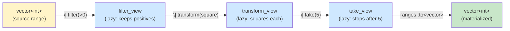
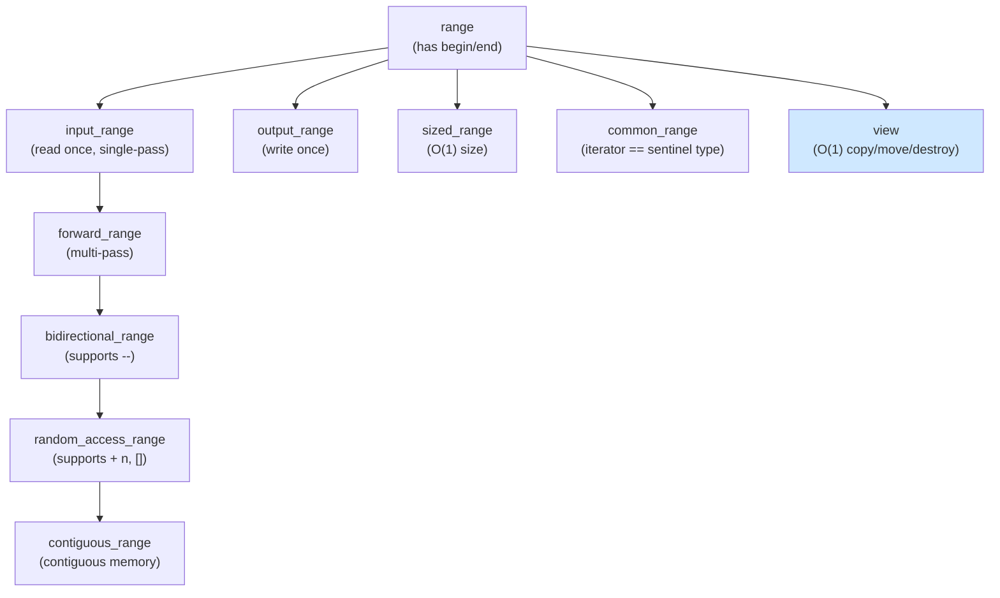

# 3. Ranges Deep Dive

> [!note] Why this note exists
> C++20 brought **ranges** — a reimagining of the STL iterator-pair interface as composable, lazy, concept-constrained pipelines. The user-level introduction is in [[11. STL Deep Dive/8. Ranges (C++20)]]; this note is the deep dive: the range concepts (`input_range`, `forward_range`, etc.), the view machinery, the full adaptor catalogue, projections, sentinel-based ranges, `ranges::to` materialization (C++23), and how to write your own range adaptors that compose cleanly with the standard library.

## Why It Matters

Pre-ranges, an STL pipeline looked like this:

```cpp
std::vector<int> result;
std::copy_if(v.begin(), v.end(), std::back_inserter(result),
             [](int x) { return x > 0; });
std::transform(result.begin(), result.end(), result.begin(),
               [](int x) { return x * x; });
std::sort(result.begin(), result.end());
```

You allocate intermediate vectors, write verbose iterator pairs, and read the code inside-out (the pipeline order is reversed from the writing order). Each step is eager — you can't compose without materializing.

With ranges:

```cpp
namespace rv = std::ranges::views;
namespace rs = std::ranges;

auto result = v
    | rv::filter([](int x) { return x > 0; })
    | rv::transform([](int x) { return x * x; })
    | rs::to<std::vector<int>>();   // C++23: materialize
```

Or, if you don't need to materialize:

```cpp
auto view = v
    | rv::filter([](int x) { return x > 0; })
    | rv::transform([](int x) { return x * x; });

for (int x : view) { /* ... */ }   // lazy, one pass, no allocation
```

Benefits:

1. **Composability.** Pipelines read left-to-right, top-to-bottom.
2. **Laziness.** Views compute on demand; no intermediate storage.
3. **Concepts.** Compile-time errors when you pipe an `input_range` into something that needs a `random_access_range`.
4. **Projections.** Built-in support for "sort by field X" without a custom comparator.
5. **Sentinel-based.** Ranges can be delimited by something other than a same-type iterator (e.g., null-terminated strings).

If you write STL-heavy code, ranges change how you think about data transformation. This note covers what's under the hood.

## Background

### The iterator-pair legacy

The STL was designed around **iterator pairs** (`begin`, `end`). Algorithms like `std::sort(first, last)` work on any pair of iterators. This is powerful but verbose:

```cpp
std::sort(v.begin(), v.end(), [](int a, int b) { return a > b; });
```

Each algorithm call repeats the `begin/end` pattern. Pipelines of algorithms require naming intermediate containers. The C++20 ranges library wraps iterators in **ranges** (objects with `begin()` and `end()`) and adds **views** (lazy range adaptors).

### Range concepts

Ranges are categorized by what their iterators can do:

| Concept | Iterators | Can... |
|---------|-----------|--------|
| `range` | Anything with `begin`/`end` | Iterate once |
| `input_range` | InputIterator | Read once, forward |
| `output_range` | OutputIterator | Write once, forward |
| `forward_range` | ForwardIterator | Multi-pass forward |
| `bidirectional_range` | BidirectionalIterator | `--` |
| `random_access_range` | RandomAccessIterator | `+ n`, `- n`, `[]` |
| `contiguous_range` | ContiguousIterator | `&r[i] + n == &r[i+n]` |
| `common_range` | Iterator and Sentinel same type | `begin` and `end` return same type |
| `sized_range` | Has `size()` | O(1) size |
| `view` | View (cheap to copy, O(1) destruction) | Composable, lazy |

These concepts propagate through adaptors. If you pipe a `random_access_range` through `views::filter`, the result is only a `bidirectional_range` (filtering breaks random access). If you pipe through `views::transform`, the result is the same category as the input.

This propagation is the source of much of ranges' power — and many of its compile errors. Knowing which concepts your input satisfies and which your output preserves is essential.

### Views: lazy and composable

A **view** is a range that:

1. Is O(1) to construct, copy, move, and destroy.
2. Doesn't own its underlying data (it refers to a range or other views).
3. Computes elements on demand (lazy).

Views are the building blocks of pipelines. `std::vector<int>` is a range but not a view (it owns data, O(N) to copy). `std::ranges::filter_view<...>` is a view (it stores a reference and a predicate).

```cpp
namespace rv = std::ranges::views;

std::vector<int> v{1, 2, 3, 4, 5};
auto evens = v | rv::filter([](int x) { return x % 2 == 0; });
// evens is a view — no copy, no allocation
// Reading evens iterates v on demand
```

Multiple views compose with `|`:

```cpp
auto result = v
    | rv::filter(isEven)
    | rv::transform(square)
    | rv::take(3);
```

Each `|` applies an adaptor, returning a new view. The whole chain is lazy — iteration walks the pipeline element by element.

### Range adaptors

The full C++20/23 adaptor catalogue:

| Adaptor | Description | Example |
|---------|-------------|---------|
| `views::filter(pred)` | Keep elements where `pred` is true | `v \| filter(>0)` |
| `views::transform(f)` | Apply `f` to each element | `v \| transform(square)` |
| `views::take(n)` | First `n` elements | `v \| take(10)` |
| `views::take_while(pred)` | Take while `pred` is true | `v \| take_while(>0)` |
| `views::drop(n)` | Skip first `n` elements | `v \| drop(5)` |
| `views::drop_while(pred)` | Skip while `pred` is true | `v \| drop_while(isspace)` |
| `views::reverse` | Reverse order | `v \| reverse` |
| `views::iota(start, stop)` | Generate [start, stop) | `iota(0, 10)` → 0,1,...,9 |
| `views::iota(start)` | Infinite from `start` | `iota(1)` → 1,2,3,... |
| `views::repeat(x)` | Infinite repetition (C++23) | `repeat(42)` |
| `views::repeat(x, n)` | `x` repeated `n` times (C++23) | `repeat(42, 5)` |
| `views::zip(as, bs, ...)` | Tuple of Nth elements (C++23) | `zip(v1, v2)` |
| `views::zip_transform(f, as, bs)` | Apply `f` to zipped (C++23) | |
| `views::adjacent<N>(r)` | Sliding window of N (C++23) | `adjacent<2>(v)` |
| `views::pairwise(r)` | `adjacent<2>` shortcut (C++23) | `pairwise(v)` |
| `views::chunk(n)` | Group into chunks of `n` (C++23) | `v \| chunk(3)` |
| `views::slide(n)` | Sliding window (C++23) | `v \| slide(3)` |
| `views::stride(n)` | Every nth element (C++23) | `v \| stride(2)` |
| `views::join` | Flatten range of ranges | `vOfV \| join` |
| `views::join_with(sep)` | Flatten with separator (C++23) | `vOfV \| join_with(',')` |
| `views::split(delim)` | Split on delimiter | `s \| split(',')` |
| `views::lazy_split(delim)` | Lazy split | `s \| lazy_split(',')` |
| `views::keys` | First element of pair-like | `m \| keys` |
| `views::values` | Second element of pair-like | `m \| values` |
| `views::elements<N>` | Nth element of tuple-like | `v \| elements<1>` |
| `views::common` | Force iterator==sentinel type | `v \| common` |
| `views::counted(p, n)` | First `n` from pointer `p` | `counted(arr, 5)` |
| `views::empty<T>` | Empty range of type T | `empty<int>` |
| `views::single(x)` | Single-element range | `single(42)` |
| `views::enumerate(r)` | Index + value pairs (C++23) | `v \| enumerate` |
| `views::as_const(r)` | Const view (C++23) | `v \| as_const` |
| `views::as_rvalue(r)` | Move view (C++23) | `v \| as_rvalue` |
| `views::cache_latest(f)` | Memoize transform (C++23) | |
| `views::concat(as, bs)` | Concatenate (C++23) | `concat(v1, v2)` |

### Materialization: `ranges::to` (C++23)

Views are lazy. To get a concrete container, use `ranges::to`:

```cpp
namespace rs = std::ranges;

// C++23 syntax
std::vector<int> v = view | rs::to<std::vector<int>>();

// With allocator (C++23)
std::vector<int, CustomAlloc> v = view | rs::to<std::vector<int, CustomAlloc>>(alloc);

// Direct construction
auto v = rs::to<std::vector>(view);   // element type deduced
```

`ranges::to` calls `reserve` when it can (sized ranges), avoiding reallocations.

Pre-C++23, the workaround was:

```cpp
std::vector<int> v(view.begin(), view.end());   // works but no reserve
// or
std::vector<int> v;
rs::copy(view, std::back_inserter(v));
```

### Projections

A projection is a unary function applied to each element *before* the algorithm sees it. This is the ranges replacement for "extract a field before comparing."

```cpp
struct Person { std::string name; int age; };
std::vector<Person> people = { /* ... */ };

// Sort by age
rs::sort(people, {}, &Person::age);   // {} = default comparator, &Person::age = projection

// Find by name
auto it = rs::find(people, "Alice", &Person::name);

// Transform after projection
auto names = people | rv::transform(&Person::name);
```

The `{}` placeholder lets you skip the comparator and provide just the projection. Projections work in any range algorithm that takes a function — `sort`, `find`, `min`, `max`, `transform`, etc.

### Sentinel-based ranges

In classic STL, `begin` and `end` have the same type. Ranges generalize: `end` can be a different type — a **sentinel**. This lets you express ranges delimited by a condition, not a position.

Example: a null-terminated C string.

```cpp
struct c_string_sentinel {
    bool operator==(const char* p) const { return *p == '\0'; }
};

struct c_string_range {
    const char* p;
    const char* begin() const { return p; }
    c_string_sentinel end() const { return {}; }
};

for (char c : c_string_range{"hello"}) {
    std::cout << c;
}
```

The loop walks until the sentinel matches (i.e., until `*p == '\0'`). No need to call `strlen` first.

Sentinel-based ranges are how `views::take_while`, `views::filter`, and infinite `iota` work — they have a sentinel that says "stop when condition X holds."

## Main Content

### Composing views

The whole point of ranges is composition. Let's build a non-trivial pipeline.

Problem: from a vector of `Person`, get the names of adults sorted alphabetically, with no duplicates.

```cpp
struct Person { std::string name; int age; };
std::vector<Person> people = { /* ... */ };

namespace rv = std::ranges::views;
namespace rs = std::ranges;

auto adultNames = people
    | rv::filter([](const Person& p) { return p.age >= 18; })
    | rv::transform(&Person::name)
    | rs::to<std::vector>()              // materialize so we can sort
    ;
rs::sort(adultNames);
adultNames.erase(std::unique(adultNames.begin(), adultNames.end()), adultNames.end());

// Or, using ranges::unique + ranges::actions (proposed):
// auto adultNames = people
//     | rv::filter([](const Person& p) { return p.age >= 18; })
//     | rv::transform(&Person::name)
//     | rs::to<std::vector>()
//     | actions::sort
//     | actions::unique;
```

The pipeline reads top-to-bottom in execution order: filter adults, extract names, materialize, sort, dedupe. No intermediate vectors, no `back_inserter` boilerplate.

### Generators with `iota` and `repeat`

```cpp
// Squares of the first 10 natural numbers
auto squares = rv::iota(1) | rv::transform([](int x) { return x * x; }) | rv::take(10);
for (int x : squares) std::cout << x << ' ';   // 1 4 9 16 25 36 49 64 81 100

// Infinite stream of 0s, take 5
auto zeros = rv::repeat(0) | rv::take(5);

// Cartesian-ish zip with index
std::vector<std::string> names{"Alice", "Bob", "Charlie"};
for (auto [idx, name] : names | rv::enumerate) {   // C++23
    std::cout << idx << ": " << name << '\n';
}
```

`iota` is the canonical "generate a sequence" view. Combined with `take`, it gives finite sequences. Combined with `filter`, it gives infinite streams consumed on demand.

### Chunking and sliding

```cpp
std::vector<int> v{1, 2, 3, 4, 5, 6, 7};

// Chunks of 3: [1,2,3], [4,5,6], [7]
for (auto chunk : v | rv::chunk(3)) {
    for (int x : chunk) std::cout << x << ' ';
    std::cout << "| ";
}
// Output: 1 2 3 | 4 5 6 | 7 |

// Sliding window of 3: [1,2,3], [2,3,4], [3,4,5], [4,5,6], [5,6,7]
for (auto window : v | rv::slide(3)) {
    for (int x : window) std::cout << x << ' ';
    std::cout << "| ";
}
// Output: 1 2 3 | 2 3 4 | 3 4 5 | 4 5 6 | 5 6 7 |
```

`chunk` partitions; `slide` walks. Both are C++23.

### Zipping

```cpp
std::vector<int> a{1, 2, 3};
std::vector<char> b{'a', 'b', 'c'};

for (auto [x, y] : rv::zip(a, b)) {
    std::cout << x << y << ' ';
}
// Output: 1a 2b 3c
```

`zip` stops at the shorter range. (C++23.)

### Joining ranges of ranges

```cpp
std::vector<std::vector<int>> nested{{1, 2}, {3, 4}, {5}};

for (int x : nested | rv::join) {
    std::cout << x << ' ';
}
// Output: 1 2 3 4 5

// With separator (C++23)
for (int x : nested | rv::join_with(0)) {
    std::cout << x << ' ';
}
// Output: 1 2 0 3 4 0 5
```

### Splitting strings

```cpp
std::string csv = "a,b,c,,e";
for (auto word : csv | rv::split(',')) {
    std::string_view sv{word.begin(), word.end()};
    std::cout << '[' << sv << ']';
}
// Output: [a][b][c][][e]
```

`split` returns a range of sub-ranges. Each sub-range is a view into the original string — no allocation.

### Writing a custom range adaptor

Suppose you want a `chunk_by` adaptor that groups consecutive equal elements. (C++23 has `chunk_by`; here we'll write a simplified version to learn the mechanics.)

The key components:

1. A **view class** (templated on the underlying range, predicate, and iterator category).
2. An **iterator type** that walks the range one chunk at a time.
3. A **sentinel type** (or iterator as sentinel).
4. An **adaptor closure object** that lets you write `r | chunk_by(pred)`.

```cpp
#include <ranges>
#include <concepts>
#include <iterator>
#include <functional>

namespace my {

template <std::forward_iterator It, std::sentinel_for<It> Sent, class Pred>
class chunk_by_iterator {
    It current_;
    Sent end_;
    Pred* pred_;
public:
    using value_type = std::ranges::subrange<It, It>;
    using difference_type = std::iter_difference_t<It>;
    using iterator_category = std::forward_iterator_tag;

    chunk_by_iterator() = default;
    chunk_by_iterator(It it, Sent end, Pred* p)
        : current_(it), end_(end), pred_(p) {}

    value_type operator*() const {
        It next = current_;
        ++next;
        while (next != end_ && (*pred_)(*current_, *next)) {
            current_ = next;
            ++next;
        }
        It chunk_end = next;
        return value_type{current_, chunk_end};
        // Note: this is illustrative; real implementation must advance current_ to chunk_end
    }

    chunk_by_iterator& operator++() {
        // advance to end of current chunk
        if (current_ == end_) return *this;
        It next = current_; ++next;
        while (next != end_ && (*pred_)(*current_, *next)) {
            current_ = next; ++next;
        }
        current_ = next;
        return *this;
    }

    void operator++(int) { ++(*this); }

    bool operator==(const chunk_by_iterator& other) const {
        return current_ == other.current_;
    }
    bool operator==(Sent s) const { return current_ == s; }
};

template <std::ranges::forward_range R, class Pred>
class chunk_by_view : public std::ranges::view_interface<chunk_by_view<R, Pred>> {
    R base_;
    Pred pred_;
public:
    chunk_by_view() = default;
    chunk_by_view(R base, Pred pred) : base_(std::move(base)), pred_(std::move(pred)) {}

    auto begin() {
        return chunk_by_iterator<std::ranges::iterator_t<R>,
                                  std::ranges::sentinel_t<R>,
                                  Pred>(std::ranges::begin(base_),
                                        std::ranges::end(base_),
                                        &pred_);
    }
    auto end() {
        return std::ranges::end(base_);
    }
};

// Adaptor closure
template <class Pred>
struct chunk_by_closure {
    Pred pred;
    template <std::ranges::forward_range R>
    friend auto operator|(R&& r, chunk_by_closure&& self) {
        return chunk_by_view<std::views::all_t<R>, Pred>(
            std::views::all(std::forward<R>(r)), std::move(self.pred));
    }
};

template <class Pred>
auto chunk_by(Pred pred) {
    return chunk_by_closure<Pred>{std::move(pred)};
}

}  // namespace my

// Usage:
// for (auto chunk : v | my::chunk_by(std::equal_to<>{})) { ... }
```

This is the **closure pattern** — the function returns an object whose `operator|` builds the view. The standard library uses this pattern for all adaptors.

Key elements:

- `std::ranges::view_interface<Derived>` provides `empty()`, `size()`, `front()`, `back()`, `operator[]` automatically (when the underlying iterator supports them).
- `std::views::all(r)` wraps any range in a view (so we don't accidentally copy a vector).
- The iterator must satisfy the appropriate concept (`forward_iterator` here).
- The sentinel can be a different type from the iterator (we used the underlying sentinel).

### Range adaptor composition diagram



### Range concepts hierarchy



## Code Examples

### A real-world pipeline

```cpp
#include <ranges>
#include <vector>
#include <string>
#include <algorithm>
#include <iostream>

namespace rv = std::ranges::views;
namespace rs = std::ranges;

struct Sale {
    std::string product;
    int units;
    double price;
};

int main() {
    std::vector<Sale> sales = {
        {"apple", 10, 0.50}, {"banana", 5, 0.30}, {"apple", 8, 0.50},
        {"cherry", 20, 2.00}, {"banana", 12, 0.30}, {"date", 3, 1.50},
    };

    // Top 3 products by total revenue
    auto report = sales
        | rv::transform([](const Sale& s) {
            return std::pair{s.product, s.units * s.price};
        })
        | rs::to<std::vector>();

    rs::sort(report, [](const auto& a, const auto& b) {
        return a.second > b.second;   // descending by revenue
    });

    for (auto [product, revenue] : report | rv::take(3)) {
        std::cout << product << ": $" << revenue << '\n';
    }
}
```

### Projections in action

```cpp
struct Employee {
    std::string name;
    int age;
    double salary;
};

std::vector<Employee> emps = { /* ... */ };

// Sort by salary (descending)
rs::sort(emps, std::greater{}, &Employee::salary);

// Find first employee over 40
auto it = rs::find_if(emps, [](int age) { return age > 40; }, &Employee::age);

// Group by department (hypothetical)
// auto byDept = emps | rv::chunk_by(/* same dept */);
```

### Sentinel-based infinite range

```cpp
namespace rv = std::ranges::views;

// Fibonacci, infinite
struct Fibonacci {
    struct iterator {
        long long a = 0, b = 1;
        using value_type = long long;
        using difference_type = std::ptrdiff_t;
        using iterator_category = std::input_iterator_tag;
        long long operator*() const { return a; }
        iterator& operator++() { long long c = a + b; a = b; b = c; return *this; }
        void operator++(int) { ++(*this); }
        bool operator==(const iterator&) const = default;  // never equal — infinite
    };
    struct sentinel {};
    friend bool operator==(iterator it, sentinel) { return false; }

    iterator begin() const { return {}; }
    sentinel end() const { return {}; }
};

static_assert(std::ranges::input_range<Fibonacci>);

int main() {
    for (long long x : Fibonacci{} | rv::take(10)) {
        std::cout << x << ' ';
    }
    // 0 1 1 2 3 5 8 13 21 34
}
```

### Custom adaptor with `view_interface`

```cpp
template <std::ranges::view V>
class drop_last_view : public std::ranges::view_interface<drop_last_view<V>> {
    V base_;
public:
    drop_last_view() = default;
    explicit drop_last_view(V v) : base_(std::move(v)) {}

    auto begin() { return std::ranges::begin(base_); }
    auto end() {
        auto it = std::ranges::begin(base_);
        auto last = it;
        auto e = std::ranges::end(base_);
        if (it == e) return e;
        while (++it != e) last = it;
        return last;
    }
};

template <std::ranges::viewable_range R>
auto drop_last(R&& r) {
    return drop_last_view<std::views::all_t<R>>(std::views::all(std::forward<R>(r)));
}
```

### `ranges::to` with custom container

```cpp
namespace rs = std::ranges;

// If your container supports construct-from-iterator, ranges::to works directly:
std::set<int> s = some_view | rs::to<std::set<int>>();

// If not, specialize the alias template:
// (rarely needed; most containers work out of the box)
```

## Common Pitfalls

> [!danger] Pitfall 1 — Dangling views
> A view doesn't own its source. `auto v = std::vector{1,2,3} | rv::reverse;` dangles — the temporary vector is destroyed at the end of the statement. Always bind the source to a named variable first.

> [!danger] Pitfall 2 — Confusing views with containers
> A view is lazy. Calling `.size()` on an unsized view, or `.back()` on an empty view, is undefined. Check the concept (`sized_range`, `common_range`) before relying on these.

> [!danger] Pitfall 3 — Trying to modify through a view
> `transform_view` returns by value; you can't write through it. Use `views::filter` + a mutable container, or write the loop explicitly.

> [!danger] Pitfall 4 — Iterating a view twice
> Some views (like `iota` or `filter`) can be iterated multiple times; others (like `views::counted` from an `istream_iterator`) cannot. Know which kind you have.

> [!danger] Pitfall 5 — Concept errors
> Piping a `bidirectional_range` into an adaptor that needs `random_access_range` gives a long, scary template error. Read the error from the bottom up; look for the unmet concept.

> [!danger] Pitfall 6 — Materializing when you shouldn't
> `ranges::to<vector>` creates a copy. If you just need to iterate once, iterate the view directly. Materialize only when you need a stable snapshot or repeated iteration.

> [!danger] Pitfall 7 — Forgetting `ranges::` vs `views::`
> `std::ranges::sort` takes a range; `std::sort` takes iterators. Mixing them gives errors. Use `namespace rs = std::ranges;` and `namespace rv = std::ranges::views;` aliases consistently.

> [!danger] Pitfall 8 — `transform` returning a reference to a temporary
> If your transform lambda returns a reference to a temporary, you get a dangling view. Return by value, or return a reference to the input.

> [!danger] Pitfall 9 — Custom adaptors that don't satisfy `view`
> `view` requires O(1) copy/move/destroy. If your "view" stores a vector, it's not a view; it's a container. Don't lie to the type system.

> [!danger] Pitfall 10 — Mixing C++20 and C++23 adaptors without checking
> `chunk`, `slide`, `enumerate`, `zip`, `repeat`, `stride` are C++23. Code using them won't compile on a C++20-only compiler.

## Tips and Tricks

- **Use namespace aliases** `namespace rs = std::ranges;` and `namespace rv = std::ranges::views;`. Cleaner code.
- **Read pipelines left-to-right.** That's the point. If yours reads backwards, you've structured it wrong.
- **Materialize once, at the end.** Use views for intermediate steps; `ranges::to` for the final result.
- **Use projections.** `rs::sort(people, {}, &Person::age)` beats a custom comparator lambda.
- **Use `enumerate` (C++23)** instead of indexing loops. `for (auto [i, x] : v | rv::enumerate)`.
- **Use `iota` + `take`** for "first N integers" patterns. Don't write `for (int i = 0; i < N; ++i)`.
- **Use `zip`** for parallel iteration. Replaces index-based loops over two containers.
- **Use `split` and `join`** for string manipulation — much cleaner than `find`/`substr` loops.
- **Use `chunk` and `slide`** for batched / windowed processing.
- **Check the resulting range concept.** If your pipeline needs `random_access_range`, make sure every adaptor preserves it. (`filter` and `take_while` don't.)
- **Use `std::views::all(r)`** when wrapping a range you don't own. It prevents accidental copies.
- **Use `view_interface` as a base class** for custom views. It gives you `empty()`, `size()`, `front()`, `back()`, `[]` for free.
- **Implement the closure pattern** for custom adaptors. Don't reinvent `operator|`.
- **Prefer range algorithms over view adaptors for sorting and unique-ing.** `views::sort` doesn't exist; use `ranges::sort` after materializing.
- **Use `ranges::to` (C++23)** for materialization. Reserve-friendly, container-agnostic.
- **Don't fear `iota` infinite ranges.** Combined with `take`/`take_while`, they're safe and idiomatic.
- **Use `as_const` and `as_rvalue` (C++23)** for explicit const-ness and move semantics in pipelines.
- **Track `std::ranges::actions`** — a proposed (not yet standard) library for eager adaptors like `actions::sort | actions::unique`. Until then, materialize and call algorithms.

## Active Recall

1. List the six range concepts from `input_range` to `contiguous_range`, in order.
2. What's the difference between a `range` and a `view`?
3. Write a pipeline that filters positive numbers, squares them, takes the first 10, and materializes to a vector.
4. What does `ranges::to<std::vector<int>>(view)` do? What C++ standard introduced it?
5. What is a projection? Write an example using one with `ranges::sort`.
6. What is a sentinel? Why is it useful?
7. List five C++23 range adaptors.
8. Write a custom view that wraps any range and yields only every other element.
9. What is the closure pattern? Why is it needed for `operator|`?
10. Why must a `view` be O(1) to copy/move/destroy?
11. Write a sentinel-based range that yields characters from a null-terminated C string.
12. What does `std::views::all(r)` do, and when would you use it?

## Next Steps

- Read [[11. STL Deep Dive/8. Ranges (C++20)]] — the user-level companion to this note.
- Read [[11. STL Deep Dive/7. Algorithms]] — range algorithms extend iterator-pair algorithms.
- Read [[11. STL Deep Dive/6. Iterators]] — the underlying iterator categories that range concepts build on.
- Read [[10. Templates and Metaprogramming/5. Concepts (C++20)]] — range concepts are constrained templates.
- Read [[20. Advanced C++ Topics/5. C++23 and Beyond]] — most of the new adaptors (`zip`, `chunk`, `enumerate`, `slide`) are C++23.
- Read [[8. Modern C++/9. C++20 and C++23 New Features]] — ranges are a flagship C++20 feature.
- Cross-reference the ranges-v3 library (the basis for `std::ranges`) for examples of more advanced adaptors.
- Read the CppCon talks by Eric Niebler (ranges author) and Christopher Di Bella for deep dives.
- Track the `std::ranges::actions` proposal for eager adaptors (not yet standard).
