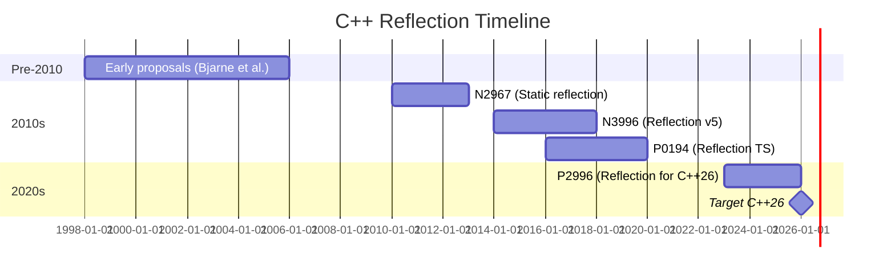
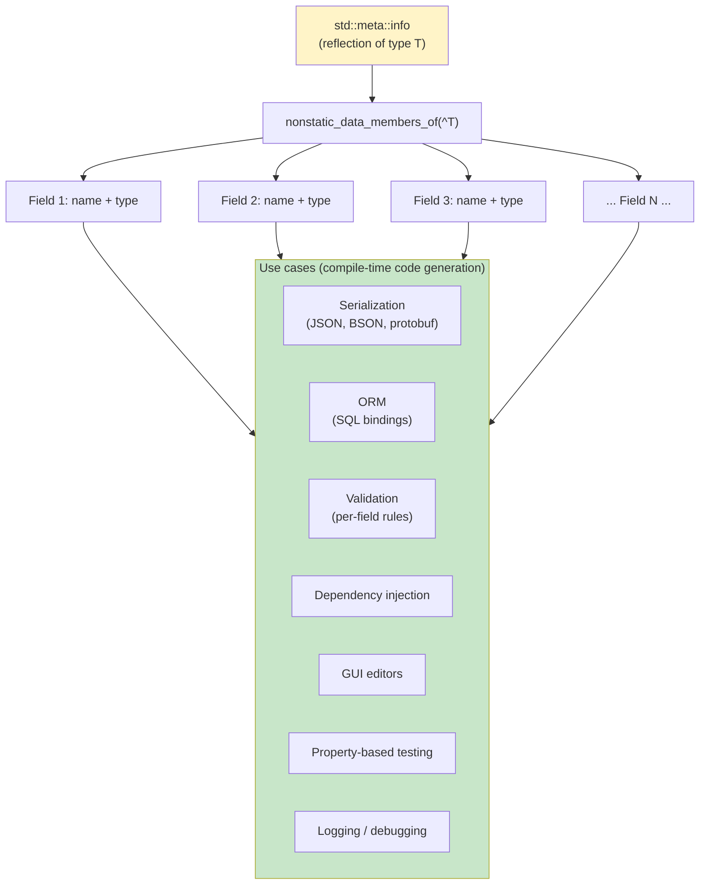
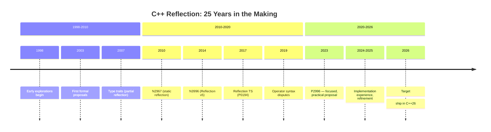

# 4. Reflection (Future)

> [!note] Why this note exists
> Reflection — the ability of a program to inspect and act on its own types at compile time or runtime — has been the most-requested C++ feature for over twenty years. It is **not** in C++23. It might be in C++26. This note covers what reflection is, why C++ doesn't have it yet, the proposed C++26 syntax, the workarounds you can use today (macros, Boost.PFR, Boost.Hana, refl-cpp, meta), and the killer use cases (serialization, ORM, validation, dependency injection) that make reflection worth the wait.

## Why It Matters

Consider this C# code:

```csharp
public class User {
    public string Name { get; set; }
    public int Age { get; set; }
    public string Email { get; set; }
}

var json = JsonSerializer.Serialize(user);
var user = JsonSerializer.Deserialize<User>(json);
```

The framework iterates the fields of `User` automatically — no boilerplate, no manual registration. C# has had this for two decades. Java has it. Python has it. Rust has `serde`. Go has `encoding/json`.

C++ doesn't. To serialize a struct in C++, you write:

```cpp
struct User {
    std::string name;
    int age;
    std::string email;
};

nlohmann::json toJson(const User& u) {
    return {{"name", u.name}, {"age", u.age}, {"email", u.email}};
}

User fromJson(const nlohmann::json& j) {
    return {j.at("name"), j.at("age"), j.at("email")};
}
```

Add a field, and you have to update both functions. Forget to update one, and you have a silent bug. Multiply by 1000 structs in a real codebase, and the boilerplate becomes unmanageable. The same problem appears in:

- **ORM bindings** — one line per field, kept in sync with the schema.
- **Validation** — `if (age < 0 || age > 150) return Error{"bad age"};` per field.
- **Dependency injection** — register types and constructors with the container.
- **GUI editors** — show fields of a struct for editing.
- **Testing** — generate arbitrary instances for property-based tests.
- **Logging** — print all fields when something goes wrong.
- **Diffing** — compare two instances field by field.

Reflection eliminates all this boilerplate. With reflection (and a serialization library that uses it):

```cpp
struct User {
    std::string name;
    int age;
    std::string email;
};

auto json = serialize(user);   // framework iterates fields via reflection
auto user = deserialize<User>(json);
```

That's the dream. C++26 may deliver it. Until then, we have workarounds.

## Background

### What is reflection?

Reflection is the ability of a program to inspect (and sometimes modify) its own structure at runtime or compile time. There are several axes:

1. **Introspection** — reading type information: field names, types, methods, base classes, attributes.
2. **Modification** — changing types at runtime (adding methods, etc.). Common in dynamic languages; rare in C++.
3. **Compile-time vs runtime** — compile-time reflection (type info available to templates) vs runtime reflection (type info available via objects).
4. **Static vs dynamic** — reflection on a type known at compile time (most C++ proposals) vs on a type erased to a base/`void*`.

C++ proposals focus on **static, compile-time introspection** — the kind that lets you write a serialization library that's resolved entirely at compile time, with zero runtime overhead.

### What's in C++ today (without true reflection)

- **RTTI (Run-Time Type Information)** — `typeid(x).name()` and `dynamic_cast`. Tells you the runtime type of a polymorphic object, but not its fields. Often disabled (`-fno-rtti`) for performance and binary size.
- **`std::type_info` / `std::type_index`** — type identity, comparable, hashable. No field info.
- **`__PRETTY_FUNCTION__` / `std::source_location`** — current function signature. Useful for diagnostics, not reflection.
- **`sizeof` / `alignof` / `offsetof`** — basic layout queries. Don't give you field names or types.
- **Structured bindings (`auto [a, b, c] = obj;`)** — can decompose a struct's fields, but only if you know the count at compile time.

None of these give you "list all fields of this struct." That requires reflection.

### Why doesn't C++ have reflection yet?

Several reasons:

1. **Backward compatibility.** C++ can't break existing code. Any reflection proposal must coexist with headers, templates, macros, multiple inheritance, and 40 years of legacy code.
2. **Zero-overhead principle.** C++ won't add runtime cost for features you don't use. So reflection must be opt-in per type, or entirely compile-time.
3. **Compile-time complexity.** Reflection adds a lot of compile-time work (parsing types, generating metadata). Implementations are non-trivial.
4. **Syntax disputes.** Should reflection use `^Type` syntax? `reflect::of<T>`? An operator? The committee went back and forth for years.
5. **The big tent.** Reflection covers a huge design space (introspection, modification, code generation, attributes). Proposals kept growing; committee kept trimming.

The current leading proposal (P2996) targets C++26 with a focused first cut: compile-time introspection of types, with expansion (generating code from the metadata) via `std::meta::reflect_value` and friends.

## Main Content

### The C++26 proposal (P2996)

The leading reflection proposal (as of mid-2024) is **P2996 ("Reflection for C++26")** by Andrew Sutton, Wyatt Spear, Dan Katz, and others. It introduces:

1. **A `^` operator** that reflects on a type, value, or expression and produces a `std::meta::info` value (a compile-time handle to the reflected entity).
2. **`std::meta::info`** — an opaque type representing "the reflection of something." Like `std::type_info`, but richer and usable at compile time.
3. **A library of metafunctions** in `std::meta` — `type_of`, `name_of`, `members_of`, `fields_of`, `bases_of`, etc.
4. **Code injection / expansion** via `[: ... :]` — splice a reflected entity back into code.
5. **`consteval` reflection** — all reflection happens at compile time, with zero runtime cost.

Sketch (subject to change — proposal is still evolving):

```cpp
#include <meta>

struct User {
    std::string name;
    int age;
    std::string email;
};

// Reflect on User
constexpr auto info = ^User;

// Get fields
constexpr auto fields = std::meta::nonstatic_data_members_of(info);
// fields is a span of std::meta::info

// Iterate fields and print their names
template <class T>
void printFields() {
    template for (constexpr auto f : std::meta::nonstatic_data_members_of(^T)) {
        std::cout << std::meta::name_of(f) << '\n';
    }
}

// Splice: construct a value of type reflected by `f`
template <class T>
auto sumFields(const T& obj) {
    long total = 0;
    template for (constexpr auto f : std::meta::nonstatic_data_members_of(^T)) {
        total += obj.[: f :];   // splice: obj.<reflected member>
    }
    return total;
}
```

Key elements:

- `^Type` reflects on `Type`, producing a `std::meta::info`.
- `[: info :]` splices the info back into code, producing a type, expression, or member name.
- `template for` is a compile-time loop that unrolls over a `constexpr` range of `info` values.
- The whole thing is `consteval` — no runtime cost.

### Use cases unlocked by reflection

#### Serialization

```cpp
template <class T>
nlohmann::json serialize(const T& obj) {
    nlohmann::json j;
    template for (constexpr auto f : std::meta::nonstatic_data_members_of(^T)) {
        j[std::meta::name_of(f)] = obj.[: f :];
    }
    return j;
}

template <class T>
T deserialize(const nlohmann::json& j) {
    T obj;
    template for (constexpr auto f : std::meta::nonstatic_data_members_of(^T)) {
        obj.[: f :] = j[std::meta::name_of(f)].get<[: std::meta::type_of(f) :]>();
    }
    return obj;
}
```

One function pair serves every struct. Adding a field doesn't require updating serialization code.

#### ORM (object-relational mapping)

```cpp
struct User {
    int id;
    std::string name;
    std::string email;
    std::chrono::system_clock::time_point created_at;
};

// Reflection-driven ORM generates SQL automatically
auto users = db.select<User>("SELECT * FROM users WHERE age > ?", 18);
// Framework: reflect on User, generate row-to-struct mapping

db.insert(User{0, "Alice", "alice@example.com", std::chrono::system_clock::now()});
// Framework: reflect on User, generate INSERT statement
```

#### Validation

```cpp
template <class T>
std::vector<std::string> validate(const T& obj) {
    std::vector<std::string> errors;
    template for (constexpr auto f : std::meta::nonstatic_data_members_of(^T)) {
        auto value = obj.[: f :];
        // Apply per-field rules from attributes (P2996 includes attribute reflection)
        // ...
    }
    return errors;
}
```

#### Dependency injection

```cpp
struct Service {
    std::shared_ptr<Database> db;
    std::shared_ptr<Logger> log;
    std::shared_ptr<Cache> cache;
};

Service makeService(DI::Container& c) {
    // Reflection: iterate constructor parameters, resolve from container
    return c.construct<Service>();
}
```

#### GUI editors

```cpp
void drawEditor(void* obj, std::meta::info type) {
    template for (constexpr auto f : std::meta::nonstatic_data_members_of(type)) {
        ImGui::InputText(name_of(f), &obj->[: f :]);
    }
}
```

#### Property-based testing

```cpp
template <class T>
T arbitrary() {
    T obj;
    template for (constexpr auto f : std::meta::nonstatic_data_members_of(^T)) {
        obj.[: f :] = arbitrary<[: std::meta::type_of(f) :]>();
    }
    return obj;
}
```

### The reflection timeline

Reflection has been "10 years away" for 30 years. Here's the actual history:



Each iteration refined the syntax and narrowed the scope. P2996 is the most focused yet — it ships introspection first, leaving code injection for a future iteration. This pragmatic approach is why it has a real chance of landing in C++26.

### Workarounds today

Since reflection isn't standard yet, what can you do? Several libraries provide field iteration for aggregate types (POD-like structs):

#### Boost.PFR (Pod FRamework Reflection)

The most widely used. Works on any aggregate (a struct with all-public fields, no user-defined constructors). No macros, no registration.

```cpp
#include <boost/pfr.hpp>

struct User {
    std::string name;
    int age;
    std::string email;
};

User u{"Alice", 30, "alice@example.com"};

// Iterate fields
boost::pfr::for_each_field(u, [](const auto& field) {
    std::cout << field << '\n';
});

// Get field count
constexpr size_t n = boost::pfr::tuple_size_v<User>;   // 3

// Access by index
auto& age = boost::pfr::get<1>(u);

// Convert to tuple
auto tup = boost::pfr::structure_to_tuple(u);
// std::tuple<std::string, int, std::string>
```

How it works: PFR uses structured bindings (`auto [a, b, c] = obj;`) under the hood, with template metaprogramming to detect the field count. It only works for aggregates — but that covers a lot of structs.

Libraries like `nlohmann/json` use PFR (or similar) to provide automatic serialization:

```cpp
#include <nlohmann/json.hpp>
#include <boost/pfr.hpp>

NLOHMANN_DEFINE_TYPE_NON_INTRUSIVE(User, name, age, email)
// Or, with PFR + nlohmann::json_macro_free, automatic serialization of any aggregate.
```

#### Boost.Hana

A more general metaprogramming library. Requires you to adapt your struct once, then provides compile-time iteration:

```cpp
#include <boost/hana.hpp>

struct User {
    BOOST_HANA_DEFINE_STRUCT(
        User,
        (std::string, name),
        (int, age),
        (std::string, email)
    );
};

User u{"Alice", 30, "alice@example.com"};

boost::hana::for_each(u, [](auto pair) {
    std::cout << boost::hana::to<char const*>(boost::hana::first(pair)) << ": "
              << boost::hana::second(pair) << '\n';
});
```

Hana is more powerful than PFR (works at runtime too, supports methods and inheritance) but requires the macro adaptation. The adaptation is one-time per struct.

#### refl-cpp

A header-only library with attribute support:

```cpp
#include <refl.hpp>

struct User {
    std::string name;
    int age;
    std::string email;
};

REFL_TYPE(User)
    REFL_FIELD(name)
    REFL_FIELD(age)
    REFL_FIELD(email)
REFL_END

refl::util::for_each(refl::reflect<User>::members, [&](auto member) {
    std::cout << member.name << '\n';
});
```

Requires registration macros, but supports attributes, methods, and base classes.

#### Macros + X-macros

The pre-C++20 workaround. Define fields once in a macro, expand it for each use case:

```cpp
// user_fields.h
#define USER_FIELDS(X) \
    X(std::string, name) \
    X(int, age) \
    X(std::string, email)

// user.h
struct User {
    #define X(type, name) type name;
    USER_FIELDS(X)
    #undef X
};

// serialization.cpp
nlohmann::json toJson(const User& u) {
    nlohmann::json j;
    #define X(type, name) j[#name] = u.name;
    USER_FIELDS(X)
    #undef X
    return j;
}

// validation.cpp
std::vector<std::string> validate(const User& u) {
    std::vector<std::string> errs;
    #define X(type, name) \
        if (u.name < 0) errs.push_back(#name " must be >= 0");
    USER_FIELDS(X)
    #undef X
    return errs;
}
```

Ugly but works everywhere, including C++98.

#### Magic macros (BOOST_FUSION_ADAPT_STRUCT)

Boost.Fusion provides similar macros:

```cpp
#include <boost/fusion/adapted/struct/adapt_struct.hpp>

struct User {
    std::string name;
    int age;
    std::string email;
};

BOOST_FUSION_ADAPT_STRUCT(User, name, age, email)

// Now Fusion can iterate fields
boost::fusion::for_each(u, [](auto& field) { /* ... */ });
```

### Reflection use cases diagram



### Reflection timeline diagram



## Code Examples

### Boost.PFR: automatic struct printing

```cpp
#include <boost/pfr.hpp>
#include <iostream>
#include <string>

struct Order {
    int id;
    std::string symbol;
    double price;
    int quantity;
    bool is_buy;
};

std::ostream& operator<<(std::ostream& os, const Order& o) {
    os << "Order{";
    bool first = true;
    boost::pfr::for_each_field(o, [&](const auto& field) {
        if (!first) os << ", ";
        os << field;
        first = false;
    });
    os << "}";
    return os;
}

int main() {
    Order o{42, "AAPL", 189.50, 100, true};
    std::cout << o << '\n';
    // Output: Order{42, AAPL, 189.5, 100, 1}
}
```

### Boost.PFR: automatic serialization

```cpp
#include <boost/pfr.hpp>
#include <string>
#include <sstream>
#include <vector>

template <class T>
std::string toCsv(const T& obj) {
    std::ostringstream ss;
    bool first = true;
    boost::pfr::for_each_field(obj, [&](const auto& field) {
        if (!first) ss << ",";
        ss << field;
        first = false;
    });
    return ss.str();
}

template <class T>
std::vector<std::string> fieldNames() {
    std::vector<std::string> names;
    // PFR doesn't give names directly, but refl-cpp and Hana do
    // For pure PFR, you can use the addressof trick or stick to indexed access
    return names;
}
```

### refl-cpp with attributes

```cpp
#include <refl.hpp>
#include <string>
#include <iostream>

struct Column {
    const char* name;
    const char* type;
};

struct Table {
    const char* name;
};

REFL_AUTO(
    type(User, Table{"users"}),
    field(name, Column{"name", "TEXT"}),
    field(age, Column{"age", "INTEGER"}),
    field(email, Column{"email", "TEXT"})
)

struct User {
    std::string name;
    int age;
    std::string email;
};

int main() {
    auto table = refl::reflect<User>::attributes[0].value;
    std::cout << "Table: " << table.name << '\n';

    refl::util::for_each(refl::reflect<User>::members, [&](auto member) {
        auto col = member.attributes[0].value;
        std::cout << "  " << col.name << " " << col.type
                  << " (C++ field: " << member.name << ")\n";
    });
}
```

### Hand-rolled reflection for aggregates (C++17)

```cpp
#include <tuple>
#include <utility>

// Trick: structured bindings of an aggregate give access to fields
// We use SFINAE to detect the field count.

template <class T>
constexpr auto fieldCount() {
    // Try increasing counts; return the largest that compiles
    // (This is the trick Boost.PFR uses internally)
    return 3;  // simplified; real implementation is more involved
}

template <class T, class F, std::size_t... Is>
void for_each_field_impl(T& obj, F&& f, std::index_sequence<Is...>) {
    auto [a, b, c] = obj;   // assumes field count == 3
    f(a, 0); f(b, 1); f(c, 2);
}

template <class T, class F>
void for_each_field(T& obj, F&& f) {
    for_each_field_impl(obj, std::forward<F>(f),
                        std::make_index_sequence<3>{});
}
```

(Boost.PFR does this properly with template metaprogramming — this is just illustrative.)

### Projected C++26 reflection (hypothetical syntax)

```cpp
#include <meta>
#include <iostream>
#include <string>

struct User {
    std::string name;
    int age;
    std::string email;
};

template <class T>
void describe() {
    std::cout << "Type: " << std::meta::name_of(^T) << '\n';
    std::cout << "Fields:\n";
    template for (constexpr auto f : std::meta::nonstatic_data_members_of(^T)) {
        std::cout << "  " << std::meta::name_of(f)
                  << " : " << std::meta::name_of(std::meta::type_of(f)) << '\n';
    }
}

int main() {
    describe<User>();
    // Output:
    //   Type: User
    //   Fields:
    //     name : std::string
    //     age : int
    //     email : std::string
}
```

(Speculative — P2996's final syntax may differ.)

## Common Pitfalls

> [!danger] Pitfall 1 — Expecting reflection in C++23
> It didn't ship. If you need reflection today, use Boost.PFR, Hana, or refl-cpp.

> [!danger] Pitfall 2 — Using reflection where it doesn't belong
> Reflection adds compile-time cost. Don't use it for trivial types or one-off code. The cost is justified when it eliminates boilerplate across many types.

> [!danger] Pitfall 3 — Aggregate-only limitations
> Boost.PFR works on aggregates only. Add a constructor, base class, or private member, and PFR stops working. Hana and refl-cpp handle more cases but require macro adaptation.

> [!danger] Pitfall 4 — Field name access
> Boost.PFR gives you field values, not names. If you need names (for serialization keys), use refl-cpp or Hana, or write the macro version.

> [!danger] Pitfall 5 — Assuming macro-based reflection is type-safe
> X-macro tricks are stringly-typed. A typo in a field name silently breaks serialization. Use IDE support and code generation to catch errors.

> [!danger] Pitfall 6 — Forgetting that RTTI != reflection
> `typeid(x).name()` gives a mangled type name, not field information. RTTI is for runtime polymorphism, not reflection.

> [!danger] Pitfall 7 — Expecting runtime reflection
> C++26 proposals are compile-time only. You can't reflect on a `void*` and discover its type. If you need runtime reflection (e.g., for plugins), build it on top of compile-time reflection + type erasure.

> [!danger] Pitfall 8 — Reflection on third-party types
> You can't add reflection metadata to types you don't own (without macro adaptation, which requires source modification). For third-party types, you'll need adapters.

> [!danger] Pitfall 9 — Compile-time cost explosion
> Reflecting on a large class with 100 members generates a lot of template instantiations. Build times can balloon. Be selective.

> [!danger] Pitfall 10 — Trusting speculative C++26 syntax
> P2996's syntax (`^Type`, `[: info :]`, `template for`) is still evolving. Don't write production code against it yet.

## Tips and Tricks

- **Use Boost.PFR for aggregates today.** It's the closest thing to native reflection and works in C++17.
- **Use refl-cpp when you need attributes.** It supports per-field metadata (column names, validators, etc.).
- **Use Boost.Hana for runtime + compile-time metaprogramming.** It's the most general, at the cost of macro adaptation.
- **Keep aggregate structs aggregate.** If you want PFR, don't add constructors or private members. Use composition for non-aggregate behavior.
- **Generate serialization code with a script if you have many types.** Tools like `flatc` (FlatBuffers), `protoc` (protobuf), and `avrogen` (Avro) generate serializers from schemas — a workaround for missing reflection.
- **For ORMs, look at ODB, soci, or drogon.** They have their own field-listing mechanisms (macros + code generation).
- **Track P2996.** The proposal is the most likely basis for C++26 reflection. Reading it now prepares you for the future.
- **Plan for migration.** When reflection lands, you can replace macro-based serializers with `template for` loops. Design current code so the migration is mechanical.
- **Don't disable RTTI if you need `dynamic_cast`.** RTTI is independent of (future) reflection but related. Most reflection proposals don't require RTTI.
- **Use `nlohmann::json`'s `NLOHMANN_DEFINE_TYPE_*` macros** for serialization today. They're clean and macro-based.
- **Investigate `std::source_location` (C++20)** — not reflection, but useful for diagnostics that look like reflection ("log the function name and line").
- **For testing, use property-based testing libraries** (rapidcheck, boost::test::data) — they have their own generators and don't need reflection.
- **Watch Andrew Sutton's CppCon talks on reflection** — he's the lead author of P2996 and explains the design clearly.

## Active Recall

1. What is reflection? Distinguish introspection from modification, and compile-time from runtime.
2. Why didn't reflection make it into C++23?
3. Name the leading C++26 reflection proposal. What's its core syntax?
4. List five use cases that reflection unlocks.
5. What is Boost.PFR? What's its main limitation?
6. Why does Boost.PFR work on aggregates but not on types with private members?
7. Write a PFR example that prints all fields of a struct.
8. What is the X-macro technique? When is it the right choice?
9. Compare Boost.PFR, Boost.Hana, and refl-cpp. When would you choose each?
10. What does P2996's `^Type` operator do? What does `[: info :]` do?
11. Why is reflection compile-time only in current proposals?
12. What's the relationship between RTTI and reflection?

## Next Steps

- Read [[10. Templates and Metaprogramming/3. Variadic Templates]] — the underlying machinery for compile-time iteration.
- Read [[10. Templates and Metaprogramming/4. SFINAE]] — pre-concepts reflection techniques.
- Read [[10. Templates and Metaprogramming/5. Concepts (C++20)]] — concepts make reflection cleaner.
- Read [[10. Templates and Metaprogramming/7. Compile-time Computation]] — `consteval` is the foundation for compile-time reflection.
- Read [[20. Advanced C++ Topics/5. C++23 and Beyond]] — reflection is the headline C++26 target.
- Read [[8. Modern C++/9. C++20 and C++23 New Features]] — `consteval` and other modern features the proposal builds on.
- Cross-reference P2996 (open-std.org) for the actual proposal text.
- Read Andrew Sutton's CppCon talks and the Bloomberg reflection implementation experience reports.
- Browse Boost.PFR's documentation and source — it's an education in template metaprogramming.
