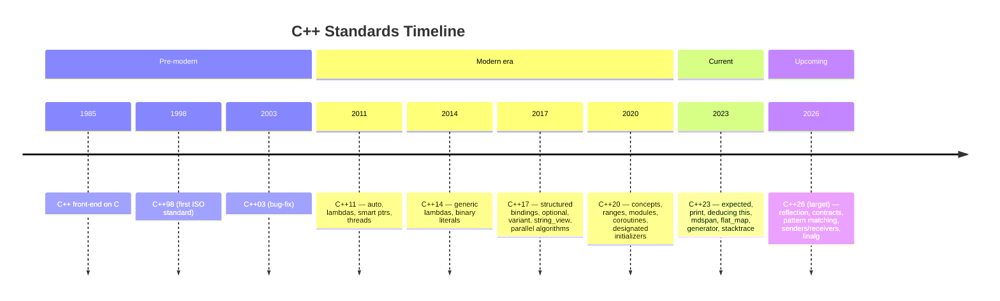

# 5. C++23 and Beyond

> [!note] Why this note exists
> C++23 has shipped, and C++26 is taking shape. This note covers the **C++23 features that matter most** (`std::expected`, `std::print`, deducing `this`, `std::mdspan`, `std::flat_map` / `std::flat_set`, `std::generator`, `std::stacktrace`, `std::print`), the **C++26 candidates** (reflection, contracts, pattern matching, senders/receivers, hazard pointers, RCU), and the **process** by which C++ evolves (ISO committees, the three-year cadence, the "train model"). It's a forward-looking note — to write modern C++ well, you need to know what's available now and what's coming.

## Why It Matters

C++ evolves. C++11 was a revolution; C++14 and C++17 were refinements; C++20 was another revolution (concepts, ranges, modules, coroutines); C++23 is a refinement of C++20 with several genuinely important additions; C++26 promises another wave.

Two reasons to keep up:

1. **Productivity.** Each feature exists because real codebases hit a wall and asked the committee for help. `std::expected` replaces ad-hoc error-handling. `std::print` replaces `std::cout <<` verbosity. `std::flat_map` is 5–10× faster than `std::map` for small maps. Using these well means writing less code that runs faster.

2. **Career.** C++ job listings in 2025 ask for "C++17 / C++20 experience." By 2027 they'll ask for C++23 and C++26. Knowing what's coming puts you ahead.

This note is your map: what's here, what's coming, and what to do about it.

## Background

### The C++ standardization process

C++ is standardized by **ISO/IEC JTC1/SC22/WG21** (commonly "WG21" or "the C++ committee"). It's a volunteer body of experts from industry, academia, and national standards bodies. Decisions are made by consensus at week-long meetings, three times a year.

The process to add a feature:

1. Someone writes an **Idea paper** (a few pages, problem statement).
2. The Evolution Working Group (EWG) accepts the idea, asks for a Proposal.
3. The author writes a **Proposal** (P-number, e.g., P2996 for reflection).
4. EWG reviews and refines. If approved, it goes to the Core Working Group (CWG) for wording.
5. CWG polishes wording. If approved, it goes to the full committee for a vote.
6. The feature is merged into the **Working Draft**.
7. After the committee approves the final draft, ISO publishes it as the new C++ Standard.

This takes years. A typical feature goes through 5–15 revisions of its proposal before merging.

### The three-year cadence

Since C++11, the committee targets a new standard every three years: C++14, C++17, C++20, C++23, C++26. The "train model" — the train leaves on time, whether your feature is on it or not. Features that miss a train aim for the next one.

This means:

- Each standard is incremental, not revolutionary (except C++11 and C++20).
- You can plan around the schedule — features that land in C++26 will be in your compiler by 2027.
- Compiler vendors implement features as proposals mature, often behind `-std=c++2c` or `-fexperimental-library` flags. By the time the standard ships, major compilers usually have most features.

### Feature-test macros

C++ uses **feature-test macros** (`__cpp_*`) to let you check whether a specific feature is available. This is more reliable than checking the standard version, because compilers ship features at different rates.

```cpp
#if __has_include(<expected>)
#  include <expected>
#endif

#ifdef __cpp_lib_expected
    auto r = doThing();
    if (r.has_value()) use(*r);
#endif
```

The full list is at <https://en.cppreference.com/w/cpp/feature_test>.

## Main Content

### C++23 highlights

#### `std::expected<T, E>` — error handling without exceptions

`std::expected` is the standard library's answer to Rust's `Result<T, E>`. A function that might fail returns `std::expected<T, ErrorCode>` instead of throwing or returning `std::pair<T, bool>`.

```cpp
#include <expected>
#include <string>

enum class ParseError { Empty, TooLong, InvalidChar };

std::expected<int, ParseError> parseInt(std::string_view s) {
    if (s.empty()) return std::unexpected(ParseError::Empty);
    if (s.size() > 9) return std::unexpected(ParseError::TooLong);
    int result = 0;
    for (char c : s) {
        if (c < '0' || c > '9') return std::unexpected(ParseError::InvalidChar);
        result = result * 10 + (c - '0');
    }
    return result;
}

int main() {
    auto r = parseInt("42");
    if (r.has_value()) {
        std::cout << "Got: " << *r << '\n';
    } else {
        std::cout << "Error: " << static_cast<int>(r.error()) << '\n';
    }

    // Monadic operations (C++23)
    auto doubled = parseInt("42").and_then([](int x) {
        return std::expected<int, ParseError>(x * 2);
    });
    auto errToMsg = parseInt("").or_else([](ParseError e) {
        return std::expected<int, ParseError>(0);   // fallback
    });

    // transform: map the success value
    auto asLong = parseInt("42").transform([](int x) { return static_cast<long>(x); });
}
```

`std::expected` provides monadic operations: `and_then`, `or_else`, `transform`, `transform_error`. These compose cleanly:

```cpp
auto result = readFile("data.txt")
    .and_then(parseJson)
    .and_then(extractConfig)
    .transform(toSettings);
```

Each step can fail; the chain short-circuits on the first failure. No exceptions, no nested `if`s. See [[13. Error Handling and Exceptions/5. std expected and std error code]].

#### `std::print` and `std::println` — fast, type-safe output

`std::print` (and `std::println` in C++23) replaces `std::cout` and `printf` with a fast, type-safe, format-string-based API.

```cpp
#include <print>
#include <string>

int main() {
    std::string name = "Alice";
    int age = 30;
    double pi = 3.14159;

    // Python-like format strings (based on std::format from C++20)
    std::println("Hello, {}! You are {} years old.", name, age);
    std::println("Pi to 3 decimals: {:.3f}", pi);
    std::println("Hex: {:#x}", 255);
    std::println("Binary: {:#b}", 10);
    std::println("Centered, width 20: {:^20}", "hi");

    // Compile-time format string checking (no more %s/%d mismatches)
    std::println("{:d}", 42);   // OK
    // std::println("{:d}", "hi");  // COMPILE ERROR — type mismatch
}
```

`std::print` is also faster than `std::cout` — no iostream overhead, no locale sync, direct writes to stdout (or `FILE*`).

#### Deducing `this` — explicit object parameter

C++23 lets you write member functions with an explicit `this` parameter, deduced like any template parameter. This unlocks:

- **Const / non-const overloads without duplication.**
- **Lvalue / rvalue overloads without duplication.**
- **CRTP without the base class trick.**
- **Recursive lambdas.**

```cpp
struct String {
    std::string data;

    // One function serves const, non-const, lvalue, rvalue
    template <class Self>
    auto&& operator[](this Self&& self, size_t i) {
        return std::forward<Self>(self).data[i];
    }

    // Recursive lambda via deducing this
    void traverse(this auto& self, const Tree& t) {
        if (t.left)  self.traverse(*t.left);
        visit(t);
        if (t.right) self.traverse(*t.right);
    }
};
```

The `this Self&&` syntax deduces `Self` as `String&`, `const String&`, `String&&`, or `const String&&` based on the call. A single function body serves all four — no more 2× or 4× duplication.

#### `std::mdspan` — multidimensional spans

`std::mdspan` is a non-owning view into a contiguous block of memory, with a multidimensional shape. It's the multidimensional `std::span`.

```cpp
#include <mdspan>
#include <vector>
#include <iostream>

int main() {
    std::vector<int> data(3 * 4);   // 3 rows, 4 cols
    std::mdspan<int, std::dextents<size_t, 2>> mat(data.data(), 3, 4);

    mat[1, 2] = 42;        // row 1, col 2 — note the comma (C++23 subscript)
    mat(0, 0) = 99;        // function-call syntax also works

    for (size_t i = 0; i < mat.extent(0); ++i) {
        for (size_t j = 0; j < mat.extent(1); ++j) {
            std::cout << mat[i, j] << ' ';
        }
        std::cout << '\n';
    }

    // Submdspan (C++26 candidate)
    // auto row1 = std::submdspan(mat, 1, std::full_extent);
}
```

`std::mdspan` is the foundation of modern C++ numerical libraries — it's the standard way to pass "a matrix" without owning the data.

#### `std::flat_map` and `std::flat_set` — sorted containers backed by contiguous storage

A `std::flat_map<K, V>` is a sorted associative container backed by a `std::vector<std::pair<K, V>>` (or two vectors). Lookup is O(log N) via binary search; iteration is contiguous (cache-friendly).

```cpp
#include <flat_map>
#include <string>
#include <iostream>

int main() {
    std::flat_map<std::string, int> ages;
    ages["Alice"] = 30;
    ages["Bob"] = 25;
    ages["Charlie"] = 35;

    // Iteration is contiguous — cache-friendly
    for (const auto& [name, age] : ages) {
        std::cout << name << ": " << age << '\n';
    }

    // Lookup is binary search
    auto it = ages.find("Bob");
    if (it != ages.end()) std::cout << "Bob is " << it->second << '\n';
}
```

Trade-offs vs `std::map`:

| Operation | `std::map` | `std::flat_map` |
|-----------|-----------|------------------|
| Lookup | O(log N), cache-miss-prone (pointer chase) | O(log N), cache-friendly (binary search on vector) |
| Insertion | O(log N), no shifting | O(N) insertion (shifting), but small constant |
| Iteration | Pointer chasing, slow | Contiguous, fast |
| Memory per node | ~32–64 bytes + per-node alloc overhead | 2× K+V (no overhead) |

For small-to-medium maps (up to ~1000 elements), `std::flat_map` is often 5–10× faster than `std::map` for lookups and iteration. For very large maps with frequent insertions, `std::map` may win because insertions are O(log N) instead of O(N).

#### `std::generator` — standard library coroutines

`std::generator<T>` (C++23) is the standard library's synchronous generator type. No more hand-rolling a `Generator<T>` class.

```cpp
#include <generator>
#include <iostream>

std::generator<int> fibonacci() {
    int a = 0, b = 1;
    while (true) {
        co_yield a;
        auto c = a + b;
        a = b;
        b = c;
    }
}

std::generator<int> take(std::generator<int> source, size_t n) {
    size_t i = 0;
    for (int x : source) {
        if (i++ >= n) co_return;
        co_yield x;
    }
}

int main() {
    for (int x : take(fibonacci(), 10)) {
        std::cout << x << ' ';
    }
    // 0 1 1 2 3 5 8 13 21 34
}
```

See [[20. Advanced C++ Topics/1. Coroutines Deep Dive]] for the underlying machinery.

#### `std::stacktrace` — programmatic stack traces

`std::stacktrace` lets you capture a stack trace at runtime, for logging, error reporting, or debugging.

```cpp
#include <stacktrace>
#include <iostream>
#include <stdexcept>

void deepFunction(int depth) {
    if (depth == 0) {
        throw std::runtime_error("Boom at:\n" +
            std::to_string(std::stacktrace::current()));
    }
    deepFunction(depth - 1);
}

int main() {
    try {
        deepFunction(5);
    } catch (const std::exception& e) {
        std::cerr << e.what() << '\n';
    }
}
```

The output includes function names, source files, and line numbers (if debug info is available). Link with `-lstdc++_exp` on GCC, or pass `-fstack-usage` and configure build appropriately.

#### Other C++23 highlights

- **`std::span` improvements** — `first<N>()`, `last<N>()`, `subspan<N>()` as static-extent variants.
- **`std::byteswap`** — endian conversion.
- **`std::to_underlying`** — get the integer value of an enum.
- **`std::unreachable`** — mark unreachable code; UB if reached.
- **`std::assume_aligned`** — tell the compiler a pointer is aligned.
- **`if consteval`** — clearer than `if std::is_constant_evaluated()`.
- **Multidimensional subscript `a[i, j]`** — operator[] with multiple args.
- **`static operator()`** — static call operators.
- **`static operator[]`** — static subscript.
- **`auto(x)` and `auto{x}`** — explicit decay-copy.
- **`#elifdef` and `#elifndef`** — preprocessor improvements.
- **`std::source_location::current()`** in more places.
- **`std::is_scoped_enum`** — type trait.
- **`std::ranges::to`** — materialize views (see [[20. Advanced C++ Topics/3. Ranges Deep Dive]]).
- **Many new range adaptors** — `enumerate`, `zip`, `chunk`, `slide`, `stride`, `repeat`, `adjacent`, `concat`.
- **`std::pmr` polymorphic allocator improvements**.
- **`std::format` improvements** — range formatting, pointer formatting.
- **`std::optional::and_then`, `or_else`, `transform`** — monadic optional.
- **`std::move_only_function`** — replacement for `std::function` that supports move-only types.
- **`std::basic_string_view::contains`** — like `string::contains`.
- **`std::ranges::views::adjacent<N>`** — sliding window.
- **`std::byteswap`** — endian conversion.
- **`<stdfloat>`** — extended floating-point types (`std::float16_t`, `std::float32_t`, `std::float64_t`, `std::bfloat16_t`).

### C++26 candidates

C++26 is being finalized as of this writing. Confirmed/likely features:

#### Reflection (P2996)

See [[20. Advanced C++ Topics/4. Reflection (Future)]] for the deep dive. Compile-time introspection of types with `^Type` and `[: info :]` syntax.

#### Contracts (MVP)

Contracts let you annotate functions with preconditions, postconditions, and assertions:

```cpp
int divide(int a, int b)
    pre(b != 0)
    post(r: r * b == a)
{
    return a / b;
}

void insert(Container& c, int x)
    pre(c.size() < c.max_size())
{
    c.push_back(x);
    assert(c.size() <= c.max_size());
}
```

The MVP (minimum viable product) for C++26 includes `pre`, `post`, and `assert` contract annotations, with a build-level control (off / audit / enforce). Violation behavior is customizable.

Contracts have been proposed for years; the C++26 version is the most focused yet, with the goal of shipping *something* even if not the full vision.

#### Pattern matching (P2688)

Pattern matching brings Rust/Haskell/Scala-style destructuring to C++:

```cpp
auto inspect(const Shape& s) -> double {
    return s match {
        [](const Circle& c)      { return 3.14 * c.r * c.r; },
        [](const Rectangle& r)   { return r.w * r.h; },
        [](const Triangle& t)    { return 0.5 * t.base * t.height; },
    };
}

auto describe(const auto& x) -> std::string {
    return x match {
        0           => "zero",
        1           => "one",
        is<int>     => "some int",
        is<std::string> => "a string",
        _           => "something else",
    };
}
```

(Exact syntax is still being finalized as of mid-2024. The above is illustrative.)

#### Senders and receivers (P2300 — `std::execution`)

`std::execution` provides a standardized model for asynchronous computation, built on top of coroutines. It's the future of structured concurrency in C++.

```cpp
#include <execution>

int main() {
    std::execution::run_loop loop;
    auto sched = loop.get_scheduler();

    auto work = std::execution::just(42)
              | std::execution::then([](int x) { return x * 2; })
              | std::execution::then([](int x) { std::cout << x << '\n'; });

    std::execution::start_detached(std::move(work));
    loop.run();
}
```

The design is composable: you can build complex async graphs by piping senders through transformers. It's the foundation that may eventually replace `std::async`, `std::thread`, and many uses of coroutines.

#### Hazard pointers and RCU

Read-Copy-Update (RCU) and hazard pointers are lock-free synchronization primitives for "many readers, rare writers" scenarios. They've been used in the Linux kernel for decades; C++26 standardizes them as `std::rcu` and `std::hazard_pointer`.

#### `std::linalg`

A standard linear algebra library built on `std::mdspan`. Provides BLAS-like operations (matrix multiply, dot product, etc.) that work on any mdspan, with optional SIMD acceleration.

#### Other C++26 candidates

- **`std::text_encoding`** — runtime text encoding detection.
- **`std::debugging`** — `std::is_debugger_present()`, `std::breakpoint()`.
- **`std::inplace_vector`** — a vector with inline storage (no heap allocation up to N).
- **`std::execution`** continuation of P2300.
- **Submdspan** — slicing `std::mdspan`.
- **More reflection** — beyond the initial P2996.
- **`constexpr` improvements** — more standard library functions usable at compile time.
- **`<linalg>`** — BLAS-like operations.
- **Linear algebra over `std::mdspan`**.
- **`std::ratio` deprecation in favor of fixed-point**.

### The C++ evolution timeline



### Feature roadmap for a working developer

```mermaid
flowchart LR
    subgraph Now["Use today (C++23)"]
        N1["std::expected<br/>for error handling"]
        N2["std::print / println"]
        N3["Deducing this"]
        N4["std::mdspan"]
        N5["std::flat_map / flat_set"]
        N6["std::generator"]
        N7["std::stacktrace"]
        N8["New range adaptors<br/>(enumerate, zip, chunk, slide)"]
        N9["ranges::to"]
        N10["std::move_only_function"]
    end
    subgraph Next["Use soon (C++26)"]
        C1["Reflection (P2996)"]
        C2["Contracts"]
        C3["Pattern matching"]
        C4["std::execution (P2300)"]
        C5["std::linalg"]
        C6["std::inplace_vector"]
        C7["RCU + hazard pointers"]
    end
    Now --> Next
    style Now fill:#c8e6c9
    style Next fill:#fff4c8
```



## Code Examples

### `std::expected` pipeline

```cpp
#include <expected>
#include <string>
#include <string_view>
#include <fstream>

std::expected<std::string, std::string> readFile(std::string_view path) {
    std::ifstream f{std::string(path)};
    if (!f) return std::unexpected("cannot open " + std::string(path));
    std::string content((std::istreambuf_iterator<char>(f)),
                         std::istreambuf_iterator<char>());
    return content;
}

std::expected<int, std::string> parseCount(std::string_view s) {
    int n;
    auto [_, ec] = std::from_chars(s.data(), s.data() + s.size(), n);
    if (ec != std::errc{}) return std::unexpected("parse error");
    return n;
}

std::expected<int, std::string> readCount(std::string_view path) {
    return readFile(path)
        .and_then([](const std::string& s) { return parseCount(s); });
}

int main() {
    auto result = readCount("count.txt");
    if (result) {
        std::println("Count: {}", *result);
    } else {
        std::println("Error: {}", result.error());
    }
}
```

### Deducing `this` for const-correct overloads

```cpp
#include <vector>

class Repository {
    std::vector<int> data_;
public:
    // Single function: const, non-const, lvalue, rvalue — all four
    template <class Self>
    decltype(auto) operator[](this Self&& self, size_t i) {
        return std::forward<Self>(self).data_[i];
    }

    template <class Self>
    decltype(auto) front(this Self&& self) {
        return std::forward<Self>(self).data_.front();
    }
};

int main() {
    Repository r;
    r[0] = 42;             // non-const lvalue — assignable

    const Repository& cr = r;
    int x = cr[0];         // const lvalue — read-only

    int y = Repository{}.front();   // rvalue — moved-from
}
```

### `std::mdspan` for matrix operations

```cpp
#include <mdspan>
#include <vector>
#include <numeric>

// 2D matrix multiply, cache-friendly via mdspan
void matmul(
    std::mdspan<const double, std::dextents<size_t, 2>> A,
    std::mdspan<const double, std::dextents<size_t, 2>> B,
    std::mdspan<double, std::dextents<size_t, 2>> C)
{
    for (size_t i = 0; i < A.extent(0); ++i) {
        for (size_t j = 0; j < B.extent(1); ++j) {
            double sum = 0;
            for (size_t k = 0; k < A.extent(1); ++k) {
                sum += A[i, k] * B[k, j];
            }
            C[i, j] = sum;
        }
    }
}

int main() {
    std::vector<double> aData(4 * 4, 1.0);
    std::vector<double> bData(4 * 4, 2.0);
    std::vector<double> cData(4 * 4);

    std::mdspan A(aData.data(), 4, 4);
    std::mdspan B(bData.data(), 4, 4);
    std::mdspan C(cData.data(), 4, 4);

    matmul(A, B, C);
}
```

### `std::generator` for lazy pipelines

```cpp
#include <generator>
#include <ranges>
#include <iostream>

std::generator<int> naturals(int start = 1) {
    while (true) co_yield start++;
}

std::generator<int> filter(std::generator<int> src, auto pred) {
    for (int x : src) {
        if (pred(x)) co_yield x;
    }
}

std::generator<int> take(std::generator<int> src, int n) {
    int i = 0;
    for (int x : src) {
        if (i++ >= n) co_return;
        co_yield x;
    }
}

int main() {
    auto evens = filter(naturals(), [](int x) { return x % 2 == 0; });
    auto firstFive = take(std::move(evens), 5);

    for (int x : firstFive) {
        std::cout << x << ' ';
    }
    // 2 4 6 8 10
}
```

### `std::stacktrace` for error reporting

```cpp
#include <stacktrace>
#include <iostream>
#include <stdexcept>

void level3() {
    throw std::runtime_error{"deep failure"};
}
void level2() { level3(); }
void level1() { level2(); }

int main() {
    try {
        level1();
    } catch (const std::exception& e) {
        std::cerr << "Error: " << e.what() << "\n"
                  << "Stack:\n"
                  << std::stacktrace::current() << '\n';
    }
}
```

### Pattern matching (C++26, speculative syntax)

```cpp
#include <variant>
#include <string>
#include <iostream>

struct Circle { double r; };
struct Rectangle { double w, h; };
struct Triangle { double a, b, c; };

using Shape = std::variant<Circle, Rectangle, Triangle>;

double area(const Shape& s) {
    return s match {
        [](const Circle& c) { return 3.14159 * c.r * c.r; },
        [](const Rectangle& r) { return r.w * r.h; },
        [](const Triangle& t) {
            double s = (t.a + t.b + t.c) / 2;
            return std::sqrt(s * (s - t.a) * (s - t.b) * (s - t.c));
        },
    };
}
```

(Actual syntax may differ when standardized.)

### Senders and receivers (C++26, P2300)

```cpp
#include <execution>
#include <iostream>

int main() {
    auto work = std::execution::just(42)
              | std::execution::then([](int x) { return x * 2; })
              | std::execution::then([](int x) { std::cout << x << '\n'; });

    std::execution::sync_wait(std::move(work));
    // Output: 84
}
```

## Common Pitfalls

> [!danger] Pitfall 1 — Assuming a feature is available just because the standard shipped
> Compiler support lags. `std::expected` is in C++23 but wasn't fully in GCC until 13, Clang 17, MSVC 19.36. Check feature-test macros before using.

> [!danger] Pitfall 2 — Mixing standard versions carelessly
> Compiling one TU with `-std=c++20` and another with `-std=c++23` and linking them can cause ABI surprises. Use one standard across the project.

> [!danger] Pitfall 3 — Over-using `std::expected` for control flow
> `std::expected` is for *errors*, not *normal alternatives*. If your function commonly fails, consider a `std::variant<T, Reason>` or redesign.

> [!danger] Pitfall 4 — Treating `std::flat_map` as a drop-in `std::map` replacement
> For very large maps with frequent insertions, `std::flat_map` is O(N) per insert — much slower than `std::map`'s O(log N). Profile.

> [!danger] Pitfall 5 — Forgetting `std::println` requires `<print>`
> And the runtime may need a recent libstdc++/libc++.

> [!danger] Pitfall 6 — Deducing `this` with forward that dangles
> `decltype(auto) operator[](this Self&& self, ...)` must `std::forward<Self>(self).data_[i]` — forget the forward and you lose rvalue-ness.

> [!danger] Pitfall 7 — Multidimensional subscript `a[i, j]` confusion with comma operator
> Pre-C++23, `a[i, j]` was `a[(i, j)]` = `a[j]` (comma operator!). C++23 made it multidimensional subscript. Check your compiler version before relying on this.

> [!danger] Pitfall 8 — Trusting speculative C++26 syntax
> Pattern matching and contracts are still being designed. Code against them only for experimentation, not production.

> [!danger] Pitfall 9 — Not updating build flags
> Use `-std=c++23` (or `-std=c++2b` for older compilers) and link the right runtime (`-lstdc++_exp` for `std::stacktrace` on GCC).

> [!danger] Pitfall 10 — Ignoring feature-test macros
> `__cpp_lib_expected`, `__cpp_lib_print`, etc. are the portable way to check. Don't check compiler version numbers.

## Tips and Tricks

- **Adopt `std::expected` aggressively.** It replaces ad-hoc error codes, exceptions-for-control-flow, and `std::pair<T, bool>` patterns.
- **Switch to `std::print` / `std::println`.** Faster and type-safe.
- **Use `std::flat_map` for small maps** (up to ~1000 elements) — usually much faster than `std::map`.
- **Use deducing `this`** to eliminate const/non-const duplication.
- **Use `std::mdspan`** for any multidimensional array API.
- **Use `std::generator`** instead of hand-rolled generators.
- **Add `std::stacktrace` to error handlers** — invaluable in production.
- **Track C++26 progress on the ISO C++ website and cppreference.**
- **Check feature-test macros** (`__cpp_lib_*`) before using new features.
- **Use Compiler Explorer (godbolt.org)** to test feature support across compilers.
- **Read the C++ Standard Library issue list** at <https://cplusplus.github.io/stdlibrary-issues/> — bugs and clarifications.
- **Watch CppCon talks by Bjarne Stroustrup, Herb Sutter, and committee members** for the rationale behind changes.
- **Use `-std=c++2c` (or `-std=c++26`) on trunk compilers** to experiment with C++26 features early.
- **Join ISO C++ forums** (Slack, Reddit) for community discussion.
- **Read the Trip Reports** after each committee meeting — they're posted on <https://isocpp.org/blog>.
- **For libraries you depend on, check their C++23/C++26 adoption timeline.** Major libraries (Boost, Folly, Abseil) adopt new features gradually.
- **Don't wait to use C++23.** Modern compilers have full support as of 2024.

## Active Recall

1. Name five features added in C++23 and one use case for each.
2. What does `std::expected<T, E>` provide that exceptions don't?
3. Write a chain of three functions that return `std::expected` and compose with `and_then`.
4. What is "deducing `this`"? Give an example of how it eliminates const/non-const duplication.
5. What's the difference between `std::map` and `std::flat_map`? When does each win?
6. Write a `std::generator<int>` that yields the first N Fibonacci numbers.
7. What does `std::stacktrace::current()` return, and what do you need to link?
8. List four features targeted for C++26.
9. What is the ISO process for adding a feature to C++? Roughly how long does it take?
10. What's the C++ "train model"? Why was it adopted?
11. What is `std::execution` (P2300)? What problem does it solve?
12. How do you check at compile time whether `std::expected` is available?

## Next Steps

- Read [[8. Modern C++/9. C++20 and C++23 New Features]] — the user-level summary of C++20/23 features.
- Read [[13. Error Handling and Exceptions/5. std expected and std error code]] — deep dive on `std::expected`.
- Read [[11. STL Deep Dive/3. Associative Containers]] — covers `std::map`, which `std::flat_map` complements.
- Read [[20. Advanced C++ Topics/1. Coroutines Deep Dive]] — `std::generator` is built on coroutines.
- Read [[20. Advanced C++ Topics/2. Modules]] — `import std;` is C++23.
- Read [[20. Advanced C++ Topics/3. Ranges Deep Dive]] — many new range adaptors are C++23.
- Read [[20. Advanced C++ Topics/4. Reflection (Future)]] — the leading C++26 reflection proposal.
- Read [[19. Performance Optimization/1. CPU Cache Locality]] — `std::flat_map` and `std::mdspan` are cache-friendly.
- Cross-reference cppreference.com for the authoritative feature list per standard.
- Read Herb Sutter's trip reports after each committee meeting on <https://isocpp.org/blog>.
- Read the P2996 (reflection) and P2300 (senders/receivers) proposals for the canonical C++26 candidates.
- Watch Bryce Lelbach's annual CppCon "C++23 / C++26 Status" talks for the most up-to-date picture.
