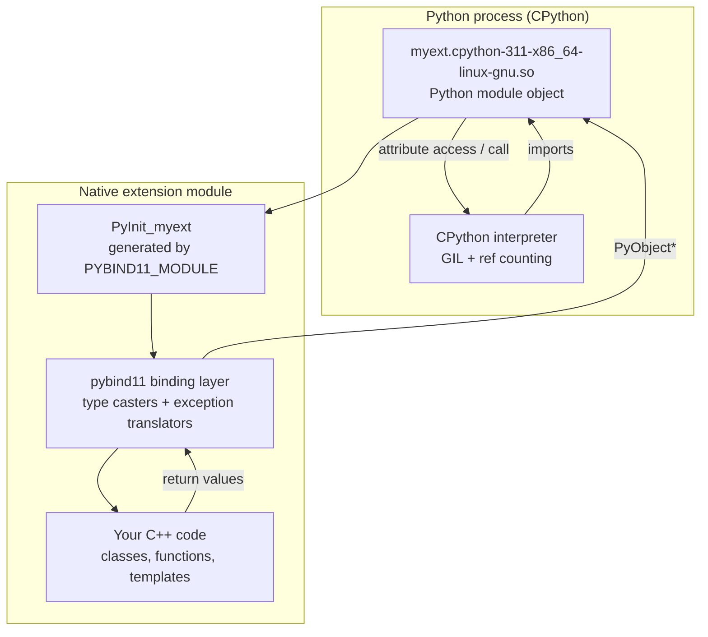
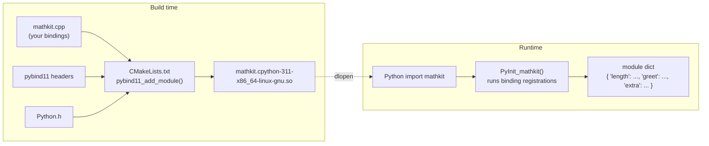

# pybind11 Basics

## Why

Python is unbeatable for prototyping, scripting, and the broader data and ML ecosystem. C++ is unbeatable when you need raw speed, deterministic memory, fine-grained hardware control, or seamless access to existing native libraries. Most production codebases that take performance seriously eventually need **both**: a Python control plane that orchestrates a C++ computational core.

The Python/C API that ships with CPython is powerful but verbose, error-prone, and requires you to manually manage reference counting, type objects, module initialization, and exception translation. Hand-writing extensions in the raw C API takes hundreds of lines for a single class. **pybind11** is a lightweight, header-only C++11 library that wraps the Python C API behind an ergonomic, declarative syntax so that binding a C++ function or class takes a single line of code.

This note covers the foundations: what pybind11 is, why it dominates the alternatives, how to install it, the canonical "hello world" extension, and how to integrate it with CMake so it slots into a real build system. The next three notes in [[2. Calling C++ from Python]], [[3. Calling Python from C++]], and [[4. NumPy Interoperability]] build directly on top of this foundation.

## Background

### A 60-second history

| Year | Milestone |
|------|-----------|
| 1991 | CPython exposes the raw Python/C API. Writing extensions is painful. |
| 2002 | **Boost.Python** ships: C++ templates that wrap the C API. Powerful, but pulls in a big chunk of Boost and compiles slowly. |
| 2009 | **Cython** matures: a Python-like language that emits C. Great for performance, but adds a new language to the toolchain. |
| 2013 | **cffi** appears: clean FFI for calling C from Python, but C++-unaware. |
| 2016 | **pybind11** is born (Wenzel Jakob and collaborators) as a stripped-down Boost.Python successor that needs only a C++11 compiler and Python headers. |
| 2020+ | pybind11 becomes the de facto standard for ML frameworks (PyTorch internals, TVM, nanobind's lineage), scientific Python (scipy, Open3D, libigl). |

### What pybind11 actually is

At its core, pybind11 is a single header-only C++ library (`<pybind11/pybind11.h>`) that:

1. Spawns C++ templated wrappers around `PyObject*` — the universal Python object pointer.
2. Exposes a declarative DSL (`py::class_<T>`, `m.def(...)`) that registers C++ entities in a Python module.
3. Generates the module-init function (`PyInit_<modulename>`) that CPython requires, behind a `PYBIND11_MODULE` macro.
4. Translates C++ exceptions to Python exceptions, and vice versa.
5. Performs automatic type conversion ("casting") between C++ types (`int`, `std::string`, `std::vector`, your classes) and Python objects.
6. Manages the **GIL** (Global Interpreter Lock) and **reference counting** automatically in the common case.

Because it is header-only, there is no `.so` to link against — you only need Python's development headers and a C++11 (or newer) compiler.

### How pybind11 compares to alternatives

| Tool | Strength | Weakness | Use when |
|------|----------|----------|----------|
| **ctypes / cffi** | Zero compilation, pure Python, calls into C ABI directly. | No C++ support (namespaces, classes, templates, exceptions). Manual struct layouts. | You have a flat C API and want to call it from Python without building anything. |
| **Cython** | Lets you write "Python with C types" and gets very fast. Compiles to C. | New language to learn; build pipeline; weak C++ templates story. | You want to speed up pure-Python code or wrap moderate-complexity C. |
| **Boost.Python** | Same idea as pybind11, mature. | Heavy Boost dependency, slow compile times, more verbose. | You are already deep in Boost and need the older library. |
| **nanobind** | pybind11's spiritual successor by the same author; smaller, faster. | Newer ecosystem; smaller install base. | New projects that want a leaner alternative (worth tracking). |
| **pybind11** | C++11 only, header-only, clean syntax, excellent NumPy/Eigen support, huge ecosystem. | Compile times can be heavy on big bindings; some boilerplate. | Default choice for binding C++ to Python today. |

> [!tip] The elevator pitch
> If you can write `void f(int);` in C++, you can expose it to Python with `m.def("f", &f);`. That is the whole value proposition.

## Main content

### Architecture at a glance



The key insight: at runtime there is no "Python code" and "C++ code" calling each other across a slow boundary. There is a single process. CPython owns the interpreter, the GIL, and the garbage collector. Your `.so` is just a dynamically-loaded shared object that exports the `PyInit_<name>` symbol. pybind11 is the glue that converts between `PyObject*` and your C++ types at the boundary.

### Installation

There are three common installation paths.

#### Option A — pip (recommended for Python-only workflows)

```bash
python -m pip install pybind11
```

This installs the pybind11 headers **and** a small `pybind11` command-line tool that knows how to tell your build system where the headers live:

```bash
pybind11 --includes    # -I /usr/include/python3.11 -I /path/to/pybind11/include
pybind11 --cmakedir    # path to pybind11's CMake helper files
pybind11 --version
```

#### Option B — system package manager

```bash
# Debian / Ubuntu
sudo apt install pybind11-dev
# Fedora
sudo dnf install pybind11-devel
# macOS (Homebrew)
brew install pybind11
```

#### Option C — vendor the headers in your repo

```bash
git clone https://github.com/pybind/pybind11.git third_party/pybind11
# Then either add as a CMake subdirectory or copy include/pybind11 into your include path.
```

> [!note] Whatever path you choose, you also need Python development headers
> On Debian/Ubuntu: `sudo apt install python3-dev`. On macOS with Homebrew Python these ship with the interpreter. Without `<Python.h>`, nothing compiles.

### Hello world

The canonical pybind11 "hello world" is a 6-line C++ file.

```cpp
// hello.cpp
#include <pybind11/pybind11.h>
namespace py = pybind11;

int add(int a, int b) { return a + b; }

PYBIND11_MODULE(hello, m) {
    m.doc() = "A minimal pybind11 example";
    m.def("add", &add, "Add two integers");
}
```

The `PYBIND11_MODULE(name, variable)` macro:
- Defines the CPython entry point `PyInit_hello`.
- Creates a `py::module_` object named `m` that represents your module.
- The body of the block runs once when Python first imports the module — that is where you register functions, classes, and so on.

### Building by hand

You can compile the example with one g++ invocation:

```bash
# Linux / macOS
c++ -O3 -Wall -shared -std=c++17 -fPIC \
    $(python -m pybind11 --includes) \
    hello.cpp \
    -o hello$(python3-config --extension-suffix)
```

Key flags:
- `-shared -fPIC` — produce a position-independent shared object (a `.so` on Linux, `.dylib`-ish on macOS, `.pyd` on Windows).
- `$(python -m pybind11 --includes)` — expands to `-I` flags for both `<Python.h>` and pybind11 headers.
- `$(python3-config --extension-suffix)` — produces the correct suffix (`cpython-311-x86_64-linux-gnu.so` on CPython 3.11 Linux) so that `import hello` finds the file.

Then, from the same directory:

```python
import hello
print(hello.add(2, 3))     # 5
print(hello.__doc__)       # A minimal pybind11 example
```

> [!warning] Suffix matters
> If your file is named `hello.so` on a CPython 3.11 interpreter, the import will fail because the loader looks for `hello.cpython-311-x86_64-linux-gnu.so` first. Always use `python3-config --extension-suffix` (or let CMake handle it).

### CMake integration (the production path)

Hand-rolled build commands are fine for a one-file demo but break down quickly. The production-ready path is CMake + `pybind11_add_module`:

```cmake
# CMakeLists.txt
cmake_minimum_required(VERSION 3.15)
project(hello_world LANGUAGES CXX)

set(CMAKE_CXX_STANDARD 17)
set(CMAKE_CXX_STANDARD_REQUIRED ON)
set(CMAKE_POSITION_INDEPENDENT_CODE ON)

# Find pybind11 (pip-installed or system).
find_package(pybind11 REQUIRED CONFIG)

# pybind11_add_module(<module_name> [STATIC|SHARED|MODULE] source1 [source2 ...])
pybind11_add_module(hello hello.cpp)

# Optional: turn on LTO, set optimization level, link OpenMP, etc.
target_link_libraries(hello PRIVATE pybind11::module)
```

`pybind11_add_module` is a thin wrapper around CMake's `add_library(... MODULE ...)` that:

1. Sets the correct suffix automatically (`.cpython-311-x86_64-linux-gnu.so`, etc.).
2. Adds the right `-fPIC`, `-shared`, Python header, and Python library flags.
3. On Windows, attaches the correct `.pyd` linker settings.
4. Defines `PYBIND11_CPP_STANDARD` to match your `CMAKE_CXX_STANDARD`.

Build it:

```bash
cmake -S . -B build -DCMAKE_BUILD_TYPE=Release
cmake --build build -j
```

The compiled module lands in `build/hello.cpython-311-x86_64-linux-gnu.so`. Add `build/` to your `PYTHONPATH` (or use `pip install -e .` with scikit-build-core) to `import hello` from any directory.

### A slightly bigger module

Let's expose two functions and a module-level constant so the structure becomes clearer.

```cpp
// mathkit.cpp
#include <pybind11/pybind11.h>
#include <pybind11/stl.h>   // brings in std::vector <-> list conversion
#include <cmath>
#include <vector>
#include <string>

namespace py = pybind11;

double length(const std::vector<double>& v) {
    double s = 0.0;
    for (double x : v) s += x * x;
    return std::sqrt(s);
}

std::string greet(const std::string& name) {
    return "Hello, " + name + "!";
}

PYBIND11_MODULE(mathkit, m) {
    m.doc() = "Tiny math/string utilities";

    // Constants and attributes
    m.attr("__version__") = "0.1.0";

    // Functions with explicit docstrings and keyword argument names
    m.def("length", &length, py::arg("v"),
          "Compute the Euclidean norm of a vector.");
    m.def("greet", &greet, py::arg("name"),
          "Return a friendly greeting.");

    // Submodule: mathkit.extra
    py::module_ extra = m.def_submodule("extra", "Extra helpers");
    extra.def("pi", []() { return M_PI; });
}
```

A few things worth pointing out:
- `pybind11/stl.h` is what enables `std::vector<double>`  Python `list` conversion. Without it, the compiler emits a long template error.
- `py::arg("v")` makes the parameter name visible to Python so that `mathkit.length(v=[3, 4])` works and `help(mathkit.length)` shows `length(v)`.
- `m.def_submodule` lets you organize larger libraries hierarchically.

From Python:

```python
import mathkit
print(mathkit.greet("Ada"))        # Hello, Ada!
print(mathkit.length([3, 4]))      # 5.0
print(mathkit.__version__)         # 0.1.0
print(mathkit.extra.pi())          # 3.141592653589793
```

### Mermaid: pybind11 architecture revisited



### Common Pitfalls

> [!danger] Forgetting `pybind11/stl.h`
> If you bind a function that takes `std::vector<T>` and get a 30-line template error ending in `static_assert: pybind11::type_caster ... not found`, you forgot `#include <pybind11/stl.h>`. The same applies to `<pybind11/stl/filesystem.h>` for `std::filesystem::path`, `<pybind11/complex.h>` for `std::complex`, and `<pybind11/eigen.h>` for Eigen matrices.

> [!danger] Wrong module name in `PYBIND11_MODULE`
> The first argument must match the file name (minus the suffix). If your file is `mymath.cpp` and you write `PYBIND11_MODULE(math, m)`, CPython will fail to import with a cryptic "dynamic module does not define module export function" error.

> [!danger] Mixing Python versions
> A module compiled against Python 3.11 will not import in Python 3.12. CPython's ABI changes between minor versions. Always rebuild when you upgrade Python, or use `pybind11`'s stable ABI support (`Py_LIMITED_API`) if you need cross-version wheels.

> [!warning] Including `<Python.h>` before `<pybind11/pybind11.h>`
> Always include pybind11 first. If `<Python.h>` is included with different macros than pybind11 expects, you get ODR violations and bizarre crashes. pybind11's header guards against this, but mixing orderings inside precompiled headers can still bite you.

> [!warning] Not setting `CMAKE_POSITION_INDEPENDENT_CODE`
> Without `-fPIC`, linking errors or runtime crashes on certain platforms are guaranteed. `pybind11_add_module` sets this for you, but if you mix in plain `add_library` calls for helper code, set it explicitly.

### Tips and Tricks

- **Use `py::arg().default_value(...)` for default arguments**: `m.def("f", &f, py::arg("x").default_value(42))`. pybind11 doesn't read C++ default values for you.
- **Add `py::module_::import("sys").attr("modules")` checks** when debugging import errors — a half-loaded module is usually a sign of an exception in your `PYBIND11_MODULE` body.
- **Turn on `-DPYBIND11_ASSERT_GIL_HELD_INCREF_DECREF`** in debug builds to catch GIL-related refcount bugs early.
- **Use `py::print()` instead of `std::cout`** in bound code so output respects `sys.stdout` redirections and flushes correctly.
- **Keep binding code in separate `.cpp` files** from your library code. Your library should compile and run with zero Python dependencies; bindings are just a thin shell on top. This keeps unit tests of the C++ core clean.
- **Consider nanobind for new greenfield projects**. It is API-compatible in spirit, faster to compile, and produces smaller binaries. Worth reading its docs even if you stay on pybind11.

### Active Recall

> [!question] Q1
> What is the single C++ macro that pybind11 requires in every extension module, and what two arguments does it take?
>
> **Answer:** `PYBIND11_MODULE(name, variable)`, where `name` must match the file name (sans suffix) and `variable` is the `py::module_` instance you populate.

> [!question] Q2
> Why does pybind11 need `<pybind11/stl.h>` to bind a function that returns `std::vector<int>`?
>
> **Answer:** pybind11 ships type casters for built-in types in the core header, but casters for STL containers live in a separate header to keep compile times low. Without it, the compiler cannot find a `type_caster<std::vector<int>>` and fails with a static_assert.

> [!question] Q3
> Name three things `pybind11_add_module` does for you that you would otherwise have to set up manually with raw CMake.
>
> **Answer:** (1) Sets the correct platform-dependent module suffix (e.g. `cpython-311-x86_64-linux-gnu.so`). (2) Adds `-fPIC` and the right linker flags for a Python extension module. (3) Adds `-I` flags for `<Python.h>` and pybind11 headers, and links the Python library correctly for the current interpreter.

> [!question] Q4
> What is the GIL and why does pybind11 need to know about it?
>
> **Answer:** The Global Interpreter Lock is a mutex inside CPython that serializes access to Python objects. Any code that creates, destroys, or mutates `PyObject*` values must hold the GIL. pybind11 automatically acquires the GIL on every call into your bindings, and provides `py::gil_scoped_release` / `py::gil_scoped_acquire` to release it for long-running C++ work so other Python threads can proceed.

### Next Steps

- Move on to [[2. Calling C++ from Python]] to learn the full binding DSL: classes, methods, enumerations, properties, exception translation, and explicit GIL control.
- Then [[3. Calling Python from C++]] to flip the direction and embed Python inside a C++ application.
- Finish with [[4. NumPy Interoperability]] to share large arrays with NumPy without copying.
- Cross-reference [[14. Concurrency and Multithreading/2. std thread and std jthread]] and [[14. Concurrency and Multithreading/4. Condition Variables]] when you start mixing C++ threads with Python — the GIL makes this subtle.
- For build system details, see [[12. Build Systems and Project Structure/5. CMake Basics]] and [[12. Build Systems and Project Structure/6. CMake Advanced]].
