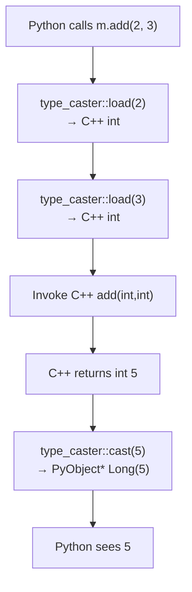
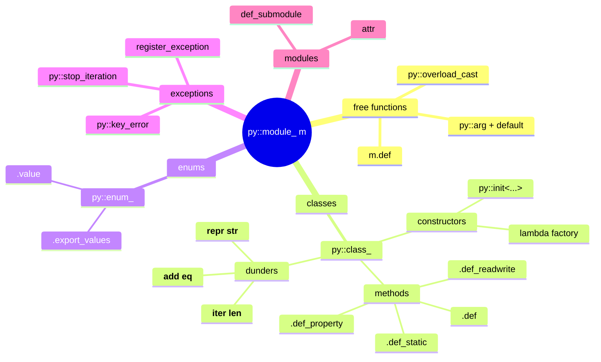

# Calling C++ from Python

## Why

Once you have [[1. pybind11 Basics|a working pybind11 build]], the next question is: *what can you actually expose, and how?* Real C++ libraries are not collections of free functions. They contain classes with constructors, methods, static methods, properties, enumerations, overloaded operators, exception hierarchies, STL containers, and templates. To make a C++ library feel native in Python, you must expose all of these in a way that respects Python idioms (PEP 8 names, `self`, properties, `repr`, iteration, context managers) without leaking C++-specific machinery.

This note is the comprehensive guide for that translation layer. After working through it you will be able to bind a non-trivial C++ class library so that Python users cannot tell — by feel — that the implementation is C++.

## Background

### The four contracts pybind11 maintains

When you bind a C++ entity to Python, pybind11 silently upholds four contracts:

1. **Type conversion** at the boundary: `int`, `double`, `bool`, `std::string`, `std::vector`, `std::map`, your classes — each has a *type caster* that converts `PyObject*`  C++ value.
2. **Lifetime management**: when C++ hands ownership to Python (or vice versa), pybind11 ensures the right side destroys the object using the right destructor. Default is `py::return_value_policy::automatic`, but you can override per-binding.
3. **Exception translation**: `std::runtime_error` becomes `RuntimeError`, `std::invalid_argument` becomes `ValueError`, `std::bad_alloc` becomes `MemoryError`, and so on. Custom exception types can be registered too.
4. **GIL handling**: bindings acquire the GIL before touching any Python object and (optionally) release it during long-running C++ work.

If you remember these four, every surprising behavior falls into one of them.

## Main content

### Binding free functions

```cpp
#include <pybind11/pybind11.h>
namespace py = pybind11;

double square(double x) { return x * x; }
int    square_i(int x)  { return x * x; }

PYBIND11_MODULE(mathx, m) {
    m.def("square", py::overload_cast<double>(&square),
          py::arg("x"), "Square a double");
    m.def("square", py::overload_cast<int>(&square_i),
          py::arg("x"), "Square an int (overload)");
}
```

`m.def` accepts:
- A Python-visible name.
- A function pointer (or `std::function`, lambda, or `py::cpp_function`).
- Optional `py::arg(...)` tags — these set Python parameter names and defaults.
- Optional docstring as the last positional arg.
- Optional `py::return_value_policy`.

If you have C++ overloads with the same name, disambiguate with `py::overload_cast<...>(&name)` (or `static_cast<Ret(*)(Args...)>(&name)` for non-overloaded but ambiguous cases).

### Binding lambdas

You can bind a lambda directly. This is invaluable for adapting C++ APIs to Python idioms.

```cpp
m.def("fizzbuzz", [](int n) {
    std::vector<std::string> out;
    for (int i = 1; i <= n; ++i) {
        if (i % 15 == 0)      out.push_back("FizzBuzz");
        else if (i % 3 == 0)  out.push_back("Fizz");
        else if (i % 5 == 0)  out.push_back("Buzz");
        else                  out.push_back(std::to_string(i));
    }
    return out;
});
```

### Binding classes

The `py::class_<T>` builder is the workhorse. Let's bind a `Vec2` class incrementally.

```cpp
#include <pybind11/pybind11.h>
#include <string>
#include <sstream>

namespace py = pybind11;

class Vec2 {
public:
    Vec2() : x_(0), y_(0) {}
    Vec2(double x, double y) : x_(x), y_(y) {}

    double x() const { return x_; }
    void set_x(double v) { x_ = v; }
    double y() const { return y_; }
    void set_y(double v) { y_ = v; }

    double norm() const { return std::sqrt(x_ * x_ + y_ * y_); }

    static Vec2 unit_x() { return Vec2(1, 0); }
    static Vec2 unit_y() { return Vec2(0, 1); }

    Vec2 operator+(const Vec2& o) const { return Vec2(x_ + o.x_, y_ + o.y_); }
    bool operator==(const Vec2& o) const { return x_ == o.x_ && y_ == o.y_; }

    std::string repr() const {
        std::ostringstream os;
        os << "Vec2(" << x_ << ", " << y_ << ")";
        return os.str();
    }
private:
    double x_, y_;
};

PYBIND11_MODULE(vec, m) {
    py::class_<Vec2>(m, "Vec2")
        // Constructors — register each overload you want exposed
        .def(py::init<>())
        .def(py::init<double, double>(), py::arg("x"), py::arg("y"))

        // Properties — getters + optional setters
        .def_property("x", &Vec2::x, &Vec2::set_x)
        .def_property("y", &Vec2::y, &Vec2::set_y)
        // Read-only variant:
        // .def_property_readonly("x", &Vec2::x)

        // Methods
        .def("norm", &Vec2::norm, "Euclidean norm")
        .def("__repr__", &Vec2::repr)
        .def("__add__", &Vec2::operator+)
        .def("__eq__", &Vec2::operator==)

        // Static methods
        .def_static("unit_x", &Vec2::unit_x)
        .def_static("unit_y", &Vec2::unit_y);
}
```

From Python this looks completely native:

```python
from vec import Vec2
v = Vec2(3, 4)
print(v)               # Vec2(3.0, 4.0)
print(v.norm())        # 5.0
v.x = 0
print(v + Vec2.unit_y())  # Vec2(0.0, 5.0)
print(Vec2.unit_x())   # Vec2(1.0, 0.0)
```

### Constructors and `py::init`

The `py::init<Ts...>()` call registers a constructor that takes `Ts...` and forwards them to `Vec2(Ts...)`. To bind a constructor that uses an factory function rather than a public constructor, you can pass a lambda:

```cpp
.def(py::init([](double r) { return Vec2(r, r); }), py::arg("r"))
```

### Properties vs. read-only fields

| Builder | What it does |
|---------|--------------|
| `.def_property("name", &getter, &setter)` | Read-write property. |
| `.def_property_readonly("name", &getter)` | Read-only property. |
| `.def_readwrite("name", &Class::field)` | Direct read-write access to a public member. |
| `.def_readonly("name", &Class::field)` | Direct read-only access to a public member. |

Prefer `def_property` over `def_readwrite` for anything that needs validation.

### Binding enumerations

C++ `enum class` → Python `enum.Enum`:

```cpp
enum class Color { Red, Green, Blue };

py::enum_<Color>(m, "Color")
    .value("Red",   Color::Red)
    .value("Green", Color::Green)
    .value("Blue",  Color::Blue)
    .export_values();  // optional: makes Color.Red also accessible as module-level Red
```

Without `.export_values()`, users must write `Color.Red`. With it, both `Color.Red` and `m.Red` work.

### Binding STL containers

`#include <pybind11/stl.h>` enables automatic conversion of:

| C++ type | Python type |
|----------|-------------|
| `std::vector<T>` | `list` |
| `std::array<T, N>` | `list` |
| `std::deque<T>` | `list` |
| `std::valarray<T>` | `list` |
| `std::pair<T, U>` | `tuple` |
| `std::tuple<Ts...>` | `tuple` |
| `std::map<K, V>` | `dict` |
| `std::unordered_map<K, V>` | `dict` |
| `std::set<T>` | `set` |
| `std::unordered_set<T>` | `set` |
| `std::optional<T>` | `T` or `None` |
| `std::variant<Ts...>` | one of the alternatives |

This conversion is **copying by default**. For large numerical arrays, see [[4. NumPy Interoperability]] to avoid the copy.

```cpp
#include <pybind11/pybind11.h>
#include <pybind11/stl.h>

std::map<std::string, std::vector<int>> histogram(const std::vector<int>& xs) {
    std::map<std::string, std::vector<int>> out;
    for (int x : xs) {
        if (x % 2 == 0) out["even"].push_back(x);
        else            out["odd"].push_back(x);
    }
    return out;
}

PYBIND11_MODULE(hist, m) {
    m.def("histogram", &histogram, py::arg("xs"));
}
```

```python
import hist
hist.histogram([1, 2, 3, 4, 5, 6])
# {'even': [2, 4, 6], 'odd': [1, 3, 5]}
```

### Binding iterators and `__iter__`

Make a C++ container iterable from Python:

```cpp
py::class_<Range>(m, "Range")
    .def(py::init<int, int>())
    .def("__iter__",
         [](Range& r) { return py::make_iterator(r.begin(), r.end()); },
         py::keep_alive<0, 1>());  // keep Range alive while iterator holds it
```

`py::keep_alive<0, 1>` is critical: without it, if the `Range` object is garbage-collected while the iterator still exists, the iterator's C++ references dangle. The `keep_alive` call adds a reference from the iterator (argument 0) to the `Range` (argument 1).

### Exception translation

By default pybind11 translates:

| C++ exception | Python exception |
|---------------|------------------|
| `std::exception` (and derived) | `RuntimeError` (or specific subclasses — `std::bad_alloc`→`MemoryError`, `std::out_of_range`→`IndexError`, `std::invalid_argument`→`ValueError`) |
| `std::bad_cast` | `TypeError` |
| `py::stop_iteration` | `StopIteration` (used to end iteration) |
| `py::key_error` | `KeyError` |
| `py::index_error` | `IndexError` |
| `py::value_error` | `ValueError` |
| `py::type_error` | `TypeError` |
| Anything else (uncaught) | `RuntimeError` ("Uncaught exception") |

To register a custom C++ exception type as a Python exception:

```cpp
struct MyError : std::runtime_error { using std::runtime_error::runtime_error; };

PYBIND11_MODULE(m, m) {
    py::register_exception<MyError>(m, "MyError", PyExc_RuntimeError);
    // Now `raise MyError("oops")` from C++ becomes a Python MyError that
    // Python code can `except MyError:` on.
}
```

To translate exceptions **into C++** when calling Python from C++ (reverse direction), see [[3. Calling Python from C++]].

### Return value policies

C++ and Python have very different object-lifetime expectations. pybind11 picks a sensible default per category of return value, but you can override:

| Policy | Meaning |
|--------|---------|
| `automatic` (default) | Picks `move` for value returns, `reference_internal` for members of bound classes. |
| `copy` | Always copy the returned value into a new Python object. |
| `move` | Move-construct the Python wrapper from the return value. |
| `reference` | Return a reference wrapper; Python does **not** own the C++ object. |
| `reference_internal` | Like `reference`, but keeps the parent (argument 1 by default) alive. |
| `take_ownership` | Python takes ownership and calls `delete` on the C++ pointer when GC'd. |
| `automatic_reference` | Same as `automatic` but prefers `reference` over `copy` when no ownership transfer is possible. |

The two policies you will reach for most often:

```cpp
// Return a *reference* to a long-lived C++ object held elsewhere, without copying.
m.def("get_config", &get_config, py::return_value_policy::reference);

// Give Python ownership of a freshly-new'd object.
m.def("make_thing", []() { return new Thing(); },
      py::return_value_policy::take_ownership);
```

### GIL management

By default, when Python calls a C++ function, the GIL is held throughout. If your C++ function does CPU-heavy work that doesn't touch Python objects, **release the GIL** so other Python threads can run:

```cpp
void heavy_compute(Buffer& buf) {
    py::gil_scoped_release release;   // release for the scope
    // ... long numerical work, no Python API calls allowed ...
    buf.transform();
}   // GIL automatically re-acquired here
```

Conversely, if a C++ thread (not created by Python) needs to call Python code or touch Python objects:

```cpp
void worker_thread() {
    py::gil_scoped_acquire acquire;   // acquire before touching Python
    py::print("hello from worker");
}
```

> [!danger] Calling Python API without the GIL is undefined behavior
> The program may crash immediately, may crash hours later, may silently corrupt the heap, or may "just work" on your machine and fail in production. Never skip the scoped acquire.

### Mermaid: type conversion flow



The same flow runs for every argument and return value, recursively for nested types: a `std::vector<std::string>` triggers `load` once, which then calls `load` on each element.

### Mermaid: binding DSL overview



### Common Pitfalls

> [!danger] Default arguments don't propagate
> `void f(int x = 42);` looks like it has a default, but pybind11 does **not** parse C++ default values. Use `py::arg("x") = 42` in the binding:
> ```cpp
> m.def("f", &f, py::arg("x") = 42);
> ```

> [!danger] Forgetting `py::keep_alive` for iterator bindings
> If you bind `__iter__` and don't keep the container alive while the iterator exists, you will get a use-after-free crash that is *very* hard to reproduce because it depends on garbage-collection timing.

> [!danger] Returning a reference to a temporary
> `std::string& f()` where `f` returns a reference to a local `std::string` is a C++ bug regardless of pybind11. But pybind11's `automatic` policy will happily copy-construct a Python `str` from a dangling reference, producing a "works 99% of the time, crashes 1%" bug. Fix the C++ first.

> [!warning] Templated classes
> `py::class_<std::vector<int>>` binds only that specialization. If you want to expose `std::vector<int>`, `std::vector<double>`, `std::vector<std::string>` to Python, you must call `py::class_` three times (or write a template helper). Each gets its own Python type name.

> [!warning] `py::cast` and ambiguous overloads
> When using `py::overload_cast`, make sure the cast type list is unambiguous. `py::overload_cast<int>(&f)` where `f` has both `f(int)` and `f(int, int = 0)` is ambiguous; use `static_cast` with the exact signature.

> [!warning] `__init__` returning void
> If you write `.def("__init__", [](Vec2& self, double x){ /* ... */ })`, pybind11 needs to know it's an init function. Use `py::init(...)` instead, which wraps the lambda correctly and handles in-place construction.

### Tips and Tricks

- **Use `py::call_guard<py::gil_scoped_release>()` as a per-binding shortcut** for releasing the GIL:
  ```cpp
  m.def("heavy", &heavy, py::call_guard<py::gil_scoped_release>());
  ```
- **Use `py::is_final()` (C++14-era classes) to prevent Python subclassing** of bound C++ types — sometimes you want this for performance or correctness.
- **Use `py::dynamic_attr()` on `py::class_`** to let Python users add arbitrary attributes to instances of bound C++ classes (matches the default behavior of pure-Python classes).
- **Bind `__getstate__` / `__setstate__`** to support `pickle`. pybind11 has `py::pickle(...)`, but the manual dunders give you more control.
- **Add `__copy__` and `__deepcopy__`** if your class participates in copy semantics — Python users will reach for `copy.copy(x)`.
- **Use `py::module_::import("typing")` and `py::type::of<T>()`** to attach `typing`-style annotations visible to `inspect.signature` for richer IDE support.
- **`m.attr("__all__") = py::make_iterator(...)`** is a clean way to publish a public API list for `from module import *`.
- **For callbacks**, accept `py::function` and store as `std::function<...>`. Use `py::cpp_function` to wrap lambdas that should outlive the call.

### Active Recall

> [!question] Q1
> What is the difference between `def_property` and `def_readwrite`?
>
> **Answer:** `def_property` calls getter/setter methods you supply (enabling validation, side effects, computed values); `def_readwrite` directly exposes a public member variable.

> [!question] Q2
> Why do you need `py::keep_alive<0, 1>()` when binding `__iter__`?
>
> **Answer:** It tells pybind11 to keep the first implicit argument (the container, arg 1) alive as long as the return value (the iterator, arg 0) exists, preventing use-after-free if the container is garbage-collected before iteration completes.

> [!question] Q3
> A bound C++ method does 200 ms of pure numerical work. Two Python threads both call it concurrently. Why does the second thread block, and how do you fix it?
>
> **Answer:** pybind11 holds the GIL throughout the call by default, so only one Python thread runs C++ code at a time. Add `py::call_guard<py::gil_scoped_release>()` to the binding (or release manually inside the function) so the GIL is freed during the numerical work, allowing true parallelism.

> [!question] Q4
> What does `register_exception<MyError>(m, "MyError", PyExc_RuntimeError)` do, and where does the third argument come into play?
>
> **Answer:** It creates a Python exception class `MyError` whose base class is `RuntimeError` (the third argument) and registers it in module `m`. When C++ throws `MyError`, pybind11 raises the corresponding Python `MyError`, which Python code can `except`.

### Next Steps

- [[3. Calling Python from C++]] — invert the direction: embed Python in a C++ host.
- [[4. NumPy Interoperability]] — replace `std::vector<double>` with `py::array_t<double>` for zero-copy numerical work.
- For the broader Python side of the story, see the C++ Roadmap's interop section.
- Cross-reference [[9. Object-Oriented Programming/1. Classes and Objects]], [[9. Object-Oriented Programming/6. Operator Overloading]], and [[9. Object-Oriented Programming/7. const Correctness]] — the binding DSL mirrors these C++ features directly.
- For exception background: [[13. Error Handling and Exceptions/2. Exceptions Basics]] and [[13. Error Handling and Exceptions/4. Custom Exceptions]].
