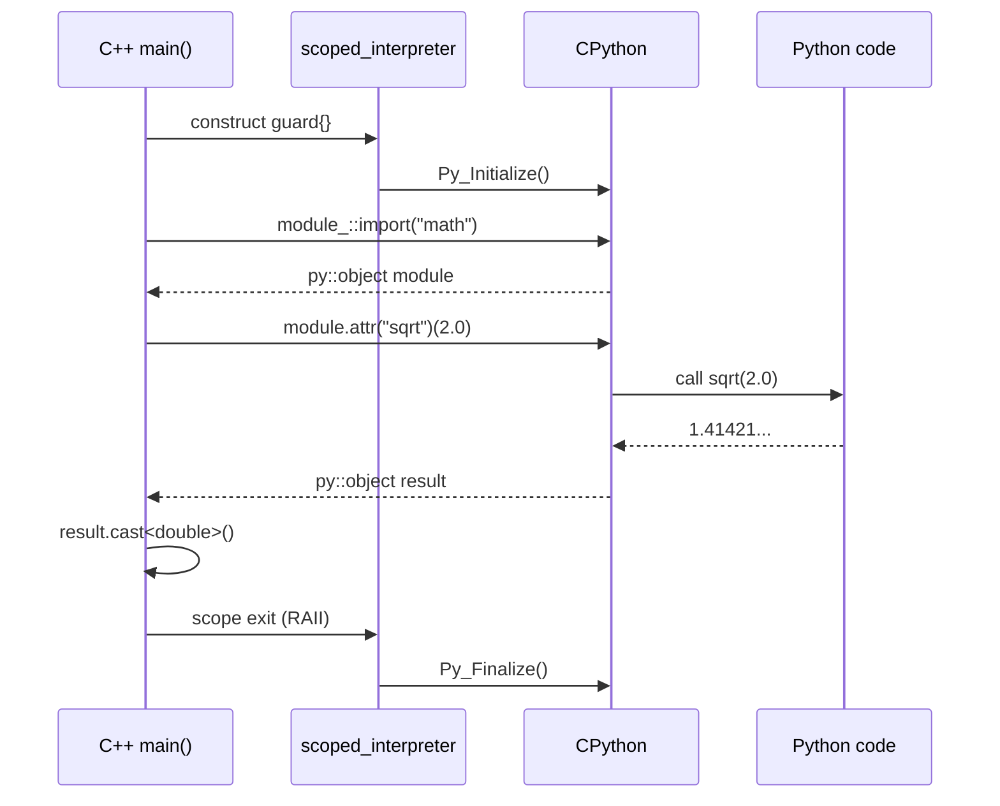
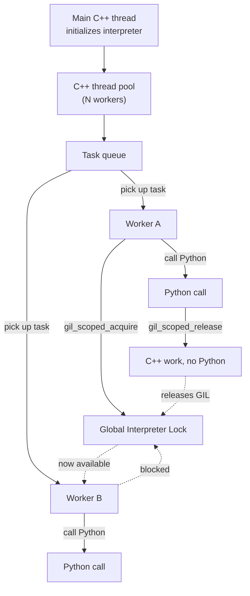

# Calling Python from C++

## Why

So far in Chapter 21 we have treated Python as the host and C++ as a guest: Python `import`s a `.so` you built with pybind11. The reverse direction is just as important. When you **embed** Python inside a C++ application, your C++ program becomes the host: it owns `main()`, it owns the process lifetime, and it borrows the Python interpreter on demand.

Embedding is the right answer when:

- Your application is a C++ game engine, IDE, CAD tool, or scientific desktop app, and you want users to write **plugins or scripts** in Python.
- You want to use a **Python-only library** (pandas, transformers, matplotlib, PyTorch) from a C++ codebase without re-implementing it.
- You run a C++ server that needs to call out to an ML model wrapper that already exists in Python.
- You want a **REPL** inside your C++ program for debugging or interactive exploration.

This note shows how to embed Python with pybind11, call Python functions from C++, evaluate Python expressions, handle Python exceptions, and integrate the embedded interpreter with C++ threads safely.

## Background

### The CPython embedding API, in 30 seconds

The raw C API for embedding is small but brutal:

```c
#include <Python.h>

int main() {
    Py_Initialize();                 // boot the interpreter
    PyObject* m = PyImport_ImportModule("json");  // import json
    PyObject* dumps = PyObject_GetAttrString(m, "dumps");  // m.dumps
    PyObject* args = PyTuple_Pack(1, PyLong_FromLong(42));
    PyObject* result = PyObject_CallObject(dumps, args);
    PyObject_Print(result, stdout, 0);   // "42"
    Py_Finalize();                   // tear down
    return 0;
}
```

Every line here has multiple failure modes you must check, every `PyObject*` must be `Py_DECREF`'d exactly once, and the moment you forget a decrement you have a memory leak (or worse, a use-after-free). pybind11 wraps this whole dance in RAII so that the equivalent code becomes three readable lines.

### Embedded vs. extended: which side are you on?

| Mode | Who owns `main()` | What you call `Py_Initialize` for |
|------|-------------------|-----------------------------------|
| **Extending** (Ch 21-2) | Python | CPython does it for you before your module loads |
| **Embedding** (this note) | C++ | You must do it yourself, exactly once |

The same pybind11 library handles both. The only API difference is that in embedding mode you must construct a `py::scoped_interpreter` before calling any Python function.

## Main content

### Booting the interpreter

```cpp
#include <pybind11/embed.h>   // MUST include this for embedding mode
namespace py = pybind11;

int main() {
    py::scoped_interpreter guard{};  // Py_Initialize + Py_Finalize at scope exit

    // Now you can call Python:
    py::print("Hello from Python, called from C++");
    return 0;
}
```

Three things to note:

1. The header is `<pybind11/embed.h>`, **not** `<pybind11/pybind11.h>`. It pulls in the interpreter-guard machinery that the regular header omits to keep extension modules lean.
2. `py::scoped_interpreter` is RAII: its constructor calls `Py_Initialize()`, its destructor calls `Py_Finalize()`. Never call those functions yourself when using pybind11.
3. The interpreter must be initialized **exactly once** per process. If you have a C++ thread pool, every thread that touches Python must be created after the interpreter is up, or you must manage thread state manually (see below).

### Passing initialization parameters

You can pass `argc`/`argv` to mimic running Python from the command line (this matters if Python scripts in your app read `sys.argv`):

```cpp
py::scoped_interpreter guard{argc, argv};
```

You can also pass `init_signal_handlers = false` to prevent Python from installing its own SIGINT handler, which is usually what you want in a C++ host that already manages signals:

```cpp
py::scoped_interpreter guard{
    /*init_signal_handlers*/ false
};
```

### Calling Python functions

The pattern is: import a module → grab an attribute → call it.

```cpp
py::scoped_interpreter guard{};

// import math
py::module_ math = py::module_::import("math");

// math.sqrt(2.0)
py::object result = math.attr("sqrt")(2.0);
double value = result.cast<double>();
std::cout << "sqrt(2) = " << value << "\n";   // 1.41421...
```

Every Python call returns a `py::object`. To get a C++ value out, call `.cast<T>()`. The same type-caster system from [[2. Calling C++ from Python]] works in reverse: `py::object::cast<int>()` calls the `int` caster in the *unload* direction.

### Calling a function defined in a script file

Suppose you have `mymodule.py`:

```python
# mymodule.py
def greet(name, enthusiastic=False):
    if enthusiastic:
        return f"HELLO {name.upper()}!!!"
    return f"hello, {name}"
```

To call it from C++:

```cpp
// Make sure 'mymodule.py' is on sys.path.
py::module_::import("sys").attr("path").attr("append")(".");

py::module_ m = py::module_::import("mymodule");
py::object greeting = m.attr("greet")("ada", py::arg("enthusiastic") = true);
std::cout << greeting.cast<std::string>() << "\n";   // HELLO ADA!!!
```

`py::arg("name") = value` works on the C++ side too, just like on the binding side.

### Evaluating Python expressions and statements

pybind11 exposes the same `eval` / `exec` distinction that CPython does:

```cpp
// Evaluate an expression, get a result.
py::object two = py::eval("1 + 1");
int n = two.cast<int>();   // 2

// Evaluate a literal only (faster, no statement parsing).
py::object d = py::eval("{'a': 1, 'b': 2}");

// Execute statements (no return value).
py::exec("import sys; sys.stdout.write('hello\\n')");
```

For multi-line scripts, use a raw string literal:

```cpp
py::exec(R"(
def fib(n):
    a, b = 0, 1
    for _ in range(n):
        a, b = b, a + b
    return a
)");
```

You can pass custom globals/locals:

```cpp
py::dict globals;
globals["__builtins__"] = py::module_::import("builtins");
py::object result = py::eval("x * 2 + 1", globals, py::dict());
// This will fail unless you put 'x' in globals first.
```

### Handling Python exceptions

Python exceptions are *raised*, not thrown — but pybind11 converts them to a C++ exception type `py::error_already_set` so you can `try`/`catch` them in idiomatic C++:

```cpp
try {
    py::module_::import("this_module_does_not_exist");
} catch (const py::error_already_set& e) {
    std::cerr << "Python error: " << e.what() << "\n";
    // e.matches(PyExc_ImportError) is a typed check:
    if (e.matches(PyExc_ImportError)) {
        std::cerr << "(it was an ImportError)\n";
    }
    // e.restore() puts the exception back onto PyErr so you can re-raise
    // from Python; e.discard() discards it permanently.
}
```

`py::error_already_set` carries:
- `.what()` — a formatted string like `ImportError: No module named '...'`.
- `.matches(PyExc_*)` — typed checks against any built-in or custom exception type.
- `.trace()` — a string with the Python traceback, useful for logging.
- `.restore()` — push it back to `PyErr_*` (so the next Python C-API call sees it).
- `.discard()` — silently drop it.

> [!tip] Catch by const reference
> Always `catch (const py::error_already_set& e)`. Catching by value slices the exception object and can lose the underlying Python type info.

### Calling Python with C++ data

The same `py::cast` works in both directions. To pass a `std::vector<double>` to a Python function:

```cpp
#include <pybind11/stl.h>

std::vector<double> xs{1.0, 2.0, 3.0, 4.0};
py::module_ np = py::module_::import("numpy");
py::object arr = np.attr("array")(xs);
py::object mean = np.attr("mean")(arr);
std::cout << mean.cast<double>() << "\n";   // 2.5
```

For larger arrays you should use `py::array_t<double>` directly to avoid the copy — see [[4. NumPy Interoperability]].

### Mermaid: embedded Python lifecycle



### Threads and the GIL

By default, the interpreter is initialized for the calling thread only. Every other thread that wants to touch Python must register itself:

```cpp
#include <thread>

void worker() {
    // Acquire the GIL for this thread (also registers thread state on first call)
    py::gil_scoped_acquire acquire;
    py::print("hello from worker thread");
}

int main() {
    py::scoped_interpreter guard{};

    std::thread t(worker);
    t.join();
}
```

Inside a worker thread you should release the GIL before doing C++-only work, so other Python threads can run:

```cpp
void worker() {
    py::gil_scoped_acquire acquire;
    py::object data = load_data_from_python();

    {
        py::gil_scoped_release release;   // give GIL back
        heavy_cpp_computation(data);       // pure C++ work
    }   // re-acquired here

    py::print("done");
}
```

> [!danger] Never call Python from a C++ thread without `gil_scoped_acquire`
> The result is undefined behavior. Sometimes you get a crash inside CPython's internal locks; sometimes the interpreter hangs; sometimes the program seems fine until load increases.

### Mermaid: GIL handoff in an embedded application



### Calling Python callbacks from C++ threads

A common pattern: you accept a `py::function` from Python (in a callback registration), then call it later from a C++ worker thread:

```cpp
class CallbackRunner {
public:
    void set_callback(py::function f) {
        std::lock_guard<std::mutex> lk(mu_);
        callback_ = std::move(f);
    }

    void run_async() {
        std::thread([this] {
            py::function cb;
            {
                std::lock_guard<std::mutex> lk(mu_);
                cb = callback_;          // copy ref while holding lock
            }
            if (cb) {
                py::gil_scoped_acquire acquire;
                cb(42);                   // call Python from C++ thread
            }
        }).detach();
    }

private:
    std::mutex mu_;
    py::function callback_;
};
```

Two things to be careful about:
1. The `py::function` copies the underlying `PyObject*` and increments its refcount, so the callback stays alive even if the Python-side variable goes out of scope.
2. You **must** acquire the GIL before invoking the callback, even though the C++ thread "owns" the `py::function`.

### Common Pitfalls

> [!danger] Including the wrong header
> Embedding requires `<pybind11/embed.h>`. If you only include `<pybind11/pybind11.h>`, you'll get a link error about missing `scoped_interpreter` symbols.

> [!danger] Initializing Python more than once
> If your code calls `Py_Initialize()` manually *and* constructs a `scoped_interpreter`, you'll get a crash on finalize. Let pybind11 own the lifecycle.

> [!danger] Calling `py::finalize_interpreter()` while Python objects still live
> Destroying the interpreter invalidates every `py::object` still in scope. Make sure all `py::object` instances go out of scope **before** the `scoped_interpreter` does. (Ordering matters: declare the interpreter first, then your Python-touching objects, so destructors run in reverse.)

> [!warning] Static `py::object` instances
> Static destructors run after `main` returns — i.e., after the interpreter is finalized. If you have a static `py::object`, it will crash on shutdown. Use `py::object` only as a non-static member or local.

> [!warning] Mixing `Py_Initialize` with another Python runtime
> If your process loads NumPy, TensorFlow, or any other library that has *its own* embedded Python, you can end up with two interpreters and a corrupted state. Make sure there is exactly one `Py_Initialize` per process.

> [!warning] `sys.path` and virtual environments
> When you embed, `sys.path` is initialized from the C++ executable's environment, *not* from your `venv`. To pick up venv-installed packages, set `sys.executable` and `sys.prefix` explicitly before importing anything:
> ```cpp
> py::module_::import("sys").attr("path").attr("insert")(0, "/path/to/venv/lib/python3.11/site-packages");
> ```

### Tips and Tricks

- **Use `py::module_::import("sys").attr("argv")`** to set `sys.argv` from C++ if your Python scripts expect it.
- **`py::module_::import("warnings").attr("filterwarnings")("ignore")`** quiets noisy Python warnings during embedding; useful for production logs.
- **Use `py::dict` as a locals bag** for repeated `eval` calls — much faster than recreating globals each time.
- **Pre-compile hot paths with `compile()`**: `py::module_::import("builtins").attr("compile")("a + b", "<expr>", "eval")` returns a code object you can `eval` repeatedly.
- **Catch `py::error_already_set` at thread boundaries**: an unhandled Python exception in a worker thread will terminate the process.
- **For plugin systems**, use `importlib` from Python to discover and load user `.py` files — don't try to walk the filesystem from C++.
- **`py::eval_file("script.py")`** runs a file in one call; pair it with `py::eval_file<py::eval_statements>` mode for full scripts.

### Active Recall

> [!question] Q1
> Which header do you include to embed Python, and which class manages the interpreter's lifetime?
>
> **Answer:** `<pybind11/embed.h>` and `py::scoped_interpreter`. The constructor calls `Py_Initialize`, the destructor calls `Py_Finalize`, and you must have exactly one per process.

> [!question] Q2
> A C++ worker thread calls a Python function and crashes with a segfault inside `Py_NewReference`. What did you forget?
>
> **Answer:** You forgot to acquire the GIL with `py::gil_scoped_acquire` before calling Python from the worker thread. Every non-main thread must acquire the GIL before touching the CPython API.

> [!question] Q3
> What C++ exception type is raised when a Python call inside your embedded code throws, and how do you check its type?
>
> **Answer:** `py::error_already_set`. Use `e.matches(PyExc_ImportError)` etc. to check the underlying Python type, and `e.what()` for a human-readable message.

> [!question] Q4
> Why must `py::object` instances be destroyed *before* the `scoped_interpreter`?
>
> **Answer:** Because the `scoped_interpreter`'s destructor calls `Py_Finalize`, which tears down the entire CPython runtime. After that, any remaining `py::object`'s destructor tries to `Py_DECREF` a `PyObject*` that no longer exists in a valid interpreter — undefined behavior.

### Next Steps

- [[4. NumPy Interoperability]] — close out Chapter 21 by sharing large numerical arrays with NumPy without copying.
- Re-read [[2. Calling C++ from Python]] to see how the same type caster system powers `py::cast<T>()` in both directions.
- For C++ threading fundamentals that this note relies on, see [[14. Concurrency and Multithreading/2. std thread and std jthread]], [[14. Concurrency and Multithreading/3. Mutexes and Locks]], and [[14. Concurrency and Multithreading/4. Condition Variables]].
- For build-system concerns unique to embedding (linking `libpython3.11.so` rather than just the headers), see [[12. Build Systems and Project Structure/3. Static vs Shared Libraries]] and [[12. Build Systems and Project Structure/6. CMake Advanced]].
- For a complete application that mixes C++ and Python, see the project notes in [[22. Projects]] — particularly [[5. Build Your Own Redis]] for a multithreaded server that can call out to Python plugins.
