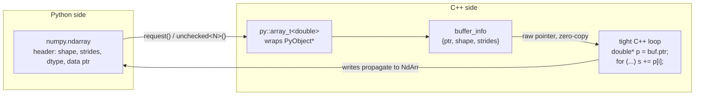

# NumPy Interoperability

## Why

If you are bridging C++ and Python, you are almost certainly moving numerical arrays across the boundary. NumPy is the lingua franca of array computing in Python, and the *naive* way to exchange arrays — converting each element to a Python `float` object and back — is **50–1000× slower** than the underlying math.

pybind11 ships a tight integration with NumPy's **array interface** and the Python **buffer protocol**, letting you expose a NumPy array to C++ as a typed pointer (`float*`, `double*`, etc.) with **zero copies**. This unlocks the same performance as hand-written Cython or C extensions, with a single declarative header.

This note covers:
- `py::array_t<T>` — pybind11's NumPy array wrapper.
- The buffer protocol and how NumPy lays out memory.
- Zero-copy reads and writes from C++.
- Multidimensional arrays, strides, and non-contiguous views.
- Interop with Eigen and OpenCV.
- Performance pitfalls and how to avoid them.

## Background

### What is a NumPy array, really?

A `numpy.ndarray` is a small Python object that wraps a contiguous region of **raw memory** plus metadata describing how to interpret that memory:

| Field | Meaning |
|-------|---------|
| `data` | Pointer to the start of the raw buffer |
| `dtype` | Element type (`float64`, `int32`, ...) |
| `shape` | Tuple of dimension sizes |
| `strides` | Tuple of byte offsets between consecutive elements in each axis |
| `flags` | Contiguity flags (`C_CONTIGUOUS`, `F_CONTIGUOUS`, `WRITEABLE`, ...) |

A `numpy.array([[1, 2, 3], [4, 5, 6]], dtype='float64')` is therefore:
- A 16-byte Python object header.
- A pointer to a 6×8 = 48-byte buffer of doubles.
- Shape `(2, 3)`, strides `(24, 8)` (in C order).

The whole point of pybind11's NumPy support is to expose that raw buffer to C++ as a typed pointer so you can iterate it with native speed.

### The Python buffer protocol

PEP 3118 (the buffer protocol) is a standard way for any Python object to expose its memory as a typed, possibly-strided, possibly-multi-dimensional buffer. NumPy implements it; so do `array.array`, `mmap.mmap`, `bytes`, `bytearray`, PIL images, and many others.

pybind11's `py::buffer_info` and `py::array_t<T>` are built on top of this protocol. That means **any object that supports the buffer protocol** can be passed to a function taking `py::array_t<T>` (with appropriate conversion), not just NumPy arrays.

## Main content

### The simplest binding

```cpp
#include <pybind11/pybind11.h>
#include <pybind11/numpy.h>

namespace py = pybind11;

// Sum a 1-D float64 array.
double sum_array(py::array_t<double> arr) {
    auto buf = arr.request();   // get a buffer_info
    if (buf.ndim != 1)
        throw std::runtime_error("expected a 1-D array");

    double* ptr = static_cast<double*>(buf.ptr);
    double s = 0.0;
    for (ssize_t i = 0; i < buf.shape[0]; ++i)
        s += ptr[i];
    return s;
}

PYBIND11_MODULE(mymod, m) {
    m.def("sum_array", &sum_array, py::arg("arr"));
}
```

From Python:

```python
import numpy as np
import mymod

x = np.array([1.0, 2.0, 3.0, 4.0], dtype=np.float64)
print(mymod.sum_array(x))   # 10.0
```

The `arr.request()` call returns a `py::buffer_info` that gives you:
- `ptr` — raw `void*` to the buffer.
- `itemsize` — bytes per element.
- `size` — total number of elements.
- `ndim` — number of dimensions.
- `shape` — `std::vector<ssize_t>` of dimension sizes.
- `strides` — `std::vector<ssize_t>` of byte strides per dimension.

### `py::array_t<T>` template parameters

`py::array_t<T>` accepts two optional template flags:

```cpp
py::array_t<double>                              // default: read-write, any layout
py::array_t<double, py::array::c_style>          // require C-contiguous
py::array_t<double, py::array::f_style>          // require Fortran-contiguous
py::array_t<double, py::array::forcecast>        // allow dtype conversion
```

You can `|` them together:

```cpp
py::array_t<double, py::array::c_style | py::array::forcecast>
```

This declares: "give me a C-contiguous `float64` array; if the caller passes anything else, NumPy will silently convert it (and copy if needed) before my function runs." This is the right default for performance-critical inner loops.

### Zero-copy access patterns

`py::array_t<T>` has helper methods that give you unchecked or checked access. Use unchecked for speed when you trust the inputs; use checked for safety:

```cpp
double row_sum(py::array_t<double, py::array::c_style> arr) {
    auto a = arr.unchecked<2>();   // 2-D, no bounds checking
    double total = 0.0;
    for (ssize_t i = 0; i < a.shape(0); ++i)
        for (ssize_t j = 0; j < a.shape(1); ++j)
            total += a(i, j);
    return total;
}

double safe_at(py::array_t<double> arr, ssize_t i, ssize_t j) {
    auto a = arr.unchecked<2>();
    return a(i, j);    // no bounds check
}

double checked_at(py::array_t<double> arr, ssize_t i, ssize_t j) {
    auto a = arr.mutable_checked<2>();
    return a(i, j);    // throws IndexError on out-of-bounds
}
```

Variants:
- `.unchecked<N>()` — read-only, no bounds check.
- `.mutable_unchecked<N>()` — read-write, no bounds check.
- `.checked<N>()` — read-only with bounds check.
- `.mutable_checked<N>()` — read-write with bounds check.

### Returning an array from C++

Two options: construct from existing memory (zero-copy), or allocate fresh.

**Allocate fresh:**

```cpp
py::array_t<double> make_range(ssize_t n) {
    py::array_t<double> result(n);   // allocates n doubles
    auto r = result.mutable_unchecked<1>();
    for (ssize_t i = 0; i < n; ++i)
        r(i) = static_cast<double>(i);
    return result;
}
```

**Wrap existing C++ memory (zero-copy):**

```cpp
py::array_t<double> wrap_buffer(double* ptr, ssize_t n) {
    // Parent capsule keeps the buffer alive while NumPy holds a reference.
    return py::array_t<double>(
        /*shape=*/{n},
        /*strides=*/{sizeof(double)},
        /*data=*/ptr,
        /*base=*/py::capsule(ptr, [](void* p) { /* custom deleter if any */ })
    );
}
```

The `py::capsule` argument is critical: it tells NumPy "this array's memory is owned by the capsule; keep the capsule alive as long as the array exists." Without it, NumPy would happily use the buffer after the C++ side frees it.

### 2-D arrays, strides, and non-contiguous views

NumPy arrays are not always contiguous. A slice like `x[:, ::2]` produces a non-contiguous view with a stride of `2 * itemsize` along the last axis. The `unchecked<2>()` accessor handles this transparently — it uses strides internally:

```cpp
double sum_2d(py::array_t<double> arr) {
    auto a = arr.unchecked<2>();
    double s = 0.0;
    for (ssize_t i = 0; i < a.shape(0); ++i)
        for (ssize_t j = 0; j < a.shape(1); ++j)
            s += a(i, j);
    return s;
}
```

This works whether the input is C-contiguous, Fortran-contiguous, or strided. But it's slower than a tight contiguous loop because of the per-element stride multiplication. For maximum performance, require `c_style` (or `f_style`) and access the raw pointer directly:

```cpp
double sum_contig(py::array_t<double, py::array::c_style> arr) {
    auto a = arr.unchecked<2>();
    const double* p = a.data(0, 0);
    ssize_t total = a.shape(0) * a.shape(1);
    double s = 0.0;
    for (ssize_t i = 0; i < total; ++i) s += p[i];   // tight contiguous loop
    return s;
}
```

### Mermaid: NumPy buffer sharing



There is **no copy** anywhere in this pipeline. The Python array and the C++ loop access the same bytes.

### Eigen interop

For linear algebra, pybind11 ships `<pybind11/eigen.h>`, which converts `Eigen::Matrix<T, R, C>` and `Eigen::Map<...>` to/from NumPy arrays with zero copies:

```cpp
#include <pybind11/pybind11.h>
#include <pybind11/eigen.h>
#include <Eigen/Dense>

namespace py = pybind11;

Eigen::VectorXd matvec(const Eigen::MatrixXd& A, const Eigen::VectorXd& x) {
    return A * x;
}

PYBIND11_MODULE(lin, m) {
    m.def("matvec", &matvec);
}
```

```python
import numpy as np
import lin

A = np.random.randn(5, 5)
x = np.random.randn(5)
y = lin.matvec(A, x)
```

Because `Eigen::Map` is used internally, this works with both C-contiguous and Fortran-contiguous arrays without copying. Eigen's column-major default matches NumPy's `'F'` order; if you pass a C-order array, Eigen handles the strides.

> [!warning] Eigen alignment + vectorization
> If you compile with AVX/AVX2/AVX-512 enabled, Eigen requires 16/32/64-byte alignment of its matrices. NumPy arrays are typically only 16-byte aligned. Pass `-DEIGEN_MAX_ALIGN_BYTES=32` (or set `EIGEN_DONT_ALIGN`) if you see weird crashes inside Eigen's vectorized code paths.

### OpenCV `cv::Mat` interop

OpenCV's `cv::Mat` is its own non-NumPy array type. To bridge:

```cpp
#include <opencv2/core.hpp>
#include <pybind11/pybind11.h>
#include <pybind11/numpy.h>

namespace py = pybind11;

// Convert cv::Mat (BGR, uint8) to a NumPy array (H, W, 3) uint8.
py::array_t<unsigned char> mat_to_array(const cv::Mat& mat) {
    return py::array_t<unsigned char>(
        {mat.rows, mat.cols, mat.channels()},
        {mat.step, sizeof(unsigned char), mat.channels() * sizeof(unsigned char)},
        mat.data,
        py::capsule(new cv::Mat(mat), [](void* p) { delete static_cast<cv::Mat*>(p); })
    );
}

// Convert a NumPy array (H, W, 3) uint8 to cv::Mat (no copy).
cv::Mat array_to_mat(py::array_t<unsigned char> arr) {
    auto a = arr.unchecked<3>();
    return cv::Mat(
        a.shape(0), a.shape(1), CV_8UC3,
        const_cast<unsigned char*>(a.data(0, 0, 0)),
        a.strides(0)
    );
}
```

The stride trick on the `cv::Mat` side matters: OpenCV's `step` is the byte offset between rows, which equals NumPy's `strides[0]` for an HWC array.

### Avoiding copies: the checklist

When performance matters, audit each call site against this list:

1. **Use `py::array_t<T>`** instead of `std::vector<T>` for any numerical array. The STL converter copies.
2. **Pass `py::array::c_style | py::array::forcecast`** if your inner loop requires contiguity. The cost of one upfront copy is recovered quickly if the loop runs many times.
3. **Use `.unchecked<N>()`** for read-only access. The checked variants add a per-element bounds check.
4. **Use `.mutable_unchecked<N>()`** when you intend to modify the array in place, so NumPy doesn't need to copy on entry.
5. **Hold a `py::buffer_info` or `unchecked` object alive** for the entire duration of your access. Do not save the raw pointer and use it later — the array could be garbage-collected meanwhile.
6. **Wrap existing C++ memory in a `py::capsule`** when returning arrays; never let NumPy see a bare `new double[n]` without lifetime management.
7. **Release the GIL** before tight numerical loops. Acquiring it on the Python side of the call already happened; if your function is `void` returning, you can drop the GIL with `py::call_guard<py::gil_scoped_release>()` on the binding.
8. **Avoid `py::cast<std::vector<T>>(arr)`** — it always copies. If you need a `std::vector` view, wrap the pointer with `Eigen::Map` or write your own lightweight span.

### A complete in-place example

```cpp
// In-place softmax along the last axis of a 2-D float64 array.
void softmax_inplace(py::array_t<double, py::array::c_style> arr) {
    auto a = arr.mutable_unchecked<2>();
    for (ssize_t i = 0; i < a.shape(0); ++i) {
        double m = a(i, 0);
        for (ssize_t j = 1; j < a.shape(1); ++j)
            m = std::max(m, a(i, j));
        double s = 0.0;
        for (ssize_t j = 0; j < a.shape(1); ++j) {
            a(i, j) = std::exp(a(i, j) - m);
            s += a(i, j);
        }
        for (ssize_t j = 0; j < a.shape(1); ++j)
            a(i, j) /= s;
    }
}

PYBIND11_MODULE(sm, m) {
    m.def("softmax_inplace", &softmax_inplace,
          py::arg("arr").noconvert(),
          py::call_guard<py::gil_scoped_release>());
}
```

```python
import numpy as np, sm
x = np.random.randn(1000, 1000)
sm.softmax_inplace(x)        # x is modified in place
print(x.sum(axis=1))          # all ~1.0
```

Note the three performance levers in the binding:
- `py::array::c_style` forces a contiguous layout (copying once at the boundary if needed).
- `.noconvert()` prevents implicit dtype conversion (raises a `TypeError` instead, which is faster and clearer).
- `py::call_guard<py::gil_scoped_release>()` releases the GIL during the loop so other Python threads can run.

### Mermaid: full request → loop → response lifecycle

```mermaid
sequenceDiagram
    participant Py as Python
    participant Bind as pybind11 binding
    participant Loop as C++ inner loop
    Py->>Bind: softmax_inplace(x)
    Bind->>Bind: verify dtype + contiguity (noconvert)
    Bind->>Bind: gil_scoped_release
    Bind->>Loop: unchecked<2>() → raw double*
    Loop->>Loop: in-place softmax over rows
    Loop-->>Bind: done
    Bind-->>Py: returns (x is mutated)
```

### Common Pitfalls

> [!danger] Storing a raw `double*` past the call
> If you save `buf.ptr` to a member variable and use it after the Python-side array has been garbage-collected, you have a use-after-free. Always keep the `py::array_t` or `unchecked` object alive alongside the pointer.

> [!danger] Wrong dtype, silent copy
> A function taking `py::array_t<float>` will silently copy-convert when passed a `float64` array, doubling memory and killing performance. Use `.noconvert()` if you want a hard error instead.

> [!danger] Negative strides from slicing
> `x[::-1]` produces an array with a **negative** stride. Your pointer-based loop will write to the wrong memory. Always check `arr.strides()` if you skip the contiguity constraint, or require `c_style`.

> [!warning] Threading + NumPy + BLAS
> NumPy operations often release the GIL internally and call into multithreaded BLAS. If your C++ thread launches a NumPy call, both threading layers can fight for CPU. Set `OMP_NUM_THREADS=1` inside the C++ side, or use single-threaded BLAS.

> [!warning] `py::array::forcecast` and integer arrays
> If your function expects `float64` and the caller passes `int64`, `forcecast` will silently convert — usually desired, but it can mask bugs in pipelines that mix dtypes.

> [!warning] Eigen + NumPy alignment
> On AVX-512 machines, Eigen wants 64-byte alignment. NumPy arrays are 16-byte aligned by default. Either disable Eigen vectorization or copy into an aligned buffer.

### Tips and Tricks

- **Use `py::array::c_style | py::array::forcecast` for inner-loop kernels** — accept the one-time copy at the boundary in exchange for a tight contiguous loop.
- **Use `py::array_t<>` without flags for the outer API** — be liberal in what you accept.
- **For batch processing**, accept `py::object` and call `np.asarray` from C++: `py::module_::import("numpy").attr("asarray")(obj)`. This gives you full NumPy semantics for free.
- **Pin alignment on allocation**: `py::array_t<double>` allocates with NumPy's allocator, which is 16-byte aligned on Linux. For 32/64-byte alignment, allocate in C++ and wrap with a capsule.
- **Use `arr.dtype()` to dispatch**: `if (arr.dtype().is(py::dtype::of<float>()))` lets you write one binding that handles multiple dtypes by dispatching internally.
- **For very large arrays**, consider memory-mapped files via `np.memmap` on the Python side and a `mmap`-backed `py::array_t` on the C++ side — no copy, even across processes.
- **Profile with `py-spy record --native`** to see where time is spent across the Python/C++ boundary. The flamegraph will tell you whether the copy or the loop dominates.
- **`py::array_t<void>` works** if you need a type-erased buffer; just be careful with the dtype at runtime.

### Active Recall

> [!question] Q1
> What's the difference between `.unchecked<N>()` and `.checked<N>()`?
>
> **Answer:** Both give you a multi-dimensional accessor. `unchecked` skips bounds checking for speed; `checked` throws `IndexError` on out-of-bounds access. There are also `mutable_` variants that allow writing.

> [!question] Q2
> You bind a function `f(py::array_t<double>)` and call it with a NumPy `float32` array. What happens by default, and how do you make it an error?
>
> **Answer:** By default pybind11 silently copies and converts to `float64`, doubling memory. To make it a hard error, pass `py::arg("arr").noconvert()`.

> [!question] Q3
> You return a `py::array_t<double>` constructed from a `double*` allocated by your C++ library. The Python side crashes randomly a few seconds later. What did you forget?
>
> **Answer:** You forgot to pass a `py::capsule` as the `base` argument. Without it, NumPy holds the raw pointer but the C++ side may free it before Python is done, causing a use-after-free.

> [!question] Q4
> Why is `py::call_guard<py::gil_scoped_release>()` important for numerical bindings?
>
> **Answer:** It releases the GIL during the C++ function so other Python threads (e.g., async event loops, batch producers) can make progress. For numerical work that doesn't touch Python objects, holding the GIL is pure waste.

### Next Steps

- You have now finished [[21. C++ and Python Interoperability]]. Review [[1. pybind11 Basics]], [[2. Calling C++ from Python]], [[3. Calling Python from C++]] as a connected set.
- For the broader performance story, see [[15. Debugging and Profiling/5. perf and Flamegraphs]] — flamegraphs are the right tool for finding copy overhead.
- For threading context: [[14. Concurrency and Multithreading/2. std thread and std jthread]] and [[14. Concurrency and Multithreading/6. Atomics and Memory Ordering]].
- For memory-layout context: [[7. Memory Management/2. Memory Layout of a Program]] and [[11. STL Deep Dive/1. Containers Overview]].
- Build a complete interop project: many of the [[22. Projects]] (especially [[4. Build an HTTP Server]] and [[5. Build Your Own Redis]]) make excellent hosts for embedded Python plugins.
