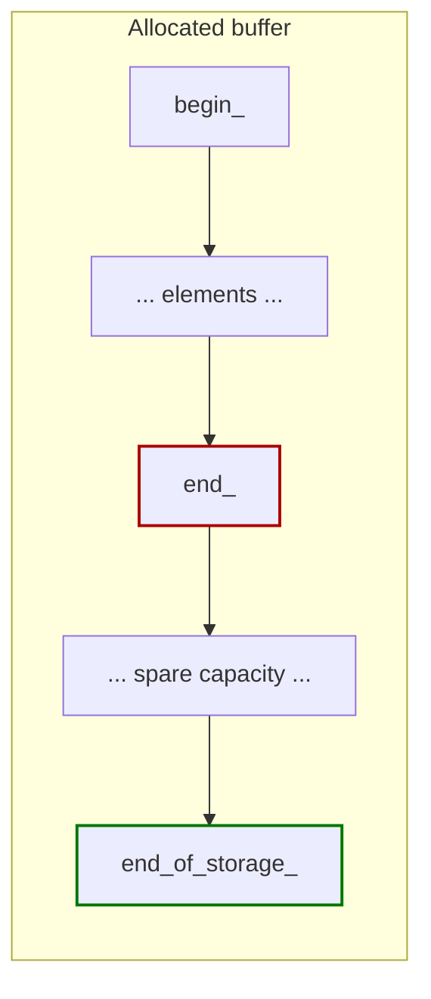
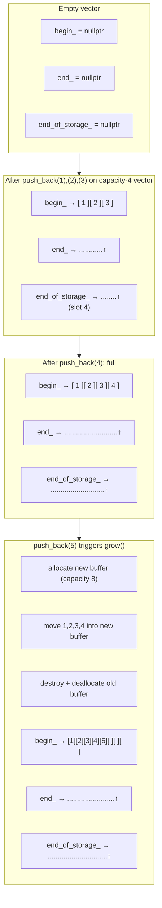
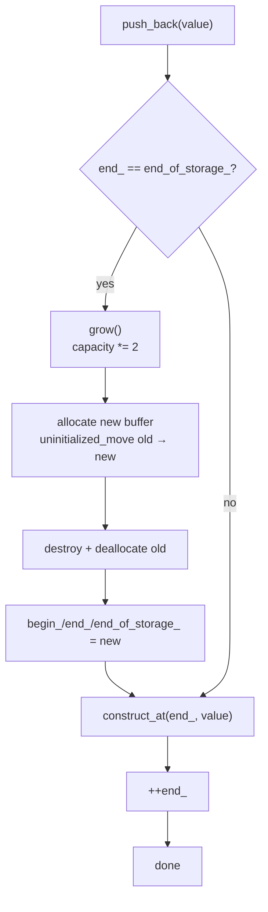

# Build Your Own Vector

## Why

`std::vector` is the most-used container in C++. Most engineers reach for it daily without thinking about what is actually happening under the hood — and that ignorance becomes expensive when:

- A profiling session shows `push_back` causing latency spikes from reallocation.
- A move constructor fails to engage because of a missing `noexcept` annotation, silently triggering slow copies.
- An exception in the middle of a `reserve` leaves the vector in an inconsistent state.
- You need to write a custom allocator or a fixed-capacity vector and have no mental model to start from.

The fastest way to truly understand `std::vector` is to write one. The implementation is small — under 200 lines — but forces you to confront every important concept in modern C++: template design, RAII, the Rule of 5, exception safety, move semantics, `std::allocator_traits`, iterator categories, and `std::initializer_list`. After this exercise, reading `libstdc++`'s `<vector>` becomes trivial, and your own container designs become second nature.

This note walks through building `myvec::vector<T>`, a simplified but functionally complete `std::vector` clone, with the three-pointer memory model, geometric growth, proper iterator support, move semantics, and strong exception guarantee on `push_back`.

## Background

### The three-pointer model

Every dynamic array boils down to three pointers:

| Pointer | Meaning |
|---------|---------|
| `begin_` | First valid element |
| `end_` | One past the last valid element (so `end_ - begin_ == size()`) |
| `end_of_storage_` | One past the last *available* slot (so `end_of_storage_ - begin_ == capacity()`) |

The "spare" capacity between `end_` and `end_of_storage_` is what lets `push_back` be amortized O(1): most of the time you just write one element and bump `end_`; only occasionally do you reallocate.



### Geometric growth

If you grew by a fixed amount (say, +1 slot each time), `n` `push_back` operations would cost O(n²). The trick is to grow **geometrically**: each reallocation doubles the capacity (or multiplies by ~1.5 — both work, and there's a decades-old debate about which is better). With doubling, `n` `push_back` operations cost O(n) total, so each one is amortized O(1).

### The five special members

A proper vector implements the Rule of 5:

1. **Destructor** — frees the buffer.
2. **Copy constructor** — allocates a new buffer, copies elements.
3. **Copy assignment** — handle self-assignment, free old buffer, allocate new, copy.
4. **Move constructor** — steals the three pointers, zeroes the source.
5. **Move assignment** — frees current buffer, steals source's pointers, zeroes source.

The move operations should be `noexcept` — that's how `std::vector::reserve` knows it can move elements rather than copy them when reallocating.

## Main content

### The skeleton

```cpp
#include <cstddef>
#include <memory>
#include <initializer_list>
#include <algorithm>
#include <stdexcept>
#include <utility>

namespace myvec {

template <typename T, typename Alloc = std::allocator<T>>
class vector {
public:
    using value_type      = T;
    using size_type       = std::size_t;
    using difference_type = std::ptrdiff_t;
    using reference       = T&;
    using const_reference = const T&;
    using pointer         = T*;
    using const_pointer   = const T*;
    using iterator        = T*;
    using const_iterator  = const T*;

    vector() noexcept = default;

    explicit vector(size_type n) {
        if (n > 0) {
            begin_ = alloc_n(n);
            end_ = begin_ + n;
            end_of_storage_ = end_;
            std::uninitialized_value_construct_n(begin_, n);
        }
    }

    vector(size_type n, const T& value) {
        if (n > 0) {
            begin_ = alloc_n(n);
            end_ = begin_ + n;
            end_of_storage_ = end_;
            std::uninitialized_fill_n(begin_, n, value);
        }
    }

    vector(std::initializer_list<T> il) {
        if (il.size() > 0) {
            begin_ = alloc_n(il.size());
            end_ = begin_ + il.size();
            end_of_storage_ = end_;
            std::uninitialized_copy(il.begin(), il.end(), begin_);
        }
    }

    // --- The Rule of 5 ---

    ~vector() { destroy(); }

    vector(const vector& other) {
        if (other.size() > 0) {
            begin_ = alloc_n(other.size());
            end_of_storage_ = end_ = std::uninitialized_copy(
                other.begin_, other.end_, begin_);
        }
    }

    vector& operator=(const vector& other) {
        if (this == &other) return *this;
        destroy();
        if (other.size() > 0) {
            begin_ = alloc_n(other.size());
            end_of_storage_ = end_ = std::uninitialized_copy(
                other.begin_, other.end_, begin_);
        }
        return *this;
    }

    vector(vector&& other) noexcept
        : begin_(other.begin_),
          end_(other.end_),
          end_of_storage_(other.end_of_storage_),
          alloc_(std::move(other.alloc_)) {
        other.begin_ = other.end_ = other.end_of_storage_ = nullptr;
    }

    vector& operator=(vector&& other) noexcept {
        if (this == &other) return *this;
        destroy();
        begin_ = other.begin_;
        end_ = other.end_;
        end_of_storage_ = other.end_of_storage_;
        alloc_ = std::move(other.alloc_);
        other.begin_ = other.end_ = other.end_of_storage_ = nullptr;
        return *this;
    }

    // --- Capacity ---

    size_type size()     const noexcept { return end_ - begin_; }
    size_type capacity() const noexcept { return end_of_storage_ - begin_; }
    bool      empty()    const noexcept { return begin_ == end_; }

    void reserve(size_type new_cap) {
        if (new_cap <= capacity()) return;
        reallocate(new_cap);
    }

    void shrink_to_fit() {
        if (size() == capacity()) return;
        reallocate(size());
    }

    // --- Element access ---

    reference       operator[](size_type i)       { return begin_[i]; }
    const_reference operator[](size_type i) const { return begin_[i]; }

    reference at(size_type i) {
        if (i >= size()) throw std::out_of_range("vector::at");
        return begin_[i];
    }
    const_reference at(size_type i) const {
        if (i >= size()) throw std::out_of_range("vector::at");
        return begin_[i];
    }

    reference       front()       { return *begin_; }
    const_reference front() const { return *begin_; }
    reference       back()        { return *(end_ - 1); }
    const_reference back()  const { return *(end_ - 1); }
    pointer         data()        noexcept { return begin_; }
    const_pointer   data()  const noexcept { return begin_; }

    // --- Iterators ---

    iterator       begin()        noexcept { return begin_; }
    const_iterator begin()  const noexcept { return begin_; }
    const_iterator cbegin() const noexcept { return begin_; }
    iterator       end()          noexcept { return end_; }
    const_iterator end()    const noexcept { return end_; }
    const_iterator cend()   const noexcept { return end_; }

    // --- Modifiers ---

    void push_back(const T& value) {
        if (end_ == end_of_storage_) grow();
        std::construct_at(end_, value);
        ++end_;
    }

    void push_back(T&& value) {
        if (end_ == end_of_storage_) grow();
        std::construct_at(end_, std::move(value));
        ++end_;
    }

    template <typename... Args>
    reference emplace_back(Args&&... args) {
        if (end_ == end_of_storage_) grow();
        std::construct_at(end_, std::forward<Args>(args)...);
        ++end_;
        return back();
    }

    void pop_back() {
        --end_;
        std::destroy_at(end_);
    }

    void clear() noexcept {
        std::destroy(begin_, end_);
        end_ = begin_;
    }

    iterator insert(const_iterator pos, const T& value) {
        size_type idx = pos - begin_;
        if (end_ == end_of_storage_) {
            // Reserve room, then re-place. We need to recompute pos because
            // reallocation invalidates it.
            reserve(size() + 1);
        }
        // Shift right by one; the new slot at end_ is constructed, others moved.
        if (idx != size()) {
            std::construct_at(end_, std::move(*(end_ - 1)));
            std::move_backward(begin_ + idx, end_ - 1, end_);
            begin_[idx] = value;
        } else {
            std::construct_at(end_, value);
        }
        ++end_;
        return begin_ + idx;
    }

    iterator erase(const_iterator pos) {
        size_type idx = pos - begin_;
        std::move(begin_ + idx + 1, end_, begin_ + idx);
        --end_;
        std::destroy_at(end_);
        return begin_ + idx;
    }

    void resize(size_type new_size) {
        if (new_size < size()) {
            std::destroy(begin_ + new_size, end_);
            end_ = begin_ + new_size;
        } else if (new_size > size()) {
            reserve(new_size);
            std::uninitialized_value_construct_n(end_, new_size - size());
            end_ = begin_ + new_size;
        }
    }

    void swap(vector& other) noexcept {
        std::swap(begin_, other.begin_);
        std::swap(end_, other.end_);
        std::swap(end_of_storage_, other.end_of_storage_);
    }

private:
    pointer begin_            = nullptr;
    pointer end_              = nullptr;
    pointer end_of_storage_   = nullptr;
    Alloc   alloc_            = Alloc();

    // --- Helpers ---

    pointer alloc_n(size_type n) {
        return std::allocator_traits<Alloc>::allocate(alloc_, n);
    }

    void dealloc(pointer p, size_type n) {
        std::allocator_traits<Alloc>::deallocate(alloc_, p, n);
    }

    void destroy() noexcept {
        if (!begin_) return;
        std::destroy(begin_, end_);
        dealloc(begin_, end_of_storage_ - begin_);
        begin_ = end_ = end_of_storage_ = nullptr;
    }

    // Grow capacity by 2x (or to 1 if empty).
    void grow() {
        size_type new_cap = capacity() == 0 ? 1 : capacity() * 2;
        reallocate(new_cap);
    }

    // The heart of the vector: allocate a new buffer, move elements over,
    // free the old buffer. Strong exception guarantee.
    void reallocate(size_type new_cap) {
        pointer new_begin = alloc_n(new_cap);
        pointer new_end   = new_begin;

        try {
            if constexpr (std::is_nothrow_move_constructible_v<T> ||
                          !std::is_copy_constructible_v<T>) {
                new_end = std::uninitialized_move(begin_, end_, new_begin);
            } else {
                new_end = std::uninitialized_copy(begin_, end_, new_begin);
            }
        } catch (...) {
            // Roll back: destroy anything we managed to construct, free the
            // new buffer, and rethrow.
            std::destroy(new_begin, new_end);
            dealloc(new_begin, new_cap);
            throw;
        }

        // Old buffer cleanup.
        std::destroy(begin_, end_);
        dealloc(begin_, end_of_storage_ - begin_);

        begin_          = new_begin;
        end_            = new_end;
        end_of_storage_ = new_begin + new_cap;
    }
};

template <typename T, typename A>
bool operator==(const vector<T,A>& a, const vector<T,A>& b) {
    return a.size() == b.size() &&
           std::equal(a.begin(), a.end(), b.begin());
}

template <typename T, typename A>
void swap(vector<T,A>& a, vector<T,A>& b) noexcept { a.swap(b); }

} // namespace myvec
```

### Mermaid: vector memory layout



### Mermaid: push_back growth flow



### Walkthrough: the important design choices

#### 1. Why three pointers, not `size` + `capacity` integers?

Both designs work, but the three-pointer model makes `begin()`, `end()`, and `data()` trivial one-liners. With integer indices you'd need `data_ + size_` everywhere, which the compiler may or may not optimize to the same code. The three-pointer form matches what `libstdc++` actually uses.

#### 2. Why `std::allocator_traits` instead of calling `alloc.allocate()` directly?

`std::allocator_traits` is the standard way to use allocators since C++11. It does two things:
- Provides default implementations of allocator operations (`construct`, `destroy`, `max_size`) so custom allocators only need to implement `allocate`/`deallocate`.
- Lets the vector work with both the old-style (C++03) allocator requirements and the modern minimal interface.

If you write `alloc.construct(p, args...)` directly, you break with allocators that don't provide `construct`.

#### 3. Why `uninitialized_move` vs. `uninitialized_copy` in `reallocate`?

This is the **move-if-noexcept** rule. When we reallocate, we want to use the move constructor for speed. But if `T`'s move constructor can throw, moving is dangerous — if it throws halfway through, we've already moved some elements out of the old buffer and we'd lose them.

The standard's solution: use the move constructor only if it is `noexcept`. Otherwise, fall back to copy. The `if constexpr` in our `reallocate` does exactly this:

```cpp
if constexpr (std::is_nothrow_move_constructible_v<T> ||
              !std::is_copy_constructible_v<T>) {
    new_end = std::uninitialized_move(begin_, end_, new_begin);
} else {
    new_end = std::uninitialized_copy(begin_, end_, new_begin);
}
```

The second clause `!std::is_copy_constructible_v<T>` handles types like `std::unique_ptr` that are move-only: even if their move isn't `noexcept`, we have no choice but to move.

#### 4. Why `noexcept` on move operations matters

When the user writes `std::vector<MyType> v2 = std::move(v1);`, the standard library checks `noexcept` to decide between move and copy at element granularity. If `MyType`'s move constructor isn't `noexcept`, `std::vector` will *copy* every element to preserve the strong exception guarantee. Your own `vector` should follow the same rule, which is why we annotate `vector(vector&&) noexcept` and `operator=(vector&&) noexcept`.

#### 5. Exception safety on `push_back`

`push_back` provides the **strong exception guarantee**: if it fails, the vector is unchanged. The trick is that we `grow()` first (which itself is strong), then construct the new element at `end_`. If construction throws, only the new element is destroyed; the existing elements are untouched, and the size hasn't changed.

#### 6. Iterator invalidation rules

Document these clearly for your users:

| Operation | Iterators |
|-----------|-----------|
| `push_back`, `emplace_back` | All invalid if reallocation happened; only `end()` if not. |
| `insert`, `erase` | All iterators at or after the modification point. |
| `reserve`, `shrink_to_fit` | All iterators. |
| `swap` | Iterators stay associated with their original container (per standard). |

### A simple test driver

```cpp
#include "myvec.hpp"
#include <cassert>
#include <string>
#include <iostream>

int main() {
    myvec::vector<int> v;
    for (int i = 0; i < 10; ++i) v.push_back(i);
    assert(v.size() == 10);
    assert(v[0] == 0 && v[9] == 9);
    assert(v.capacity() >= 10);

    myvec::vector<std::string> s{"alpha", "beta", "gamma"};
    assert(s.size() == 3);
    assert(s[1] == "beta");

    // Move semantics
    myvec::vector<std::string> s2 = std::move(s);
    assert(s2.size() == 3);
    assert(s.size() == 0);

    // emplace_back
    s2.emplace_back(5, 'x');
    assert(s2.back() == "xxxxx");

    // Iteration
    int sum = 0;
    for (int x : v) sum += x;
    assert(sum == 45);

    // erase / insert
    v.erase(v.begin() + 5);
    assert(v.size() == 9);
    v.insert(v.begin(), -1);
    assert(v[0] == -1);

    std::cout << "All tests passed.\n";
    return 0;
}
```

### Common Pitfalls

> [!danger] Forgetting self-assignment in `operator=`
> `v = v;` must be a no-op. The check `if (this == &other) return *this;` at the top of `operator=` is non-negotiable. Without it, you destroy your own buffer before "copying from" yourself — instant crash.

> [!danger] Move-only types and copy fallback
> If `T` is move-only (e.g., `std::unique_ptr`), your `reallocate` must use move, not copy. The `if constexpr` shown above handles this; a simpler "always copy" implementation silently fails to compile.

> [!danger] Mixing `nothrow_move` and `is_copy_constructible` checks
> The correct condition is `is_nothrow_move_constructible_v<T> || !is_copy_constructible_v<T>`. Just checking the former breaks for move-only types whose move can throw.

> [!warning] Not using `std::uninitialized_*` for raw memory
> `std::copy` requires the destination to already contain constructed objects. Use `std::uninitialized_copy`, `std::uninitialized_move`, `std::uninitialized_fill`, `std::uninitialized_value_construct_n` when writing into freshly allocated memory.

> [!warning] `noexcept` on moves that aren't actually noexcept
> If you annotate `vector(vector&&) noexcept` but `Alloc`'s move constructor can throw, the program may terminate. Either constrain the `noexcept` with `std::is_nothrow_move_constructible_v<Alloc>` or accept that allocators must be nothrow-movable (the standard requires this for `std::allocator`).

> [!warning] `std::move_backward` direction
> When inserting at `idx`, you need to shift elements `[idx, end_)` right by one. `std::move_backward(begin_ + idx, end_, end_ + 1)` is correct because it processes from the back forward, avoiding overwriting elements you haven't yet moved. Using `std::move` here silently corrupts data.

> [!warning] Double-destroy on `clear` + destructor
> `clear()` only destroys elements; it doesn't free the buffer. The destructor must still call `dealloc`. Make sure your `destroy()` helper handles both — and only runs once.

### Tips and Tricks

- **Add `constexpr` to everything C++20 allows** (`std::vector` itself is `constexpr` in C++20). It's a great way to verify compile-time correctness.
- **Use `[[nodiscard]]`** on `size()`, `capacity()`, `empty()`, `data()`.
- **Specialize `std::swap` for your vector** via the `swap` member plus an ADL free function so generic code finds it.
- **Provide `operator<=>`** (C++20) for full comparison support with one line: `auto operator<=>(const vector&) const = default;`
- **Consider `try_emplace_back` / `push_back_range` (C++23)** as exercises for the reader.
- **Track allocations in debug builds**: add a static counter `++allocations_;` inside `alloc_n` and print it on destruction to spot wasteful patterns.
- **Profile growth factors**: try 1.5× vs 2× on your workload. The 1.5× factor eventually allows freed blocks to be reused by the next allocation; 2× never does. Both are O(1) amortized.
- **For very large vectors**, consider `std::pmr::polymorphic_allocator` instead of a template `Alloc` parameter — it lets users swap allocators at runtime.

### Active Recall

> [!question] Q1
> Why does `std::vector::push_back` provide the strong exception guarantee, but `std::vector::insert` (in the middle) does not?
>
> **Answer:** `push_back` only ever touches the end; if construction fails, the existing elements are untouched. `insert` in the middle has to shift existing elements to make room. If a move during the shift throws, you've already moved some elements out of their original positions and the vector is in an indeterminate state — so insert is only basic guarantee.

> [!question] Q2
> A user's type `T` has a `noexcept` move constructor. Another type `U` has a throwing move but no copy constructor. What does your `reallocate` do in each case?
>
> **Answer:** For `T`, it uses `std::uninitialized_move` (fast). For `U`, it also uses `std::uninitialized_move` because `U` is not copy-constructible — there is no fallback, so we must move despite the possibility of a throw. (In that case, we lose the strong guarantee on reallocation; we can only offer basic guarantee.)

> [!question] Q3
> Why must `vector(vector&&)` be `noexcept`?
>
> **Answer:** So that other code (e.g., `std::vector::reserve` when the element type is your `vector`) can use move instead of copy. Without `noexcept`, the standard library will copy your vector element-by-element to preserve the strong exception guarantee, which defeats the purpose of move semantics.

> [!question] Q4
> Why use `std::allocator_traits<Alloc>::allocate(alloc_, n)` instead of `alloc_.allocate(n)`?
>
> **Answer:** `allocator_traits` provides uniform, defaulted behavior across allocator types. Custom allocators are required to provide only `allocate` and `deallocate`; everything else (`construct`, `destroy`, `max_size`, `select_on_container_copy_construction`) is filled in by traits. Calling `alloc_.construct(...)` directly breaks with allocators that don't define it.

### Next Steps

- Next project: [[2. Build Your Own String]] — same three-pointer model but with SSO bolted on.
- For thread-safe containers built on top of this: [[3. Build a Thread Pool]] and [[5. Build Your Own Redis]].
- Re-read [[11. STL Deep Dive/2. Sequence Containers]] with the implementer's eye — every design choice now makes sense.
- Read [[9. Object-Oriented Programming/8. The Rule of 0, 3, and 5]] for the rule you just implemented.
- Read [[8. Modern C++/4. Move Semantics]] and [[8. Modern C++/5. Perfect Forwarding]] — `emplace_back` uses perfect forwarding via `Args&&...`.
- Read [[13. Error Handling and Exceptions/3. Exception Safety Guarantees]] for the strong/basic/nothrow contracts you just fulfilled.
- Read [[7. Memory Management/4. RAII]] for the lifetime pattern that `destroy()` enforces.
