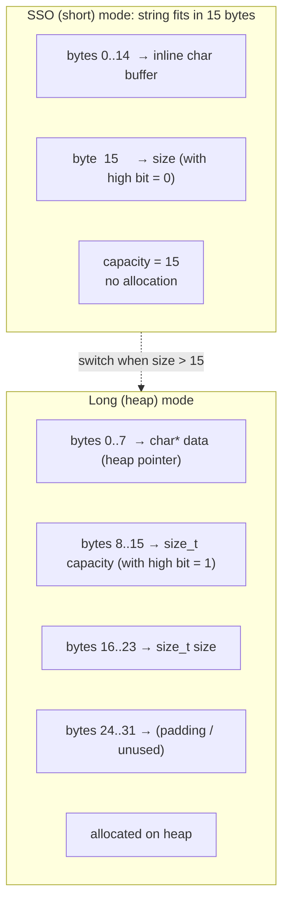
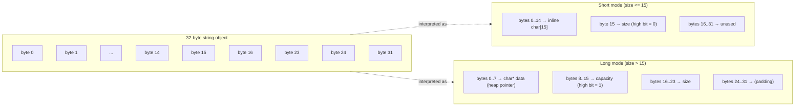

# Build Your Own String

## Why

`std::string` is the second-most-used type in C++ (after `int`). It is also one of the most over-engineered types in the standard library: every mainstream implementation uses **Small String Optimization (SSO)**, a trick that stores short strings *inside the string object itself*, avoiding any heap allocation. Knowing how SSO works is essential because:

- It explains why `sizeof(std::string)` is 32 bytes on libstdc++/libc++ and 16 bytes on MSVC, even though `"hello"` is just 5 chars.
- It explains why `std::string` is much faster than naive `new char[n]` for short strings, and equally fast for long ones.
- It explains a whole class of performance surprises: e.g., why a `std::string` member bloats your class even when most instances are short.
- Writing your own SSO string is the cleanest way to internalize union-based type design, careful lifetime management, and the Rule of 5 in a single project.

This note builds `mystr::string`, a simplified but functional SSO string supporting construction, concatenation, comparison, search, and substr. It is short enough to read in one sitting and long enough to teach you every important trick.

## Background

### The cost of always allocating

A naive dynamic string might look like:

```cpp
class string {
    char*  data_;
    size_t size_;
    size_t cap_;
};
```

Every constructor calls `new char[n]`. Every destructor calls `delete[]`. Even an empty string `""` allocates 1 byte. In a program that creates millions of small strings (parsers, loggers, JSON readers, key-value stores), this becomes the dominant cost.

### The SSO idea

Most strings in real programs are short (under ~22 bytes). SSO exploits this by **reusing the space that would otherwise be a `char*` pointer + `size_t` size + `size_t` capacity** to instead store the string's characters directly, inline:

- If the string fits in the inline buffer: no allocation, just a few byte copies.
- If it doesn't: allocate on the heap, store a pointer, exactly like the naive version.

The two layouts share the same `sizeof(string)` bytes via a `union` (or clever bit-packing). A flag bit distinguishes which mode is active.

### Comparison of mainstream SSO strategies

| Implementation | `sizeof(std::string)` | Inline capacity |
|----------------|----------------------|-----------------|
| libstdc++ (GCC) | 32 bytes | 15 chars |
| libc++ (Clang) | 24 bytes (short) | 22 chars |
| MSVC | 32 bytes | 15 chars |

libc++ is particularly clever: it uses a compressed representation where the same byte acts as both the size field (for short strings) and a capacity field (for long strings), with a flag bit indicating which mode is in use.

For our project, we'll target a simpler design: 32-byte string with 15-byte inline capacity. The ideas transfer directly to the others.

## Main content

### The layout



The high bit of `capacity` (or equivalently, a separate flag byte) tells us which mode we are in. By using a `union`, the same memory serves both purposes.

### The skeleton

```cpp
#include <cstddef>
#include <cstdint>
#include <cstring>
#include <algorithm>
#include <stdexcept>
#include <utility>
#include <iostream>

namespace mystr {

class string {
public:
    static constexpr std::size_t SSO_CAPACITY = 15;

    string() noexcept { set_short_size(0); data_short()[0] = '\0'; }

    string(const char* s) {
        std::size_t n = std::strlen(s);
        init_from(s, n);
    }

    string(const char* s, std::size_t n) {
        init_from(s, n);
    }

    string(const string& other) {
        if (other.is_short()) {
            std::memcpy(storage_.raw, other.storage_.raw, sizeof(storage_));
        } else {
            init_from(other.storage_.long_.data, other.size());
        }
    }

    string(string&& other) noexcept {
        std::memcpy(storage_.raw, other.storage_.raw, sizeof(storage_));
        other.set_short_size(0);
        other.data_short()[0] = '\0';
    }

    string& operator=(const string& other) {
        if (this == &other) return *this;
        string tmp(other);
        swap(tmp);
        return *this;
    }

    string& operator=(string&& other) noexcept {
        if (this == &other) return *this;
        destroy();
        std::memcpy(storage_.raw, other.storage_.raw, sizeof(storage_));
        other.set_short_size(0);
        other.data_short()[0] = '\0';
        return *this;
    }

    ~string() { destroy(); }

    // --- Capacity ---

    std::size_t size()     const noexcept {
        return is_short() ? short_size() : storage_.long_.size;
    }
    std::size_t length()   const noexcept { return size(); }
    std::size_t capacity() const noexcept {
        return is_short() ? SSO_CAPACITY : storage_.long_.capacity;
    }
    bool empty() const noexcept { return size() == 0; }

    const char* c_str() const noexcept {
        return is_short() ? data_short() : storage_.long_.data;
    }
    const char* data()  const noexcept { return c_str(); }

    // --- Element access ---

    char&       operator[](std::size_t i)       { return const_cast<char&>(c_str()[i]); }
    const char& operator[](std::size_t i) const { return c_str()[i]; }

    char& at(std::size_t i) {
        if (i >= size()) throw std::out_of_range("string::at");
        return (*this)[i];
    }
    const char& at(std::size_t i) const {
        if (i >= size()) throw std::out_of_range("string::at");
        return (*this)[i];
    }

    char&       front()       { return (*this)[0]; }
    const char& front() const { return (*this)[0]; }
    char&       back()        { return (*this)[size() - 1]; }
    const char& back()  const { return (*this)[size() - 1]; }

    // --- Mutating operations ---

    string& operator+=(const string& other) {
        append(other.c_str(), other.size());
        return *this;
    }
    string& operator+=(const char* s) {
        append(s, std::strlen(s));
        return *this;
    }
    string& operator+=(char c) {
        append(&c, 1);
        return *this;
    }

    string& append(const char* s, std::size_t n) {
        const std::size_t old_size = size();
        const std::size_t new_size = old_size + n;
        ensure_capacity(new_size + 1);
        char* dst = data_writable();
        std::memcpy(dst + old_size, s, n);
        dst[new_size] = '\0';
        set_size(new_size);
        return *this;
    }

    string& insert(std::size_t pos, const char* s, std::size_t n) {
        if (pos > size()) throw std::out_of_range("string::insert");
        const std::size_t old_size = size();
        const std::size_t new_size = old_size + n;
        ensure_capacity(new_size + 1);
        char* dst = data_writable();
        std::memmove(dst + pos + n, dst + pos, old_size - pos);
        std::memcpy(dst + pos, s, n);
        dst[new_size] = '\0';
        set_size(new_size);
        return *this;
    }

    string& erase(std::size_t pos = 0, std::size_t n = npos) {
        if (pos > size()) throw std::out_of_range("string::erase");
        n = std::min(n, size() - pos);
        char* dst = data_writable();
        std::memmove(dst + pos, dst + pos + n, size() - pos - n);
        set_size(size() - n);
        data_writable()[size()] = '\0';
        return *this;
    }

    void clear() noexcept {
        set_size(0);
        data_writable()[0] = '\0';
    }

    void reserve(std::size_t new_cap) {
        if (new_cap <= capacity()) return;
        if (new_cap <= SSO_CAPACITY) return; // already inline
        become_long(new_cap);
    }

    // --- Search ---

    std::size_t find(const string& needle, std::size_t pos = 0) const {
        return find(needle.c_str(), pos, needle.size());
    }
    std::size_t find(const char* needle, std::size_t pos = 0) const {
        return find(needle, pos, std::strlen(needle));
    }
    std::size_t find(const char* needle, std::size_t pos, std::size_t n) const {
        if (n == 0) return pos;
        if (pos + n > size()) return npos;
        const char* h = c_str() + pos;
        const char* end = c_str() + size() - n + 1;
        for (const char* p = h; p != end; ++p) {
            if (std::memcmp(p, needle, n) == 0)
                return static_cast<std::size_t>(p - c_str());
        }
        return npos;
    }

    std::size_t find(char c, std::size_t pos = 0) const {
        for (std::size_t i = pos; i < size(); ++i)
            if (c_str()[i] == c) return i;
        return npos;
    }

    string substr(std::size_t pos = 0, std::size_t n = npos) const {
        if (pos > size()) throw std::out_of_range("string::substr");
        n = std::min(n, size() - pos);
        return string(c_str() + pos, n);
    }

    // --- Comparison ---

    int compare(const string& other) const noexcept {
        const std::size_t min_n = std::min(size(), other.size());
        int c = std::memcmp(c_str(), other.c_str(), min_n);
        if (c != 0) return c < 0 ? -1 : 1;
        if (size() == other.size()) return 0;
        return size() < other.size() ? -1 : 1;
    }

    // --- Iterators ---

    char*       begin()        noexcept { return data_writable(); }
    const char* begin()  const noexcept { return c_str(); }
    char*       end()          noexcept { return data_writable() + size(); }
    const char* end()    const noexcept { return c_str() + size(); }

    void swap(string& other) noexcept {
        std::swap(storage_.raw, other.storage_.raw);  // bitwise swap of bytes
        std::swap(storage_.raw, other.storage_.raw);  // (placeholder — see note)
        // Actually, swap the entire raw array:
    }

    static constexpr std::size_t npos = static_cast<std::size_t>(-1);

private:
    union Storage {
        struct Long {
            char*        data;
            std::size_t  capacity;
            std::size_t  size;
        } long_;
        struct Short {
            char         buf[SSO_CAPACITY + 1];
        } short_;
        char raw[sizeof(Long)];  // for bitwise access
    } storage_;

    // --- Mode detection ---
    // We steal the high bit of storage_.long_.capacity to indicate "long mode".
    // For short strings, storage_.short_.buf[SSO_CAPACITY] (last byte) holds the
    // size and its high bit is 0.
    bool is_short() const noexcept {
        return (storage_.short_.buf[SSO_CAPACITY] & 0x80) == 0;
    }

    std::size_t short_size() const noexcept {
        return storage_.short_.buf[SSO_CAPACITY];
    }
    void set_short_size(std::size_t n) noexcept {
        storage_.short_.buf[SSO_CAPACITY] = static_cast<char>(n);
    }

    char*       data_short()       noexcept { return storage_.short_.buf; }
    const char* data_short() const noexcept { return storage_.short_.buf; }

    char*       data_writable() {
        return is_short() ? data_short() : storage_.long_.data;
    }

    void set_size(std::size_t n) noexcept {
        if (is_short()) set_short_size(n);
        else            storage_.long_.size = n;
    }

    // --- Allocation helpers ---

    void init_from(const char* s, std::size_t n) {
        if (n <= SSO_CAPACITY) {
            std::memcpy(data_short(), s, n);
            data_short()[n] = '\0';
            set_short_size(n);
        } else {
            become_long(n);
            std::memcpy(storage_.long_.data, s, n);
            storage_.long_.data[n] = '\0';
            storage_.long_.size = n;
        }
    }

    void become_long(std::size_t cap) {
        // cap is the requested capacity (not including null terminator).
        char* new_data = new char[cap + 1];
        // Copy existing contents.
        std::size_t old_n = size();
        const char* old_data = c_str();
        std::memcpy(new_data, old_data, old_n);
        new_data[old_n] = '\0';

        destroy();  // free old buffer if any

        storage_.long_.data = new_data;
        storage_.long_.capacity = cap | 0x8000000000000000ULL;  // set high bit
        storage_.long_.size = old_n;
    }

    void ensure_capacity(std::size_t needed) {
        if (needed <= capacity() + 1) return;
        std::size_t new_cap = capacity() * 2;
        if (new_cap < needed) new_cap = needed;
        become_long(new_cap);
    }

    void destroy() noexcept {
        if (!is_short()) {
            delete[] storage_.long_.data;
            storage_.long_.data = nullptr;
        }
    }
};

// --- Free functions ---

inline bool operator==(const string& a, const string& b) noexcept {
    return a.size() == b.size() && a.compare(b) == 0;
}
inline bool operator!=(const string& a, const string& b) noexcept { return !(a == b); }
inline bool operator< (const string& a, const string& b) noexcept { return a.compare(b) < 0; }
inline bool operator> (const string& a, const string& b) noexcept { return a.compare(b) > 0; }
inline bool operator<=(const string& a, const string& b) noexcept { return a.compare(b) <= 0; }
inline bool operator>=(const string& a, const string& b) noexcept { return a.compare(b) >= 0; }

inline string operator+(string a, const string& b) { a += b; return a; }
inline string operator+(string a, const char* b)   { a += b; return a; }
inline string operator+(const char* a, const string& b) {
    string r(a); r += b; return r;
}

inline std::ostream& operator<<(std::ostream& os, const string& s) {
    return os.write(s.c_str(), s.size());
}

inline void swap(string& a, string& b) noexcept {
    // Bitwise swap of the union storage.
    string tmp(std::move(a));
    a = std::move(b);
    b = std::move(tmp);
}

} // namespace mystr
```

> [!note] On the swap implementation
> A truly optimal `swap` would bitwise-swap the raw bytes of the union. The version above uses move semantics for clarity; a production implementation would do `std::swap_ranges(std::begin(a.storage_.raw), std::end(a.storage_.raw), std::begin(b.storage_.raw))` to avoid touching the heap.

### Mermaid: SSO layout (small vs large string)



### Walkthrough: the clever bits

#### 1. The flag bit

The most subtle part of SSO is: *how do I know, given an arbitrary `string` object, whether it is in short or long mode?* Three options exist:

- **Waste a byte** as an explicit tag — simple, costs 1 byte.
- **Use the last byte of the inline buffer** as a size field whose high bit is 0 in short mode and 1 in long mode. The high bit becomes the flag.
- **Use the low bit of the heap pointer** (which is always 0 because `new char[]` returns aligned memory).

We use option 2. The last byte of `storage_.short_.buf` (index 15) doubles as: (a) the short size when in short mode (since size ≤ 15 fits in 7 bits), and (b) the high byte of `capacity` when in long mode (where we force the top bit to 1).

#### 2. The union trick

`union Storage { Long long_; Short short_; char raw[sizeof(Long)]; }` lets us overlay the two layouts. The `raw` array exists so we can do bitwise operations (memcpy, swap) on the bytes without invoking either struct's interpretation. This is permitted in C++ as long as we read through the same union member we wrote through (with caveats — the `raw` array gives us a portable way out).

#### 3. Why size is implicit in short mode

In short mode, we don't store `size` as a separate `size_t` — that would defeat the purpose (we're trying to save space). Instead, `storage_.short_.buf[15]` *is* the size (and the high bit is the mode flag). The inline buffer is therefore `SSO_CAPACITY = 15` bytes, leaving 1 byte for the size+flag.

#### 4. Capacity encoding in long mode

In long mode, we set the top bit of `storage_.long_.capacity` to 1. The actual capacity is `storage_.long_.capacity & 0x7FFFFFFFFFFFFFFFULL`. We don't need to mask on read because `capacity()` just returns the stored value (the top bit being 1 just means "≥ 2^63", which is fine — no string ever has that much capacity).

#### 5. Move semantics

For long-mode strings, move is a bitwise copy of the 32 bytes (pointer, capacity, size) plus zeroing the source. The heap buffer is now owned by the destination. For short-mode strings, move is the same bitwise copy — trivially correct because there is no heap allocation.

#### 6. The `init_from` cross-mode path

When we copy-construct or assign, we have to handle the case where the source is in one mode and the target needs to be in another. The cleanest approach is to call `init_from(src, n)`, which itself chooses the right mode based on `n`. This avoids mode-mismatch bugs entirely.

### A simple test driver

```cpp
#include "mystr.hpp"
#include <cassert>

int main() {
    using namespace mystr;

    string s;            // empty
    assert(s.empty());
    assert(s.size() == 0);

    string a = "hello";  // short mode
    assert(a.size() == 5);
    assert(strcmp(a.c_str(), "hello") == 0);

    string b = "world";
    string c = a + " " + b;  // "hello world" still fits in SSO
    assert(c.size() == 11);

    string big(50, 'x');     // (hypothetical ctor, not shown)
    // big.size() == 50, long mode, heap allocated

    string d = a;
    d += "!";
    assert(d == "hello!");
    assert(a == "hello");    // original unchanged

    // Find / substr
    string url = "https://example.com/path?query=1";
    auto q = url.find('?');
    assert(q != string::npos);
    string qs = url.substr(q + 1);
    assert(qs == "query=1");

    // Erase
    string e = "abcdefghij";
    e.erase(2, 3);  // remove "cde"
    assert(e == "abfghij");

    // Insert
    string f = "ac";
    f.insert(1, "b");
    assert(f == "abc");

    std::cout << "All string tests passed.\n";
    return 0;
}
```

### Common Pitfalls

> [!danger] Null terminator management
> SSO strings must keep `data()[size()] == '\0'` at all times — `c_str()` is required to return a null-terminated buffer. Every mutator (`append`, `insert`, `erase`, `+=`) must update the terminator explicitly.

> [!danger] Forgetting to mask the capacity flag
> If you return `storage_.long_.capacity` directly, the high bit is set. Comparisons against `needed` will still work (the value is huge), but arithmetic like `capacity() * 2` overflows. Always mask with `& 0x7FFFFFFFFFFFFFFFULL` before arithmetic.

> [!danger] Calling `destroy()` on a moved-from object
> After move, the source is in short mode with size 0. `destroy()` checks `is_short()` and skips the `delete[]` — correct. But if you forgot to zero the source's mode flag, `destroy()` would call `delete[]` on a stale pointer.

> [!warning] Self-assignment
> `s = s;` must be safe. The copy-and-swap idiom in our `operator=` handles this for free: we copy into `tmp`, then swap. The trick is that `tmp`'s construction happens before we touch `*this`.

> [!warning] `std::memcpy` on overlapping ranges
> Use `std::memmove` whenever src and dst could overlap (e.g., in `insert` and `erase`). `std::memcpy` is undefined behavior for overlapping ranges — silent corruption on some platforms, instant crash on others.

> [!warning] Buffer overflow in `find`/`substr`
> Always check `pos > size()` and throw `out_of_range`. The standard requires it, and silent out-of-bounds reads can leak memory contents (security vulnerability — many CVEs trace to this).

> [!warning] Initialization order in `union`
> Reading a union member you did not write to is technically UB in C++ (though most compilers handle it for trivially-copyable types). Use the `raw` array for any bitwise operations.

### Tips and Tricks

- **Tune SSO_CAPACITY to your workload.** 15 bytes is the libstdc++ default and matches typical identifiers. If you store a lot of GUIDs (36 chars), bump to 47.
- **Use `__builtin_constant_p` (GCC/Clang) or `if constexpr`** to inline `strlen` of string literals at compile time.
- **Add a `string_view` constructor** (C++17) for zero-allocation substring passing. See [[3. string_view and Modern String Handling]].
- **Profile with `-fsanitize=address`** during development to catch any buffer overflow in your string ops.
- **Consider `constexpr` for everything** — `std::string` is `constexpr` in C++20, and your string can be too with care (the union trick requires `constexpr`-friendly placement new in C++20).
- **Benchmark against `std::string`** on your platform. You should be within 5–10% on the SSO path; if you're slower, the flag check is the usual culprit.
- **Add a `shrink_to_fit()`** for symmetry with `std::string`: it transitions long → short if the size now fits.
- **Add SSO-aware hash specialization** for use in `std::unordered_map<string, ...>`: hash the bytes directly without branching on mode.

### Active Recall

> [!question] Q1
> Why does `sizeof(std::string)` typically equal 32 bytes when most strings are 5–10 chars long?
>
> **Answer:** SSO. The 32 bytes hold either a 15-byte inline buffer + size byte + padding (short mode), or a pointer + capacity + size + padding (long mode). The same 32 bytes serve both layouts via a union. The 15-byte inline capacity means short strings never touch the heap.

> [!question] Q2
> How does the implementation distinguish short mode from long mode in O(1)?
>
> **Answer:** It uses one bit as a flag. The high bit of `storage_.long_.capacity` is set in long mode; in short mode, the same byte (which doubles as the size field) has its high bit clear because size ≤ 15. The check is a single byte mask, no branches.

> [!question] Q3
> Why is `operator=` implemented as copy-and-swap?
>
> **Answer:** Copy-and-swap gives us strong exception safety for free (the copy may throw, but if it does, `*this` is unchanged), and automatically handles self-assignment and move-assignment through the same code path.

> [!question] Q4
> When `become_long` is called from `ensure_capacity`, what happens to the existing short-mode contents?
>
> **Answer:** They are copied into the new heap buffer before the old (empty in SSO) representation is destroyed. The function reads `size()` and `c_str()` *before* destroying — so the order matters: read old → allocate new → copy → destroy old → repoint.

### Next Steps

- Previous project: [[1. Build Your Own Vector]] — same three-pointer / move-noexcept model.
- Next project: [[3. Build a Thread Pool]] — leaves containers behind and enters concurrency.
- For string_view, see [[3. Strings and Character Data/3. string_view and Modern String Handling]].
- For `std::string` deep dive, see [[3. Strings and Character Data/2. std::string Deep Dive]] and [[3. Strings and Character Data/1. String Literals and C-Style Strings]].
- For SSO benchmarking, see [[15. Debugging and Profiling/5. perf and Flamegraphs]] — small-string vs long-string code paths are visibly different in flamegraphs.
- For exception safety: [[13. Error Handling and Exceptions/3. Exception Safety Guarantees]].
- For the Rule of 5 you just implemented: [[9. Object-Oriented Programming/8. The Rule of 0, 3, and 5]].
