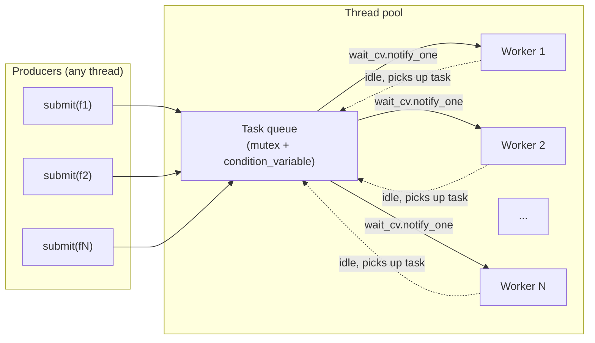
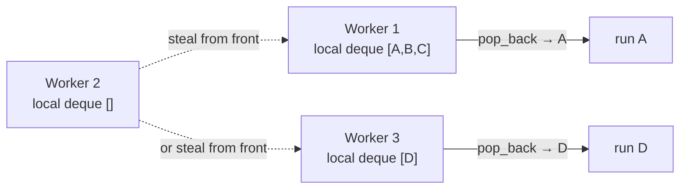
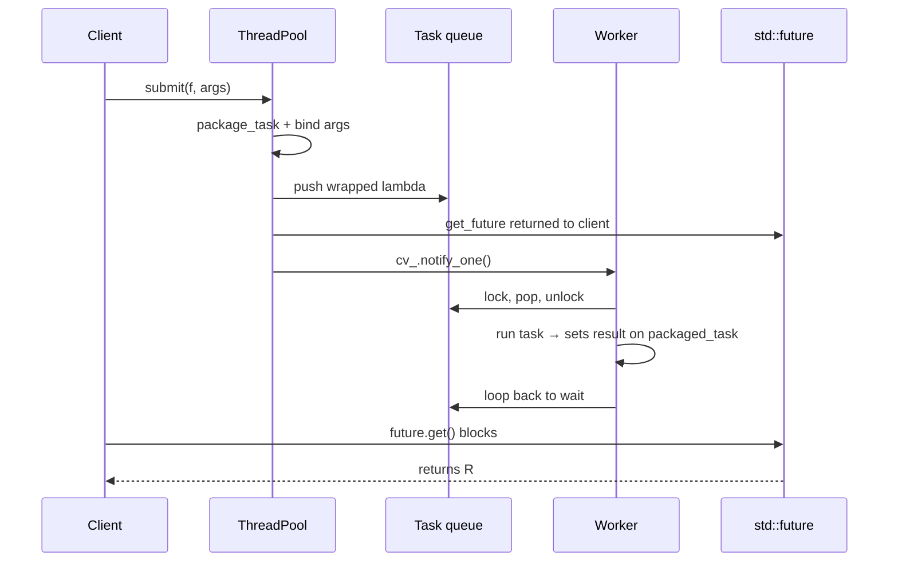

# Build a Thread Pool

## Why

Spawning a new `std::thread` per task is expensive: each thread costs ~1–8 MB of stack, takes ~10–100 μs to create (kernel + userspace), and forces the OS scheduler to do extra work. In a server that processes thousands of short tasks per second, this overhead dominates the actual work.

A **thread pool** solves this by pre-creating a fixed set of worker threads and reusing them for many tasks. Tasks are submitted to a queue; idle workers pick up tasks; busy workers come back to the queue when finished. The result is bounded resource usage, amortized thread creation cost, and a clean API (`pool.submit([]{ ... })` returns a `std::future`).

A thread pool is the right abstraction whenever:
- You have a stream of short, independent units of work.
- You want to limit concurrency (avoid 10000-thread thundering herds).
- You want to decouple task submission from task execution.

This note builds a modern, correct, exception-safe thread pool in C++17/20, then extends it with **graceful shutdown**, **priority queue support**, and a sketch of **work stealing**.

## Background

### The actors



The three pieces:
1. **Task queue** — a thread-safe FIFO (or priority queue) of pending tasks.
2. **Workers** — `N` `std::thread`s that loop: lock → wait while (queue empty and not stopped) → pop one → unlock → run → repeat.
3. **Coordinator** — owns the threads, exposes `submit()`, handles shutdown.

### Why `std::future`?

`submit()` returns `std::future<T>` so the caller can:
- Block on the result with `.get()`.
- Check status with `.wait_for(...)` for non-blocking polls.
- Pass the future to other code without exposing the task itself.

`std::future` is the lingua franca of "I'll have a result later" in C++.

### The shutdown problem

The hard part of a thread pool is not running tasks — it's stopping cleanly. There are three flavors of shutdown:

| Shutdown mode | Behavior |
|---------------|----------|
| **Immediate** (drop pending) | Stop accepting tasks, wake all workers, workers exit when queue is empty. |
| **Graceful** (drain queue) | Stop accepting tasks, workers keep running until queue is drained, then exit. |
| **Cancel** (interrupt running) | Not supported by `std::thread` directly — needs cooperative cancellation. |

We implement graceful shutdown. Immediate is a one-line variation.

## Main content

### Version 1: a basic pool

```cpp
#include <thread>
#include <mutex>
#include <condition_variable>
#include <queue>
#include <functional>
#include <future>
#include <vector>
#include <memory>
#include <type_traits>
#include <utility>

class ThreadPool {
public:
    explicit ThreadPool(std::size_t num_threads = std::thread::hardware_concurrency()) {
        for (std::size_t i = 0; i < num_threads; ++i) {
            workers_.emplace_back([this] { worker_loop(); });
        }
    }

    ~ThreadPool() {
        {
            std::lock_guard<std::mutex> lk(mu_);
            stop_ = true;
        }
        cv_.notify_all();
        for (auto& w : workers_) {
            if (w.joinable()) w.join();
        }
    }

    // Submit a callable, return a future to its result.
    template <typename F, typename... Args>
    auto submit(F&& f, Args&&... args)
        -> std::future<std::invoke_result_t<F, Args...>>
    {
        using R = std::invoke_result_t<F, Args...>;

        auto task = std::make_shared<std::packaged_task<R()>>(
            [f = std::forward<F>(f),
             args = std::make_tuple(std::forward<Args>(args)...)]() mutable -> R {
                return std::apply(std::move(f), std::move(args));
            });

        std::future<R> fut = task->get_future();
        {
            std::lock_guard<std::mutex> lk(mu_);
            if (stop_)
                throw std::runtime_error("ThreadPool: submit on stopped pool");
            tasks_.emplace([task]() { (*task)(); });
        }
        cv_.notify_one();
        return fut;
    }

private:
    void worker_loop() {
        while (true) {
            std::function<void()> task;
            {
                std::unique_lock<std::mutex> lk(mu_);
                cv_.wait(lk, [this] { return stop_ || !tasks_.empty(); });
                if (stop_ && tasks_.empty())
                    return;  // graceful shutdown: drain queue, then exit
                task = std::move(tasks_.front());
                tasks_.pop();
            }
            task();  // run outside the lock
        }
    }

    std::vector<std::thread>          workers_;
    std::queue<std::function<void()>> tasks_;
    std::mutex                        mu_;
    std::condition_variable           cv_;
    bool                              stop_ = false;
};
```

### How it works, step by step

#### `submit()`

1. Wrap the callable + arguments in a `std::packaged_task<R()>`. We use `std::make_shared` so the task can be captured by value into a `std::function<void()>` (the queue's element type) — `std::function` requires its target to be copyable, and `packaged_task` is move-only.
2. Get the `std::future<R>` from the task before enqueueing.
3. Wrap the shared `packaged_task` in a lambda that calls `(*task)()`. This lambda is copyable (it captures by value a `shared_ptr`).
4. Lock the queue, push the lambda, unlock, and `notify_one` to wake one idle worker.

#### Worker loop

1. Acquire the lock.
2. `cv_.wait(lk, predicate)` releases the lock and sleeps until either `predicate()` is true or spurious wakeup. When woken, it re-acquires the lock and checks the predicate.
3. The predicate is `stop_ || !tasks_.empty()` — wake up if there's work or if we're shutting down.
4. If shutting down *and* the queue is empty, exit. If shutting down but queue has work, drain it.
5. Otherwise pop a task, release the lock, run the task.

#### Destructor

1. Lock, set `stop_ = true`, unlock.
2. `notify_all` wakes every worker.
3. `join` each worker. Workers drain the queue then exit.

### Mermaid: thread pool architecture

```mermaid
flowchart TB
    subgraph Client["Client threads"]
        C1["submit(f1)"]
        C2["submit(f2)"]
    end
    subgraph PoolBox["ThreadPool"]
        Lock["mu_ (mutex)"]
        CV["cv_ (condition_variable)"]
        Q["tasks_: queue&lt;function&lt;void()&gt;&gt;"]
        Stop["stop_: bool"]
    end
    subgraph Workers["Worker threads"]
        W1["worker_loop"]
        W2["worker_loop"]
        W3["worker_loop"]
    end
    C1 -->|lock + push + notify_one| Lock
    Lock --> Q
    C2 -->|lock + push + notify_one| Lock
    CV -.notify.-> W1
    CV -.notify.-> W2
    CV -.notify.-> W3
    W1 -->|wait predicate: stop || !empty| CV
    W2 -->|wait predicate| CV
    W3 -->|wait predicate| CV
    W1 -->|lock + pop + run| Q
    W2 -->|lock + pop + run| Q
    W3 -->|lock + pop + run| Q
    Stop -->|checked by wait predicate| W1
```

### Version 2: priority tasks

Sometimes you want urgent tasks to jump the queue. Replace `std::queue` with `std::priority_queue` and a priority field:

```cpp
struct PrioritizedTask {
    int priority;        // higher = more urgent
    std::uint64_t seq;   // tiebreaker for FIFO ordering within same priority
    std::function<void()> fn;

    // priority_queue is a max-heap, so reverse-compare to get highest priority first.
    bool operator<(const PrioritizedTask& o) const {
        if (priority != o.priority) return priority < o.priority;
        return seq > o.seq;  // smaller seq (older) wins on tie
    }
};

class PriorityThreadPool {
public:
    template <typename F, typename... Args>
    auto submit(int priority, F&& f, Args&&... args)
        -> std::future<std::invoke_result_t<F, Args...>>
    {
        using R = std::invoke_result_t<F, Args...>;
        auto task = std::make_shared<std::packaged_task<R()>>(
            [f = std::forward<F>(f),
             args = std::make_tuple(std::forward<Args>(args)...)]() mutable -> R {
                return std::apply(std::move(f), std::move(args));
            });
        auto fut = task->get_future();
        {
            std::lock_guard<std::mutex> lk(mu_);
            if (stop_) throw std::runtime_error("submit on stopped pool");
            tasks_.push(PrioritizedTask{priority, seq_++,
                                        [task] { (*task)(); }});
        }
        cv_.notify_one();
        return fut;
    }
    // ... (worker_loop, ctor/dtor analogous to basic pool)

private:
    std::priority_queue<PrioritizedTask> tasks_;
    std::mutex                            mu_;
    std::condition_variable               cv_;
    bool                                  stop_ = false;
    std::uint64_t                         seq_  = 0;
    std::vector<std::thread>              workers_;
};
```

The `seq_` field preserves FIFO ordering among tasks of equal priority — without it, `priority_queue` would tie-break arbitrarily.

### Version 3: work stealing (sketch)

A global task queue is a contention bottleneck when you have many cores. **Work stealing** gives each worker its own local deque. A worker pushes and pops from its own deque (LIFO for cache locality), and steals from the back of another worker's deque when its own is empty.



Sketch (the full implementation needs lock-free deques — see [[14. Concurrency and Multithreading/8. Lock-Free Programming]]):

```cpp
class WorkStealingPool {
public:
    explicit WorkStealingPool(std::size_t n)
        : queues_(n), workers_(n) {
        for (std::size_t i = 0; i < n; ++i)
            workers_[i] = std::thread([this, i] { worker_loop(i); });
    }

    template <typename F>
    void submit(F&& f) {
        auto i = next_queue_.fetch_add(1) % queues_.size();
        {
            std::lock_guard<std::mutex> lk(queues_[i].mu);
            queues_[i].tasks.emplace_back(std::forward<F>(f));
        }
        cv_.notify_one();
    }

private:
    struct LocalQueue {
        std::mutex                   mu;
        std::deque<std::function<void()>> tasks;
    };

    void worker_loop(std::size_t my_index) {
        while (true) {
            std::function<void()> task;
            // 1. Try own queue (LIFO).
            {
                std::lock_guard<std::mutex> lk(queues_[my_index].mu);
                if (!queues_[my_index].tasks.empty()) {
                    task = std::move(queues_[my_index].tasks.back());
                    queues_[my_index].tasks.pop_back();
                }
            }
            // 2. If empty, try stealing from others (FIFO from their front).
            if (!task) {
                for (std::size_t k = 1; k < queues_.size() && !task; ++k) {
                    auto victim = (my_index + k) % queues_.size();
                    std::lock_guard<std::mutex> lk(queues_[victim].mu);
                    if (!queues_[victim].tasks.empty()) {
                        task = std::move(queues_[victim].tasks.front());
                        queues_[victim].tasks.pop_front();
                    }
                }
            }
            if (task) {
                task();
            } else {
                std::unique_lock<std::mutex> lk(global_mu_);
                cv_.wait_for(lk, std::chrono::milliseconds(1));
                if (stop_) return;
            }
        }
    }

    std::vector<LocalQueue>     queues_;
    std::vector<std::thread>    workers_;
    std::mutex                  global_mu_;
    std::condition_variable     cv_;
    std::atomic<std::size_t>    next_queue_{0};
    bool                        stop_ = false;
};
```

The realistic production version uses a Chase-Lev work-stealing deque (lock-free), but the lock-based sketch above shows the structure clearly.

### A complete example

```cpp
#include "ThreadPool.hpp"
#include <iostream>
#include <chrono>

int slow_sum(int a, int b) {
    std::this_thread::sleep_for(std::chrono::milliseconds(100));
    return a + b;
}

int main() {
    ThreadPool pool(4);

    std::vector<std::future<int>> futures;
    for (int i = 0; i < 20; ++i) {
        futures.push_back(pool.submit(slow_sum, i, i * 2));
    }

    int total = 0;
    for (auto& f : futures) total += f.get();

    std::cout << "Total: " << total << "\n";   // 20*0 + 20*1 + ... + 20*19
    return 0;
}
```

With 4 workers and 20 tasks of 100ms each, the total wall-clock time is ~500ms (20 × 100ms / 4 workers), not 2000ms.

### Mermaid: task lifecycle



### Common Pitfalls

> [!danger] Returning a future from a stopped pool
> If you submit after the pool is destroyed (or after `stop_` is set), the future will never complete and `.get()` will block forever. Either throw on submit-as-stopped (our choice), or return a *broken* future with a `std::future_error`.

> [!danger] Capturing references to local variables in tasks
> `pool.submit([&]{ use(local_var); });` — if the calling function returns before the task runs, the reference dangles. Always pass by value or use shared pointers.

> [!danger] Deadlock from nested submission
> If task A waits on `task_b_fut.get()`, and task B is queued behind task A on a saturated pool, both wait forever. Never block a pool worker on another task in the same pool — either use `try_get` with timeouts, or split the pool.

> [!danger] Exceptions in tasks
> If a task throws, the exception is captured by `std::packaged_task` and re-thrown on `.get()`. **If nobody calls `.get()`, the exception is silently dropped.** Always call `.get()` on futures you care about, or use `.wait()` if you don't need the value but want to detect errors.

> [!warning] Spurious wakeups
> `cv_.wait` can wake up spuriously. Always use the predicate form `cv_.wait(lk, []{...})` rather than the no-predicate form, or you'll have rare hangs under load.

> [!warning] `notify_one` vs `notify_all`
> `notify_one` wakes one worker — usually correct, since you added one task. `notify_all` wakes everyone, who all rush the queue, find it empty, and go back to sleep (thundering herd). Use `notify_all` only on shutdown.

> [!warning] `std::function` requires copyable callables
> `std::packaged_task` is move-only. That's why we wrap it in `std::shared_ptr` and capture that into a lambda — the lambda is copyable and storable in `std::function`. If you forget the shared_ptr, you'll get a confusing "no suitable conversion" error.

> [!warning] Blocking on a future from inside the pool
> If you submit a task that itself calls `.get()` on another future, the worker thread is occupied purely waiting. For high-throughput pipelines, prefer coroutines (C++20) or callback chains — see [[14. Concurrency and Multithreading/9. Coroutines (C++20)]].

> [!warning] `hardware_concurrency()` can return 0
> Always default to at least 1 thread: `std::max(1u, std::thread::hardware_concurrency())`.

### Tips and Tricks

- **Size the pool to the workload**:
  - CPU-bound: `hardware_concurrency()` (one per core).
  - I/O-bound: many more than cores (e.g., 2×–10×) because most threads will be blocked on I/O at any moment.
- **Use a `BoundedQueue` (with max size) for backpressure.** Without a bound, a producer can queue millions of tasks and exhaust memory.
- **Use `std::jthread` (C++20)** instead of `std::thread` for the workers — its destructor automatically joins (or stops with a `stop_token`). This eliminates a class of bug where you forget to join.
- **Add a `wait_until_idle()` method** for testing: it blocks the caller until the queue is empty and all workers are idle. Useful for deterministic unit tests.
- **Add metrics**: queue depth, tasks completed per second, average wait time. Expose them as atomic counters.
- **Consider a `priority` overload of `submit`** only if you need it — priority queues have worse cache behavior than plain FIFOs.
- **For CPU-bound parallelism, prefer `std::execution::par` algorithms (C++17) or TBB/Raycaston** over hand-rolled pools. They integrate with the runtime's task scheduler and handle NUMA better.
- **Pin workers to cores** with `pthread_setaffinity_np` (Linux) for latency-sensitive workloads. Reduces context-switch overhead.
- **Use `std::async(std::launch::async, ...)` for one-off tasks** if you don't want a pool — but be aware it may spawn a new thread per call.

### Active Recall

> [!question] Q1
> Why do we wrap `std::packaged_task` in a `std::shared_ptr` before pushing it into the queue?
>
> **Answer:** Because `std::function` (the queue's element type) requires its callable to be copyable, but `std::packaged_task` is move-only. Wrapping it in a `shared_ptr` and capturing the pointer in a lambda makes the lambda copyable. The task itself is reference-counted, and the lambda's calls go through the pointer.

> [!question] Q2
> What's the predicate form of `cv_.wait`, and why must you use it?
>
> **Answer:** `cv_.wait(lk, []{ return stop_ || !tasks_.empty(); })`. It atomically releases the lock, sleeps, re-acquires the lock on wake, and re-checks the predicate. This handles spurious wakeups and lost notifications correctly; without the predicate you'd have rare hangs under load.

> [!question] Q3
> A user submits 1000 tasks, then waits on all 1000 futures. The pool has 4 workers but the program uses 5× the expected CPU. What's likely happening?
>
> **Answer:** Likely a thundering-herd from `notify_all` on each submission, or contention on the global queue lock. Switch to `notify_one` per task, or move to work-stealing with per-worker queues.

> [!question] Q4
> What happens to an exception thrown inside a task if the caller never calls `.get()` on the future?
>
> **Answer:** The exception is captured by `std::packaged_task` and stored in the shared state. When the `std::future` is destroyed without `.get()`, the shared state's destructor sees the exception and (per the standard) calls `std::terminate`. So unhandled task exceptions crash the program — always `.get()` your futures or use `.wait()` + check `valid()`.

### Next Steps

- Continue with [[4. Build an HTTP Server]] — the HTTP server uses this pool to handle requests concurrently.
- Or jump to [[5. Build Your Own Redis]] — uses the pool for command processing.
- For thread fundamentals: [[14. Concurrency and Multithreading/1. Introduction to Multithreading]], [[14. Concurrency and Multithreading/2. std thread and std jthread]].
- For mutex/condition variable details: [[14. Concurrency and Multithreading/3. Mutexes and Locks]] and [[14. Concurrency and Multithreading/4. Condition Variables]].
- For futures and promises: [[14. Concurrency and Multithreading/5. Futures, Promises, Async]].
- For lock-free work-stealing deques: [[14. Concurrency and Multithreading/8. Lock-Free Programming]].
- For coroutine-based alternatives: [[14. Concurrency and Multithreading/9. Coroutines (C++20)]].
- The standard library's `std::execution` (C++17) algorithms and `std::jthread` (C++20) are covered in [[14. Concurrency and Multithreading/7. Thread Pools]].
