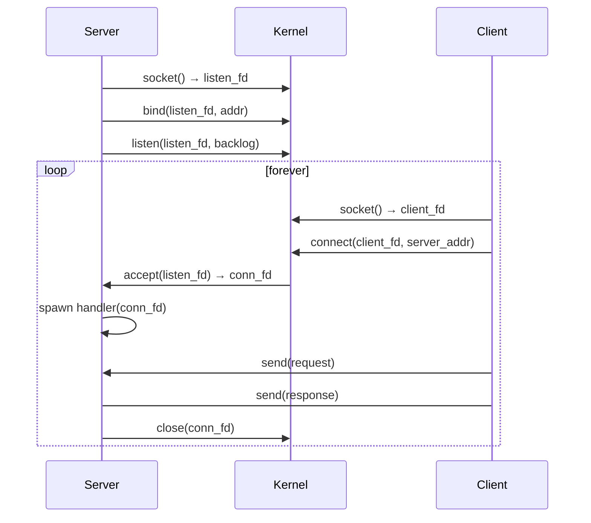
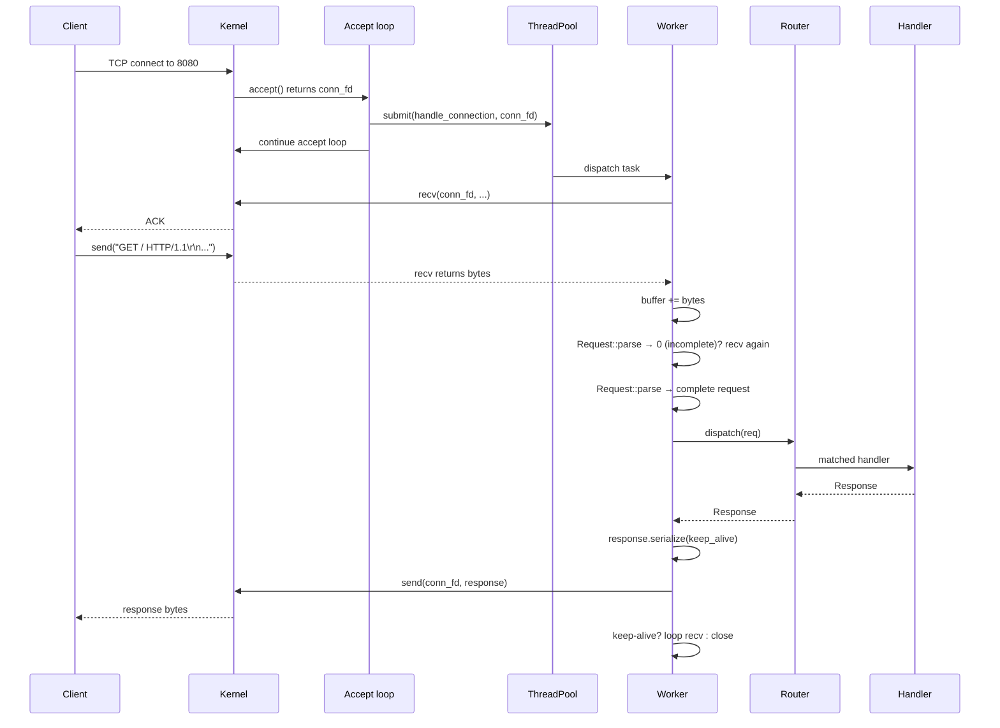

# Build an HTTP Server

## Why

An HTTP server is the perfect capstone project for a C++ curriculum because it forces you to integrate every skill you have learned: socket programming, concurrency, parsing, string handling, RAII, error handling, and finally a build system. It is also genuinely useful — a small embedded HTTP server is the right answer for:

- A debug / metrics endpoint inside a desktop application.
- A REST API for a C++ backend service.
- A webhook receiver in a build system.
- A local mock for testing client code.

This note builds `minihttp`, a small but functional HTTP/1.1 server using **raw POSIX sockets** and a [[3. Build a Thread Pool|thread pool]] for concurrency. We cover request parsing, response generation, routing, keep-alive, and graceful shutdown. We end with pointers to Boost.Asio for a production-grade async implementation.

## Background

### HTTP/1.1 in 30 seconds

HTTP is a request/response protocol over TCP:

1. Client opens a TCP connection to the server.
2. Client sends a request: a request line (`GET /path HTTP/1.1`), headers (`Host:`, `Content-Length:`, ...), a blank line, and an optional body.
3. Server parses the request, dispatches it to a handler, and sends a response: a status line (`HTTP/1.1 200 OK`), headers, a blank line, and an optional body.
4. Connection is either closed (`Connection: close`) or kept alive for the next request (`Connection: keep-alive`, the default in HTTP/1.1).

The wire format is plain text, line-oriented (lines end with `\r\n`), and deceptively simple. The hard parts are:
- **Partial reads**: a single `recv()` may return half a request. You must buffer until you have a complete one.
- **Pipelining**: a client may send two requests back-to-back before the first response is sent.
- **Chunked transfer encoding**: bodies may arrive in chunks with their own length prefixes.
- **Slowloris attacks**: a client that opens many connections and sends data very slowly can exhaust server resources.

We address the first; we acknowledge the rest.

### Sockets API crash course



The four essential syscalls: `socket`, `bind`, `listen`, `accept` on the server; `socket`, `connect` on the client. Then `recv`/`send` for data.

## Main content

### Project structure

```
minihttp/
├── CMakeLists.txt
├── include/
│   └── minihttp/
│       ├── server.hpp
│       ├── request.hpp
│       ├── response.hpp
│       └── router.hpp
└── src/
    ├── server.cpp
    ├── request.cpp
    ├── response.cpp
    └── main.cpp
```

### `Request` and `Response`

```cpp
// request.hpp
#pragma once
#include <string>
#include <string_view>
#include <unordered_map>
#include <optional>

namespace minihttp {

struct Request {
    std::string method;        // "GET", "POST", ...
    std::string target;        // "/path?query"
    std::string path;          // "/path" (without query)
    std::string query;         // "query" (without ?)
    std::string http_version;  // "HTTP/1.1"
    std::unordered_map<std::string, std::string> headers;  // case-insensitive
    std::string body;

    // Parse a complete HTTP request from a buffer.
    // Returns the number of bytes consumed, or 0 if incomplete, or -1 on error.
    static std::ptrdiff_t parse(std::string_view buf, Request& out);

    // Case-insensitive header lookup.
    std::optional<std::string> header(std::string_view name) const;
};

} // namespace minihttp
```

```cpp
// request.cpp
#include "request.hpp"
#include <algorithm>
#include <cctype>
#include <cstring>

namespace minihttp {

static std::string to_lower(std::string_view s) {
    std::string out(s);
    std::transform(out.begin(), out.end(), out.begin(),
                   [](unsigned char c) { return std::tolower(c); });
    return out;
}

std::optional<std::string> Request::header(std::string_view name) const {
    auto it = headers.find(to_lower(name));
    if (it == headers.end()) return std::nullopt;
    return it->second;
}

std::ptrdiff_t Request::parse(std::string_view buf, Request& out) {
    // Find end of headers: \r\n\r\n
    auto header_end = buf.find("\r\n\r\n");
    if (header_end == std::string_view::npos) return 0;  // incomplete

    std::string_view head = buf.substr(0, header_end);
    std::string_view rest = buf.substr(header_end + 4);

    // Parse request line.
    auto first_crlf = head.find("\r\n");
    if (first_crlf == std::string_view::npos) return -1;
    std::string_view request_line = head.substr(0, first_crlf);

    auto sp1 = request_line.find(' ');
    auto sp2 = request_line.find(' ', sp1 + 1);
    if (sp1 == std::string_view::npos || sp2 == std::string_view::npos)
        return -1;
    out.method       = std::string(request_line.substr(0, sp1));
    out.target       = std::string(request_line.substr(sp1 + 1, sp2 - sp1 - 1));
    out.http_version = std::string(request_line.substr(sp2 + 1));

    // Split target into path + query.
    auto q = out.target.find('?');
    if (q == std::string::npos) {
        out.path  = out.target;
        out.query = "";
    } else {
        out.path  = out.target.substr(0, q);
        out.query = out.target.substr(q + 1);
    }

    // Parse headers.
    out.headers.clear();
    std::size_t pos = first_crlf + 2;
    while (pos < head.size()) {
        auto eol = head.find("\r\n", pos);
        if (eol == std::string_view::npos) eol = head.size();
        std::string_view line = head.substr(pos, eol - pos);
        auto colon = line.find(':');
        if (colon != std::string_view::npos) {
            std::string name  = to_lower(line.substr(0, colon));
            std::string value;
            std::size_t vstart = colon + 1;
            while (vstart < line.size() &&
                   (line[vstart] == ' ' || line[vstart] == '\t'))
                ++vstart;
            value = std::string(line.substr(vstart));
            out.headers[name] = value;
        }
        pos = eol + 2;
    }

    // Determine body length.
    std::size_t content_length = 0;
    auto cl = out.headers.find("content-length");
    if (cl != out.headers.end())
        content_length = std::stoul(cl->second);

    if (rest.size() < content_length) return 0;  // body incomplete

    out.body = std::string(rest.substr(0, content_length));
    return static_cast<std::ptrdiff_t>(header_end + 4 + content_length);
}

} // namespace minihttp
```

```cpp
// response.hpp
#pragma once
#include <string>
#include <unordered_map>

namespace minihttp {

struct Response {
    int status = 200;
    std::string reason = "OK";
    std::unordered_map<std::string, std::string> headers;
    std::string body;

    void set_status(int code, std::string r) {
        status = code;
        reason = std::move(r);
    }

    // Serialize the response to bytes.
    std::string serialize(bool keep_alive) const {
        std::string out;
        out.reserve(256 + body.size());
        out += "HTTP/1.1 ";
        out += std::to_string(status);
        out += ' ';
        out += reason;
        out += "\r\n";

        // Always include Content-Length and Connection.
        out += "Content-Length: " + std::to_string(body.size()) + "\r\n";
        out += "Connection: ";
        out += (keep_alive ? "keep-alive" : "close");
        out += "\r\n";

        for (const auto& [k, v] : headers) {
            out += k;
            out += ": ";
            out += v;
            out += "\r\n";
        }
        out += "\r\n";
        out += body;
        return out;
    }

    static Response text(std::string body, int status = 200) {
        Response r;
        r.status = status;
        r.reason = (status == 200 ? "OK" : "Error");
        r.headers["Content-Type"] = "text/plain; charset=utf-8";
        r.body = std::move(body);
        return r;
    }

    static Response json(std::string body, int status = 200) {
        Response r;
        r.status = status;
        r.reason = (status == 200 ? "OK" : "Error");
        r.headers["Content-Type"] = "application/json";
        r.body = std::move(body);
        return r;
    }
};

} // namespace minihttp
```

### Router

```cpp
// router.hpp
#pragma once
#include "request.hpp"
#include "response.hpp"
#include <functional>
#include <string>
#include <vector>
#include <regex>

namespace minihttp {

using Handler = std::function<Response(const Request&)>;

class Router {
public:
    // Register a route: method + path pattern (e.g. "GET", "/users/:id").
    void route(const std::string& method,
               const std::string& pattern,
               Handler h) {
        routes_.push_back({method, compile(pattern), std::move(h)});
    }

    Response dispatch(const Request& req) const {
        for (const auto& r : routes_) {
            if (r.method != req.method) continue;
            std::smatch m;
            if (std::regex_match(req.path, m, r.pattern)) {
                return r.handler(req);
            }
        }
        return Response::text("404 Not Found", 404);
    }

private:
    struct Route {
        std::string method;
        std::regex  pattern;
        Handler     handler;
    };

    // Convert "/users/:id" → regex "/users/([^/]+)"
    static std::regex compile(const std::string& pattern) {
        std::string re;
        re.reserve(pattern.size() * 2);
        for (std::size_t i = 0; i < pattern.size(); ++i) {
            char c = pattern[i];
            if (c == ':') {
                re += "([^/]+)";
                ++i;
                while (i < pattern.size() && (std::isalnum(pattern[i]) || pattern[i] == '_'))
                    ++i;
                --i;
            } else if (std::ispunct(static_cast<unsigned char>(c)) && c != '_') {
                re += '\\';
                re += c;
            } else {
                re += c;
            }
        }
        return std::regex('^' + re + '$');
    }

    std::vector<Route> routes_;
};

} // namespace minihttp
```

### The server

```cpp
// server.hpp
#pragma once
#include "router.hpp"
#include "ThreadPool.hpp"   // from Project 3
#include <atomic>
#include <thread>
#include <string>

namespace minihttp {

class Server {
public:
    Server(std::string host, int port, std::size_t threads = 4);
    ~Server();

    void start();
    void stop();

    Router& router() { return router_; }

private:
    void accept_loop();
    void handle_connection(int conn_fd);

    std::string        host_;
    int                port_;
    int                listen_fd_ = -1;
    std::thread        accept_thread_;
    std::atomic<bool>  stopping_{false};
    ThreadPool         pool_;
    Router             router_;
};

} // namespace minihttp
```

```cpp
// server.cpp
#include "server.hpp"
#include <sys/socket.h>
#include <netinet/in.h>
#include <netinet/tcp.h>
#include <arpa/inet.h>
#include <unistd.h>
#include <cstring>
#include <iostream>
#include <cerrno>

namespace minihttp {

Server::Server(std::string host, int port, std::size_t threads)
    : host_(std::move(host)), port_(port), pool_(threads) {}

Server::~Server() { stop(); }

void Server::start() {
    listen_fd_ = ::socket(AF_INET, SOCK_STREAM, 0);
    if (listen_fd_ < 0) throw std::runtime_error("socket() failed");

    int yes = 1;
    ::setsockopt(listen_fd_, SOL_SOCKET, SO_REUSEADDR, &yes, sizeof(yes));

    sockaddr_in addr{};
    addr.sin_family = AF_INET;
    addr.sin_port   = htons(static_cast<uint16_t>(port_));
    if (::inet_pton(AF_INET, host_.c_str(), &addr.sin_addr) <= 0)
        throw std::runtime_error("invalid host: " + host_);

    if (::bind(listen_fd_, reinterpret_cast<sockaddr*>(&addr), sizeof(addr)) < 0)
        throw std::runtime_error("bind() failed: " + std::string(strerror(errno)));

    if (::listen(listen_fd_, 64) < 0)
        throw std::runtime_error("listen() failed");

    accept_thread_ = std::thread([this] { accept_loop(); });
}

void Server::stop() {
    if (stopping_.exchange(true)) return;
    if (listen_fd_ >= 0) {
        ::shutdown(listen_fd_, SHUT_RDWR);
        ::close(listen_fd_);
        listen_fd_ = -1;
    }
    if (accept_thread_.joinable()) accept_thread_.join();
}

void Server::accept_loop() {
    while (!stopping_) {
        sockaddr_in client{};
        socklen_t len = sizeof(client);
        int conn_fd = ::accept(listen_fd_,
                               reinterpret_cast<sockaddr*>(&client), &len);
        if (conn_fd < 0) {
            if (stopping_) break;
            continue;  // log and retry
        }

        // Disable Nagle for low-latency request/response.
        int one = 1;
        ::setsockopt(conn_fd, IPPROTO_TCP, TCP_NODELAY, &one, sizeof(one));

        // Hand off to thread pool.
        pool_.submit([this, conn_fd] { handle_connection(conn_fd); });
    }
}

void Server::handle_connection(int conn_fd) {
    // RAII wrapper to ensure close.
    struct FdGuard {
        int fd;
        ~FdGuard() { if (fd >= 0) ::close(fd); }
    } guard{conn_fd};

    std::string buf;
    buf.reserve(8192);

    while (!stopping_) {
        // Try to parse a request from current buffer.
        Request req;
        auto consumed = Request::parse(buf, req);
        if (consumed == -1) {
            Response r = Response::text("400 Bad Request", 400);
            std::string s = r.serialize(/*keep_alive=*/false);
            ::send(conn_fd, s.data(), s.size(), MSG_NOSIGNAL);
            return;
        }
        if (consumed == 0) {
            // Need more data.
            char tmp[4096];
            ssize_t n = ::recv(conn_fd, tmp, sizeof(tmp), 0);
            if (n <= 0) return;  // client closed or error
            buf.append(tmp, static_cast<std::size_t>(n));
            continue;
        }
        // We have a complete request.
        buf.erase(0, static_cast<std::size_t>(consumed));

        // Check keep-alive.
        auto conn_hdr = req.header("connection");
        bool keep_alive = true;
        if (conn_hdr) {
            std::string v = *conn_hdr;
            std::transform(v.begin(), v.end(), v.begin(),
                           [](unsigned char c){ return std::tolower(c); });
            if (v == "close") keep_alive = false;
        }

        Response resp = router_.dispatch(req);
        std::string out = resp.serialize(keep_alive);
        ssize_t sent = 0;
        while (sent < static_cast<ssize_t>(out.size())) {
            ssize_t s = ::send(conn_fd, out.data() + sent,
                               out.size() - sent, MSG_NOSIGNAL);
            if (s <= 0) return;
            sent += s;
        }

        if (!keep_alive) return;
    }
}

} // namespace minihttp
```

### `main.cpp`

```cpp
#include "server.hpp"
#include <iostream>
#include <csignal>

static minihttp::Server* g_server = nullptr;

int main() {
    std::signal(SIGINT,  [](int){ if (g_server) g_server->stop(); });
    std::signal(SIGTERM, [](int){ if (g_server) g_server->stop(); });

    minihttp::Server server("127.0.0.1", 8080, 8);
    g_server = &server;

    server.router().route("GET", "/", [](const minihttp::Request&) {
        return minihttp::Response::text("Hello from minihttp!");
    });
    server.router().route("GET", "/echo/:msg", [](const minihttp::Request& req) {
        return minihttp::Response::text("You said: " + req.path);
    });
    server.router().route("POST", "/json", [](const minihttp::Request& req) {
        return minihttp::Response::json(R"({"received":")" + req.body + R"("})");
    });

    server.start();
    std::cout << "minihttp listening on http://127.0.0.1:8080\n";

    // Block until SIGINT.
    std::signal(SIGINT, [](int){ if (g_server) g_server->stop(); });
    // (In production, use a condition_variable for cleaner signaling.)
    while (!g_server->is_stopped()) {
        std::this_thread::sleep_for(std::chrono::milliseconds(100));
    }
    return 0;
}
```

> [!note] The `is_stopped()` accessor
> Add `bool is_stopped() const { return stopping_; }` to the `Server` class for the polling loop above. A cleaner approach uses a `std::condition_variable` woken from `stop()`.

### Mermaid: HTTP request lifecycle



### Mermaid: server architecture

```mermaid
flowchart TB
    subgraph Main["Main thread"]
        S["server.start()"]
        Loop["accept_loop()"]
        S --> Loop
    end
    subgraph Kernel["Linux kernel"]
        Socket["listen_fd (SOCK_STREAM)"]
        Conns["accepted connections<br/>(conn_fd per client)"]
    end
    subgraph Pool["ThreadPool (N workers)"]
        Q["Task queue"]
        W1["Worker 1"]
        W2["Worker 2"]
    end
    Socket -->|accept()| Loop
    Loop -->|submit| Q
    Q --> W1
    Q --> W2
    W1 -->|recv/send| Conns
    W2 -->|recv/send| Conns
    Conns -.TCP.-> Clients["HTTP clients"]
```

### Common Pitfalls

> [!danger] `MSG_NOSIGNAL` on send
> If a client closes the connection while you're still `send`ing, the kernel raises `SIGPIPE` by default, which kills the process. Always pass `MSG_NOSIGNAL` (Linux) or `SO_NOSIGPIPE` (macOS), or globally ignore `SIGPIPE` with `signal(SIGPIPE, SIG_IGN)`.

> [!danger] Partial reads
> One `recv` is not one request. You must buffer bytes until you have a complete `\r\n\r\n` header terminator and the body matches `Content-Length`. Our `Request::parse` returns 0 for "incomplete" — handle that case by reading more.

> [!danger] Partial writes
> `send` can return fewer bytes than requested (especially for large bodies). Always loop until everything is sent, or use `send` with `MSG_WAITALL`.

> [!danger] Not setting `SO_REUSEADDR`
> Without `SO_REUSEADDR`, restarting the server within ~60s of shutdown fails with "Address already in use" because of the TCP `TIME_WAIT` state.

> [!danger] Blocking `accept` on a single thread
> If you call `accept` in the same thread that runs the rest of your application, you block everything. Use a dedicated accept thread (as we do), or use a non-blocking accept via `epoll`/`kqueue`/Boost.Asio.

> [!warning] Slowloris attacks
> A client that opens a connection and sends 1 byte per second ties up a worker forever. Set `SO_RCVTIMEO` on the conn socket, or use non-blocking I/O with timeouts.

> [!warning] Request body size limits
> Without a `max_body_size` cap, a malicious client can send a "POST" with `Content-Length: 99999999999` and exhaust memory. Always cap.

> [!warning] Case-insensitive header lookups
> HTTP headers are case-insensitive (`Host` == `host` == `HOST`). Lowercase all header names on parse, as we do.

> [!warning] HTTP/0.9 / 1.0 / 2.0 / 3.0 differences
> Our server speaks HTTP/1.1 only. Real servers must detect version and behave accordingly (e.g., HTTP/2 is binary, HTTP/3 is over QUIC).

### Tips and Tricks

- **Use Boost.Asio for production.** It abstracts `epoll`/`kqueue`/IOCP behind a single async API and is the foundation of production C++ HTTP servers (Beast, Drogon, Crow). See [[17. Networking/6. Boost.Asio Overview]].
- **Use `epoll` directly** for max performance — see [[17. Networking/5. Non-blocking I-O and epoll]].
- **Always set `TCP_NODELAY`** on short-request/response connections to disable Nagle's algorithm. The 40ms Nagle delay can dominate latency.
- **Keep connections alive** for performance: TCP handshake + TLS handshake is expensive. Reuse connections for many requests.
- **Use `sendfile()`** for static files: zero-copy transfer from disk to socket, no user-space buffer.
- **Rate-limit per IP** with a token bucket per remote address.
- **Use HTTP/2 / HTTP/3** for serious clients — they multiplex many requests over one connection.
- **Log requests** with method, path, status, and latency; you'll be glad when something breaks.
- **Add `Content-Type` based on file extension** for static serving: `.html`→`text/html`, `.js`→`application/javascript`, `.css`→`text/css`.
- **Use `Expect: 100-continue`** for large uploads: client sends headers + `Expect: 100-continue`, server replies `100 Continue` if it accepts, then client sends body. Saves bandwidth on rejected uploads.
- **For TLS**, use OpenSSL or mbedTLS; wrap each conn_fd in a `SSL*` and use `SSL_read`/`SSL_write` instead of `recv`/`send`.
- **Test with `curl -v`** to see exact bytes on the wire, and with `wrk` or `ab` for load testing.

### Active Recall

> [!question] Q1
> Why do we buffer incoming bytes and call `Request::parse` repeatedly, instead of just doing one `recv` per request?
>
> **Answer:** TCP is a byte stream, not a message stream. A single `recv` may return any number of bytes from 1 to MTU-size, and may end mid-request. We must buffer until we have a complete request (headers + `\r\n\r\n` + body of `Content-Length` bytes).

> [!question] Q2
> What does `MSG_NOSIGNAL` do, and why is it critical?
>
> **Answer:** It tells `send` to return `EPIPE` instead of raising `SIGPIPE` when the peer has closed the connection. Without it, a single closed connection kills the entire server process.

> [!question] Q3
> How does keep-alive change the server's connection handling?
>
> **Answer:** After sending a response, the server keeps the conn_fd open and loops back to read the next request on the same connection. This avoids the TCP handshake cost for subsequent requests. The connection stays open until the client closes it, the server times out, or `Connection: close` is sent.

> [!question] Q4
> Why use a thread pool here instead of `std::async` per request, or async I/O?
>
> **Answer:** Thread pool bounds concurrency (prevents thread explosion under load) and amortizes thread creation cost. `std::async` per request may spawn one thread per connection, which doesn't scale. Async I/O (epoll/Asio) is more efficient still but requires rewriting the handler as a state machine — we use the pool for clarity, and note Asio as the production path.

### Next Steps

- Continue with [[5. Build Your Own Redis]] — combines this TCP-server knowledge with a custom application protocol (RESP) and a key-value store.
- For socket fundamentals: [[17. Networking/1. Network Fundamentals]], [[17. Networking/2. Sockets in C++]], [[17. Networking/3. TCP Server and Client]].
- For scaling to many connections: [[17. Networking/5. Non-blocking I-O and epoll]] and [[17. Networking/6. Boost.Asio Overview]].
- For the concurrency foundation: [[14. Concurrency and Multithreading/2. std thread and std jthread]] and [[14. Concurrency and Multithreading/7. Thread Pools]].
- For signal handling: [[1. Compiler and Toolchain/5. Compile-time vs Runtime]] touches on runtime behavior; see also `man 7 signal` and `signalfd` on Linux.
- For TLS: read the OpenSSL or mbedTLS documentation; `Boost.Beast` provides a high-level HTTPS-ready abstraction on top of Asio.
