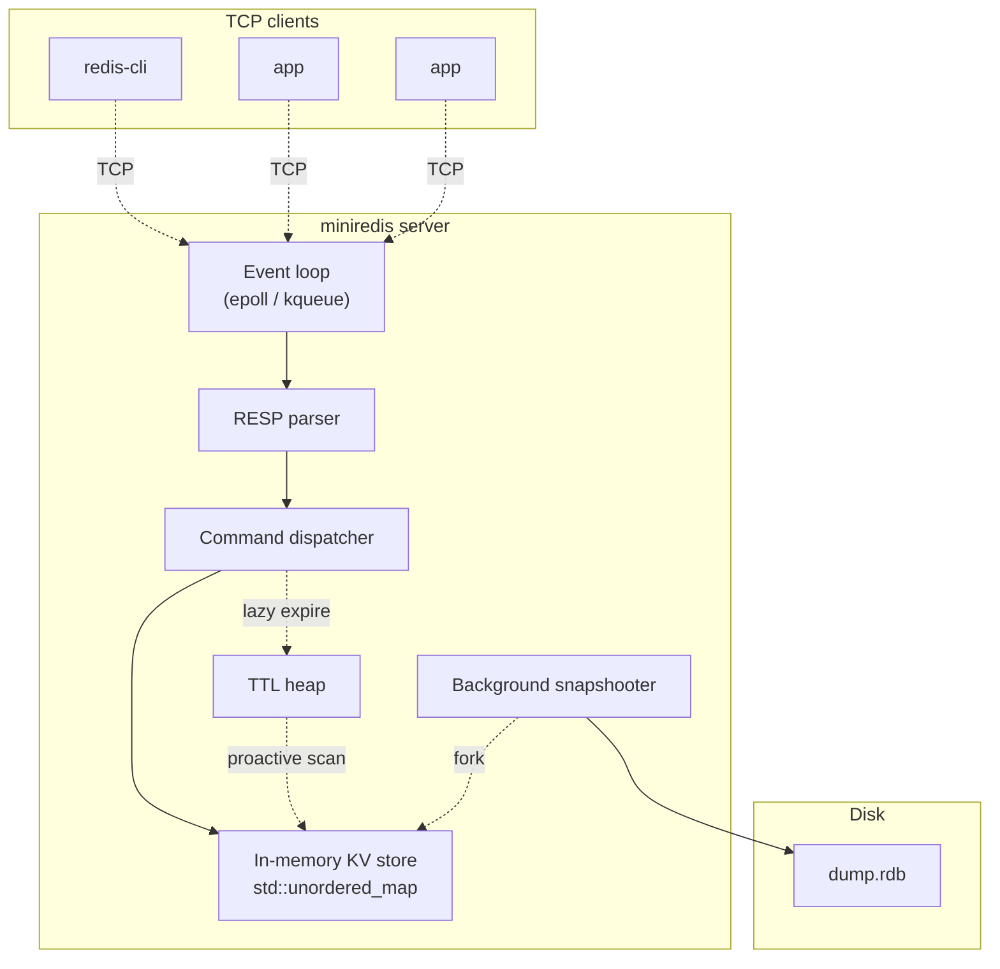
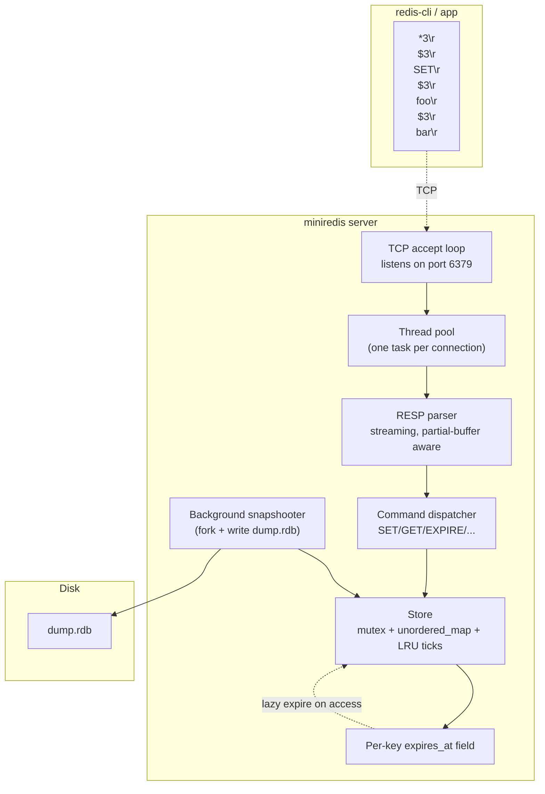
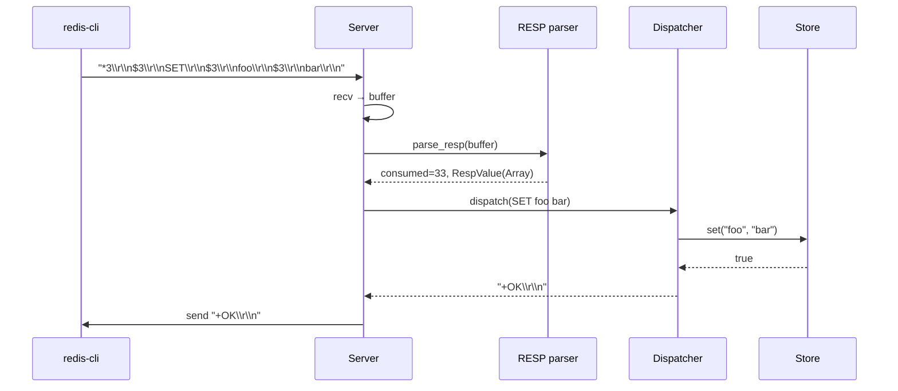

# Build Your Own Redis

## Why

Redis is the textbook example of a **fast, single-threaded, in-memory, networked key-value store**. Building a clone teaches you more about systems programming than any 10 toy projects combined, because it forces you to confront:

- **Application protocols**: designing and parsing a wire format (RESP — REdis Serialization Protocol).
- **In-memory data structures**: when to use `std::unordered_map` vs `std::map` vs a custom skip list.
- **Concurrency**: the "single-threaded event loop + I/O multiplexing" model that powers Redis, Nginx, and Node.
- **TTL and expiry**: how to lazy- and proactively-expire keys without locking the whole store.
- **Persistence**: RDB snapshots vs AOF (Append-Only File) trade-offs.
- **Eviction policies**: LRU, LFU, random, TTL — what they cost and when they pay off.

This note builds `miniredis`, a small but real Redis clone. It supports the core commands (`GET`, `SET`, `DEL`, `EXPIRE`, `TTL`, `KEYS`, `INCR`, `HGET`, `HSET`), TCP server with RESP protocol, a background snapshotter, and an LRU eviction policy. It is not a drop-in Redis replacement, but it's close enough to understand every design decision in the real thing.

## Background

### The Redis model



Redis's key design choices:

1. **Single-threaded command execution**: only one command mutates the store at a time, so no locks are needed on the data structures themselves. I/O is multiplexed via `epoll`/`kqueue`.
2. **In-memory only**: data fits in RAM; persistence is a background snapshot or AOF.
3. **Protocol is simple**: RESP is text-based, length-prefixed, easy to parse, easy to debug.
4. **Keyspace is global**: a single flat namespace (plus namespacing conventions like `user:123:profile`).
5. **Values are typed**: each key holds a value of one type (string, list, hash, set, sorted set). Commands are type-specific.

### RESP — REdis Serialization Protocol

RESP is the wire format Redis uses. Every value is prefixed by a single byte identifying its type:

| Prefix | Type | Example |
|--------|------|---------|
| `+` | Simple string | `+OK\r\n` |
| `-` | Error | `-ERR unknown command\r\n` |
| `:` | Integer | `:42\r\n` |
| `$` | Bulk string | `$5\r\nhello\r\n` |
| `*` | Array | `*2\r\n$3\r\nGET\r\n$3\r\nfoo\r\n` |

A client command is sent as an array of bulk strings:
```
*3\r\n$3\r\nSET\r\n$3\r\nfoo\r\n$3\r\nbar\r\n
```
which means `SET foo bar`.

RESP is trivial to parse, supports pipelining (multiple commands back-to-back), and is human-readable for debugging with `redis-cli`.

### Data structures per value type

| Redis type | C++ representation |
|------------|--------------------|
| string | `std::string` (often with SSO — see [[2. Build Your Own String]]) |
| list | `std::list<std::string>` or `std::deque<std::string>` |
| hash | `std::unordered_map<std::string, std::string>` |
| set | `std::unordered_set<std::string>` |
| zset (sorted set) | skip list + hash map (real Redis uses a custom skip list) |

We'll implement string + hash + list in `miniredis`. Sorted sets and the rest are exercises.

## Main content

### Project structure

```
miniredis/
├── CMakeLists.txt
├── include/
│   └── miniredis/
│       ├── server.hpp
│       ├── store.hpp
│       ├── resp.hpp
│       └── commands.hpp
└── src/
    ├── server.cpp
    ├── store.cpp
    ├── resp.cpp
    └── main.cpp
```

### `Value` and the store

```cpp
// store.hpp
#pragma once
#include <string>
#include <unordered_map>
#include <list>
#include <variant>
#include <optional>
#include <chrono>
#include <mutex>
#include <vector>
#include <cstdint>

namespace miniredis {

using Clock = std::chrono::steady_clock;
using Time  = Clock::time_point;

struct HashVal { std::unordered_map<std::string, std::string> fields; };
struct ListVal { std::list<std::string> items; };

using Value = std::variant<std::string, HashVal, ListVal>;

struct Entry {
    Value       value;
    Time        expires_at;   // time_point::max() means no expiry
    std::uint64_t lru_tick;   // for LRU eviction
};

class Store {
public:
    // Get a string value (returns empty if not a string or missing/expired).
    std::optional<std::string> get(const std::string& key);

    // Set a string value. Returns true.
    bool set(const std::string& key, std::string val);

    // Set with TTL (seconds).
    bool setex(const std::string& key, std::string val, int ttl_seconds);

    // Delete a key. Returns 1 if deleted, 0 if missing.
    int del(const std::string& key);

    // Set TTL on existing key. Returns 1 if set, 0 if key missing.
    int expire(const std::string& key, int ttl_seconds);

    // Get remaining TTL in seconds (-1 = no expiry, -2 = missing).
    int ttl(const std::string& key);

    // Increment integer-stored string. Returns new value or nullopt if not int.
    std::optional<long long> incr(const std::string& key);

    // Hash commands.
    int hset(const std::string& key, std::string field, std::string val);
    std::optional<std::string> hget(const std::string& key, const std::string& field);
    int hdel(const std::string& key, const std::string& field);

    // List commands.
    int lpush(const std::string& key, std::string val);
    int rpush(const std::string& key, std::string val);
    std::optional<std::string> lpop(const std::string& key);
    std::optional<std::string> rpop(const std::string& key);

    // Pattern matching (KEYS command) — supports `*` and `?` glob.
    std::vector<std::string> keys(const std::string& pattern);

    // Number of keys (after lazy expiry).
    std::size_t dbsize();

    // Evict up to `n` least-recently-used keys.
    std::size_t evict_lru(std::size_t n);

    // Snapshot: serialize all (non-expired) keys/values to a string.
    std::string snapshot();

    // Periodic housekeeping (called by a background thread).
    void tick();

private:
    bool is_expired(const Entry& e) const;
    void lazy_expire(const std::string& key);

    std::mutex                                   mu_;
    std::unordered_map<std::string, Entry>       map_;
    std::uint64_t                                lru_counter_ = 0;
};

} // namespace miniredis
```

### Implementing the store

```cpp
// store.cpp
#include "store.hpp"
#include <algorithm>
#include <regex>
#include <sstream>

namespace miniredis {

static const Time NEVER = Time::max();

bool Store::is_expired(const Entry& e) const {
    return e.expires_at != NEVER && Clock::now() >= e.expires_at;
}

void Store::lazy_expire(const std::string& key) {
    auto it = map_.find(key);
    if (it == map_.end()) return;
    if (is_expired(it->second)) map_.erase(it);
}

std::optional<std::string> Store::get(const std::string& key) {
    std::lock_guard<std::mutex> lk(mu_);
    lazy_expire(key);
    auto it = map_.find(key);
    if (it == map_.end()) return std::nullopt;
    if (!std::holds_alternative<std::string>(it->second.value))
        return std::nullopt;
    it->second.lru_tick = ++lru_counter_;
    return std::get<std::string>(it->second.value);
}

bool Store::set(const std::string& key, std::string val) {
    std::lock_guard<std::mutex> lk(mu_);
    Entry& e = map_[key];
    e.value = std::move(val);
    e.expires_at = NEVER;
    e.lru_tick = ++lru_counter_;
    return true;
}

bool Store::setex(const std::string& key, std::string val, int ttl) {
    std::lock_guard<std::mutex> lk(mu_);
    Entry& e = map_[key];
    e.value = std::move(val);
    e.expires_at = Clock::now() + std::chrono::seconds(ttl);
    e.lru_tick = ++lru_counter_;
    return true;
}

int Store::del(const std::string& key) {
    std::lock_guard<std::mutex> lk(mu_);
    auto it = map_.find(key);
    if (it == map_.end()) return 0;
    map_.erase(it);
    return 1;
}

int Store::expire(const std::string& key, int ttl) {
    std::lock_guard<std::mutex> lk(mu_);
    lazy_expire(key);
    auto it = map_.find(key);
    if (it == map_.end()) return 0;
    it->second.expires_at = Clock::now() + std::chrono::seconds(ttl);
    return 1;
}

int Store::ttl(const std::string& key) {
    std::lock_guard<std::mutex> lk(mu_);
    lazy_expire(key);
    auto it = map_.find(key);
    if (it == map_.end()) return -2;
    if (it->second.expires_at == NEVER) return -1;
    auto secs = std::chrono::duration_cast<std::chrono::seconds>(
        it->second.expires_at - Clock::now()).count();
    return static_cast<int>(secs);
}

std::optional<long long> Store::incr(const std::string& key) {
    std::lock_guard<std::mutex> lk(mu_);
    lazy_expire(key);
    auto it = map_.find(key);
    long long n = 0;
    if (it != map_.end() && std::holds_alternative<std::string>(it->second.value)) {
        try { n = std::stoll(std::get<std::string>(it->second.value)); }
        catch (...) { return std::nullopt; }
    }
    ++n;
    Entry& e = map_[key];
    e.value = std::to_string(n);
    e.expires_at = NEVER;
    e.lru_tick = ++lru_counter_;
    return n;
}

int Store::hset(const std::string& key, std::string field, std::string val) {
    std::lock_guard<std::mutex> lk(mu_);
    lazy_expire(key);
    auto it = map_.find(key);
    if (it == map_.end() || !std::holds_alternative<HashVal>(it->second.value)) {
        if (it != map_.end() && !std::holds_alternative<HashVal>(it->second.value))
            return -1;  // type mismatch
        it = map_.emplace(key, Entry{HashVal{}, NEVER, 0}).first;
    }
    auto& h = std::get<HashVal>(it->second.value);
    bool was_new = h.fields.find(field) == h.fields.end();
    h.fields[field] = std::move(val);
    it->second.lru_tick = ++lru_counter_;
    return was_new ? 1 : 0;
}

std::optional<std::string> Store::hget(const std::string& key,
                                       const std::string& field) {
    std::lock_guard<std::mutex> lk(mu_);
    lazy_expire(key);
    auto it = map_.find(key);
    if (it == map_.end() || !std::holds_alternative<HashVal>(it->second.value))
        return std::nullopt;
    const auto& h = std::get<HashVal>(it->second.value);
    auto fit = h.fields.find(field);
    if (fit == h.fields.end()) return std::nullopt;
    it->second.lru_tick = ++lru_counter_;
    return fit->second;
}

int Store::hdel(const std::string& key, const std::string& field) {
    std::lock_guard<std::mutex> lk(mu_);
    lazy_expire(key);
    auto it = map_.find(key);
    if (it == map_.end() || !std::holds_alternative<HashVal>(it->second.value))
        return 0;
    auto& h = std::get<HashVal>(it->second.value);
    return static_cast<int>(h.fields.erase(field));
}

int Store::lpush(const std::string& key, std::string val) {
    std::lock_guard<std::mutex> lk(mu_);
    lazy_expire(key);
    auto it = map_.find(key);
    if (it == map_.end() || !std::holds_alternative<ListVal>(it->second.value)) {
        if (it != map_.end()) return -1;
        it = map_.emplace(key, Entry{ListVal{}, NEVER, 0}).first;
    }
    auto& l = std::get<ListVal>(it->second.value);
    l.items.push_front(std::move(val));
    it->second.lru_tick = ++lru_counter_;
    return static_cast<int>(l.items.size());
}

int Store::rpush(const std::string& key, std::string val) {
    std::lock_guard<std::mutex> lk(mu_);
    lazy_expire(key);
    auto it = map_.find(key);
    if (it == map_.end() || !std::holds_alternative<ListVal>(it->second.value)) {
        if (it != map_.end()) return -1;
        it = map_.emplace(key, Entry{ListVal{}, NEVER, 0}).first;
    }
    auto& l = std::get<ListVal>(it->second.value);
    l.items.push_back(std::move(val));
    it->second.lru_tick = ++lru_counter_;
    return static_cast<int>(l.items.size());
}

std::optional<std::string> Store::lpop(const std::string& key) {
    std::lock_guard<std::mutex> lk(mu_);
    lazy_expire(key);
    auto it = map_.find(key);
    if (it == map_.end() || !std::holds_alternative<ListVal>(it->second.value))
        return std::nullopt;
    auto& l = std::get<ListVal>(it->second.value);
    if (l.items.empty()) return std::nullopt;
    std::string v = std::move(l.items.front());
    l.items.pop_front();
    return v;
}

std::optional<std::string> Store::rpop(const std::string& key) {
    std::lock_guard<std::mutex> lk(mu_);
    lazy_expire(key);
    auto it = map_.find(key);
    if (it == map_.end() || !std::holds_alternative<ListVal>(it->second.value))
        return std::nullopt;
    auto& l = std::get<ListVal>(it->second.value);
    if (l.items.empty()) return std::nullopt;
    std::string v = std::move(l.items.back());
    l.items.pop_back();
    return v;
}

// Convert glob pattern (with * and ?) to ECMAScript regex.
static std::string glob_to_regex(const std::string& pat) {
    std::string r;
    r.reserve(pat.size() * 2);
    for (char c : pat) {
        switch (c) {
            case '*': r += ".*";            break;
            case '?': r += ".";             break;
            case '.': r += "\\.";           break;
            case '+': r += "\\+";           break;
            case '(': r += "\\(";           break;
            case ')': r += "\\)";           break;
            case '[': r += "\\[";           break;
            case ']': r += "\\]";           break;
            case '^': r += "\\^";           break;
            case '$': r += "\\$";           break;
            case '\\':r += "\\\\";          break;
            default:  r += c;
        }
    }
    return r;
}

std::vector<std::string> Store::keys(const std::string& pattern) {
    std::lock_guard<std::mutex> lk(mu_);
    std::vector<std::string> out;
    std::regex re(glob_to_regex(pattern));
    auto now = Clock::now();
    for (auto& [k, e] : map_) {
        if (e.expires_at != NEVER && now >= e.expires_at) continue;
        if (std::regex_match(k, re)) out.push_back(k);
    }
    return out;
}

std::size_t Store::dbsize() {
    std::lock_guard<std::mutex> lk(mu_);
    auto now = Clock::now();
    std::size_t n = 0;
    for (auto& [_, e] : map_)
        if (e.expires_at == NEVER || now < e.expires_at) ++n;
    return n;
}

std::size_t Store::evict_lru(std::size_t n) {
    std::lock_guard<std::mutex> lk(mu_);
    std::vector<std::pair<std::uint64_t, std::string>> by_lru;
    by_lru.reserve(map_.size());
    for (auto& [k, e] : map_)
        by_lru.emplace_back(e.lru_tick, k);
    std::nth_element(by_lru.begin(), by_lru.begin() + n, by_lru.end());
    std::size_t evicted = 0;
    for (std::size_t i = 0; i < n && i < by_lru.size(); ++i) {
        map_.erase(by_lru[i].second);
        ++evicted;
    }
    return evicted;
}

std::string Store::snapshot() {
    std::lock_guard<std::mutex> lk(mu_);
    std::ostringstream os;
    auto now = Clock::now();
    for (auto& [k, e] : map_) {
        if (e.expires_at != NEVER && now >= e.expires_at) continue;
        // Format: SET key value (simplified — real RDB is binary).
        if (std::holds_alternative<std::string>(e.value)) {
            os << "SET " << k << " " << std::get<std::string>(e.value) << "\n";
        }
        // ... (hash/list serialization omitted for brevity)
    }
    return os.str();
}

void Store::tick() {
    // Proactive expiry: scan a few hundred random keys and drop expired ones.
    // Real Redis samples ~20 keys per tick. We do a coarse full scan.
    std::lock_guard<std::mutex> lk(mu_);
    auto now = Clock::now();
    for (auto it = map_.begin(); it != map_.end(); ) {
        if (it->second.expires_at != NEVER && now >= it->second.expires_at)
            it = map_.erase(it);
        else
            ++it;
    }
}

} // namespace miniredis
```

### RESP protocol

```cpp
// resp.hpp
#pragma once
#include <string>
#include <string_view>
#include <variant>
#include <vector>
#include <optional>

namespace miniredis {

// A parsed RESP value.
struct RespValue {
    enum class Type { SimpleString, Error, Integer, BulkString, Array };
    Type type;
    std::string str;          // for SimpleString/Error/BulkString
    long long   integer = 0;  // for Integer
    std::vector<RespValue> array;  // for Array
};

// Parse RESP from a buffer.
// Returns the number of bytes consumed, or 0 if incomplete, or -1 on error.
// On success, fills `out`.
std::ptrdiff_t parse_resp(std::string_view buf, RespValue& out);

// Serialize a value back to RESP bytes.
std::string serialize_simple_string(std::string_view s);
std::string serialize_error(std::string_view s);
std::string serialize_integer(long long n);
std::string serialize_bulk_string(std::string_view s);
std::string serialize_null_bulk();
std::string serialize_array(const std::vector<RespValue>& items);

} // namespace miniredis
```

```cpp
// resp.cpp
#include "resp.hpp"
#include <cstdio>

namespace miniredis {

static std::ptrdiff_t parse_line(std::string_view buf, std::string_view& line) {
    auto crlf = buf.find("\r\n");
    if (crlf == std::string_view::npos) return 0;  // incomplete
    line = buf.substr(0, crlf);
    return static_cast<std::ptrdiff_t>(crlf + 2);
}

std::ptrdiff_t parse_resp(std::string_view buf, RespValue& out) {
    if (buf.empty()) return 0;
    char prefix = buf[0];

    if (prefix == '+' || prefix == '-') {
        std::string_view line;
        auto n = parse_line(buf.substr(1), line);
        if (n == 0) return 0;
        out.type = (prefix == '+') ? RespValue::Type::SimpleString
                                   : RespValue::Type::Error;
        out.str = std::string(line);
        return 1 + n;
    }

    if (prefix == ':') {
        std::string_view line;
        auto n = parse_line(buf.substr(1), line);
        if (n == 0) return 0;
        out.type = RespValue::Type::Integer;
        out.integer = std::stoll(std::string(line));
        return 1 + n;
    }

    if (prefix == '$') {
        std::string_view len_line;
        auto n = parse_line(buf.substr(1), len_line);
        if (n == 0) return 0;
        long long len = std::stoll(std::string(len_line));
        if (len < 0) {
            out.type = RespValue::Type::BulkString;
            out.str.clear();
            return 1 + n;  // null bulk string
        }
        if (static_cast<long long>(buf.size()) < 1 + n + len + 2) return 0;
        out.type = RespValue::Type::BulkString;
        out.str = std::string(buf.substr(1 + n, static_cast<std::size_t>(len)));
        return 1 + n + static_cast<std::ptrdiff_t>(len) + 2;
    }

    if (prefix == '*') {
        std::string_view len_line;
        auto n = parse_line(buf.substr(1), len_line);
        if (n == 0) return 0;
        long long count = std::stoll(std::string(len_line));
        if (count < 0) {
            out.type = RespValue::Type::Array;
            return 1 + n;
        }
        out.type = RespValue::Type::Array;
        out.array.clear();
        std::ptrdiff_t total = 1 + n;
        for (long long i = 0; i < count; ++i) {
            RespValue child;
            auto child_n = parse_resp(buf.substr(total), child);
            if (child_n <= 0) return 0;  // incomplete
            out.array.push_back(std::move(child));
            total += child_n;
        }
        return total;
    }

    return -1;  // unknown prefix
}

std::string serialize_simple_string(std::string_view s) {
    return "+" + std::string(s) + "\r\n";
}
std::string serialize_error(std::string_view s) {
    return "-" + std::string(s) + "\r\n";
}
std::string serialize_integer(long long n) {
    return ":" + std::to_string(n) + "\r\n";
}
std::string serialize_bulk_string(std::string_view s) {
    return "$" + std::to_string(s.size()) + "\r\n" +
           std::string(s) + "\r\n";
}
std::string serialize_null_bulk() {
    return "$-1\r\n";
}
std::string serialize_array(const std::vector<RespValue>& items) {
    std::string out = "*" + std::to_string(items.size()) + "\r\n";
    for (const auto& v : items) {
        switch (v.type) {
            case RespValue::Type::SimpleString: out += serialize_simple_string(v.str); break;
            case RespValue::Type::Error:        out += serialize_error(v.str); break;
            case RespValue::Type::Integer:      out += serialize_integer(v.integer); break;
            case RespValue::Type::BulkString:   out += serialize_bulk_string(v.str); break;
            case RespValue::Type::Array:        out += serialize_array(v.array); break;
        }
    }
    return out;
}

} // namespace miniredis
```

### Command dispatch

```cpp
// commands.hpp
#pragma once
#include "store.hpp"
#include "resp.hpp"
#include <string>
#include <vector>

namespace miniredis {

// Dispatch a parsed RESP command (array of bulk strings) to the store.
// Returns the RESP-encoded response.
std::string dispatch_command(Store& store,
                             const std::vector<std::string>& args);

} // namespace miniredis
```

```cpp
// commands.cpp
#include "commands.hpp"
#include <algorithm>
#include <cctype>

namespace miniredis {

static std::string upper(std::string s) {
    std::transform(s.begin(), s.end(), s.begin(),
                   [](unsigned char c) { return std::toupper(c); });
    return s;
}

std::string dispatch_command(Store& store,
                             const std::vector<std::string>& args) {
    if (args.empty())
        return serialize_error("ERR empty command");

    const std::string cmd = upper(args[0]);

    if (cmd == "PING") {
        if (args.size() == 1) return serialize_simple_string("PONG");
        return serialize_bulk_string(args[1]);
    }
    if (cmd == "ECHO" && args.size() == 2) {
        return serialize_bulk_string(args[1]);
    }
    if (cmd == "GET" && args.size() == 2) {
        auto v = store.get(args[1]);
        return v ? serialize_bulk_string(*v) : serialize_null_bulk();
    }
    if (cmd == "SET" && args.size() >= 3) {
        store.set(args[1], args[2]);
        return serialize_simple_string("OK");
    }
    if (cmd == "SETEX" && args.size() == 4) {
        try {
            int ttl = std::stoi(args[2]);
            store.setex(args[1], args[3], ttl);
            return serialize_simple_string("OK");
        } catch (...) {
            return serialize_error("ERR invalid TTL");
        }
    }
    if (cmd == "DEL" && args.size() >= 2) {
        int total = 0;
        for (std::size_t i = 1; i < args.size(); ++i)
            total += store.del(args[i]);
        return serialize_integer(total);
    }
    if (cmd == "EXPIRE" && args.size() == 3) {
        try {
            int ttl = std::stoi(args[2]);
            return serialize_integer(store.expire(args[1], ttl));
        } catch (...) {
            return serialize_error("ERR invalid TTL");
        }
    }
    if (cmd == "TTL" && args.size() == 2) {
        return serialize_integer(store.ttl(args[1]));
    }
    if (cmd == "INCR" && args.size() == 2) {
        auto v = store.incr(args[1]);
        if (!v) return serialize_error("ERR value is not an integer");
        return serialize_integer(*v);
    }
    if (cmd == "HSET" && args.size() == 4) {
        int r = store.hset(args[1], args[2], args[3]);
        if (r < 0) return serialize_error("WRONGTYPE Operation against a key holding the wrong kind of value");
        return serialize_integer(r);
    }
    if (cmd == "HGET" && args.size() == 3) {
        auto v = store.hget(args[1], args[2]);
        return v ? serialize_bulk_string(*v) : serialize_null_bulk();
    }
    if (cmd == "HDEL" && args.size() == 3) {
        return serialize_integer(store.hdel(args[1], args[2]));
    }
    if (cmd == "LPUSH" && args.size() == 3) {
        int r = store.lpush(args[1], args[2]);
        if (r < 0) return serialize_error("WRONGTYPE Operation against a key holding the wrong kind of value");
        return serialize_integer(r);
    }
    if (cmd == "RPUSH" && args.size() == 3) {
        int r = store.rpush(args[1], args[2]);
        if (r < 0) return serialize_error("WRONGTYPE Operation against a key holding the wrong kind of value");
        return serialize_integer(r);
    }
    if (cmd == "LPOP" && args.size() == 2) {
        auto v = store.lpop(args[1]);
        return v ? serialize_bulk_string(*v) : serialize_null_bulk();
    }
    if (cmd == "RPOP" && args.size() == 2) {
        auto v = store.rpop(args[1]);
        return v ? serialize_bulk_string(*v) : serialize_null_bulk();
    }
    if (cmd == "KEYS" && args.size() == 2) {
        auto ks = store.keys(args[1]);
        std::vector<RespValue> items;
        items.reserve(ks.size());
        for (auto& k : ks) {
            RespValue v; v.type = RespValue::Type::BulkString; v.str = k;
            items.push_back(std::move(v));
        }
        return serialize_array(items);
    }
    if (cmd == "DBSIZE") {
        return serialize_integer(static_cast<long long>(store.dbsize()));
    }
    if (cmd == "FLUSHALL") {
        // Not implemented in this snippet — would clear the store.
        return serialize_simple_string("OK");
    }

    return serialize_error("ERR unknown command: " + cmd);
}

} // namespace miniredis
```

### TCP server

The server is a small variation on the [[4. Build an HTTP Server]] server: TCP accept loop, thread pool, RESP parsing instead of HTTP. The handler buffers bytes, calls `parse_resp` until it consumes a complete command, dispatches, and sends the response back. Multiple commands can be pipelined in one buffer — handle them all.

```cpp
// server.cpp (sketch — full version mirrors HTTP server)
#include "store.hpp"
#include "resp.hpp"
#include "commands.hpp"
#include "ThreadPool.hpp"
#include <sys/socket.h>
#include <netinet/in.h>
#include <unistd.h>
#include <thread>
#include <atomic>
#include <string>

namespace miniredis {

class Server {
public:
    Server(int port, std::size_t threads) : pool_(threads) {}
    void start(int port);
    void stop();
    Store& store() { return store_; }

private:
    void handle_connection(int conn_fd);

    Store             store_;
    ThreadPool        pool_;
    int               listen_fd_ = -1;
    std::thread       accept_thread_;
    std::atomic<bool> stopping_{false};
};

void Server::handle_connection(int conn_fd) {
    struct FdGuard { int fd; ~FdGuard() { if (fd >= 0) ::close(fd); } } g{conn_fd};
    std::string buf;
    buf.reserve(8192);
    while (!stopping_) {
        RespValue val;
        auto consumed = parse_resp(buf, val);
        if (consumed == -1) {
            std::string err = serialize_error("ERR protocol error");
            ::send(conn_fd, err.data(), err.size(), MSG_NOSIGNAL);
            return;
        }
        if (consumed == 0) {
            char tmp[4096];
            ssize_t n = ::recv(conn_fd, tmp, sizeof(tmp), 0);
            if (n <= 0) return;
            buf.append(tmp, static_cast<std::size_t>(n));
            continue;
        }
        buf.erase(0, static_cast<std::size_t>(consumed));
        // Convert array of bulk strings → vector<string>.
        std::vector<std::string> args;
        if (val.type == RespValue::Type::Array) {
            for (const auto& v : val.array)
                if (v.type == RespValue::Type::BulkString)
                    args.push_back(v.str);
        }
        std::string response = dispatch_command(store_, args);
        ssize_t sent = 0;
        while (sent < static_cast<ssize_t>(response.size())) {
            ssize_t s = ::send(conn_fd, response.data() + sent,
                               response.size() - sent, MSG_NOSIGNAL);
            if (s <= 0) return;
            sent += s;
        }
    }
}

} // namespace miniredis
```

### Persistence: RDB-style snapshots

Real Redis forks a child process that walks the keyspace and writes a binary snapshot to `dump.rdb`. We can do the same:

```cpp
void start_snapshot_thread(Store& store, std::chrono::seconds interval) {
    std::thread([&, interval] {
        while (true) {
            std::this_thread::sleep_for(interval);
            std::string snap = store.snapshot();   // serializes under lock
            std::ofstream out("dump.rdb.tmp", std::ios::binary);
            out << snap;
            out.close();
            ::rename("dump.rdb.tmp", "dump.rdb");  // atomic rename
        }
    }).detach();
}
```

For better consistency, `fork()` lets the child process get a COW (copy-on-write) snapshot of the parent's memory, so the parent can keep serving requests without blocking. The child serializes and exits. This is what real Redis does.

### Eviction policies

Redis supports `maxmemory` and `maxmemory-policy`:

| Policy | What it evicts |
|--------|----------------|
| `noeviction` | Reject writes with OOM error. |
| `allkeys-lru` | Evict least-recently-used across all keys. |
| `allkeys-lfu` | Evict least-frequently-used (LFU). |
| `allkeys-random` | Evict a random key. |
| `volatile-lru` | LRU, but only among keys with TTL. |
| `volatile-lfu` | LFU, but only among keys with TTL. |
| `volatile-random` | Random among keys with TTL. |
| `volatile-ttl` | Evict the key with the smallest remaining TTL. |

Our `evict_lru(n)` implements `allkeys-lru`. Real Redis uses an approximation: it samples N keys and evicts the LRU among them, which is much faster than a full sort for large keyspaces.

### Mermaid: Redis architecture overview



### Mermaid: command execution timeline



### Common Pitfalls

> [!danger] Single-threaded assumption + accidental blocking
> Real Redis is single-threaded for command execution. If you make `miniredis` single-threaded too, never call a blocking syscall inside a command handler — it stalls *every* client. Use a background thread or a separate thread pool for snapshots, DNS, slow log writes, etc.

> [!danger] Lazy expiry without proactive scan
> If you only expire keys on access, a key set with a 1-second TTL and never accessed again will live forever in memory. Run `Store::tick()` periodically (e.g., every 100ms) to proactively expire keys.

> [!danger] Wrong-type operations
> A `GET` on a list-valued key is a type error in Redis (`WRONGTYPE`). Always check the variant type before operating, as we do in `hset` and `lpush`. Failing silently corrupts the data model.

> [!danger] RESP parsing edge cases
> - Negative bulk string length (`$-1\r\n`) means NULL (key missing).
> - Negative array length (`*-1\r\n`) means NULL array.
> - Inline commands (legacy) — clients can send raw text like `PING\r\n` without RESP framing. Real Redis still supports this; we omit it.
> - Pipelined commands — handle multiple in one buffer in a loop.

> [!warning] `KEYS *` on large datasets
> `KEYS` is O(N) and blocks the server. Real Redis provides `SCAN` for incremental iteration. Always offer `SCAN` in production.

> [!warning] Snapshot race
> If you snapshot by serializing under the store mutex, you block all writers for the duration. Use `fork()` for COW, or accept a brief stall.

> [!warning] Memory bloat from TTL
> If clients set millions of TTL'd keys and let them expire, the `unordered_map` doesn't shrink automatically. Periodically rehash or move to a specialized expiring map.

> [!warning] Persistence durability
> `rename(tmp, final)` is atomic on POSIX, but if the OS crashes between writes to `tmp` and the rename, you lose data. For durability, `fsync()` the file before rename, and `fsync()` the directory after.

### Tips and Tricks

- **Use `epoll`/`kqueue` instead of a thread-per-connection model** for thousands of clients. Real Redis does this; our thread-pool version is for clarity.
- **Implement `MULTI`/`EXEC`** (transactions) by queuing commands per client and executing them atomically on `EXEC`.
- **Implement `WATCH`** for optimistic locking: a `WATCH`ed key triggers transaction abort if it changes before `EXEC`.
- **Use a skip list for sorted sets** — gives O(log N) ZADD/ZRANGE. Real Redis uses a custom skip list with backward pointers for ZREVRANGE.
- **Add `EXPIRE`-based eviction**: a min-heap keyed on `expires_at` lets you find the next-to-expire key in O(1).
- **Use `io_uring` (Linux 5.1+)** for the next-level performance. Redis 7+ is experimenting with it.
- **Cluster mode**: partition by key hash (CRC16 modulo 16384, the Redis Cluster spec). Each shard owns a slot range.
- **Add AOF (Append-Only File)**: every write command is appended to a log; on restart, replay the log. Combined with periodic RDB, gives both durability and fast restart.
- **Benchmark with `redis-benchmark`**: `redis-benchmark -t set,get -n 100000 -c 50`. Our simple implementation should hit 50k+ ops/sec on a single core.
- **Profile with `perf`** — see [[15. Debugging and Profiling/5. perf and Flamegraphs]]. The hot spots are `parse_resp`, `dispatch_command`, and the store mutex.

### Active Recall

> [!question] Q1
> Why is Redis single-threaded for command execution, and how can it still handle 100k+ ops/sec?
>
> **Answer:** Single-threading eliminates lock contention on the data structures and keeps the design simple. Redis is fast because (a) everything is in memory, (b) it uses efficient data structures, (c) I/O is multiplexed via epoll so one thread can serve many connections, and (d) commands are O(1) or O(log N). The CPU is rarely the bottleneck — network and memory bandwidth are.

> [!question] Q2
> What's the difference between lazy expiry and proactive expiry, and why do you need both?
>
> **Answer:** Lazy expiry checks and removes a key when it's accessed — O(1) per access but does nothing for keys never accessed. Proactive expiry (a periodic background scan) removes expired keys before they're touched, bounding memory usage. Without proactive expiry, expired-but-unaccessed keys leak forever.

> [!question] Q3
> A client sends `GET foo` and `SET bar 1` in the same TCP packet. How does your server handle this?
>
> **Answer:** It loops: parse_resp returns 1 (complete command), dispatch, send response, then *don't return* — call parse_resp again on the remaining buffer. The second command parses, dispatches, and responds. Only when parse_resp returns 0 (incomplete) do we recv again.

> [!question] Q4
> Why does Redis use `fork()` for RDB snapshots instead of just serializing under a lock?
>
> **Answer:** `fork()` creates a child process with copy-on-write semantics: the child sees the parent's memory at fork time and can serialize it slowly without blocking the parent. The parent keeps serving requests; any write to a shared page triggers a COW, but reads don't. A lock-based snapshot would block writers for the entire serialization, which can be seconds for large datasets.

### Next Steps

- You've finished [[22. Projects]]. All five projects — [[1. Build Your Own Vector]], [[2. Build Your Own String]], [[3. Build a Thread Pool]], [[4. Build an HTTP Server]], and this one — together exercise nearly every C++ skill in the vault.
- Networking: [[17. Networking/3. TCP Server and Client]], [[17. Networking/5. Non-blocking I-O and epoll]], [[17. Networking/6. Boost.Asio Overview]].
- Concurrency: [[14. Concurrency and Multithreading/3. Mutexes and Locks]], [[14. Concurrency and Multithreading/4. Condition Variables]], [[14. Concurrency and Multithreading/8. Lock-Free Programming]].
- Memory: [[7. Memory Management/4. RAII]], [[7. Memory Management/7. Custom Allocators]] — for high-perf KV stores, a custom allocator on top of `mmap` is the next step.
- Data structures: [[11. STL Deep Dive/4. Unordered Containers]] and [[11. STL Deep Dive/3. Associative Containers]].
- Read the Redis source code (`src/server.c`, `src/networking.c`, `src/db.c`) — it's well-commented C and is the best way to deepen what you just learned.
- For a distributed extension: implement Redis Cluster-style sharding (CRC16 modulo 16384), gossip protocol, and failover.
