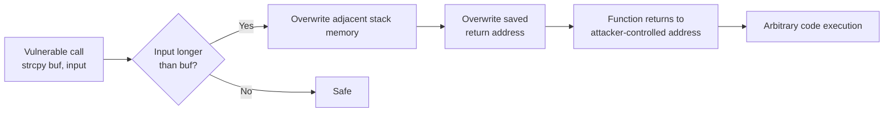

# String Literals and C-Style Strings

## Why This Note Exists

Before `std::string` existed, before templates, before RAII — there was the C-style string: a humble array of `char` terminated by a zero byte. Every C++ program written today still touches this legacy, because string literals like `"hello"` are still C-style strings under the hood. Understanding what a string literal *actually is* in memory, why it lives in read-only storage, and how `<cstring>` functions can quietly destroy your program is essential knowledge for any serious C++ developer. You will encounter C-strings in system APIs, embedded SDKs, file formats, network protocols, and the standard library itself. This note gives you the full mental model — low-level memory layout, the dangerous `<cstring>` family, and the security implications that have made buffer overflows one of the most consequential bug classes in computing history.

## Background

C++ inherited its string model from C (1972). In C, a "string" is not a first-class type — it is a *convention*: a contiguous sequence of `char` values whose logical end is marked by a character with the value zero (`'\0'`, the "null terminator"). This convention is so deeply baked into the C and C++ standards that string literals in C++ still have array-of-`const char` type, terminated by `'\0'`.

When you write `"hello"` in C++ source, the compiler:

1. Allocates static storage for the 6 bytes `'h','e','l','l','o','\0'`.
2. Gives the expression the type `const char[6]`.
3. Allows the array-to-pointer decay to `const char*` when needed.
4. Places the bytes in a read-only segment on most operating systems.

This is the foundation on which `std::string`, `std::string_view`, OS APIs, file paths, and even some parts of the C++ standard library are built.

## Main Content

### 1. What Is a String Literal?

A **string literal** is a sequence of characters enclosed in double quotes that appears directly in source code.

```cpp
const char* p = "hello";
```

Important facts that students often miss:

- The *type* of `"hello"` is `const char[6]` — **six** characters, not five, because the compiler silently appends `'\0'`.
- String literals have **static storage duration**: they live for the entire lifetime of the program.
- String literals are **immutable**. Modifying one is undefined behavior (UB). On most modern OSes the literal lives in a read-only memory page, so attempting to write to it triggers a segfault.
- Two string literals with the same content *may* be merged by the compiler (a feature called "string pooling"). This is permitted but not required by the standard.

```cpp
const char* a = "hi";
const char* b = "hi";
// a == b may be true or false — implementation-defined.
```

> [!warning] Modifying a string literal is UB
> ```cpp
> char* bad = "hello";   // deprecated conversion, may compile with warning
> bad[0] = 'H';          // UNDEFINED BEHAVIOR — likely segfault
> ```
> Always store string literals in `const char*` or, better, `std::string`.

### 2. The Null Terminator — Why It Matters

The C-string convention requires every string to end with `'\0'`. Every `<cstring>` function (`strlen`, `strcpy`, `strcmp`, `printf("%s", ...)`) walks the array byte-by-byte until it finds `'\0'`. If you forget the terminator, these functions run off the end of the array and read garbage until they happen to hit a zero byte (or crash).

```cpp
char no_term[5] = {'h','e','l','l','o'};   // No null terminator!
std::cout << no_term;                       // UB: prints "hello" + garbage
```

Correct version:

```cpp
char with_term[6] = {'h','e','l','l','o','\0'};  // Now safe
```

Or simply use a string literal which adds the terminator for you:

```cpp
const char* safe = "hello";  // 6 bytes: 'h','e','l','l','o','\0'
```

### 3. Memory Layout of a String Literal

The diagram below shows how `"hello"` is laid out in memory. Note the trailing `'\0'` and that the literal lives in static (read-only) storage, distinct from the stack and heap.

```mermaid
memory-layout
    subgraph ReadOnly["Read-Only Segment (.rodata)"]
        Lit["\"hello\"<br/>h | e | l | l | o | \\0<br/>[0][1][2][3][4][5]"]
    end
    subgraph Stack["Stack"]
        Ptr["const char* p<br/>(holds address of Lit[0])"]
    end
    Ptr -.points to.-> Lit
```

### 4. Variants of String Literals

Modern C++ offers several prefixes and suffixes:

| Literal | Type | Purpose |
|:--------|:-----|:--------|
| `"text"` | `const char[N]` | Ordinary narrow string |
| `u8"text"` | `const char[N]` (C++17+) | UTF-8 encoded |
| `L"text"` | `const wchar_t[N]` | Wide string (Windows-centric) |
| `u"text"` | `const char16_t[N]` | UTF-16 |
| `U"text"` | `const char32_t[N]` | UTF-32 |
| `R"(...)"` | `const char[N]` | Raw string — escapes ignored |
| `"text"s` | `std::string` (C++14) | Literal suffix producing `std::string` |

```cpp
using namespace std::string_literals;
auto s = "modern"s;       // std::string
auto path = R"(C:\Users\Me\file.txt)";   // No escape interpretation
auto unicode = u8"café";  // UTF-8
```

### 5. C-String Conventions

A "C-string" is any contiguous block of `char` whose logical end is marked by `'\0'`. This includes:

- String literals (`const char*`)
- Stack-allocated arrays: `char buf[16] = "hi";`
- Heap-allocated buffers: `char* p = new char[16]; std::strcpy(p, "hi");`
- `std::string::c_str()` (returns a `const char*` view of the string)

Note that the underlying array may be larger than the logical string. The `'\0'` is the only thing that says "string ends here."

```cpp
char buf[32] = "hi";   // 32 bytes allocated; only first 3 used ('h','i','\0')
// bytes 3..31 are zero (because of aggregate init)
```

### 6. The `<cstring>` Family

The `<cstring>` header (note: C++ spelling — `<string.h>` is the C version) provides the classic C string functions. They are *unsafe by design*: they trust the caller to have allocated enough space.

#### `std::strlen(s)` — length of a C-string

Returns the number of characters before `'\0'`. **O(n)** — it walks the string.

```cpp
std::strlen("hello");   // 5 (not 6)
```

#### `std::strcpy(dst, src)` — copy

Copies `src` into `dst` including `'\0'`. **Does not check `dst`'s size.** If `src` is longer than `dst`'s capacity, you have a buffer overflow.

```cpp
char dst[3];
std::strcpy(dst, "hello");   // OVERFLOW: writes 6 bytes into 3-byte buffer
```

#### `std::strncpy(dst, src, n)` — bounded copy

Copies at most `n` bytes. **Famous gotcha**: if `src` is longer than `n`, `dst` will *not* be null-terminated.

```cpp
char dst[5];
std::strncpy(dst, "hello world", 5);
// dst = {'h','e','l','l','o'} — NO null terminator!
dst[4] = '\0';   // You must do this yourself.
```

> [!danger] `strncpy` is misleading
> It is **not** a safe `strcpy`. It is a "copy at most N bytes" function that quietly drops the terminator when truncating. Many CVEs trace back to developers assuming otherwise. Prefer `strlcpy` (BSD), `strcpy_s` (C11 Annex K), or — best of all — `std::string`.

#### `std::strcmp(a, b)` — compare

Returns 0 if equal, negative if `a < b`, positive if `a > b`. Lexicographic comparison based on `unsigned char` values.

```cpp
if (std::strcmp(a, b) == 0) { /* equal */ }
```

#### `std::strncmp(a, b, n)` — bounded compare

Same as `strcmp` but only compares the first `n` characters.

#### `std::strcat(dst, src)` — append

Appends `src` to the end of `dst`. **Does not check `dst`'s capacity.** Same overflow risk as `strcpy`.

#### `std::strncat(dst, src, n)` — bounded append

Appends at most `n` chars from `src`. Note: `n` is the *maximum number of characters to copy from `src`*, **not** the size of `dst`. So `strncat(dst, src, sizeof(dst))` is *still* unsafe. You must compute remaining space yourself.

#### `std::strchr(s, c)` — find first occurrence of char

Returns pointer to first occurrence of `c` in `s`, or `nullptr`.

#### `std::strrchr(s, c)` — find last occurrence

#### `std::strstr(haystack, needle)` — find substring

Returns pointer to first occurrence of `needle` in `haystack`, or `nullptr`.

#### `std::strtok(s, delims)` — tokenize

Splits `s` by delimiter characters. **Destructive** — it writes `'\0'` into the input string. Also not thread-safe (uses internal static state). Use `strtok_r` (POSIX) or `strtok_s` (C11) for reentrancy — or just use `std::stringstream`.

#### `std::memcpy / std::memmove / std::memcmp / std::memset`

Not string-specific (work on raw bytes), but commonly used. `memmove` is safe for overlapping ranges; `memcpy` is not.

### 7. Buffer Overflows — The Classic Security Vulnerability

Buffer overflows in C-string handling have been the cause of more security advisories than perhaps any other single class of bug. The Morris Worm (1988), Code Red (2001), and countless CVEs trace back to unchecked `strcpy`/`strcat`/`gets` calls.

The mechanism: an attacker supplies input longer than the destination buffer can hold. The write spills past the end, overwriting adjacent memory — which on the stack often includes the **return address**. If the attacker can craft their input carefully, they overwrite the return address with a pointer to injected machine code. When the function returns, it jumps to the attacker's code.



Modern mitigations: ASLR, stack canaries, DEP/NX, control-flow integrity — but the underlying bug class persists. The defensive answer in C++ is simple: **don't write C-string code. Use `std::string`.**

### 8. Why C-Strings Are Still Relevant

You will encounter C-strings even in modern C++ code:

- **Operating-system APIs**: `open()`, `fopen()`, `CreateFileW()`, POSIX functions all take `const char*` or `const wchar_t*`.
- **Embedded systems**: Many bare-metal SDKs have no heap, so `std::string` is unavailable; fixed-size `char[]` buffers are the only option.
- **Performance-critical paths**: `std::string_view` is preferred now, but historically `const char*` was used to avoid copies.
- **Cross-language FFI**: C is the lingua franca of foreign-function interfaces.
- **`main`'s argv**: `int main(int argc, char* argv[])` — classic C-string array.
- **Standard library internals**: `std::string::c_str()` and `std::string::data()` return `const char*` for compatibility.

The rule is: **use `std::string` (or `std::string_view`) for storage and manipulation; use `const char*` only at boundaries.**

### 9. Converting Between `std::string` and C-Strings

```cpp
std::string s = "hello";

// std::string -> const char*
const char* c = s.c_str();   // Valid as long as s is alive and unmodified.
                            // Pointer is invalidated by any non-const op on s.

// const char* -> std::string
std::string s2(c);           // Copy constructor
std::string s3 = c;          // Copy initialization
```

> [!warning] Lifetime trap
> ```cpp
> const char* get() {
>     std::string s = "temp";
>     return s.c_str();   // DANGLING: s is destroyed on return
> }
> ```
> Returning `.c_str()` from a local `std::string` always produces a dangling pointer.

### 10. Putting It All Together — A Safe Pattern

The following pattern shows how to safely interoperate with a C API that requires `const char*`:

```cpp
#include <string>
#include <fstream>

void log_message(const std::string& msg) {
    // msg.c_str() is valid for the duration of this call.
    std::ofstream f("log.txt", std::ios::app);
    if (f) f << msg << '\n';
}

int main(int argc, char* argv[]) {
    std::string greeting = argc > 1 ? argv[1] : "world";  // C-string -> std::string
    log_message("Hello, " + greeting + "!");
    // No manual memory management, no buffer overflows.
}
```

## Common Pitfalls

1. **Forgetting the null terminator** in manually built char arrays. Every `<cstring>` function will run off the end.
2. **Assuming `strncpy` null-terminates.** It does *not* if the source is too long.
3. **Returning `.c_str()` from a function** whose local `std::string` goes out of scope — dangling pointer.
4. **Modifying string literals** — UB, typically segfaults.
5. **Mixing `char` and `signed char`** for string bytes — `char` may be signed or unsigned depending on platform. Use `unsigned char` for byte-level operations.
6. **Storing a `const char*` returned by a temporary `std::string`**:
   ```cpp
   const char* p = (std::string("x") + "y").c_str();  // DANGLING
   ```
7. **Trusting `argv` length**: `argv[i]` for `i >= argc` is out of bounds.
8. **Off-by-one in buffer sizing**: a string of length N needs N+1 bytes (including `'\0'`).

## Tips and Tricks

- Prefer `std::string` for *all* string storage. Drop down to `const char*` only at API boundaries.
- Use `R"(...)"` raw string literals for regex and Windows file paths to avoid backslash-escape hell:
  ```cpp
  std::regex re(R"(\d+\.\d+)");           // Matches "3.14"
  std::string path = R"(C:\Users\Me\File.txt)";
  ```
- Use the `"s` suffix (with `using namespace std::string_literals;`) to make string literals real `std::string` objects:
  ```cpp
  auto s = "hello"s + " world"s;   // std::string concatenation
  ```
- For bounded C-string copies, prefer `snprintf`:
  ```cpp
  char buf[16];
  std::snprintf(buf, sizeof(buf), "%s", input);  // Always null-terminates
  ```
- Use `std::string_view` for non-owning function parameters — see [[3. string_view and Modern String Handling]].
- When crossing the C-API boundary, remember that `std::string::c_str()` and `std::string::data()` (since C++11) return the same null-terminated pointer.
- For embedded or no-heap code, consider `std::array<char, N>` as a fixed-size string buffer with bounds-checked access via `.at()`.

## Active Recall

Answer these in your own words before moving on:

1. What is the *exact* type of the expression `"hello"` in C++? How many bytes does it occupy in memory?
2. Why is modifying a string literal undefined behavior? What typically happens on a modern OS if you try?
3. Explain why `strncpy(dst, src, sizeof(dst))` is *not* a guarantee that `dst` will be a valid C-string.
4. List three reasons buffer overflows in C-string handling are dangerous. What security mitigations exist?
5. Why does `strlen` need to scan the whole string (O(n)) while `std::string::size()` is O(1)?
6. What is string pooling, and why does it mean that two identical string literals *might* share the same address?
7. Demonstrate a lifetime bug involving `std::string::c_str()`.
8. When is `const char*` still the right choice in modern C++? Give three scenarios.
9. What does the `u8` prefix do? What about `R"(...)"`?
10. Convert the following C code to safe modern C++: `char* s = malloc(20); strcpy(s, "hello"); strcat(s, " world");`

## Next Steps

- Continue to [[2. std::string Deep Dive]] for the full tour of `std::string`'s API, SSO, iterators, and search functions.
- Then [[3. string_view and Modern String Handling]] to learn how to pass strings around without copies.
- Cross-reference [[4. Functions and Program Structure/1. Function Basics]] — `const char*` parameters are a classic example of pass-by-pointer.
- For memory-safety patterns in general, see [[5. Pointers and Smart Pointers]] in the C++ roadmap.
