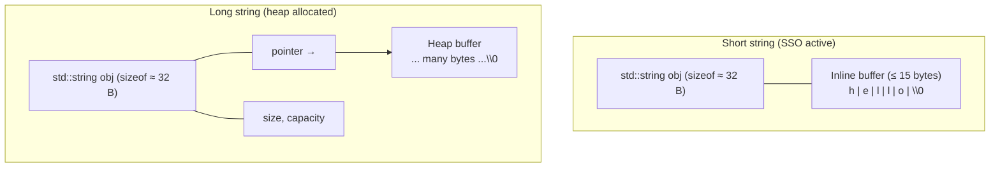

# std::string Deep Dive

## Why This Note Exists

`std::string` is the workhorse of C++ text handling. It is the type you should reach for almost every time you need to store, manipulate, or pass around character data. But using it *well* requires more than knowing `s.size()` and `s += "x"`. To write fast and correct C++ you need to understand what is happening under the hood: the size/capacity distinction, Small String Optimization (SSO), when iterators are invalidated, which operations allocate, and how conversions to and from numbers actually work. This note takes you from the constructor list all the way through to `std::stringstream`, with the goal that you finish with a precise, low-level mental model of one of the most important classes in the standard library.

## Background

`std::string` is a typedef for `std::basic_string<char>` — a class template parameterized on character type. Other instantiations include `std::wstring` (`wchar_t`), `std::u16string` (`char16_t`), and `std::u32string` (`char32_t`). In C++20, `std::u8string` (`char8_t`) was added for UTF-8.

`std::string` is a value type: copying it copies the underlying character buffer (modulo reference-counting optimizations on older implementations, which were removed by C++11). It manages its own memory through RAII — when a `std::string` goes out of scope, its buffer is freed. It is also a regular type: it supports copying, assignment, equality comparison, and ordering.

The internal model is conceptually three values: a **pointer to a character buffer**, a **size** (number of characters currently stored, excluding the null terminator), and a **capacity** (total slots available before a reallocation is needed). The buffer is null-terminated so that `.c_str()` is a trivial O(1) operation.

## Main Content

### 1. Internal Structure

A `std::string` logically looks like this:

```mermaid
flowchart LR
    subgraph String["std::string s = \"hello\";"]
        Size["size = 5"]
        Cap["capacity ≥ 5"]
        BufPtr["buffer →"]
    end
    BufPtr --> Heap["Heap buffer (or SSO inline)<br/>h | e | l | l | o | \\0"]
```

Three invariants always hold:

1. `size() <= capacity()`.
2. `data()` and `c_str()` return a null-terminated buffer of length `size() + 1`.
3. `data()[size()] == '\0'`.

### 2. Small String Optimization (SSO)

Most modern `std::string` implementations (libc++, libstdc++, MSVC) use **Small String Optimization**: a small inline buffer (typically 15–23 bytes depending on the implementation) is embedded directly inside the `std::string` object. For short strings, no heap allocation occurs. The string stores characters inline in this buffer.

Why SSO matters:

- Many real-world strings are short (identifiers, file extensions, names, log lines).
- Avoiding a heap allocation per string can dramatically improve performance.
- `sizeof(std::string)` is larger than a single pointer (usually 24–32 bytes), but the trade-off is worth it.



The SSO threshold varies by implementation. The exact boundary is observable via `capacity()` — strings up to that capacity don't allocate.

> [!info] Why the "15-byte" number?
> On 64-bit platforms, `std::string` is typically 32 bytes: 3 pointers (or pointer + 2 sizes). Designers reuse those 32 bytes to store ~15 chars + a 1-byte length flag when in SSO mode. The exact threshold is implementation-defined.

### 3. Constructors

```cpp
std::string s0;                       // Default: empty string, size 0
std::string s1 = "hello";             // From const char* (copies bytes up to '\0')
std::string s2(10, 'x');              // 10 copies of 'x'  → "xxxxxxxxxx"
std::string s3(s1);                   // Copy constructor
std::string s4(std::move(s1));        // Move constructor (s1 left empty)
std::string s5(s2.begin(), s2.end()); // From iterator range
std::string s6{'a','b','c'};          // Initializer list → "abc"
std::string s7("hello", 3);           // First 3 chars of "hello" → "hel"
std::string s8(s2, 2, 4);             // Substring of s2 from index 2, length 4
```

Gotchas:

- `std::string("hello", 3)` takes the *first* 3 chars, not 3 chars starting at index 3.
- `std::string s2(10, 'x')` — note the count comes first, then the char. The reverse `std::string('x', 10)` is interpreted as "from char pointer with int cast to char" and is dangerous.
- Move constructor is O(1) for long strings (just swaps pointers); for SSO strings it usually copies the inline buffer.

### 4. Element Access

| Method | Bounds-checked? | Notes |
|:-------|:----------------|:------|
| `s[i]` | No | UB if `i >= size()` |
| `s.at(i)` | Yes | Throws `std::out_of_range` |
| `s.front()` | No | UB on empty string |
| `s.back()` | No | UB on empty string |
| `s.data()` | No (C++11+) | Returns `char*` (or `const char*`) |
| `s.c_str()` | No | Always null-terminated |

```cpp
std::string s = "hello";
s.at(10);                     // throws std::out_of_range
s[10];                        // UB — may return garbage or crash
```

> [!tip] When to use `at()` vs `[]`
> Use `[]` when the index is provably in range (e.g., inside a `for (i = 0; i < s.size(); ++i)` loop). Use `at()` when reading user-supplied indices or parsing external data.

Since C++17, `s.data()` returns a non-`const` `char*` for non-const `s`, allowing direct buffer writes. Be careful: writing a `'\0'` in the middle does *not* change `size()` — `std::string` is not null-terminator-aware; it is length-aware.

### 5. Iterators

`std::string` provides the full bidirectional (actually random-access) iterator interface:

```cpp
std::string s = "hello";
for (auto it = s.begin(); it != s.end(); ++it) std::cout << *it;
for (char& c : s) c = std::toupper(static_cast<unsigned char>(c));
```

- `begin()` / `end()` — forward iterators
- `rbegin()` / `rend()` — reverse iterators
- `cbegin()` / `cend()` — const iterators (C++11+)
- `crbegin()` / `crend()` — const reverse iterators

**Iterator invalidation rules** (these bite every C++ developer at least once):

- Any operation that may cause reallocation (`reserve`, `resize`, `append`, `push_back`, `insert`, `replace`, `+=`) invalidates *all* iterators, pointers, and references into the string.
- `shrink_to_fit` may also invalidate.
- Small operations on SSO strings can still invalidate iterators (the standard doesn't promise SSO behavior).

```cpp
std::string s = "hi";
auto it = s.begin();
s += "!!!!!!!!!!!!!!!!";   // May reallocate; `it` is now invalid
*it;                       // UB
```

### 6. Size and Capacity

```cpp
std::string s;
s.reserve(100);   // capacity() >= 100, size() still 0
s.resize(10);     // size() == 10, padded with '\0'
s.resize(5);      // size() == 5, capacity unchanged
s.shrink_to_fit(); // Non-binding request to free unused memory
```

- `size()` and `length()` are identical.
- `empty()` is O(1) and clearer than `size() == 0`.
- `reserve(n)` ensures `capacity() >= n` without changing `size`. Useful before a series of appends to avoid repeated reallocations.
- `resize(n)` changes `size`. If growing, new chars default to `'\0'`; an optional second argument specifies the fill char.
- Capacity grows geometrically (typically 1.5× or 2×) to give amortized O(1) `push_back`.

### 7. Modifiers

#### Concatenation

```cpp
std::string s = "Hello";
s += " world";             // Append const char*
s += '!';                  // Append single char
s.append(" from C++");     // Append
s.append(3, '!');          // Append 3 copies of '!'
s.push_back('?');          // Append single char (no overload for strings)
```

#### Insert

```cpp
std::string s = "Hello, world!";
s.insert(7, "beautiful ");  // "Hello, beautiful world!"
s.insert(s.begin(), '>');   // ">Hello, beautiful world!"
```

#### Erase

```cpp
s.erase(0, 1);              // Erase 1 char from index 0
s.erase(s.begin());         // Erase first char
s.erase(std::find(s.begin(), s.end(), ' '), s.end());  // Erase from space onward
```

#### Replace

```cpp
std::string s = "I like cats";
s.replace(7, 4, "dogs");    // "I like dogs"
```

#### Swap and Clear

```cpp
std::string a = "hello", b = "world";
a.swap(b);   // O(1) swap, no copying
a.clear();   // size becomes 0, capacity unchanged (typically)
```

#### Pop back

```cpp
s.pop_back();   // C++11+. UB if empty.
```

### 8. Search

All search functions return `std::string::npos` (a `size_t` equal to `size_t(-1)`) on failure. Always check before using the result.

```cpp
std::string s = "Hello, world!";
auto p = s.find("world");           // 7
auto q = s.find("xyz");             // std::string::npos
auto r = s.rfind('l');              // 10 (last 'l')
auto v = s.find_first_of("aeiou");  // 1 (first vowel)
auto w = s.find_last_of("aeiou");   // ?
auto x = s.find_first_not_of("Helo, ");
```

- `find` / `rfind` — substring/char search (forward / reverse)
- `find_first_of` / `find_last_of` — find any char from a set
- `find_first_not_of` / `find_last_not_of` — find first char not in set
- All take an optional starting position as second arg

```cpp
// Iterate over all occurrences of a substring:
std::string s = "one two one three one";
std::string sub = "one";
for (size_t pos = s.find(sub); pos != std::string::npos;
     pos = s.find(sub, pos + sub.size())) {
    std::cout << "found at " << pos << '\n';
}
```

### 9. Substring

```cpp
std::string s = "Hello, world!";
std::string sub = s.substr(7, 5);   // "world" (start=7, length=5)
std::string rest = s.substr(7);     // "world!"
```

`substr` *copies*. For non-owning views, use `std::string_view` — see [[3. string_view and Modern String Handling]].

### 10. Comparison Operators

```cpp
std::string a = "apple", b = "banana";
a == b;   // false
a < b;    // true  (lexicographic)
a != b;   // true
a + b;    // "applebanana"
```

Lexicographic comparison is based on `char` values, so `'A' < 'a'` is true (ASCII). For case-insensitive or locale-aware comparison, use a custom comparator or `std::collate` from `<locale>`.

`compare()` member function returns negative/zero/positive like C's `strcmp`:

```cpp
if (a.compare(b) == 0) { /* equal */ }
```

### 11. Conversions to/from Numbers

#### String → number (C++11)

```cpp
int    i = std::stoi("42");          // 42
long   l = std::stol("1234567890");
long long ll = std::stoll("999999999999");
unsigned long ul = std::stoul("123");
unsigned long long ull = std::stoull("123");
float  f = std::stof("3.14");
double d = std::stod("3.141592653589");
long double ld = std::stold("3.14L");
```

Each function:
- Skips leading whitespace.
- Parses as much as possible.
- Sets `idx` (optional second arg) to the position after the parsed number.
- Throws `std::invalid_argument` if no conversion could be performed.
- Throws `std::out_of_range` if the result doesn't fit in the target type.

```cpp
size_t pos;
int x = std::stoi("  42abc", &pos);  // x = 42, pos = 4
```

#### Number → string

```cpp
std::string s1 = std::to_string(42);
std::string s2 = std::to_string(3.14);
std::string s3 = std::to_string(1.0/3.0);  // "0.333333"
```

Note: `std::to_string` for floating point uses `%f`/`%g`-style formatting with default precision (6 digits). For more control, use `std::stringstream` or `std::format` (C++20).

### 12. `std::stringstream` for Formatting

```cpp
#include <sstream>

std::ostringstream oss;
oss << "Value = " << 42 << ", pi ≈ " << 3.14;
std::string s = oss.str();

// Parsing:
std::istringstream iss("42 3.14 hello");
int n; double d; std::string word;
iss >> n >> d >> word;
```

`std::stringstream` is convenient but slow. For performance-critical code, prefer:
- C++20 `std::format` (the {fmt}-style API)
- C++23 `std::print` / `std::println`
- Or `snprintf` into a char buffer for low-level paths

### 13. C++20: `std::format` and C++23: `std::print`

```cpp
#include <format>
std::string s = std::format("Hello, {}! You are {} years old.", name, age);
```

This is the Python `str.format`-style API, type-safe and fast. In C++23, `std::print` and `std::println` write directly to stdout without intermediate string construction:

```cpp
#include <print>
std::println("Hello, {}!", name);
```

### 14. A Realistic Example

```cpp
#include <string>
#include <sstream>
#include <iomanip>
#include <iostream>

std::string format_report(const std::string& title, int items, double total) {
    std::ostringstream oss;
    oss << std::left  << std::setw(20) << title << "| "
        << std::right << std::setw(5)  << items << " items | $"
        << std::fixed << std::setprecision(2) << total;
    return oss.str();
}

int main() {
    std::string line = format_report("Groceries", 12, 84.5);
    std::cout << line << '\n';
    // "Groceries           |    12 items | $84.50"

    auto comma = line.find(',');
    if (comma != std::string::npos) {
        std::cout << "First comma at: " << comma << '\n';
    }
}
```

## Common Pitfalls

1. **Iterator invalidation** after `+=`, `push_back`, `insert`, `replace`, `reserve`, `resize`. Don't hold iterators across mutations.
2. **Assuming `s[i] == '\0'` means end-of-string.** `std::string` is length-aware. You can have embedded nulls:
   ```cpp
   std::string s = std::string("a\0b", 3);   // size == 3
   s.size();   // 3, not 1
   ```
3. **Using `c_str()` and then mutating the string** — the pointer is invalidated.
4. **`std::to_string(double)` precision** — defaults to 6 digits, which may lose precision.
5. **`stoi` on bad input** — throws, doesn't return 0. Wrap in try/catch.
6. **Comparing `npos` to a signed int.** `npos` is `size_t(-1)`, which is huge. Always store search results in `auto` or `size_t`.
7. **`s.resize(n)` doesn't append — it overwrites or extends with `\0`.**
8. **Reserving too little, then reallocating repeatedly.** Profile and `reserve()` upfront if you know the rough size.
9. **`std::string` vs `std::wstring` confusion on Windows.** Win32 APIs want `wchar_t`. Use `std::wstring` there.
10. **Forgetting that `front()`/`back()` on an empty string are UB.**

## Tips and Tricks

- **Reserve before loops**: if you're building a string in a loop, `reserve()` the expected size first to avoid N reallocations.
- **Use `+=` instead of `+`** to avoid temporaries: `s += "x"` (one mutation) beats `s = s + "x"` (a temporary + assignment).
- **`std::string_view` for parameters** — see [[3. string_view and Modern String Handling]]. It avoids forcing callers to construct `std::string`.
- **`std::string::npos`** is the sentinel for "not found." Check it explicitly.
- **Use `compare` for three-way results**; use `==`/`<` for binary decisions.
- **`append` with iterators** lets you splice from any range:
  ```cpp
  s.append(vec.begin(), vec.end());
  ```
- **For case conversion**, use `<algorithm>` + `<cctype>`:
  ```cpp
  std::transform(s.begin(), s.end(), s.begin(),
                 [](unsigned char c){ return std::toupper(c); });
  ```
  (Cast to `unsigned char` first — passing negative values to `toupper` is UB.)
- **`shrink_to_fit` is non-binding**; it's a *request*. Don't rely on it freeing memory.
- **Move semantics**: returning a local `std::string` by value is essentially free (NRVO or move). Don't take a `std::string&` out-parameter for return values.
- **`std::stoi` alternatives**: `std::from_chars` (C++17, `<charconv>`) is faster and non-throwing for parsing integers.

## Active Recall

1. List the three logical fields inside a `std::string` and the invariants they maintain.
2. What is SSO and why does it matter? Roughly what is the SSO threshold on a typical 64-bit Linux implementation?
3. Explain the difference between `size()` and `capacity()`. When does each change?
4. List five operations that invalidate iterators into a `std::string`.
5. What does `std::string("a\0b", 3).size()` return, and why? Why is this surprising?
6. Convert the string `"42"` to `int` three different ways. Which throws on bad input?
7. Write code that prints every index of `"o"` in `"foobar boop"` using `find`.
8. Why is `s += "x"` typically faster than `s = s + "x"`?
9. What is the return type of `find`? What value indicates "not found"? Why must you be careful comparing it to a signed integer?
10. Explain why `std::string::c_str()` is O(1) but `strlen(const char*)` is O(n).
11. How does `std::string("hello", 3)` differ from `std::string("hello").substr(3)`?
12. What does `std::to_string(3.14159265358979)` produce, and why might it be unsatisfying?

## Next Steps

- Read [[3. string_view and Modern String Handling]] for the non-owning view counterpart to `std::string`.
- Review [[1. String Literals and C-Style Strings]] if any C-string terminology felt unfamiliar.
- Cross-reference [[4. Functions and Program Structure/2. Pass-by-Value, Pointer, Reference]] — `const std::string&` parameters are the canonical pass-by-const-reference example.
- For format strings and modern text formatting, see the chapter on Modern C++ features (C++20 `std::format`).
