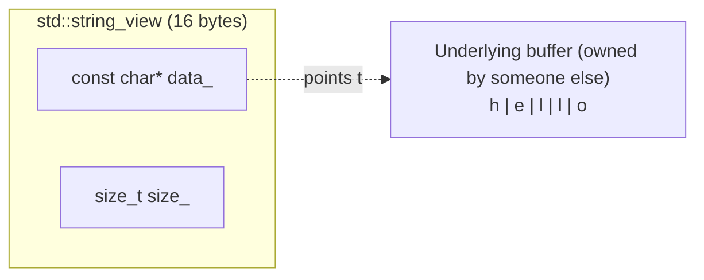
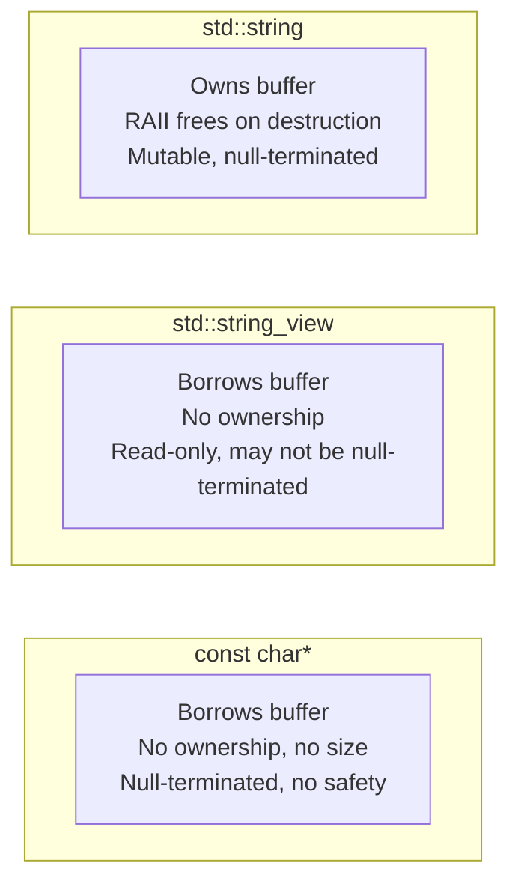

# string_view and Modern String Handling

## Why This Note Exists

`std::string_view` (introduced in C++17) is one of the most useful — and most dangerous — additions to modern C++. It is a non-owning, read-only view over a contiguous sequence of characters. Used correctly, it eliminates countless unnecessary string copies and makes function signatures clean and uniform across `std::string`, C-strings, and string literals. Used incorrectly, it produces dangling references that compile cleanly and crash at runtime. This note explains what `string_view` is, why it exists, when you should reach for it, when you absolutely should not, and the patterns that keep you safe.

## Background

Before C++17, writing a function that accepted "any kind of string" was awkward. You had three options:

1. **`const std::string&`** — works for `std::string`, but forces a `std::string` construction (potentially a heap allocation) if the caller has a `const char*` or a string literal.
2. **`const char*`** — works for literals and C-strings, but loses length information, requires null-termination, and forces `std::string` users to call `.c_str()`.
3. **Overload on both** — code duplication, ambiguous edge cases, more binary size.

`std::string_view` solves this. It is a lightweight (typically two pointers, or pointer + length) view of any contiguous character buffer. It does not own the buffer. It does not copy. It does not null-terminate (necessarily). It works for `std::string`, C-strings, string literals, `std::array<char, N>`, and `std::vector<char>`.

Conceptually it is to `std::string` what `std::span` is to `std::vector` — a borrowed view over someone else's storage.

## Main Content

### 1. What Is `std::string_view`?

```cpp
#include <string_view>

std::string_view sv = "hello";   // Implicit conversion from const char*
std::string s = "world";
std::string_view sv2 = s;        // Implicit conversion from std::string

std::cout << sv.size() << sv[0];  // 5, 'h'
```

A `std::string_view` is typically the size of two pointers (16 bytes on 64-bit):

- A `const char*` pointing to the first character.
- A `size_t` length.

It does *not* store a `'\0'` terminator and does *not* require the underlying buffer to be null-terminated. This is a critical difference from `const char*`.



### 2. Why `string_view` Exists

The C++17 proposal (P0123) introduced `string_view` to solve four specific problems:

1. **Eliminate unnecessary copies** when passing string data through layered APIs.
2. **Provide a uniform type** for accepting any contiguous character sequence.
3. **Enable cheap substring/slicing operations** — `substr` on `string_view` is O(1), just a pointer + length adjustment.
4. **Standardize the "string reference" pattern** that libraries (Boost, Abseil, LLVM) had each reinvented.

```cpp
// Old way: each layer copies
std::string get_path(const std::string& base) { return base + "/file"; }

// New way: zero-copy traversal
std::string_view trim(std::string_view s) {
    while (!s.empty() && std::isspace(s.front())) s.remove_prefix(1);
    while (!s.empty() && std::isspace(s.back()))  s.remove_suffix(1);
    return s;
}
```

### 3. Construction

```cpp
std::string_view sv1;                           // Empty: nullptr, 0
std::string_view sv2 = "hello";                  // From const char* — strlen implied
std::string_view sv3("hello", 3);                // Explicit length: "hel"
std::string s = "hello";
std::string_view sv4 = s;                        // From std::string
std::string_view sv5{sv2};                       // Copy constructor
std::string_view sv6 = sv2.substr(1, 3);         // "ell"
```

Implicit conversions from `std::string` to `string_view` are allowed. The reverse is *not* implicit — converting `string_view` to `std::string` is explicit because it requires a copy:

```cpp
std::string_view sv = "hello";
std::string s1 = sv;             // ERROR — must be explicit
std::string s2{sv};              // OK
std::string s3(sv);              // OK
std::string s4 = std::string(sv);// OK
```

### 4. The API

`string_view` has most of the read-only API of `std::string`:

- `size()`, `length()`, `empty()`, `max_size()`
- `operator[]`, `at()`, `front()`, `back()`
- `begin()`, `end()`, `rbegin()`, `rend()`, plus `c*` variants
- `find`, `rfind`, `find_first_of`, `find_last_of`, `find_first_not_of`, `find_last_not_of`
- `substr(pos, len)` — **O(1)**, returns a new `string_view`
- `compare(other)`
- Comparison operators (`==`, `!=`, `<`, etc.)

Plus three mutation operations that adjust the view (not the underlying buffer):

- `remove_prefix(n)` — advance the pointer by `n`, reduce size by `n`.
- `remove_suffix(n)` — reduce size by `n`.
- `swap(other)`.

```cpp
std::string_view sv = "  hello  ";
sv.remove_prefix(2);   // "hello  "
sv.remove_suffix(2);   // "hello"
```

What `string_view` does *not* have: anything that modifies the underlying buffer. No `append`, no `insert`, no `replace`, no `push_back`. It is strictly read-only.

### 5. When to Use `string_view`

#### Function parameters that only read

This is the sweet spot. Any function that takes a string-like argument and only reads it should take `std::string_view` by value:

```cpp
void log_message(std::string_view msg);   // Accepts string, literal, C-string
```

Passing `string_view` *by value* is correct and idiomatic — it's only 16 bytes, cheaper to copy than to indirect through a reference.

#### Parsing and tokenization

`string_view` shines for parsing because `substr` is O(1):

```cpp
// Split a path into directory and filename — no allocations
std::pair<std::string_view, std::string_view>
split_path(std::string_view path) {
    auto pos = path.find_last_of("/\\");
    if (pos == std::string_view::npos)
        return {{}, path};
    return {path.substr(0, pos), path.substr(pos + 1)};
}
```

#### Internal helpers

If you're writing a helper that operates on a string in place, take `string_view`. The caller can pass anything.

#### Interop with C APIs

`string_view::data()` returns the underlying `const char*`. If the view is null-terminated (e.g., it came from a `std::string` or a string literal), you can pass `data()` to C functions expecting `const char*`. But beware — see Pitfalls below.

### 6. When NOT to Use `string_view`

#### Return values

This is the most common `string_view` misuse. Returning a `string_view` from a function is dangerous unless the underlying buffer outlives the call:

```cpp
std::string_view bad() {
    std::string s = "hello";
    return s;   // DANGLING: s is destroyed; the view points to freed memory
}
```

The function compiles cleanly. It will appear to work in debug builds. Then it will produce garbage or crash in production. Never return a `string_view` over a local `std::string`, a temporary, or anything whose lifetime ends with the function.

#### Member variables (long-lived storage)

`string_view` does not own. Storing one as a class member means the class is silently dependent on some external lifetime. This is the same anti-pattern as storing a `const T*` member without documenting ownership.

```cpp
class Cache {
    std::string_view key;   // BAD: who owns the key?
};
```

If you need to store text, use `std::string`. If you need to store a view, document explicitly that the class does not own the data and the user must keep it alive.

#### When you need to modify the string

`string_view` is read-only. If you need to mutate, take `std::string&` or `std::span<char>`.

#### When you need a null-terminated string

`string_view` does not guarantee null termination. Calling `.data()` and passing it to a C API that expects a C-string is UB if the underlying buffer is not null-terminated. (This includes `substr` results — even from a null-terminated source, the substring is not null-terminated.)

```cpp
std::string_view sv = "hello world";
auto sub = sv.substr(0, 5);    // "hello"
printf("%s", sub.data());      // UB: sub is not null-terminated
                                // May print "hello world" (overrunning) or crash
```

If you must cross a C API boundary, convert to `std::string` first:

```cpp
std::string s{sub};
c_api(s.c_str());   // Safe
```

### 7. The Dangling `string_view` — The Major Gotcha

This deserves its own section because the bug is so easy to introduce and so hard to detect.

#### Pattern 1: Returning from a function with local string

```cpp
std::string_view get_name() {
    std::string local = "Alice";
    return local;   // DANGLING — local destroyed on return
}
```

#### Pattern 2: Implicit conversion of a temporary

```cpp
std::string make_name() { return "Alice"; }

std::string_view sv = make_name();  // DANGLING — temporary destroyed at end of statement
```

The temporary `std::string` returned by `make_name()` is destroyed at the end of the full expression. `sv` outlives it.

#### Pattern 3: Storing from a container that gets mutated

```cpp
std::vector<std::string> v = {{"a"}, {"b"}};
std::string_view sv = v[0];
v.push_back("c");   // May reallocate; sv may dangle
```

Even though the strings themselves aren't moved, the vector's reallocation moves them, invalidating `sv`.

#### Pattern 4: Substring of a temporary

```cpp
std::string_view sv = std::string("hello").substr(0, 3);  // DANGLING
```

The temporary `std::string` is destroyed at the end of the statement. `sv`'s pointer now points to freed memory.

#### Lifetimes don't extend for `string_view`

Unlike `const T&` (which extends the lifetime of a temporary bound to it), `string_view` does *not* extend the lifetime of a temporary it was constructed from. The temporary is destroyed at the end of the full expression. This is the most surprising difference from `const std::string&`.

> [!danger] Always ask: "Who owns the buffer?"
> Before storing or returning a `string_view`, ask: who owns the buffer, and will they outlive my view? If you can't answer confidently with a lifetime diagram, switch to `std::string`.

### 8. Performance Comparison

| Operation | `std::string` | `std::string_view` | `const char*` |
|:----------|:--------------|:-------------------|:--------------|
| Pass to function | O(1) if already `std::string`; O(n) copy if from `const char*` | O(1) — just two pointers | O(1) — single pointer |
| `size()` | O(1) | O(1) | O(n) (must call `strlen`) |
| `substr` | O(n) — allocates and copies | O(1) — just adjusts pointer/length | N/A (must manage manually) |
| Null-terminated | Yes | Not necessarily | Yes |
| Mutable | Yes | No | No (if `const char*`) |
| Owns memory | Yes (RAII) | No | No |
| Safe to store long-term | Yes | No (dangling risk) | No (dangling risk) |



### 9. Realistic Example: A URL Parser

```cpp
#include <string_view>
#include <iostream>

struct Url {
    std::string_view scheme, host, path;
};

Url parse_url(std::string_view url) {
    Url u;
    auto scheme_end = url.find("://");
    if (scheme_end != std::string_view::npos) {
        u.scheme = url.substr(0, scheme_end);
        url.remove_prefix(scheme_end + 3);
    }
    auto path_start = url.find('/');
    if (path_start != std::string_view::npos) {
        u.host = url.substr(0, path_start);
        u.path = url.substr(path_start);
    } else {
        u.host = url;
    }
    return u;
}

int main() {
    auto u = parse_url("https://example.com/api/v1/users");
    std::cout << "scheme: " << u.scheme << '\n'  // "https"
              << "host:   " << u.host   << '\n'  // "example.com"
              << "path:   " << u.path   << '\n'; // "/api/v1/users"
}
```

Zero allocations across the entire parse. The `Url` struct holds three views into the original literal. As long as the original literal outlives the `Url`, this is safe.

### 10. C++23: Making `string_view` Safer

C++23 added `std::basic_string_view::ends_with`/`starts_with` (also in C++20), and the `<print>` library, but the most relevant C++23 addition is reflection on lifetime safety through static analyzers. The language itself still permits dangling `string_view`s, so vigilance remains required.

Tools like Clang's `-Wdangling-gsl` and `-Wlifetime` can catch many cases. Use them.

### 11. Comparison with `std::span`

`std::span` (C++20) is the generic version of `string_view` — a non-owning view over any contiguous range of `T`. `string_view` is essentially `std::span<const char>`, but with string-specific operations (`find`, `substr`, `compare`). The two are siblings, not interchangeable.

## Common Pitfalls

1. **Returning `string_view` over a local `std::string`** — dangling pointer.
2. **Storing `string_view` as a class member** — silent lifetime dependency.
3. **Passing `.data()` to a C API** when the view is a substring — not null-terminated.
4. **Implicit construction from a temporary `std::string`**:
   ```cpp
   std::string_view sv = std::string("temp");
   // sv is dangling at the end of this statement
   ```
5. **Assuming `string_view` is null-terminated** — it may not be.
6. **Comparing `string_view` from different sources** assuming lexicographic order — works, but be aware that embedded nulls don't terminate.
7. **Using `string_view` to "speed up" code that already uses `const std::string&`** without an actual `std::string` construction to avoid — may just add complexity without benefit.
8. **Storing a `string_view` from a `std::vector<std::string>` across a `push_back`** — reallocation invalidates all views.
9. **`remove_prefix`/`remove_suffix` with `n > size()`** is UB. Check first.
10. **Assuming the implicit `std::string → string_view` conversion applies in templates** — it doesn't always; type deduction doesn't consider conversions.

## Tips and Tricks

- **Default to `std::string_view` for read-only string parameters** unless you specifically need ownership, mutability, or null-termination.
- **Pass `string_view` by value**, not by reference. It's 16 bytes — cheaper to copy than to indirect.
- **Combine with `std::string` for ownership**: store `std::string`, expose `std::string_view` to callers.
- **For C API boundaries**, convert to `std::string` and call `.c_str()`. Don't trust `string_view::data()` to be null-terminated.
- **For parsing**, `string_view + remove_prefix/remove_suffix` is an elegant cursor pattern.
- **Benchmark before assuming speedup.** If your hot path already passes `const std::string&` between `std::string`-owning functions, `string_view` may not help.
- **Use `starts_with` / `ends_with`** (C++20) for prefix/suffix checks — cleaner than `compare(0, n, ...)`.
- **For output, accept `std::string&` or `std::string& out` parameter** if you need to write; `string_view` is read-only.
- **Enable Clang lifetime warnings**: `-Wdangling -Wdangling-gsl -Wlifetime`.
- **Avoid returning `string_view` from public APIs** unless the lifetime contract is documented and enforced.

## Active Recall

1. What is the typical size of a `std::string_view` on a 64-bit system, and what does it contain?
2. Why is `string_view::substr` O(1) while `std::string::substr` is O(n)?
3. List four scenarios where returning a `string_view` would dangle.
4. Why does `std::string_view sv = std::string("temp");` produce a dangling view, while `const std::string& s = std::string("temp");` is safe?
5. Is `string_view::data()` always null-terminated? When is it safe to pass to a C API?
6. Write a `trim` function using `string_view` that trims leading/trailing whitespace in O(n) time and O(1) extra space.
7. Why is `string_view` typically passed by value rather than by const reference?
8. What is the relationship between `std::string_view` and `std::span<const char>`?
9. Give an example of a function that should *not* take `string_view` as a parameter.
10. List three things `string_view` cannot do that `std::string` can.
11. What is `remove_prefix` and `remove_suffix`? What happens if you pass a value larger than `size()`?
12. How would you safely store a string in a class that needs to expose it to callers without copies?

## Next Steps

- Read [[1. String Literals and C-Style Strings]] for the foundation that `string_view` builds on.
- Read [[2. std::string Deep Dive]] for the owning counterpart.
- Cross-reference [[4. Functions and Program Structure/2. Pass-by-Value, Pointer, Reference]] — `string_view` is the canonical "pass-by-value when cheap" example for non-trivial read-only parameters.
- For the more general `std::span<T>`, see the chapter on Containers and Algorithms.
- For C++20 `starts_with`/`ends_with` and other modern API additions, see the Modern C++ features chapter.
