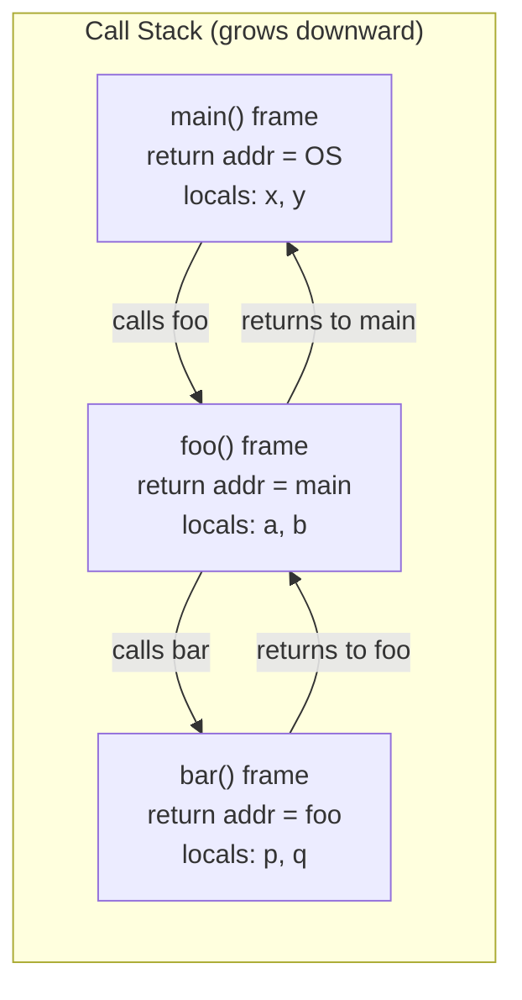
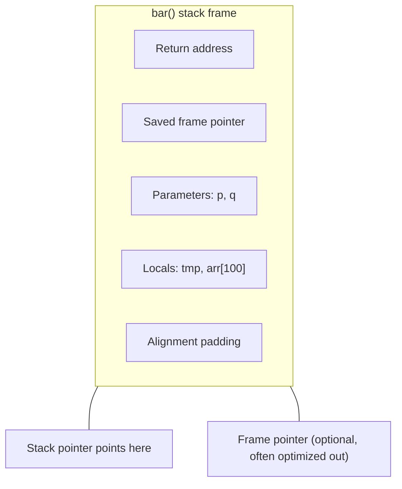
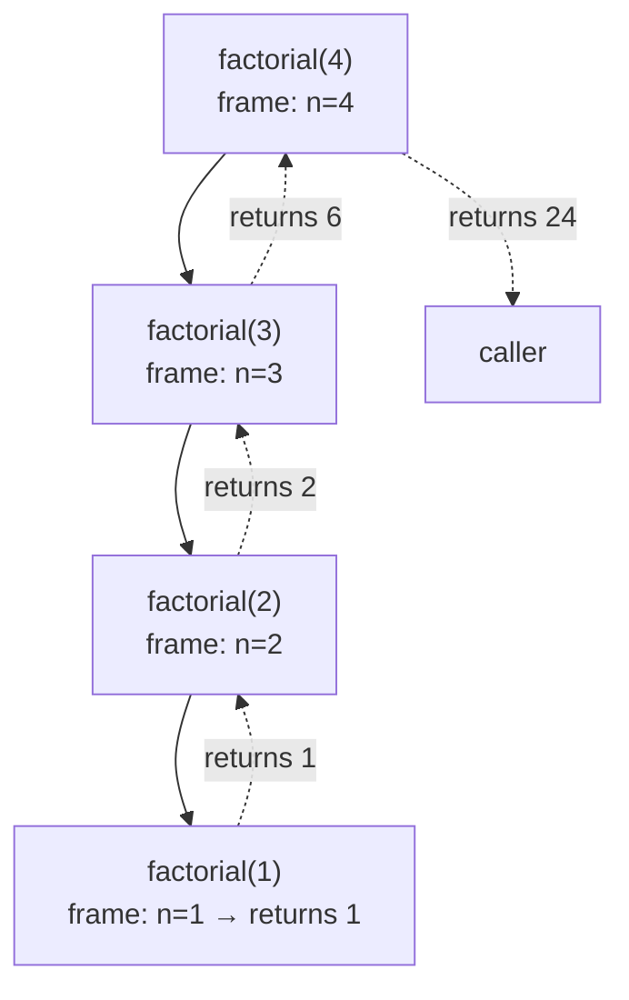

# Function Basics

## Why This Note Exists

Functions are the most fundamental unit of abstraction in C++. Every program is structured around them — from `main()` to the smallest helper. Yet the details of function declarations, definitions, signatures, return types, the call stack, and recursion are often glossed over because "we already know what a function is." This note deliberately slows down and walks through each piece with care, because every later topic — overloading, templates, lambdas, function pointers, recursion-based algorithms — depends on this foundation. If you cannot describe exactly what happens when one function calls another at the memory level, you will struggle to reason about performance, stack overflows, calling conventions, and debugging. This note gives you that foundation.

## Background

A **function** in C++ is a named, reusable block of code that can be invoked from elsewhere in the program. Functions:

- Have a **name** (or, for lambdas, may be anonymous).
- Have a **parameter list** (possibly empty).
- Have a **return type** (possibly `void`).
- Have a **body** (the code that runs when the function is called).
- May have **storage class** and **cv-qualifiers** and **exception specifications**.

The C++ standard calls a function declaration with a body a **function definition**. A declaration without a body is a **function prototype** (or just "declaration"). The distinction matters because the One Definition Rule (ODR) requires exactly one definition per function per program, while declarations may appear many times.

Functions exist because without them you'd have to write all code inline in `main`, with no way to reuse, name, or test individual pieces. The single biggest leap in software engineering is the ability to give a name to a computation, then call it from many places. C++ functions are statically scoped, statically typed, and (by default) pass-by-value — three properties that drive much of the language's behavior.

## Main Content

### 1. Declaration vs Definition

**Declaration** (prototype): tells the compiler the function's name, return type, and parameter types. No body.

```cpp
int add(int, int);     // Declaration
```

**Definition**: includes the body. The compiler generates code; the linker resolves references.

```cpp
int add(int a, int b) {
    return a + b;
}
```

A function must be declared (or defined) before it is used. Definitions serve as declarations too. The One Definition Rule says: at most one definition per program, but multiple declarations are fine.

```cpp
// header.h
int add(int, int);        // declaration

// a.cpp
#include "header.h"
int add(int a, int b) {   // definition
    return a + b;
}

// b.cpp
#include "header.h"
int x = add(1, 2);        // use — linker resolves to the definition in a.cpp
```

> [!info] Forward declarations
> When two functions reference each other (mutual recursion), you must forward-declare at least one:
> ```cpp
> bool is_odd(int n);          // forward declaration
> bool is_even(int n) { return n == 0 ? true : is_odd(n - 1); }
> bool is_odd(int n)  { return n == 0 ? false : is_even(n - 1); }
> ```

### 2. Function Signature

A function's **signature** is what the compiler uses to identify it for overloading and linking. In C++ the signature consists of:

- The function name
- The parameter type list (including cv-qualifiers on parameters, but not on return type)
- The enclosing namespace or class (for member functions)
- `const`/`volatile`/ref-qualifiers on member functions (e.g., a `const` member function)
- Trailing requires-clauses (C++20)

The return type is *not* part of the signature (which is why you cannot overload on return type alone). Parameter names are *not* part of the signature.

```cpp
int  f(int);          // Signature: f(int)
void f(int);          // SAME signature — would be a redefinition, not an overload
int  f(int x);        // SAME signature as f(int); name doesn't matter
int  f(int&);         // Different signature: f(int&)
int  f(const int&);   // Different signature: f(const int&)
```

### 3. Return Types

#### Basic return types

```cpp
int    square(int x) { return x * x; }
double half(int x)   { return x / 2.0; }
bool   is_zero(int x){ return x == 0; }
void   log(int x)    { std::cout << x; }   // No return value
```

A function declared `void` may use `return;` (no value) to exit early. Returning a value from a `void` function or vice versa is a compile error.

Falling off the end of a non-`void` function without a `return` is **undefined behavior** (in most cases). Compilers warn, but the standard does not require a diagnostic.

#### `main` is special

`main` is the only function where falling off the end is equivalent to `return 0;`. The C++ standard specifically allows `main` to omit the `return 0;`.

#### `auto` return type deduction (C++14)

```cpp
auto square(int x) {
    return x * x;   // Return type deduced as int
}
```

The return type is deduced from the `return` statements using `auto` rules. If returns disagree, it's a compile error. Multiple returns must yield the same deduced type.

#### Trailing return type (C++11)

```cpp
auto add(int a, int b) -> int {
    return a + b;
}
```

Useful when the return type depends on parameter types (especially in templates):

```cpp
template <typename T, typename U>
auto add(T a, U b) -> decltype(a + b) {
    return a + b;
}
```

In C++14+ you can usually drop the trailing return type and use plain `auto`, but the trailing form is still required in some template contexts where the body is not yet parsed.

#### `decltype(auto)` (C++14)

Preserves references and cv-qualifiers, unlike plain `auto`:

```cpp
int& ref_to(int& x) { return x; }
decltype(auto) f(int& x) { return ref_to(x); }   // returns int&
auto         g(int& x) { return ref_to(x); }   // returns int (drops &)
```

### 4. The Call Stack

When a function is called, the runtime allocates a **stack frame** (also called an **activation record**) on the call stack. The frame contains:

1. The **return address** — where execution should resume after the function returns.
2. The function's **parameters** (copied from the caller's arguments, in the calling convention's prescribed way).
3. The function's **local variables**.
4. The **saved frame pointer** of the caller (for stack unwinding).
5. (Often) **register save area** for callee-saved registers.
6. (Sometimes) **alignment padding**.

When the function returns, its frame is popped: the stack pointer is restored, the saved frame pointer is restored, and control jumps to the return address.



The stack is typically a fixed-size region (e.g., 1–8 MB on Linux). Each function call consumes space. Deep recursion or very large local arrays can exhaust the stack — a **stack overflow** — which crashes the program with a segfault or stack-overflow signal.

#### Stack frame contents



### 5. Arguments vs Parameters

These terms are often conflated but mean different things:

- **Parameter** (formal argument): the variable declared in the function signature. Lives in the callee's frame.
- **Argument** (actual argument): the value passed at the call site. Lives in (or is computed by) the caller.

```cpp
int add(int a, int b);   // a, b are PARAMETERS
add(2, 3);               // 2, 3 are ARGUMENTS
```

### 6. Local Variables and Scope

Locals are created when the function begins (or, more precisely, when their declaration is reached) and destroyed when the function returns (or when their scope exits). They live on the stack. They are uninitialized by default — reading an uninitialized local is UB.

```cpp
int f() {
    int x;          // UB to read x before assigning
    x = 10;
    return x;
}
```

> [!warning] Returning a reference or pointer to a local is UB
> ```cpp
> int& bad() {
>     int x = 42;
>     return x;   // DANGLING — x is destroyed on return
> }
> ```
> The local's storage is freed; the reference points to invalid memory.

### 7. Static Local Variables

A `static` local is initialized the first time the function is reached and persists across calls. Its storage is *not* on the stack — it lives in static memory.

```cpp
int counter() {
    static int n = 0;   // Initialized once
    return ++n;
}
// counter() == 1, then 2, then 3, ...
```

Initialization is thread-safe as of C++11 (the compiler inserts a guard variable and atomic check).

### 8. Recursion

A function that calls itself is **recursive**. Recursion is a natural fit for problems with a self-similar structure: tree traversal, divide-and-conquer (merge sort, quicksort), dynamic programming (when combined with memoization), parsing, and combinatorial search.

```cpp
unsigned factorial(unsigned n) {
    if (n <= 1) return 1;          // base case
    return n * factorial(n - 1);   // recursive case
}
```

Each recursive call adds a stack frame. For deep recursion, this exhausts the stack.



#### Tail recursion

If the recursive call is the *last* operation before the function returns (tail position), an optimizing compiler can reuse the current frame instead of pushing a new one — called **tail-call optimization** (TCO). This turns O(n) stack usage into O(1).

```cpp
// Not tail-recursive: must multiply after the recursive call returns
unsigned factorial(unsigned n) {
    return n <= 1 ? 1 : n * factorial(n - 1);
}

// Tail-recursive: the recursive call is the final action
unsigned factorial_tail(unsigned n, unsigned acc = 1) {
    return n <= 1 ? acc : factorial_tail(n - 1, n * acc);
}
```

C++ does *not* mandate TCO, but most optimizing compilers do it for tail-recursive functions in release builds. Don't rely on it for correctness, but write tail-recursive forms when you can.

#### Stack overflow

```cpp
void infinite() { infinite(); }   // Guaranteed stack overflow
```

Typical stack sizes:
- Linux: 8 MB default (adjustable via `ulimit -s`)
- macOS: 8 MB default
- Windows: 1 MB default for the main thread (smaller for others)

Symptoms: segfault, "stack overflow" exception, signal `SIGSEGV`. Debug by checking `ulimit -s`, converting deep recursion to iteration, or increasing stack size.

### 9. Argument Passing — Brief Preview

C++ supports several parameter passing modes; we cover these in detail in [[2. Pass-by-Value, Pointer, Reference]]. The defaults:

- **By value**: copy the argument. Safe, but expensive for large types.
- **By lvalue reference (`T&`)**: alias the argument. Caller must supply an lvalue.
- **By const reference (`const T&`)**: alias, but read-only. The default for non-trivial types.
- **By rvalue reference (`T&&`)**: for move semantics.
- **By pointer (`T*`)**: alias through an address. May be null.

```cpp
void by_value(int x);
void by_ref(int& x);
void by_cref(const int& x);
void by_ptr(int* x);
```

### 10. `main` and Command-Line Arguments

```cpp
int main();                              // No args
int main(int argc, char* argv[]);        // With args
int main(int argc, char** argv);         // Equivalent
```

- `argc` is the number of arguments (≥ 1; `argv[0]` is the program name).
- `argv[argc]` is guaranteed to be `nullptr`.
- `argv[i]` for `0 <= i < argc` are null-terminated C-strings.

```cpp
int main(int argc, char* argv[]) {
    for (int i = 0; i < argc; ++i)
        std::cout << "argv[" << i << "] = " << argv[i] << '\n';
    return 0;
}
```

`main` must return `int`. A return value of `0` indicates success; non-zero indicates failure (portable values are `0`, `EXIT_SUCCESS`, `EXIT_FAILURE`).

### 11. Function Attributes

C++ supports several standard attributes that apply to functions:

- `[[noreturn]]` — the function never returns (e.g., `std::terminate`, `exit`, infinite loops).
- `[[nodiscard]]` — callers should not ignore the return value (C++20 also allows a reason string).
- `[[deprecated]]` / `[[deprecated("reason")]]` — emit a warning when used.
- `[[maybe_unused]]` — suppress "unused" warnings.
- `[[likely]]` / `[[unlikely]]` (C++20) — branch prediction hints.

```cpp
[[nodiscard]] int compute();
[[deprecated("Use new_api() instead")]] void old_api();
[[noreturn]] void fatal(const char* msg);
```

### 12. A Realistic Example

```cpp
#include <iostream>
#include <vector>
#include <numeric>

// Declaration in header
double average(const std::vector<double>& values);

// Definition in .cpp
double average(const std::vector<double>& values) {
    if (values.empty()) return 0.0;   // avoid division by zero
    double sum = std::accumulate(values.begin(), values.end(), 0.0);
    return sum / values.size();
}

// Recursive factorial with tail-call-friendly helper
unsigned factorial(unsigned n) {
    auto tail = [](unsigned n, unsigned acc) -> unsigned {
        while (n > 1) { acc *= n; --n; }
        return acc;
    };
    return tail(n, 1);
}

int main(int argc, char* argv[]) {
    std::vector<double> v{1.0, 2.0, 3.0, 4.0};
    std::cout << "average = " << average(v) << '\n';
    std::cout << "5! = " << factorial(5) << '\n';
    return 0;
}
```

## Common Pitfalls

1. **Falling off the end of a non-`void` function** without returning — UB.
2. **Returning a reference/pointer to a local** — dangling reference.
3. **Forgetting a forward declaration** when functions are mutually recursive.
4. **Mismatched declaration and definition** — e.g., different parameter types. Linker errors or silent UB.
5. **Reading uninitialized locals** — UB.
6. **Infinite recursion** — stack overflow.
7. **Deep recursion without TCO** — stack overflow on large inputs.
8. **`auto` return type with inconsistent returns** — compile error.
9. **Assuming `main` can return `void`** — it can't. `int main()` is the only valid signature family.
10. **Calling a function before its declaration** — compile error.
11. **Defining a function inside another function** — pre-C++11 this was an error; in modern C++ it's a lambda, not a regular function.
12. **Forgetting that parameter names in declarations are ignored** — you can name parameters differently in declaration and definition.

## Tips and Tricks

- **Declare in headers, define in `.cpp` files** for non-trivial functions. This hides implementation and improves compile times.
- **Mark functions `static` (or anonymous-namespace) for internal linkage** to avoid ODR conflicts across translation units.
- **Use `[[nodiscard]]` on functions whose return value carries important information** (e.g., `std::vector::empty` is not nodiscard, but your own `validate()` should be).
- **Prefer `constexpr` for compile-time-computable functions** — see [[4. Inline, Constexpr, Consteval]].
- **Use `auto` return types for readable code**, but document the return type in a comment when it's not obvious.
- **Recursive functions need a base case** — every recursion should reduce toward a terminating condition.
- **Convert deep recursion to iteration** if you expect large inputs.
- **Profile before optimizing** — the compiler is good at inlining small functions.
- **For callbacks and customization points**, prefer `std::function` or templates — see [[5. Function Pointers and Lambdas]].
- **Enable compiler warnings** (`-Wall -Wextra -Werror=return-type`) to catch missing returns.

## Active Recall

1. What is the difference between a function declaration and a function definition? Which one can appear multiple times in a program?
2. What four things make up a function's signature in C++? Is the return type part of it?
3. Explain what is in a stack frame. What goes wrong if you return a reference to a local variable?
4. What does the One Definition Rule (ODR) say about functions?
5. Why does `auto` return type deduction require all `return` statements to yield the same type?
6. Write a tail-recursive factorial function. Why might it be preferable to a non-tail-recursive one?
7. What is `[[nodiscard]]`, and when should you use it?
8. What is `[[noreturn]]`? Give an example of a function that should have it.
9. What happens if you fall off the end of a non-`void` function? Is it a compile error, runtime error, or undefined behavior?
10. What is the difference between a parameter and an argument?
11. What is the typical default stack size on Linux? On Windows? What goes wrong when you exceed it?
12. Why is `main` special regarding the `return 0;` requirement?

## Next Steps

- Continue to [[2. Pass-by-Value, Pointer, Reference]] for the full treatment of argument passing modes.
- Then [[3. Default Arguments and Overloading]] for how the compiler picks among candidates.
- Then [[4. Inline, Constexpr, Consteval]] for compile-time and inlining semantics.
- Then [[5. Function Pointers and Lambdas]] for first-class function handling.
- Cross-reference [[3. Strings and Character Data/1. String Literals and C-Style Strings]] — `const char*` parameters are a classic pointer-parameter example.
