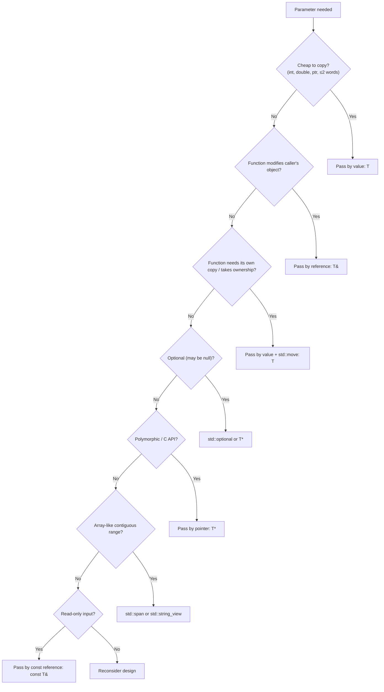

# Pass-by-Value, Pointer, Reference

## Why This Note Exists

Choosing how to pass a parameter is one of the most consequential decisions in C++ program design — and one of the most repeated. Get it wrong and you pay in copies, allocations, missed optimizations, and bugs. Get it right and the compiler will inline, elide, and optimize your code into something close to hand-written assembly. This note explains the four core passing modes (by value, by pointer, by reference, by const reference), when each is correct, the modern additions (`std::span`, move semantics, forwarding references), and the reasoning that links them. After reading this you should be able to look at any function signature and explain *why* the author chose that parameter type.

## Background

In C, there are only two ways to pass an argument: by value (a copy is made) or by pointer (a copy of the address is made). C++ adds **references** — aliases that look like values but behave like pointers under the hood. References give C++ the safety and ergonomics of value semantics with the performance of pointer semantics.

The choice of passing mode matters because:

1. **Performance**: copying a 1 MB `std::vector` for a read-only parameter is wasteful.
2. **Semantics**: some APIs need to *modify* the caller's object; some need to *claim ownership*; some need to *optionally* refer to an object.
3. **Safety**: pointers can be null and can dangle; references can't be null (in well-formed code) but can dangle.
4. **Expressiveness**: the parameter type is documentation. `const std::string&` says "I read this string." `std::unique_ptr<Widget>` says "I take ownership."

The C++ Core Guidelines (Stroustrup, Sutter, et al.) give concrete defaults — we'll cover them.

## Main Content

### 1. Pass-by-Value

```cpp
void f(int x);                  // x is a copy of the caller's int
void g(std::string s);          // s is a copy of the caller's string
```

The function receives a copy. Modifications to the parameter do not affect the caller. The parameter is a new object — constructed by copying (or moving) from the argument.

**When to use:**
- **Cheap-to-copy types**: `int`, `double`, `char`, pointers, small PODs (≤ 2 words). For these, copies are cheaper than indirection through a reference.
- **When the function needs its own copy anyway**: if you're going to copy the argument into a local, take it by value and let the caller move into the parameter. This is the "sink parameter" idiom:
  ```cpp
  void set_name(std::string n) {   // take by value
      name_ = std::move(n);        // move into member
  }
  ```
  Callers with an lvalue get a copy; callers with an rvalue get a move. One function body, two efficient paths.
- **When the function needs to mutate without affecting the caller**: take by value and mutate freely.

**Avoid when:**
- The type is expensive to copy (`std::vector`, `std::string` for non-trivial inputs, large structs).
- You only need to read it — use `const T&`.

```cpp
// BAD: copies a potentially large vector
double average(std::vector<double> v);

// GOOD: no copy
double average(const std::vector<double>& v);
```

> [!info] The "cheap to copy" threshold
> The Core Guidelines suggest "≤ 2 words" as a rough rule. On 64-bit, that's 16 bytes. Anything bigger should usually go by const reference. Use judgment — a `std::vector<int>` is 24 bytes but allocates a heap buffer; always pass by const reference.

### 2. Pass-by-Pointer

```cpp
void f(int* p);                          // mutable pointer to mutable int
void g(const int* p);                    // mutable pointer to const int
void h(int* const p);                    // const pointer to mutable int
void i(const int* const p);              // const pointer to const int
```

A pointer is itself a value (an address). The function receives a copy of that address. The function can dereference the pointer to access (and possibly modify) the pointee.

**When to use:**
- **When "no object" is a valid option** (the pointer can be `nullptr`). References cannot be null.
  ```cpp
  void log(const std::string* msg);   // msg can be nullptr
  void log(const std::string& msg);   // caller MUST supply a string
  ```
- **When interfacing with C APIs**, which deal in pointers.
- **When the function needs to *reseat* the pointer** (rare — usually you want a reference to a pointer, or a `T*&`).
- **When polymorphism is involved**: a `Base*` can point to a `Derived`. (References work too, but pointers make the "I'm pointing at something" semantics more visible.)
- **When the lifetime/ownership contract is non-trivial**: smart pointers express it better — see below.

**Avoid when:**
- The argument cannot be null. Use a reference — it's safer and clearer.
- You're tempted to use a raw pointer for ownership. Use `std::unique_ptr` or `std::shared_ptr`.

```cpp
// C-style: ambiguous ownership
void process(Widget* w);   // Does process delete w? Caller can't tell.

// Modern: ownership is explicit
void process(std::unique_ptr<Widget> w);       // takes ownership
void process(const std::unique_ptr<Widget>& w);// borrows, doesn't take
void observe(Widget* w);                       // observes; doesn't own
```

> [!warning] References cannot be reseated
> ```cpp
> void f(int& r) {
>     int y = 10;
>     r = y;     // assigns 10 through r — does NOT rebind r to y!
> }
> ```
> If you need to rebind, use a pointer (or a reference to a pointer).

### 3. Pass-by-Reference

```cpp
void f(int& x);                  // x aliases the caller's int — mutable
void g(const int& x);            // x aliases — read-only
```

A reference is an alias for an existing object. The function does not own it; it just has another name for the caller's object. Behind the scenes, references are usually implemented as pointers, but with two key constraints:

1. A reference must be initialized to refer to an object. (No null references in well-formed code.)
2. A reference cannot be reseated to refer to a different object.

**When to use `T&` (mutable reference):**
- The function **modifies** the caller's object (out-parameters).
- The function needs to "fill in" a caller-provided object.

```cpp
bool parse_int(std::string_view s, int& out);   // out is filled on success
```

> [!tip] Prefer return values to out-parameters
> ```cpp
> // Old C++ style
> void compute(int& out1, int& out2);
> // Modern style
> std::tuple<int, int> compute();
> // Even better (C++17)
> struct Result { int a, b; };
> Result compute();
> ```
> Out-parameters are still useful when copying the result is expensive and you want to write into a caller-provided buffer, or when interoperating with C-style APIs.

**When to use `const T&` (const reference):**
- The function **reads** a non-trivial type. This is the default for strings, vectors, maps, and any type larger than ~2 words.

```cpp
void print(const std::string& s);    // No copy, no allocation
double avg(const std::vector<double>& v);
```

`const T&` extends the lifetime of temporaries bound to it, so it's safe to pass rvalues:

```cpp
print("hello");               // temporary std::string — lifetime extended through call
print(std::string("hi"));     // same
```

### 4. Pass-by-Const-Reference — The Default

For any non-trivial type used as a read-only input, `const T&` is the idiomatic default. It:

- Avoids copies (zero allocation, zero copy).
- Accepts lvalues and rvalues (including temporaries).
- Documents intent: "I will not modify this."
- Is understood by every C++ programmer.

Exceptions:

- **Cheap types** (`int`, `double`, small PODs): pass by value.
- **Sink parameters** (function will store or move the value): pass by value and `std::move` internally.
- **Optional** arguments: pass by `const T*` (nullable) or `std::optional<T>`.
- **Container views** (`std::vector`, `std::array`): consider `std::span` (C++20).
- **Strings**: consider `std::string_view` (C++17) — see [[3. Strings and Character Data/3. string_view and Modern String Handling]].

### 5. Comparison of Passing Modes

```mermaid
flowchart TB
    subgraph V["Pass-by-Value"]
        V1["Caller's object"]
        V2["Copy made → parameter"]
        V3["Function mutates parameter<br/>Caller unaffected"]
        V1 --> V2 --> V3
    end
    subgraph P["Pass-by-Pointer"]
        P1["Caller's object"]
        P2["Address copied → parameter"]
        P3["Function dereferences pointer<br/>Can mutate pointee<br/>Pointer may be null"]
        P1 --> P2 --> P3
    end
    subgraph R["Pass-by-Reference"]
        R1["Caller's object"]
        R2["Reference aliases it"]
        R3["Function mutates via reference<br/>Caller sees changes<br/>Cannot be null"]
        R1 --> R2 --> R3
    end
    subgraph CR["Pass-by-Const-Reference"]
        CR1["Caller's object"]
        CR2["const reference aliases it"]
        CR3["Function reads only<br/>No mutation, no copy"]
        CR1 --> CR2 --> CR3
    end
```



### 6. Move Semantics and Sink Parameters

When a function *takes ownership* of an argument (stores it, consumes it), pass by value and move internally. This is the **sink parameter idiom**:

```cpp
class Person {
    std::string name_;
public:
    void set_name(std::string n) {       // by value
        name_ = std::move(n);            // move into member
    }
};

Person p;
std::string s = "Alice";
p.set_name(s);                  // copy: lvalue s → parameter n (copy), then move into name_
p.set_name("Bob");              // move: temporary → parameter n (move), then move into name_
p.set_name(std::move(s));       // move: rvalue → parameter n (move), then move into name_
```

The "take by value, move internally" pattern gives you a single function that is optimal for both lvalue and rvalue callers. Without it, you'd need two overloads (`const std::string&` and `std::string&&`).

For full move semantics, see the Modern C++ chapter.

### 7. Forwarding References (C++11)

A **forwarding reference** (also called a *universal reference*) is `T&&` where `T` is a deduced template parameter. It binds to both lvalues and rvalues, preserving value category:

```cpp
template <typename T>
void wrapper(T&& x) {
    target(std::forward<T>(x));   // Perfect forwarding
}
```

This is how `std::make_unique`, `std::vector::emplace_back`, and `std::make_tuple` forward arguments without unnecessary copies. We cover this in detail in the Templates chapter.

> [!warning] `auto&&` is also a forwarding reference
> ```cpp
> auto&& x = some_expression;   // x is either T& or T&& depending on some_expression
> ```

### 8. `std::span` (C++20) for Array-Like Data

`std::span<T>` is a non-owning view over a contiguous sequence of `T`. It's `string_view` for general arrays:

```cpp
#include <span>

void process(std::span<int> data);

int arr[10];
std::vector<int> v(10);
std::array<int, 10> a;

process(arr);          // OK
process(v);            // OK
process(a);            // OK
process({arr, 5});     // First 5 elements
```

`std::span` carries a size, so you don't need a separate length parameter. It can be fixed-size (`std::span<int, 10>`) or dynamic.

Use `std::span` instead of `(T*, size_t)` pairs or `const std::vector<T>&` when you want to accept any contiguous range.

### 9. `std::optional<T>` for Optional Values

When a parameter is optional or a return may not have a value:

```cpp
#include <optional>

std::optional<int> parse_int(std::string_view s);

auto r = parse_int("42");
if (r) std::cout << *r;
```

For optional *parameters*:

```cpp
void configure(std::optional<int> port = std::nullopt);
configure();            // no port
configure(8080);        // port = 8080
```

### 10. Smart Pointer Parameters

Smart pointers make ownership contracts explicit:

```cpp
void takes_ownership(std::unique_ptr<Widget> w);          // sink — function will delete
void borrows(const std::unique_ptr<Widget>& w);           // borrows — caller keeps ownership
void observes(Widget* w);                                 // observes — raw pointer, non-owning
void shares(std::shared_ptr<Widget> w);                   // shares — refcount incremented
```

Guideline:
- **`std::unique_ptr<T>` by value** = "I'm taking ownership."
- **`T*` (raw)** = "I'm observing; you keep owning."
- **`const std::unique_ptr<T>&`** = usually a code smell — you're observing but forcing callers to use `unique_ptr`. Prefer `T*`.
- **`std::shared_ptr<T>` by value** = "I want to share ownership." Only use when sharing is actually needed.

### 11. Parameter Type Decision Tree



### 12. A Realistic Example

```cpp
#include <string>
#include <string_view>
#include <vector>
#include <span>
#include <memory>
#include <optional>
#include <iostream>

// Read-only string parameter → string_view
void log(std::string_view msg);

// Read-only vector parameter → const ref
double average(const std::vector<double>& v);

// Out-parameter (legacy style) → T& (ok, but prefer return)
bool parse_int(std::string_view s, int& out);

// Sink — takes ownership
class Owner {
    std::unique_ptr<Widget> w_;
public:
    void set_widget(std::unique_ptr<Widget> w) { w_ = std::move(w); }
};

// Sink — copies into member
class Person {
    std::string name_;
public:
    void set_name(std::string n) { name_ = std::move(n); }  // by value + move
};

// Optional parameter
void connect(std::string_view host, std::optional<int> port = std::nullopt);

// Array-like data
void sum_all(std::span<const int> data);

// Observing (non-owning) raw pointer
void observe(const Widget* w);
```

## Common Pitfalls

1. **Copying large objects by value** — performance bug. Pass by `const T&` for non-trivial types.
2. **Holding a reference or pointer to a temporary** — dangling.
   ```cpp
   const std::string& bad = std::string("x") + "y";  // OK: lifetime extended
   const std::string& also_bad = get_temp().get_ref(); // DANGLING
   ```
3. **Returning a `const T&` to a local** — dangling.
4. **Modifying a `const T&` parameter** — compile error, but easy to work around by mistake (e.g., `const_cast`).
5. **Assuming references are always non-null** — they are in well-formed code, but `int& r = *ptr;` where `ptr == nullptr` is UB.
6. **Using raw pointers for ownership** — use smart pointers.
7. **Passing `std::unique_ptr` by `const T&`** to "borrow" — usually wrong. Pass `T*` for observing.
8. **Forgetting that `T&` won't bind to a temporary** (e.g., `void f(int&); f(5);` is ill-formed).
9. **Passing `auto` parameters by reference accidentally** — `auto` strips references; use `auto&&` or `const auto&`.
10. **Mixing sink-by-value with read-by-const-ref** inconsistently — establish project conventions.
11. **`std::span` and `std::string_view` are non-owning** — see [[3. Strings and Character Data/3. string_view and Modern String Handling]].

## Tips and Tricks

- **Default to `const T&`** for non-trivial read-only inputs. It's the most common parameter type in C++.
- **Use `T` (by value) for cheap types and sink parameters.**
- **Use `std::string_view` for read-only string inputs** — see [[3. Strings and Character Data/3. string_view and Modern String Handling]].
- **Use `std::span<T>` for read-only or mutable contiguous-range inputs.**
- **Use `std::optional<T>`** for optional values rather than sentinel values like `-1` or `nullptr`.
- **Use `std::unique_ptr<T>` by value to transfer ownership.**
- **Use `T*` (raw) for non-owning observation** when a reference won't do (nullable, reseat-able, C API).
- **Avoid `const std::shared_ptr<T>&`** — pass `std::shared_ptr<T>` by value if you want to share, or `T*` if you just want to observe.
- **Take sink parameters by value and `std::move` internally** — single overload, optimal for lvalues and rvalues.
- **Forwarding references** (`T&&` in templates) are for perfect forwarding, not general use. Use `std::forward<T>` to preserve value category.
- **Mark out-parameters appropriately** — some style guides require `/*out*/` comments: `void f(int x, int& result /*out*/);`.
- **`[[nodiscard]]`** on functions returning important values prevents silent drops.

## Active Recall

1. List the four primary passing modes and when each is the right choice.
2. Why is `const T&` the default for non-trivial read-only parameters? What two properties make it suitable?
3. Explain the sink parameter idiom. Why is `void set(T x) { member_ = std::move(x); }` better than two overloads?
4. When should you prefer `T*` over `T&`?
5. Why is `void f(const std::unique_ptr<T>&)` usually a code smell? What should you use instead?
6. What does `std::span<T>` solve? Give an example call site that benefits.
7. Write a function that accepts any contiguous range of `int` and computes the sum.
8. What is a forwarding reference? How does it differ from an rvalue reference `T&&`?
9. Why does `void f(int& x); f(5);` not compile?
10. When should you use `std::optional<T>` instead of a pointer?
11. What is the rough "cheap to copy" threshold suggested by the Core Guidelines?
12. Explain why holding a `std::string_view` member is dangerous.

## Next Steps

- Read [[3. Default Arguments and Overloading]] for how the compiler chooses among functions with similar names.
- Read [[4. Inline, Constexpr, Consteval]] for compile-time functions and inlining.
- Read [[5. Function Pointers and Lambdas]] for callbacks and customization.
- For move semantics and perfect forwarding in depth, see the Modern C++ chapter.
- For `std::span` and ranges in depth, see the Containers chapter.
- Cross-reference [[3. Strings and Character Data/3. string_view and Modern String Handling]] for the string-specific view pattern.
