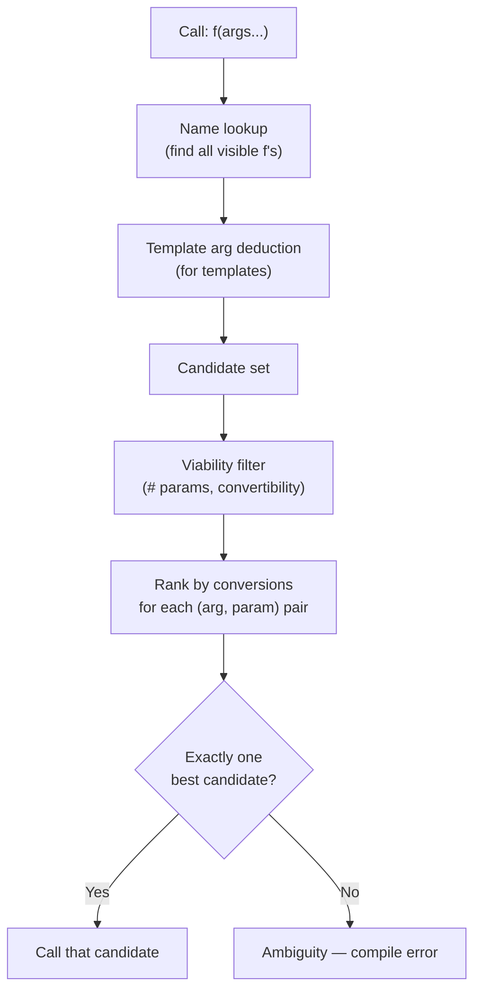

# Default Arguments and Overloading

## Why This Note Exists

C++ offers two mechanisms for "giving a function multiple shapes": default arguments (let some parameters be omitted) and function overloading (let the same name refer to multiple functions). Both are essential for ergonomic APIs, and both have subtle rules that catch developers off guard. This note explains each in detail, then unpacks how **overload resolution** works — the algorithm the compiler uses to pick a winner when multiple candidates are visible. We'll cover the rules, the gotchas (ambiguous calls, surprising conversions, default arguments across translation units), and the best practices that keep large codebases maintainable.

## Background

In C, every function must have a unique name. Want a `min` for `int` and a `min` for `double`? You need `min_int` and `min_double`. Want a function that takes 2 or 3 arguments? You need two functions.

C++ removes both restrictions:

- **Function overloading**: multiple functions with the same name but different parameter lists.
- **Default arguments**: parameters can have defaults, so callers may omit them.

Both features interact with C++'s type system in subtle ways. The compiler uses an algorithm called **overload resolution** to decide which function to call when there are multiple candidates. The rules are designed so that the "best match" wins, but ties are errors (ambiguity), and some matches are "worse" than others in well-defined ways.

## Main Content

### 1. Default Arguments

A **default argument** is a value used when the caller omits a parameter:

```cpp
void log(const std::string& msg, int level = 1);

log("hello");          // level = 1
log("hello", 3);       // level = 3
```

#### Rules

1. **Rightmost first**: you can only give defaults to the rightmost parameters. Once one parameter has a default, all parameters to its right must also have defaults.
   ```cpp
   void f(int a, int b = 2, int c = 3);     // OK
   void f(int a = 1, int b, int c = 3);     // ERROR: b has no default
   ```

2. **In declaration only**: the default appears in the declaration (header), not the definition. If you repeat it in the definition, it's an error.
   ```cpp
   // header.h
   void log(const std::string& msg, int level = 1);

   // impl.cpp
   #include "header.h"
   void log(const std::string& msg, int level) {   // NO default here
       /* ... */
   }
   ```

3. **Defaults are resolved at the call site**, not the definition site. The compiler must see the default value when parsing the call. This means the header that callers include must contain the default.

4. **Defaults can be any expression** that's valid at the point of declaration, including function calls:
   ```cpp
   void configure(int port = default_port());
   ```

5. **You can add defaults in later declarations** (but not change existing ones):
   ```cpp
   void f(int a, int b, int c);       // no defaults
   void f(int a, int b, int c = 3);   // OK: adds default for c
   void f(int a, int b = 2, int c);   // OK: adds default for b
   void f(int a, int b = 2, int c = 4); // ERROR: c already has default 3
   ```

6. **Default arguments are evaluated at the call site**, each time the function is called without that argument. They are not "compiled in" once.
   ```cpp
   int counter = 0;
   int next() { return ++counter; }
   void f(int x = next());

   f();   // x = 1
   f();   // x = 2
   ```
   This also means a default argument should not refer to local variables of the function.

7. **Default arguments don't change the signature**. `void f(int = 1);` and `void f(int);` are the same function to the linker. (You can't overload on default-ness.)

#### Default arguments vs overloading

Default arguments can often replace overloading:

```cpp
// With overloads
void draw(Rectangle r, Color c);
void draw(Rectangle r) { draw(r, Color::Black); }

// With default argument
void draw(Rectangle r, Color c = Color::Black);
```

The default-argument version is more concise. But overloads give you more control — you can do completely different things in each, and you can have one overload take a `const T&` and another take `T&&`.

> [!tip] When to prefer overloading over default arguments
> - When the "missing argument" case has fundamentally different logic.
> - When the parameter types differ significantly (not just "absent or present").
> - When the default value would require an expensive default-constructed temporary.
> - When you want to disable certain argument combinations (overloads can be deleted).

```cpp
// Prefer overloads to disallow nullptr
void f(std::string_view s);
void f(std::nullptr_t) = delete;   // Blocks f(nullptr)
```

### 2. Function Overloading

**Function overloading** lets multiple functions in the same scope share a name as long as their parameter lists differ:

```cpp
int  max(int a, int b);
double max(double a, double b);
std::string max(std::string a, std::string b);
```

The compiler picks the right one based on the argument types at each call site.

#### What can be overloaded on

- Number of parameters
- Parameter types
- cv-qualifiers on parameters (e.g., `int&` vs `const int&` — different)
- Ref-qualifiers on parameters (`int&` vs `int&&` — different)
- Pointer-to-function vs other (rare)

#### What cannot be overloaded on

- **Return type alone** — same signature.
- **Parameter names** — they're not part of the signature.
- **Default arguments** — they're not part of the signature.
- **`const`/`volatile` on a value parameter** (`void f(int)` vs `void f(const int)`) — these are the same signature at the caller's level (the `const` is only meaningful inside the function body).

#### Name mangling

To support overloading, C++ compilers **mangle** function names — encoding the parameter types into a unique symbol name. For example, `void f(int)` might become `_Z1fi` (in Itanium ABI) and `void f(double)` might become `_Z1fd`. The linker sees these as distinct symbols.

This is why you need `extern "C"` for C-linkage functions: C doesn't mangle, so `extern "C" void f(int);` produces a symbol named just `f`, callable from C.

```cpp
extern "C" void c_function(int);    // No mangling; callable from C
void cpp_function(int);              // Mangled; C++ only
```

You can inspect mangled names with `nm` (Unix) or `dumpbin /symbols` (Windows), and demangle with `c++filt` (Unix) or `undname` (Windows).

### 3. Overload Resolution

When a function name refers to multiple overloads, the compiler performs **overload resolution** to pick the best one. The algorithm:

1. **Name lookup** — find all visible functions with that name in the relevant scope.
2. **Template argument deduction** (if templates are involved) — for each template, deduce template arguments.
3. **Candidate set** — collect all viable candidates (correct number of parameters, or convertible with defaults).
4. **Viability filter** — discard candidates with the wrong number of parameters (after applying defaults) or non-convertible argument types.
5. **Ranking** — for each candidate, rank each argument-to-parameter conversion. Better conversions win.
6. **Best viable function** — if exactly one candidate is unambiguously best, that's the choice. If there's a tie, the call is **ambiguous** (compile error).

#### Conversion ranks (best to worst)

1. **Exact match** — including trivial conversions like `T` → `const T&`, array decay, function-to-pointer decay, qualification adjustment.
2. **Promotion** — `char` → `int`, `float` → `double`. No data loss.
3. **Standard conversion** — `int` → `double`, `Derived*` → `Base*`, `int` → `unsigned int`.
4. **User-defined conversion** — via constructors or conversion operators.
5. **Ellipsis** (`...`) — C-style varargs; matches anything.

A function is a better match than another if at least one argument has a better conversion rank and all others are at least as good. Ties on all arguments = ambiguity.

```cpp
void f(int);
void f(double);

f(1);    // calls f(int) — exact match beats int→double
f(1.0);  // calls f(double) — exact match beats double→int
f('a');  // calls f(int) — char→int is a promotion; char→double is a standard conversion
f(1L);   // AMBIGUOUS — long→int and long→double are both standard conversions
```

#### Ambiguity examples

```cpp
void f(long);
void f(double);
f(5);    // AMBIGUOUS — int→long and int→double are both standard conversions

void g(int);
void g(unsigned);
g(5);    // AMBIGUOUS — int→int (exact) vs int→unsigned (standard)? Actually: f(int) wins.
```

Wait — `g(5)` calls `g(int)`, because `int → int` is exact match, while `int → unsigned` is a standard conversion. Let's correct the example:

```cpp
void g(unsigned);
void g(long);
g(5);    // AMBIGUOUS — int→unsigned and int→long are both standard conversions
```

This kind of ambiguity is common when mixing signed/unsigned overloads.

#### Overload resolution flow



### 4. The "Surprising Conversion" Gotchas

#### `bool` overloads

```cpp
void f(bool);
void f(const std::string&);
f("hello");   // Calls f(bool)! — const char* → bool is a standard conversion
              // (any non-null pointer is true)
```

The `const char*` → `bool` conversion is "better" than `const char*` → `std::string` (which is a user-defined conversion). This is a famous C++ gotcha.

Fix: use `std::string_view` (no implicit conversion from `const char*` to `bool` involved) or delete the `bool` overload:

```cpp
void f(std::string_view);
void f(bool) = delete;
```

#### `0` and `nullptr`

```cpp
void f(int);
void f(char*);
f(0);        // Calls f(int) — 0 is an int literal
f(NULL);     // AMBIGUOUS on some compilers — NULL might be 0 or (void*)0
f(nullptr);  // Calls f(char*) — nullptr is a first-class null pointer
```

Use `nullptr`, not `NULL` or `0`, for null pointers.

#### Implicit conversions from integers

```cpp
void f(char);
void f(long);
f(42);       // AMBIGUOUS? No — int → char and int → long are both standard conversions.
             // But int → char is a "narrowing" standard conversion; int → long is also standard.
             // Actually: int → long is a better "promotion-ish" than int → char.
```

Actually, both `int → char` and `int → long` are standard conversions (not promotions, because `int` is not smaller than `char` or `long` on most platforms). The result is **ambiguous** — compile error.

### 5. Overload Resolution and Templates

When templates are in the candidate set, the compiler prefers non-template functions over template specializations when conversions are equal. Otherwise, the more specialized template wins.

```cpp
template <typename T> void f(T);     // (1)
template <typename T> void f(T*);    // (2) more specialized for pointers
void f(int*);                        // (3) non-template

f(new int{42});   // Calls (3) — non-template beats template when ties
```

This is a deep topic — covered in the Templates chapter.

### 6. Default Arguments + Overloading: Beware

```cpp
void f(int a, int b = 0);
void f(int a);

f(1);   // AMBIGUOUS — both can be called with one int
```

The compiler can't tell which you meant. Keep overloads with default arguments distinct in their parameter count.

### 7. Best Practices

1. **Don't overload across integer types** (`int`, `long`, `unsigned`, `size_t`) — causes ambiguity on common calls. Use templates or a single `long long` overload.
2. **Don't mix `bool` and pointer/string overloads** — `f("hello")` will surprise you.
3. **Use `nullptr` instead of `0`/`NULL`** for null pointers.
4. **Prefer `string_view` over `const char*` and `const std::string&` overloads** — one overload covers all string types.
5. **Document default arguments in headers** — they're part of your API.
6. **Avoid default arguments that perform expensive operations** (e.g., constructing a large object).
7. **Use `= delete` to forbid specific overloads**:
   ```cpp
   void f(std::string_view);
   void f(bool) = delete;          // Prevents f("hello") from calling f(bool)
   void f(std::nullptr_t) = delete;
   ```
8. **Keep overload sets in one place** — scattered overloads across headers make resolution harder to reason about.
9. **Don't add overloads in a way that changes existing call resolutions** — silently rerouting calls is a foot-gun.
10. **For "make this generic" use templates, not 10 overloads.**

### 8. A Realistic Example

```cpp
#include <string>
#include <string_view>
#include <iostream>

class Logger {
public:
    // Default argument: one declaration covers two entry points
    void log(std::string_view msg, int level = 1) {
        std::cout << "[" << level << "] " << msg << '\n';
    }

    // Overload deleted to prevent "hello" → bool surprises elsewhere
    void log(bool) = delete;
};

int main() {
    Logger l;
    l.log("startup complete");   // level = 1
    l.log("critical error", 5);  // level = 5
    // l.log(true);              // ERROR: deleted
}
```

## Common Pitfalls

1. **Ambiguity from mixing signed/unsigned/long overloads.** Use `string_view`-like patterns: one overload per logical operation.
2. **The `bool` overload trap** — `f("hello")` calls `f(bool)`.
3. **Repeating default arguments in the definition** — compile error.
4. **Changing defaults in a later declaration** — compile error.
5. **Calling a function with default arguments from a TU that hasn't seen them** — compile error.
6. **Default arguments evaluated per call** — performance and correctness surprises if the default expression has side effects.
7. **Overloading on `const T` vs `T` (by value)** — same signature, so redefinition error.
8. **Hiding base-class overloads** — a derived-class function with the same name hides all base-class overloads. Use `using Base::f;` to bring them in.
9. **Recursive overload resolution** — user-defined conversions can cause infinite recursion at compile time; the standard caps it.
10. **Cross-TU inconsistency** — if two TUs see different default values for the same parameter, UB.
11. **`NULL` vs `nullptr`** — `NULL` may be `0` (int) or `(void*)0`; behavior varies. Always use `nullptr`.
12. **Varargs (`...`) overloads** — they match anything but are the worst rank. Avoid in C++.

## Tips and Tricks

- **Default arguments are part of your API** — change them carefully; existing callers may depend on the old default.
- **`= delete` is your friend** for forbidding bad overloads:
  ```cpp
  void f(std::string_view s);
  void f(bool) = delete;
  void f(std::nullptr_t) = delete;
  ```
- **Use `using Base::f;`** in derived classes to unhide base overloads.
- **Prefer `std::string_view` over `const std::string&` + `const char*` overloads** — single function, all string types.
- **For "default-constructed optional" parameter**, use `std::optional<T>`:
  ```cpp
  void f(std::optional<Config> c = std::nullopt);
  ```
- **Inspection tools**: `nm`, `c++filt`, `dumpbin` to see mangled names.
- **Mark functions `[[nodiscard]]`** to prevent callers from silently dropping results.
- **Enable `-Wambiguous**` and `-Wconversion`** to catch surprising resolutions.
- **Default arguments in virtual functions** are resolved statically** — don't rely on them across overrides; the static type's default is used.
  ```cpp
  struct Base { virtual void f(int x = 1); };
  struct Derived : Base { void f(int x = 2) override; };
  Base* b = new Derived;
  b->f();   // Calls Derived::f — but with x = 1 (Base's default)!
  ```

## Active Recall

1. What is the rule about the order of default arguments? Why?
2. Can you put a default argument in a function definition (not declaration)? Why or why not?
3. Write two overloads that an outside caller cannot disambiguate when called with `f(0)`.
4. Why does `f("hello")` call `f(bool)` instead of `f(const std::string&)` when both exist?
5. What is name mangling? Why does C++ need it but C does not?
6. List the five conversion ranks used in overload resolution, from best to worst.
7. Why is `void f(int)` and `void f(const int)` not a valid overload set?
8. Explain why default arguments don't change a function's signature.
9. What is the candidate set? The viable set? The best viable function?
10. Write a `Logger` class with a `log` method that takes a string and an optional level. Show how to forbid `log(true)`.
11. What happens if you call `b->f()` on a `Base*` pointing to a `Derived` where both have different default arguments for `f`?
12. Why should you use `nullptr` instead of `0` or `NULL`?

## Next Steps

- Read [[4. Inline, Constexpr, Consteval]] for compile-time function semantics.
- Read [[5. Function Pointers and Lambdas]] for callbacks and first-class functions.
- For template overload resolution (SFINAE, concepts), see the Templates chapter.
- For `= delete` and `explicit` in class design, see the Classes chapter.
- Cross-reference [[3. Strings and Character Data/3. string_view and Modern String Handling]] — `string_view` is the canonical "one overload to accept all string types" pattern.
