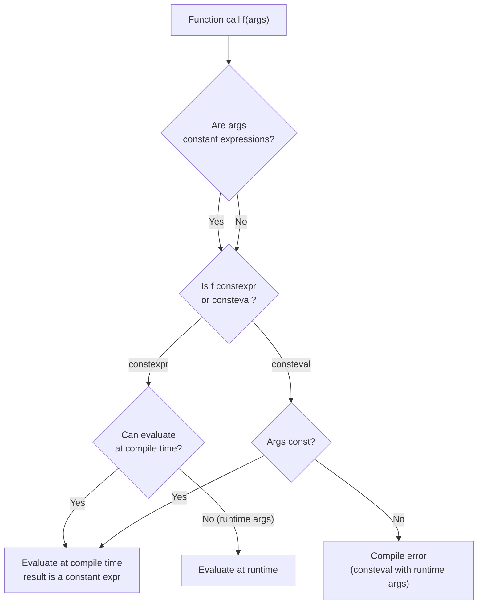
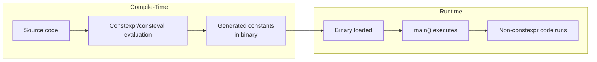

# Inline, Constexpr, Consteval

## Why This Note Exists

Four keywords in modern C++ — `inline`, `constexpr`, `consteval`, and `constinit` — control *when* and *how* code is evaluated. They look similar, share historical roots, and are often confused, but they serve distinct purposes: `inline` is about linkage and the One Definition Rule; `constexpr` is about *possible* compile-time evaluation; `consteval` is about *required* compile-time evaluation; `constinit` is about *constant initialization* of static objects. This note disentangles them, explains the historical reasoning behind each, and shows when to reach for which. By the end you should be able to read any function declaration annotated with these keywords and explain exactly what the compiler is and isn't required to do.

## Background

The story begins with `inline` in the 1980s. C compilers had a function-call overhead (push args, call, ret, pop) that was wasteful for tiny functions like `min(int, int)`. The `inline` keyword suggested to the compiler: "consider expanding this function's body at the call site instead of issuing a call instruction." It also had a side effect: it relaxed the One Definition Rule (ODR) so that the function could be defined in a header and included in multiple translation units without linker errors.

In C++11, `constexpr` was introduced for *compile-time evaluation* — functions that could be executed by the compiler during compilation, allowing things like `int arr[fib(10)];` (where `fib(10)` is a constant expression).

C++14 relaxed `constexpr` (loops, mutation of locals allowed).
C++17 made `constexpr` lambdas and `if constexpr` possible.
C++20 added `consteval` (mandatory compile-time evaluation), `constinit` (forcing constant initialization), and allowed `constexpr` to use most of the language (dynamic allocation, `std::vector` in constexpr contexts, etc.).
C++23 added even more (constexpr `goto`,Placement `new`, etc.).

The throughline: the C++ committee has been pushing more and more of the language into the compile-time evaluatable subset, enabling richer metaprogramming without templates.

## Main Content

### 1. `inline` — Historical vs Modern Meaning

#### Historical meaning (performance hint)

Originally, `inline` was a *suggestion* to the compiler to inline-expand a function:

```cpp
inline int square(int x) { return x * x; }
```

The compiler was free to ignore this. Modern compilers decide inlining based on their own heuristics (inlining flags, function size, hot/cold profiling) — they inline functions *not* marked `inline` and refuse to inline functions *marked* `inline`. The keyword is now mostly ignored for inlining decisions.

#### Modern meaning (ODR relaxation)

The real, current meaning of `inline` is: **"this function may be defined in multiple translation units; the linker should merge them."** Without `inline`, defining a function in a header that's included in multiple TUs violates the ODR (linker error: "multiple definition"). With `inline`, the linker merges them.

```cpp
// header.h
inline int square(int x) { return x * x; }   // OK in header
```

Without `inline`, this header would cause "multiple definition" linker errors when included by multiple `.cpp` files.

#### When to use `inline`

1. **Functions defined in headers.** Free functions in headers should be `inline` (or `constexpr`, which implies `inline`).
2. **Template instantiations** are implicitly `inline`.
3. **Member functions defined inside a class body** are implicitly `inline`.
4. **`constexpr` functions** are implicitly `inline` (since C++17).
5. **Variable definitions in headers** (C++17 `inline variables`):
   ```cpp
   inline int global_counter = 0;   // OK in header
   ```

#### `inline` and `__attribute__((always_inline))`

If you *really* want to force inlining, use a compiler-specific attribute:

```cpp
[[gnu::always_inline]] inline int square(int x) { return x * x; }
```

But this is rarely needed. Trust the compiler's heuristics.

### 2. `constexpr` — Compile-Time IF Possible

A `constexpr` function *may* be evaluated at compile time **if** its arguments are constant expressions and its body satisfies the constexpr restrictions. It *may also* be evaluated at runtime — same function, both contexts.

```cpp
constexpr int square(int x) { return x * x; }

int main() {
    int arr[square(5)];          // Compile-time: arr[25]
    int x = std::cin.get();
    int y = square(x);           // Runtime: y = x*x at runtime
    constexpr int z = square(4); // Compile-time: z = 16
}
```

This duality is the key insight: **`constexpr` does not mean "always compile-time." It means "compile-time IF the inputs are compile-time."**

#### What `constexpr` functions can do (C++14, expanded in C++20/23)

- Loops (`for`, `while`)
- Local variables (mutable in C++14+)
- `if` statements (including `if constexpr` in C++17)
- Multiple `return` statements (C++14+)
- Use literals and other `constexpr` functions
- (C++20) Dynamic allocation (`new`/`delete`), `std::vector`, `std::string`
- (C++20) `try`/`catch` (but exceptions must not be thrown at compile time)
- (C++20) `typeid` on polymorphic types (limited)
- (C++23) `goto`, certain `union` access

#### What `constexpr` functions cannot do (as of C++23)

- Call non-`constexpr` functions
- Use `asm`
- Throw exceptions at compile time (must be caught)
- Have undefined behavior at compile time

#### `constexpr` variables

A `constexpr` variable is a *compile-time constant* — its value is known at compile time and cannot change:

```cpp
constexpr int N = 10;             // Compile-time constant
int arr[N];                       // OK

constexpr int x = std::cin.get(); // ERROR — not a constant expression
```

`constexpr` implies `const`, but `const` does not imply `constexpr`:

```cpp
const int x = compute_at_runtime();   // OK: runtime const, not constexpr
constexpr int y = compute_at_runtime(); // ERROR
```

#### `constexpr` vs `consteval`

`constexpr` allows both compile-time and runtime use. `consteval` (C++20) is stricter: the function *must* be evaluated at compile time. If called with runtime arguments, it's a compile error.

```cpp
consteval int square_compile(int x) { return x * x; }

int main() {
    constexpr int x = square_compile(5);   // OK
    int y = std::cin.get();
    int z = square_compile(y);             // ERROR — must be compile-time
}
```

#### `constexpr` vs `constfn` rules

A `constexpr` function may be called in non-constexpr contexts (runtime). A `consteval` function may not. A `constexpr` function that happens to be called with constant arguments is required to produce a constant result; the compiler enforces this.



### 3. `consteval` — MUST Be Compile-Time (C++20)

`consteval` declares an **immediate function**: every call must produce a constant expression. There is no runtime path.

```cpp
consteval int fib(int n) {
    return n <= 1 ? n : fib(n - 1) + fib(n - 2);
}

int main() {
    constexpr int x = fib(10);   // OK: 55, computed at compile time
    int n = 10;
    int y = fib(n);              // ERROR: n is not a constant expression
}
```

#### When to use `consteval`

- **Format string validators**: `std::format` uses `consteval` to check format strings at compile time.
- **Compile-time lookup tables** that must be computed at compile time.
- **Reflection-based code generation**.
- **Static assertions** that depend on complex calculations.

#### Bridging `consteval` and runtime: `std::consteval` trick

If you want a function that is *sometimes* compile-time and *sometimes* runtime, but always uses a `consteval` core, you can wrap it:

```cpp
consteval int square(int x) { return x * x; }

int runtime_square(int x) {
    return x * x;   // duplicate logic for runtime
}
```

Or use a `constexpr` function that defers to a `consteval` helper inside `if constexpr`-style logic.

### 4. `constinit` — Constant Initialization (C++20)

`constinit` is a *storage-class-like* specifier for namespace-scope or static-member variables. It enforces that the variable is **constant-initialized** — initialized with a constant expression — without making it `const`.

This solves the **static initialization order fiasco**: a problem where the order of initialization of static variables across translation units is undefined, leading to bugs where one static depends on another being initialized.

```cpp
// header.h
extern constinit int counter;   // constant-initialized, but mutable

// cpp file
constinit int counter = 0;      // must have a constant initializer
```

- `constinit` does not imply `const` — the variable can be modified at runtime.
- `constinit` requires constant initialization — no dynamic initialization.
- `constinit` prevents the static initialization order fiasco for the annotated variable.

Compare:
```cpp
int x = compute();              // Dynamic init — order across TUs undefined
constinit int y = 42;           // Constant init — no order dependency
const int z = 42;               // Constant init + const
```

`constinit` is most useful for:
- Global configuration flags read by multiple TUs.
- Static class members that need to be initialized before `main`.
- Replacing "construct on first use" idioms where possible.

### 5. Comparison Table

| Keyword | Applies to | Effect | Evaluates at compile time? | Evaluates at runtime? |
|:--------|:-----------|:-------|:---------------------------|:----------------------|
| `inline` | Function or variable (C++17) | ODR relaxation; may inline | Caller decides | Yes (default) |
| `constexpr` | Function or variable | May evaluate at compile time | Yes (if args const) | Yes (if args runtime) |
| `consteval` | Function (C++20) | Must evaluate at compile time | Yes (always) | No (compile error) |
| `constinit` | Variable (C++20) | Forces constant initialization | Yes (init only) | Variable may mutate |

### 6. When to Use Each

#### Use `inline`
- Functions defined in headers (or use `constexpr`, which implies `inline`).
- Variables defined in headers (C++17 inline variables).
- You probably don't need `inline` for inlining decisions — trust the compiler.

#### Use `constexpr`
- Any function that *can* be evaluated at compile time. Default to `constexpr` for literals, math, hashing, parsing — anything that might be useful in constant expressions.
- Variables whose values are known at compile time.
- `if constexpr` for conditional compilation inside templates.

#### Use `consteval`
- Functions that *only* make sense at compile time (format string checking, reflection).
- When you want to enforce compile-time evaluation as a contract.

#### Use `constinit`
- Global/static variables that must be initialized before `main` to avoid the static initialization order fiasco.
- Replacing runtime-initialized globals with constant-initialized ones.

### 7. A Realistic Example

```cpp
#include <array>
#include <cstdint>

// Compile-time PRNG (Linear Congruential Generator)
constexpr std::uint64_t lcg_next(std::uint64_t state) {
    return state * 6364136223846793005ULL + 1442695040888963407ULL;
}

// Build a compile-time lookup table
constexpr std::array<std::uint64_t, 16> make_table() {
    std::array<std::uint64_t, 16> t{};
    std::uint64_t s = 0xdeadbeefULL;
    for (auto& x : t) {
        s = lcg_next(s);
        x = s;
    }
    return t;
}

// consteval: must be compile-time
consteval std::uint64_t table_value(int i) {
    return make_table()[i];
}

// constexpr: may be compile-time or runtime
constexpr std::uint64_t safe_value(int i) {
    return i >= 0 && i < 16 ? make_table()[i] : 0;
}

// Inline variable in a header — single definition across TUs
inline std::uint64_t runtime_counter = 0;

// constinit: constant-initialized, but mutable, no SIOF risk
constinit std::uint64_t init_token = 0x12345ULL;

int main() {
    constexpr std::uint64_t x = table_value(3);   // OK
    // std::uint64_t y = table_value(getchar());  // ERROR — consteval with runtime input

    constexpr std::uint64_t a = safe_value(2);    // OK at compile time
    int idx = std::cin.get();
    std::uint64_t b = safe_value(idx);            // OK at runtime
}
```

### 8. `if constexpr` (C++17)

`if constexpr` evaluates its condition at compile time and discards the untaken branch (no instantiation). This is invaluable in templates:

```cpp
template <typename T>
void process(T x) {
    if constexpr (std::is_integral_v<T>) {
        std::cout << "integer: " << x;
    } else if constexpr (std::is_floating_point_v<T>) {
        std::cout << "float: " << x;
    } else {
        std::cout << "other: " << x;
    }
}
```

Without `if constexpr`, both branches would be instantiated, causing errors when `T` doesn't support the operations of one branch.

### 9. Compile-Time vs Runtime Evaluation



The benefit of compile-time evaluation:
- **Zero runtime cost**: the result is baked into the binary.
- **No UB risk**: compile-time UB is a compile error.
- **Better optimization**: the compiler knows the value.
- **Smaller binary**: no code to run.

### 10. Limits and Gotchas

- **Compile-time evaluation is slow** — large `constexpr` computations slow compilation. Use `__cpp_constexpr` limits and step limits.
- **`constexpr` does not guarantee compile-time evaluation** — only that it's *possible*. To *force* it, assign to a `constexpr` variable or use `consteval`.
- **Recursive `constexpr`** has a default depth limit (typically 512). Deep recursion may exceed it.
- **`std::vector` in `constexpr`** (C++20): allocation must be freed by end of evaluation; otherwise compile error.
- **`constexpr` destructors** (C++20): types with non-trivial destructors can be `constexpr`.
- **`constinit` cannot be applied to function-local `static`** variables (C++23 may relax this).

## Common Pitfalls

1. **Assuming `inline` forces inlining.** It doesn't. It's about ODR.
2. **Assuming `constexpr` means "always compile-time."** It doesn't. It's "compile-time IF possible."
3. **Forgetting that `constexpr` functions can be called at runtime** with non-constant args.
4. **Expecting `consteval` to fall back to runtime** — it won't; it's a hard compile error.
5. **Putting `constexpr` on a function that calls a non-`constexpr` function** — compile error.
6. **Static initialization order fiasco** — solved by `constinit` for new code.
7. **Defining a non-`inline` function in a header** — multiple-definition linker error.
8. **Defining a global variable in a header without `inline`** (C++17) — same problem.
9. **Trying to use `std::cout` in `constexpr`** — not allowed.
10. **Compile-time evaluation taking too long** — compilers have limits; deep recursion or huge loops can fail or be very slow.
11. **`constexpr` member functions not actually being `const`** — they're not (they can mutate `*this`); but the function is callable on `const` objects only if it's also `const`-qualified.
12. **Mixing `consteval` and `constexpr`** incorrectly — `consteval` can call `constexpr`, but `constexpr` cannot call `consteval` unless the call is itself a constant expression.

## Tips and Tricks

- **Default to `constexpr`** for any function that takes literals and returns a value. If it can be `constexpr`, make it `constexpr`.
- **Use `consteval` when you want to enforce compile-time evaluation** — e.g., format string validation.
- **Use `constinit` for globals** to avoid the static initialization order fiasco.
- **Use `if constexpr`** in templates to dispatch on type traits without SFINAE.
- **Use `inline` variables (C++17)** for header-defined globals:
  ```cpp
  inline constexpr int kMaxConnections = 100;
  ```
- **Inspect `__cpp_constexpr`** and other feature-test macros to version your code.
- **`constexpr` lambdas** (C++17) work — useful for compile-time predicates.
- **Constexpr-friendly types** (`std::array`, `std::string_view`, `std::tuple`, `std::optional`, `std::variant`) are the building blocks for compile-time programming.
- **Constexpr containers** (C++20): `std::vector` and `std::string` are usable in `constexpr` — but allocations must balance.
- **Use `static_assert`** to verify your `constexpr` functions behave at compile time.

## Active Recall

1. What is the modern meaning of `inline`, and why is it different from the historical meaning?
2. Does `inline` guarantee that a function is inlined? Why or why not?
3. Write a `constexpr` function `fib(int n)`. Show a call site where it's evaluated at compile time, and one where it's evaluated at runtime.
4. What is the difference between `constexpr` and `consteval`?
5. What problem does `constinit` solve? Give an example.
6. Can a `constexpr` function call a `consteval` function? Under what conditions?
7. What does `if constexpr` do that ordinary `if` cannot?
8. List three things `constexpr` functions could not do in C++11 but can do in C++14.
9. List three things `constexpr` functions can do in C++20 that they couldn't in C++17.
10. Why might a recursive `constexpr` function fail to compile even if it's mathematically correct?
11. What is the static initialization order fiasco? How do `constinit` and "construct on first use" each address it?
12. Why is `constexpr` implied for `consteval` functions but not vice versa?

## Next Steps

- Read [[5. Function Pointers and Lambdas]] for callbacks and the function-call side of the language.
- For templates and `if constexpr` in depth, see the Templates chapter.
- For move semantics, concepts, and other modern features, see the Modern C++ chapter.
- For metaprogramming patterns using `constexpr`, see the Metaprogramming chapter.
- Cross-reference [[1. Function Basics]] for the foundational function concepts these keywords modify.
