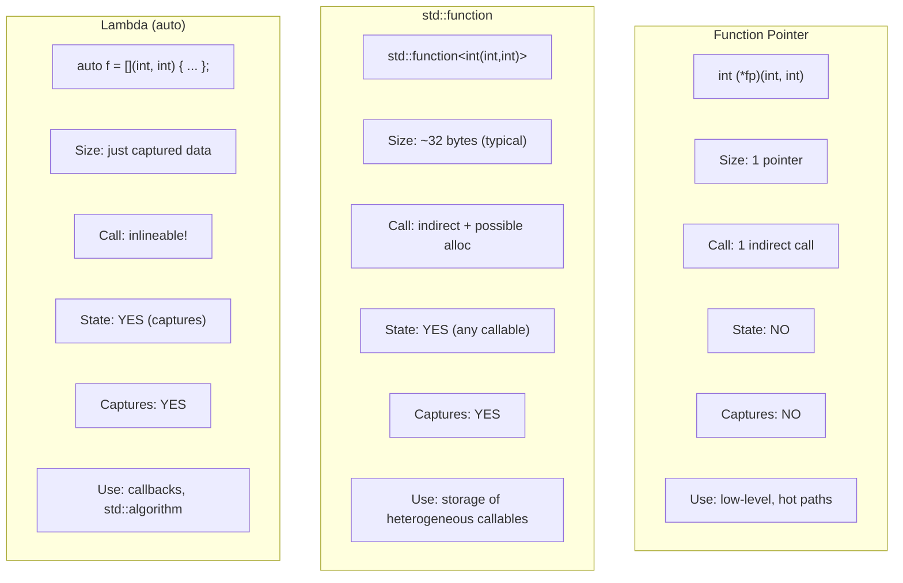

# Function Pointers and Lambdas

## Why This Note Exists

C++ lets you treat functions as data: you can take their address, store that address, pass it to other functions, and call through it later. This is the foundation of callbacks, event handlers, plugin architectures, dispatch tables, and the Standard Library's algorithms (`std::sort` with a comparator, `std::transform` with a unary function, `std::for_each`, etc.). C++11 added **lambdas** — anonymous callable objects you can write inline — and `std::function`, a type-erased holder for any callable. C++14 added generic lambdas and init-captures; C++20 added template lambdas; C++23 added more. This note covers the whole landscape: raw function pointers, `std::function`, lambdas in every flavor, and the guidelines for choosing among them.

## Background

In C, the only way to pass "a function" to another function is a **function pointer** — a variable holding the address of a function's machine code. You declare it with a slightly clunky syntax, assign it `&func` (or just `func`, which decays), and call through it with `(*fp)(args)` or just `fp(args)`.

C++ inherits function pointers verbatim. They are fast (one indirect call) and have zero heap overhead, but they are inflexible: they can only point at free functions and static member functions — not at member functions of objects (you need a separate "pointer to member" syntax for those), and not at stateful callables (lambdas with captures).

To address this, C++11 introduced:

1. **Lambdas**: syntactic sugar for generating local callable classes. They can capture variables from the enclosing scope, giving them state.
2. **`std::function`**: a type-erased wrapper that can hold any callable (function pointer, lambda, functor, member function wrapper) with a given signature.
3. **`std::bind`** (mostly superseded by lambdas, but still around).

Together these turn functions into first-class values, enabling functional-style programming in C++.

## Main Content

### 1. Function Pointers — Syntax

```cpp
int add(int a, int b) { return a + b; }

int main() {
    int (*fp)(int, int) = &add;   // fp is a pointer to function taking (int,int) returning int
    int result = fp(2, 3);         // Call through pointer
    int result2 = (*fp)(2, 3);     // Equivalent
}
```

The declaration syntax `int (*fp)(int, int)` reads inside-out: `fp` is a pointer (`*`) to a function taking `(int, int)` and returning `int`.

Function names decay to function pointers (just like array names decay to element pointers), so `&add` and `add` are usually interchangeable:

```cpp
fp = &add;   // Explicit address-of
fp = add;    // Implicit decay
```

#### Using `typedef`/`using` for readability

The C-style syntax is hard to read. Use aliases:

```cpp
// Old style
typedef int (*BinOp)(int, int);

// Modern style (C++11)
using BinOp = int(*)(int, int);

BinOp op = add;
int r = op(2, 3);
```

Much cleaner.

#### Calling through a function pointer

```cpp
int r1 = fp(2, 3);        // Implicit dereference
int r2 = (*fp)(2, 3);     // Explicit dereference
```

Both are valid; the first is more common.

### 2. Function Pointers as Parameters and Return Types

```cpp
// Parameter
void apply(int (*op)(int, int), int a, int b) {
    std::cout << op(a, b);
}

// Cleaner with alias
void apply(BinOp op, int a, int b);

// Return type
BinOp choose_op(char c);   // Returns a function pointer
```

Returning a function pointer from a function:

```cpp
BinOp choose_op(char c) {
    if (c == '+') return add;
    if (c == '-') return sub;
    return nullptr;
}
```

### 3. Pointer to Member Functions

Member functions need a different syntax:

```cpp
struct Widget {
    int compute(int x) { return x * 2; }
};

// Pointer to member function
int (Widget::*pmf)(int) = &Widget::compute;

Widget w;
Widget* wp = &w;
int r1 = (w.*pmf)(10);      // Call on object
int r2 = (wp->*pmf)(10);    // Call on pointer to object
```

The `.*` and `->*` operators are required. Member function pointers are typically twice the size of regular pointers (they carry an offset for virtual dispatch).

### 4. `std::function` — Type-Erased Callable Holder

`std::function<R(Args...)>` can hold any callable matching the signature `R(Args...)`:

```cpp
#include <functional>

int add(int a, int b) { return a + b; }

int main() {
    std::function<int(int, int)> f = add;          // function pointer
    f = [](int a, int b) { return a - b; };         // lambda
    f = [](int a, int b) { return a * b; };         // another lambda

    struct Functor {
        int operator()(int a, int b) const { return a / b; }
    };
    f = Functor{};                                  // functor

    std::cout << f(10, 2);   // 5
}
```

#### How `std::function` works (type erasure)

`std::function` uses a technique called **type erasure**: it stores a pointer to a small object plus a vtable of operations (copy, move, invoke, destroy). For small callables (typically up to ~16–24 bytes), it stores them inline (Small Buffer Optimization, SBO); for large callables, it heap-allocates.

This means:
- Any callable with the right signature can be stored.
- There's runtime overhead: an indirect call (and possibly a heap allocation).
- Copying a `std::function` copies the underlying callable.

#### When to use `std::function`

- When you need a uniform type for storing any callable (e.g., a vector of callbacks).
- When the callable's type is not known at compile time or would be huge.
- For API boundaries where you want flexibility.

#### When NOT to use `std::function`

- In performance-critical code (indirect call + potential allocation).
- For callables used immediately (use a template parameter instead).
- When you don't need type erasure.

### 5. Lambda Expressions

A **lambda** creates an anonymous class with `operator()` and constructs an instance of it inline.

```cpp
auto add = [](int a, int b) { return a + b; };
int r = add(2, 3);   // 5
```

The full syntax:

```
[ capture-list ] ( params ) mutable -> return-type { body }
```

- **Capture list**: variables from enclosing scope to capture.
- **Params**: function parameters (like a normal function).
- **`mutable`** (optional): allows modifying captured-by-value variables.
- **Trailing return type** (optional): deduced if omitted.
- **Body**: the code to run.

#### What the compiler generates

```cpp
int x = 10;
auto f = [x](int a) { return a + x; };
```

Roughly expands to:

```cpp
struct __lambda {
    int x;
    int operator()(int a) const { return a + x; }
};
__lambda f{x};
```

Each lambda has a unique, unnameable type. Two lambdas with the same code are *different types*.

### 6. Capture Modes

| Capture | Meaning |
|:--------|:--------|
| `[]` | No capture |
| `[=]` | Capture all by value |
| `[&]` | Capture all by reference |
| `[x]` | Capture `x` by value |
| `[&x]` | Capture `x` by reference |
| `[=, &x]` | Capture all by value, except `x` by reference |
| `[&, x]` | Capture all by reference, except `x` by value |
| `[this]` | Capture `this` pointer (member function context) |
| `[*this]` | Capture `*this` by value (C++17) |
| `[x = expr]` | Init capture (C++14) — declare a new variable |

```cpp
int a = 1, b = 2, c = 3;

auto f1 = []       { /* no captures */ };
auto f2 = [=]      { return a + b + c; };   // by value
auto f3 = [&]      { return a + b + c; };   // by reference
auto f4 = [a, &b]  { return a + b; };       // mixed
auto f5 = [x = a + 1] { return x; };        // init capture (C++14)
auto f6 = [p = std::move(ptr)] { /* owns ptr */ };  // move into capture
```

> [!warning] Dangling captures
> ```cpp
> std::function<int()> make() {
>     int local = 42;
>     return [&local] { return local; };   // DANGLING: local goes out of scope
> }
> ```
> Capturing by reference into a lambda that outlives the captured variable is the #1 lambda bug. Capture by value if the lambda may outlive the local.

### 7. `mutable` Lambdas

By default, lambdas have a `const` `operator()`. To mutate captured-by-value variables, mark the lambda `mutable`:

```cpp
int x = 0;
auto counter = [x]() mutable { return ++x; };

counter();   // 1
counter();   // 2
counter();   // 3
// x in the enclosing scope is still 0!
```

Each lambda instance has its own copy of `x`. Mutating it does not affect the original.

### 8. Generic Lambdas (C++14)

A `auto` parameter makes the lambda generic — it can be called with any type:

```cpp
auto add = [](auto a, auto b) { return a + b; };

add(1, 2);          // int
add(1.5, 2.5);      // double
add(std::string("a"), std::string("b"));   // string
```

The compiler generates a templated `operator()` for each unique combination of argument types.

C++20 added explicit template syntax for lambdas:

```cpp
auto add = []<typename T>(T a, T b) { return a + b; };
```

### 9. Init Captures (C++14)

You can declare new variables in the capture list with initializers:

```cpp
auto f = [x = compute_value(), &y = some_ref]() { /* ... */ };
```

Use cases:
- **Move into a lambda**: `[p = std::move(ptr)]`
- **Rename**: `[n = expensive_name]`
- **Compute once**: `[squared = x * x]`

```cpp
std::unique_ptr<Widget> widget = std::make_unique<Widget>();
auto f = [w = std::move(widget)]() { w->do_something(); };
```

### 10. `std::invoke` (C++17)

`std::invoke(f, args...)` calls *any* callable uniformly — function pointer, lambda, member function pointer, member data pointer. It's the foundation of `std::function`, `std::bind`, and `std::thread`.

```cpp
#include <functional>

struct Widget { int value; void show() { std::cout << value; } };

Widget w{42};
std::invoke(&Widget::show, w);          // Calls w.show()
std::cout << std::invoke(&Widget::value, w);  // Accesses w.value
std::invoke([](int x) { return x * 2; }, 5);  // Calls lambda
```

This is especially useful in templates where you don't know what kind of callable you have.

### 11. Function Pointer vs `std::function` vs Lambda



| Property | Function pointer | `std::function` | Lambda (auto) |
|:---------|:-----------------|:-----------------|:---------------|
| Size | 1 pointer | ~32 bytes (typical) | Just captures |
| Call overhead | Indirect | Indirect + maybe heap | Inlineable! |
| State | No | Yes | Yes |
| Captures | No | Yes | Yes |
| Storage in containers | OK | OK | Hard (each lambda is a unique type) |
| Type erasure | No | Yes | No |
| Best for | C API, hot paths | Heterogeneous storage | Algorithms, callbacks |

### 12. Choosing Among Them

#### Function pointer
- Use for C API interop.
- Use when you have a free function and want zero overhead.
- Use when the function pointer is the only state you need (no captures).

#### `std::function`
- Use when you need to *store* a callable of unknown type.
- Use in interfaces where the caller may supply any callable.
- Use in `std::vector<std::function<...>>` and similar.
- Avoid in hot loops (use a template parameter instead).

#### Lambda
- Use everywhere a callable is needed for an immediate use (e.g., `std::sort(v.begin(), v.end(), [](auto a, auto b){ return a < b; })`).
- Use for callbacks with state.
- Use for `std::thread`, `std::async`, `std::function` filling.

#### Template parameter
- Use when performance matters and the callable is used immediately.
- `template <typename F> void apply(F f);` — `f` is inlinable.

```cpp
// Template version — fastest
template <typename F>
void for_each_value(const std::vector<int>& v, F f) {
    for (auto x : v) f(x);
}

// std::function version — type-erased, slower
void for_each_value(const std::vector<int>& v, std::function<void(int)> f);
```

The template version inlines `f`; the `std::function` version does an indirect call per element.

### 13. Realistic Example: An Event System

```cpp
#include <functional>
#include <vector>
#include <string>
#include <iostream>

class EventBus {
public:
    using Handler = std::function<void(const std::string&)>;

    void subscribe(Handler h) { handlers_.push_back(std::move(h)); }

    void publish(const std::string& event) {
        for (const auto& h : handlers_) h(event);
    }

private:
    std::vector<Handler> handlers_;
};

int main() {
    EventBus bus;

    int counter = 0;
    bus.subscribe([&counter](const std::string& e) {
        std::cout << "Counter handler: " << e << " (#" << ++counter << ")\n";
    });

    bus.subscribe([](const std::string& e) {
        std::cout << "Logger: " << e << '\n';
    });

    bus.publish("hello");
    bus.publish("world");
}
```

### 14. Realistic Example: Algorithm with Comparator

```cpp
#include <algorithm>
#include <vector>

std::vector<int> v = {5, 3, 8, 1, 9, 2};

// Sort descending
std::sort(v.begin(), v.end(), [](int a, int b) { return a > b; });

// Sort by some criterion involving a captured variable
int threshold = 5;
std::sort(v.begin(), v.end(), [threshold](int a, int b) {
    bool a_far = std::abs(a - threshold) > 2;
    bool b_far = std::abs(b - threshold) > 2;
    return a_far != b_far ? a_far < b_far : a < b;
});
```

The lambda is inlined into `std::sort` — zero call overhead, full optimization.

### 15. `std::bind` (legacy)

`std::bind` predates lambdas and creates a callable with bound arguments:

```cpp
#include <functional>

int add(int a, int b, int c) { return a + b + c; }

auto f = std::bind(add, 1, std::placeholders::_1, 3);
f(2);   // = add(1, 2, 3) = 6
```

Modern C++ prefers lambdas for clarity and performance. `std::bind` is rarely needed.

## Common Pitfalls

1. **Dangling reference captures** — capturing `&local` into a lambda that outlives `local`.
2. **Forgetting `mutable`** when you need to mutate captured-by-value state.
3. **`std::function` in hot loops** — indirect call per iteration. Use templates.
4. **Assuming two lambdas have the same type** — they don't. `auto` is required.
5. **Storing a lambda with `[=]` capture of `this`** — captures `this` by pointer, so the lambda dangles if `*this` is destroyed.
6. **Capturing `this` in a member function** — `[this]` captures the pointer, not a copy of the object. Use `[*this]` (C++17) for a copy.
7. **Forgetting that `[=]` captures by value but member access goes through `this`** — implicit `this` capture is now deprecated for `[=]`.
8. **Lifetime of `std::function`'s underlying callable** — it's owned by the `std::function` (copied or moved in).
9. **Using `std::bind` where a lambda is clearer** — prefer lambdas.
10. **Function pointer syntax confusion** — use `using` aliases.
11. **Member function pointer syntax** — `.*` and `->*` are required and easy to forget.
12. **Returning a lambda from a function** — must use `auto` return type or wrap in `std::function`.

## Tips and Tricks

- **Use `auto` for lambda variables** — each lambda has a unique type only the compiler can name.
- **Use templates for hot callbacks** — `template <typename F> void apply(F f);` is faster than `std::function`.
- **Use `std::function` for storage** of heterogeneous callables (vectors of callbacks, member fields).
- **Use `std::invoke` in templates** for uniform callable handling.
- **Capture by reference only when the lambda's lifetime is bounded** by the captured variable's lifetime.
- **Capture by value** if the lambda will outlive the local — pay the copy.
- **Use init-captures for moves**: `[p = std::move(ptr)]`.
- **Use generic lambdas** (`auto` params) for reusable callables.
- **Use `[*this]` (C++17)** to capture the current object by copy when the lambda may outlive `*this`.
- **Prefer lambdas over `std::bind`** — clearer, faster, easier to debug.
- **`constexpr` lambdas (C++17)** can be evaluated at compile time.
- **`std::function` is at least 32 bytes** on most implementations — be aware when storing many.
- **Lambdas are not assignable** by default (each has a unique type with `const operator()`); wrap in `std::function` if you need to reassign.

## Active Recall

1. Write a function pointer declaration for a function that takes `double, double` and returns `double`. Show both raw syntax and `using` alias.
2. How do you call a member function through a pointer-to-member-function? Show both `.*` and `->*`.
3. What is type erasure? How does `std::function` use it?
4. List five things a lambda can capture that a function pointer cannot.
5. What does `mutable` do on a lambda? Why is it needed?
6. Write a lambda that captures `x` by value and `y` by reference, then increments the captured `x` on each call.
7. What is an init-capture (C++14)? Give an example using `std::move`.
8. What is a generic lambda? Write one that adds two values of any type.
9. Compare the runtime overhead of a function pointer, `std::function`, and a lambda passed as a template parameter.
10. What does `std::invoke` do? When would you use it?
11. Why must you use `auto` to store a lambda? What type does it have?
12. Write a `subscribe` function that accepts any callable taking a `std::string`. Show both the `std::function` and template versions.
13. What is the lifetime hazard with `[&]` capture? How do you fix it?
14. What is the difference between `[this]` and `[*this]` (C++17)?

## Next Steps

- This completes Chapter 4. Review [[1. Function Basics]] through [[4. Inline, Constexpr, Consteval]] for the full picture.
- For templates (which interact with lambdas heavily), see the Templates chapter.
- For functional-style patterns (map/filter/fold), see the STL Algorithms chapter.
- For concurrency primitives that take callables (`std::thread`, `std::async`), see the Concurrency chapter.
- Cross-reference [[3. Strings and Character Data/2. std::string Deep Dive]] — lambdas are commonly used with `std::transform` on string data.
