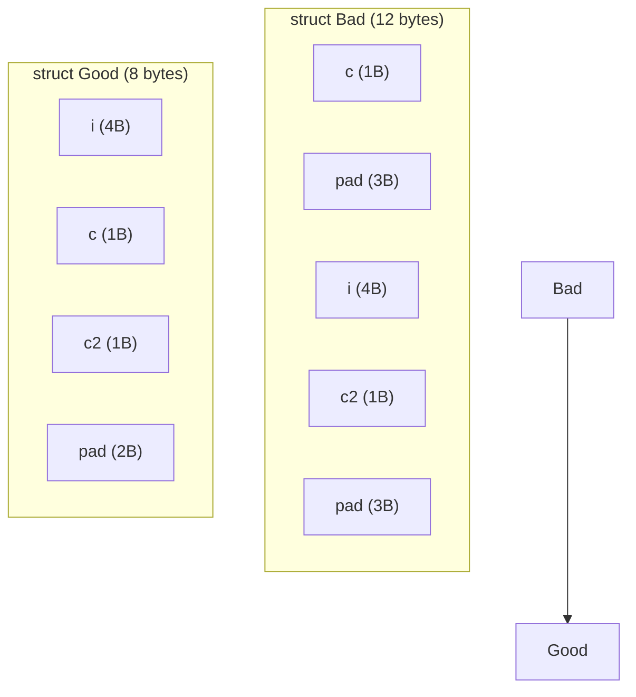

# Structs in C++

## Why This Matters

A `struct` is the most direct way in C++ to bundle several related variables into a single named unit. Whether you are modeling a 2D point, a network packet header, a database record, or a configuration block parsed from JSON, the `struct` is the workhorse you reach for first. Without it you would be forced to thread long parameter lists through every function, you would have no clean way to return multiple values, and you would have no foundation on which to build classes, variant types, or container element types.

Mastering structs means mastering four intertwined concerns: **type design** (what fields, what access level, what invariants), **memory layout** (alignment, padding, sizeof), **initialization** (aggregate, designated, brace-elision), and **interaction with functions** (by value, by reference, by pointer, with `const`). Each of these is a foot-gun if ignored and a powerful lever if understood.

## Background

The `struct` keyword arrived in C in the early 1970s as a way to define a *record* — a fixed-size bundle of named members laid out in memory in declaration order. C++ inherited the keyword verbatim but generalized it: in C++ a `struct` can have member functions, constructors, destructors, base classes, access specifiers, and templates. In fact, the only language-level difference between `struct` and `class` in C++ is the **default member access specifier** (`public` for `struct`, `private` for `class`) and the **default base-class access** (again `public` for `struct`, `private` for `class`).

That single sentence is one of the most-tested facts in C++ interviews, but it is the *convention* that matters more in real code: use `struct` for plain passive data aggregates with no invariants, and `class` for types with encapsulated state and behavior. Following this convention makes your codebase easier to read because the keyword itself signals intent.

## Main Content

### 1. Defining a Struct

A struct definition introduces a new type. The members are laid out in memory in the order they are declared.

```cpp
struct Point {
    double x;   // member 1
    double y;   // member 2
};              // semicolon is mandatory!
```

The trailing semicolon after the closing brace is a common source of beginner errors — it is required because the grammar allows you to declare variables immediately after the definition:

```cpp
struct Point { double x; double y; } origin {0.0, 0.0}, unit {1.0, 1.0};
```

Most style guides discourage that idiom; declare the type and the variables separately.

### 2. Member Variables and Member Functions

C++ structs can hold both data and behavior:

```cpp
#include <iostream>
#include <cmath>

struct Point {
    double x;
    double y;

    double distance_to_origin() const {
        return std::sqrt(x*x + y*y);
    }

    void translate(double dx, double dy) {
        x += dx;
        y += dy;
    }
};

int main() {
    Point p{3.0, 4.0};
    std::cout << p.distance_to_origin() << '\n';  // 5
    p.translate(-1.0, -1.0);
    std::cout << p.x << ", " << p.y << '\n';      // 2, 3
}
```

The `const` after the parameter list on `distance_to_origin` promises that calling this member function does not modify the struct. Mark every member function that does not mutate state as `const` — it is the foundation of *const correctness* (see [[8. Constant Pointers and Pointers to Constants]]).

### 3. struct vs class — The Real Story

```cpp
struct A { int x; };          // x is public
class  B { int x; };          // x is private
class  C { public: int x; };  // x is public, identical to A in behavior
```

Default inheritance follows the same rule:

```cpp
struct D : A {};              // inheritance is public
class  E : A {};              // inheritance is private (rarely useful)
```

In practice, always write `public:` / `private:` explicitly when it matters. Relying on defaults is fine for the trivial cases above.

> [!tip] Convention
> Use `struct` for **Plain Old Data (POD)** — aggregates where every member is public, there is no invariant, and the type behaves like a bag of values. Use `class` for types with private state, invariants, and a meaningful interface. This convention is so widely followed that the C++ Core Guidelines (C.2) codify it.

### 4. Aggregate Initialization

If your struct has no user-declared constructors, no private/protected non-static data members, no virtual functions, and no base classes, it is an *aggregate* and can be initialized with braces:

```cpp
struct Point { double x; double y; };

Point p1{1.0, 2.0};          // direct list init
Point p2 = {3.0, 4.0};       // copy list init
Point p3{};                   // zero-init: {0.0, 0.0}
Point p4{1.0};                // {1.0, 0.0} — remaining members zero-init
```

Narrowing conversions (e.g. `Point p{1.5, 2}` where `2` is an `int`) are ill-formed with braces — a feature designed to catch typos.

### 5. Designated Initializers (C++20)

C++20 adopted the designated initializer syntax from C99, with one important restriction: **designators must appear in declaration order** in C++ (unlike C, which allows any order).

```cpp
struct Color { uint8_t r, g, b, a; };

Color c{.r = 255, .g = 128, .b = 0, .a = 255};   // OK
Color d{.r = 255, .a = 255};                      // OK — g, b zero-init
// Color e{.a = 255, .r = 255};                   // ERROR: out of order in C++
```

Designated initializers make code self-documenting and prevent the classic mistake of swapping two fields of the same type.

### 6. Padding and Alignment

The compiler is allowed (and usually required by ABI rules) to insert *padding* bytes between members so that each member is naturally aligned. Misaligned access is undefined behavior on some architectures and slow on others.

```cpp
struct Bad {
    char  c;   // 1 byte
    int   i;   // 4 bytes
    char  c2;  // 1 byte
};             // sizeof == 12 (3 bytes pad after c, 3 bytes pad after c2)

struct Good {
    int   i;   // 4 bytes
    char  c;   // 1 byte
    char  c2;  // 1 byte
};             // sizeof == 8 (2 bytes pad at end)
```

#### Memory Layout Diagram



#### Rules of thumb
- Sort members by decreasing alignment requirement to minimise padding.
- Use `#pragma pack(1)` or `__attribute__((packed))` only when interfacing with binary formats or hardware; both hurt performance and may cause unaligned access faults.
- Use `static_assert(sizeof(T) == N)` if a struct must match a wire format.

### 7. Passing Structs to Functions

There are three idiomatic ways to pass a struct into a function:

```cpp
void by_value(Point p);           // copies the struct — fine for small PODs
void by_ref(Point& p);            // alias — can modify the caller's object
void by_cref(const Point& p);     // const alias — read-only, no copy
void by_ptr(Point* p);            // pointer — can be nullptr, can modify
```

**Default rule**: pass by `const T&` for any struct larger than two words (16 bytes on x86-64). For trivially-copyable types that fit in a register (e.g. `Point` of two `double`s, 16 bytes), pass-by-value is competitive or faster because the value goes through registers instead of memory. See [[4. Pointers Inside Functions]] and the Functions chapter for the full decision tree.

### 8. Operator Overloading Intro

Structs frequently benefit from overloaded operators. The canonical pattern is to define `==` and `<=>` as friends so implicit conversions on both sides work symmetrically:

```cpp
#include <compare>

struct Point {
    double x, y;

    friend bool operator==(const Point& a, const Point& b) {
        return a.x == b.x && a.y == b.y;
    }
    friend auto operator<=>(const Point& a, const Point& b) = default;
};
```

The `= default` for `<=>` (C++20) gives you lexicographic ordering for free. Combining `==` and `<=>` lets you use `Point` in ordered containers (`std::map`, `std::set`) and in algorithms that need ordering.

### 9. When to Use struct vs class

| Use `struct` when...                              | Use `class` when...                                          |
|---------------------------------------------------|--------------------------------------------------------------|
| All data members are public                       | State must be private with controlled accessors              |
| There is no invariant — any combination of values is valid | The type maintains invariants (e.g. a `Date` rejects Feb 30) |
| It is used as a value type with value semantics    | It owns resources (RAII handle)                              |
| You want POD/aggregate semantics for serialization | You need virtual functions, polymorphism, or complex lifetimes |
| It is a tag type or trait struct                   | It is an abstraction with a non-trivial interface            |

## Common Pitfalls

> [!warning] Missing semicolon after definition
> `struct Foo { int x; }` followed immediately by a function definition produces bewildering parse errors because the compiler thinks you declared a function returning a `Foo`.

> [!warning] Forgetting `const` on getters
> A getter without `const` cannot be called on a `const Foo` instance, which propagates non-constness through your codebase.

> [!warning] Mixing designated initializer order
> C++ requires designated initializers in declaration order; C does not. Code that compiles as C may fail as C++.

> [!warning] Surprising padding
> Reordering members can silently change `sizeof` and break binary compatibility. Lock down `sizeof` with a `static_assert` if your struct is serialized or shared with C code.

> [!warning] Returning references to members
> Returning `T&` to a member from a member function breaks encapsulation and can produce dangling references if the struct is destroyed.

> [!warning] Aggregate initialization breaks when you add a constructor
> As soon as you write any constructor, the type is no longer an aggregate and brace-init will call that constructor instead of field-by-field initialization.

## Tips and Tricks

- Use `[[no_unique_address]]` (C++20) on empty member types to elide their storage.
- Use `static_assert(std::is_trivially_copyable_v<T>)` to keep a struct suitable for `memcpy`, IPC, and binary protocols.
- Use `std::tuple` *only* when you genuinely want anonymous, positional members; named structs are far more readable.
- For configuration structs, prefer `std::optional<T>` members over sentinel values like `-1` or `nullptr`.
- For binary layouts, prefer `#pragma pack` paired with explicit `static_assert(sizeof(T) == ...)` rather than relying on the compiler's default padding.
- Use the C++20 spaceship operator `<=>` instead of writing six comparison operators by hand.
- Make your struct `constexpr`-friendly where possible — many standard algorithms work at compile time if your types allow it.

## Active Recall

1. What is the *only* technical difference between `struct` and `class` in C++?
2. Under what conditions is a type an *aggregate*?
3. What is the size of `struct { char c; int i; char c2; }` on a typical x86-64 ABI, and why?
4. Why must C++ designated initializers appear in declaration order while C allows any order?
5. When should you pass a struct by value rather than `const T&`?
6. Why are overloaded `operator==` and `operator<=>` typically declared as `friend` free functions instead of members?
7. What happens to aggregate initialization when you add a user-declared constructor?
8. What does `static_assert(sizeof(T) == N)` protect against?
9. Why is `int* p1, p2;` only one pointer, and how does this relate to struct member declarations?
10. Name two situations in which you would use `#pragma pack(1)`.

## Next Steps

- Continue to [[2. Unions]] to see how C++ lets multiple members share the same storage — and why this is dangerous in modern code.
- Then read [[3. Bit-Fields]] to learn how to pack flag fields into a fixed-width integer.
- For how pointers interact with structs, see [[10. Pointers to Structs]] in Chapter 6.
- For modern alternatives to hand-rolled aggregates, see the Modern C++ chapter on structured bindings and `std::tuple`.
- For passing patterns, see [[4. Pointers Inside Functions]] and the Functions chapter.
