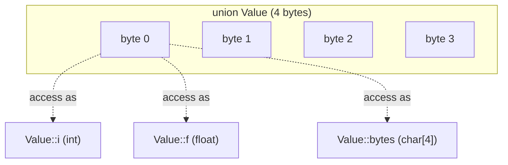

# Unions in C++

## Why This Matters

A `union` is a special kind of aggregate in which **all non-static data members share the same storage**. The compiler allocates only enough bytes to hold the *largest* member, and writing to one member reinterprets the same bytes as any other member. Unions exist for two reasons: memory-constrained environments where every byte counts, and *type punning* — the deliberate reinterpretation of one type's bit pattern as another.

In modern C++, unions are almost always the wrong tool. They bypass the type system, defeat the optimizer, and have subtle, dangerous rules when members are non-trivial. The C++17 standard gave us `std::variant`, which provides a safe, type-checked, RAII-friendly alternative for "value of one of these types" scenarios. Understanding unions is still important: they appear in legacy code, in ABIs, in compiler intrinsics, and inside `std::variant` itself.

## Background

Unions were inherited from C, where they were used for three main purposes:

1. **Saving memory** in fixed-size records, e.g. a CPU register file where each slot could be a 32-bit int, a 32-bit float, or a pair of 16-bit shorts.
2. **Type punning** — reinterpreting the bits of one type as another (e.g. inspecting the IEEE-754 representation of a `float` by reading it as `uint32_t`).
3. **Tagged unions** — combining a `union` with an external `enum` tag that records which member is currently active.

C++ made unions more powerful (you can have member functions, access specifiers, even static members) but also more dangerous: a union with a non-trivial member type (one that has a user-defined constructor or destructor) requires the programmer to manage the active member manually. There is no automatic destructor call, no automatic constructor call, and switching active members without explicit placement `new`/manual destructor calls is undefined behavior.

## Main Content

### 1. Defining and Using a Union

```cpp
union Value {
    int    i;
    float  f;
    char   bytes[4];
};

Value v;
v.i = 0x40490FDB;               // write as int
std::cout << v.f << '\n';       // read as float — prints 3.14159... (implementation-defined)
std::cout << static_cast<int>(v.bytes[0]) << '\n'; // first byte (endianness-dependent)
```

The size of `Value` is `max(sizeof(int), sizeof(float), sizeof(char[4]))` — usually 4 bytes — plus any trailing padding required by alignment.

#### Memory Layout Diagram



All three access paths begin at the same address. Writing through one immediately invalidates the others' "logical" contents.

### 2. The "Active Member" Rule

The C++ standard says reading from a non-active member of a union is **undefined behavior** with one narrow exception (in C++20, reading the common subsequence of two standard-layout structs that share a common prefix — sometimes called the "common initial sequence" rule). Writing to a member makes it the active one and invalidates all others.

```cpp
union U { int i; std::string s; };  // non-trivial member: std::string
U u;
u.s = "hello";                       // OK — but you must manually destroy s later
u.i = 42;                            // LEAK: std::string destructor never called
```

To switch safely between non-trivial members you must manually call the destructor of the currently active member and use placement `new` to construct the next one:

```cpp
#include <string>
#include <new>

union U {
    int         i;
    std::string s;

    U() : i(0) {}                                  // must define default ctor
    ~U() {}                                        // must NOT destroy either member
};

int main() {
    U u;
    new (&u.s) std::string("hello");               // placement new
    // ... use u.s ...
    u.s.~basic_string();                           // manual destructor
    u.i = 42;                                      // safe: s is destroyed
}
```

This is the kind of code that `std::variant` exists to make unnecessary.

### 3. Anonymous Unions

An anonymous union is one declared without a name; its members are injected directly into the enclosing scope:

```cpp
struct Packet {
    enum class Kind { INT, FLOAT } kind;
    union {
        int   i;
        float f;
    };                       // anonymous; members accessed as Packet::i / Packet::f
};

Packet p;
p.kind = Packet::Kind::FLOAT;
p.f    = 3.14f;
```

Anonymous unions are convenient but they hide the "which member is active?" question behind syntactic sugar. Always pair them with an explicit tag.

### 4. Tagged Unions (The Pre-variant Pattern)

Before C++17, the only safe way to use a union was to wrap it in a struct that also carries an enum tag:

```cpp
struct Value {
    enum class Tag { INT, FLOAT, STRING } tag;
    union {
        int          i;
        float        f;
        const char*  s;
    };

    static Value make_int(int x)   { return {Tag::INT,    {x},    }; }
    static Value make_float(float x){ return {Tag::FLOAT,  {.f=x}, }; }
    // ...
};
```

This pattern is error-prone: every access must check the tag, and there is no compiler help if you forget. Modern C++ uses `std::variant`.

### 5. `std::variant` — The Safe Alternative

```cpp
#include <variant>
#include <string>
#include <iostream>

std::variant<int, float, std::string> v = 42;

std::visit([](auto&& x) {
    std::cout << "value: " << x << '\n';
}, v);

v = std::string("hello");   // OK — std::string destructor called automatically
v = 3.14f;                   // OK — switches active type safely
```

`std::variant` provides:
- **Type safety**: index-based access throws `std::bad_variant_access` on type mismatch.
- **RAII**: non-trivial members are constructed and destroyed automatically.
- **Visitation**: `std::visit` enforces handling every alternative.
- **Value semantics**: copy, move, and assignment all work correctly.

The only memory overhead is a small index (typically one byte) tracking the active alternative.

### 6. Type Punning — When Unions Are Actually Useful

The C++17 way to do safe type punning is `std::bit_cast` (C++20), which is `constexpr` and well-defined:

```cpp
#include <bit>
#include <cstdint>

float  pi  = 3.14159265f;
uint32_t bits = std::bit_cast<uint32_t>(pi);   // well-defined in C++20
```

Before C++20, the only *standard-conforming* way to type-pun was `std::memcpy` from one type into another of the same size:

```cpp
uint32_t bits;
std::memcpy(&bits, &pi, sizeof(bits));
```

Reading a union member other than the active one is, strictly speaking, undefined behavior in standard C++, although every major compiler documents it as an extension. Use `std::bit_cast` in new code; reserve the union trick for legacy compatibility.

### 7. Unions Inside ABIs and Hardware Register Files

Unions survive in places where memory layout is fixed by an external specification:
- **Hardware register files** — a 32-bit MMIO register that may be interpreted as raw bits, a flag bit-field, or a 4-byte sequence.
- **Tagged-pointer tricks** — exploiting alignment bits to embed a tag inside a pointer (used by every modern JavaScript engine and by the Linux kernel).
- **ABI-stable unions** like `sockaddr` in POSIX, which is a tagged union over `sockaddr_in`, `sockaddr_in6`, `sockaddr_un`, etc.

In all these cases the union is not "choosing between high-level types" but "viewing the same bytes through different lenses".

### 8. Comparison Table

| Feature                  | Raw `union`                       | `std::variant`                          |
|--------------------------|-----------------------------------|-----------------------------------------|
| Memory overhead          | None                              | Small index (typically 1 byte)          |
| Tracks active member     | No                                | Yes                                     |
| Calls destructors        | No (manual for non-trivial)       | Yes, automatically                      |
| Compile-time alternatives| Fixed                             | Fixed (template parameter pack)         |
| Pattern matching         | Manual tag checks                 | `std::visit`, `std::get_if`             |
| Type-safe access         | No                                | Yes (throws on mismatch)                |
| C++ standard             | C++98 (inherited from C)          | C++17                                   |
| Recommended for new code | Hardware / ABI / tag pointers only| Default for "one of N types"            |

## Common Pitfalls

> [!warning] Reading a non-active member is UB
> In strict C++, reading a union member that was not the last one written is undefined behavior. Compilers may exploit this for optimization in surprising ways.

> [!warning] Non-trivial members need manual lifetime management
> A union with a `std::string` member has no default constructor and no destructor automatically generated. You must provide both, and you must use placement `new` and explicit destructor calls.

> [!warning] Endianness bites
> Reading `bytes[0]` of a `union { int i; char b[4]; }` gives a different result on little-endian (x86) vs big-endian (some ARM, older PowerPC) hardware. Portable code must not depend on byte order.

> [!warning] Trap representations
> Some bit patterns are "trap representations" for certain types on certain hardware (e.g. signaling NaNs for floats, negative zero for signed integers in C). Constructing one through a union can crash the program.

> [!warning] Anonymous unions in non-local scope
> Anonymous unions at namespace scope must be `static` or in an unnamed namespace, otherwise you will get linker errors due to external linkage.

> [!warning] Don't try to make a union polymorphic
> Unions cannot have virtual functions or base classes. If you need polymorphism, use `std::variant<std::unique_ptr<Base>, ...>` or just inheritance.

> [!warning] Initialization pitfalls
> `union U { int i; std::string s; }; U u;` does not default-construct either member. You must provide a constructor that explicitly initializes one.

## Tips and Tricks

- Use `std::variant` for *any* high-level "one of these types" value in new code.
- Use `std::bit_cast` (C++20) for type punning — it is `constexpr`, well-defined, and the optimizer reduces it to a register move.
- If you must use a union for type punning in pre-C++20 code, prefer `std::memcpy` — it is well-defined and just as fast.
- For tagged unions in C-style ABIs, always pair the union with an explicit `enum` tag and validate the tag before every access.
- Keep `union` members the same size when possible — that prevents "active member is the small one, but you read the big one and go off the end" bugs.
- Use anonymous unions inside structs to model register files concisely, paired with a `static_assert(sizeof(Reg) == 4)`.
- If a union must hold non-trivial members, wrap it in a class that owns the lifetime explicitly — this is essentially what `std::variant` does internally.
- Remember that `sizeof(union)` is the size of its largest member plus alignment padding, not the sum of all members.

## Active Recall

1. What is the defining property of a `union`?
2. What does `sizeof(union { int i; double d; char c; })` evaluate to on a typical x86-64 system?
3. Why is reading a non-active union member undefined behavior in standard C++?
4. What two extra steps are required when a union contains a non-trivial member like `std::string`?
5. What is an anonymous union, and what is its scope rule?
6. Name three places where unions are still the right tool in modern C++.
7. What is the C++20 replacement for the union-based type-punning idiom?
8. Why is `std::variant` strictly safer than a hand-rolled tagged union?
9. What does `std::visit` do, and why is it better than a switch on a tag enum?
10. True or false: a union can have virtual functions and base classes.

## Next Steps

- Continue to [[3. Bit-Fields]] to see how C++ lets you specify the bit width of struct members.
- For the modern, safe alternative to hand-rolled unions, see the Modern C++ chapter on `std::variant` and `std::visit`.
- For type punning in constexpr contexts, see the chapter on `std::bit_cast` and `<bit>`.
- For how unions appear in C-style ABIs (e.g. `sockaddr`), see the Networking chapter.
