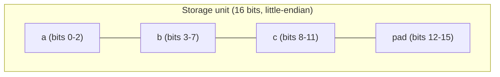

# Bit-Fields in C++

## Why This Matters

A bit-field is a struct or class member declared with an explicit width in bits: `unsigned int flag : 1;`. The compiler packs multiple bit-fields into a single storage unit so that a struct of, say, 32 boolean flags occupies one `int` rather than 32 bytes. Bit-fields appear in hardware register definitions, network protocol headers, file format magic blocks, and anywhere a binary layout specifies "the next 3 bits mean X, the next 5 bits mean Y".

Bit-fields are simultaneously one of the most useful features in C++ for low-level work and one of the most *dangerous*, because almost everything about them — bit ordering, padding, signedness of plain `int` fields, and whether they can straddle storage unit boundaries — is **implementation-defined**. Code that depends on bit-field layout is not portable, not always faster than manually masked integers, and often harder to debug. This note explains when bit-fields are appropriate, how they work, and what to use instead.

## Background

Bit-fields were introduced in K&R C to model the bit-packed structures common in operating-system code and device drivers. The classic example is the Unix `stat` file-mode field, which packs read/write/execute permissions for user, group, and other into 9 bits plus set-uid/set-gid/sticky bits.

C++ inherited bit-fields unchanged. The standard deliberately leaves the layout to the implementation so that compilers can match the host ABI's bit ordering. The result is that the *same source code* produces different bit layouts on big-endian vs little-endian hardware, and sometimes even between compilers on the same hardware.

## Main Content

### 1. Syntax

A bit-field is declared as `type name : width;` where `width` is a non-negative constant expression.

```cpp
struct FileMode {
    unsigned int other_execute : 1;
    unsigned int other_write   : 1;
    unsigned int other_read    : 1;
    unsigned int group_execute : 1;
    unsigned int group_write   : 1;
    unsigned int group_read    : 1;
    unsigned int user_execute  : 1;
    unsigned int user_write    : 1;
    unsigned int user_read     : 1;
    unsigned int sticky_bit    : 1;
    unsigned int set_gid       : 1;
    unsigned int set_uid       : 1;
};
// sizeof(FileMode) is typically 4 bytes (one unsigned int)
```

Each member is now accessed by name as if it were a normal member:

```cpp
FileMode m{};
m.user_read  = 1;
m.user_write = 1;
m.user_exec  = 0;
```

The compiler emits the necessary shift and mask instructions for you.

### 2. Width Constraints

- A bit-field's width must be a non-negative integer constant expression.
- A width of 0 has special meaning: it forces the *next* bit-field to begin at the start of the next storage unit (i.e. it acts as an alignment boundary, not as a field).
- A width larger than the underlying type's bit width is ill-formed.
- A bit-field of type `bool` may have any width, but a `bool : 1` field can only store the values 0 and 1.

```cpp
struct Packed {
    unsigned int a : 3;     // 0..7
    unsigned int   : 0;     // padding: next field starts a new storage unit
    unsigned int b : 4;     // 0..15
};
```

### 3. Signedness and Subtleties

Bit-fields may be declared `int`, `unsigned int`, `bool`, or (since C++11) any "scalar" type such as `std::int8_t` or `enum`. Plain `int` bit-fields are **implementation-defined as signed or unsigned** — never write `int flag : 1` if you care about portability, because a signed 1-bit field can only store the values `0` and `-1`, never `1`. Always write `unsigned int` (or better, an explicit-width type from `<cstdint>`).

```cpp
struct Danger {
    int flag : 1;          // can be 0 or -1 on systems where int is signed!
    flag = 1;              // implementation-defined: stores -1 or 1
};
```

### 4. Implementation-Defined Behavior

The C++ standard does not specify:
- **Bit order within a storage unit.** Are the first-declared fields in the low-order bits or the high-order bits? On x86 the convention is low-to-high; on some PowerPC targets it is high-to-low.
- **Whether bit-fields can straddle storage-unit boundaries.** Some compilers pack them tightly across unit boundaries; others start a new unit.
- **The alignment of the containing struct.**
- **The signedness of plain `int` bit-fields** (as above).

What this means in practice: **never serialize a struct of bit-fields by `memcpy`-ing it to a byte stream and shipping it across a network** unless you have verified the layout with `static_assert` and byte-by-byte inspection on every target platform.

### 5. Bit-Field Memory Layout Diagram

The diagram below shows one common (little-endian x86) layout for a `struct { unsigned a:3; unsigned b:5; unsigned c:4; }` packed into a 16-bit storage unit.



On a big-endian target the same declaration might lay out `c` first (in the high bits) and `a` last. Code that reads individual bytes via type punning will see different bytes on different machines.

### 6. Use Cases Where Bit-Fields Are Justified

1. **Hardware register definitions.** MMIO registers are fixed by the silicon vendor's datasheet, which is itself fixed by the host CPU's endianness and the bus protocol. Bit-fields give readable, named access to register fields.
2. **In-memory flags where size matters more than portability.** A struct that lives only inside one process on one platform can use bit-fields to shrink cache footprint.
3. **C ABI compatibility.** If a C library declares a struct with bit-fields, you must mirror it in C++ exactly.
4. **Static tables.** When you have thousands of records each consuming many flag bytes, bit-fields can materially reduce memory pressure.

### 7. When Bit-Fields Hurt Performance

Bit-fields are *not* free at runtime. Reading or writing a 1-bit field on x86 typically requires:
1. A load of the containing word (which may cross a cache line).
2. A shift and a mask to extract or modify the field.
3. A compare-and-swap or store if the field is shared between threads (non-atomic).

Worse, **adjacent bit-fields in the same storage unit are not separately addressable and not separately lockable**. Two threads writing to two different bit-fields in the same `unsigned int` cause a data race even though they are "different variables". This is a frequent source of subtle concurrency bugs.

For these reasons, performance-sensitive code often prefers:
- `std::bitset<N>` for collections of independent flags (provides `operator[]`, `test`, `set`, `reset`, `flip`, and is more readable).
- Manual masking with `constexpr` constants for performance-critical inner loops (gives the optimizer maximum freedom).
- One `bool` per `unsigned char` for cache-line-sensitive atomics.

### 8. Better Alternative: `std::bitset`

```cpp
#include <bitset>
#include <iostream>

std::bitset<32> flags;
flags[0] = true;
flags.set(3);
std::cout << flags.count() << '\n';   // 2
std::cout << flags.to_string() << '\n';
```

`std::bitset` is portable, supports bitwise operations as a whole, has a clean API, and is just as memory-efficient as a hand-rolled bit-field struct.

### 9. Better Alternative: Manual Masking

When you need maximum control, define explicit constants and shift yourself:

```cpp
#include <cstdint>

constexpr uint32_t MODE_USER_READ  = 1u << 8;
constexpr uint32_t MODE_USER_WRITE = 1u << 7;
constexpr uint32_t MODE_USER_EXEC  = 1u << 6;

inline bool can_read(uint32_t mode)  { return mode & MODE_USER_READ; }
inline void grant_read(uint32_t& m)  { m |= MODE_USER_READ; }
inline void revoke_read(uint32_t& m) { m &= ~MODE_USER_READ; }
```

Manual masking is more verbose but fully portable, fully testable, and lets you use atomic operations like `std::atomic<uint32_t>::fetch_or` on a single word — which is impossible with a bit-field.

### 10. A Bit-Field Wrapped Safely

If you must use bit-fields for ABI reasons, wrap them in a struct with explicit invariants, atomic access where needed, and a `static_assert` on the total size:

```cpp
#include <cstdint>
#include <atomic>

struct RegStatus {
    std::atomic<uint32_t> raw;

    bool is_ready()  const noexcept { return raw.load() & 0x1; }
    bool is_error()  const noexcept { return raw.load() & 0x2; }
    void set_ready() noexcept { raw.fetch_or(0x1); }
};
static_assert(sizeof(RegStatus) == 4);
```

This pattern is *better* than a raw bit-field because each flag is an atomic operation, the layout is portable across platforms (you depend only on integer bit positions, not on compiler bit-field packing), and the field offsets are documented in code.

### 11. Comparison Table

| Approach                | Portable? | Readable? | Atomic-friendly? | Memory-efficient? | Notes                              |
|-------------------------|-----------|-----------|------------------|-------------------|------------------------------------|
| Raw bit-fields          | No        | Yes       | No               | Yes               | Only for hardware/ABI              |
| `std::bitset<N>`        | Yes       | Yes       | No (use mutex)   | Yes               | Default for in-process flags       |
| Manual masks on int     | Yes       | OK        | Yes (atomics)    | Yes               | Best for perf-critical code        |
| `bool` per byte         | Yes       | Yes       | Yes              | No                | Best for atomics-heavy code        |
| `std::vector<bool>`     | Yes       | Yes       | No               | Yes               | Avoid — proxy-reference quirks     |

## Common Pitfalls

> [!warning] Plain `int` bit-fields are implementation-defined signed or unsigned
> `int flag : 1` can store only `0` and `-1` on implementations where `int` is signed. Always use `unsigned int` or an explicit-width unsigned type.

> [!warning] Bit-fields are non-portable across endianness
> The same source produces different byte layouts on big-endian vs little-endian targets. Never `memcpy` a bit-field struct across the wire without a documented byte layout.

> [!warning] Bit-fields are not separately addressable
> You cannot take the address `&s.flag` of a bit-field. Pointers and references to bit-fields do not exist.

> [!warning] Concurrent access to adjacent bit-fields is a data race
> Two threads writing to *different* bit-fields in the same storage unit race. Use atomics on the whole word instead.

> [!warning] Width 0 doesn't mean "zero-width field"
> `unsigned int : 0;` is a directive to align the next field to a new storage unit. It is not a field.

> [!warning] `sizeof` and `alignof` can surprise you
> Compilers may add padding to align the storage unit. Verify with `static_assert`.

> [!warning] Signed bit-fields overflow is UB
> Storing a value that does not fit in the declared width is implementation-defined for unsigned fields and undefined behavior for signed fields.

> [!warning] Mixing bit-field types
> A struct with `bool : 1` followed by `unsigned int : 5` may not pack the way you expect; some compilers reset to a new storage unit when the type changes.

## Tips and Tricks

- Prefer `std::bitset` for in-process flags and manual masks for portable binary layouts.
- Always declare bit-fields as `unsigned int` or an explicit-width unsigned type from `<cstdint>`.
- Pair every bit-field struct used in a binary protocol with a `static_assert(sizeof(S) == N)` and a `static_assert(alignof(S) == A)`.
- For ABI-stable register definitions, also write a unit test that constructs known field combinations and checks the raw `unsigned int` value byte-by-byte.
- Use `#pragma pack` together with bit-fields only when you have a written spec for the byte layout — and pair it with `static_assert`.
- Avoid `std::vector<bool>` — it is a packed specialization that returns proxy references, breaking most generic code that expects `bool&`.
- For atomic flag management, prefer `std::atomic<uint32_t>` with manual masks over bit-fields.
- When migrating legacy C bit-field structs to C++, keep the layout identical to maintain ABI compatibility.

## Active Recall

1. What does the `: N` suffix on a struct member declaration mean?
2. What is the special meaning of `unsigned int : 0;`?
3. Why is `int flag : 1;` dangerous?
4. Is the byte-level layout of a bit-field struct portable across endianness? Why or why not?
5. Can you take the address of a bit-field member? Why not?
6. Two threads write to two *different* bit-fields in the same `unsigned int`. Is this safe?
7. Name two standard-library alternatives to bit-fields for in-process flag management.
8. Why does `std::vector<bool>` cause subtle bugs in generic code?
9. What is the size of `struct { unsigned a : 3; unsigned b : 5; }` on a typical x86-64 ABI?
10. When *is* a raw bit-field the right choice?

## Next Steps

- This concludes Chapter 5. Read [[1. Introduction to Pointers]] in Chapter 6 to begin mastering the most powerful — and most dangerous — feature in C++.
- For more on cache-friendly flag storage and atomic flag manipulation, see the Performance Optimization and Concurrency chapters.
- For the modern C++ answer to "set of flags", see `std::bitset` and `std::bit_flags` discussions in the Modern C++ chapter.
- For hardware register programming, see the Embedded C++ sections in the Advanced C++ Topics chapter.
