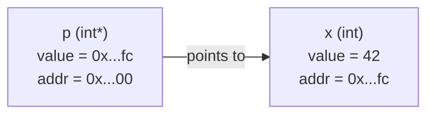

# Introduction to Pointers

## Why This Matters

A pointer is a variable whose value is the memory address of another object. That single sentence unlocks the entire low-level power of C++: dynamic memory allocation, polymorphism, pointer-based data structures (linked lists, trees, graphs), zero-copy string manipulation, callback dispatch, hardware register access, and interop with C. Mastering pointers is non-negotiable for any C++ programmer — and the cost of not mastering them is undefined behavior, security vulnerabilities, and crashes that appear only under load.

Modern C++ reduces the *number* of raw pointers you must write by hand by providing references, smart pointers (`std::unique_ptr`, `std::shared_ptr`), containers (`std::vector`, `std::string`), and `std::function`. But pointers are still the *substrate* these abstractions are built on. When an abstraction leaks — when you must debug a use-after-free, walk a stack trace, or read an ABI specification — pointers are what you fall back to.

This chapter covers everything from the basic address-of operator through function pointers and pointers to structs. This first note lays the foundation: what a pointer is, why it exists, how to declare and initialize one, the meaning of `nullptr`, and why pointer types matter.

## Background

Memory in a running C++ program is a flat array of bytes, each addressed by a unique integer. When you write `int x = 42;`, the compiler reserves four consecutive bytes somewhere in your process's address space and stores `42` there. The address of `x` is the address of the first of those four bytes.

A pointer is just a variable that holds such an address. The size of a pointer is fixed by the machine architecture — 8 bytes (64 bits) on x86-64, ARM64, and RISC-V 64; 4 bytes (32 bits) on older or embedded targets. The size does not depend on what type the pointer points to: `char*`, `int*`, `std::string*` are all 8 bytes on a 64-bit machine.

Pointers were imported from C, where they were essential for:
- Passing large structs to functions without copying.
- Letting a function modify its caller's variables.
- Building dynamic data structures whose size is not known at compile time.
- Expressing the result of `malloc`, which returns a `void*` to a block of raw bytes.

C++ adds references (a safer alias mechanism), smart pointers (RAII ownership), and templates (which often eliminate the need for `void*` polymorphism), but raw pointers remain the lingua franca of low-level programming.

## Main Content

### 1. The Mental Model: Variable, Address, Pointer

```cpp
int x = 42;
int* p = &x;       // p holds the address of x
```

After this code runs:

- `x` is the name we give to a 4-byte region in memory that currently contains the value `42`.
- `&x` is the address of that region — for example, `0x7ffdf6a2c0fc`.
- `p` is a separate 8-byte region (its own variable) whose stored value is that address.
- `&p` is the address of `p` itself — a different memory location.

#### Relationship Diagram



You can have as many levels of indirection as you want:

```cpp
int   x  = 42;
int*  p1 = &x;     // points to x
int** p2 = &p1;    // points to p1
int***p3 = &p2;    // points to p2
```

Each level adds another `*` to the type and another `&` to take its address. In practice, two levels (`T**`) is rare, three or more is almost always a code smell.

### 2. Declaring a Pointer

```cpp
int* p;            // p is a pointer to int (uninitialized!)
int* q = nullptr;  // q is a pointer to int, explicitly null
int* r = &x;       // r is a pointer to int, initialized to address of x
```

The asterisk can be written on either side of the space:

```cpp
int* p;            // "type-centric" — emphasizes type is int*
int *p;            // "variable-centric" — emphasizes *p is an int
```

Both compile to identical code. The C++ Core Guidelines recommend `int* p` because it makes the type obvious, but warn about the multiple-declaration trap: `int* p1, p2;` declares one pointer and one int. The safest policy is **one declaration per line** — see [[7. Reading Pointer Declarations]].

### 3. The Address-Of Operator `&`

`&` applied to an lvalue yields the address of that lvalue:

```cpp
int x = 42;
int* p = &x;             // address of x
int* px = &x;            // another pointer to x
// int* bad = &42;       // ERROR: 42 is not an lvalue
// int* bad = &(x + 1);  // ERROR: x + 1 is not an lvalue
```

You can take the address of any object that has a stable memory location: variables, struct members, array elements, dereferenced pointers, static functions, and (with restrictions) member functions. You cannot take the address of a temporary, a register-only value, or a bit-field.

### 4. The Dereference Operator `*`

`*` applied to a pointer yields the object it points to:

```cpp
int x = 42;
int* p = &x;
std::cout << *p << '\n';   // 42 — reads x through the pointer
*p = 100;                  // writes 100 to x through the pointer
std::cout << x << '\n';    // 100
```

`*p` is an lvalue: it can appear on the left side of an assignment. See [[3. Referencing and Dereferencing]] for the full story.

### 5. Initialization and `nullptr`

An uninitialized pointer contains garbage. Dereferencing it is undefined behavior. **Always initialize pointers**, even if only to `nullptr`:

```cpp
int* p = nullptr;          // the modern, type-safe null pointer
if (p) {                   // false: nullptr converts to false
    std::cout << *p;       // not executed
}
```

`nullptr` was introduced in C++11 as a first-class null pointer literal of type `std::nullptr_t`. Before C++11, C and C++ code used `NULL` (typically defined as `0` or `((void*)0)`) or the integer literal `0`. Both are problematic:

- `NULL` is a macro, so it can collide with your own macros and produces confusing diagnostics.
- `0` and `NULL` are integers, so they participate in surprising overload resolution:

```cpp
void f(int);
void f(char*);
f(0);        // calls f(int) — surprise!
f(nullptr);  // calls f(char*) — what you wanted
```

Always use `nullptr` in new code. Reserve `NULL` and `0` for compatibility with C-style APIs.

### 6. Pointer Types Matter

Pointers are *typed*. `int*` and `char*` are different types even though both occupy 8 bytes on x86-64. The type determines two things:

1. **How many bytes are read or written on dereference.** `*p` where `p` is `int*` reads four bytes; where `p` is `char*` reads one byte.
2. **How pointer arithmetic scales.** `p + 1` for `int* p` advances by `sizeof(int)` bytes; for `char* p` it advances by 1 byte. See [[6. Pointer Arithmetic and Arrays]].

```cpp
int  i = 0x12345678;
char* cp = reinterpret_cast<char*>(&i);     // points to first byte of i
std::cout << static_cast<int>(*cp) << '\n'; // 0x78 on little-endian, 0x12 on big-endian
```

`reinterpret_cast` is the standard way to convert between unrelated pointer types. It is a "trust me, I know what I'm doing" cast — the resulting pointer is only safe to use if you actually do know what you're doing.

### 7. Why Pointers Exist

| Use case                                | Why you need a pointer                                |
|-----------------------------------------|-------------------------------------------------------|
| Dynamic memory                          | `new` returns a pointer to heap-allocated storage.    |
| Polymorphism                            | A `Base*` can point to any derived class instance.    |
| Optional objects                        | `nullptr` represents "no object"; references cannot.   |
| C ABI interop                           | C APIs are pointer-based (`malloc`, `fopen`, `recv`). |
| Building recursive data structures      | Linked lists, trees, and graphs need pointers to refer to children. |
| Hardware access                         | MMIO registers are accessed via raw addresses.        |
| Function callbacks                      | Function pointers store addresses of functions.       |
| Avoiding copies                         | Passing `T*` or `const T*` avoids copying large objects. |
| Iterator-like traversal                 | Pointer arithmetic makes raw arrays iterable.         |

### 8. Pointers vs References — Preview

C++ added references in part to provide a safer alternative to pointers in many of these use cases. A reference is an alias for an existing object — see [[2. Memory Address vs Pointer vs Reference]] for the full comparison. Quick summary:

| Property              | Pointer                | Reference                       |
|-----------------------|------------------------|---------------------------------|
| Can be null           | Yes (`nullptr`)        | No (must be initialized)         |
| Can be reseated       | Yes                    | No                              |
| Requires syntax to use| Yes (`*`, `->`)        | No (used like the original)     |
| Has its own address   | Yes                    | Usually not observable          |
| Supports arithmetic   | Yes                    | No                              |

In modern C++, **prefer references when you can, raw pointers when you must, and smart pointers for ownership.**

### 9. `void*` — The Type-Erased Pointer

`void*` is a pointer with no type information — it remembers *where* but not *what*. It is the type returned by `malloc` and accepted by `free`, and it is the only way to pass a pointer through a C API that does not know the type at compile time.

```cpp
void* raw = std::malloc(64);
int*  pi  = static_cast<int*>(raw);   // must cast back to use the memory
*pi = 42;
std::free(raw);
```

You cannot dereference a `void*` — the compiler does not know how many bytes to read. Always cast back to a typed pointer first. Avoid `void*` in modern C++ code; prefer templates or `std::any` for type erasure.

### 10. The Cost of a Pointer

A pointer is small (8 bytes) and indirection through one is fast — usually one load instruction. But pointers defeat some compiler optimizations:

- The compiler cannot easily prove that two pointers do not alias (i.e. point to the same memory), so it must reload values after every pointer write.
- Pointer chasing (linked lists, trees) is cache-hostile compared to contiguous arrays.

Use pointers where they are necessary, but prefer contiguous storage (`std::vector`) for performance-critical data. See [[6. Pointer Arithmetic and Arrays]] and the Performance chapter.

### 11. A Complete First Example

```cpp
#include <iostream>

int main() {
    int  x  = 42;
    int* p  = &x;

    std::cout << "x       = " << x  << '\n';
    std::cout << "&x      = " << &x << '\n';
    std::cout << "p       = " << p  << '\n';
    std::cout << "&p      = " << &p << '\n';
    std::cout << "*p      = " << *p << '\n';

    *p = 100;
    std::cout << "x now   = " << x  << '\n';     // 100

    int* null_p = nullptr;
    if (null_p == nullptr) {
        std::cout << "null_p is null — safe to check\n";
    }
    // *null_p = 5;  // UNDEFINED BEHAVIOR — would likely segfault
}
```

## Common Pitfalls

> [!warning] Uninitialized pointers
> `int* p;` contains garbage. Always initialize: `int* p = nullptr;` or `int* p = &x;`.

> [!warning] Null pointer dereference
> `*nullptr` is undefined behavior. Always check pointer parameters in functions that accept them.

> [!warning] Dangling pointers
> A pointer to an object that has been destroyed (e.g. a local variable that went out of scope, or a heap object that was `delete`d) is dangling. Reading through it is UB. Use `nullptr` to mark pointers that no longer point to anything, and prefer smart pointers for ownership.

> [!warning] Type mismatches
> `int* p = (int*)&some_double;` reinterprets bits — almost always a bug. Use `reinterpret_cast` only when you have a written reason.

> [!warning] `NULL` vs `nullptr` in overload resolution
> `f(NULL)` may select an `int` overload rather than a pointer overload. Always use `nullptr`.

> [!warning] Pointer to a temporary
> `const char* p = std::string("hi").c_str();` — the temporary `std::string` is destroyed at the end of the statement, leaving `p` dangling.

> [!warning] Comparing unrelated pointers
> `<`, `<=`, `>`, `>=` on pointers to different allocations is unspecified. Only `==` and `!=` are universally safe.

## Tips and Tricks

- **Initialize every pointer** at declaration, even if only to `nullptr`.
- **Set pointers to `nullptr` after `delete`** to make a subsequent accidental dereference crash cleanly instead of corrupting memory.
- **Prefer `nullptr` to `NULL` and `0`** — it is type-safe and unambiguous in overload resolution.
- **Use `[[nodiscard]]` on functions returning raw pointers** to remind callers that they must not ignore the result.
- **Avoid `void*`** in modern code; use templates, `std::any`, or `std::variant`.
- **Profile before chasing pointers**: contiguous `std::vector` is often 10-100x faster than a linked list of pointers due to cache locality.
- **Annotate non-owning pointers** with comments or with GSL `gsl::not_null<T*>` to document and check non-null invariants.
- **Use AddressSanitizer and UndefinedBehaviorSanitizer** during testing — they catch most pointer bugs at runtime with low overhead.
- **Read declarations right-to-left** to decode complex pointer types — see [[7. Reading Pointer Declarations]].

## Active Recall

1. What is a pointer, in one sentence?
2. What does the `&` operator do, and what does the `*` operator do?
3. Why is `nullptr` preferred to `NULL` or `0`?
4. What is the size of a pointer on a 64-bit system? Does it depend on the pointee type?
5. Why must pointers be *typed*? What two things does the type determine?
6. Can you take the address of a bit-field? Of a temporary? Of a register variable?
7. What is `void*`, and what can you not do with it?
8. Why does the compiler have trouble proving two pointers do not alias?
9. What does it mean for a pointer to be "dangling"?
10. Give two reasons to prefer references over pointers in modern C++.

## Next Steps

- Continue to [[2. Memory Address vs Pointer vs Reference]] for a side-by-side comparison that disambiguates the three closely related concepts.
- Then read [[3. Referencing and Dereferencing]] to master the two operators that move between values and pointers.
- For how pointers cross function boundaries, see [[4. Pointers Inside Functions]].
- For raw memory ownership and the heap, see [[5. Dynamic Memory Allocation]].
- For ownership patterns in modern C++, see the Memory Management chapter on smart pointers.
