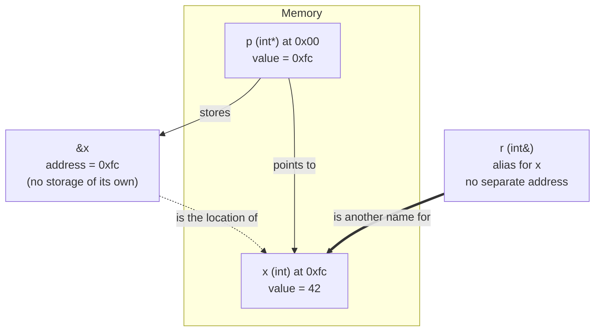

# Memory Address vs Pointer vs Reference

## Why This Matters

These three concepts are constantly confused — even by experienced C++ programmers — because they all involve "where something lives in memory". But they are fundamentally different things:

- A **memory address** is a raw numerical location in RAM. It has no type and no identity of its own; it is a value, not an object.
- A **pointer** is a *variable* that stores a memory address. It has its own address, its own type, can be reassigned, and can be `nullptr`.
- A **reference** is an *alias* for an existing object. It has no observable address of its own, cannot be `nullptr`, cannot be reseated, and is used exactly like the object it names.

Mixing these up leads to bugs like "returning a pointer to a local variable" (you returned an address of something that no longer exists), "comparing a reference's address to a pointer" (they're different things), or "thinking `&ref` gives the reference's address" (it actually gives the referent's address, because references are transparent). This note untangles the three concepts with side-by-side code, a comparison table, and a Mermaid diagram.

## Background

C had only memory addresses and pointers — references did not exist. A C programmer wrote `int* p = &x;` to obtain the address of `x` and stored it in the pointer `p`. Function parameters were declared `int*` to allow modification of caller variables.

C++ introduced references in the late 1980s to support three things C could not do well:
1. **Operator overloading** — `a + b` must work whether `a` and `b` are values, references, or temporaries; references make this uniform.
2. **Copy constructors and assignment operators** — these must take a reference to avoid infinite recursion (taking by value would call the copy constructor, which is what we are trying to define).
3. **Cleaner syntax for in-out parameters** — `swap(int&, int&)` is far more readable than `swap(int*, int*)`.

References are implemented under the hood as pointers in most ABIs, but the language semantics are different and stricter. Treating a reference as "just a pointer" leads to subtle bugs.

## Main Content

### 1. Memory Address — The Raw Number

A memory address is just a number. On a 64-bit system it is a 64-bit unsigned integer typically printed in hexadecimal. You can obtain it with the address-of operator `&`:

```cpp
#include <iostream>

int main() {
    int a = 10;
    std::cout << &a << '\n';    // prints something like 0x7ffd2c3e9abc
}
```

The address itself has no type. The expression `&a` has type `int*` because the compiler attaches the type "pointer to int" to it, but the underlying bit pattern is just a number — and on some platforms you can even convert it to an integer:

```cpp
#include <cstdint>
uintptr_t addr = reinterpret_cast<uintptr_t>(&a);  // portable integer type
```

You cannot *store* a raw address as an address — there is no such variable type. You can only store it inside a pointer or convert it to an integer.

### 2. Pointer — The Variable That Holds an Address

A pointer is a variable. Like any variable it has:
- Its own memory location (`&p` is valid and distinct from `&x`).
- A type (`int*`, `std::string*`, `void*`, ...).
- A value, which is the address of some other object (or `nullptr`).

```cpp
int  x = 10;
int* p = &x;          // p's value is the address of x

std::cout << p  << '\n';   // address of x
std::cout << *p << '\n';   // 10 — value at that address
std::cout << &p << '\n';   // address of p itself (different from &x)
```

Because a pointer is a variable, you can reassign it:

```cpp
int  y = 20;
p = &y;               // p now points to y
*p = 30;              // modifies y
```

You can also set it to `nullptr`:

```cpp
p = nullptr;          // p points to nothing
if (!p) { /* safe to skip dereference */ }
```

### 3. Reference — The Alias

A reference is declared with `&` after the type. It must be initialized when declared, after which it is permanently bound to that object.

```cpp
int   x    = 10;
int&  ref  = x;       // ref is now another name for x

std::cout << ref << '\n';   // 10 — no dereference needed
ref = 20;                   // modifies x
std::cout << x << '\n';     // 20
```

Key properties:

- **No separate address.** Applying `&` to a reference yields the address of the referent. `&ref == &x`.
- **No reseating.** `ref = y;` does *not* make `ref` refer to `y` — it assigns `y`'s value to `x`. There is no syntax in C++ to rebind a reference after initialization.
- **No null.** `int& bad = nullptr;` is ill-formed. A reference must always refer to a valid object.
- **No "reference to reference".** `int& &` is not a valid type (there is reference collapsing in templates, but that is a template-only feature, not a real reference-to-reference).
- **Used directly.** No `*` or `->` is needed.

> [!info] Implementation Note
> In most ABIs a reference is implemented as a pointer that is automatically dereferenced. The compiler reserves storage for the underlying pointer when it cannot prove the reference can be elided. But this is an implementation detail — never write code that depends on a reference occupying 8 bytes.

### 4. Side-by-Side Code Example

```cpp
#include <iostream>

void show_pointer(int* p) {
    std::cout << "  p     = " << p << '\n';
    if (p) std::cout << "  *p    = " << *p << '\n';
    std::cout << "  &p    = " << &p << '\n';
}

void show_reference(const int& r) {
    std::cout << "  r     = " << r << '\n';
    std::cout << "  &r    = " << &r << '\n';   // address of referent
}

int main() {
    int x = 42;
    std::cout << "x = " << x << ", &x = " << &x << "\n\n";

    std::cout << "Pointer:\n";
    int* p = &x;
    show_pointer(p);

    std::cout << "\nReference:\n";
    int& r = x;
    show_reference(r);
}
```

Sample output:

```
x = 42, &x = 0x7ffd2c3e9abc

Pointer:
  p     = 0x7ffd2c3e9abc
  *p    = 42
  &p    = 0x7ffd2c3e9ac0        <- different from &x

Reference:
  r     = 42
  &r    = 0x7ffd2c3e9abc        <- same as &x
```

Notice that:
- The pointer `p` has its own address, distinct from `&x`.
- The reference `r` does not expose a separate address; `&r` is the same as `&x`.

### 5. Three-Way Comparison Diagram



The dotted arrow from the address to `x` is conceptual — addresses are values, not stored objects. The solid arrow from `p` shows that `p` is a real variable that stores an address. The double arrow from `r` shows that a reference is an alias with no separate storage.

### 6. Comparison Table

| Property                       | Memory address `&x`        | Pointer `int* p = &x`         | Reference `int& r = x`               |
|--------------------------------|----------------------------|-------------------------------|--------------------------------------|
| Is it a variable?              | No, just a value           | Yes                           | No, an alias                          |
| Has its own address?           | No                         | Yes (`&p` is distinct)        | No (`&r == &x`)                       |
| Can be null?                   | N/A                        | Yes (`nullptr`)               | No                                    |
| Can be reassigned/reseated?    | N/A                        | Yes                           | No                                    |
| Requires initialization?       | N/A                        | No (but recommended)          | Yes (mandatory)                       |
| Syntax to access referent      | N/A                        | `*p`                          | `r` (no operator)                     |
| Has a type?                    | No (the pointer expression `&x` has type `T*`) | Yes                  | Yes, the type of the referent         |
| Can point to a temporary?      | N/A                        | No (lifetime extension only via `const T&`) | Yes (`const T&` extends lifetime)   |
| Useful for polymorphism        | N/A                        | Yes                           | Yes                                   |
| Useful for optional objects    | No                         | Yes (`nullptr`)               | No                                    |
| Useful for arithmetic          | No                         | Yes (scales by `sizeof(T)`)   | No                                    |
| Implementation                 | Just a number              | 8-byte variable               | Usually a hidden pointer              |

### 7. When to Use Which

#### Use a raw memory address (via `uintptr_t`) when:
- You need to store an address as an integer for opaque APIs (e.g. CUDA, some plugin systems).
- You are implementing pointer hashing or comparison.

#### Use a pointer when:
- The object may be absent (`nullptr` is meaningful).
- The pointer will be reseated to different objects over its lifetime.
- You are doing pointer arithmetic (array traversal, iterator implementation).
- You are interfacing with C APIs.
- You need an array of "things that refer to other things" (you cannot have an array of references, but you can have an array of pointers).

#### Use a reference when:
- The referent is guaranteed to exist for the reference's entire lifetime.
- The reference will not be rebound.
- You are passing a function parameter that is meant to be modified or to avoid a copy.
- You are returning a reference to a long-lived object (e.g. `operator[]` on a container).
- You are writing a copy constructor or assignment operator (required by language rules).

### 8. The "Lifetime Extension" Wrinkle

A `const T&` (and a `T&&` rvalue reference) can bind to a temporary and *extend its lifetime* to that of the reference:

```cpp
const std::string& s = std::string("hello");   // temporary lives as long as s
std::cout << s.size() << '\n';                  // OK — 5
```

A `T*` cannot do this — there is no syntax to bind a pointer to a temporary and extend its lifetime. This is one of the few cases where a reference is strictly more powerful than a pointer.

Beware: lifetime extension does **not** propagate through function returns. `return s;` from a function where `s` is a `const T&` parameter bound to a temporary is a dangling reference.

### 9. Common Confusions

**"The address of a reference"**: `&r` yields the address of the referent, not of some hidden pointer storage. There is no portable way to inspect the implementation of a reference.

**"Reference to a temporary is safe to return"**: It is not. Lifetime extension applies only to the local reference, not to anything returned from a function that took the reference as an argument.

**"Reference vs const pointer"**: A `T&` is similar to `T* const` (a const pointer that always points to the same object) in *some* respects, but references cannot be null, cannot be reseated, and do not require dereferencing syntax. The analogy is useful for understanding but breaks down in detail.

**"Pointer is just a 64-bit integer"**: Conceptually yes, but the compiler treats pointers as typed. `int*` and `char*` are distinct types and the type determines how arithmetic and dereferencing behave. Do not `reinterpret_cast` pointers to integers and back casually — you may lose track of the provenance and trigger undefined behavior.

## Common Pitfalls

> [!warning] Treating `&ref` as the reference's address
> `&ref` returns the referent's address. There is no syntax in standard C++ to obtain a reference's "own" storage.

> [!warning] Returning a reference to a local
> ```cpp
> int& bad() { int x = 5; return x; }  // UB — x is destroyed
> ```

> [!warning] Returning a pointer to a local
> Same UB as above. The pointer may "work" once, twice, or never.

> [!warning] Lifetime extension does not propagate
> ```cpp
> const std::string& f() { return std::string("hi"); }  // dangling
> ```

> [!warning] Storing a `const T&` member to a temporary
> The temporary is destroyed at the end of the full expression, leaving the member dangling.

> [!warning] Comparing pointers across allocations
> `<`, `>` on pointers to different objects is unspecified. Only `==` and `!=` are safe.

> [!warning] A null reference is possible but UB
> `int& r = *static_cast<int*>(nullptr);` "compiles" but is undefined behavior. The language does not check; you must never construct one.

> [!warning] Reference to a destroyed object
> If a reference (or pointer) outlives its referent, using it is UB. Smart pointers exist to prevent this for owned resources.

## Tips and Tricks

- **Default to references for function parameters.** They are safer (no null check), cleaner (no `*` syntax), and equally efficient.
- **Use `const T&` for read-only parameters** of any type larger than two words. See [[4. Pointers Inside Functions]].
- **Use `T*` for optional parameters**, paired with a `nullptr` check or with `gsl::not_null<T*>` to assert non-null.
- **Use pointers for arrays** — references to arrays exist but have weird syntax (`int (&arr)[10]`).
- **Use pointers for containers of "things that refer to other things"** — `std::vector<int*>` is fine, `std::vector<int&>` is not (references are not assignable).
- **Avoid returning raw pointers** from functions unless you are interfacing with C. Prefer `std::optional<T>`, `std::unique_ptr<T>`, or `T&`.
- **Document ownership** with `gsl::owner<T*>` for raw owning pointers and comments for non-owning ones.
- **Prefer `reinterpret_cast<uintptr_t>`** for address-to-integer conversion — it is portable across 32/64-bit platforms via the standard `uintptr_t` type.

## Active Recall

1. What is the difference between a memory address and a pointer?
2. Does a reference have its own address? How would you check?
3. Can you rebind a reference after initialization? What actually happens when you write `ref = other;`?
4. Can a reference be null? Can a pointer be null?
5. What does `&ref` evaluate to?
6. Why must copy constructors take a reference parameter, not a value parameter?
7. What is lifetime extension? Which kind of reference supports it?
8. Give two situations where you must use a pointer instead of a reference.
9. Give two situations where a reference is strictly safer than a pointer.
10. Is `int& r = *static_cast<int*>(nullptr);` valid C++? What happens if you use `r`?

## Next Steps

- Continue to [[3. Referencing and Dereferencing]] for the operators that convert between values and pointers.
- For how pointers cross function boundaries, see [[4. Pointers Inside Functions]].
- For ownership and lifetime in modern C++, see the Memory Management chapter.
- For const-correctness with pointers, see [[8. Constant Pointers and Pointers to Constants]].
