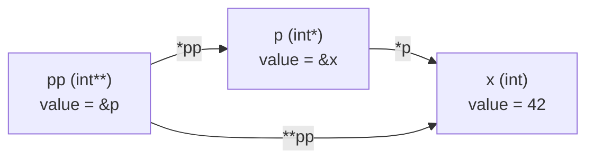
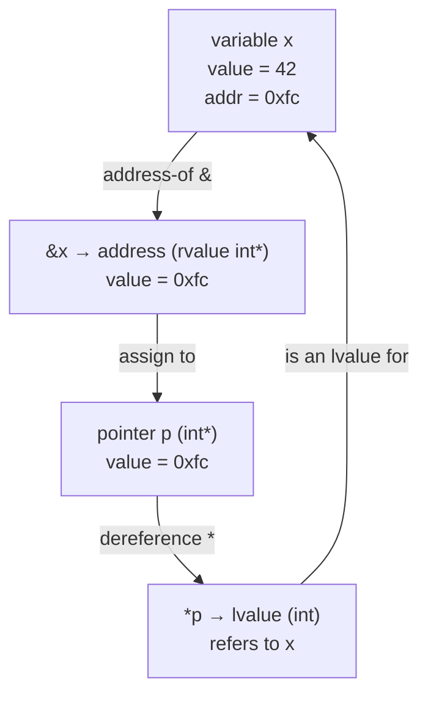

# Referencing and Dereferencing

## Why This Matters

Two operators form the bridge between *values* and *pointers* in C++: the **address-of operator `&`** ("referencing") and the **dereference operator `*`** ("dereferencing"). They are inverses of each other in the mathematical sense, but their syntactic and semantic details — operator precedence, lvalue/rvalue context, multiple indirection, null pointer semantics — are the source of more bugs than perhaps any other pair of operators in the language.

Mastering them means knowing exactly what type `&x` produces, what kind of expression `*p` is (lvalue vs rvalue), how to read `int** p`, why `*p = 5` is legal but `*(p + 1) = 5` may not be, why `&42` is ill-formed, and why `*nullptr` is undefined behavior. This note walks through each of these in depth.

## Background

The `&` and `*` symbols are heavily overloaded in C++:

- `&` is the address-of operator (`&x`), the bitwise AND operator (`a & b`), the reference declarator (`int& r`), and the rvalue-reference declarator (`int&& r`).
- `*` is the dereference operator (`*p`), the multiplication operator (`a * b`), and the pointer declarator (`int* p`).

The compiler disambiguates by context: in a declaration, `&` and `*` attach to the type; in an expression, they apply to a value. Learning to read declarations and expressions with both forms is the first step to fluency.

## Main Content

### 1. Referencing — The Address-Of Operator `&`

`&x` yields a pointer to `x`. The result is an rvalue of type "pointer to T" where T is the type of `x`. The result is *not* an lvalue — you cannot take its address again or assign to it directly.

```cpp
int x = 42;
int* p = &x;       // OK — &x is an rvalue of type int*

// int* p2 = &&x;  // ERROR — cannot take address of an rvalue
// &x = nullptr;   // ERROR — &x is not an lvalue
```

You can take the address of any **lvalue** — anything that has a stable memory location:

| Expression                       | Is `&expr` valid? | Result type          |
|----------------------------------|-------------------|----------------------|
| Named variable `x`               | Yes               | `T*`                 |
| Struct member `s.field`          | Yes               | `MemberType*`        |
| Array element `arr[i]`           | Yes               | `ElementType*`       |
| Dereferenced pointer `*p`        | Yes               | `T*`                 |
| Function `func`                  | Yes               | `RetType(*)(Args...)`|
| Static member function           | Yes               | Function pointer      |
| Non-static member function       | Yes (special syntax) | Pointer-to-member    |
| Temporary `make_thing()`         | No                | —                    |
| Bit-field `s.flag`               | No                | —                    |
| Register variable (deprecated)   | Implementation-defined | —                |
| Literal `42`                     | No                | —                    |

### 2. Dereferencing — The `*` Operator

`*p` yields the object that `p` points to. The result is an **lvalue** of type `T` (where `p` is `T*`), which means you can both read from and write to it:

```cpp
int x = 42;
int* p = &x;

int  y = *p;    // READ: y becomes 42
*p = 100;       // WRITE: x becomes 100
```

Because `*p` is an lvalue, you can take its address:

```cpp
int* p2 = &*p;  // p2 == p — the C++ standard explicitly allows this idiom
```

### 3. Lvalue and Rvalue Context

The expression `*p` is an lvalue when `p` is a non-void pointer. That is why both of these work:

```cpp
int a = *p;     // *p as rvalue context — read
*p  = b;        // *p as lvalue context — write
```

But consider:

```cpp
int* p = nullptr;
*p = 5;          // UB — writes through a null pointer
```

`*p` "is an lvalue" even when `p` is null — the language rule that null dereference is UB triggers as soon as you evaluate `*p` in any way, read or write.

### 4. Multiple Indirection

A pointer can point to another pointer:

```cpp
int   x  = 42;
int*  p  = &x;
int** pp = &p;       // pp is a pointer to a pointer to int

std::cout << **pp << '\n';   // 42 — double dereference
**pp = 100;                   // modifies x through two levels
```

The pattern generalises: `int***`, `int****`, etc. Three or more levels of indirection almost always signals a design problem — refactor into a struct or a small wrapper class.

#### Multiple Indirection Diagram



Reading `**pp` left-to-right: "the value at the address that pp points to, dereferenced again to give x". The expression `*pp` is `p` (an lvalue of type `int*`), and `**pp` is `*p` which is `x`.

### 5. Operator Precedence and Syntax

The dereference operator `*` has higher precedence than arithmetic operators but lower than postfix `.` and `[]`:

```cpp
struct Point { int x, y; };
Point p{1, 2};
Point* pp = &p;

*pp.x;        // ERROR: . binds first, equivalent to *(pp.x) — pp is not a struct
(*pp).x;      // OK: 1
pp->x;        // OK: 1 — the arrow operator does this for you, see [[10. Pointers to Structs]]
```

The arrow operator `->` is syntactic sugar for `(*p).member` — see [[10. Pointers to Structs]].

### 6. Dereferencing `void*`

You cannot dereference a `void*` because the compiler does not know how many bytes to read or what type to interpret the bits as. You must cast first:

```cpp
void* raw = std::malloc(4);
int*  pi  = static_cast<int*>(raw);
*pi = 42;
std::free(raw);
```

Forgetting to cast and writing `*raw` is a compile error, which is one of the few safety nets C++ provides for raw memory.

### 7. Null Pointer Dereference

`*nullptr` is undefined behavior. In practice it usually causes a segmentation fault because the address `0` is unmapped in most operating systems, but the standard explicitly allows the compiler to assume this never happens — meaning optimizers may delete null checks that *follow* a dereference:

```cpp
int* p = get_pointer();
int x = *p;          // if p is null, UB
if (p == nullptr) {  // COMPILER MAY DELETE THIS CHECK
    handle_null();
}
```

This is the source of many "the null check was there but didn't fire" bugs. **Always check before dereferencing if the pointer can be null.**

### 8. Dereferencing Past-the-End Pointers

`*(arr + n)` where `arr` is an array of size `n` is also undefined behavior — the one-past-the-end pointer is legal to compute and compare, but not to dereference:

```cpp
int arr[3] = {1, 2, 3};
int* end = arr + 3;   // OK — one past the end
// *end = 5;          // UB — out of bounds
```

See [[6. Pointer Arithmetic and Arrays]] for the full story.

### 9. The Round Trip

`&` and `*` are inverses:

```cpp
assert(&*p == p);     // taking the address of the dereferenced value gives back the pointer
assert(*&x == x);     // dereferencing the address of a value gives back the value
```

These hold for any well-defined `p` and `x`. The standard explicitly blesses them.

### 10. `&` on Functions

You can take the address of a function (without the call operator):

```cpp
int add(int a, int b) { return a + b; }

int (*fp)(int, int) = &add;     // explicit address-of
int (*fp2)(int, int) = add;     // implicit conversion to function pointer

int result = (*fp)(1, 2);       // explicit dereference + call
int result2 = fp(1, 2);         // implicit — both are fine
```

The `&` is optional when assigning a function name to a function pointer, and the `*` is optional when calling through one. See [[9. Pointers to Functions]].

### 11. `&` for References

`&` in a *declaration* introduces a reference, not the address-of operator. The compiler disambiguates by position:

```cpp
int x = 42;
int& r = x;        // DECLARATION — & means "reference type"
int* p = &x;       // EXPRESSION — & means "address of"
```

Reading carefully: in `int& r = x;`, the `&` is part of the type `int&`. In `int* p = &x;`, the first `*` is part of the type `int*`, and the second `&` is the address-of operator applied to `x`.

### 12. Common Pattern: The `swap` Function

The classic motivation for both operators:

```cpp
void swap(int* a, int* b) {
    if (!a || !b) return;
    int tmp = *a;   // read through a
    *a = *b;        // write through a
    *b = tmp;       // write through b
}

int main() {
    int x = 1, y = 2;
    swap(&x, &y);   // pass addresses
    // now x == 2, y == 1
}
```

The reference version is cleaner:

```cpp
void swap(int& a, int& b) {
    int tmp = a;
    a = b;
    b = tmp;
}

int main() {
    int x = 1, y = 2;
    swap(x, y);     // no & needed
}
```

Both compile to identical machine code on a modern compiler.

### 13. Dereferencing Flow Diagram



The cycle closes: starting from `x`, you take its address, store it in a pointer, and dereference the pointer to get back an lvalue referring to `x`.

## Common Pitfalls

> [!warning] Dereferencing a null pointer is UB
> Even reading `*p` when `p == nullptr` is undefined behavior, even if the result is not used.

> [!warning] Optimizers delete null checks after dereference
> If you dereference `p` before checking it for null, the compiler may assume `p != nullptr` and remove the check.

> [!warning] Dereferencing an uninitialized pointer
> `int* p; int x = *p;` is UB. Initialize every pointer.

> [!warning] Confusing declaration `*` with expression `*`
> In `int* p = &x;`, `*` declares the type; in `*p = 5;`, `*` is the dereference operator. They look identical but live in different syntactic contexts.

> [!warning] Operator precedence with `.` and `*`
> `*p.field` parses as `*(p.field)`, not `(*p).field`. Use `->` for pointer-to-struct access.

> [!warning] Multi-level pointer confusion
> `int** p` requires `**p` to access the int. A common bug is to write `*p` and get back an `int*` that is then misinterpreted.

> [!warning] Taking the address of a temporary
> `&std::string("hi")` is ill-formed. Even `const auto& s = std::string("hi");` extends the temporary's lifetime but does not give you a stable address beyond `s`'s scope.

> [!warning] Dereferencing past-the-end iterators
> `*(v.end())` is UB. The end iterator is past-the-end and exists only for comparison.

> [!warning] Aliasing and strict aliasing
> Reading memory through a pointer of the wrong type (e.g. `*reinterpret_cast<float*>(&int_var)`) violates strict aliasing and is UB. Use `std::bit_cast` or `std::memcpy`.

## Tips and Tricks

- **Initialize every pointer** at declaration, even if only to `nullptr`.
- **Check before dereferencing** if the pointer might be null: `if (p) use(*p);`
- **Use references where possible** — they cannot be null, so the dereference is always safe.
- **Use `->` instead of `(*p).member`** for clarity when accessing struct members through a pointer.
- **Limit indirection levels** — refactor three-or-more-level pointers into a struct.
- **Use `gsl::not_null<T*>`** to document and enforce non-null invariants.
- **Compile with `-fsanitize=address` and `-fsanitize=undefined`** to catch null dereferences and use-after-free at runtime.
- **Prefer `std::optional<T&>`-style patterns** (or `T*` with explicit nullability documentation) over raw nullable pointers in interface design.
- **Read declarations right-to-left**: `int* p` reads as "p is a pointer to int". `int** p` reads as "p is a pointer to a pointer to int". See [[7. Reading Pointer Declarations]].

## Active Recall

1. What is the type of `&x` if `x` is an `int`? Is it an lvalue or an rvalue?
2. What is the type of `*p` if `p` is an `int*`? Is it an lvalue or an rvalue?
3. Can you take the address of a literal? Of a bit-field? Of a function?
4. Why is `*nullptr` undefined behavior?
5. What does the compiler do to a null check that *follows* a dereference?
6. How do you dereference a `void*`?
7. Read the type `int** pp` aloud. How many dereferences are needed to reach the `int`?
8. What does `&*p` evaluate to? What does `*&x` evaluate to?
9. Why must `*p.member` be written `(*p).member` or `p->member`?
10. What is the difference between `int& r = x;` (declaration) and `int* p = &x;` (expression)?

## Next Steps

- Continue to [[4. Pointers Inside Functions]] to see how `&` and `*` are used to pass arguments.
- Then read [[5. Dynamic Memory Allocation]] for how `new` and `delete` interact with the dereference operators.
- For how to read complex declarations mixing `*` and `[]` and `()`, see [[7. Reading Pointer Declarations]].
- For const-correctness with pointers, see [[8. Constant Pointers and Pointers to Constants]].
