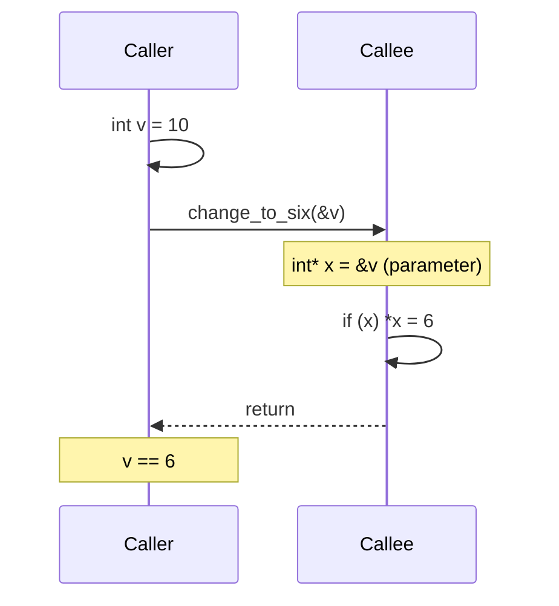

# Pointers Inside Functions

## Why This Matters

Functions are the basic unit of abstraction in C++. How you pass arguments to them determines whether the function can modify the caller's data, whether copies are made, whether the function is exception-safe, and whether the API is self-documenting. C++ gives you four main ways to pass an argument:

1. **By value**: `void f(T x)` — copies the argument; the function works on its own private copy.
2. **By reference**: `void f(T& x)` — the parameter is an alias for the caller's object; modifications are visible to the caller.
3. **By const reference**: `void f(const T& x)` — alias for read-only access; no copy, no modification.
4. **By pointer**: `void f(T* x)` — the parameter is a pointer to the caller's object; can be null, can be reseated locally, and modifications through the pointer are visible to the caller.

Choosing the right one for each parameter is one of the most impactful decisions in API design. This note focuses on the pointer form, contrasted with the others, with the classic `swap` example, const pointer parameters, and the modern C++ stance on "output parameters".

## Background

In C, the only way to let a function modify a caller variable was to pass a pointer: `void swap(int* a, int* b)`. C++ added references primarily to make this pattern cleaner: `void swap(int& a, int& b)`. References cannot be null, do not require `*` syntax inside the function, and do not require `&` syntax at the call site — so they are safer and more readable for the "in-out" parameter use case.

But pointers are still useful for function parameters in three situations:
- The argument is **optional** (`nullptr` is a legitimate value).
- The function must accept an **array** whose size is communicated separately (decayed pointer).
- You are interfacing with a **C API** that uses pointers throughout.

Modern C++ style (per the Core Guidelines) is: pass by `const T&` for read-only inputs, by `T&` for in-out parameters, by value (or `T&&` for move) for sink parameters, and by `T*` (with documented nullability) only when nullability is genuinely part of the contract. Returning multiple values should use structured bindings (`std::tuple` or `std::pair`) rather than output parameters.

## Main Content

### 1. Pass-by-Value

```cpp
void change_to_six(int x) {
    x = 6;     // local copy, caller's variable is untouched
}

int main() {
    int v = 10;
    change_to_six(v);
    std::cout << v << '\n';     // 10
}
```

The function receives a copy of the argument. Changes inside the function do not propagate. Pass-by-value is appropriate for:
- Small cheap-to-copy types (`int`, `double`, `char`, raw pointers, smart pointers — all 8 bytes).
- Sink parameters where the function will take ownership of the data (combined with `std::move` for non-trivial types).
- Function parameters you intend to mutate locally without affecting the caller.

### 2. Pass-by-Pointer

```cpp
void change_to_six(int* x) {
    if (x) *x = 6;        // dereference to modify caller's variable
}

int main() {
    int v = 10;
    change_to_six(&v);    // pass the address of v
    std::cout << v << '\n';   // 6

    change_to_six(nullptr);   // legal — caller says "no object"
}
```

The function receives a pointer holding the address of the caller's variable. The function must:
- **Check for null** before dereferencing (unless the API guarantees non-null).
- **Dereference** with `*` to access or modify the value.
- Optionally accept `nullptr` to mean "no value provided".

The caller must explicitly write `&v` at the call site, which **signals** that the function may modify the argument. This is the one ergonomic advantage of pointers over references for in-out parameters: the `&` makes the call site's intent visible.

### 3. Pass-by-Reference

```cpp
void change_to_six(int& x) {
    x = 6;     // direct aliasing — no dereference needed
}

int main() {
    int v = 10;
    change_to_six(v);     // no & needed at call site
    std::cout << v << '\n';   // 6

    // change_to_six(nullptr); — ERROR: references cannot be null
}
```

References cannot be null, so no null check is needed. The call site looks identical to pass-by-value, which can be either a feature (clean syntax) or a footgun (caller cannot tell that `v` may be modified). For this reason the Core Guidelines recommend *reserving non-const reference parameters for "out" parameters*, and using `T&` sparingly. For "in-out" parameters where modification is expected, references are idiomatic; for output, prefer return values.

### 4. The `swap` Example — Side by Side

```cpp
// C-style: pass by pointer
void swap_ptr(int* a, int* b) {
    if (!a || !b) return;
    int tmp = *a;
    *a = *b;
    *b = tmp;
}

// C++-style: pass by reference
void swap_ref(int& a, int& b) {
    int tmp = a;
    a = b;
    b = tmp;
}

int main() {
    int x = 1, y = 2;
    swap_ptr(&x, &y);    // caller must write & to signal modification
    swap_ref(x, y);      // cleaner call site
}
```

Both compile to identical assembly on a modern optimizer. The reference version is preferred because:
- It cannot accidentally be called with `nullptr`.
- It does not require `*` inside the function body, reducing clutter.
- It uses the same syntax as any other value parameter, matching `std::swap`'s interface.

### 5. Const Pointer Parameters

A pointer parameter marked `const` says what is constant:

```cpp
void f(const int* p);          // pointer to const int — *p cannot be modified through p
void f(int* const p);          // const pointer to int — p cannot be reassigned inside f
void f(const int* const p);    // both
```

The first form (`const T*`) is by far the most common in APIs — it says "I will read through this pointer but not modify what it points to". The second form (`T* const`) is rarely useful in function parameters because the parameter itself is a local copy; making it `const` only prevents the function body from reassigning the local variable.

See [[8. Constant Pointers and Pointers to Constants]] for the full taxonomy.

### 6. Pointer Parameters vs Reference Parameters

| Property                  | `T* p`                          | `T& r`                          |
|---------------------------|---------------------------------|---------------------------------|
| Can be null               | Yes                             | No                              |
| Requires `&` at call site | Yes                             | No                              |
| Requires `*` inside body  | Yes                             | No                              |
| Can be reseated locally   | Yes                             | No                              |
| Implicit conversion       | Array decays to pointer          | (none)                          |
| Self-documenting "may modify" | `&` at call site signals it  | Subtle — read the signature     |
| Recommended default       | Optional parameters, C interop   | In-out, read-only, return-by-ref|

### 7. Function Call Diagram



The caller passes the address of its variable; the callee dereferences the pointer to modify the original. There is no copy of the `int` — only a copy of the 8-byte pointer.

### 8. Output Parameters — The Anti-Pattern

A common C idiom is to use pointer parameters as "output" channels:

```cpp
bool parse_int(const char* s, int* out) {
    // ... parse ...
    if (out) *out = value;
    return success;
}

int main() {
    int v;
    if (parse_int("42", &v)) use(v);
}
```

This works, but it is inferior to the modern C++ alternatives:

```cpp
#include <optional>
#include <string>

std::optional<int> parse_int(std::string_view s) {
    // ... parse ...
    return success ? std::optional<int>{value} : std::nullopt;
}

int main() {
    if (auto v = parse_int("42")) use(*v);
}
```

The `std::optional` version:
- Has no nullable output parameter to forget to check.
- Returns the value directly, making the API self-documenting.
- Composes cleanly with `and_then`, `or_else`, and structured bindings.

For multiple return values, use `std::tuple` or `std::pair` with structured bindings:

```cpp
auto [value, error] = parse_with_error("42");
```

The Core Guidelines (F.20, F.21) explicitly recommend this. Reserve output parameters for:
- Interop with C APIs that require them.
- Performance-critical code where returning by value would move a large object (rare — RVO usually handles this).

### 9. Passing Arrays to Functions

When you pass an array to a function, it **decays to a pointer**:

```cpp
void f(int arr[10]);   // arr is actually int*
void g(int arr[]);     // same — int*
void h(int* arr);      // same — int*

int data[10];
f(data);    // works — but the function has no idea about the size
```

The size information is lost. To pass an array with its size, either:
- Pass a pointer + size: `void f(int* arr, size_t n)`.
- Pass a reference to a sized array: `void f(int (&arr)[10])` (preserves size).
- Use `std::span<int>` (C++20) — the modern, idiomatic way to pass a non-owning view of a contiguous sequence.
- Use `std::vector<int>` or `std::array<int, N>` for owned storage.

See [[6. Pointer Arithmetic and Arrays]] for details on array decay and the `arr[i] == *(arr + i)` equivalence.

### 10. The `this` Pointer

Inside a non-static member function, `this` is an implicit `T*` (or `const T*` in a const member function) parameter that points to the object on which the member was called:

```cpp
struct Widget {
    int value;
    void set(int v) {
        this->value = v;     // 'this' is Widget*
    }
    int get() const {
        return this->value;  // 'this' is const Widget*
    }
};
```

You rarely need to write `this->` explicitly — member access is implicit — but it is required when disambiguating a parameter shadowing a member, or when returning a reference to the object itself (`return *this;`).

### 11. Pointer-to-Pointer Parameters

A function that wants to modify a *caller's pointer* must take a pointer-to-pointer or a reference-to-pointer:

```cpp
void allocate(Buffer** out) {
    *out = new Buffer{};
}

void allocate_ref(Buffer*& out) {
    out = new Buffer{};
}

int main() {
    Buffer* b = nullptr;
    allocate(&b);            // C-style
    allocate_ref(b);         // C++-style
}
```

The reference form is cleaner. In modern C++ this whole pattern is replaced by `return std::unique_ptr<Buffer>`.

## Common Pitfalls

> [!warning] Forgetting to check for null
> `void f(int* p) { *p = 5; }` crashes if `p` is null. Either document "must not be null" and use `gsl::not_null<int*>`, or check.

> [!warning] Returning a pointer to a local
> ```cpp
> int* bad() { int x = 5; return &x; }   // UB — x destroyed
> ```

> [!warning] Output parameters that are not checked
> `if (parse("oops", &out)) use(out);` — if you forget the `if`, you use `out` uninitialized.

> [!warning] Using a non-const reference parameter without documenting it
> `void f(int& x)` looks like pass-by-value at the call site. Use it sparingly.

> [!warning] Array decay loses size
> `void f(int arr[10])` does *not* enforce that the caller passes a 10-element array. Use `std::span` or `std::array<int, 10>`.

> [!warning] Pointer-to-pointer confusion
> `void f(int** pp)` modifies the caller's pointer. `void f(int* p)` modifies the caller's pointed-to int. They are different.

> [!warning] Modifying through a const pointer
> `void f(const int* p)` promises not to modify `*p`. Violating this (e.g. via `const_cast`) is UB if the underlying object was declared `const`.

> [!warning] Default arguments that look like pass-by-value
> `void f(int* p = nullptr);` is a pointer parameter with a null default. Callers writing `f()` may not realise they are passing null.

## Tips and Tricks

- **Prefer `const T&` for read-only inputs** larger than two words.
- **Prefer `T&` for in-out parameters** that the function will modify.
- **Prefer `T*` (with documented nullability)** for optional parameters.
- **Prefer `std::optional<T>`** over `T*` for optional *values* — it owns its storage and is exception-safe.
- **Prefer `std::span<T>` (C++20)** over `T*` + size for non-owning views of contiguous sequences.
- **Prefer return values** over output parameters — they compose, they are testable, and they enable structured bindings.
- **Document nullability** with `gsl::not_null<T*>` (non-null) or `gsl::nullable<T*>` (may be null).
- **Mark read-only pointer parameters `const`** to enable const-correctness throughout your codebase.
- **Use `[[nodiscard]]` on functions whose return value must not be ignored** — this catches "I forgot to check the error" bugs.
- **For C ABI interop**, use `T*` and explicit `nullptr` checks, even if internally you would use `std::optional`.

## Active Recall

1. List the four main argument-passing styles in C++ and one use case for each.
2. Why does `void f(int arr[10])` not actually enforce that the caller passes a 10-element array?
3. What does the `&` at a call site (`f(&x)`) signal to a reader?
4. Why are references preferred to pointers for in-out parameters?
5. What is the modern C++ replacement for an output parameter that returns success + value?
6. What is the type of `this` in a const member function?
7. Why is `T* const p` rarely useful as a function parameter?
8. How would you write a function that modifies a caller's pointer?
9. What is the C++20 idiomatic type for a non-owning view of a contiguous sequence?
10. Give two reasons to prefer return values over output parameters.

## Next Steps

- Continue to [[5. Dynamic Memory Allocation]] to see how `new` and `delete` interact with function returns and ownership.
- For array decay and pointer arithmetic, see [[6. Pointer Arithmetic and Arrays]].
- For const-correctness in pointer parameters, see [[8. Constant Pointers and Pointers to Constants]].
- For the Functions chapter's full discussion of parameter passing guidelines, see Chapter 4.
- For modern C++ alternatives (`std::optional`, `std::variant`, `std::span`), see Chapter 8.
