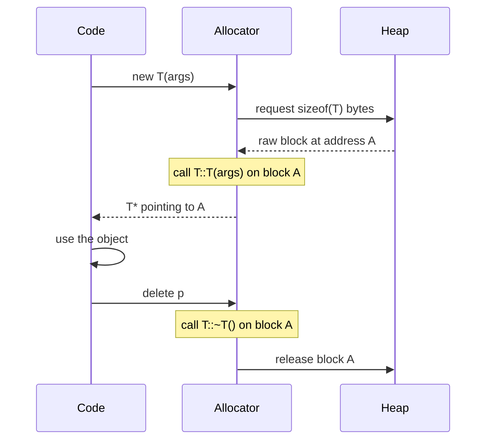

# Dynamic Memory Allocation

## Why This Matters

Static storage (globals), automatic storage (locals on the stack), and dynamic storage (the heap) are the three lifetimes a C++ object can have. Only dynamic storage lets you create an object whose lifetime is decoupled from any lexical scope — essential for containers that grow at runtime, for polymorphic objects whose concrete type is chosen at runtime, for caches that outlive a single function call, and for any data structure whose size is not known at compile time.

But dynamic memory is also where the worst C++ bugs live: memory leaks, double-free, use-after-free, mismatched `new[]`/`delete`, dangling pointers, exception-safety holes, and the entire class of security vulnerabilities known as "memory corruption". Modern C++ provides smart pointers (`std::unique_ptr`, `std::shared_ptr`) precisely so that you almost never need to write `new` or `delete` directly — but understanding what they do under the hood is the difference between a C++ user and a C++ engineer.

This note covers the C-style allocation family (`malloc`/`calloc`/`realloc`/`free`), the C++ style (`new`/`new[]`/`delete`/`delete[]`), `nothrow new`, the failure modes, and the modern alternatives that should be your default.

## Background

The C standard library provides `<cstdlib>` with four functions:
- `malloc(size)` — allocate `size` bytes of uninitialized memory, return `void*` (or `NULL` on failure).
- `calloc(n, size)` — allocate `n * size` bytes of zero-initialized memory.
- `realloc(p, size)` — resize a previously allocated block; may move it.
- `free(p)` — release the block.

These functions know nothing about C++ types — they just hand you raw bytes. Crucially, `malloc` does **not** call any constructor, and `free` does **not** call any destructor. To use them with C++ types you must use **placement `new`** to construct objects in the raw memory and explicitly call destructors before freeing.

C++ introduced `new` and `delete` to fix this. `new T` allocates `sizeof(T)` bytes *and* calls `T`'s constructor; `delete p` calls `T`'s destructor *and* frees the memory. `new T[n]` and `delete[] p` do the same for arrays. This guarantees RAII-style lifetime for heap objects.

The C++ standard library then layers smart pointers on top:
- `std::unique_ptr<T>` — exclusive ownership, zero overhead.
- `std::shared_ptr<T>` — shared ownership via reference counting.
- `std::weak_ptr<T>` — non-owning observer of a `shared_ptr`.
- `std::make_unique<T>(args...)` and `std::make_shared<T>(args...)` — exception-safe construction.

In modern C++ code, **direct `new`/`delete` should be rare**, and `malloc`/`free` should be reserved for C interop or for implementing custom allocators.

## Main Content

### 1. C-Style Allocation

```cpp
#include <cstdlib>
#include <iostream>

int main() {
    // malloc: raw bytes, uninitialized
    int* p = static_cast<int*>(std::malloc(sizeof(int)));
    if (!p) { /* handle allocation failure */ }
    *p = 42;
    std::cout << *p << '\n';
    std::free(p);

    // calloc: zero-initialized
    int* arr = static_cast<int*>(std::calloc(10, sizeof(int)));
    std::cout << arr[0] << '\n';   // 0
    std::free(arr);

    // realloc: grow or shrink
    int* bigger = static_cast<int*>(std::realloc(arr, 20 * sizeof(int)));
    // note: arr is now invalid if realloc moved the block
    std::free(bigger);
}
```

Notes:
- `malloc` returns `void*`, which you must explicitly cast to a typed pointer in C++ (in C, the cast is discouraged).
- Allocation failure returns `NULL`/`nullptr` (or throws `std::bad_alloc` on overloaded operators — see below).
- `realloc` may move the block; the old pointer is invalid afterward.
- The memory is **raw bytes** — no constructors are called. Using `malloc` for a non-trivially-constructible type like `std::string` and then accessing it is undefined behavior.

### 2. C++-Style `new` and `delete`

```cpp
int* p = new int;          // allocates sizeof(int) bytes, no init
int* q = new int(42);      // allocates and initializes to 42
int* r = new int{42};      // C++11 brace init

*p = 100;
delete p;                  // frees the memory

delete q;
delete r;
```

For class types, `new` calls the constructor:

```cpp
struct Widget {
    Widget()  { std::cout << "ctor\n"; }
    ~Widget() { std::cout << "dtor\n"; }
};

Widget* w = new Widget();   // prints "ctor"
delete w;                   // prints "dtor"
```

For arrays:

```cpp
int* arr = new int[10];          // 10 ints, uninitialized
int* arr2 = new int[10]();       // 10 ints, zero-initialized
int* arr3 = new int[10]{1,2,3};  // 10 ints, first three initialized

delete[] arr;     // MUST use delete[] for arrays
delete[] arr2;
delete[] arr3;
```

### 3. Why `new` Is Preferred Over `malloc`

| Feature                       | `malloc`/`free`                 | `new`/`delete`                        |
|-------------------------------|---------------------------------|---------------------------------------|
| Calls constructors            | No                              | Yes                                   |
| Calls destructors             | No                              | Yes                                   |
| Type-safe                     | Returns `void*`                 | Returns typed `T*`                    |
| Initialization syntax         | Manual                          | Built-in (`new T(args)`)              |
| Failure mode                  | Returns `nullptr`               | Throws `std::bad_alloc` by default    |
| Operator overloading          | Cannot be overloaded            | Class-specific `operator new`/`delete`|
| Exception-safe with RAII      | No                              | Yes (with smart pointers)             |

In short: `new` knows about types, lifetimes, and exceptions; `malloc` knows about bytes. Use `new` (or, better, smart pointers) in C++ code.

### 4. `nothrow new`

If you prefer the C-style "return null on failure" rather than throwing, use the `std::nothrow` variant:

```cpp
#include <new>

int* p = new (std::nothrow) int[1'000'000'000];   // returns nullptr on failure
if (!p) { /* handle gracefully */ }
delete[] p;
```

The `nothrow` variant is rarely the right choice in modern C++ — RAII and exceptions compose better than null checks — but it is useful in environments where exceptions are disabled (`-fno-exceptions`) or in performance-critical paths where `std::bad_alloc` would be too disruptive.

### 5. Memory Leaks

A leak occurs when memory is allocated but never freed:

```cpp
void leak() {
    int* p = new int(42);
    // ... function returns without delete — leaked!
}
```

The bytes remain allocated until the process exits. In a long-running server, leaks compound until the OS kills the process.

Common leak patterns:
- Early `return` without `delete`.
- An exception thrown between `new` and `delete`.
- Forgetting `delete[]` for an array allocated with `new[]`.
- A pointer being overwritten with another `new` without `delete`-ing the first.

The fix is RAII: wrap every owned resource in an object whose destructor frees it. Smart pointers are the standard wrapper.

### 6. Double Free

Calling `delete` twice on the same pointer is undefined behavior:

```cpp
int* p = new int(42);
delete p;
delete p;    // UB — likely heap corruption
```

After `delete`, set the pointer to `nullptr` to make a second `delete` a no-op (`delete nullptr` is well-defined and does nothing):

```cpp
delete p;
p = nullptr;
delete p;    // OK, no-op
```

Smart pointers make this problem disappear because the destructor runs exactly once when the smart pointer goes out of scope.

### 7. Mismatched `new[]` / `delete`

```cpp
int* arr = new int[10];
delete arr;     // UB — should be delete[]
```

Using `delete` on memory allocated with `new[]` (or vice versa) is undefined behavior. The array form is required because the runtime needs to call the destructor for *every* element in the array, and to do that it must know the count — which is stored in a header before the array, not for single-object `new`. Smart pointers (`std::unique_ptr<int[]>`) and `std::vector<int>` eliminate this footgun.

### 8. Exception Safety

```cpp
void risky() {
    int* a = new int(1);
    int* b = new int(2);    // if this throws, 'a' leaks
    // ...
    delete a;
    delete b;
}
```

If the second `new` throws `std::bad_alloc`, `a` is leaked because the `delete a;` line is never reached. The standard fix is RAII:

```cpp
void safe() {
    auto a = std::make_unique<int>(1);
    auto b = std::make_unique<int>(2);    // if this throws, a's destructor runs
    // ...
}
```

When `b`'s constructor throws, `a` goes out of scope, its destructor runs, and the memory is freed. This is why `std::make_unique` is preferred over `std::unique_ptr<T>(new T)` — the make_* functions provide strong exception safety.

### 9. The Heap Allocation Flow



`new` is two operations: allocation (which may use `malloc` or a custom allocator) and construction. `delete` is the inverse: destruction then deallocation. Splitting these is the basis of placement `new` and custom allocators.

### 10. Smart Pointers — The Modern Default

#### `std::unique_ptr<T>` — Exclusive Ownership

```cpp
#include <memory>

auto p = std::make_unique<Widget>(args...);   // owns the Widget
// ...
// no delete needed — destructor runs when p goes out of scope
```

- Cannot be copied; can be moved.
- Zero runtime overhead vs raw pointer.
- Use for: any owned heap object with single owner.

#### `std::shared_ptr<T>` — Shared Ownership

```cpp
auto p = std::make_shared<Widget>(args...);
auto q = p;              // both share ownership, refcount = 2
// the Widget is destroyed when the last shared_ptr to it is destroyed
```

- Reference-counted; thread-safe increment/decrement.
- Larger than `unique_ptr` (two pointers: object + control block).
- Use for: shared graphs, caches, async callbacks.

#### `std::weak_ptr<T>` — Non-Owning Observer

```cpp
std::weak_ptr<Widget> w = p;     // does not increase refcount
if (auto sp = w.lock()) {        // try to upgrade to shared
    use(*sp);
}
```

Use to break cycles in shared ownership graphs.

#### `std::make_unique` vs `std::unique_ptr<T>(new T)`

```cpp
auto p = std::make_unique<Widget>(args);   // preferred
std::unique_ptr<Widget> q(new Widget(args));   // works but not exception-safe in some expressions
```

`make_unique` is preferred because:
- It is exception-safe in expressions like `f(std::unique_ptr<A>(new A), std::unique_ptr<B>(new B))` where the order of evaluation could leak.
- It is shorter.
- For `make_shared`, it allocates the control block and the object in a single allocation (faster, better cache locality).

### 11. When to Use What

| Use case                                          | Use                                                    |
|---------------------------------------------------|--------------------------------------------------------|
| Single owned heap object                          | `std::unique_ptr<T>` via `std::make_unique<T>`         |
| Shared ownership                                  | `std::shared_ptr<T>` via `std::make_shared<T>`         |
| Non-owning view of an object owned elsewhere      | Raw `T*` or `T&`                                       |
| Observing a shared object without extending life  | `std::weak_ptr<T>`                                     |
| Dynamic array                                     | `std::vector<T>`                                       |
| Fixed-size array known at compile time            | `std::array<T, N>`                                     |
| C API interop with raw memory                     | `malloc`/`free` + placement `new` + explicit destructor|
| Custom allocator or pool                          | `operator new` overload or pool-specific API           |
| Polymorphic factory                               | `return std::unique_ptr<Base>(new Derived(args));`     |

### 12. Placement `new`

Placement `new` constructs an object in pre-allocated memory without allocating:

```cpp
#include <new>

alignas(Widget) unsigned char buf[sizeof(Widget)];
Widget* w = new (buf) Widget(args);   // construct in buf
// ...
w->~Widget();                          // must call destructor manually
// no delete! buf is not on the heap
```

This is how `std::vector`, `std::optional`, `std::variant`, and many containers manage memory: they allocate raw bytes and use placement `new` to construct objects when needed.

## Common Pitfalls

> [!warning] Forgetting `delete`
> Every `new` must be matched by exactly one `delete`. Use smart pointers to enforce this.

> [!warning] `delete[]` vs `delete` mismatch
> `new[]` requires `delete[]`. Use `std::vector` or `std::unique_ptr<T[]>` to avoid the question.

> [!warning] Double free
> `delete p; delete p;` is UB. Set `p = nullptr` after `delete`.

> [!warning] Use-after-free
> `delete p; *p = 5;` is UB. The pointer is dangling. Smart pointers eliminate this by making the pointer inaccessible after destruction (or, for `shared_ptr`, by checking the refcount).

> [!warning] Memory leak on exception
> Naked `new`/`delete` cannot survive an exception in between. Use RAII.

> [!warning] `malloc` for non-trivial types
> `std::string* s = (std::string*)malloc(sizeof(std::string));` does *not* construct a `std::string`. Accessing it is UB. Use `new` or placement `new`.

> [!warning] `realloc` invalidates the old pointer
> After `realloc`, the original pointer may no longer be valid. This breaks any other code holding the old pointer.

> [!warning] Assuming `new` returns non-null
> By default, `new` throws `std::bad_alloc` on failure. It does *not* return `nullptr` unless you use `nothrow`. If you write `int* p = new int; if (!p) ...` the check is dead code.

> [!warning] Owning raw pointer in a struct without destructor
> ```cpp
> struct Bad { int* p = new int[100]; };   // leaks on destruction
> ```
> Follow the Rule of Zero or Rule of Five — see the Memory Management chapter.

> [!warning] `shared_ptr` cycles
> Two `shared_ptr`s that point to each other never get freed. Use `weak_ptr` to break cycles.

## Tips and Tricks

- **Never write `new` or `delete` in application code.** Use `std::make_unique` and `std::make_shared`.
- **Use `std::vector` for dynamic arrays.** It is the modern replacement for `new[]`/`delete[]`.
- **Use `std::array` for fixed-size arrays.** It is the modern replacement for C arrays.
- **Use placement `new` only when implementing containers** or low-level abstractions.
- **Use `std::make_shared` over `std::shared_ptr<T>(new T)`** for the single-allocation optimisation and exception safety.
- **Use `std::weak_ptr` to break `shared_ptr` cycles.**
- **Use AddressSanitizer** (`-fsanitize=address`) in debug builds to catch leaks, use-after-free, and double free.
- **Use Valgrind or LeakSanitizer** to find leaks in long-running processes.
- **Override `operator new`** at the global or class level only for tracking allocations or implementing pools — not for ordinary program logic.
- **For C interop, use `std::malloc`/`std::free` + `std::launder`** when reusing storage.
- **Disable exceptions for `new`** with `new (std::nothrow)` only when exceptions are disabled project-wide or in performance-critical allocation paths.

## Active Recall

1. What is the difference between `malloc` and `new`?
2. What does `new T[n]` return, and what must you call to free it?
3. What happens when `new` fails to allocate? (Default and `nothrow`.)
4. Why is `std::make_unique` preferred over `std::unique_ptr<T>(new T)`?
5. Why is `std::make_shared` more efficient than `std::shared_ptr<T>(new T)`?
6. What is placement `new`, and where is it used?
7. Why does `delete p; delete p;` cause undefined behavior?
8. How do `shared_ptr` cycles cause leaks, and what is the fix?
9. What does `std::weak_ptr::lock()` do?
10. Give two reasons smart pointers are safer than raw `new`/`delete`.

## Next Steps

- Continue to [[6. Pointer Arithmetic and Arrays]] to see how pointers and arrays interact (especially array decay and `*(arr + i)`).
- For ownership, lifetimes, and the Rule of Zero/Five, see the Memory Management chapter.
- For modern C++ smart pointers in depth, see the Modern C++ chapter.
- For custom allocators and arena allocation, see the Performance Optimization chapter.
- For exception safety and RAII, see the Error Handling chapter.
