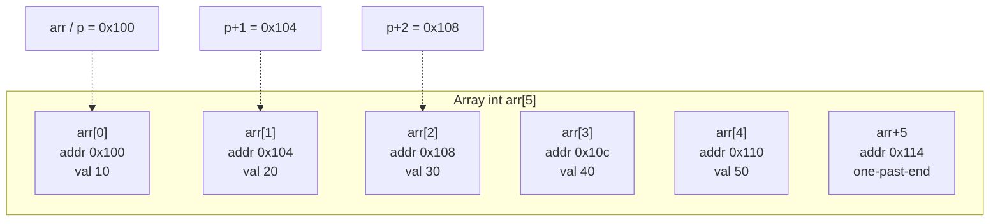

# Pointer Arithmetic and Arrays

## Why This Matters

In C and C++, arrays and pointers are deeply intertwined. The name of an array *decays* to a pointer to its first element in almost every expression context, and the indexing operation `arr[i]` is defined in terms of pointer arithmetic: `arr[i]` is exactly `*(arr + i)`. This equivalence is the basis of every C-style loop, every `std::vector` implementation, every string function, and every byte buffer manipulation in the language.

Pointer arithmetic is also one of the most error-prone features in C++. Off-by-one errors produce out-of-bounds reads or writes. Confusing byte offsets with element offsets corrupts memory. Comparing pointers across allocations is unspecified. The "one past the end" rule has subtle distinctions between legal (forming, comparing) and illegal (dereferencing). This note covers all of it, with a Mermaid diagram of the array/pointer correspondence and worked examples.

## Background

In K&R C, arrays were deliberately designed to decay to pointers so that array arguments could be passed to functions without copying the whole array. The cost was that the size information is lost at the function boundary — `void f(int arr[10])` is exactly the same as `void f(int* arr)`. This design choice is responsible for both the elegance of C's string library (`strlen`, `strcpy`, `memcpy` all work on raw pointers) and the entire class of buffer-overflow security vulnerabilities that have plagued C and C++ code for fifty years.

C++ inherits this behavior for compatibility. It adds `std::array<T, N>` (preserves size), `std::vector<T>` (dynamic size), and `std::span<T>` (C++20, non-owning view with size) as safer alternatives.

## Main Content

### 1. Array Decay

In most expressions, an array of type `T[N]` is implicitly converted to a pointer of type `T*` pointing to its first element:

```cpp
int arr[5] = {10, 20, 30, 40, 50};
int* p = arr;            // arr decays to &arr[0]

std::cout << *p << '\n';       // 10
std::cout << *(p + 1) << '\n'; // 20
std::cout << p[2] << '\n';     // 30 — same as *(p + 2)
```

The exceptions to array decay are:
- `sizeof(arr)` — gives `N * sizeof(T)`, not `sizeof(T*)`.
- `&arr` — gives `int(*)[N]`, a pointer to the whole array.
- `decltype(arr)` — gives `int[5]`, not `int*`.
- String literal initialization of `char[]`.

### 2. The Fundamental Equation: `arr[i] == *(arr + i)`

This is the single most important identity in C/C++ pointer arithmetic. The subscript operator is defined in terms of pointer addition and dereference. It works in both directions:

```cpp
arr[i]    // == *(arr + i)
i[arr]    // also == *(arr + i) — legal but never write this
```

The reverse form `i[arr]` is a famous C curiosity that compiles but should never be used.

### 3. Pointer Arithmetic Scales by `sizeof(T)`

Adding an integer `n` to a `T*` advances the pointer by `n * sizeof(T)` bytes:

```cpp
int arr[5] = {10, 20, 30, 40, 50};
int* p = arr;

p == arr;              // true — both point to arr[0]
p + 1 == arr + 1;      // true — both point to arr[1]
reinterpret_cast<char*>(p + 1) - reinterpret_cast<char*>(p);   // 4 (sizeof int)
```

This is why pointer arithmetic is *typed*: `char*` advances by 1 byte, `int*` by 4, `double*` by 8. Pointer arithmetic on `void*` is not allowed in standard C++ (some compilers extend it).

### 4. Valid Operations

The following operations are defined on pointers:

| Operation                 | Result type        | Notes                                       |
|---------------------------|--------------------|---------------------------------------------|
| `p + n`                   | `T*`               | Advance by `n` elements                     |
| `p - n`                   | `T*`               | Retreat by `n` elements                     |
| `p++`, `++p`, `p--`, `--p`| `T*`               | Step forward/backward                        |
| `p2 - p1`                 | `std::ptrdiff_t`   | Element count between two pointers           |
| `p1 == p2`, `p1 != p2`    | `bool`             | Equality (always well-defined)              |
| `p1 < p2`, `<=`, `>`, `>=`| `bool`             | Only well-defined within the same array      |

### 5. Pointer Subtraction

Subtracting two pointers of the same type yields a `std::ptrdiff_t` (a signed integer) representing the number of elements between them:

```cpp
int arr[5] = {10, 20, 30, 40, 50};
int* p1 = &arr[1];
int* p2 = &arr[4];
std::cout << (p2 - p1) << '\n';   // 3 — three elements apart
```

Pointer subtraction is only defined when both pointers point into the same array (or one past the end). Subtracting pointers from different arrays is undefined behavior.

### 6. Comparison Operators

`==` and `!=` work on any two pointers of compatible types and tell you whether they point to the same object. The relational operators (`<`, `<=`, `>`, `>=`) are only well-defined for pointers into the same array (or one past the end); the result reflects the array's index ordering.

```cpp
int arr[5];
int other[5];

&arr[0] < &arr[4];     // true
// &arr[0] < &other[0]; // UB — different arrays
```

### 7. The One-Past-the-End Rule

You may compute `arr + N` (where `N` is the array's size) and use it for comparison, but you may not dereference it:

```cpp
int arr[3] = {1, 2, 3};
int* end = arr + 3;    // OK — one past the end
for (int* p = arr; p != end; ++p) {
    std::cout << *p << ' ';   // 1 2 3
}
// *end = 5;   // UB — past the end, must not dereference
```

This rule is the foundation of the STL iterator design: `vec.end()` returns a one-past-the-end iterator, which exists only for comparison.

### 8. Array/Pointer Correspondence Diagram



Each `+1` advances the address by `sizeof(int) == 4` bytes. The arrow from `p+2` to `arr[2]` shows the equivalence `*(p + 2) == arr[2]`.

### 9. Multidimensional Arrays

A 2D C-style array is an array of arrays:

```cpp
int grid[3][4];
int (*row)[4] = grid;     // pointer to array of 4 ints

grid[1][2]                // == *(*(grid + 1) + 2)
```

The expression `grid[1][2]` desugars to `*(*(grid + 1) + 2)`:
1. `grid + 1` advances by `sizeof(int[4])` bytes (one row).
2. `*(grid + 1)` is the second row, an `int[4]` which decays to `int*`.
3. `*(grid + 1) + 2` advances within the row by 2 ints.
4. `*(*(grid + 1) + 2)` is the element.

For most modern C++ code, prefer `std::vector<std::vector<int>>` or a flattened 1D `std::vector<int>` indexed as `i * cols + j`. The latter has better cache locality.

### 10. Strings as `char*` Pointers

C strings are null-terminated `char` arrays. Every `<cstring>` function takes `char*` or `const char*`:

```cpp
#include <cstring>
#include <iostream>

int main() {
    const char* s = "hello";   // string literal decays to const char*
    std::cout << std::strlen(s) << '\n';   // 5

    for (const char* p = s; *p != '\0'; ++p) {
        std::cout << *p << ' ';            // h e l l o
    }
}
```

The idiom `for (const char* p = s; *p; ++p)` is the canonical C string iteration. In C++ prefer `std::string` and `std::string_view`.

### 11. `std::span` — The Modern Pointer + Size

C++20 introduced `std::span<T>` (in `<span>`), a non-owning view of a contiguous sequence of `T` with a known size:

```cpp
#include <span>
#include <iostream>

void print(std::span<const int> data) {
    for (int x : data) std::cout << x << ' ';
    std::cout << '\n';
}

int main() {
    int arr[] = {1, 2, 3, 4, 5};
    print(arr);                              // C array
    print(std::vector<int>{6, 7, 8});        // vector
    print(std::array<int, 3>{9, 10, 11});    // std::array
}
```

`std::span` is the modern replacement for `T*` + `size_t n` parameters. It is one type that accepts any contiguous range, knows its size, supports iterator and indexing access, and is as cheap as a pointer + integer.

### 12. `std::begin` and `std::end`

For any container or array, `std::begin(c)` and `std::end(c)` give you the standard iterator range. For C arrays they decay correctly:

```cpp
int arr[5] = {1, 2, 3, 4, 5};
auto* begin = std::begin(arr);   // &arr[0]
auto* end   = std::end(arr);     // arr + 5 — one past the end
```

This is the basis of range-based for loops:

```cpp
for (int x : arr) { /* ... */ }
// equivalent to:
for (auto* it = std::begin(arr); it != std::end(arr); ++it) {
    int x = *it;
    /* ... */
}
```

## Common Pitfalls

> [!warning] Out-of-bounds access
> `arr[5]` on a 5-element array is UB. The compiler rarely catches it; sanitizers do.

> [!warning] Comparing pointers from different arrays
> `&a[0] < &b[0]` for different arrays `a` and `b` is unspecified.

> [!warning] Dereferencing the one-past-the-end pointer
> `*(arr + N)` is UB even though computing it is fine.

> [!warning] `sizeof(arr)` in a function parameter
> `void f(int arr[10]) { std::cout << sizeof(arr); }` prints `sizeof(int*)`, not `sizeof(int[10])`. Array decay loses size.

> [!warning] Arithmetic on `void*`
> Standard C++ does not define pointer arithmetic on `void*`. GCC and Clang extend it to mean "byte arithmetic", but portable code must cast to `char*` first.

> [!warning] Negative indices
> `arr[-1]` is legal C++ syntax (it means `*(arr - 1)`) but almost always UB unless you have deliberately set up a pointer with room before it.

> [!warning] Comparing pointers of different types
> `int*` and `char*` cannot be compared with `<`. Cast to `uintptr_t` for raw address comparison.

> [!warning] Returning pointers to local arrays
> `int* f() { int arr[5]; return arr; }` — UB, the array is destroyed on return.

> [!warning] Indexing with the wrong size type
> `arr[uint8_t(255)]` works, but `arr[-1]` is UB. Be careful with signed/unsigned conversions in index expressions.

## Tips and Tricks

- **Prefer `std::span<T>`** over `T*` + size for non-owning array parameters in C++20 and later.
- **Prefer `std::vector<T>`** over `new[]`/`delete[]` for owned dynamic arrays.
- **Prefer `std::array<T, N>`** over C arrays for fixed-size arrays.
- **Use `std::begin`/`std::end`** instead of `&arr[0]`/`arr + N` for clarity.
- **Use range-based for** whenever you do not need the index.
- **Use `std::size(arr)`** to get the element count of a C array (works because of the no-decay rule for `sizeof`).
- **Use `std::data(arr)` and `std::size(arr)`** to extract pointer + size uniformly from containers and arrays.
- **Compile with `-fsanitize=address`** to catch out-of-bounds access at runtime.
- **For 2D arrays, prefer a flattened 1D `std::vector<int>`** indexed as `i * cols + j` for cache locality.
- **Avoid `void*` arithmetic** — cast to `char*` if you need byte-level stepping.

## Active Recall

1. What does `arr[i]` desugar to in terms of pointer arithmetic?
2. What is array decay, and what are the three main exceptions to it?
3. What does `p + n` advance the address by, for `T* p`?
4. What type does `p2 - p1` produce, and what does it represent?
5. When are the relational operators `<`, `>`, `<=`, `>=` well-defined on pointers?
6. What is the one-past-the-end rule, and what can and can't you do with that pointer?
7. Why does `sizeof(arr)` in a function parameter give the size of a pointer?
8. Desugar `grid[1][2]` for `int grid[3][4]` step by step.
9. Why is `void*` arithmetic not defined in standard C++?
10. What is `std::span`, and what problem does it solve?

## Next Steps

- Continue to [[7. Reading Pointer Declarations]] to learn the spiral rule for decoding declarations like `int* (*p[5])(int)`.
- For how to declare and use arrays, see Chapter 2 on C++ Fundamentals.
- For the modern C++ alternatives to C arrays (`std::vector`, `std::array`, `std::span`), see Chapter 8.
- For how pointer arithmetic is used to build iterators, see the STL Deep Dive chapter.
- For buffer-overflow security issues, see the Software Engineering Practices chapter.
