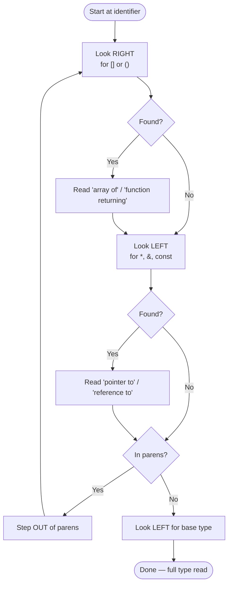

# Reading Pointer Declarations

## Why This Matters

C and C++ declarations are notorious for being hard to read. Consider `int* (*p[5])(int)` — is `p` an array of function pointers? A pointer to an array of functions? A function returning pointers? Even experienced programmers reach for paper and pencil.

The difficulty comes from two design choices in C's declaration syntax:
1. **Prefix and postfix operators** combine on the same identifier: `*` is prefix, `[]` and `()` are postfix.
2. **Parentheses** override the natural precedence, but they nest confusingly when combined with both prefix and postfix operators.

This note teaches the **spiral rule** (also called the right-left rule), a systematic way to decode any C/C++ declaration, plus the modern C++ way to make declarations readable: `using` aliases. By the end you will be able to read `int* (*foo)(int)` and `char* const* (*next)(void)` at a glance.

## Background

The C declaration syntax was designed by Dennis Ritchie in the early 1970s to mirror how the expression would be used. The dictum is: **declaration follows use**.

If you write `int *p;`, then `*p` is an `int`. If you write `int *p[5];`, then `*p[i]` (note `[]` binds tighter than `*`) is an `int`, which means `p` is an array of pointers. If you write `int (*p)[5];`, then `(*p)[i]` is an `int`, which means `p` is a pointer to an array.

This "expression mirrors declaration" property is elegant in principle but confusing in practice, because it forces the reader to keep track of precedence and parentheses. The spiral rule is a procedural way to decode any declaration.

## Main Content

### 1. Operator Precedence in Declarations

In a declaration, the operators have the following precedence (highest first):

| Operator     | Meaning                          | Associativity |
|--------------|----------------------------------|---------------|
| `()` (postfix) | Function call/parameter list   | Left to right |
| `[]` (postfix) | Array of                       | Left to right |
| `*` (prefix) | Pointer to                       | Right to left |
| `&` (prefix) | Reference to                     | Right to left |

The key fact: **`[]` and `()` bind tighter than `*`**. So:

- `int* a[5]` is `int* (a[5])` — array of 5 pointers.
- `int (*a)[5]` is `int ((*a)[5])` — pointer to array of 5.

Parentheses override this precedence.

### 2. The Spiral Rule (Right-Left Rule)

The spiral rule is a procedural algorithm for reading any declaration. Start at the identifier and spiral outward clockwise:

1. **Find the identifier** (the variable name).
2. **Look right** for `[]` or `()` — read "array of" or "function returning".
3. **Look left** for `*`, `&`, `const`, `volatile`, or a base type — read "pointer to", "reference to", or the type itself.
4. **Step out** through parentheses and repeat.
5. **Continue** until you reach the base type.

The spiral goes clockwise: right, then left, then up out of the parens, then right, then left, and so on.

### 3. Worked Example 1: `int* p[5]`

1. Identifier: `p`
2. Look right: `[5]` → "array of 5"
3. Look left: `*` → "pointers"
4. Look left: `int` → "to `int`"

**Reading**: `p` is an array of 5 pointers to `int`.

### 4. Worked Example 2: `int (*p)[5]`

1. Identifier: `p`
2. Look right: `)` (nothing) — jump out of parens
3. Look left (inside parens): `*` → "pointer to"
4. Step out of parens.
5. Look right: `[5]` → "array of 5"
6. Look left: `int` → "of `int`"

**Reading**: `p` is a pointer to an array of 5 `int`s.

### 5. Worked Example 3: `void (*fp)(int, double)`

1. Identifier: `fp`
2. Look right: `)` (nothing) — jump out of parens
3. Look left (inside parens): `*` → "pointer to"
4. Step out of parens.
5. Look right: `(int, double)` → "function taking `int`, `double`"
6. Look left: `void` → "returning `void`"

**Reading**: `fp` is a pointer to a function taking `int` and `double` and returning `void`.

### 6. Worked Example 4: `int* (*p[5])(int)`

This combines array, function pointer, and pointer return.

1. Identifier: `p`
2. Look right: `[5]` → "array of 5"
3. Look left: `*` (inside parens) → "pointers to"
4. Step out of parens.
5. Look right: `(int)` → "function taking `int`"
6. Look left: `*` → "returning pointer to"
7. Look left: `int` → "`int`"

**Reading**: `p` is an array of 5 pointers to functions taking an `int` and returning a pointer to `int`.

### 7. Worked Example 5: A Whopper

`const int* (*(*foo)())[5];`

Let's spiral through:

1. Identifier: `foo`
2. Look right: `)` (nothing) — jump out of parens
3. Look left (inside first parens): `*` → "pointer to"
4. Step out of parens.
5. Look right: `()` → "function taking no args"
6. Look left: `*` (inside next parens) → "returning pointer to"
7. Step out of parens.
8. Look right: `[5]` → "array of 5"
9. Look left: `*` → "pointers to"
10. Look left: `const int` → "`const int`"

**Reading**: `foo` is a pointer to a function (taking no arguments) returning a pointer to an array of 5 pointers to `const int`.

### 8. Spiral Rule Diagram



The spiral alternates right and left, stepping out of parentheses each round, until no more operators remain and only the base type is left.

### 9. `cdecl` — The Tool

The website [cdecl.org](https://cdecl.org/) translates between C declarations and English. Paste `int* (*p[5])(int)` and it returns "declare p as array 5 of pointer to function (int) returning pointer to int". This is invaluable when learning and when reading unfamiliar code.

There is also a command-line `cdecl` tool on most Unix systems.

### 10. The `int* a` vs `int *a` Style Question

```cpp
int* p;       // type-centric: "p is an int*"
int *p;       // variable-centric: "*p is an int"
```

These compile identically. The debate:
- **Type-centric** (`int* p`) makes the type visually obvious and matches modern C++ style (`auto p = ...`). It is preferred by the C++ Core Guidelines.
- **Variable-centric** (`int *p`) makes the multiple-declaration trap visible:

```cpp
int* p1, p2;   // p1 is int*, p2 is int — confusing
int p1, *p2;   // unambiguous in the other style
```

The C++ Core Guidelines recommend **one declaration per line** which makes the question moot. See [[1. Introduction to Pointers]] for the full discussion.

### 11. The Modern Fix: `using` Aliases

The cleanest way to make a complex declaration readable is to break it into named pieces with `using`:

```cpp
// Before:
int* (*operations[5])(int);

// After:
using IntFunc = int*(int);
IntFunc* operations[5];
```

Or for function pointers:

```cpp
using IntBinOp = int(*)(int, int);
IntBinOp ops[] = {add, sub, mul, div};
```

`using` (C++11, replacing the older `typedef`) lets you give a name to any type, including function pointer types. This is the single biggest readability win available for C-style declarations.

### 12. The `auto` Alternative

For variables, `auto` lets the compiler deduce the type:

```cpp
int add(int a, int b) { return a + b; }
auto fp = &add;            // fp is int(*)(int, int)
```

`auto` deduces the correct function-pointer type without you having to write or read it. The only place you cannot use `auto` is in function parameter types (where you need concepts or templates instead) and in struct member types.

### 13. Common Patterns to Memorize

| Declaration                | Reading                                          |
|----------------------------|--------------------------------------------------|
| `int* p`                   | pointer to int                                   |
| `int& r`                   | reference to int                                 |
| `int p[5]`                 | array of 5 ints                                  |
| `int* p[5]`                | array of 5 pointers to int                       |
| `int (*p)[5]`              | pointer to array of 5 ints                       |
| `int** p`                  | pointer to pointer to int                        |
| `int (*fp)(int)`           | pointer to function(int) returning int           |
| `int* (*fp)(int)`          | pointer to function(int) returning pointer to int|
| `int (*fp[5])(int)`        | array of 5 pointers to function(int) returning int|
| `int (*(*fp)(int))[5]`     | pointer to function(int) returning pointer to array of 5 ints|
| `const int* p`             | pointer to const int                             |
| `int* const p`             | const pointer to int                             |

### 14. `typedef` vs `using`

`using` is the modern C++ replacement for `typedef`:

```cpp
// Old (C-style):
typedef int (*IntBinOp)(int, int);

// New (C++11):
using IntBinOp = int(*)(int, int);
```

`using` is preferred because:
- It reads left-to-right (alias = type).
- It is templatizable: `template<class T> using Vec = std::vector<T>;`
- It is more consistent with `auto` and other modern C++ syntax.

## Common Pitfalls

> [!warning] Misreading `int* p[5]` as "pointer to array"
> `int* p[5]` is an array of 5 pointers. `int (*p)[5]` is a pointer to an array. The position of the parentheses is everything.

> [!warning] Declaring multiple pointers on one line
> `int* p1, p2;` declares one pointer and one int. One declaration per line avoids this.

> [!warning] Forgetting that `[]` binds tighter than `*`
> `int* a[5]` is an array (because `[]` binds tighter). `int (*a)[5]` is a pointer.

> [!warning] Confusing function pointers with function declarations
> `int f(int);` declares a function. `int (*f)(int);` declares a function pointer. The `*` and parens make all the difference.

> [!warning] Using `typedef` for template aliases
> `typedef` cannot be templatized. Use `using` for template aliases.

> [!warning] Reading right-to-left incorrectly
> The spiral rule alternates right and left. Reading only right-to-left works for simple cases but fails for complex ones.

## Tips and Tricks

- **Use the spiral rule** to decode unfamiliar declarations: right, left, out of parens, repeat.
- **Use [cdecl.org](https://cdecl.org/)** to verify your reading.
- **Use `using` aliases** to break complex declarations into named pieces.
- **Use `auto`** to avoid spelling out complex types where the compiler can deduce them.
- **One declaration per line** eliminates the multiple-pointer-on-one-line bug.
- **Prefer `int* p`** style (type-centric) in new C++ code — it matches `auto`.
- **For function pointer types, always use a `using` alias** — function pointer syntax is unreadable inline.
- **For arrays of function pointers, consider `std::function` or a `std::array<std::function<...>, N>`** for readability at a small performance cost.
- **Memorize the five most common patterns** (pointer, array of pointers, pointer to array, function pointer, pointer to function returning pointer) — they cover 95% of real-world code.

## Active Recall

1. State the operator precedence in C++ declarations: which binds tighter, `[]` or `*`?
2. Apply the spiral rule to `int (*p)[5]` and give the English reading.
3. Apply the spiral rule to `int* (*p[5])(int)` and give the English reading.
4. What is the difference between `int* p1, p2;` and `int *p1, *p2;`?
5. Why is `using` preferred over `typedef` in modern C++?
6. What tool can translate C declarations into English automatically?
7. Write a `using` alias for `int (*)(int, int)` and use it to declare an array of 4 such pointers.
8. Apply the spiral rule to `const int* const* p` and give the English reading.
9. Apply the spiral rule to `int (*(*foo)())[5]` and give the English reading.
10. Why does the spiral rule go clockwise (right, then left, then out)?

## Next Steps

- Continue to [[8. Constant Pointers and Pointers to Constants]] to apply the spiral rule to const-qualified pointer declarations.
- For function pointers in depth, see [[9. Pointers to Functions]].
- For the `using` and `auto` features in modern C++, see Chapter 8.
- For template aliases (`template<class T> using Vec = std::vector<T>;`), see the Templates chapter.
