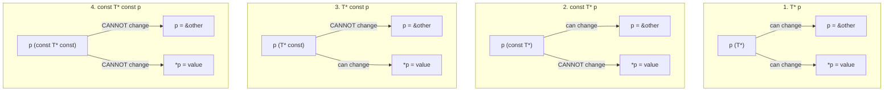

# Constant Pointers and Pointers to Constants

## Why This Matters

The `const` keyword in C++ is the cornerstone of **const correctness** — the discipline of marking every value, parameter, and member function `const` unless it genuinely needs to be modified. Const correctness is not just a stylistic preference; it is the difference between code that the compiler can reason about (and optimize, parallelize, and check) and code that it cannot.

When `const` meets pointers, four distinct meanings emerge depending on where `const` appears:
1. `T* p` — neither the pointer nor the pointee is const.
2. `const T* p` (or `T const* p`) — the pointee is const, the pointer is not.
3. `T* const p` — the pointer is const, the pointee is not.
4. `const T* const p` — both are const.

Mastering this taxonomy is essential for writing const-correct APIs, for understanding compiler diagnostics about const mismatches, and for reading the C++ Standard Library (where `const T*` appears in nearly every container's `const` method). The reading trick — read right-to-left — turns the syntax from a puzzle into a habit.

## Background

`const` was introduced in C++ (and later retrofitted into C) to express immutability at the type level. Before `const`, C programmers used `#define` and comments to signal "do not modify this"; the compiler could not help. With `const`, the compiler enforces immutability, can place data in read-only memory (`.rodata`), and can refuse to compile code that tries to modify it.

When applied to pointers, `const` can attach to either the pointer itself or to the type it points to. The placement matters: `const int* p` and `int* const p` mean different things, and `const int* const p` means both. The syntax is consistent (the `const` qualifies whatever is to its left, with the special case that `const T` and `T const` are equivalent when `const` appears first), but it takes practice to read fluently.

## Main Content

### 1. The Four Variants

Here is the complete taxonomy in one place:

| Declaration              | Can change `p` (the pointer)? | Can change `*p` (the pointee)? |
|--------------------------|--------------------------------|--------------------------------|
| `T* p`                   | Yes                            | Yes                            |
| `const T* p` (= `T const* p`) | Yes                       | No                             |
| `T* const p`             | No                             | Yes                            |
| `const T* const p`       | No                             | No                             |

### 2. Variant 1: `T* p` — Mutable Pointer, Mutable Pointee

```cpp
int a = 10;
int b = 20;
int* p = &a;

*p = 15;       // OK — modify the pointee
p = &b;        // OK — reassign the pointer
```

No `const` anywhere; everything can be modified.

### 3. Variant 2: `const T* p` — Pointer to Const

```cpp
int a = 10;
int b = 20;
const int* p = &a;     // p points to "const int"

// *p = 15;            // ERROR — cannot modify *p through p
p = &b;                // OK — p can be reassigned

// Important: 'a' and 'b' are NOT themselves const
a = 25;                // OK — modifying a directly, not through p
```

`const T* p` (equivalently `T const* p`) means: **you cannot modify the pointee through this pointer**. The pointee itself might or might not be `const` in absolute terms — you just cannot modify it through `p`. This is the most common form in function parameters: `void f(const std::string* s)` says "I will read what `s` points to but not modify it".

This form is essential for **const-correct APIs**: it lets a function accept both `const T` and non-`const T` arguments without forcing the caller to make a copy.

### 4. Variant 3: `T* const p` — Const Pointer

```cpp
int a = 10;
int b = 20;
int* const p = &a;     // p is a const pointer

*p = 15;               // OK — modify the pointee
// p = &b;             // ERROR — cannot reassign p
```

`T* const p` means: **the pointer itself is const** — it cannot be reassigned to point elsewhere after initialization. But the pointee can still be modified through `p`.

This form is useful when:
- A pointer must always point to the same object for its entire lifetime (e.g. a pointer member in a class that should not be rebindable).
- You want to express a hardware register address that is fixed by the platform.
- You want to enforce the invariant "this pointer is bound once, never reseated".

### 5. Variant 4: `const T* const p` — Both Const

```cpp
const int a = 10;
const int* const p = &a;

// *p = 15;             // ERROR — cannot modify the pointee
// p = &b;              // ERROR — cannot reassign the pointer
```

Both are const. Neither the pointer nor the pointee can be modified. This form is rare in everyday code but appears in:
- Compile-time constant lookup tables of pointers.
- Embedded systems where memory-mapped registers are at fixed addresses with read-only semantics.
- Some standard library internals where absolute immutability is required.

### 6. The Four Variants Diagram



Each subgraph shows what you can and cannot change for that variant.

### 7. The Reading Trick: Right-to-Left

The mnemonic that unlocks the syntax: **read declarations right-to-left**.

- `const int* p` → "p is a pointer (`*`) to an `int` that is `const`"
- `int* const p` → "p is a `const` pointer (`*`) to an `int`"
- `const int* const p` → "p is a `const` pointer (`*`) to an `int` that is `const`"

The rule: each `const` qualifies whatever is *immediately to its left* (or, if there is nothing to its left, the type to its right).

```cpp
const int* p;        // const qualifies int: pointer to const int
int const* p;        // same — const qualifies int
int* const p;        // const qualifies *: const pointer to int
const int* const p;  // both: const pointer to const int
int const* const p;  // same as above — fully equivalent
```

The two forms `const T*` and `T const*` are *exactly* equivalent. Some C++ programmers prefer `T const*` because it makes the right-to-left rule uniform (everything is read right-to-left with no special case for leading `const`).

### 8. Const Correctness in Function Parameters

The standard idiom for read-only function parameters:

```cpp
// Read-only access to a large object — no copy, no modification
void print(const std::string& s);
void print(const std::string* s);    // pointer variant (allows nullptr)
```

The reference form (`const T&`) is preferred when the parameter is mandatory; the pointer form (`const T*`) is preferred when the parameter is optional (`nullptr` allowed).

For built-in types like `int`, `double`, and raw pointers, pass by value is at least as efficient as pass by `const T&`:

```cpp
void f(int x);              // preferred for int
void f(const int x);        // redundant — the copy is yours anyway
void f(const int& x);       // unnecessary indirection
```

The Core Guidelines recommend `const T&` for "any type larger than two words" (about 16 bytes on x86-64).

### 9. Const Correctness Propagates

Const correctness is viral: if you mark one thing `const`, every type that touches it must also be const-correct. Consider:

```cpp
struct Person {
    std::string name;
    std::string* get_name_ptr() { return &name; }   // non-const getter
};

void print(const Person& p) {
    // p.get_name_ptr();   // ERROR — would call non-const method on const Person
}
```

To fix, provide a `const` overload:

```cpp
struct Person {
    std::string name;
    const std::string* get_name_ptr() const { return &name; }
    std::string* get_name_ptr() { return &name; }
};
```

Now `print` can call the `const` overload. The pattern is verbose but necessary for const correctness.

### 10. Conversion Rules

Const conversions follow these rules:
- **`T*` → `const T*`**: implicit, safe (adding const).
- **`const T*` → `T*`**: requires `const_cast`, dangerous (removing const). Modifying a genuinely const object through such a cast is undefined behavior.

```cpp
int a = 10;
const int* cp = &a;       // OK — implicit promotion
int* p = cp;              // ERROR — would discard const
int* p = const_cast<int*>(cp);   // OK — but use with caution
*p = 20;                  // OK because 'a' is not const

const int b = 5;
const int* cbp = &b;
int* bad = const_cast<int*>(cbp);
*bad = 10;                // UB — 'b' was declared const
```

The lesson: `const_cast` is safe only when you *know* the underlying object was not declared `const`. Use it sparingly, typically for interop with C APIs that are not const-correct.

### 11. `const` Member Functions

A `const` member function promises not to modify the object:

```cpp
struct Point {
    int x, y;
    int get_x() const { return x; }   // const member function
    void set_x(int v) { x = v; }      // non-const
};

const Point p{1, 2};
p.get_x();    // OK — const member function on const object
// p.set_x(5); // ERROR — non-const member function on const object
```

Mark every member function that does not modify state as `const`. This is non-negotiable for const correctness.

### 12. `mutable` — The Escape Hatch

Sometimes a member function logically does not modify state, but a member variable changes (e.g. a cache, a mutex, a debug counter). Mark that member `mutable`:

```cpp
struct Cache {
    mutable std::mutex m;
    mutable std::optional<Value> cached;
    Value compute() const {
        std::lock_guard lock(m);          // OK even though const
        if (cached) return *cached;
        cached = compute_expensive();
        return *cached;
    }
};
```

`mutable` should be rare. Common legitimate uses: caches, mutexes, atomic counters, and lazy initialization.

### 13. `constexpr` vs `const`

- `const` means "this value cannot be modified after initialization". The value may be computed at runtime.
- `constexpr` means "this value can be computed at compile time". It implies `const`.

```cpp
const int runtime_x = some_runtime_value();   // OK
constexpr int compile_x = 42;                  // OK — must be compile-time
// constexpr int bad = some_runtime_value();   // ERROR
```

Prefer `constexpr` over `const` when the value is known at compile time.

## Common Pitfalls

> [!warning] Confusing `const T*` with `T* const`
> `const int* p` means pointer to const int. `int* const p` means const pointer to int. They are different.

> [!warning] Stripping const via `const_cast` on a genuinely const object
> Modifying a truly `const` object through a `const_cast` is undefined behavior. The compiler may have placed it in read-only memory.

> [!warning] Calling a non-const member function on a const object
> ```cpp
> const std::string s = "hi";
> s[0] = 'H';    // ERROR — operator[] const returns const char&
> ```

> [!warning] Returning a non-const reference from a const member
> ```cpp
> struct Bad { int x; int& get() const { return x; } };   // ERROR
> ```

> [!warning] Forgetting `const` on getters
> A non-const getter cannot be called on a const instance, breaking const correctness for users.

> [!warning] `const T*` does not mean the object is const
> It means *you* cannot modify the object through this pointer. Other code with a non-const pointer can.

> [!warning] Member pointers and `const`
> `const std::unique_ptr<T>` means the unique_ptr itself is const — you cannot reset it, but you can still modify the `T` it points to. To make the pointee const, use `std::unique_ptr<const T>`.

> [!warning] Returning a pointer to a local
> Even with const-correct types, returning `&local` from a function is UB.

## Tips and Tricks

- **Read declarations right-to-left**: `const T* p` is "pointer to const T"; `T* const p` is "const pointer to T".
- **Default to `const`**: every variable, parameter, and member function that does not need to be modified should be `const`.
- **Use `const T&` for read-only parameters** larger than two words.
- **Use `const T*` for optional read-only parameters** that may be `nullptr`.
- **Use `T* const` for pointers that must never be reseated** (e.g. pointer members bound in a constructor).
- **Use `constexpr` instead of `const`** for values known at compile time.
- **Mark every non-mutating member function `const`** — without exception.
- **Use `mutable`** only for members that change in const methods (caches, mutexes).
- **Avoid `const_cast`** except for C-API interop.
- **Lock down const correctness early** in a project — retrofitting it is much harder than building it in.
- **Pair `const T*` parameters with `[[nodiscard]]`** when returning derived data.

## Active Recall

1. What is the difference between `const int* p` and `int* const p`?
2. What is the difference between `const T* p` and `T const* p`?
3. Read `const int* const p` right-to-left in English.
4. Can you assign an `int*` to a `const int*`? Why or why not?
5. Can you assign a `const int*` to an `int*`? What is required?
6. Why is it UB to modify a genuinely const object through a `const_cast`?
7. Why must getters be marked `const`?
8. What does `mutable` allow, and when should you use it?
9. What is the difference between `const` and `constexpr`?
10. Why is `const std::unique_ptr<T>` different from `std::unique_ptr<const T>`?

## Next Steps

- Continue to [[9. Pointers to Functions]] to see how `const` interacts with function pointers.
- For const correctness in member functions, see Chapter 9 on Object-Oriented Programming.
- For `constexpr` and compile-time programming, see Chapter 10 on Templates and Metaprogramming.
- For const-correct C API interop, see Chapter 21 on C++ and Python Interoperability.
