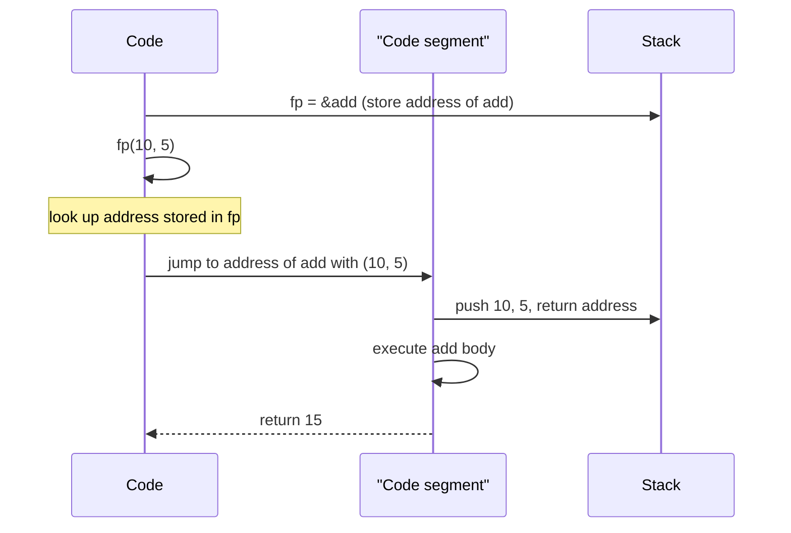

# Pointers to Functions

## Why This Matters

A function pointer is a variable that stores the address of a function. With it, you can:
- Dispatch a call dynamically at runtime (e.g. a strategy pattern, an event handler, a state-machine transition).
- Pass a callback to a function (e.g. `qsort`'s comparator, `std::sort`'s comparator before lambdas, a thread's entry point).
- Build tables of functions indexed by opcode or message ID (the classic interpreter loop).
- Implement plugin systems where new functionality is loaded at runtime via `dlsym` / `GetProcAddress`.

Function pointers are inherited from C, where they are the *only* way to abstract over behavior. C++ adds templates (compile-time polymorphism), virtual functions (runtime polymorphism via vtables), functors (classes with `operator()`), lambdas (anonymous functors), and `std::function` (a type-erased callable wrapper). For most modern C++ code, these alternatives are clearer, safer, and more composable than raw function pointers — but function pointers remain important for C interop, for `noexcept`-correct low-level dispatch, and as the underlying implementation of vtables and `std::function`.

This note covers the syntax, calling through a function pointer, `using` aliases, arrays of function pointers, callbacks, and the modern alternatives.

## Background

In C, every function lives at a fixed address in the program's code segment. You can take its address with `&func` (or just `func`, which decays to a function pointer the way an array decays to a data pointer) and store it in a variable. Calling the function through the pointer is just like calling it directly, optionally with an explicit `*` to dereference.

The syntax for declaring a function pointer is the trickiest in C:

```cpp
int (*fp)(int, int);   // fp is a pointer to function(int, int) returning int
```

The parentheses around `*fp` are mandatory because `()` (function call) binds tighter than `*` (dereference). Without them, `int *fp(int, int)` would declare a *function* returning `int*`.

C++ inherited this syntax unchanged. C++11 added lambdas (anonymous functors), and C++11 added `std::function` (a polymorphic callable wrapper). Both are usually preferable to raw function pointers in modern code.

## Main Content

### 1. Declaring a Function Pointer

```cpp
// A free function we want to point to:
int add(int a, int b) { return a + b; }
int sub(int a, int b) { return a - b; }

// Declare a function pointer:
int (*fp)(int, int);

// Assign:
fp = &add;     // explicit address-of
fp = add;      // implicit (function name decays to pointer, like arrays)

// Call:
int result1 = (*fp)(10, 5);    // explicit dereference
int result2 = fp(10, 5);       // implicit — both are equivalent
```

The function's return type and parameter types must match exactly. `int (*)(int, int)` and `int (*)(int)` are different types.

### 2. The `using` Alias — Strongly Recommended

Function pointer syntax is unreadable. Always use a `using` alias:

```cpp
using IntBinOp = int(*)(int, int);

IntBinOp fp = add;
int result = fp(10, 5);
```

`IntBinOp` is now a clean, named type you can use anywhere. This is the single biggest readability win for function pointers.

### 3. Calling Through a Function Pointer

There are two equivalent forms:

```cpp
int r1 = (*fp)(a, b);   // explicit: dereference pointer, then call
int r2 = fp(a, b);      // implicit: call directly through pointer
```

Both compile to the same machine code. The implicit form is more common in modern code; the explicit form is more common in older C.

### 4. Function Pointer Call Flow Diagram



The function pointer is just an address; calling through it is an indirect jump. This is one extra memory load compared to a direct call, but modern branch predictors handle it well for predictable call sites.

### 5. Function Pointers as Callback Parameters

A callback is a function passed as an argument to another function, to be called later:

```cpp
#include <vector>
#include <iostream>

using Comparator = bool(*)(int, int);

void sort_with(std::vector<int>& v, Comparator cmp) {
    for (size_t i = 0; i + 1 < v.size(); ++i) {
        for (size_t j = 0; j + 1 < v.size() - i; ++j) {
            if (cmp(v[j+1], v[j])) {
                std::swap(v[j], v[j+1]);
            }
        }
    }
}

bool ascending(int a, int b)  { return a < b; }
bool descending(int a, int b) { return a > b; }

int main() {
    std::vector<int> v = {3, 1, 4, 1, 5, 9, 2, 6};
    sort_with(v, ascending);
    sort_with(v, descending);
}
```

The C standard library's `qsort` takes a `int (*)(const void*, const void*)` comparator. C++'s `std::sort` takes a generic comparator that can be a function pointer, a functor, or a lambda.

### 6. Arrays of Function Pointers

A classic interpreter pattern uses an array of function pointers indexed by opcode:

```cpp
#include <iostream>

using Op = void(*)(int);

void op_push(int v) { std::cout << "push " << v << '\n'; }
void op_pop(int v)  { std::cout << "pop\n"; }
void op_add(int v)  { std::cout << "add\n"; }
void op_halt(int v) { std::cout << "halt\n"; }

int main() {
    Op dispatch[] = {op_push, op_pop, op_add, op_halt};

    int opcodes[] = {0, 1, 2, 3};
    for (int op : opcodes) {
        dispatch[op](42);
    }
}
```

This is the basis of many VM interpreters, including the original Lua and Python implementations. It is faster than a switch statement when the cases are dense and the compiler cannot predict the branch.

### 7. Member Function Pointers

Pointers to *non-static member functions* are different animals. They require an object to be called on, and the syntax is different:

```cpp
struct Widget {
    int value = 0;
    void set(int v) { value = v; }
    int  get() const { return value; }
};

int main() {
    Widget w;
    void (Widget::*setter)(int) = &Widget::set;
    (w.*setter)(42);            // call on w — note .* operator
    std::cout << w.get() << '\n';   // 42

    Widget* wp = &w;
    (wp->*setter)(100);         // call through pointer — note ->* operator
    std::cout << w.get() << '\n';   // 100
}
```

Member function pointers are typically the size of two regular pointers (they encode both the function address and a virtual-dispatch offset). They are rare in modern C++ because lambdas and `std::function` are cleaner; but they appear in some callback APIs (e.g. some GUI frameworks) and in `std::function`'s implementation.

### 8. `std::function` — The Modern Alternative

`std::function<R(Args...)>` (C++11, in `<functional>`) is a polymorphic callable wrapper that can hold:
- Function pointers.
- Functors (classes with `operator()`).
- Lambdas (including capturing lambdas).
- Bind expressions.
- Member function pointers (with `std::mem_fn`).

```cpp
#include <functional>
#include <iostream>

int add(int a, int b) { return a + b; }

int main() {
    std::function<int(int, int)> f = add;
    std::cout << f(2, 3) << '\n';   // 5

    f = [](int a, int b) { return a * b; };
    std::cout << f(2, 3) << '\n';   // 6
}
```

`std::function` costs:
- Heap allocation if the callable is large (typically > 16-24 bytes — small-object-optimization is implementation-defined).
- One indirect call (same as a function pointer).
- A virtual-like dispatch through a vtable.

For most callback use cases, this overhead is negligible. For tight inner loops, prefer a function pointer, a templated functor, or a lambda.

### 9. Lambdas — The Cleanest Callback

A lambda creates an anonymous functor with `operator()`:

```cpp
#include <vector>
#include <algorithm>
#include <iostream>

int main() {
    std::vector<int> v = {3, 1, 4, 1, 5, 9, 2, 6};
    int threshold = 3;

    // A capturing lambda, passed to std::sort:
    std::sort(v.begin(), v.end(), [threshold](int a, int b) {
        if ((a < threshold) != (b < threshold)) return a < threshold;
        return a < b;
    });

    for (int x : v) std::cout << x << ' ';
}
```

A non-capturing lambda decays to a function pointer:

```cpp
int (*fp)(int, int) = [](int a, int b) { return a + b; };
```

A capturing lambda does *not* decay to a function pointer (because it has state that must live somewhere). Use `std::function` for capturing lambdas passed across API boundaries.

### 10. Comparison Table

| Feature                        | Raw function pointer              | Lambda (non-capturing) | Lambda (capturing)     | `std::function`             |
|--------------------------------|-----------------------------------|------------------------|------------------------|------------------------------|
| Can capture state              | No                                | No                     | Yes                    | Yes                          |
| Decays to function pointer     | Yes (it is one)                  | Yes                    | No                     | No                           |
| Syntax                         | Verbose                           | Concise                | Concise                | Verbose (template params)    |
| Overhead                       | None                              | None                   | Allocation if large    | Indirect call, maybe alloc   |
| Can be stored in STL container | Yes                               | Yes (auto, no type name) | Needs `std::function` | Yes                          |
| Polymorphic (any callable)     | No                                | No                     | No                     | Yes                          |
| Best for                       | C interop, low-level dispatch     | Inline callbacks       | Stateful inline callbacks | General-purpose callbacks |

### 11. The Strategy Pattern with Function Pointers

```cpp
#include <functional>
#include <iostream>

class Sorter {
public:
    using Cmp = std::function<bool(int, int)>;
    void set_strategy(Cmp c) { cmp_ = std::move(c); }
    bool less(int a, int b) const { return cmp_(a, b); }
private:
    Cmp cmp_ = [](int a, int b) { return a < b; };
};

int main() {
    Sorter s;
    s.set_strategy([](int a, int b) { return a > b; });  // descending
    std::cout << std::boolalpha << s.less(1, 2) << '\n';  // false
}
```

### 12. `noexcept` Function Pointers

C++17 added `noexcept` as part of the type system. A `void(*)() noexcept` and a `void(*)()` are different types:

```cpp
void f_noexcept() noexcept {}
void f_throwing() {}

void (*p1)()          = f_throwing;   // OK
void (*p2)() noexcept = f_noexcept;   // OK
// void (*p3)() noexcept = f_throwing; // ERROR — would lose noexcept
void (*p4)()          = f_noexcept;   // OK — implicitly convertible
```

This matters when you pass function pointers to C APIs that demand `noexcept` callbacks (e.g. some thread or signal APIs).

## Common Pitfalls

> [!warning] Forgetting the parentheses around `*fp`
> `int *fp(int, int);` declares a function returning `int*`, not a function pointer. The correct form is `int (*fp)(int, int);`.

> [!warning] Calling a null function pointer
> `fp = nullptr; fp(1, 2);` is UB. Always check before calling.

> [!warning] Calling a function pointer with the wrong signature
> Casting a function pointer to an incompatible type and calling through it is UB. The compiler may not warn.

> [!warning] Capturing lambdas cannot decay to function pointers
> `[x](int n) { return x + n; }` cannot be assigned to `int(*)(int)`. Use `std::function`.

> [!warning] Calling through a dangling function pointer
> If the function was unloaded (e.g. via `dlclose`) or the program state has changed in some platforms, calling through a stale function pointer crashes.

> [!warning] Member function pointers vs function pointers
> They are different types. A non-static member function pointer requires `.*` or `->*` to call, not just `()`.

> [!warning] `std::function` overhead in hot loops
> `std::function` adds an indirect call. In tight inner loops, prefer a templated functor or a raw function pointer.

> [!warning] `std::function` exception on empty
> Calling an empty `std::function` throws `std::bad_function_call`. Check with `if (f)` first if it may be empty.

> [!warning] ABI differences between function pointer types
> On some platforms, a pointer to a free function and a pointer to a member function have different sizes and representations. Do not assume `sizeof(fp) == sizeof(void*)`.

## Tips and Tricks

- **Always use a `using` alias** for function pointer types. `using Cmp = bool(*)(int, int);` is far more readable than `bool (*cmp)(int, int)`.
- **Prefer lambdas and `std::function`** for new C++ code. Reserve raw function pointers for C interop, opcode dispatch tables, and `noexcept`-correct low-level callbacks.
- **Prefer templates** for callback parameters when you want zero overhead — the compiler can inline the call.
- **Use `std::function` when you need type erasure** (storing heterogeneous callables in a container, crossing ABI boundaries).
- **Use non-capturing lambdas** when you want a function pointer that closes over compile-time constants.
- **Mark function pointers `noexcept`** when the target functions are `noexcept`, especially for C interop.
- **Initialize function pointers to `nullptr`** and check before calling.
- **For dispatch tables, prefer `std::array<std::function<...>, N>`** for readability, or a `static constexpr` array of function pointers for performance.
- **Avoid member function pointers** unless you need them; lambdas with `[this]` capture are usually clearer.

## Active Recall

1. Write the declaration for a pointer to a function taking `int` and returning `int`.
2. Why are the parentheses in `int (*fp)(int)` mandatory?
3. How do you call a function through a function pointer? List both forms.
4. Can a capturing lambda decay to a function pointer? Why or why not?
5. What is `std::function` and what problem does it solve?
6. What is the syntax for calling through a member function pointer?
7. Why would you use an array of function pointers in an interpreter?
8. What overhead does `std::function` add compared to a raw function pointer?
9. What exception does `std::function` throw if called when empty?
10. Since C++17, how does `noexcept` interact with function pointer types?

## Next Steps

- Continue to [[10. Pointers to Structs]] to learn about the arrow operator `->` and linked-list patterns.
- For lambdas in depth, see Chapter 8 on Modern C++.
- For templates as an alternative to function pointers, see Chapter 10 on Templates and Metaprogramming.
- For the strategy pattern and runtime polymorphism with virtual functions, see Chapter 9 on Object-Oriented Programming.
- For C interop with `dlsym` / `GetProcAddress`, see Chapter 21.
