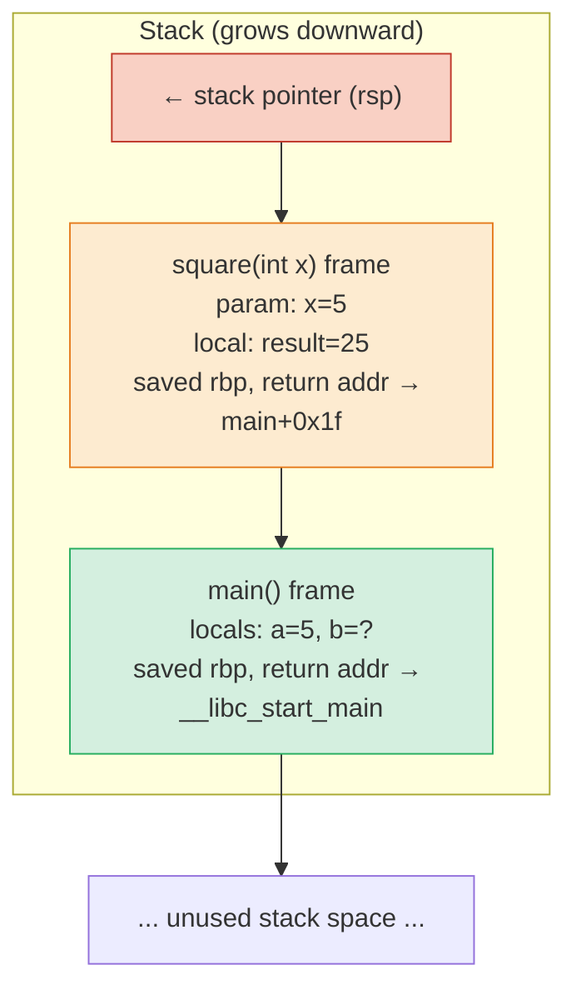
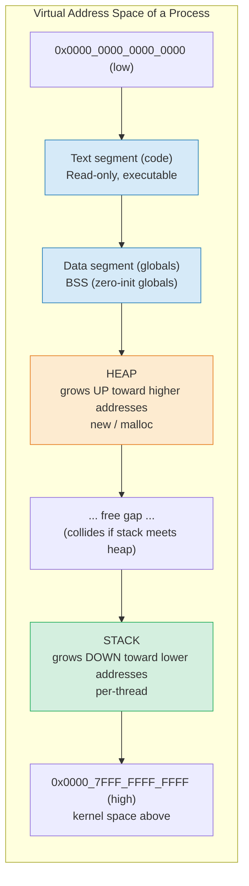

## Why This Note Matters

Every C++ program lives inside a virtual address space provided by the operating system. Within that space, memory is not a single undifferentiated pool — it is partitioned into regions whose rules, performance characteristics, and failure modes differ dramatically. The two regions you will interact with most directly are the **stack** and the **heap** (also called the **free store** in C++ standardese).

Choosing the wrong region causes real bugs: stack overflows that crash servers, heap fragmentation that bloats long-running processes, cache misses that turn fast code slow, and use-after-free vulnerabilities that attackers exploit. Mastering the difference between stack and heap is the single most important prerequisite for understanding [[5. Smart Pointers]], [[4. RAII]], and [[6. Memory Leaks and Dangling Pointers]].

## Background

Before diving into the two regions, recall the broader picture of [[2. Memory Layout of a Program]]. A running process is given a virtual address space (typically 48 bits on x86-64, giving 256 TB of addressable space, though only a fraction is actually backed by physical RAM). The OS, together with the C++ runtime, carves this space into segments: text (code), data (initialized globals), BSS (zero-initialized globals), heap, shared memory mappings, and the stack.

Of these, only the **heap** and the **stack** are where your program's *runtime* allocations go. The other segments are sized at link time. Understanding the runtime regions is therefore about understanding where your `int x = 5;` and your `new int(5);` actually live.

> [!info] Terminology
> C++ standardese distinguishes the **stack** (function-call machinery, automatic storage duration) from the **free store** (used by `new`/`delete`). The **heap** is the C-library region used by `malloc`/`free`. In practice, modern implementations route `new`/`delete` through `malloc`/`free`, so most engineers say "heap" for both. This note follows the common convention; see [[3. From C to C++ Memory Management]] for the formal distinction.

## The Stack

### What Is the Stack?

The **stack** is a contiguous region of memory used to manage function call state. It grows and shrinks in strict Last-In-First-Out (LIFO) order: when a function is called, a **stack frame** (also called an *activation record*) is pushed onto the top of the stack; when the function returns, the frame is popped.

A stack frame typically contains:

1. The function's local variables (including non-static locals and parameters passed by value).
2. The saved frame pointer of the caller (so the caller's frame can be restored).
3. The return address — the instruction in the caller to jump back to.
4. Temporary values and spilled registers that don't fit in hardware registers.
5. Bookkeeping for exception handling (on Itanium ABI used by GCC/Clang).

### How It Works

Allocation on the stack is conceptually trivial: the compiler emits code that subtracts a constant from the stack pointer register (`rsp` on x86-64). Deallocation is equally trivial: the function epilogue adds the same constant back. There is no bookkeeping, no free-list, no fragmentation, no system call.

```cpp
#include <iostream>

int square(int x) {       // frame: [saved rbp, return addr, x]
    int result = x * x;   // frame grows by sizeof(int)
    return result;        // frame is popped; result returned via register
}

int main() {
    int a = 5;            // frame for main
    int b = square(a);    // square's frame pushed, then popped
    std::cout << b;
    return 0;
}
```

The LIFO discipline guarantees that memory freed by a returning function is immediately reusable by the next call. There is never any fragmentation, and the CPU's hardware stack-pointer register is the only metadata needed.

### Mermaid — Function Call Stack Frames



### Key Characteristics

- **Automatic storage duration**: Variables declared inside a function (without `static`, `thread_local`, or dynamic storage specifiers) are allocated on the stack and destroyed automatically at scope exit. This is the foundation of [[4. RAII]].
- **Fast**: A stack allocation is one machine instruction (`sub $N, %rsp`). A stack deallocation is likewise one instruction. The stack is also almost always hot in the CPU cache, because the same few pages are reused over and over.
- **Limited size**: The OS typically grants each thread between 1 MB and 8 MB of stack (Linux default is 8 MB; Windows is 1 MB; embedded systems can be as small as a few KB).
- **LIFO discipline**: You cannot free a stack allocation in the middle of the stack; only the topmost frame can be popped.
- **No fragmentation**: Because deallocation is always at the top, the stack never fragments.

### When the Stack Fails: Stack Overflow

A **stack overflow** occurs when the program tries to push more onto the stack than the OS has granted. Common causes:

1. **Unbounded recursion** — each recursive call adds a frame; a recursion depth of a few hundred thousand will exhaust a typical stack.
2. **Very large local arrays** — e.g., `int buf[10'000'000];` in a single function will likely overflow.
3. **Deeply nested call chains** in metaprogramming-heavy code.

When a stack overflow happens, the OS raises a `SIGSEGV` (segmentation fault) and the process is killed. This is a hard crash, not a recoverable error.

```cpp
// Classic stack overflow
int recurse() {
    return recurse();   // no base case — eventually SIGSEGV
}

// Large local allocation
void big_buffer() {
    int buf[1 << 20];   // 4 MB of ints — risky on a 1 MB stack
    // ...
}
```

> [!warning] Stack size is per-thread
> Each thread gets its own stack. Spawning 1000 threads with a 1 MB stack each consumes 1 GB of *virtual* address space (most of it never paged in). On 32-bit systems this is fatal; on 64-bit it is wasteful but tolerable. Use `pthread_attr_setstacksize` (POSIX) or `std::thread` constructor attributes to tune.

## The Heap

### What Is the Heap?

The **heap** is a large region of memory managed by a general-purpose allocator (typically `malloc`/`free` from glibc's `ptmalloc2`, or `jemalloc`/`tcmalloc`/`mimalloc` for performance-critical code). Unlike the stack, the heap has no LIFO discipline: you can allocate a block, then another, then free the first one while keeping the second. This flexibility is essential for objects whose lifetimes don't follow a strict nesting pattern.

### How It Works

When you write `new Foo(args)`, two things happen:

1. **Allocation**: `operator new(sizeof(Foo))` is called, which eventually asks the allocator for `sizeof(Foo)` bytes. The allocator may serve this from an existing free chunk, or may request more memory from the OS via `mmap` (for large allocations) or `sbrk` (for small ones, on legacy systems).
2. **Construction**: The allocated memory is passed to `Foo`'s constructor, which initializes the object.

Deallocation reverses this:

1. **Destruction**: `delete ptr` first calls `ptr->~Foo()`.
2. **Deallocation**: `operator delete(ptr)` returns the raw bytes to the allocator, which may merge them with neighboring free chunks.

The allocator maintains internal data structures (segregated free lists, size-class bins, red-black trees of free chunks) to satisfy future `new` requests quickly. This bookkeeping is why heap allocation is far slower than stack allocation.

### Key Characteristics

- **Dynamic storage duration**: Objects live until explicitly destroyed (`delete`) or until released by a smart pointer's destructor.
- **Flexible size**: The heap is bounded by available RAM plus swap, which on a modern server is many orders of magnitude larger than the stack.
- **Slower access**: There are two costs. First, the *allocation* itself takes hundreds of nanoseconds (vs. ~1 ns for the stack). Second, the *access pattern* is often cache-unfriendly, because heap objects are scattered across pages.
- **Fragmentation**: Repeated allocation and deallocation of differently sized blocks leaves holes. Eventually the heap can be unable to satisfy a request even though enough total free bytes exist.
- **Manual or automated management**: In legacy C++ you call `delete`; in modern C++ you use [[5. Smart Pointers]] or [[4. RAII]] containers.

### Mermaid — Stack Growth vs. Heap Growth



The two regions grow toward each other. If they meet, the process has run out of address space and allocations start failing. In practice the OS resizes each region via `mmap` and page faults, but the conceptual model of "heap grows up, stack grows down" is correct and is what textbooks and interviewers expect you to know.

## Stack Overflow vs. Heap Exhaustion

These are two distinct failure modes that beginners often conflate.

| Failure | Region | Trigger | Symptom | Recoverable? |
|---|---|---|---|---|
| **Stack overflow** | Stack | Recursion too deep; huge local array | `SIGSEGV`, immediate crash | No |
| **Heap exhaustion** | Heap | `new` fails when no memory is left | `std::bad_alloc` exception (or null with `nothrow`) | Yes, if you catch and handle it |
| **Stack collision** | Stack | Bug in OS/threading | Memory corruption | No |

In modern C++, a `new` that fails throws `std::bad_alloc`. You can opt into the no-throw version with `new (std::nothrow) Foo`, which returns `nullptr` on failure (see [[3. From C to C++ Memory Management]]).

## Performance: Cache Locality

The single most important practical reason to prefer the stack is **cache locality**. Modern CPUs are 100–1000× faster than main memory; the only way they achieve peak performance is by keeping hot data in L1/L2/L3 caches.

- The stack is *always* hot in cache because the same handful of pages are reused millions of times per second.
- Heap allocations are scattered. Each `new` may land in a different page; accessing them incurs a cache miss (~100 ns) or worse, a TLB miss (~300 ns).

This is why a `std::vector<int>` (whose elements live on the heap but are *contiguous*) outperforms a `std::list<int>` (also heap, but with pointer-chasing between nodes) for almost every workload, despite both being "heap data structures". Contiguity is what makes the heap usable.

A microbenchmark making the difference concrete:

```cpp
#include <chrono>
#include <iostream>

struct Big { int data[16]; };

void stack_alloc() {
    for (int i = 0; i < 1'000'000; ++i) {
        Big b{};          // stack allocation — ~1 ns
        b.data[0] = i;
        asm volatile("" : : "r"(&b) : "memory");  // prevent optimization
    }
}

void heap_alloc() {
    for (int i = 0; i < 1'000'000; ++i) {
        Big* b = new Big{};     // heap allocation — ~50–200 ns
        b->data[0] = i;
        delete b;
        asm volatile("" : : "r"(b) : "memory");
    }
}

int main() {
    using namespace std::chrono;
    auto t1 = high_resolution_clock::now();
    stack_alloc();
    auto t2 = high_resolution_clock::now();
    heap_alloc();
    auto t3 = high_resolution_clock::now();
    std::cout << "Stack: " << duration_cast<microseconds>(t2 - t1).count() << " us\n";
    std::cout << "Heap:  " << duration_cast<microseconds>(t3 - t2).count() << " us\n";
}
```

Typical output on a 3 GHz x86-64 machine: stack version ~500 µs, heap version ~50,000 µs. That's a 100× gap — purely from allocator overhead and cache effects.

## When to Use Each

### Use the Stack When…

- The object's lifetime is lexically scoped (a `for` loop body, a function body, a block).
- The size is known at compile time and small (rule of thumb: < a few KB).
- You need maximum performance.
- The object is a value type with simple identity (e.g., `std::string_view`, `std::span`, small PODs).

### Use the Heap When…

- The object's lifetime must extend beyond the scope that created it (e.g., a value returned from a factory function and used by the caller).
- The size is determined at runtime (variable-length buffers, dynamic arrays).
- The object is large (megabytes) and would overflow the stack.
- You need polymorphism through a base-class pointer (`std::unique_ptr<Shape>`).
- You need shared ownership ([[5. Smart Pointers]]'s `std::shared_ptr`).

### Default to Stack, Reach for Heap Deliberately

This is the single most important rule in C++ memory management. Stack is the default; heap is a tool you reach for when stack cannot work. Modern C++ makes this easy: prefer `std::array<T, N>` over `new T[N]`, prefer `std::vector<T>` over manual arrays, prefer `std::variant` over a polymorphic `new`, prefer `std::string` over `char*` from `new`.

## Putting It Together: A Worked Example

```cpp
#include <iostream>
#include <memory>
#include <vector>

struct Particle {
    float x, y, z;
    float vx, vy, vz;
};

Particle compute_on_stack() {
    Particle p{0, 0, 0, 1, 0, 0};      // stack — fast
    // ... do physics ...
    return p;                          // copy elision: no extra cost
}

std::unique_ptr<std::vector<Particle>> make_simulation(std::size_t n) {
    // heap — n is runtime, vector is large
    auto sim = std::make_unique<std::vector<Particle>>(n);
    for (auto& p : *sim) p = compute_on_stack();
    return sim;                        // ownership transferred to caller
}

int main() {
    auto sim = make_simulation(100'000);  // heap owns the array
    for (const auto& p : *sim) {          // contiguous, cache-friendly
        std::cout << p.x << ',' << p.y << ',' << p.z << '\n';
    }
}                                              // sim destroyed → vector → Particles freed
```

Notice that even though `Particle` objects live on the heap (inside the vector), the *vector itself* manages them contiguously. We get the flexibility of the heap with the cache performance of an array.

## Common Pitfalls

> [!danger] Returning a pointer to a stack variable
> ```cpp
> int* dangling() {
>     int x = 42;
>     return &x;       // x is destroyed here — pointer dangles
> }
> ```
> This is undefined behavior and a classic dangling-pointer bug. See [[6. Memory Leaks and Dangling Pointers]].

> [!danger] Deep recursion with large frames
> A 4 KB stack frame times 100,000 recursive calls equals 400 MB — well over the default stack limit. Convert to iteration, or use an explicit heap-allocated work stack.

> [!warning] Forgetting `delete` after `new`
> Pre-RAII code is riddled with this. Even one missing `delete` in an exception path leaks. Always wrap heap ownership in a smart pointer; see [[5. Smart Pointers]].

> [!warning] Mixing `new`/`delete` with `new[]`/`delete[]`
> `Foo* p = new Foo; delete[] p;` is undefined behavior. Match the form.

> [!tip] Stack is per-thread, heap is process-wide
> Spawning a thread is therefore cheap in heap terms (no fragmentation shared) but each thread consumes its own stack memory. Tune thread stack size if you spawn many.

## Tips and Tricks

1. **Profile before optimizing**: The cache-locality argument is real but your hotspot may be elsewhere. Use `perf`, `VTune`, or `tracy` before refactoring.
2. **Use `std::array` instead of C arrays**: Same stack performance, adds bounds info and STL compatibility.
3. **Reserve vector capacity**: `vec.reserve(n)` avoids repeated heap allocations and copies when you know the size up front.
4. **Avoid `std::list`** almost always. Its node-per-element heap allocation pattern is cache-hostile. Use `std::vector` even for "list-like" workloads.
5. **Know your stack size**: On Linux, `ulimit -s` shows the per-thread stack limit in KB. `ulimit -s unlimited` removes the limit (dangerous on 32-bit).
6. **Custom allocators** ([[7. Custom Allocators]]) can give you heap-like flexibility with stack-like speed when you control the access pattern.
7. **Placement new** lets you construct an object in already-allocated memory — useful for pools and arenas (see [[7. Custom Allocators]]).

## Stack vs. Heap: A Decision Matrix

The table below condenses every dimension discussed so far into a single reference. Print it, stick it on your monitor, and consult it whenever you reach for `new`.

| Dimension | Stack | Heap |
|---|---|---|
| Storage duration | Automatic (scope-bound) | Dynamic (manual or smart-pointer-bound) |
| Allocation cost | ~1 ns (one `sub` instruction) | ~50–500 ns (allocator bookkeeping) |
| Deallocation cost | ~1 ns (one `add` instruction) | ~50–500 ns |
| Size limit | ~1–8 MB per thread (OS-set) | Available RAM + swap (TB-scale) |
| Growth direction | Downward (toward lower addresses) | Upward (toward higher addresses) |
| Fragmentation | Impossible (LIFO) | Common |
| Cache locality | Excellent (hot pages reused) | Often poor (scattered pages) |
| Thread safety | Automatic (per-thread stack) | Allocator-locked or thread-cached |
| Failure mode | `SIGSEGV` (hard crash) | `std::bad_alloc` (recoverable) |
| Exception safety | Automatic via destructors | Requires RAII/smart pointers |
| Lifetime control | Lexical scope | Explicit (`delete`) or smart |
| Suitable for | Small, scoped, value types | Large, dynamic, polymorphic, long-lived |
| Inspect via | `ulimit -s`, `/proc/<pid>/stack` | `malloc_stats()`, `jemalloc` stats, `/proc/<pid>/maps` |

## A Deeper Look: Why the Stack Is Always Fast

It's worth understanding *why* the stack is so dramatically faster than the heap, beyond "one instruction vs. many". Three reasons compound:

1. **Instruction count**: A stack allocation is `sub $N, %rsp` — one instruction, decoded in one cycle. A heap allocation calls into `malloc`, which walks free-lists, possibly locks a mutex, possibly asks the OS for more pages (a syscall, ~1 µs).

2. **Branch predictability**: The stack pointer always moves by compile-time-constant amounts. The CPU's branch predictor and prefetcher handle this perfectly. Heap allocation paths contain data-dependent branches (does this free block fit? does this size class have a free slot?).

3. **Cache behavior**: A typical program touches the same few stack pages millions of times per second. They are *guaranteed* to be in L1 cache. Heap pages are accessed sparsely; even if your program touches many of them, the working set is larger and L1/L2 evictions are common.

These three effects multiply. A 100× gap between stack and heap is not unusual, and on workloads with high allocation churn it can be 1000×.

## When the Stack Wins Even When You Think It Shouldn't

Modern C++ has several idioms that push work onto the stack that you might assume must be heap-allocated:

- **Small Buffer Optimization (SBO)** in `std::string` and `std::function`: small payloads live inside the object itself (typically 15–24 bytes), avoiding any heap allocation. This is why `std::string s = "hi";` is essentially free.
- **Return value optimization (RVO) / NRVO**: returning a large object by value often involves no copy and no heap allocation — the compiler constructs the return value directly in the caller's frame.
- **`std::variant` / `std::optional`**: hold their state inline, in the parent's storage, with no heap allocation regardless of which alternative is active.
- **`std::array<T, N>`**: a stack-allocated fixed-size array with STL iterator semantics.

These features let you write code that *looks* dynamic but executes with stack-like speed. Always prefer them over manual heap allocation.

## A Note on Multithreading

Each thread gets its own stack — they do not share the main thread's stack. This is what makes stack allocation inherently thread-safe: no locks, no contention. The heap, by contrast, is shared across the process, so the allocator must synchronize (via per-thread caches in modern allocators like `tcmalloc`/`jemalloc`/`mimalloc`, but still).

When you spawn many threads, remember: each one allocates its own stack (default 8 MB on Linux, virtual-only until touched). 1000 threads × 8 MB = 8 GB of *virtual* address space. On 64-bit systems this is fine, but on 32-bit it's fatal. Tune the stack size via `pthread_attr_setstacksize` (POSIX) or the `std::thread` constructor.

## Active Recall

1. Name three things stored in a stack frame.
2. Why does the stack never fragment, while the heap often does?
3. What is the default stack size on Linux x86-64? On Windows?
4. What exception is thrown when `new` fails? How do you opt out?
5. Why does a `std::vector<int>` usually beat a `std::list<int>` despite both using the heap?
6. Give two distinct causes of stack overflow.
7. Why is the stack almost always cache-hot, while the heap often is not?
8. What is the LIFO discipline, and what allocation patterns does it forbid?
9. When should you prefer stack allocation, and when heap?
10. How does `return p;` for a stack-allocated `Particle` avoid a copy? (Hint: copy elision / NRVO.)
11. Why is stack allocation inherently thread-safe while heap allocation requires synchronization?
12. Give two examples of C++ features that look dynamic but are actually stack-allocated (SBO, RVO, variant).
13. Why is `sizeof(std::string)` typically 32 bytes even when the string is "hi"?

## Next Steps

- Continue to [[2. Memory Layout of a Program]] to see how the stack and heap fit alongside the text, data, BSS, and mmap regions of a running process.
- Then read [[3. From C to C++ Memory Management]] for the evolution from `malloc`/`free` to `new`/`delete` to RAII.
- [[4. RAII]] explains the *idiom* that makes stack allocation so powerful in C++.
- [[5. Smart Pointers]] shows how to bring RAII to heap memory.
- [[6. Memory Leaks and Dangling Pointers]] dives into the failure modes introduced when you bypass these idioms.
- [[7. Custom Allocators]] shows how to get heap flexibility with stack-like speed when you really need it.
